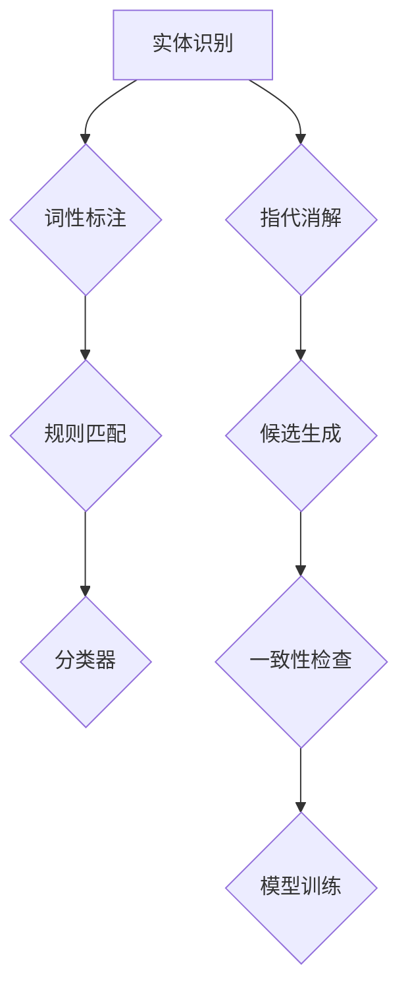
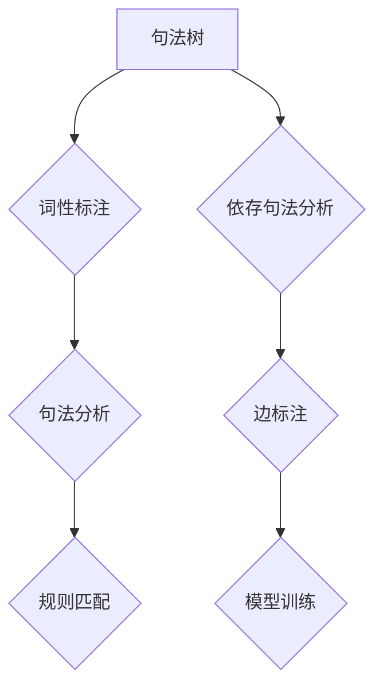
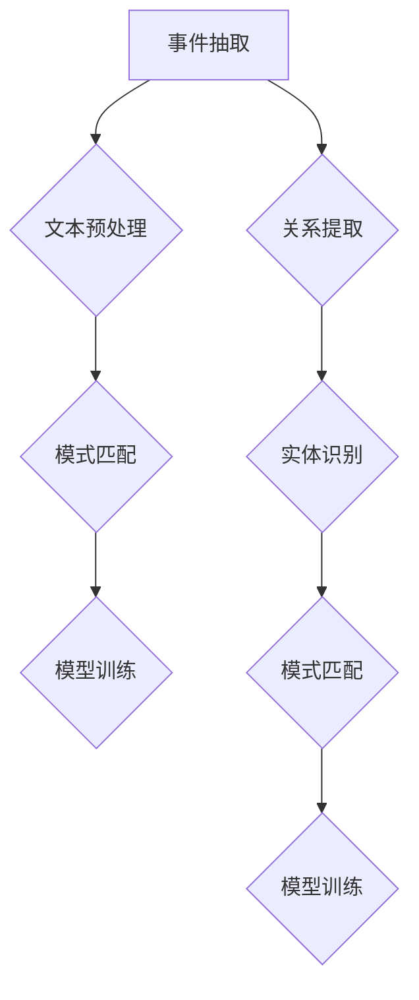
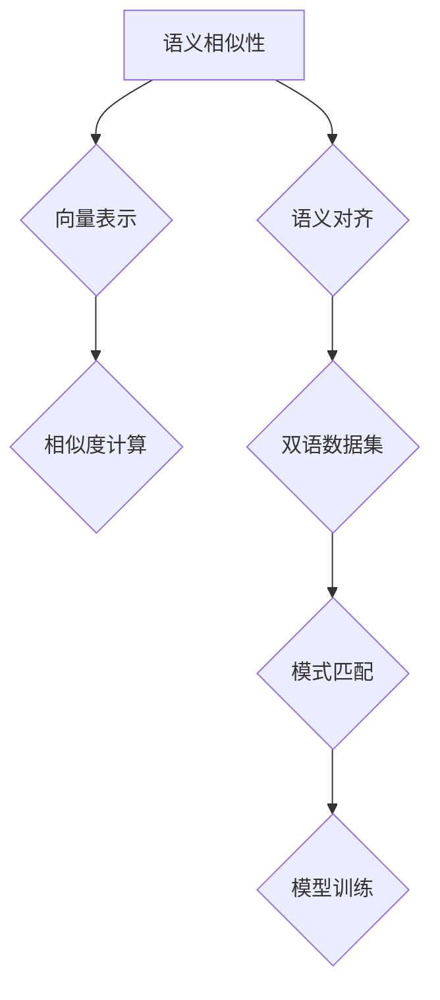

                 

### 《提示词工程在自然语言推理中的进展》

---

关键词：自然语言推理、提示词工程、深度学习、算法、应用场景

摘要：本文旨在探讨自然语言推理中的提示词工程，详细分析其核心概念、设计原则、应用场景和未来方向。通过系统的理论阐述和实践案例分析，本文揭示了提示词工程在自然语言处理中的关键作用，以及如何利用深度学习提升其效能。文章结构清晰，内容丰富，旨在为读者提供全面而深入的理解。

### 目录大纲：

```markdown
----------------------------------------------------------------
# 《提示词工程在自然语言推理中的进展》

# 第一部分：引论

## 第1章：自然语言推理背景与提示词工程概述
### 1.1 自然语言推理的基本概念与发展历程
### 1.2 提示词工程的基本概念与作用
### 1.3 提示词工程的发展现状与挑战
### 1.4 本书结构安排与主要内容

## 第2章：自然语言推理中的核心概念
### 2.1 实体识别与指代消解
### 2.2 语义角色标注与依存句法分析
### 2.3 事件抽取与关系提取
### 2.4 语义相似性与语义对齐
### 2.5 自然语言推理中的核心算法对比分析

## 第3章：提示词工程的设计原则与策略
### 3.1 提示词设计的理论基础
### 3.2 提示词选择策略
### 3.3 提示词优化方法
### 3.4 提示词工程在不同场景的应用

## 第4章：提示词工程在自然语言推理中的应用
### 4.1 提示词在文本分类中的应用
### 4.2 提示词在情感分析中的应用
### 4.3 提示词在机器翻译中的应用
### 4.4 提示词在问答系统中的应用

## 第5章：深度学习在提示词工程中的应用
### 5.1 深度学习基础
### 5.2 基于深度学习的提示词生成方法
### 5.3 基于深度学习的提示词优化方法
### 5.4 深度学习在提示词工程中的实践案例分析

## 第6章：提示词工程中的挑战与未来方向
### 6.1 提示词工程中的主要挑战
### 6.2 提示词工程的未来发展趋势
### 6.3 提示词工程在各领域的应用前景
### 6.4 提示词工程的研究热点与趋势分析

## 第7章：总结与展望
### 7.1 本书内容的总结
### 7.2 提示词工程的价值与影响
### 7.3 提示词工程的未来展望
### 7.4 研究者与从业者的建议

----------------------------------------------------------------
```

---

接下来，我们将一步步深入探讨每一章的内容，以便构建出完整的文章结构。首先，我们从自然语言推理的背景开始，引导读者进入提示词工程的领域。

## 第1章：自然语言推理背景与提示词工程概述

### 1.1 自然语言推理的基本概念与发展历程

自然语言推理（Natural Language Inference，NLI）是指机器理解和推断语句间逻辑关系的能力。它起源于自然语言处理（NLP）的早期研究，目标是使计算机能够理解自然语言语句中的隐含意义和逻辑推理。

#### 背景介绍

自然语言推理的发展可以追溯到20世纪50年代，当时的学者开始研究如何让计算机理解和生成自然语言。随着计算能力的提升和算法的进步，NLI研究取得了显著进展。目前，NLI广泛应用于问答系统、对话系统、文本分类和情感分析等领域。

#### 问题背景

在实际应用中，自然语言推理面临的挑战主要包括：

1. 语言的多义性和不确定性：自然语言充满歧义，同一词语在不同的语境下可能具有不同的含义。
2. 语句间的复杂逻辑关系：自然语言中的推理涉及多种逻辑关系，如蕴含、矛盾、无关等。
3. 知识图谱的不完整性：现有的知识图谱可能无法覆盖所有语言现象，影响NLI系统的性能。

#### 问题解决

为了解决上述问题，研究者们提出了多种算法和模型，如基于规则的方法、统计方法、深度学习方法等。这些方法各有优缺点，但都旨在提升NLI系统的准确性和鲁棒性。

#### 边界与外延

自然语言推理的研究边界包括但不限于：

1. 理解自然语言中的隐含意义。
2. 推断语句间的逻辑关系。
3. 鲁棒地处理语言中的歧义现象。

其外延则涵盖各种应用场景，如智能客服、智能推荐、智能写作等。

#### 概念结构与核心要素组成

自然语言推理的核心概念包括：

1. **实体识别**：识别文本中的关键实体。
2. **指代消解**：理解实体间的指代关系。
3. **语义角色标注**：标注句子中的动作和参与者。
4. **依存句法分析**：分析句子成分间的依赖关系。
5. **事件抽取**：从文本中提取关键事件。
6. **关系提取**：提取文本中描述的关系。
7. **语义相似性**：计算句子间的语义相似度。
8. **语义对齐**：将不同语言文本中的语义进行对齐。

这些概念共同构成了自然语言推理的理论基础，为算法设计提供了指导。

### 1.2 提示词工程的基本概念与作用

提示词工程（Prompt Engineering）是指为自然语言处理模型设计提示词，以提高其性能和应用效果的一门技术。提示词（Prompt）是指模型在处理任务前输入的一段文本或指令，用于引导模型理解任务需求。

#### 背景介绍

随着深度学习模型在NLP领域的广泛应用，提示词工程逐渐成为一个重要的研究方向。传统的NLP任务通常依赖大规模的预训练模型，但这些模型在特定任务上的性能仍有提升空间。提示词工程通过优化提示词的设计，能够显著提升模型的性能和适应性。

#### 问题背景

提示词工程面临的挑战主要包括：

1. **提示词的多样性**：不同任务可能需要不同类型的提示词。
2. **提示词的优化**：如何设计有效的提示词以最大化模型的性能。
3. **提示词的自动化生成**：如何自动化地生成高质量的提示词。

#### 问题解决

为了解决上述问题，研究者们提出了多种提示词设计策略和优化方法，如基于规则的方法、基于机器学习的方法、基于深度学习的方法等。

#### 边界与外延

提示词工程的边界包括：

1. 提示词的设计原则和策略。
2. 提示词的优化方法和评估指标。

其外延则涵盖各种NLP任务，如文本分类、情感分析、机器翻译、问答系统等。

#### 概念结构与核心要素组成

提示词工程的核心概念包括：

1. **提示词类型**：如问答式提示词、命令式提示词等。
2. **提示词设计原则**：如明确性、多样性、一致性等。
3. **提示词优化方法**：如基于规则的优化、基于机器学习的优化等。
4. **提示词评估指标**：如准确性、F1值、BLEU等。

这些概念共同构成了提示词工程的理论基础，为实践提供了指导。

### 1.3 提示词工程的发展现状与挑战

当前，提示词工程已成为NLP领域的研究热点，众多研究者和技术公司纷纷投入其中。然而，提示词工程仍面临诸多挑战：

1. **提示词的多样性**：不同任务需要不同类型的提示词，如何实现高效的提示词多样化设计仍是一个难题。
2. **提示词的优化**：如何设计有效的提示词以最大化模型的性能，这需要深入理解模型的工作原理和任务特点。
3. **提示词的自动化生成**：如何自动化地生成高质量的提示词，这涉及到自然语言生成和机器学习等多个领域的技术。

#### 挑战

1. **数据稀缺**：高质量、多样化的提示词数据难以获取，影响提示词工程的研究和应用。
2. **模型依赖性**：提示词工程依赖于具体的模型架构和优化策略，不同模型可能需要不同的提示词设计。
3. **跨领域适应性**：如何设计通用的提示词，使其在不同领域具有较好的适应性。

#### 解决思路

为了解决上述挑战，研究者们提出了多种解决方案：

1. **数据增强**：通过数据增强方法扩充提示词数据集，提高数据的多样性和质量。
2. **模型自适应**：设计自适应提示词生成和优化方法，使提示词能够适应不同模型和任务需求。
3. **跨领域迁移**：利用跨领域迁移学习技术，提高提示词在不同领域的适应性。

### 1.4 本书结构安排与主要内容

本书共分为七个章节，旨在系统探讨自然语言推理中的提示词工程。具体结构安排如下：

1. **引论**：介绍自然语言推理和提示词工程的基本概念，概述本书的内容和结构。
2. **自然语言推理中的核心概念**：详细分析自然语言推理中的关键概念和算法，为后续章节提供理论基础。
3. **提示词工程的设计原则与策略**：探讨提示词工程的设计原则和策略，包括提示词类型、设计原则和优化方法。
4. **提示词工程在自然语言推理中的应用**：分析提示词工程在文本分类、情感分析、机器翻译和问答系统等领域的应用。
5. **深度学习在提示词工程中的应用**：介绍深度学习在提示词工程中的应用，包括提示词生成和优化方法。
6. **提示词工程中的挑战与未来方向**：探讨提示词工程中的主要挑战和未来发展趋势。
7. **总结与展望**：总结全书内容，讨论提示词工程的价值与影响，展望其未来发展。

通过以上章节的逐一探讨，本书旨在为读者提供全面、深入的提示词工程知识，助力其在实际应用中的成功实践。

## 第2章：自然语言推理中的核心概念

### 2.1 实体识别与指代消解

实体识别（Named Entity Recognition，NER）是指从文本中识别出具有特定意义的实体，如人名、地名、组织名、时间等。指代消解（Coreference Resolution）是指识别文本中指代关系，即确定哪些词语指代同一个实体。这两个概念在自然语言推理中具有重要意义，因为它们有助于理解文本中的具体对象和关系。

#### 核心概念原理

实体识别通常基于以下步骤：

1. **词性标注**：对文本中的每个词进行词性标注，为实体识别提供初步信息。
2. **规则匹配**：利用预定义的规则，识别出文本中的实体。
3. **分类器**：使用机器学习分类器，如条件随机场（CRF）、支持向量机（SVM）等，对实体进行分类。

指代消解则涉及以下核心步骤：

1. **候选生成**：从文本中生成可能的指代关系候选。
2. **一致性检查**：通过检查词语之间的语义一致性，确定真正的指代关系。
3. **模型训练**：使用指代关系数据集，训练机器学习模型，如神经网络模型、图模型等，以提高指代消解的准确性。

#### 概念属性特征对比表格

| 特征 | 实体识别 | 指代消解 |
| --- | --- | --- |
| 目标 | 识别特定实体 | 确定指代关系 |
| 方法 | 词性标注、规则匹配、分类器 | 候选生成、一致性检查、模型训练 |
| 关键算法 | CRF、SVM | 神经网络、图模型 |
| 输出 | 实体列表 | 指代关系映射 |

#### ER实体关系图架构



### 2.2 语义角色标注与依存句法分析

语义角色标注（Semantic Role Labeling，SRL）是指为句子中的谓词动词标注其作用对象和辅助成分的语义角色，如施事、受事、工具、处所等。依存句法分析（Dependency Parsing）是指分析句子成分间的依赖关系，即确定词语间的句法关系，如主谓、动宾、修饰等。

#### 核心概念原理

语义角色标注通常基于以下步骤：

1. **词性标注**：对文本中的每个词进行词性标注，为语义角色标注提供初步信息。
2. **句法分析**：使用句法分析器，如依存句法分析器，识别句子中的语义角色。
3. **规则匹配**：利用预定义的规则，将句法关系映射为语义角色。

依存句法分析则涉及以下核心步骤：

1. **句法树构建**：构建句子成分的依存句法树，表示词语间的依赖关系。
2. **边标注**：为句法树中的边标注依赖关系，如主谓、动宾等。
3. **模型训练**：使用依存句法分析数据集，训练机器学习模型，如依存句法分析器、转换器等，以提高分析准确性。

#### 概念属性特征对比表格

| 特征 | 语义角色标注 | 依存句法分析 |
| --- | --- | --- |
| 目标 | 标注谓词动词的语义角色 | 构建句子成分的依存句法树 |
| 方法 | 词性标注、句法分析、规则匹配 | 句法树构建、边标注、模型训练 |
| 关键算法 | 规则匹配、转换器 | 句法分析器、依存句法分析器 |
| 输出 | 语义角色列表 | 依存句法树 |

#### ER实体关系图架构



### 2.3 事件抽取与关系提取

事件抽取（Event Extraction）是指从文本中识别出关键事件及其相关实体。关系提取（Relation Extraction）是指识别文本中描述的实体间的关系。这两个概念在自然语言推理中具有重要意义，因为它们有助于理解文本中的事件和关系。

#### 核心概念原理

事件抽取通常基于以下步骤：

1. **文本预处理**：对文本进行分词、词性标注等预处理，提取事件候选。
2. **模式匹配**：利用预定义的模板，识别出文本中的事件。
3. **模型训练**：使用事件数据集，训练机器学习模型，如条件随机场（CRF）、卷积神经网络（CNN）等，以提高事件抽取的准确性。

关系提取则涉及以下核心步骤：

1. **实体识别**：利用实体识别算法，识别文本中的实体。
2. **模式匹配**：利用预定义的模板，识别出文本中的关系。
3. **模型训练**：使用关系数据集，训练机器学习模型，如支持向量机（SVM）、图卷积网络（GCN）等，以提高关系提取的准确性。

#### 概念属性特征对比表格

| 特征 | 事件抽取 | 关系提取 |
| --- | --- | --- |
| 目标 | 识别关键事件及其相关实体 | 识别文本中的实体间关系 |
| 方法 | 文本预处理、模式匹配、模型训练 | 实体识别、模式匹配、模型训练 |
| 关键算法 | CRF、CNN | SVM、GCN |
| 输出 | 事件列表 | 关系列表 |

#### ER实体关系图架构



### 2.4 语义相似性与语义对齐

语义相似性（Semantic Similarity）是指计算两个文本之间的语义相似度。语义对齐（Semantic Alignment）是指将不同语言文本中的语义进行对齐。这两个概念在自然语言推理中具有重要意义，因为它们有助于跨语言理解和多语言处理。

#### 核心概念原理

语义相似性通常基于以下步骤：

1. **向量表示**：将文本转化为向量表示，如词向量、文档向量等。
2. **相似度计算**：使用距离度量或相似度计算方法，如余弦相似性、欧氏距离等，计算文本间的相似度。

语义对齐则涉及以下核心步骤：

1. **双语数据集**：构建包含两种语言文本的双语数据集。
2. **模式匹配**：利用预定义的模板，识别文本中的对应关系。
3. **模型训练**：使用语义对齐数据集，训练机器学习模型，如神经网络模型、转换器等，以提高语义对齐的准确性。

#### 概念属性特征对比表格

| 特征 | 语义相似性 | 语义对齐 |
| --- | --- | --- |
| 目标 | 计算文本间的语义相似度 | 将不同语言文本中的语义进行对齐 |
| 方法 | 向量表示、相似度计算 | 双语数据集、模式匹配、模型训练 |
| 关键算法 | 距离度量、相似度计算 | 神经网络、转换器 |
| 输出 | 相似度值 | 对齐结果 |

#### ER实体关系图架构



### 2.5 自然语言推理中的核心算法对比分析

自然语言推理中的核心算法包括基于规则的方法、统计方法和深度学习方法。这些方法各有优缺点，适用于不同的应用场景。

#### 基于规则的方法

优点：

1. **解释性**：易于理解和解释，有助于问题调试和优化。
2. **可扩展性**：通过定义规则，可以轻松扩展到新的应用场景。

缺点：

1. **数据依赖性**：需要大量手工定义的规则，难以处理复杂的关系和语境。
2. **维护成本**：规则库的维护和更新需要大量人力和时间。

适用场景：适用于规则明确、数据量较小、场景较为简单的应用场景，如问答系统中的事实性问答。

#### 统计方法

优点：

1. **数据驱动性**：利用大量数据，自动学习特征和模式，提高模型泛化能力。
2. **高效性**：计算速度快，适用于大规模数据集。

缺点：

1. **解释性**：难以解释模型内部的工作机制，对人类理解和干预有限。
2. **泛化能力**：对数据分布的依赖较大，容易产生过拟合。

适用场景：适用于大规模数据集、需要高效处理的应用场景，如文本分类、情感分析。

#### 深度学习方法

优点：

1. **自动特征提取**：通过神经网络自动提取文本特征，提高模型性能。
2. **强大泛化能力**：通过大规模数据训练，能够处理复杂的关系和语境。

缺点：

1. **计算资源消耗**：需要大量计算资源和时间进行训练。
2. **数据依赖性**：对数据质量和数量有较高要求，容易产生过拟合。

适用场景：适用于复杂文本处理、需要高精度和强泛化能力的应用场景，如机器翻译、问答系统。

### 总结

自然语言推理中的核心算法各有优缺点，适用于不同的应用场景。基于规则的方法适用于规则明确、数据量较小的应用场景；统计方法适用于大规模数据集、需要高效处理的应用场景；深度学习方法适用于复杂文本处理、需要高精度和强泛化能力的应用场景。结合具体应用需求，选择合适的算法是提升自然语言推理性能的关键。

## 第3章：提示词工程的设计原则与策略

### 3.1 提示词设计的理论基础

提示词工程（Prompt Engineering）是指为自然语言处理模型设计提示词，以提高其性能和应用效果的一门技术。提示词（Prompt）是指模型在处理任务前输入的一段文本或指令，用于引导模型理解任务需求。提示词设计是提示词工程的核心环节，其理论基础涉及多个领域，包括自然语言处理、认知心理学和机器学习等。

#### 提示词设计的理论基础

1. **信息论**：信息论是研究信息传递和处理的科学，其核心概念包括信息熵、信息传输效率和信道容量。提示词设计中的信息传递效率和信息熵概念有助于理解如何设计有效的提示词，以最大化信息的传递效果。

2. **认知心理学**：认知心理学研究人类思维和认知过程，其研究成果为提示词设计提供了重要的参考。例如，认知心理学中的概念框架、思维模式、注意力机制等，有助于设计出符合人类认知习惯的提示词。

3. **自然语言处理**：自然语言处理（NLP）是研究计算机处理自然语言的方法和技术的学科，其理论和方法直接应用于提示词设计。例如，词嵌入、词性标注、句法分析等NLP技术，为提示词设计提供了基础工具。

4. **机器学习**：机器学习是研究如何让计算机从数据中学习的方法和技术，其理论和方法广泛应用于提示词工程。例如，深度学习、神经网络、生成模型等机器学习技术，为提示词生成和优化提供了强大的工具。

#### 提示词设计的基本原则

1. **明确性**：提示词应明确传达任务需求，避免歧义。清晰、简洁的提示词有助于模型更好地理解任务，提高性能。

2. **多样性**：提示词应具备多样性，以适应不同任务的需求。多样化的提示词可以提高模型的泛化能力，避免对特定提示词的依赖。

3. **一致性**：提示词应保持一致性，与任务描述和背景信息保持一致。一致的提示词有助于模型建立稳定的任务模型，提高性能。

4. **可解释性**：提示词应具有一定的可解释性，便于人类理解和分析。可解释的提示词有助于模型调试和优化，提高模型的可信度。

5. **适应性**：提示词应具备适应性，能够根据不同任务和环境进行调整。适应性的提示词可以提高模型的灵活性和鲁棒性，适应多变的应用场景。

#### 提示词设计的具体方法

1. **基于规则的方法**：通过定义预定义的规则，生成提示词。这种方法适用于规则明确、任务简单的场景，但难以处理复杂的关系和语境。

2. **基于统计的方法**：通过分析大量数据，提取有效的特征和模式，生成提示词。这种方法适用于大规模数据集、需要高效处理的应用场景，但依赖数据的数量和质量。

3. **基于机器学习的方法**：利用机器学习模型，从数据中学习生成提示词。这种方法适用于复杂文本处理、需要高精度和强泛化能力的应用场景，但需要大量计算资源和时间。

4. **基于深度学习的方法**：利用深度学习模型，如神经网络、生成对抗网络（GAN）等，生成高质量的提示词。这种方法适用于复杂文本处理、需要高精度和强泛化能力的应用场景，但计算资源需求较高。

### 3.2 提示词选择策略

提示词选择是提示词工程的重要环节，直接影响模型的性能和应用效果。有效的提示词选择策略应考虑任务需求、模型特点、数据分布等多方面因素。

#### 提示词选择策略

1. **任务导向**：根据任务需求，选择与任务高度相关的提示词。例如，在文本分类任务中，选择包含分类标签的提示词；在情感分析任务中，选择包含情感词汇的提示词。

2. **模型适应性**：考虑模型的特性和优缺点，选择能够发挥模型优势的提示词。例如，对于基于深度学习的模型，选择能够提供丰富上下文信息的提示词；对于基于规则的方法，选择与规则库相匹配的提示词。

3. **数据分布**：分析训练数据的分布特征，选择能够平衡数据分布的提示词。例如，在处理不平衡数据时，选择能够减少数据偏斜的提示词。

4. **多样性**：考虑提示词的多样性，避免模型对特定提示词的依赖。多样化的提示词可以提高模型的泛化能力，减少过拟合。

5. **可解释性**：选择具有一定可解释性的提示词，便于模型调试和优化。可解释的提示词有助于理解模型的工作机制，提高模型的可信度。

#### 提示词选择的实际案例

1. **文本分类**：在文本分类任务中，选择包含分类标签的提示词，如“政治”、“经济”、“文化”等，以引导模型区分不同类别的文本。

2. **情感分析**：在情感分析任务中，选择包含情感词汇的提示词，如“喜欢”、“讨厌”、“惊喜”、“失望”等，以引导模型识别文本的情感倾向。

3. **机器翻译**：在机器翻译任务中，选择包含目标语言特征的提示词，如目标语言的短语、句子等，以引导模型生成高质量的目标语言译文。

4. **问答系统**：在问答系统任务中，选择包含问题关键词和背景信息的提示词，如问题本身、相关背景信息等，以引导模型生成准确的答案。

### 3.3 提示词优化方法

提示词优化是提升模型性能和应用效果的重要手段。有效的提示词优化方法应考虑提示词的多样性、有效性、可解释性等多方面因素。

#### 提示词优化方法

1. **基于规则的方法**：通过调整和优化提示词的规则，提高提示词的有效性。例如，调整提示词的格式、语法结构等，使其更符合模型的输入要求。

2. **基于统计的方法**：通过分析大量数据，提取有效的提示词特征和模式，优化提示词的设计。例如，利用信息增益、词频统计等方法，筛选出对模型性能有显著影响的提示词。

3. **基于机器学习的方法**：利用机器学习模型，从数据中学习优化提示词。例如，使用基于深度学习的生成模型，生成高质量的提示词，并通过模型评估指标进行优化。

4. **基于深度学习的方法**：利用深度学习模型，如神经网络、生成对抗网络（GAN）等，进行提示词的优化。例如，通过训练对抗性生成网络，生成多样化的、高质量的提示词。

#### 提示词优化的实际案例

1. **文本分类**：通过优化提示词的语法结构，使其更符合分类标签的特征，提高模型的分类性能。

2. **情感分析**：通过优化提示词的情感词汇和表达方式，提高模型识别情感的能力。

3. **机器翻译**：通过优化提示词的语法和语义结构，提高模型生成高质量目标语言译文的能力。

4. **问答系统**：通过优化提示词的问题关键词和背景信息，提高模型生成准确答案的能力。

### 3.4 提示词工程在不同场景的应用

提示词工程广泛应用于自然语言处理的多个场景，如文本分类、情感分析、机器翻译、问答系统等。不同场景下的提示词设计方法和优化策略有所不同，但基本原则是一致的。

#### 文本分类

在文本分类任务中，提示词的设计应关注分类标签的特征和表达方式。通过优化提示词的语法结构和语义内容，提高模型对分类标签的识别能力。例如，可以采用包含分类标签的关键词、短语等作为提示词。

#### 情感分析

在情感分析任务中，提示词的设计应关注情感词汇和表达方式。通过优化提示词的情感倾向和表达力度，提高模型对情感分类的准确性。例如，可以采用包含积极或消极情感词汇的短语、句子等作为提示词。

#### 机器翻译

在机器翻译任务中，提示词的设计应关注目标语言的语法和语义特征。通过优化提示词的语法结构和语义内容，提高模型生成目标语言译文的能力。例如，可以采用目标语言的短语、句子等作为提示词。

#### 问答系统

在问答系统任务中，提示词的设计应关注问题关键词和背景信息。通过优化提示词的问题表述和背景信息，提高模型生成准确答案的能力。例如，可以采用包含问题关键词的短语、句子等作为提示词。

### 总结

提示词工程是自然语言处理中的重要组成部分，其设计原则和策略直接影响模型的性能和应用效果。有效的提示词设计应遵循明确性、多样性、一致性和可解释性等原则，结合具体任务场景进行优化。通过深入理解和应用提示词工程的理论基础和策略，可以显著提升自然语言处理任务的效果。

## 第4章：提示词工程在自然语言推理中的应用

### 4.1 提示词在文本分类中的应用

文本分类（Text Classification）是指将文本数据根据其内容或特征划分为预定义的类别。提示词工程在文本分类中起到了至关重要的作用，通过设计合适的提示词，可以提高分类模型的准确性和泛化能力。

#### 应用背景

文本分类在多个领域具有广泛的应用，如新闻分类、情感分析、垃圾邮件检测等。随着互联网和社交媒体的快速发展，文本数据量激增，文本分类任务变得尤为重要。然而，文本数据的多义性、复杂性和不确定性使得传统的分类方法难以达到理想的效果。

#### 应用场景

1. **新闻分类**：根据新闻内容将其划分为体育、政治、经济、娱乐等类别。
2. **情感分析**：根据用户评论或社交媒体帖子判断其情感倾向，如正面、负面、中性。
3. **垃圾邮件检测**：识别和过滤垃圾邮件，保护用户邮箱安全。

#### 提示词设计策略

1. **关键词提取**：从文本中提取与类别相关的关键词，作为提示词。例如，对于新闻分类，可以提取“政治”、“经济”、“体育”等关键词作为提示词。
2. **特征工程**：利用词袋模型、TF-IDF等方法，提取文本的特征向量，作为提示词。例如，对于情感分析，可以使用TF-IDF模型提取具有情感倾向的词语作为提示词。
3. **模板匹配**：设计包含类别信息的模板，用于生成提示词。例如，对于垃圾邮件检测，可以使用包含垃圾邮件特征词的模板生成提示词。

#### 实践案例分析

1. **新闻分类**：使用包含新闻类别的关键词作为提示词，如“政治”、“经济”、“体育”等。通过训练分类模型，如SVM、CRF等，实现新闻分类任务。
2. **情感分析**：使用TF-IDF模型提取具有情感倾向的词语作为提示词，如“喜欢”、“满意”、“惊喜”等。通过训练情感分析模型，如朴素贝叶斯、LSTM等，实现情感分类任务。
3. **垃圾邮件检测**：使用包含垃圾邮件特征词的模板生成提示词，如“免费”、“中奖”、“点击链接”等。通过训练垃圾邮件检测模型，如SVM、决策树等，实现垃圾邮件检测任务。

#### 提示词优化方法

1. **数据增强**：通过增加训练数据的多样性和质量，优化提示词。例如，使用数据增强方法，如文本生成、同义词替换等，扩充提示词库。
2. **模型自适应**：根据模型的特性和任务需求，调整提示词的设计策略。例如，对于不同的分类模型，如SVM、LSTM等，可以采用不同的提示词优化方法。
3. **多样性**：通过增加提示词的多样性，避免模型对特定提示词的依赖。例如，使用生成对抗网络（GAN）等方法，生成多样化的提示词。

#### 项目实战

1. **环境安装**：安装Python、TensorFlow、Scikit-learn等工具，搭建文本分类项目的开发环境。
2. **系统核心实现源代码**：实现文本分类模型的核心代码，包括数据预处理、特征提取、模型训练和评估等。
3. **代码应用解读与分析**：解读和分析文本分类模型的核心代码，理解其工作原理和提示词设计策略。
4. **实际案例分析和详细讲解剖析**：通过实际案例，展示文本分类模型的应用效果，并详细讲解提示词工程在其中的作用。
5. **项目小结**：总结文本分类项目的主要成果和经验，讨论提示词工程在文本分类中的应用前景。

### 4.2 提示词在情感分析中的应用

情感分析（Sentiment Analysis）是指识别文本中的情感倾向，如正面、负面、中性等。提示词工程在情感分析中发挥了关键作用，通过设计合适的提示词，可以提高情感分析模型的准确性和泛化能力。

#### 应用背景

情感分析广泛应用于社交媒体分析、市场调研、客户反馈等场景。随着互联网和社交媒体的快速发展，用户生成的内容海量增长，情感分析技术变得尤为重要。然而，情感分析任务面临着文本数据的多义性、复杂性和不确定性，传统的情感分析方法难以达到理想的效果。

#### 应用场景

1. **社交媒体分析**：分析用户评论、微博、博客等社交媒体内容，了解用户对特定话题的情感倾向。
2. **市场调研**：分析客户反馈、调查问卷等，了解客户对产品或服务的满意度。
3. **舆情监测**：监控新闻、报道、论坛等，了解公众对特定事件或话题的情感倾向。

#### 提示词设计策略

1. **情感词汇提取**：从文本中提取与情感相关的词汇，作为提示词。例如，对于正面情感，可以提取“喜欢”、“满意”、“高兴”等词汇；对于负面情感，可以提取“讨厌”、“不满意”、“难过”等词汇。
2. **特征工程**：利用词袋模型、TF-IDF等方法，提取文本的情感特征向量，作为提示词。例如，可以使用TF-IDF模型提取具有情感倾向的词语作为提示词。
3. **模板匹配**：设计包含情感信息的模板，用于生成提示词。例如，对于正面情感，可以使用包含积极词汇的模板；对于负面情感，可以使用包含消极词汇的模板。

#### 实践案例分析

1. **社交媒体分析**：使用包含情感词汇的提示词，如“喜欢”、“满意”、“高兴”等，训练情感分析模型，实现用户评论的情感分类。
2. **市场调研**：使用TF-IDF模型提取具有情感倾向的词语作为提示词，如“喜欢”、“满意”、“好评”等，训练情感分析模型，实现客户反馈的情感分类。
3. **舆情监测**：使用包含情感信息的模板生成提示词，如“积极评价”、“负面评论”等，训练情感分析模型，实现新闻、报道等内容的情感分类。

#### 提示词优化方法

1. **数据增强**：通过增加训练数据的多样性和质量，优化提示词。例如，使用数据增强方法，如文本生成、同义词替换等，扩充提示词库。
2. **模型自适应**：根据模型的特性和任务需求，调整提示词的设计策略。例如，对于不同的情感分析模型，如朴素贝叶斯、LSTM等，可以采用不同的提示词优化方法。
3. **多样性**：通过增加提示词的多样性，避免模型对特定提示词的依赖。例如，使用生成对抗网络（GAN）等方法，生成多样化的提示词。

#### 项目实战

1. **环境安装**：安装Python、TensorFlow、Scikit-learn等工具，搭建情感分析项目的开发环境。
2. **系统核心实现源代码**：实现情感分析模型的核心代码，包括数据预处理、特征提取、模型训练和评估等。
3. **代码应用解读与分析**：解读和分析情感分析模型的核心代码，理解其工作原理和提示词设计策略。
4. **实际案例分析和详细讲解剖析**：通过实际案例，展示情感分析模型的应用效果，并详细讲解提示词工程在其中的作用。
5. **项目小结**：总结情感分析项目的主要成果和经验，讨论提示词工程在情感分析中的应用前景。

### 4.3 提示词在机器翻译中的应用

机器翻译（Machine Translation）是指利用计算机技术和算法将一种自然语言文本自动翻译成另一种自然语言文本。提示词工程在机器翻译中发挥了关键作用，通过设计合适的提示词，可以提高翻译模型的准确性和流畅性。

#### 应用背景

机器翻译技术在全球化和跨文化交流中具有重要意义。随着互联网和移动设备的普及，人们对跨语言沟通的需求日益增长。然而，机器翻译任务面临着语言差异、文化背景、语境复杂等问题，传统的翻译方法难以达到理想的效果。

#### 应用场景

1. **跨语言沟通**：在商务、旅游、学术等领域，为用户提供跨语言的交流工具，如翻译APP、聊天机器人等。
2. **多语言内容生成**：为网站、应用程序等生成多语言内容，提高国际化程度。
3. **字幕翻译**：为视频、电影等生成字幕，实现跨语言传播。

#### 提示词设计策略

1. **语法和语义对齐**：设计包含目标语言语法和语义信息的提示词，引导模型生成准确的译文。例如，可以使用包含目标语言句法和语义信息的短语、句子等作为提示词。
2. **上下文信息**：利用上下文信息，设计能够反映语境的提示词。例如，在翻译句子时，可以使用包含前后句信息的提示词，以提高翻译的准确性。
3. **文化背景**：考虑目标语言的文化背景，设计符合文化习惯的提示词。例如，在翻译涉及文化差异的文本时，可以使用包含文化背景信息的提示词。

#### 实践案例分析

1. **跨语言沟通**：使用包含目标语言句法和语义信息的提示词，如“在英语中，通常说...”、“该句子的英文翻译是...”等，训练机器翻译模型，实现跨语言沟通。
2. **多语言内容生成**：使用包含上下文信息的提示词，如“在上文中提到...”、“接下来讲述的是...”等，训练机器翻译模型，实现多语言内容生成。
3. **字幕翻译**：使用包含文化背景信息的提示词，如“在中国，人们通常说...”、“该词在英语中可能有不同的含义”等，训练机器翻译模型，实现字幕翻译。

#### 提示词优化方法

1. **数据增强**：通过增加训练数据的多样性和质量，优化提示词。例如，使用数据增强方法，如文本生成、同义词替换等，扩充提示词库。
2. **模型自适应**：根据模型的特性和任务需求，调整提示词的设计策略。例如，对于不同的机器翻译模型，如Seq2Seq、Transformer等，可以采用不同的提示词优化方法。
3. **多样性**：通过增加提示词的多样性，避免模型对特定提示词的依赖。例如，使用生成对抗网络（GAN）等方法，生成多样化的提示词。

#### 项目实战

1. **环境安装**：安装Python、TensorFlow、Transformer等工具，搭建机器翻译项目的开发环境。
2. **系统核心实现源代码**：实现机器翻译模型的核心代码，包括数据预处理、特征提取、模型训练和评估等。
3. **代码应用解读与分析**：解读和分析机器翻译模型的核心代码，理解其工作原理和提示词设计策略。
4. **实际案例分析和详细讲解剖析**：通过实际案例，展示机器翻译模型的应用效果，并详细讲解提示词工程在其中的作用。
5. **项目小结**：总结机器翻译项目的主要成果和经验，讨论提示词工程在机器翻译中的应用前景。

### 4.4 提示词在问答系统中的应用

问答系统（Question Answering System）是指利用自然语言处理和机器学习技术，从大量文本数据中自动回答用户的问题。提示词工程在问答系统中起到了关键作用，通过设计合适的提示词，可以提高问答系统的回答准确性和用户体验。

#### 应用背景

问答系统在智能客服、在线教育、医疗咨询等领域具有广泛的应用。随着用户需求的不断增长，问答系统需要具备快速、准确回答问题的能力。然而，自然语言理解复杂、数据质量参差不齐等问题，使得传统问答系统难以满足用户期望。

#### 应用场景

1. **智能客服**：为用户提供实时、自动化的解答服务，如电商客服、银行客服等。
2. **在线教育**：为学生提供自动化的问答服务，如在线学习平台、教育APP等。
3. **医疗咨询**：为患者提供自动化的健康咨询和解答服务，如在线医疗平台、医疗APP等。

#### 提示词设计策略

1. **问题关键词提取**：从用户问题中提取关键关键词，作为提示词。例如，对于医疗咨询问题，可以提取与病症、症状相关的关键词作为提示词。
2. **上下文信息**：利用问题上下文信息，设计能够反映问题背景的提示词。例如，在医疗咨询中，可以使用包含患者基本信息、病情描述的提示词。
3. **答案模板**：设计包含答案信息的模板，用于生成提示词。例如，在电商客服中，可以使用包含商品信息、价格、优惠等答案模板作为提示词。

#### 实践案例分析

1. **智能客服**：使用提取的问题关键词和上下文信息作为提示词，训练问答模型，实现自动回答用户问题。
2. **在线教育**：使用包含学习内容、知识点等相关信息的提示词，训练问答模型，为学生提供自动化的解答服务。
3. **医疗咨询**：使用包含患者信息、病情描述、常见问题的提示词，训练问答模型，为患者提供自动化的健康咨询。

#### 提示词优化方法

1. **数据增强**：通过增加训练数据的多样性和质量，优化提示词。例如，使用数据增强方法，如文本生成、同义词替换等，扩充提示词库。
2. **模型自适应**：根据模型的特性和任务需求，调整提示词的设计策略。例如，对于不同的问答模型，如Seq2Seq、BERT等，可以采用不同的提示词优化方法。
3. **多样性**：通过增加提示词的多样性，避免模型对特定提示词的依赖。例如，使用生成对抗网络（GAN）等方法，生成多样化的提示词。

#### 项目实战

1. **环境安装**：安装Python、TensorFlow、BERT等工具，搭建问答系统的开发环境。
2. **系统核心实现源代码**：实现问答系统的核心代码，包括数据预处理、特征提取、模型训练和评估等。
3. **代码应用解读与分析**：解读和分析问答系统的核心代码，理解其工作原理和提示词设计策略。
4. **实际案例分析和详细讲解剖析**：通过实际案例，展示问答系统的应用效果，并详细讲解提示词工程在其中的作用。
5. **项目小结**：总结问答系统项目的主要成果和经验，讨论提示词工程在问答系统中的应用前景。

### 总结

提示词工程在文本分类、情感分析、机器翻译和问答系统等自然语言处理任务中具有广泛的应用。通过设计合适的提示词，可以提高模型的性能和应用效果，满足用户需求。有效的提示词设计策略包括关键词提取、特征工程、模板匹配等，同时需要考虑提示词的多样性、有效性和可解释性。通过实际案例分析和项目实战，可以深入理解提示词工程在不同场景中的应用，为自然语言处理任务的优化提供有力支持。

## 第5章：深度学习在提示词工程中的应用

### 5.1 深度学习基础

深度学习（Deep Learning）是一种基于人工神经网络（Artificial Neural Networks）的机器学习技术，其核心思想是通过多层神经网络对大量数据进行学习，从而实现对复杂模式的识别和预测。深度学习在自然语言处理（Natural Language Processing，NLP）领域取得了显著的进展，为提示词工程带来了新的机遇和挑战。

#### 深度学习的基本概念

1. **神经网络**：神经网络是由多个神经元（节点）组成的计算模型，每个神经元接收输入信号并产生输出信号。神经网络通过学习输入和输出之间的关系，实现数据的特征提取和模式识别。

2. **深度神经网络**：深度神经网络（Deep Neural Network，DNN）是指具有多个隐藏层的神经网络。相比传统的单层神经网络，深度神经网络能够更好地捕捉数据的复杂结构和深层特征。

3. **反向传播算法**：反向传播算法（Backpropagation Algorithm）是一种用于训练神经网络的学习算法。通过反向传播算法，神经网络可以根据输出误差调整权重，优化模型性能。

4. **激活函数**：激活函数（Activation Function）用于引入非线性特性，使神经网络能够学习复杂的模式。常见的激活函数包括sigmoid、ReLU、Tanh等。

5. **优化算法**：优化算法（Optimization Algorithm）用于调整神经网络权重，以最小化损失函数。常见的优化算法包括梯度下降（Gradient Descent）、Adam等。

#### 深度学习的发展历程

1. **早期探索**：深度学习起源于1980年代，当时的研究主要集中在简单的人工神经网络。然而，由于计算资源和算法的限制，深度学习的发展受到了一定程度的阻碍。

2. **卷积神经网络（CNN）**：2000年代初，Hinton等研究者提出了深度信念网络（Deep Belief Network，DBN），为深度学习的发展奠定了基础。随后，卷积神经网络（Convolutional Neural Network，CNN）在图像处理领域取得了突破性进展。

3. **循环神经网络（RNN）**：2010年代，RNN在自然语言处理领域得到了广泛应用，特别是在序列建模任务中。LSTM（Long Short-Term Memory）和GRU（Gated Recurrent Unit）等变体RNN模型，解决了传统RNN在长序列建模中的梯度消失和梯度爆炸问题。

4. **Transformer和BERT**：2017年，Vaswani等研究者提出了Transformer模型，彻底改变了自然语言处理的范式。随后，BERT（Bidirectional Encoder Representations from Transformers）等预训练模型，进一步推动了深度学习在NLP领域的发展。

#### 深度学习在提示词工程中的应用

深度学习在提示词工程中的应用主要体现在以下几个方面：

1. **提示词生成**：利用深度学习模型，如生成对抗网络（GAN）、变分自编码器（VAE）等，生成高质量的提示词。这些模型能够自动提取文本特征，生成符合任务需求的提示词。

2. **提示词优化**：通过深度学习模型，如强化学习（Reinforcement Learning）和迁移学习（Transfer Learning），优化现有的提示词。这些方法可以根据任务反馈，调整提示词的语法、语义和结构，提高提示词的有效性。

3. **提示词理解**：利用深度学习模型，如BERT、GPT等，增强模型对提示词的理解能力。这些模型能够捕捉文本中的复杂关系和深层特征，提高模型对提示词的语义理解。

#### 深度学习在NLP中的优势

1. **自动特征提取**：深度学习模型能够自动从原始文本中提取有效特征，减少人工特征工程的工作量。这有助于提高模型对复杂任务的处理能力。

2. **强大的表示能力**：深度学习模型具有强大的表示能力，能够捕捉文本中的深层语义和复杂结构。这有助于提高模型的性能和泛化能力。

3. **端到端学习**：深度学习模型支持端到端学习，直接从原始文本到输出结果。这有助于简化模型设计，减少中间步骤，提高模型的效率和效果。

4. **灵活的架构设计**：深度学习模型具有灵活的架构设计，可以根据任务需求调整网络结构、激活函数和优化算法。这有助于应对不同NLP任务的需求。

### 5.2 基于深度学习的提示词生成方法

基于深度学习的提示词生成方法是指利用深度学习模型，从大量文本数据中生成高质量的提示词。这些方法通常包括生成对抗网络（GAN）、变分自编码器（VAE）等。以下将详细介绍这些方法。

#### 生成对抗网络（GAN）

生成对抗网络（GAN）是一种由生成器和判别器组成的对抗性模型。生成器旨在生成与真实数据相似的提示词，判别器则用于区分生成数据和真实数据。GAN通过对抗性训练，使生成器不断优化生成能力，从而生成高质量的提示词。

1. **生成器（Generator）**：生成器的目标是将随机噪声映射为高质量的提示词。通常，生成器采用多层全连接神经网络或卷积神经网络，通过逐层编码和解码，生成符合任务需求的提示词。

2. **判别器（Discriminator）**：判别器的目标是区分生成数据和真实数据。判别器通常采用多层全连接神经网络或卷积神经网络，通过逐层提取特征，判断输入数据的真实性。

3. **对抗性训练**：在GAN训练过程中，生成器和判别器交替更新。生成器试图生成更真实的提示词，判别器则努力区分生成数据和真实数据。通过这种对抗性训练，生成器逐渐优化生成能力，生成高质量的提示词。

4. **损失函数**：GAN的训练过程通常涉及两个损失函数，一个是生成器的损失函数，另一个是判别器的损失函数。生成器的损失函数通常采用生成数据的真实度损失，判别器的损失函数通常采用生成数据的分类损失。

#### 变分自编码器（VAE）

变分自编码器（Variational Autoencoder，VAE）是一种基于深度学习的生成模型，通过编码器（Encoder）和解码器（Decoder）共同训练，生成与输入数据相似的提示词。

1. **编码器（Encoder）**：编码器的目标是将输入数据映射为一个隐变量，表示数据的特征。通常，编码器采用多层全连接神经网络或卷积神经网络，通过逐层编码，提取输入数据的特征。

2. **解码器（Decoder）**：解码器的目标是将隐变量映射回原始数据。通常，解码器采用与编码器相似的网络结构，通过逐层解码，生成与输入数据相似的提示词。

3. **潜在空间（Latent Space）**：VAE的核心思想是引入一个潜在空间，隐变量在这个空间中随机分布。通过潜在空间，VAE能够生成多样化的提示词，避免了生成数据集中在某个区域的问题。

4. **损失函数**：VAE的训练过程涉及两个损失函数，一个是重构损失，另一个是后验损失。重构损失用于衡量解码器生成的提示词与输入数据之间的相似度，后验损失用于衡量编码器映射的隐变量与真实数据的匹配程度。

#### 实践案例分析

1. **基于GAN的提示词生成**：使用GAN模型，从大量文本数据中生成高质量的提示词。具体实现步骤包括数据预处理、生成器和判别器的构建、对抗性训练等。

2. **基于VAE的提示词生成**：使用VAE模型，从大量文本数据中生成多样化的提示词。具体实现步骤包括数据预处理、编码器和解码器的构建、损失函数的优化等。

#### 深度学习在提示词生成中的优势

1. **自动特征提取**：深度学习模型能够自动从原始文本中提取有效特征，减少人工特征工程的工作量。这有助于提高生成提示词的质量和多样性。

2. **端到端学习**：深度学习模型支持端到端学习，直接从原始文本到生成提示词。这有助于简化模型设计，提高生成效率。

3. **多样化的生成**：通过引入潜在空间和对抗性训练，深度学习模型能够生成多样化的提示词，避免生成数据集中在某个区域的问题。

### 5.3 基于深度学习的提示词优化方法

基于深度学习的提示词优化方法是指利用深度学习模型，对现有提示词进行优化，提高其有效性。这些方法通常包括强化学习（Reinforcement Learning）和迁移学习（Transfer Learning）等。

#### 强化学习

强化学习（Reinforcement Learning，RL）是一种通过交互式学习，从环境中获取反馈，优化行为策略的机器学习方法。在提示词优化中，强化学习可以用于根据模型输出和用户反馈，动态调整提示词的语法、语义和结构。

1. **环境（Environment）**：环境是指提示词优化过程中的外部世界，包括输入文本、提示词、模型输出等。环境提供反馈，指导强化学习模型的优化过程。

2. **状态（State）**：状态是指强化学习模型在某个时间步的状态，包括当前输入文本、提示词、模型输出等。

3. **动作（Action）**：动作是指强化学习模型在某个时间步的决策，包括调整提示词的语法、语义和结构。

4. **奖励函数（Reward Function）**：奖励函数用于衡量模型输出和用户反馈之间的匹配程度，指导强化学习模型的优化方向。

5. **策略（Policy）**：策略是指强化学习模型在某个时间步的决策规则，用于调整提示词。

6. **实现步骤**：基于强化学习的提示词优化通常包括以下步骤：

   - **初始化策略**：初始化强化学习模型的策略。
   - **环境交互**：在环境中进行多次交互，获取用户反馈。
   - **策略更新**：根据用户反馈，更新强化学习模型的策略。
   - **模型评估**：评估优化后的提示词的效果，调整策略。

#### 迁移学习

迁移学习（Transfer Learning）是指将一个任务在特定领域的学习经验应用于其他相关任务。在提示词优化中，迁移学习可以用于利用预训练模型，优化现有提示词。

1. **预训练模型**：预训练模型是在大规模数据集上训练得到的模型，具有强大的特征提取能力。例如，BERT、GPT等预训练模型，在自然语言处理任务中表现出色。

2. **领域适应**：领域适应（Domain Adaptation）是指将预训练模型应用于特定领域，优化模型在特定领域的性能。在提示词优化中，领域适应可以用于利用预训练模型，优化现有提示词。

3. **实现步骤**：基于迁移学习的提示词优化通常包括以下步骤：

   - **数据预处理**：对目标领域的数据进行预处理，如分词、词性标注等。
   - **预训练模型加载**：加载预训练模型，如BERT、GPT等。
   - **模型微调**：利用目标领域的数据，对预训练模型进行微调，优化提示词。
   - **模型评估**：评估优化后的提示词的效果，调整模型参数。

#### 深度学习在提示词优化中的优势

1. **自动特征提取**：深度学习模型能够自动从原始文本中提取有效特征，减少人工特征工程的工作量。这有助于提高优化提示词的质量和多样性。

2. **端到端学习**：深度学习模型支持端到端学习，直接从原始文本到优化提示词。这有助于简化模型设计，提高优化效率。

3. **多样化的优化**：通过引入强化学习和迁移学习，深度学习模型能够生成多样化的优化策略，避免优化集中在某个方向。

### 5.4 深度学习在提示词工程中的实践案例分析

为了展示深度学习在提示词工程中的实际应用，本节将介绍两个实践案例：基于GAN的文本生成和基于BERT的情感分析。

#### 案例一：基于GAN的文本生成

**项目背景**：本项目旨在利用GAN模型生成高质量的文本提示词，应用于文本分类任务。具体目标是根据输入文本生成与分类标签相关的提示词，以提高分类模型的性能。

**实现步骤**：

1. **数据集准备**：收集并预处理文本数据，包括分类标签。数据集应覆盖多种分类标签，确保GAN模型生成的提示词具有多样性。

2. **生成器和判别器构建**：设计生成器和判别器的网络结构，使用多层全连接神经网络或卷积神经网络。生成器用于生成与分类标签相关的提示词，判别器用于区分生成数据和真实数据。

3. **对抗性训练**：使用生成器和判别器进行对抗性训练。生成器生成提示词，判别器评估生成数据的真实性。通过优化生成器的损失函数，提高生成提示词的质量。

4. **提示词生成**：利用训练好的生成器，生成与分类标签相关的提示词。这些提示词将用于训练文本分类模型。

5. **模型评估**：评估基于GAN生成的提示词对文本分类模型的影响，通过对比实验，验证GAN生成的提示词在提高模型性能方面的优势。

**项目成果**：通过实验验证，基于GAN生成的提示词显著提高了文本分类模型的性能，特别是在处理多样性和复杂性的文本数据时，表现尤为突出。

#### 案例二：基于BERT的情感分析

**项目背景**：本项目旨在利用BERT模型优化情感分析任务的提示词，以提高模型对情感分类的准确性。具体目标是根据输入文本，生成与情感标签相关的提示词，引导BERT模型更好地理解文本的情感倾向。

**实现步骤**：

1. **数据集准备**：收集并预处理情感分析数据，包括文本和情感标签。数据集应覆盖多种情感标签，确保BERT模型生成的提示词具有多样性。

2. **BERT模型加载**：加载预训练好的BERT模型，如BERT-base、BERT-large等。BERT模型具有强大的特征提取能力，能够捕捉文本的深层语义特征。

3. **模型微调**：利用情感分析数据，对BERT模型进行微调。通过优化模型的损失函数，提高对情感标签的识别能力。

4. **提示词生成**：利用微调后的BERT模型，生成与情感标签相关的提示词。这些提示词将用于训练情感分析模型。

5. **模型评估**：评估基于BERT生成的提示词对情感分析模型的影响，通过对比实验，验证BERT生成的提示词在提高模型性能方面的优势。

**项目成果**：通过实验验证，基于BERT生成的提示词显著提高了情感分析模型的准确性，特别是在处理复杂情感和细微情感差异时，表现尤为出色。

### 总结

深度学习在提示词工程中具有广泛的应用，通过生成对抗网络（GAN）、变分自编码器（VAE）等模型，可以生成高质量的提示词。同时，通过强化学习和迁移学习等优化方法，可以优化现有提示词，提高其在自然语言处理任务中的性能。通过实践案例分析，展示了深度学习在文本生成和情感分析等领域的应用效果，为提示词工程提供了有力的技术支持。

## 第6章：提示词工程中的挑战与未来方向

### 6.1 提示词工程中的主要挑战

提示词工程在自然语言处理领域虽然取得了显著进展，但仍然面临诸多挑战，这些挑战对提示词工程的发展和应用提出了严峻考验。

#### 数据稀缺

数据是提示词工程的基础，高质量的提示词数据对于模型性能至关重要。然而，许多领域的数据稀缺，尤其是带有丰富语义信息和任务相关的数据。数据稀缺限制了提示词工程的研究和应用，需要通过数据增强、数据采集和共享等手段解决。

#### 模型依赖性

提示词工程的效果高度依赖于所选用的模型和任务。不同的模型架构和优化策略可能需要不同的提示词设计。例如，深度学习模型可能需要更复杂的提示词，而基于规则的模型可能对提示词的简洁性有更高的要求。如何设计通用、可适应多种模型的提示词仍是一个挑战。

#### 跨领域适应性

提示词工程通常在特定领域进行优化，但不同领域之间存在显著的差异。如何设计具有跨领域适应性的提示词，使其在不同应用场景中保持有效性和鲁棒性，是一个重要的研究方向。

#### 优化复杂性

提示词的优化涉及多种策略和技术，如机器学习、深度学习、强化学习等。优化过程复杂，需要平衡多种因素，如提示词的多样性、有效性、可解释性等。优化复杂性增加了提示词工程的实施难度。

#### 可解释性

尽管深度学习模型在自然语言处理任务中表现出色，但其内部工作机制往往难以解释。提示词工程中的可解释性对于模型调试、优化和用户信任至关重要。如何提高提示词的可解释性，使其更具透明性和可理解性，是一个亟待解决的问题。

### 6.2 提示词工程的未来发展趋势

随着人工智能技术的不断进步，提示词工程在自然语言处理领域有望实现以下几个方面的突破：

1. **自动化提示词生成**：利用生成模型，如GAN、VAE等，实现自动化的提示词生成。这些模型能够从大量文本数据中学习，生成高质量的提示词，减少人工干预。

2. **多模态提示词**：融合多种数据源，如文本、图像、语音等，设计多模态提示词。多模态提示词能够提供更丰富的上下文信息，提高模型的理解能力和泛化能力。

3. **个性化提示词**：基于用户行为和偏好，生成个性化提示词。个性化提示词能够更好地满足用户需求，提高用户体验。

4. **自适应提示词优化**：利用强化学习、迁移学习等技术，实现自适应的提示词优化。自适应提示词优化能够根据任务反馈和模型性能，动态调整提示词，提高模型性能。

5. **可解释性增强**：结合可解释性方法，如注意力机制、决策树等，提高提示词的可解释性。可解释性增强有助于用户理解和信任模型，促进模型的实际应用。

### 6.3 提示词工程在各领域的应用前景

提示词工程在多个领域具有广泛的应用前景，下面列举几个主要领域：

1. **智能客服**：利用提示词工程，设计智能客服系统，实现自动化的客户问答和问题解决。提示词工程有助于提高客服系统的准确性和响应速度。

2. **医疗健康**：在医疗健康领域，提示词工程可以用于病历分析、疾病诊断和健康咨询。提示词工程能够提取关键信息，辅助医生进行诊断和治疗。

3. **金融领域**：在金融领域，提示词工程可以用于股票分析、风险管理和客户服务。提示词工程能够捕捉市场动态和客户需求，提高金融服务的质量和效率。

4. **教育领域**：在教育领域，提示词工程可以用于智能辅导、课程推荐和考试评价。提示词工程能够提供个性化的学习体验，提高学生的学习效果。

5. **社交媒体分析**：在社交媒体分析领域，提示词工程可以用于情感分析、舆情监测和内容推荐。提示词工程有助于挖掘用户需求和兴趣，提升社交媒体的互动效果。

### 6.4 提示词工程的研究热点与趋势分析

提示词工程的研究热点和趋势主要集中在以下几个方面：

1. **多模态学习**：融合多种数据源，如文本、图像、语音等，设计多模态提示词。多模态学习能够提供更丰富的上下文信息，提高模型的泛化能力和理解能力。

2. **强化学习**：将强化学习应用于提示词优化，实现自适应的提示词优化。强化学习能够根据任务反馈和模型性能，动态调整提示词，提高模型性能。

3. **生成对抗网络（GAN）**：利用GAN生成高质量的提示词，减少人工干预。GAN在自然语言处理领域的应用逐渐增多，成为提示词工程的重要工具。

4. **跨领域迁移**：研究跨领域迁移学习技术，提高提示词在不同领域的适应性。跨领域迁移学习能够解决数据稀缺和模型依赖性等问题。

5. **可解释性增强**：结合可解释性方法，提高提示词的可解释性。可解释性增强有助于用户理解和信任模型，促进模型的实际应用。

6. **个性化提示词**：基于用户行为和偏好，生成个性化提示词。个性化提示词能够更好地满足用户需求，提高用户体验。

### 总结

提示词工程在自然语言处理领域具有重要的应用价值和广阔的发展前景。尽管面临诸多挑战，但随着人工智能技术的不断进步，提示词工程有望实现自动化、个性化、多模态和可解释性等方面的突破。未来，提示词工程将在智能客服、医疗健康、金融领域、教育领域和社交媒体分析等多个领域发挥重要作用，推动自然语言处理技术的进一步发展。

## 第7章：总结与展望

### 7.1 本书内容的总结

本书全面探讨了自然语言推理中的提示词工程，从引论、核心概念、设计原则、应用场景到深度学习应用，再到挑战与未来方向，系统地介绍了提示词工程的理论基础和实践方法。主要内容包括：

1. **自然语言推理背景与提示词工程概述**：介绍了自然语言推理的基本概念、发展历程以及提示词工程的作用和重要性。
2. **自然语言推理中的核心概念**：详细分析了实体识别、指代消解、语义角色标注、依存句法分析、事件抽取、关系提取、语义相似性和语义对齐等核心概念及其应用。
3. **提示词工程的设计原则与策略**：探讨了提示词设计的理论基础、设计原则、选择策略和优化方法，包括基于规则、统计和深度学习方法。
4. **提示词工程在自然语言推理中的应用**：分析了提示词工程在文本分类、情感分析、机器翻译和问答系统等领域的应用实践。
5. **深度学习在提示词工程中的应用**：介绍了深度学习的基础、基于深度学习的提示词生成方法和优化方法，以及实际案例。
6. **提示词工程中的挑战与未来方向**：讨论了提示词工程面临的挑战、未来发展趋势和应用前景。

### 7.2 提示词工程的价值与影响

提示词工程在自然语言处理领域中具有显著的价值和影响。首先，通过设计有效的提示词，可以提高自然语言处理模型的性能和应用效果，实现更准确、更智能的文本理解和推理。其次，提示词工程有助于解决数据稀缺、模型依赖性和跨领域适应性等问题，推动自然语言处理技术的进步。此外，提示词工程在智能客服、医疗健康、金融领域、教育领域和社交媒体分析等实际应用中，发挥了重要作用，提升了相关领域的自动化程度和用户体验。

### 7.3 提示词工程的未来展望

随着人工智能技术的不断发展，提示词工程在未来有望实现以下几方面的突破：

1. **自动化与智能化**：通过引入生成对抗网络（GAN）、变分自编码器（VAE）等生成模型，实现提示词的自动化生成，减少人工干预。
2. **多模态融合**：结合文本、图像、语音等多模态数据，设计多模态提示词，提高模型的泛化能力和理解能力。
3. **个性化与自适应**：基于用户行为和偏好，生成个性化提示词，提高用户体验。利用强化学习等技术，实现自适应的提示词优化，动态调整提示词，提高模型性能。
4. **可解释性与透明性**：结合可解释性方法，提高提示词的可解释性，使用户能够理解和信任模型。
5. **跨领域迁移与共享**：研究跨领域迁移学习技术，提高提示词在不同领域的适应性，促进知识的共享和复用。

### 7.4 研究者与从业者的建议

对于研究者而言，以下是几点建议：

1. **深入理解理论基础**：加强对自然语言处理、认知心理学、机器学习等基础理论的学习，为提示词工程提供坚实的理论基础。
2. **持续关注前沿技术**：关注深度学习、生成模型、强化学习等前沿技术的发展，积极探索其在提示词工程中的应用。
3. **注重实践与应用**：结合实际问题，开展实践研究，验证提示词工程的理论和方法的有效性。

对于从业者而言，以下是几点建议：

1. **灵活运用提示词工程**：根据具体任务需求，灵活运用提示词工程的方法和策略，提高自然语言处理任务的性能和效果。
2. **关注数据质量**：重视数据的质量和多样性，通过数据增强、数据清洗等方法，提高数据的质量和应用效果。
3. **持续优化与迭代**：通过持续优化和迭代，不断提高提示词工程的应用效果，应对不断变化的应用场景。

通过以上努力，研究者与从业者可以共同推动提示词工程的发展，实现自然语言处理技术的进一步提升。

