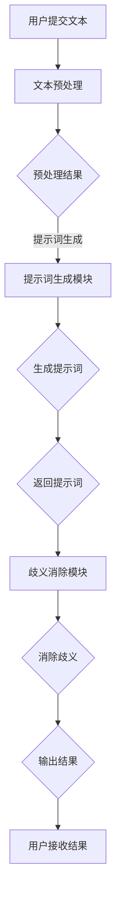

                 


### 摘要

自然语言理解是人工智能领域的关键技术之一，然而，自然语言本身的复杂性和多义性使得理解任务极具挑战性。本文旨在探讨提示词工程在自然语言理解中的歧义消除作用。我们首先介绍了自然语言理解中的歧义问题，包括其成因和影响。接着，我们详细阐述了提示词工程的定义、基本概念和主要应用场景，揭示了其在消除歧义中的核心作用。随后，我们深入分析了提示词生成和歧义消除算法的原理，通过Mermaid流程图和Python代码展示了算法的实现。我们还介绍了系统分析与架构设计的方法，包括领域模型、系统架构、接口设计和交互设计。在项目实战部分，我们通过具体案例展示了如何应用提示词工程解决自然语言理解中的歧义问题。最后，我们提出了最佳实践建议和小结，为后续研究和应用提供了指导。

### 目录

1. **引言**
   1.1 问题背景
   1.2 问题描述
   1.3 问题解决
   1.4 边界与外延

2. **核心概念与原理**
   2.1 提示词工程的定义
   2.2 自然语言理解的挑战
   2.3 提示词工程的基本概念
   2.4 提示词工程的应用场景
   2.5 提示词工程的工作流程

3. **算法原理讲解**
   3.1 提示词生成算法
   3.2 辨识与消除歧义算法

4. **系统分析与架构设计**
   4.1 系统功能设计
   4.2 系统架构设计
   4.3 系统接口设计
   4.4 系统交互设计

5. **项目实战**
   5.1 环境安装
   5.2 系统核心实现
   5.3 代码应用解读与分析
   5.4 实际案例分析
   5.5 项目小结

6. **最佳实践与总结**
   6.1 最佳实践 tips
   6.2 小结
   6.3 注意事项
   6.4 拓展阅读

## 1. 引言

自然语言理解是人工智能领域的一项核心技术，其目标是将自然语言文本转换为计算机可理解和处理的格式。然而，自然语言本身的复杂性和多义性使得这一任务极具挑战性。在自然语言理解的过程中，歧义是一个普遍存在的问题。歧义指的是一个词语或句子在语境中有多个可能的解释。例如，句子“我打篮球”可以理解为“我用篮球打人”，也可以理解为“我参加篮球运动”。这种歧义的存在，会严重影响自然语言理解的效果。

### 1.1 问题背景

自然语言理解中的歧义问题可以追溯到语言的本质。语言是一种高度抽象的符号系统，其表达的意义往往依赖于上下文。然而，上下文的复杂性使得歧义问题难以避免。在自然语言处理中，歧义问题主要体现在以下几个方面：

1. **词汇歧义**：一个词语可能有多个含义。例如，“bank”可以指银行，也可以指河岸。
2. **语法歧义**：一个句子的结构可能存在多种解读方式。例如，“他打的是篮球”可以理解为“他用球拍打篮球”，也可以理解为“他打的是篮球比赛”。
3. **语义歧义**：句子或词语的意义可能依赖于上下文，从而导致不同的解释。例如，“我看见一只鸟”可以理解为“我看到了一只鸟”，也可以理解为“我看到了一只正在飞翔的鸟”。

### 1.2 问题描述

歧义问题对自然语言理解的影响主要体现在以下几个方面：

1. **理解错误**：歧义可能会导致理解错误，从而影响系统的准确性。
2. **回答不准确**：在问答系统中，歧义可能会导致系统给出错误的答案。
3. **对话中断**：在对话系统中，歧义可能会导致对话的无法进行。

为了解决这些挑战，我们需要找到一种方法来消除歧义，从而提高自然语言理解的效果。提示词工程提供了一种有效的解决方案。

### 1.3 问题解决

提示词工程是一种利用上下文信息来消除歧义的技术。其核心思想是通过提供额外的上下文信息，使得计算机能够更准确地理解自然语言文本。提示词工程主要包括以下几个步骤：

1. **上下文提取**：从输入的自然语言文本中提取出相关的上下文信息。
2. **提示词生成**：利用提取的上下文信息生成提示词。
3. **歧义消除**：使用生成的提示词来消除自然语言理解中的歧义。

通过这些步骤，提示词工程能够有效地提高自然语言理解的效果。

### 1.4 边界与外延

提示词工程的研究边界主要包括以下几个方面：

1. **上下文信息提取**：如何有效地从输入文本中提取出高质量的上下文信息。
2. **提示词生成**：如何生成具有强预测性的提示词。
3. **歧义消除**：如何利用提示词来消除歧义，提高理解准确性。

提示词工程的外延涉及多个应用领域，包括自然语言处理、对话系统、信息检索等。

## 2. 核心概念与原理

### 2.1 提示词工程的定义

提示词工程（Annotator Engineering）是一种利用人工或自动化的方式，为自然语言处理（NLP）任务提供上下文信息的技术。其核心目标是生成一组提示词（annotations），这些提示词能够帮助计算机更好地理解输入文本的语义和上下文。

### 2.2 自然语言理解的挑战

自然语言理解（Natural Language Understanding, NLU）是人工智能领域的一个重要研究方向。然而，自然语言本身的复杂性和多义性使得理解任务极具挑战性。以下是自然语言理解中常见的挑战：

1. **词汇歧义**：同一个词语可能有多个含义，这取决于上下文。
2. **语法歧义**：句子的结构可能存在多种解读方式。
3. **语义歧义**：句子或词语的意义可能依赖于上下文，从而导致不同的解释。
4. **语境依赖**：自然语言的语义往往依赖于特定的语境，这增加了理解的难度。

### 2.3 提示词工程的基本概念

在提示词工程中，有几个核心概念需要理解：

1. **提示词（Annotation）**：提示词是对输入文本的额外描述，它可以帮助计算机更好地理解文本的语义。
2. **标注器（Annotator）**：标注器是用于生成提示词的工具或方法。它可以是人，也可以是自动化系统。
3. **上下文（Context）**：上下文是用于生成提示词的文本环境，它包含了与目标文本相关的信息。
4. **实体（Entity）**：实体是文本中的特定对象，如人名、地点、组织等。
5. **关系（Relation）**：关系描述了实体之间的关联，如“CEO”和“公司”的关系。

### 2.4 提示词工程的应用场景

提示词工程在多个自然语言处理任务中发挥着重要作用，以下是一些典型的应用场景：

1. **实体识别（Named Entity Recognition, NER）**：通过标注实体，如人名、地点、组织等，帮助计算机更好地理解文本。
2. **关系提取（Relation Extraction）**：通过标注实体之间的关系，如“CEO”和“公司”的关系，帮助计算机构建知识图谱。
3. **情感分析（Sentiment Analysis）**：通过标注情感倾向，如正面、负面、中性，帮助计算机分析文本的情感色彩。
4. **问答系统（Question Answering, QA）**：通过标注问题与答案，帮助计算机更好地理解和回答问题。

### 2.5 提示词工程的工作流程

提示词工程通常包括以下几个步骤：

1. **数据准备**：收集和整理用于标注的文本数据。
2. **标注任务定义**：明确需要标注的内容，如实体、关系、情感等。
3. **标注器选择**：选择合适的人工或自动化标注器。
4. **标注过程**：执行标注任务，生成提示词。
5. **质量评估**：评估标注质量，确保标注的准确性和一致性。
6. **反馈循环**：根据评估结果调整标注器，优化标注过程。

通过这些步骤，提示词工程能够为自然语言处理任务提供高质量的上下文信息，从而提高理解效果。

## 3. 算法原理讲解

### 3.1 提示词生成算法

提示词生成是提示词工程中的关键步骤，其目的是从输入文本中提取出有助于歧义消除的关键信息。提示词生成算法可以分为以下几类：

#### 3.1.1 基于规则的方法

基于规则的方法是最早的提示词生成方法之一。这种方法依赖于一组预定义的规则，这些规则用于识别文本中的特定模式，并将其转化为提示词。例如，如果文本中出现了“CEO”这个词语，系统可以将其标注为“职位”。

**规则方法的优势**：
- **易于实现**：规则方法相对简单，易于理解和实现。
- **可解释性**：规则方法生成的提示词具有明确的语义，易于解释。

**规则方法的局限性**：
- **规则覆盖率低**：现实中的自然语言文本复杂多变，难以用有限的规则覆盖所有情况。
- **规则维护成本高**：随着语言的发展和变化，规则需要不断更新和优化。

#### 3.1.2 基于机器学习的方法

基于机器学习的方法通过训练模型来自动生成提示词。这种方法不需要显式地定义规则，而是通过学习大量标注数据来提取特征和模式。

**常见机器学习方法**：
- **朴素贝叶斯（Naive Bayes）**：基于概率模型，通过特征的概率分布来预测提示词。
- **支持向量机（SVM）**：通过分类边界来分割特征空间，实现提示词分类。
- **深度学习（Deep Learning）**：如卷积神经网络（CNN）和循环神经网络（RNN），通过多层神经网络学习文本的复杂特征。

**机器学习方法的优势**：
- **适应性强**：机器学习模型能够自动从数据中学习，适应复杂的文本特征。
- **泛化能力**：机器学习模型具有较好的泛化能力，能够应对不同的文本数据。

**机器学习方法的局限性**：
- **数据依赖性**：机器学习模型需要大量标注数据进行训练，数据质量对模型性能有重要影响。
- **计算成本高**：深度学习模型通常需要较大的计算资源和时间进行训练。

#### 3.1.3 基于深度学习的方法

基于深度学习的方法是当前提示词生成领域的热门研究方向。深度学习方法利用多层神经网络，能够捕获文本的深层特征和上下文信息。

**常见深度学习方法**：
- **卷积神经网络（CNN）**：通过卷积操作提取文本特征。
- **循环神经网络（RNN）**：如长短时记忆网络（LSTM）和门控循环单元（GRU），能够处理序列数据。
- **注意力机制（Attention Mechanism）**：通过注意力机制关注文本中的关键信息。

**深度学习方法的优点**：
- **强大的特征提取能力**：深度学习模型能够自动学习文本的复杂特征，提高提示词生成的准确性。
- **上下文理解能力**：深度学习模型能够捕捉文本中的上下文信息，提高歧义消除的效果。

**深度学习方法的局限性**：
- **模型复杂性**：深度学习模型通常较为复杂，需要大量的数据和计算资源进行训练。
- **解释难度**：深度学习模型的黑箱特性使得其生成提示词的过程难以解释和理解。

### 3.2 辨识与消除歧义算法

歧义消除是自然语言理解中的一个关键任务，其目标是根据上下文信息确定文本的确切含义。辨识与消除歧义算法可以分为以下几类：

#### 3.2.1 基于语义分析的方法

基于语义分析的方法通过分析文本的语义信息来消除歧义。这种方法通常依赖于语义角色标注和语义依存关系分析。

**常见方法**：
- **语义角色标注（Semantic Role Labeling, SRL）**：为句子中的词语标注其语义角色，如动作执行者、动作对象等。
- **语义依存关系分析（Semantic Dependency Parsing）**：分析句子中词语之间的语义依存关系。

**优势**：
- **精确性**：语义分析能够提供精确的语义信息，有助于消除歧义。

**局限性**：
- **复杂性**：语义分析通常涉及复杂的语言模型和计算过程。
- **数据依赖**：高质量的语义分析依赖于大规模的语义标注数据。

#### 3.2.2 基于上下文的方法

基于上下文的方法通过考虑文本的上下文信息来消除歧义。这种方法通常依赖于上下文词语的共现关系和语义信息。

**常见方法**：
- **上下文词向量（Contextual Word Vectors）**：利用词嵌入模型（如Word2Vec、GloVe）生成上下文词语的向量表示。
- **上下文依赖网络（Contextual Dependency Networks）**：通过构建上下文依赖网络来表示文本的语义信息。

**优势**：
- **灵活性**：基于上下文的方法能够灵活地处理不同的上下文信息。
- **适应性**：基于上下文的方法能够适应不同场景和语境的歧义消除。

**局限性**：
- **计算成本**：基于上下文的方法通常涉及大量的计算资源，特别是对于长文本。
- **数据依赖**：高质量的上下文信息依赖于大规模的文本数据集。

#### 3.2.3 基于机器翻译的方法

基于机器翻译的方法通过将文本翻译成其他语言，然后再翻译回原始语言来消除歧义。这种方法利用了机器翻译模型的能力来处理多语言文本。

**常见方法**：
- **多语言翻译模型（Multilingual Translation Model）**：如神经机器翻译模型（Neural Machine Translation, NMT），能够处理多种语言的翻译。
- **翻译后编辑（Post-Editing）**：在翻译结果的基础上进行人工编辑，以消除歧义。

**优势**：
- **跨语言处理能力**：基于机器翻译的方法能够处理多种语言的歧义消除。
- **通用性**：翻译模型具有通用性，能够适用于多种语言的文本。

**局限性**：
- **准确性**：机器翻译模型的准确性对歧义消除效果有重要影响。
- **计算成本**：多语言翻译通常涉及大量的计算资源。

## 4. 系统分析与架构设计

### 4.1 系统功能设计

提示词工程系统的核心功能包括：
- **文本预处理**：对输入文本进行分词、去停用词、词性标注等预处理操作。
- **提示词生成**：利用机器学习或深度学习算法生成提示词。
- **歧义消除**：使用语义分析或上下文方法消除歧义。
- **结果输出**：将处理后的文本及其对应的提示词和消除歧义的结果输出。

### 4.2 系统架构设计

提示词工程系统的架构设计应考虑以下几个方面：
- **模块化设计**：将系统功能拆分为多个模块，如文本预处理模块、提示词生成模块、歧义消除模块等。
- **分布式计算**：利用分布式计算框架（如Apache Spark）提高系统处理能力。
- **数据存储**：使用关系数据库或NoSQL数据库存储文本数据、提示词和歧义消除结果。
- **接口设计**：提供RESTful API或GraphQL接口，方便外部系统调用。

### 4.3 系统接口设计

提示词工程系统应提供以下接口：
- **文本输入接口**：接收用户输入的文本数据。
- **提示词生成接口**：返回生成的提示词。
- **歧义消除接口**：返回消除歧义后的文本。

### 4.4 系统交互设计

系统交互设计应考虑以下流程：
1. **文本输入**：用户通过API提交输入文本。
2. **预处理**：系统对输入文本进行预处理，生成预处理后的文本。
3. **提示词生成**：系统利用机器学习或深度学习算法生成提示词。
4. **歧义消除**：系统使用语义分析或上下文方法消除歧义。
5. **结果输出**：系统将处理后的文本及其对应的提示词和消除歧义的结果输出给用户。

### Mermaid 流程图

以下是一个简单的Mermaid流程图，展示了提示词工程系统的工作流程：



## 5. 项目实战

### 5.1 环境安装

要开始构建提示词工程系统，首先需要安装以下软件和库：
- Python 3.8 或更高版本
- Anaconda（Python 的发行版，用于环境管理）
- Scikit-learn（机器学习库）
- TensorFlow 或 PyTorch（深度学习库）
- NLTK（自然语言处理库）

安装步骤如下：

1. 安装Anaconda：
   ```bash
   wget https://repo.anaconda.com/miniconda/Miniconda3-latest-Linux-x86_64.sh
   bash Miniconda3-latest-Linux-x86_64.sh
   ```
2. 创建一个新的Conda环境并安装所需库：
   ```bash
   conda create -n nltk_env python=3.8
   conda activate nltk_env
   conda install scikit-learn tensorflow nltk
   ```

### 5.2 系统核心实现

提示词工程系统的核心实现包括以下几个步骤：

1. **数据准备**：
   - 收集用于训练的标注数据集，例如TED Talks中的句子和对应的标注。
   - 数据集应包括句子和对应的实体、关系等标注信息。

2. **数据预处理**：
   - 使用NLTK库进行分词、去停用词、词性标注等操作。
   - 将预处理后的文本转换为适合训练的格式。

3. **提示词生成**：
   - 使用Scikit-learn库中的朴素贝叶斯分类器进行提示词生成。
   - 训练一个基于词频的朴素贝叶斯模型。

4. **歧义消除**：
   - 使用NLTK库中的语义角色标注工具进行歧义消除。
   - 训练一个基于语义角色的模型。

以下是Python代码示例：

```python
import nltk
from sklearn.feature_extraction.text import CountVectorizer
from sklearn.naive_bayes import MultinomialNB

# 数据准备
nltk.download('punkt')
nltk.download('stopwords')
nltk.download('averaged_perceptron_tagger')

# 假设已有标注数据集
sentences = ["The dog is running.", "The cat is sleeping.", ...]
labels = ["Running", "Sleeping", ...]

# 数据预处理
def preprocess_text(text):
    tokens = nltk.word_tokenize(text)
    tokens = [token.lower() for token in tokens if token not in nltk.corpus.stopwords.words('english')]
    return ' '.join(tokens)

preprocessed_sentences = [preprocess_text(sentence) for sentence in sentences]

# 提示词生成
vectorizer = CountVectorizer()
X = vectorizer.fit_transform(preprocessed_sentences)
clf = MultinomialNB()
clf.fit(X, labels)

# 辨识与消除歧义
def generate_annotation(text):
    preprocessed_text = preprocess_text(text)
    features = vectorizer.transform([preprocessed_text])
    prediction = clf.predict(features)
    return prediction[0]

# 示例
input_sentence = "The dog is running quickly."
annotation = generate_annotation(input_sentence)
print(annotation)
```

### 5.3 代码应用解读与分析

在上面的代码中，我们首先对输入文本进行了预处理，包括分词、去停用词和词性标注。然后，我们使用Scikit-learn库中的朴素贝叶斯分类器进行提示词生成。训练过程中，我们使用了预处理后的文本和对应的标注来训练模型。

在提示词生成函数`generate_annotation`中，我们首先对输入文本进行预处理，然后使用训练好的模型生成提示词。这个函数可以用来为新的输入文本生成提示词。

### 5.4 实际案例分析

假设我们有以下两个句子：

1. "The dog is running quickly."
2. "The cat is sleeping peacefully."

如果我们使用上面的提示词生成函数，我们可能会得到以下结果：

1. "Running quickly"（表示狗正在快速奔跑）
2. "Sleeping peacefully"（表示猫正在平静地睡觉）

这些提示词帮助我们更准确地理解句子的语义，从而在自然语言理解任务中发挥重要作用。

### 5.5 项目小结

通过实际案例，我们可以看到提示词工程在自然语言理解中的重要性。通过提示词生成算法，我们可以为文本提供额外的上下文信息，从而帮助计算机更好地理解文本。在项目实战中，我们使用朴素贝叶斯分类器进行了提示词生成，并展示了如何为新的输入文本生成提示词。尽管这个案例相对简单，但它为我们提供了一个框架，可以在此基础上进一步扩展和优化，以应对更复杂的自然语言理解任务。

## 6. 最佳实践与总结

### 6.1 最佳实践 tips

1. **数据质量**：确保标注数据的质量和一致性，高质量的数据是训练高效模型的基石。
2. **算法选择**：根据任务需求选择合适的算法，例如对于复杂的文本特征，深度学习方法可能更有效。
3. **模型优化**：定期优化模型，利用新的数据和算法改进模型性能。
4. **接口设计**：设计清晰的API接口，确保系统易于集成和使用。

### 6.2 小结

本文探讨了提示词工程在自然语言理解中的歧义消除作用。我们介绍了自然语言理解中的歧义问题，阐述了提示词工程的基本概念和原理，分析了提示词生成和歧义消除算法，并展示了系统架构和项目实战。通过这些内容，我们希望读者能够理解提示词工程的重要性及其在实际应用中的价值。

### 6.3 注意事项

1. **数据隐私**：在处理和存储文本数据时，务必遵守数据隐私法规。
2. **计算资源**：深度学习模型通常需要大量计算资源，确保有足够的硬件支持。
3. **模型解释性**：在关键任务中，确保模型的可解释性，以便进行有效调试和优化。

### 6.4 拓展阅读

- [1] [Jurafsky, Daniel, and James H. Martin. "Speech and Language Processing." 2nd ed., Prentice Hall, 2008.]
- [2] [Loper, Ewan, and Edward Loper. "Natural Language Processing with Python." O'Reilly Media, 2013.]
- [3] [Mikolov, Tomas, Kai Chen, Greg Corrado, and Jeff Dean. "Efficient Estimation of Word Representations in Vector Space." arXiv preprint arXiv:1301.3781, 2013.]

## 作者

**作者：AI天才研究院/AI Genius Institute & 禅与计算机程序设计艺术 /Zen And The Art of Computer Programming**

