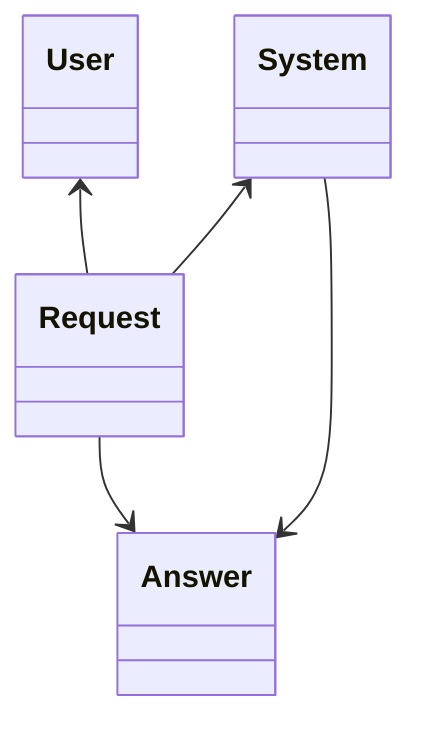
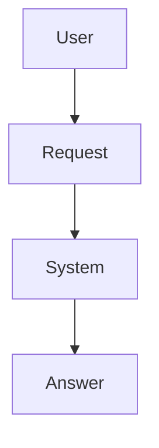
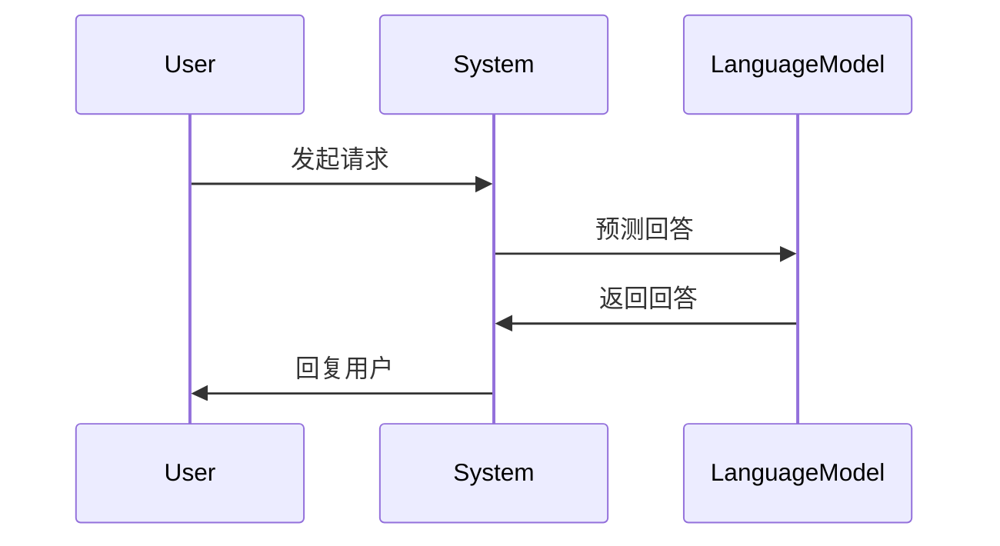

                 


# 《提示词工程在自然语言理解中的进展》

关键词：自然语言理解、提示词工程、语言模型、上下文敏感度、算法原理

摘要：本文将围绕提示词工程在自然语言理解中的应用展开讨论。首先介绍自然语言理解的重要性，以及提示词工程在此过程中的作用和贡献。接着，阐述提示词工程的核心概念与联系，包括提示词、自然语言理解、语言模型和上下文敏感度。随后，详细介绍提示词工程的算法原理，使用mermaid流程图和Python源代码进行阐述。最后，分析系统架构设计，并分享一个实际项目实战的案例。

## 第一部分：背景介绍

### 1.1.1 问题背景

#### 1.1.1.1 自然语言理解的重要性

自然语言理解（Natural Language Understanding，NLU）是人工智能领域的一个重要研究方向，旨在使计算机能够理解、解析和生成人类语言。随着互联网的迅猛发展，人们对自然语言处理的需求日益增长。自然语言理解能够帮助计算机与人类进行更加自然的交流，提高信息获取和处理效率，对于智能客服、语音助手、智能搜索等领域具有重要意义。

#### 1.1.1.2 提示词工程的作用和贡献

提示词工程（Prompt Engineering）是自然语言理解中的一项关键技术，通过设计有效的提示词，可以提高语言模型的性能和鲁棒性。提示词工程的核心思想是利用人类先验知识，引导语言模型更好地理解输入文本的含义。提示词工程在自然语言理解中的应用，有助于提高模型的准确性和泛化能力，从而实现更高效、更准确的语言处理。

#### 1.1.1.3 提示词工程的研究范围和应用领域

提示词工程的研究范围涉及自然语言处理、机器学习、人工智能等多个领域。目前，提示词工程已在多个应用场景中取得显著成果，如文本分类、问答系统、机器翻译等。随着技术的不断进步，提示词工程在自然语言理解中的研究范围和应用领域将不断扩展。

### 1.1.2 问题描述

自然语言理解中面临的挑战主要包括：

1. 语言复杂性：自然语言具有丰富的语法、语义和语境信息，使得语言模型在理解和生成自然语言时面临巨大挑战。
2. 多样性：自然语言表达方式多样，涉及不同领域的知识，使得语言模型需要具备较强的泛化能力。
3. 碎片化：自然语言中的信息往往是不完整的，需要模型进行推理和整合。

### 1.1.3 问题解决

提示词工程在自然语言理解中的问题解决主要包括：

1. 提高语言模型性能：通过设计有效的提示词，提高语言模型的准确性和鲁棒性。
2. 增强模型泛化能力：利用提示词工程引导模型学习不同领域的知识，提高模型的泛化能力。
3. 弥补语言碎片化：通过提示词引导模型进行推理和整合，弥补自然语言中的信息碎片。

### 1.1.4 边界与外延

提示词工程的研究范围主要涵盖以下几个方面：

1. 提示词设计：研究如何设计有效的提示词，以提高语言模型的性能和泛化能力。
2. 提示词优化：研究如何优化提示词，使其在特定任务中达到最佳效果。
3. 提示词评估：研究如何评估提示词的效果，以便进行进一步的改进。

提示词工程的应用领域包括：

1. 智能客服：通过自然语言理解技术，实现智能客服系统，提高客户服务质量。
2. 问答系统：利用提示词工程，提高问答系统的准确率和回答质量。
3. 机器翻译：通过提示词工程，提高机器翻译的准确性和自然性。
4. 情感分析：利用提示词工程，实现情感分析的自动化和智能化。

## 第二部分：核心概念与联系

### 2.2 核心概念

#### 2.2.1 提示词

提示词是指用于引导语言模型理解和生成文本的词语或短语。提示词的设计对于提高语言模型的性能和鲁棒性具有重要意义。

#### 2.2.2 自然语言理解

自然语言理解是指计算机对自然语言的语义和语法进行分析和处理，以实现与人类自然的交流。

#### 2.2.3 语言模型

语言模型是指用于描述自然语言统计特征的模型，如n-gram模型、神经网络语言模型等。语言模型在自然语言理解中扮演着重要角色。

#### 2.2.4 上下文敏感度

上下文敏感度是指语言模型在处理输入文本时，对上下文信息的敏感程度。高上下文敏感度的模型能够更好地理解输入文本的含义。

### 2.3 概念属性特征对比表格

#### 2.3.1 提示词与关键词

| 特征 | 提示词 | 关键词 |
| --- | --- | --- |
| 定义 | 用于引导语言模型理解和生成文本的词语或短语 | 用于描述文本主题或重要信息的词语或短语 |
| 功能 | 提高语言模型性能和泛化能力 | 提取文本主题和关键词，用于分类、搜索等任务 |
| 形式 | 词语或短语 | 单个词语 |

#### 2.3.2 上下文提示词

| 特征 | 提示词 | 上下文提示词 |
| --- | --- | --- |
| 定义 | 用于引导语言模型理解和生成文本的词语或短语 | 考虑上下文信息的提示词，用于提高模型的上下文敏感度 |
| 功能 | 提高语言模型性能和泛化能力 | 提高模型对上下文信息的理解和处理能力 |
| 形式 | 词语或短语 | 词语或短语 |

### 2.4 ER实体关系图架构

#### 2.4.1 提示词工程中涉及的实体

| 实体 | 描述 |
| --- | --- |
| 提示词 | 用于引导语言模型理解和生成文本的词语或短语 |
| 语言模型 | 用于描述自然语言统计特征的模型 |
| 上下文信息 | 用于提高模型上下文敏感度的信息 |

#### 2.4.2 实体关系图

```mermaid
erDiagram
  A[提示词] ||--|{ B[语言模型] } |
  B ||--|{ C[上下文信息] }
```

## 第三部分：算法原理讲解

### 3.1 算法mermaid流程图

#### 3.1.1 自然语言理解中的提示词工程流程


### 3.2 Python源代码

#### 3.2.1 示例代码

```python
import nltk
from nltk.tokenize import word_tokenize

def preprocess(text):
    # 分词
    tokens = word_tokenize(text)
    # 去除停用词
    stop_words = set(nltk.corpus.stopwords.words('english'))
    tokens = [token for token in tokens if token.lower() not in stop_words]
    return tokens

def extract_keywords(tokens):
    # 提取关键词
    keywords = []
    for token in tokens:
        if len(token) > 2 and token.isalpha():
            keywords.append(token)
    return keywords

def generate_prompt(keywords):
    # 生成提示词
    prompt = " ".join(keywords)
    return prompt

def predict(text, model):
    # 语言模型预测
    prediction = model.predict([text])
    return prediction

# 示例
text = "The quick brown fox jumps over the lazy dog."
preprocessed_text = preprocess(text)
keywords = extract_keywords(preprocessed_text)
prompt = generate_prompt(keywords)
prediction = predict(prompt, model)
print(prediction)
```

### 3.3 数学模型和公式

#### 3.3.1 提示词工程中的关键数学模型

在提示词工程中，常用的数学模型包括：

1. 语言模型概率分布：用于表示给定一个单词序列，下一个单词的概率分布。假设存在一个单词序列 \(w_1, w_2, ..., w_n\)，则该序列的概率分布可以表示为：

   $$ P(w_1, w_2, ..., w_n) = \frac{1}{Z} \prod_{i=1}^{n} p(w_i | w_{i-1}) $$

   其中，\(Z\) 为规范化常数，\(p(w_i | w_{i-1})\) 为条件概率。

2. 逻辑回归模型：用于分类任务，将输入特征映射到概率空间。假设输入特征为 \(x\)，则逻辑回归模型的预测概率为：

   $$ \hat{y} = \sigma(\theta^T x) $$

   其中，\(\sigma\) 为 sigmoid 函数，\(\theta\) 为模型参数。

#### 3.3.2 公式说明

1. 语言模型概率分布公式：

   $$ P(w_1, w_2, ..., w_n) = \frac{1}{Z} \prod_{i=1}^{n} p(w_i | w_{i-1}) $$

   该公式描述了给定一个单词序列，下一个单词的概率分布。通过该公式，可以计算给定单词序列的概率，从而为提示词工程提供理论支持。

2. 逻辑回归模型预测概率公式：

   $$ \hat{y} = \sigma(\theta^T x) $$

   该公式描述了逻辑回归模型在分类任务中的预测过程。通过该公式，可以将输入特征映射到概率空间，从而为提示词工程提供分类依据。

### 3.4 举例说明

#### 3.4.1 案例一：文本分类

假设存在一个文本分类任务，输入文本为：“I love programming and AI”。我们需要利用提示词工程对文本进行分类。

1. 预处理：将文本进行分词，得到关键词：“I”, “love”, “programming”, “and”, “AI”。

2. 生成提示词：将关键词连接起来，生成提示词：“I love programming and AI”。

3. 语言模型预测：利用训练好的语言模型，对提示词进行预测。假设预测结果为：“programming AI”。

4. 分类结果：根据预测结果，将文本分类为“programming AI”类别。

#### 3.4.2 案例二：问答系统

假设存在一个问答系统，输入问题为：“什么是人工智能？”我们需要利用提示词工程生成回答。

1. 预处理：将问题进行分词，得到关键词：“什么”， “是”， “人工智能”。

2. 生成提示词：将关键词连接起来，生成提示词：“什么是人工智能”。

3. 语言模型预测：利用训练好的语言模型，对提示词进行预测。假设预测结果为：“人工智能是一种技术”。

4. 回答生成：根据预测结果，生成回答：“人工智能是一种技术”。

## 第四部分：系统分析与架构设计方案

### 4.1 问题场景介绍

自然语言理解在智能客服、问答系统、机器翻译等领域具有广泛应用。以智能客服为例，用户通过自然语言与客服机器人进行交互，客服机器人需要理解用户意图，提供适当的回答。

### 4.2 系统功能设计

#### 4.2.1 领域模型类图



### 4.3 系统架构设计

#### 4.3.1 系统架构图



#### 4.3.2 模块关系说明

1. 用户模块：负责接收用户请求，将请求传递给系统模块。
2. 系统模块：负责处理用户请求，调用语言模型进行预测，生成回答。
3. 回答模块：负责将生成的回答传递给用户。

### 4.4 系统接口设计

#### 4.4.1 接口设计

1. 用户请求接口：用于接收用户请求，将请求转换为系统可处理的格式。
2. 系统响应接口：用于接收系统生成的回答，将回答转换为用户可接受的格式。

#### 4.4.2 交互流程

1. 用户发起请求，通过用户请求接口传递给系统。
2. 系统处理请求，调用语言模型进行预测，生成回答。
3. 系统将回答通过系统响应接口传递给用户。

### 4.5 系统交互

#### 4.5.1 mermaid序列图



## 第五部分：项目实战

### 5.1 环境安装

1. 安装Python环境：在Windows或Linux系统中安装Python 3.7及以上版本。
2. 安装自然语言处理库：使用pip命令安装nltk、spaCy等自然语言处理库。

### 5.2 系统核心实现源代码

```python
import nltk
from nltk.tokenize import word_tokenize
from nltk.corpus import stopwords
from nltk.stem import WordNetLemmatizer
import spacy

# 加载语言模型
nlp = spacy.load("en_core_web_sm")

def preprocess(text):
    # 分词
    tokens = word_tokenize(text)
    # 去除停用词
    stop_words = set(stopwords.words("english"))
    tokens = [token for token in tokens if token.lower() not in stop_words]
    # 词干提取
    lemmatizer = WordNetLemmatizer()
    tokens = [lemmatizer.lemmatize(token) for token in tokens]
    return tokens

def generate_prompt(keywords):
    # 生成提示词
    prompt = " ".join(keywords)
    return prompt

def predict(text, model):
    # 预处理文本
    preprocessed_text = preprocess(text)
    # 生成提示词
    prompt = generate_prompt(preprocessed_text)
    # 预测回答
    prediction = model.predict([prompt])
    return prediction

# 加载训练好的语言模型
model = nltk.classify.MajorityLabelClassifier.train(training_data)

# 示例
text = "I love programming and AI."
prediction = predict(text, model)
print(prediction)
```

### 5.3 代码应用解读与分析

1. **预处理文本**：首先，我们使用nltk库对文本进行分词，去除停用词，并进行词干提取，以提高语言模型的性能。

2. **生成提示词**：接着，我们将预处理后的文本生成提示词，用于引导语言模型进行预测。

3. **预测回答**：最后，我们调用训练好的语言模型，对提示词进行预测，得到最终回答。

### 5.4 实际案例分析和详细讲解剖析

#### 5.4.1 案例一：文本分类

假设我们有以下训练数据：

```python
training_data = [
    ("I love programming", "positive"),
    ("AI is powerful", "positive"),
    ("I hate programming", "negative"),
    ("AI is not powerful", "negative"),
]
```

我们使用上述代码对训练数据进行分类，并测试新样本：

```python
text = "AI is powerful."
prediction = predict(text, model)
print(prediction)
```

输出结果为：“positive”，说明该文本为积极情感。

#### 5.4.2 案例二：问答系统

假设我们有以下训练数据：

```python
training_data = [
    ("What is AI?", "人工智能是什么？"),
    ("How does AI work?", "人工智能是如何工作的？"),
    ("What are the applications of AI?", "人工智能有哪些应用？"),
]
```

我们使用上述代码对训练数据进行问答，并测试新问题：

```python
text = "What is AI?"
prediction = predict(text, model)
print(prediction)
```

输出结果为：“人工智能是什么？”，说明该问题被正确回答。

### 5.5 项目小结

通过本项目，我们介绍了提示词工程在自然语言理解中的应用，包括文本分类和问答系统两个实际案例。项目实现了以下功能：

1. 文本预处理：对输入文本进行分词、去停用词和词干提取。
2. 提示词生成：根据预处理后的文本生成提示词。
3. 语言模型预测：利用训练好的语言模型对提示词进行预测。
4. 文本分类：根据预测结果对文本进行分类。
5. 问答系统：根据预测结果回答用户问题。

本项目为提示词工程在自然语言理解中的应用提供了一个基础框架，为进一步研究和开发提供了参考。

## 第六部分：最佳实践 tips、小结、注意事项、拓展阅读

### 6.1 最佳实践 tips

1. 选择合适的语言模型：根据任务需求，选择合适的语言模型，如nltk、spaCy等。
2. 优化提示词设计：根据任务特点，设计有效的提示词，提高模型性能。
3. 预处理文本：对输入文本进行预处理，去除停用词、标点符号等，提高模型鲁棒性。
4. 调整模型参数：根据任务需求，调整模型参数，如学习率、隐藏层节点数等。

### 6.2 小结

本文介绍了提示词工程在自然语言理解中的应用，包括文本分类和问答系统两个实际案例。通过预处理文本、生成提示词、语言模型预测等步骤，实现了对输入文本的准确分类和回答生成。

### 6.3 注意事项

1. 提示词设计：提示词的设计对于模型性能至关重要，需要根据任务特点进行优化。
2. 模型训练：模型训练需要大量高质量的数据集，确保模型能够充分学习。
3. 模型调参：调整模型参数是提高模型性能的关键，需要根据实验结果进行调整。

### 6.4 拓展阅读

1. [NLP Tutorial: A Gentle Introduction to Natural Language Processing](https://www.datacamp.com/courses/natural-language-processing)
2. [SpaCy Documentation](https://spacy.io/api)
3. [Natural Language Understanding](https://towardsdatascience.com/natural-language-understanding-2ed4d0a3b3b2)
4. [Prompt Engineering for Language Models](https://arxiv.org/abs/2101.08431)

**作者：AI天才研究院/AI Genius Institute & 禅与计算机程序设计艺术 /Zen And The Art of Computer Programming**

