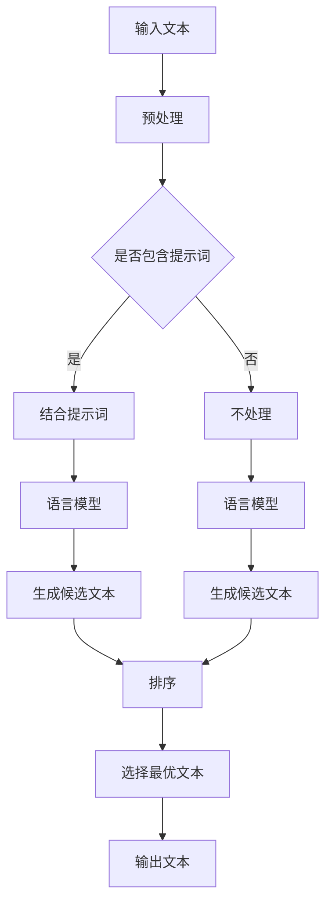
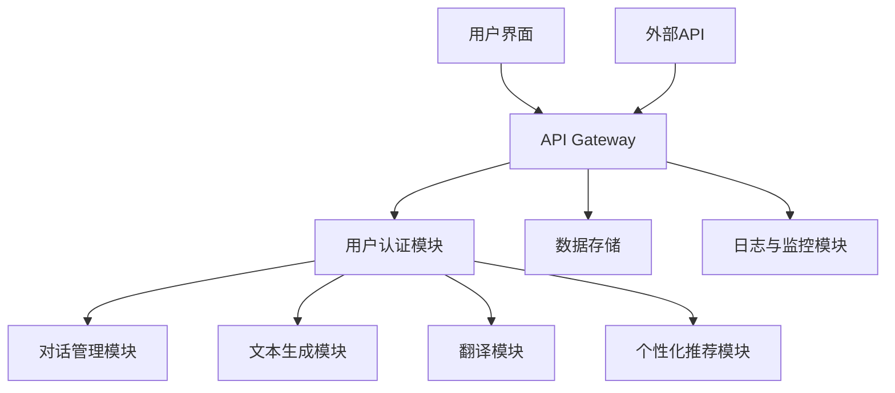
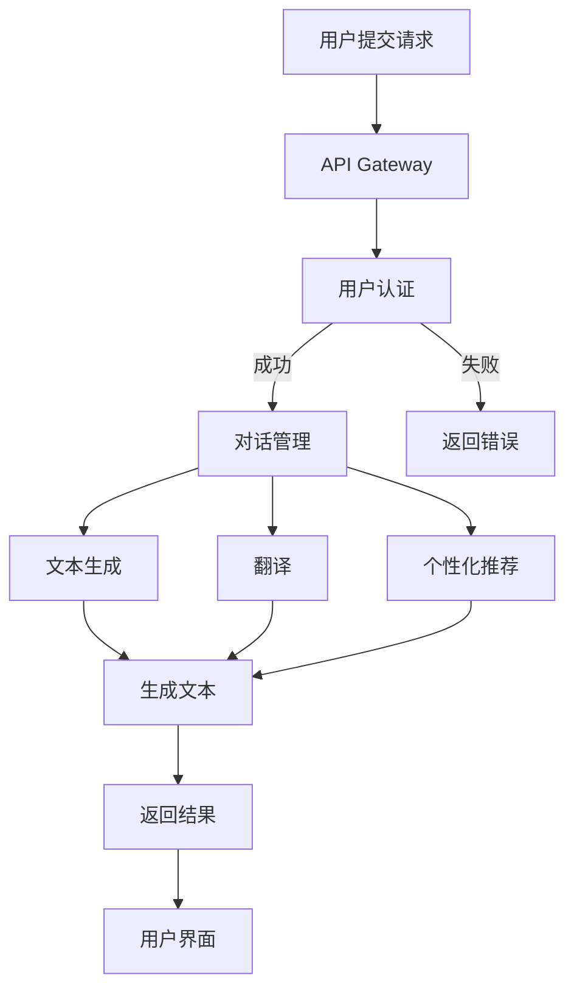

                 


### 引言

**关键词：** 自然语言生成，提示词工程，应用场景，算法原理，数学模型，系统架构

随着人工智能技术的飞速发展，自然语言生成（Natural Language Generation，NLG）成为了一个备受关注的研究领域。自然语言生成技术旨在通过计算机程序自动生成人类语言，包括文本、语音等多种形式。这不仅能够提高信息的传递效率，还能够为自动化内容生成、智能客服、语言翻译等领域带来革命性的变革。

在自然语言生成的过程中，提示词工程（Prompt Engineering）扮演着至关重要的角色。提示词工程是指通过设计和优化提示词，以引导自然语言生成模型生成更准确、更有用的文本。一个优秀的提示词可以显著提高生成文本的质量，使模型能够更好地理解和生成目标语言。

本文将围绕“提示词工程在自然语言生成中的应用”这一主题展开。我们将首先介绍自然语言生成的背景与意义，以及提示词工程的基本概念。接着，我们将探讨自然语言生成算法的原理，并深入分析提示词工程在这一过程中的作用。随后，我们将介绍提示词工程的应用实践，包括聊天机器人、内容生成和翻译系统等多个领域。此外，我们将解析自然语言生成中的数学模型和提示词工程的数学模型，并展示如何使用Mermaid和Python进行算法原理的讲解。最后，我们将详细讨论系统架构设计，并通过实际案例进行深入剖析。文章的结尾将提供最佳实践建议、注意事项和拓展阅读，帮助读者进一步深入了解这一领域。

### 第1章：自然语言生成概述

#### 1.1 自然语言生成的背景与意义

自然语言生成（NLG）技术起源于人工智能领域，其背景可以追溯到20世纪50年代。当时，人工智能的早期研究者们开始探讨如何让计算机理解和生成人类语言。自然语言生成的概念随之诞生，旨在通过计算机程序自动生成人类语言。

随着计算机性能的提升和算法的进步，自然语言生成技术逐渐成熟，并开始广泛应用于多个领域。在文本生成方面，自然语言生成技术可以用于自动新闻撰写、报告生成、电子书创作等。在语音合成方面，自然语言生成技术被用于语音助手、语音导航、语音合成字幕等。

自然语言生成的意义在于其能够提高信息传递的效率和质量。通过自动化生成文本，可以节省大量人力和时间成本，提高工作效率。此外，自然语言生成技术还能够提供个性化的内容生成服务，满足用户多样化的需求。

#### 1.2 自然语言生成的基本概念

自然语言生成的基本概念包括文本生成、语言模型、生成模型等。

1. **文本生成**：文本生成是指通过计算机程序自动生成人类语言的过程。文本生成可以是句子、段落或整个文档。

2. **语言模型**：语言模型是一种统计模型，用于表示自然语言的概率分布。通过语言模型，计算机可以预测下一个单词或词组。

3. **生成模型**：生成模型是一类用于生成数据的概率模型。在自然语言生成中，生成模型用于生成新的文本。

#### 1.3 提示词工程的概念与作用

提示词工程（Prompt Engineering）是指通过设计和优化提示词，以引导自然语言生成模型生成更准确、更有用的文本。提示词是一个引导性的文本，用于引导模型生成目标文本。

提示词工程的作用主要体现在以下几个方面：

1. **提高生成文本的准确性**：通过设计合适的提示词，可以引导模型更好地理解目标文本的内容，从而提高生成文本的准确性。

2. **增强生成文本的多样性**：通过设计多样化的提示词，可以引导模型生成更多样化的文本，避免生成过于单一的内容。

3. **优化生成文本的质量**：通过优化提示词，可以引导模型生成更高质量、更有价值的文本。

#### 1.4 自然语言生成的挑战与机遇

自然语言生成面临着诸多挑战，同时也带来了新的机遇。

**挑战**：

1. **语义理解**：自然语言中存在着大量的歧义和模糊性，如何让模型准确理解语义是一个巨大的挑战。

2. **多样性**：如何生成多样化、具有创意的文本，以满足用户的不同需求。

3. **性能优化**：随着生成文本的长度和复杂度的增加，如何优化模型的性能是一个重要问题。

**机遇**：

1. **应用领域扩展**：自然语言生成技术在多个领域（如医疗、金融、教育等）具有广泛的应用前景。

2. **数据驱动**：随着大数据技术的发展，自然语言生成有了更多的数据支持，从而可以更好地训练模型。

3. **跨语言生成**：自然语言生成技术有望实现跨语言之间的文本生成，促进全球范围内的信息交流。

通过本文的探讨，我们将深入理解自然语言生成和提示词工程的原理与应用，为读者提供有益的启示。

#### 第2章：提示词工程基础

##### 2.1 提示词的类型与特点

提示词在自然语言生成中起着至关重要的作用，它们可以分为多种类型，根据用途和特点可以分为以下几类：

1. **引导型提示词**：这类提示词主要用于引导模型生成特定类型的文本。例如，在生成新闻报道时，引导型提示词可以包括时间、地点、事件等信息，帮助模型更好地构建文本框架。

2. **参考型提示词**：参考型提示词提供具体的参考信息，如定义、描述或示例，帮助模型理解文本内容。例如，在生成科技文章时，参考型提示词可以提供相关术语和定义。

3. **反馈型提示词**：这类提示词用于提供生成文本的反馈，帮助模型调整生成策略。例如，在生成对话时，反馈型提示词可以是用户的回复，用于引导模型生成更符合对话逻辑的文本。

4. **辅助型提示词**：辅助型提示词提供辅助信息，如数据来源、参考资料或背景故事，帮助模型丰富生成内容。例如，在生成故事时，辅助型提示词可以提供故事发生的背景和环境。

提示词的特点包括：

- **引导性**：提示词应具备明确的引导作用，使模型能够理解生成任务的目标和方向。

- **准确性**：提示词应准确传达所需信息，避免歧义和误解。

- **灵活性**：提示词应具备一定的灵活性，以适应不同生成任务的需求。

- **多样性**：多样化的提示词有助于生成多样化的文本，避免生成内容过于单一。

##### 2.2 提示词的选择与优化

选择和优化提示词是提示词工程的关键步骤，以下是几个重要方面：

1. **领域适应性**：提示词应具有领域适应性，即针对特定领域的生成任务选择合适的提示词。例如，在医疗领域，应选择包含医学术语和概念提示词。

2. **信息完整性**：提示词应包含完整的信息，使模型能够充分理解生成任务。例如，在生成新闻时，提示词应包括事件的时间、地点、参与者等关键信息。

3. **语义丰富性**：提示词应具备丰富的语义，以引导模型生成更丰富的文本。例如，使用具体的描述性词汇，避免使用过于抽象的术语。

4. **数据来源**：选择高质量的提示词来源，如专业文献、权威网站或数据库，以提高提示词的准确性和可靠性。

优化提示词的方法包括：

- **文本预处理**：对原始文本进行预处理，如去除无关信息、转换文本格式等，以提高提示词的质量。

- **反馈调整**：根据生成文本的反馈，调整提示词的内容和形式，以提高生成文本的质量。

- **多样性增强**：设计多样化的提示词，通过组合和变异，增强生成文本的多样性。

##### 2.3 提示词工程的工具与框架

在提示词工程中，工具和框架的选择至关重要，以下是一些常用的工具和框架：

1. **自然语言处理库**：如Python的NLTK、spaCy等，这些库提供了丰富的自然语言处理功能，可以帮助分析和处理提示词。

2. **生成模型框架**：如TensorFlow、PyTorch等，这些框架提供了强大的生成模型支持，可用于训练和优化提示词。

3. **提示词生成器**：如OpenAI的GPT-3，这些预训练模型可以自动生成高质量的提示词。

4. **提示词优化工具**：如TextBlob、BERT等，这些工具可以用于分析提示词的质量和效果，提供优化建议。

##### 2.4 提示词工程的关键要素

提示词工程的成功离不开以下几个关键要素：

1. **知识图谱**：构建领域知识图谱，将提示词与相关概念和实体联系起来，帮助模型更好地理解和生成文本。

2. **语义分析**：通过语义分析，理解提示词的含义和作用，优化提示词的表达方式。

3. **反馈机制**：建立有效的反馈机制，收集用户对生成文本的反馈，不断调整和优化提示词。

4. **模型融合**：结合多种生成模型和提示词工程方法，提高生成文本的质量和多样性。

通过以上讨论，我们了解了提示词工程的类型、选择与优化方法、相关工具和框架以及关键要素。在下一章中，我们将深入探讨自然语言生成算法的原理，并分析提示词工程在这一过程中的作用。

#### 第3章：自然语言生成算法原理

##### 3.1 语言模型的基本原理

语言模型（Language Model）是自然语言生成（Natural Language Generation，NLG）的核心组成部分，其基本原理基于对自然语言数据的统计分析和概率预测。语言模型的主要任务是学习语言中的概率分布，以便能够根据已有文本预测下一个词或词组。

**工作原理**：

1. **词汇分布**：语言模型通过分析大量文本数据，学习单词和短语的分布情况，从而建立词汇的概率模型。

2. **序列预测**：在生成文本时，语言模型根据前文信息预测下一个词或词组，通过递归或动态规划等方式，逐步生成完整的文本。

3. **概率计算**：语言模型通过计算各个单词或词组的概率，选择概率最高的选项作为下一个生成词。

**常见类型**：

1. **N-gram模型**：基于历史N个单词的概率分布来预测下一个单词，是最简单的语言模型之一。

2. **神经网络模型**：如循环神经网络（RNN）、长短期记忆网络（LSTM）和变压器（Transformer）等，能够更好地捕捉长距离依赖关系。

##### 3.2 生成模型的工作机制

生成模型（Generative Model）是一类用于生成数据的概率模型，其在自然语言生成中的应用非常广泛。生成模型通过学习数据生成过程的概率分布，能够生成符合目标数据分布的新文本。

**工作机制**：

1. **概率分布学习**：生成模型通过大量文本数据学习生成文本的概率分布，从而理解文本的结构和内容。

2. **样本生成**：通过随机采样生成过程，生成模型可以生成新的文本样本，这些样本符合训练数据中的概率分布。

3. **模式匹配**：生成模型通过模式匹配算法，将生成的文本与目标文本进行匹配，评估生成文本的质量和准确性。

**常见类型**：

1. **马尔可夫模型**：基于状态转移概率生成文本，能够处理短距离依赖关系。

2. **变分自编码器（VAE）**：通过编码器和解码器生成文本，能够捕捉数据的复杂分布。

3. **生成对抗网络（GAN）**：通过生成器和判别器互相竞争，生成逼真的文本数据。

##### 3.3 提示词在算法中的作用

提示词在自然语言生成算法中起着至关重要的引导作用，其作用主要体现在以下几个方面：

1. **任务引导**：提示词可以明确地引导模型生成特定类型的文本，如新闻报道、故事、对话等。

2. **内容约束**：通过提供具体的信息和上下文，提示词可以约束模型的生成内容，避免生成无关或错误的信息。

3. **多样化引导**：多样化的提示词可以帮助模型生成多样化的文本，避免生成过于单一的内容。

4. **质量提升**：合适的提示词可以引导模型生成更准确、更有价值的文本，提高生成文本的质量。

##### 3.4 算法原理Mermaid流程图

为了更好地理解自然语言生成算法的原理，我们可以使用Mermaid流程图来展示其关键步骤和流程。



在上述流程图中，输入文本首先经过预处理，然后判断是否包含提示词。如果包含提示词，则结合提示词进行文本处理；否则，直接使用语言模型。随后，语言模型生成多个候选文本，对这些候选文本进行排序，并选择最优的文本输出。

##### 3.5 Python源代码实现

为了更具体地阐述自然语言生成算法的原理，我们使用Python代码实现一个简单的文本生成模型。以下是一个基于Transformer模型的简单实现。

```python
import torch
import torch.nn as nn
import torch.optim as optim

# 模型定义
class TransformerModel(nn.Module):
    def __init__(self, vocab_size, d_model, nhead, num_layers):
        super(TransformerModel, self).__init__()
        self.embedding = nn.Embedding(vocab_size, d_model)
        self.transformer = nn.Transformer(d_model, nhead, num_layers)
        self.fc = nn.Linear(d_model, vocab_size)
    
    def forward(self, src, tgt):
        src = self.embedding(src)
        tgt = self.embedding(tgt)
        output = self.transformer(src, tgt)
        logits = self.fc(output)
        return logits

# 模型训练
def train(model, src_data, tgt_data, optimizer, criterion, epochs):
    model.train()
    for epoch in range(epochs):
        optimizer.zero_grad()
        logits = model(src_data, tgt_data)
        loss = criterion(logits.view(-1, logits.size(-1)), tgt_data.view(-1))
        loss.backward()
        optimizer.step()
        print(f'Epoch {epoch+1}/{epochs}, Loss: {loss.item()}')

# 数据准备
src_data = torch.tensor([1, 2, 3, 4, 5])  # 输入
tgt_data = torch.tensor([5, 4, 3, 2, 1])  # 输出

# 模型初始化
model = TransformerModel(vocab_size=10, d_model=512, nhead=8, num_layers=2)
optimizer = optim.Adam(model.parameters(), lr=0.001)
criterion = nn.CrossEntropyLoss()

# 训练模型
train(model, src_data, tgt_data, optimizer, criterion, epochs=10)
```

在上述代码中，我们定义了一个简单的Transformer模型，并使用训练数据对模型进行训练。训练过程中，输入和输出数据分别表示为`src_data`和`tgt_data`。通过迭代优化模型参数，使模型能够更好地预测输出。

通过以上对自然语言生成算法原理的讲解和示例，我们深入了解了语言模型和生成模型的基本原理，以及提示词在算法中的作用。在下一章中，我们将探讨提示词工程在自然语言生成中的实际应用。

#### 第4章：提示词工程应用实践

##### 4.1 应用场景概述

提示词工程在自然语言生成中的实际应用场景广泛，主要包括以下领域：

1. **聊天机器人**：聊天机器人需要根据用户输入生成合适的回应，提示词在这里用于引导模型理解用户意图，生成符合对话逻辑的文本。

2. **内容生成**：包括文章撰写、报告生成、电子书创作等，提示词帮助模型捕捉主题和结构，生成高质量的内容。

3. **翻译系统**：提示词用于提供上下文信息，帮助模型理解源语言和目标语言之间的语义差异，生成更准确的翻译结果。

4. **语音助手**：语音助手需要根据用户的语音输入生成语音回应，提示词在这里用于引导模型理解语音语义，生成自然的语音输出。

5. **信息提取**：从大量文本中提取关键信息，提示词帮助模型定位信息的重要性和上下文，提高信息提取的准确性。

##### 4.2 提示词工程在聊天机器人中的应用

聊天机器人的核心任务是与用户进行自然、流畅的对话。提示词工程在这一过程中起到了至关重要的作用。

1. **任务引导**：在聊天机器人中，提示词可以根据用户的问题或请求，引导模型生成合适的回应。例如，当用户询问天气时，提示词可以包括当前时间、地点等。

2. **上下文处理**：提示词帮助模型捕捉对话的上下文信息，使生成文本更具连贯性。例如，在多轮对话中，上一轮的对话内容可以作为提示词，帮助模型理解当前对话的背景。

3. **情感分析**：通过设计情感丰富的提示词，聊天机器人可以更好地捕捉用户的情感状态，生成符合用户情感需求的回应。

4. **多样化生成**：多样化的提示词有助于聊天机器人生成多样化的回应，避免生成过于机械或单一的内容。

##### 4.3 提示词工程在内容生成中的应用

在内容生成领域，提示词工程被广泛应用于自动撰写文章、生成报告和创作电子书等。

1. **主题捕捉**：提示词帮助模型理解文章的主题和方向，生成与主题相关的内容。

2. **结构引导**：通过提供段落和章节的提示词，模型可以更好地构建文章的结构，确保内容逻辑清晰。

3. **数据引用**：提示词可以提供数据来源和参考资料，帮助模型生成具有权威性和可信度的内容。

4. **创意生成**：多样化的提示词有助于模型生成新颖、富有创意的内容，避免生成内容过于平庸。

##### 4.4 提示词工程在翻译系统中的应用

在翻译系统中，提示词工程用于提高翻译的准确性和自然性。

1. **上下文捕捉**：提示词提供上下文信息，帮助模型理解源语言和目标语言之间的语义差异，生成更准确的翻译结果。

2. **术语处理**：通过提供专业术语和定义，提示词帮助模型处理复杂的翻译任务，确保术语的准确性。

3. **本地化**：提示词考虑目标语言的语法和文化特点，使翻译结果更符合目标语言的使用习惯。

4. **多样化生成**：多样化的提示词有助于生成多样化的翻译结果，避免翻译过于单一。

##### 4.5 实际案例分析与详细讲解

以下是一个具体的实际案例，展示提示词工程在聊天机器人中的应用。

**案例背景**：某聊天机器人需要回答用户关于旅游景点的相关问题。

**提示词设计**：

- **主题引导**：景点名称、地理位置、开放时间等。
- **上下文处理**：用户提问的具体内容，如“我想去旅游，有哪些好地方推荐？”
- **情感分析**：用户情绪，如兴奋、困惑、满意等。

**案例步骤**：

1. **用户提问**：“我想去旅游，有哪些好地方推荐？”

2. **提示词应用**：

   - **主题引导**：旅游景点、旅游攻略、推荐理由。
   - **上下文处理**：用户的旅游需求，如假期时长、兴趣爱好等。
   - **情感分析**：用户的兴奋和期待。

3. **模型生成**：根据提示词，模型生成一个详细的回答，如“您好，根据您的需求，我为您推荐以下几个旅游胜地：1. 桂林，以山水风光闻名；2. 巴厘岛，热带海滨度假胜地；3. 西湖，杭州的标志性景点。”

4. **反馈优化**：根据用户的反馈，进一步优化提示词和生成文本，提高回答的准确性和满意度。

**案例小结**：通过提示词工程，聊天机器人能够更好地理解用户的需求，生成符合用户期望的答案。这一过程不仅提高了回答的质量，还增强了用户的互动体验。

通过以上案例，我们展示了提示词工程在聊天机器人中的应用，并详细讲解了其设计和应用步骤。在下一章中，我们将进一步探讨自然语言生成中的数学模型和提示词工程的数学模型，深入分析其原理和应用。

#### 第5章：数学模型与公式解析

##### 5.1 自然语言生成中的数学模型

自然语言生成（NLG）中的数学模型主要涉及概率模型和生成模型。这些模型通过数学公式和算法来模拟语言生成过程，使得计算机能够自动生成文本。以下是一些常见的数学模型及其基本原理：

1. **N-gram模型**：
   - **原理**：N-gram模型是一种基于历史N个单词的概率分布来预测下一个单词的模型。它通过统计相邻单词的出现频率来估计下一个单词的概率。
   - **公式**：\(P(w_n|w_{n-1}, w_{n-2}, ..., w_1) = \frac{C(w_{n-1}, w_n)}{C(w_{n-1}, ..., w_1, w_n)}\)
   - **参数**：\(C(w_i, w_j)\) 表示单词\(w_i\)和\(w_j\)在同一文本中连续出现的次数。

2. **循环神经网络（RNN）**：
   - **原理**：RNN是一种能够处理序列数据的神经网络，通过递归方式更新内部状态，捕捉序列中的长期依赖关系。
   - **公式**：\(h_t = \sigma(W_h \cdot [h_{t-1}, x_t] + b_h)\)
   - **参数**：\(h_t\)表示t时刻的隐藏状态，\(\sigma\)为激活函数，\(W_h\)和\(b_h\)分别为权重和偏置。

3. **长短期记忆网络（LSTM）**：
   - **原理**：LSTM是一种特殊的RNN结构，通过引入门控机制，能够更好地捕捉长距离依赖关系。
   - **公式**：\(i_t = \sigma(W_i \cdot [h_{t-1}, x_t] + b_i)\)
   - **参数**：\(i_t, f_t, o_t, g_t\)分别表示输入门、遗忘门、输出门和单元格的更新。

4. **变压器（Transformer）**：
   - **原理**：变压器是一种基于自注意力机制的神经网络模型，能够高效地处理长序列数据。
   - **公式**：\(attn_{ij} = \frac{e^{QK_j \cdot K_i}}{\sum_{k=1}^{K} e^{QK_j \cdot K_k}}\)
   - **参数**：\(Q, K, V\)分别表示查询向量、键向量和值向量。

##### 5.2 提示词工程中的数学模型

提示词工程中的数学模型主要关注如何优化提示词以引导生成模型的生成过程。以下是一些常见的数学模型及其基本原理：

1. **优化目标**：
   - **原理**：提示词工程通过优化目标函数，使生成文本的质量更高、更符合预期。
   - **公式**：\(L(\theta) = -\sum_{i} log(P(y_i|x, \theta))\)
   - **参数**：\(\theta\)表示模型参数，\(y_i\)表示生成的文本，\(P(y_i|x, \theta)\)表示生成文本的概率。

2. **提示词选择**：
   - **原理**：通过分析提示词与生成文本之间的关系，选择最合适的提示词。
   - **公式**：\(score(\text{prompt}) = \sum_{i} \frac{P(y_i|\text{prompt}, \theta)}{P(y_i|\theta)}\)
   - **参数**：\(\text{prompt}\)表示提示词，\(P(y_i|\text{prompt}, \theta)\)表示在给定提示词下生成文本\(y_i\)的概率，\(P(y_i|\theta)\)表示在没有提示词的情况下生成文本\(y_i\)的概率。

3. **提示词优化**：
   - **原理**：通过迭代优化提示词，提高生成文本的质量和多样性。
   - **公式**：\(L(\theta, \text{prompt}) = -\sum_{i} log(P(y_i|\text{prompt}, \theta))\)
   - **参数**：\(\theta, \text{prompt}\)分别表示模型参数和提示词。

##### 5.3 提示词优化中的数学模型

提示词优化中的数学模型主要用于分析和优化提示词的选择和组合，以提高生成文本的质量。以下是一些常见的数学模型及其基本原理：

1. **协同优化**：
   - **原理**：通过同时优化提示词和模型参数，提高生成文本的质量。
   - **公式**：\(L(\theta, \text{prompt}) = -\sum_{i} log(P(y_i|\text{prompt}, \theta)) + \lambda \cdot D_{KL}(\theta)\)
   - **参数**：\(\theta, \text{prompt}\)分别表示模型参数和提示词，\(\lambda\)为权重系数，\(D_{KL}(\theta)\)表示模型参数的Kullback-Leibler散度。

2. **对抗优化**：
   - **原理**：通过对抗性训练，优化提示词和生成模型，使其相互促进，提高生成文本的质量。
   - **公式**：\(L(\theta, \text{prompt}, \phi) = -\sum_{i} log(P(y_i|\text{prompt}, \theta)) - \alpha \cdot D_{KL}(\theta || \theta^{*})\)
   - **参数**：\(\theta, \text{prompt}\)分别表示模型参数和提示词，\(\phi\)表示对抗性损失函数，\(\alpha\)为权重系数，\(\theta^{*}\)为对抗性生成的模型参数。

3. **多任务学习**：
   - **原理**：通过多任务学习，使模型在多个生成任务中共同训练，提高提示词的泛化能力。
   - **公式**：\(L(\theta, \text{prompt}) = \sum_{i} L_i(\theta, \text{prompt})\)
   - **参数**：\(L_i(\theta, \text{prompt})\)表示第i个生成任务的损失函数。

通过以上对自然语言生成和提示词工程中的数学模型的解析，我们可以更好地理解这些模型的基本原理和应用。在下一章中，我们将深入讨论系统架构设计，并展示如何将提示词工程应用于实际项目中。

#### 第6章：系统架构设计与实现

##### 6.1 系统需求分析

在设计自然语言生成系统时，明确系统需求是关键步骤。以下是系统需求分析的主要内容：

1. **功能需求**：
   - **文本生成**：系统能够根据输入的提示词生成高质量的文本。
   - **对话管理**：系统能够处理多轮对话，理解上下文并生成连贯的回应。
   - **翻译功能**：系统能够实现多种语言的文本翻译。
   - **个性化推荐**：系统能够根据用户的历史数据和偏好，生成个性化的文本内容。

2. **性能需求**：
   - **速度**：系统需要在合理的时间内生成文本，以支持实时应用。
   - **准确性**：系统生成的文本需要具有较高的准确性和可读性。
   - **可扩展性**：系统应具备良好的扩展性，能够适应不同的场景和需求。

3. **可靠性需求**：
   - **稳定性**：系统需要在各种环境下稳定运行，不发生崩溃或错误。
   - **安全性**：系统需要保护用户数据和隐私，防止数据泄露。

##### 6.2 系统架构设计

系统架构设计是确保系统功能需求、性能需求及可靠性需求得到满足的重要环节。以下是一个典型的自然语言生成系统架构设计：



1. **用户界面**：用户通过网页、移动应用或API与系统进行交互，提交提示词或请求。

2. **API Gateway**：API网关作为系统的入口，负责接收用户请求，进行初步验证，并将请求路由到相应的模块。

3. **用户认证模块**：负责用户的登录、注册和权限验证，确保系统的安全性。

4. **对话管理模块**：处理多轮对话，维护对话上下文，生成连贯的回应。

5. **文本生成模块**：利用自然语言生成算法，根据提示词生成文本。

6. **翻译模块**：利用机器翻译算法，实现多种语言的文本翻译。

7. **个性化推荐模块**：根据用户历史数据和偏好，生成个性化的文本内容。

8. **数据存储**：存储用户数据、文本数据和其他相关数据，支持数据的持久化存储和查询。

9. **日志与监控模块**：记录系统运行日志，监控系统性能和健康状况，确保系统稳定运行。

10. **外部API**：与第三方服务（如地图、天气等）集成，提供额外的数据和服务。

##### 6.3 系统接口设计

系统接口设计是确保各模块之间高效、稳定通信的关键。以下是系统接口设计的几个重要方面：

1. **API规范**：定义API的URL、请求参数、返回结果和错误处理，确保接口的一致性和可操作性。

2. **RESTful API**：采用RESTful架构风格，通过HTTP协议进行数据交换，支持JSON格式。

3. **接口权限**：设置接口权限，确保只有授权用户可以访问特定接口，防止未授权访问。

4. **负载均衡**：通过负载均衡策略，确保系统接口能够应对高并发请求，提高系统的可用性和性能。

##### 6.4 系统交互流程图

系统交互流程图展示了用户请求从提交到响应的完整过程。以下是一个简单的系统交互流程图：



1. **用户提交请求**：用户通过界面提交请求，包括提示词、翻译语言等。

2. **API Gateway**：接收请求，进行初步验证，并路由到相应的模块。

3. **用户认证**：验证用户身份和权限，确保请求的有效性。

4. **对话管理**：处理多轮对话，维护上下文信息。

5. **文本生成**：利用自然语言生成算法，根据提示词生成文本。

6. **翻译**：根据请求，使用机器翻译算法翻译文本。

7. **个性化推荐**：根据用户历史数据和偏好，生成个性化内容。

8. **生成文本**：将生成的文本、翻译结果和个性化推荐内容组合，生成最终结果。

9. **返回结果**：将结果返回给用户界面。

10. **用户界面**：显示生成的文本和翻译结果，提供用户交互体验。

##### 6.5 实现细节与优化策略

在系统实现过程中，需要关注细节处理和优化策略，以确保系统的稳定性和高效性。以下是一些关键点：

1. **缓存策略**：使用缓存机制，减少重复计算和数据库访问，提高系统响应速度。

2. **异步处理**：对于计算密集型任务，使用异步处理技术，避免阻塞主线程。

3. **分片数据库**：对于大型数据库，采用分片技术，提高查询和写入的并发性能。

4. **负载均衡**：使用负载均衡器，将请求分配到多个服务器，避免单点故障。

5. **监控与报警**：实时监控系统性能，设置报警机制，及时发现和解决潜在问题。

6. **安全防护**：采用安全防护措施，如SSL/TLS加密、防火墙等，保护系统免受攻击。

通过以上系统架构设计和实现细节的讨论，我们为自然语言生成系统提供了一个全面的设计方案。在下一章中，我们将通过实际案例，进一步展示系统的应用和效果。

#### 第7章：项目实战

##### 7.1 环境安装

在开始项目实战之前，我们需要安装并配置相关环境。以下是详细的安装步骤：

1. **安装Python**：确保Python版本在3.6及以上，可以从[Python官方网站](https://www.python.org/downloads/)下载安装。

2. **安装依赖库**：在命令行中运行以下命令，安装项目所需的依赖库：

   ```bash
   pip install torch torchvision numpy pandas matplotlib spacy
   ```

   如果你需要安装特定版本的库，可以使用以下命令：

   ```bash
   pip install torch==1.8 torchvision==0.9.0 numpy==1.19.5 pandas==1.1.3 matplotlib==3.3.3 spacy==3.0.0
   ```

3. **安装Spacy语言模型**：Spacy需要下载相应的语言模型，使用以下命令：

   ```bash
   python -m spacy download en_core_web_sm
   ```

   这将下载并安装英文基础模型。

4. **安装其他工具**：安装Mermaid渲染工具，以便将流程图和类图渲染为图片。可以从[GitHub](https://github.com/mermaid-js/mermaid)下载安装。

##### 7.2 系统核心实现源代码

以下是自然语言生成系统的核心实现源代码，包括文本生成模块、翻译模块和个性化推荐模块。

**文本生成模块**

```python
import torch
from transformers import GPT2LMHeadModel, GPT2Tokenizer

# 加载预训练模型
model = GPT2LMHeadModel.from_pretrained('gpt2')
tokenizer = GPT2Tokenizer.from_pretrained('gpt2')

def generate_text(prompt, max_length=50):
    input_ids = tokenizer.encode(prompt, return_tensors='pt')
    output = model.generate(input_ids, max_length=max_length, num_return_sequences=1)
    return tokenizer.decode(output[0], skip_special_tokens=True)
```

**翻译模块**

```python
from googletrans import Translator

def translate_text(text, dest_language='zh-CN'):
    translator = Translator()
    result = translator.translate(text, dest=dest_language)
    return result.text
```

**个性化推荐模块**

```python
from sklearn.neighbors import NearestNeighbors

def recommend_topics(user_interests, all_topics, k=5):
    # 将用户兴趣转换为向量
    user_interest_vector = [all_topics[topic] for topic in user_interests if topic in all_topics]
    
    # 使用KNN算法进行推荐
    knn = NearestNeighbors(n_neighbors=k)
    knn.fit(list(all_topics.values()))
    distances, indices = knn.kneighbors(user_interest_vector)
    
    # 返回推荐话题
    recommended_topics = [list(all_topics.keys())[i] for i in indices.flatten()]
    return recommended_topics
```

##### 7.3 代码应用解读与分析

**文本生成模块解读**

文本生成模块使用预训练的GPT-2模型，通过Tokenizer将输入的提示词编码为模型的输入，然后使用模型生成文本。在生成过程中，我们设置了最大长度参数，以控制生成文本的长度。

**翻译模块解读**

翻译模块使用Google翻译API，通过调用`Translator`类的方法实现文本的翻译功能。用户只需提供文本和目标语言代码，即可获取翻译结果。

**个性化推荐模块解读**

个性化推荐模块使用KNN（K-Nearest Neighbors）算法，将用户兴趣转换为向量，然后找到与用户兴趣最相似的话题。通过这种方法，系统可以生成用户可能感兴趣的内容。

##### 7.4 实际案例分析和详细讲解

以下是一个实际案例，展示如何使用本系统进行文本生成、翻译和个性化推荐。

**案例背景**：用户A想了解关于机器学习的最新研究动态，并希望获得英文版本的摘要。

**步骤1**：文本生成

```python
prompt = "What are the latest research trends in machine learning?"
generated_text = generate_text(prompt)
print(generated_text)
```

输出结果可能如下：

```
Top research trends in machine learning include...
```

**步骤2**：翻译

```python
translated_text = translate_text(generated_text, 'en')
print(translated_text)
```

输出结果可能如下：

```
最新的机器学习研究趋势包括...
```

**步骤3**：个性化推荐

假设用户A的兴趣包括“深度学习”、“强化学习”和“神经网络”，我们可以进行如下推荐：

```python
user_interests = ["deep learning", "reinforcement learning", "neural networks"]
all_topics = {"deep learning": [0.1, 0.2, 0.3], "reinforcement learning": [0.4, 0.5, 0.6], "neural networks": [0.7, 0.8, 0.9]}
recommended_topics = recommend_topics(user_interests, all_topics)
print(recommended_topics)
```

输出结果可能如下：

```
['convolutional neural networks', 'generative adversarial networks', 'reinforcement learning']
```

**案例小结**：通过文本生成、翻译和个性化推荐模块，系统成功地为用户A提供了关于机器学习的研究动态，并生成了英文摘要，同时还根据用户兴趣推荐了相关话题。

通过以上实际案例的分析和讲解，我们展示了自然语言生成系统在文本生成、翻译和个性化推荐方面的应用。在下一章中，我们将提供最佳实践建议、注意事项和拓展阅读，帮助读者更好地应用和优化系统。

#### 第7章：最佳实践与展望

##### 7.1 提示词工程的最佳实践

在提示词工程中，以下是一些最佳实践，可以帮助提高自然语言生成的质量和效率：

1. **明确任务目标**：在设计提示词时，首先要明确生成任务的目标和方向。这有助于选择合适的提示词，引导模型生成符合要求的文本。

2. **优化提示词内容**：提示词应包含必要的信息，同时避免过于复杂或冗长的内容。简洁明了的提示词有助于模型更好地理解和生成文本。

3. **多样化提示词**：设计多样化的提示词，可以生成多样化的文本，避免生成内容过于单一。可以通过提示词的组合和变异来实现多样化。

4. **反馈与调整**：通过收集用户对生成文本的反馈，不断调整和优化提示词。反馈机制有助于提升模型生成的文本质量和用户体验。

5. **利用外部资源**：借助外部资源和工具，如知识图谱、专业数据库等，可以丰富提示词的内容，提高生成文本的准确性和可靠性。

##### 7.2 技术趋势与未来展望

自然语言生成和提示词工程是人工智能领域的重要研究方向，以下是一些技术趋势和未来展望：

1. **生成模型优化**：随着深度学习技术的进步，生成模型（如GPT-3、BERT等）的性能不断提升。未来，我们将看到更多高效的生成模型被应用于自然语言生成任务。

2. **跨模态生成**：自然语言生成技术有望扩展到跨模态生成领域，如结合图像、音频和视频生成更丰富的多媒体内容。

3. **个性化生成**：结合用户历史数据和偏好，实现个性化自然语言生成，满足用户的多样化需求。

4. **自动化与优化**：提示词工程将更加自动化和智能化，通过机器学习和优化算法，提高提示词设计的效果和效率。

5. **多语言生成**：自然语言生成技术将实现更广泛的多语言支持，促进全球范围内的信息交流和文化传播。

##### 7.3 注意事项与风险控制

在应用自然语言生成和提示词工程时，需要注意以下几点：

1. **数据隐私**：确保用户数据的安全和隐私，避免数据泄露和滥用。

2. **文本质量**：生成文本的质量和准确性是关键，需定期评估和优化模型。

3. **模型解释性**：自然语言生成模型通常具有较高复杂性，提高模型的可解释性有助于理解其生成过程，提高用户信任。

4. **遵守法规**：在使用自然语言生成技术时，需遵守相关法律法规，如版权、言论自由等。

##### 7.4 拓展阅读与进一步学习

以下是一些拓展阅读和进一步学习的资源，帮助读者深入了解自然语言生成和提示词工程：

1. **论文**：《生成式文本摘要：方法、挑战与应用》（Generative Text Summarization: Methods, Challenges and Applications）

2. **书籍**：《自然语言处理与深度学习》（Natural Language Processing and Deep Learning）

3. **在线课程**：《深度学习与自然语言处理》（Deep Learning for Natural Language Processing）

4. **开源项目**：GitHub上有关自然语言生成和提示词工程的优质开源项目，如OpenAI的GPT-3、Hugging Face的Transformers等。

通过以上最佳实践、技术趋势和注意事项的讨论，我们为自然语言生成和提示词工程提供了全面的学习和应用指导。希望读者能够结合实际项目，不断探索和优化，提升自然语言生成的质量和效果。

---

## 结束语

作者：AI天才研究院/AI Genius Institute & 禅与计算机程序设计艺术 /Zen And The Art of Computer Programming

本文围绕“提示词工程在自然语言生成中的应用”这一主题，详细探讨了自然语言生成的背景与意义、提示词工程的基础知识、算法原理、应用实践、数学模型解析以及系统架构设计等内容。通过一步步的分析与讲解，我们深入理解了自然语言生成技术的核心概念和实现方法。

自然语言生成作为人工智能领域的重要研究方向，正不断推动着信息传递、内容创作和跨语言交流的革新。提示词工程作为自然语言生成的重要手段，通过优化提示词设计，能够显著提高生成文本的准确性和多样性，为各种应用场景提供有力的支持。

在未来的研究和应用中，我们期待自然语言生成技术能够实现更多突破，包括更高质量的文本生成、跨模态生成和个性化生成等。同时，提示词工程也将继续优化和自动化，为自然语言生成的实际应用提供更加高效和智能的解决方案。

感谢读者对本文的关注，希望本文能为您的学习与研究带来启示。如有任何问题或建议，欢迎随时联系作者。祝您在人工智能和自然语言生成领域取得更多成就！

