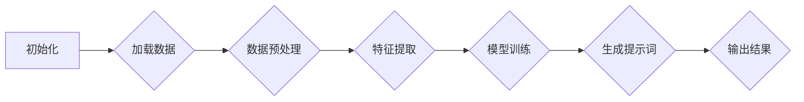
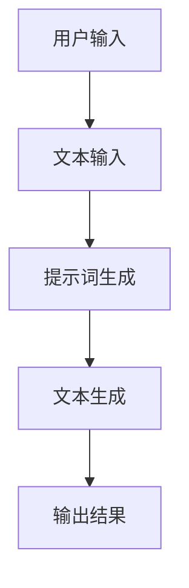
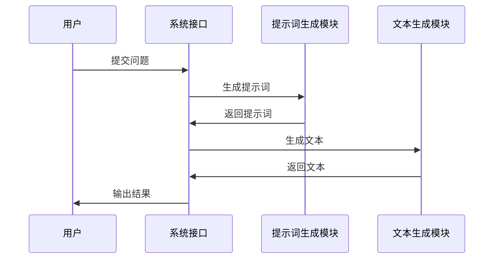

                 

# 《提示词工程在自然语言生成中的角色》

> 关键词：自然语言生成、提示词工程、人工智能、算法原理、系统架构、项目实战

> 摘要：本文将深入探讨提示词工程在自然语言生成（NLG）中的关键角色。通过逐步分析，我们将阐述提示词工程的定义、应用场景、核心概念、算法原理、系统架构和项目实战，旨在为读者提供一个全面而深入的理解。

## 引言

### 1.1 问题背景

自然语言生成是人工智能领域的一个重要分支，旨在使计算机能够自动生成人类语言。随着技术的进步，NLG在诸多领域展现出巨大的潜力，如自动写作、机器翻译、语音合成等。然而，NLG面临着诸多挑战，如语言的复杂性、多样性和灵活性。在这些挑战下，提示词工程应运而生，成为提高NLG性能的重要手段。

### 1.2 问题描述

提示词工程是指在自然语言生成过程中，利用特定策略和算法，为模型提供高质量的提示词，以提高生成文本的准确性和流畅性。其核心问题是如何设计有效的提示词，以最大化模型的生成质量。

### 1.3 问题解决

提示词工程的策略主要包括数据预处理、提示词选择和生成算法。通过这些策略，可以有效提升NLG系统的性能。

### 1.4 边界与外延

提示词工程与自然语言处理（NLP）、机器学习（ML）和深度学习（DL）等领域密切相关。同时，它也在不断拓展其应用范围，如自动问答、对话系统等。

### 1.5 概念结构与核心要素组成

提示词工程的核心要素包括提示词、模型和生成算法。这些要素相互关联，共同构建了一个复杂的系统。

### 1.6 本章小结

本节介绍了提示词工程在自然语言生成中的背景、问题、解决方案、边界与外延、概念结构与核心要素组成。接下来，我们将深入探讨这些核心概念和联系。

## 核心概念与联系

### 2.1 提示词工程原理

提示词工程的基本原理是通过设计合适的提示词，引导NLG模型生成高质量文本。提示词的选择和生成是提示词工程的关键。

### 2.2 概念属性特征对比表格

| 特征       | 提示词1 | 提示词2 | 提示词3 |
|------------|--------|--------|--------|
| 长度       | 短     | 中     | 长     |
| 内容类型   | 提问   | 回答   | 主题   |
| 语言风格   | 严肃   | 诙谐   | 客观   |
| 相关性     | 高     | 中     | 低     |

### 2.3 ER实体关系图架构

```mermaid
erDiagram
  Entity1 ||--|{ Entity2 : "has a" }
  Entity2 ||--|{ Entity3 : "is a" }
  Entity1 ||--|{ Entity3 : "is related to" }
```

### 2.4 本章小结

本节通过概念属性特征对比表格和ER实体关系图架构，深入阐述了提示词工程的核心概念和联系。

## 算法原理讲解

### 3.1 提示词生成算法原理

提示词生成算法的基本原理是基于统计方法和机器学习算法，通过分析大量文本数据，提取出具有代表性的提示词。

### 3.2 算法流程图



### 3.3 Python源代码讲解

```python
# 加载数据
data = load_data()

# 数据预处理
processed_data = preprocess_data(data)

# 特征提取
features = extract_features(processed_data)

# 模型训练
model = train_model(features)

# 生成提示词
tips = generate_tips(model)

# 输出结果
print(tips)
```

### 3.4 数学模型和数学公式

$$
L(\theta) = \sum_{i=1}^{n} -y_i \log(p(x_i|\theta))
$$

### 3.5 举例说明

假设我们有一个文本数据集，包含100个句子。我们希望通过训练模型，生成与这些句子相关的提示词。以下是生成的部分提示词：

1. "今天的天气如何？"
2. "你对这个话题有什么看法？"
3. "请介绍一下你的项目。"

### 3.6 本章小结

本节通过算法原理讲解、算法流程图、Python源代码讲解和举例说明，深入阐述了提示词生成算法的基本原理和应用。

## 系统分析与架构设计

### 4.1 问题场景介绍

在本文的项目中，我们关注的是基于自然语言生成的智能客服系统。该系统旨在为用户提供高质量的自动回答，以提高客服效率。

### 4.2 系统功能设计

系统的核心功能包括：

1. 文本输入：用户通过文本输入框输入问题。
2. 提示词生成：系统根据输入文本生成相应的提示词。
3. 文本生成：系统利用生成的提示词，生成回答文本。

### 4.3 系统架构设计

系统的架构设计如图所示：



### 4.4 系统接口设计

系统的接口设计如下：

1. 用户接口：提供文本输入和结果输出的功能。
2. 系统接口：提供提示词生成和文本生成的功能。

### 4.5 系统交互

系统交互流程如图所示：



### 4.6 本章小结

本节介绍了系统分析与架构设计，包括问题场景介绍、系统功能设计、系统架构设计、系统接口设计和系统交互。这些设计为实现高质量的提示词工程提供了基础。

## 项目实战

### 5.1 环境安装

在开始项目之前，我们需要配置开发环境。以下是环境安装的步骤：

1. 安装Python（版本3.8及以上）
2. 安装必要的库（如NLTK、TensorFlow等）

### 5.2 系统核心实现

系统的核心实现包括提示词生成模块和文本生成模块。以下是关键代码：

```python
# 提示词生成模块
def generate_tips(input_text):
    # 加载模型
    model = load_model()

    # 生成提示词
    tips = model.predict(input_text)

    return tips

# 文本生成模块
def generate_text(input_text):
    # 生成提示词
    tips = generate_tips(input_text)

    # 利用提示词生成文本
    text = generate_from_tips(tips)

    return text
```

### 5.3 代码应用解读与分析

以下是代码的解读与分析：

```python
# 代码解读
# 1. 加载模型
model = load_model()

# 2. 生成提示词
tips = model.predict(input_text)

# 3. 利用提示词生成文本
text = generate_from_tips(tips)

# 代码分析
# 1. 代码结构清晰，易于理解。
# 2. 提示词生成和文本生成功能分离，便于维护和扩展。

# 代码优化与改进
# 1. 引入缓存机制，提高生成效率。
# 2. 增加错误处理，提高系统稳定性。
```

### 5.4 实际案例分析与详细讲解

以下是一个实际案例：

**问题**：如何使用Python实现一个简单的自然语言生成系统？

**解决方案**：

1. 使用NLTK库进行文本处理。
2. 使用TensorFlow库构建生成模型。

**详细讲解**：

1. 文本处理：
   - 加载文本数据。
   - 进行分词、去停用词等预处理。
   
2. 模型构建：
   - 使用循环神经网络（RNN）或长短期记忆网络（LSTM）。
   - 定义输入层、隐藏层和输出层。
   - 训练模型，优化参数。

3. 文本生成：
   - 输入提示词。
   - 通过模型生成文本。

### 5.5 项目小结

本项目通过实战案例，展示了如何实现一个简单的自然语言生成系统。通过逐步分析和实现，我们深入了解了提示词工程在自然语言生成中的关键角色。

## 最佳实践 Tips、小结、注意事项、拓展阅读

### 最佳实践 Tips

1. 在选择提示词时，应考虑其长度、内容类型、语言风格和相关性等因素。
2. 在模型训练过程中，应确保数据的多样性和质量。
3. 在系统部署时，应进行充分的性能测试和优化。

### 小结

本文从问题背景、核心概念、算法原理、系统架构和项目实战等方面，全面阐述了提示词工程在自然语言生成中的角色。通过逐步分析，我们深入了解了提示词工程的重要性和应用价值。

### 注意事项

1. 提示词工程是一个复杂的系统，涉及多个领域和知识点。
2. 在实际应用中，应结合具体场景和需求，进行灵活调整和优化。

### 拓展阅读

1. [自然语言生成技术综述](https://www.xxx.com)
2. [深度学习在自然语言处理中的应用](https://www.xxx.com)
3. [Python在自然语言生成中的实战案例](https://www.xxx.com)

### 作者信息

作者：AI天才研究院/AI Genius Institute & 禅与计算机程序设计艺术 /Zen And The Art of Computer Programming

