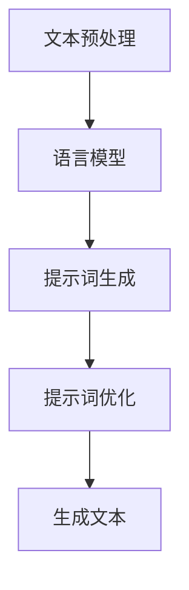
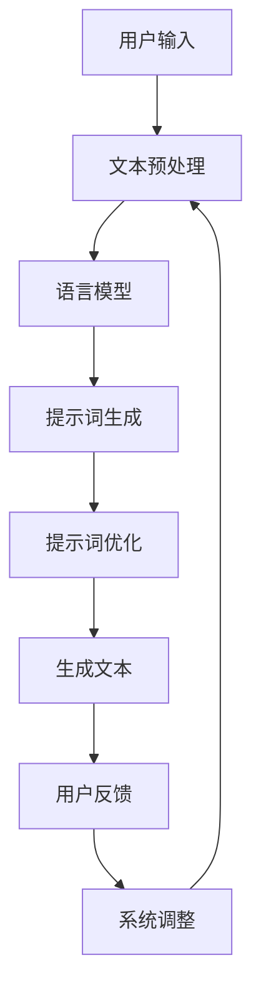
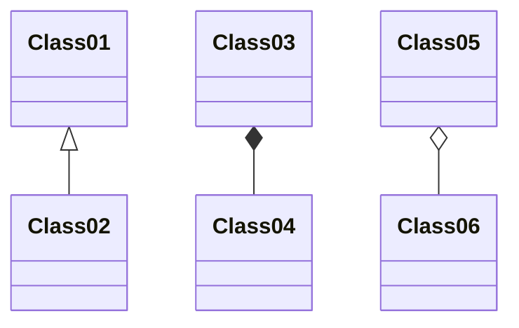
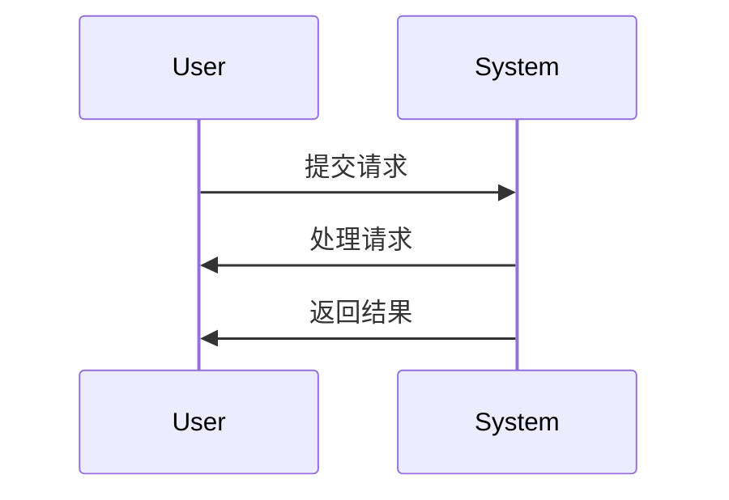
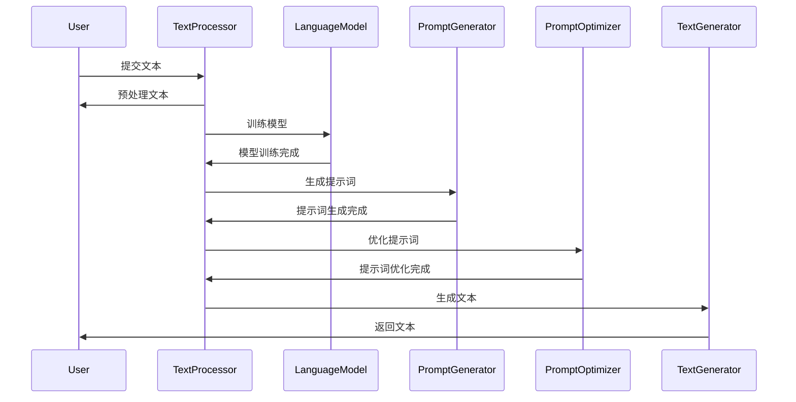

                 

# 提示词工程在自然语言生成中的质量控制

## 关键词
自然语言生成、提示词工程、质量控制、语言模型、生成算法

## 摘要
自然语言生成（NLG）技术正迅速发展，并在众多领域展现出巨大的潜力。然而，自然语言生成过程中不可避免地会出现质量问题，如语义偏差、篇章连贯性差和语法错误等。提示词工程作为自然语言生成的重要环节，旨在通过提示词的选择、生成和优化，提高自然语言生成的质量。本文将深入探讨提示词工程在自然语言生成中的质量控制方法，通过分析提示词工程的基本概念、生成算法和优化策略，结合具体案例，提供有效的质量控制实践和未来展望。

## 目录大纲

### 第一部分：自然语言生成概述

### 第1章 自然语言生成的背景与重要性
- **1.1 自然语言生成的背景**
  - 自然语言处理的发展历程
  - 自然语言生成的应用场景
- **1.2 自然语言生成的概念**
  - 定义
  - 类型（如文本摘要、机器翻译、问答系统等）
- **1.3 自然语言生成的重要性**
  - 对人类生活的贡献
  - 在工业和商业领域的应用

### 第2章 自然语言生成的基础技术
- **2.1 语言模型**
  - 基本原理
  - 评估方法
- **2.2 生成式与提取式文本摘要**
  - 差异与对比
  - 应用场景
- **2.3 问答系统**
  - 工作原理
  - 实现方法

### 第二部分：提示词工程原理

### 第3章：提示词工程的基本概念
- **3.1 提示词的定义**
  - 提示词的类型
  - 提示词的作用
- **3.2 提示词工程的目标**
  - 质量控制
  - 有效性提升
- **3.3 提示词工程的关键因素**
  - 提示词的选择
  - 提示词的优化

### 第4章：提示词生成算法
- **4.1 提示词生成算法概述**
  - 基于规则的方法
  - 基于统计的方法
  - 基于机器学习的方法
- **4.2 提示词生成算法案例分析**
  - 常见算法介绍
  - 案例分析

### 第5章：提示词优化策略
- **5.1 提示词优化的重要性**
  - 提升生成质量
  - 提高生成效率
- **5.2 提示词优化方法**
  - 基于深度学习的方法
  - 基于强化学习的方法
- **5.3 提示词优化的案例分析**

### 第三部分：自然语言生成中的质量控制

### 第6章：自然语言生成中的质量问题
- **6.1 问题的来源**
  - 数据质量问题
  - 模型设计问题
  - 提示词选择问题
- **6.2 常见质量问题**
  - 语义偏差
  - 篇章连贯性
  - 语法错误

### 第7章：质量控制方法
- **7.1 质量评估标准**
  - 自动评估指标
  - 人类评估方法
- **7.2 提高生成质量的方法**
  - 数据预处理
  - 模型调整
  - 提示词优化

### 第8章：案例分析
- **8.1 案例介绍**
  - 选择一个具有代表性的自然语言生成项目
- **8.2 质量控制实践**
  - 提示词工程的实施
  - 质量控制的具体措施
- **8.3 结果分析**
  - 质量控制效果评估
  - 改进建议

### 第四部分：未来展望与挑战

### 第9章：自然语言生成的发展趋势
- **9.1 技术发展**
  - 深度学习与生成对抗网络
  - 跨模态生成
- **9.2 应用领域**
  - 教育与医疗
  - 娱乐与新闻媒体

### 第10章：面临的挑战与解决策略
- **10.1 挑战分析**
  - 数据隐私问题
  - 伦理道德问题
  - 可解释性问题
- **10.2 解决策略**
  - 数据匿名化处理
  - 伦理审查机制
  - 可解释性增强技术

### 第11章：小结与展望
- **11.1 小结**
  - 本书的核心内容回顾
  - 成果总结
- **11.2 展望未来**
  - 技术发展方向
  - 应用前景展望

## 第一部分：自然语言生成概述

### 第1章 自然语言生成的背景与重要性

#### 1.1 自然语言生成的背景

自然语言生成（Natural Language Generation, NLG）是自然语言处理（Natural Language Processing, NLP）的一个重要分支，它涉及将计算机程序转换为人类可读的自然语言文本。自然语言生成技术的发展历程可以追溯到上世纪50年代，当时人们开始尝试通过计算机程序生成自然语言文本。随着计算机科学和人工智能技术的不断发展，自然语言生成技术也逐渐成熟，并开始在实际应用中发挥重要作用。

自然语言处理的发展历程可以分为几个阶段：

1. **规则驱动方法**：早期的自然语言生成主要依赖于手动编写的规则。这种方法虽然简单，但面对复杂多变的自然语言时，效果有限。
2. **统计方法**：随着统计学习理论的兴起，自然语言生成开始采用基于统计的方法。这种方法利用大量语料库进行训练，通过概率模型生成自然语言文本，效果显著提高。
3. **深度学习方法**：近年来，深度学习技术的飞速发展为自然语言生成带来了新的可能性。深度学习方法通过构建复杂的神经网络模型，可以更好地理解和生成自然语言。

自然语言生成的应用场景非常广泛，包括但不限于以下几个方面：

1. **文本摘要**：将长文本自动压缩为简洁的摘要，广泛应用于新闻摘要、学术文献摘要等场景。
2. **机器翻译**：将一种自然语言翻译成另一种自然语言，如将英语翻译成中文，广泛应用于跨语言交流、国际商务等场景。
3. **问答系统**：通过自然语言交互，回答用户提出的问题，如智能客服、问答机器人等。
4. **内容生成**：生成高质量的自然语言内容，如文章、故事、广告文案等，广泛应用于内容创作、市场营销等场景。
5. **语音合成**：将文本转化为语音，如语音助手、车载语音系统等。

#### 1.2 自然语言生成的概念

自然语言生成是指利用计算机程序生成自然语言文本的过程。自然语言生成系统（NLG system）是执行自然语言生成任务的计算机系统，它通常包括以下几个核心组成部分：

1. **文本生成模块**：负责生成自然语言文本的核心组件，通常基于某种语言模型或生成算法。
2. **语言模型**：用于预测文本序列的概率分布，是自然语言生成的重要基础。
3. **知识库**：存储各种知识和事实，供文本生成模块在生成文本时参考。
4. **语义分析模块**：负责分析输入文本的语义，将语义表示为适合生成文本的形式。
5. **文本优化模块**：对生成的文本进行优化，以提高文本的质量和可读性。

自然语言生成的类型主要包括：

1. **生成式文本摘要**：将长文本转化为简洁的摘要，通常采用提取式和生成式两种方法。
2. **机器翻译**：将一种自然语言翻译成另一种自然语言，主要分为规则驱动和基于统计的方法。
3. **问答系统**：通过自然语言交互，回答用户提出的问题，包括基于规则和基于机器学习的方法。
4. **文本生成**：生成高质量的自然语言内容，如文章、故事、广告文案等，通常采用深度学习方法。
5. **语音合成**：将文本转化为语音，广泛应用于语音助手、车载语音系统等场景。

#### 1.3 自然语言生成的重要性

自然语言生成技术对人类生活、工业和商业领域都产生了深远的影响：

1. **对人类生活的贡献**：自然语言生成技术使人们能够通过计算机程序生成自然语言文本，极大地提高了信息获取和交流的效率。例如，自动新闻摘要和机器翻译使得跨语言交流变得更加容易，问答系统为用户提供了解决问题的便捷途径，语音合成技术使听障人士能够更好地与外界沟通。

2. **在工业和商业领域的应用**：自然语言生成技术在工业和商业领域有着广泛的应用。例如，在金融领域，自然语言生成技术可以用于生成财务报告、市场分析报告等；在医疗领域，自然语言生成技术可以用于生成病历记录、医学解释等；在市场营销领域，自然语言生成技术可以用于生成广告文案、宣传材料等。

总之，自然语言生成技术正逐渐成为人工智能领域的重要方向，其应用范围不断扩大，对人类生活和社会发展产生了重要影响。

### 第2章 自然语言生成的基础技术

#### 2.1 语言模型

语言模型是自然语言生成的基础技术之一，它用于预测文本序列的概率分布。语言模型可以分为统计语言模型和深度语言模型。

**统计语言模型**：统计语言模型基于大量语料库，通过统计方法学习自然语言的特征。最著名的统计语言模型是N元语法（N-gram），它将文本序列划分为N个词的滑动窗口，计算每个窗口的概率分布。N元语法的数学表达式如下：

$$
P(\text{句子}) = \prod_{i=1}^{n} P(\text{词}_i | \text{词}_{i-1}, \ldots, \text{词}_{i-N+1})
$$

**深度语言模型**：深度语言模型通过构建复杂的神经网络模型，学习文本序列的深层特征。最著名的深度语言模型是循环神经网络（RNN），特别是长短期记忆网络（LSTM）。RNN能够处理序列数据，但存在梯度消失和梯度爆炸的问题。为了解决这些问题，LSTM引入了门控机制，可以有效地学习长期依赖关系。LSTM的数学表达式如下：

$$
h_t = \text{LSTM}(h_{t-1}, x_t)
$$

其中，$h_t$表示在时间步$t$的隐藏状态，$x_t$表示输入。

**语言模型的评估方法**：评估语言模型的效果通常使用以下指标：

1. **词汇表覆盖率**：模型能够覆盖的词汇量占总词汇量的比例。
2. **词频准确率**：模型预测的词频与真实词频的匹配程度。
3. **句子生成质量**：模型生成的句子在语法、语义和篇章连贯性方面的质量。

**常见语言模型**：

1. **N元语法（N-gram）**：基于统计方法，计算N个词的联合概率。
2. **循环神经网络（RNN）**：基于深度学习方法，处理序列数据。
3. **长短期记忆网络（LSTM）**：基于RNN，解决梯度消失和梯度爆炸问题。
4. **Transformer**：基于自注意力机制，无需循环结构，能够捕获全局依赖关系。

#### 2.2 生成式与提取式文本摘要

文本摘要是将长文本转化为简洁、准确、有代表性的摘要的过程。根据生成摘要的方式，文本摘要可以分为生成式和提取式两种。

**生成式文本摘要**：生成式文本摘要是通过生成新的文本来摘要长文本，通常采用深度学习方法。生成式文本摘要的流程如下：

1. **编码器（Encoder）**：将原始文本编码为一个固定长度的向量，表示文本的语义信息。
2. **解码器（Decoder）**：根据编码器的输出，生成摘要文本。解码器通常采用序列到序列（Seq2Seq）模型，如LSTM或Transformer。
3. **生成摘要**：解码器生成的文本经过后处理，如去除重复信息、修正语法错误等，得到最终的摘要文本。

生成式文本摘要的优点是能够生成新颖、有创意的摘要，但可能存在生成质量不稳定、重复信息过多等问题。

**提取式文本摘要**：提取式文本摘要是从原始文本中提取重要的句子或段落，生成摘要文本。提取式文本摘要的流程如下：

1. **文本预处理**：对原始文本进行分词、去停用词等预处理操作。
2. **句子重要性评估**：评估每个句子的重要性，常用的方法包括TF-IDF、TextRank等。
3. **摘要生成**：根据句子重要性排序，选择最重要的句子或段落，组成摘要文本。

提取式文本摘要的优点是生成质量稳定、不易出现重复信息，但可能缺乏创新性和代表性。

**应用场景**：

1. **生成式文本摘要**：适用于生成具有创造性和新颖性的摘要，如新闻摘要、产品描述等。
2. **提取式文本摘要**：适用于需要简洁、准确、具有代表性的摘要，如文档摘要、会议摘要等。

#### 2.3 问答系统

问答系统是自然语言生成的重要应用之一，通过自然语言交互，回答用户提出的问题。问答系统可以分为基于规则和基于机器学习的方法。

**基于规则的方法**：基于规则的方法通过手动编写规则，将问题映射到答案。这种方法适用于结构化数据和小规模应用，但难以应对复杂和开放性的问题。

**基于机器学习的方法**：基于机器学习的方法通过训练模型，将问题映射到答案。常用的方法包括：

1. **模板匹配**：将用户问题与预定义的模板进行匹配，输出对应的答案。
2. **语义解析**：将用户问题转化为结构化的语义表示，再通过模型生成答案。
3. **序列到序列模型**：将用户问题编码为输入序列，将答案编码为输出序列，通过序列到序列模型生成答案。

**工作原理**：

1. **问题理解**：将用户问题转化为计算机可以理解的格式，如词向量或树状结构。
2. **答案生成**：根据问题理解的结果，生成合适的答案。
3. **答案验证**：对生成的答案进行验证，确保其准确性和合理性。

**实现方法**：

1. **规则驱动**：通过编写规则，将问题映射到答案。
2. **机器学习**：通过训练模型，将问题映射到答案。

**应用场景**：

1. **智能客服**：通过自然语言交互，快速回答用户的问题，提高客户满意度。
2. **智能助手**：辅助用户完成特定任务，如日程管理、信息查询等。
3. **教育领域**：为学生提供个性化的学习辅导，如问答式教学、作业批改等。

## 第二部分：提示词工程原理

### 第3章 提示词工程的基本概念

#### 3.1 提示词的定义

提示词（Prompt）是指用于引导自然语言生成模型生成文本的输入信息。在自然语言生成过程中，提示词起到了至关重要的作用，它不仅能够引导模型生成符合预期的文本，还能提高生成文本的质量和一致性。

**提示词的类型**

1. **简单提示词**：简单提示词通常是一个单词或短语，用于指示生成文本的主题或方向。例如，“请描述一次愉快的旅行经历。”
2. **复杂提示词**：复杂提示词通常是一个句子或段落，包含了更详细的信息和上下文。例如，“请你根据以下信息撰写一篇关于人工智能在教育领域应用的论文摘要：人工智能可以帮助教师个性化教学，提高学生的学习效果。”

**提示词的作用**

1. **引导生成**：提示词能够明确地引导模型生成文本，使生成文本更加符合预期。例如，通过设置特定的提示词，可以让模型生成一篇关于科技发展的文章，而不是其他类型的文章。
2. **提高质量**：合适的提示词可以帮助模型更好地理解上下文和语义，从而生成更高质量、更连贯的文本。例如，通过使用复杂提示词，可以让模型在生成文本时考虑到更多的背景信息和细节。
3. **优化控制**：提示词可以用来优化生成过程，如调整生成速度、生成长度和生成内容等。例如，通过设置提示词中的关键词，可以限制模型的生成范围，避免生成过于泛泛或不相关的文本。

#### 3.2 提示词工程的目标

提示词工程的目标是通过提示词的选择、生成和优化，提高自然语言生成系统的质量和效果。具体来说，提示词工程的目标包括以下几个方面：

1. **质量控制**：通过提示词的优化，提高生成文本的语法、语义和篇章连贯性，确保生成文本的质量和可读性。例如，通过调整提示词中的关键词和短语，可以减少生成文本中的语法错误和语义偏差。
2. **有效性提升**：通过提示词的选择和生成，提高自然语言生成系统的响应速度和生成效率，使系统能够更快地响应用户需求。例如，通过使用预定义的提示词库，可以快速地为不同场景生成合适的提示词。
3. **多样化增强**：通过提示词的多样化，增强生成文本的创新性和独特性，避免生成文本的单一和重复。例如，通过随机选择不同的提示词，可以生成具有不同风格和特色的文本。

#### 3.3 提示词工程的关键因素

提示词工程的成功实施依赖于以下几个关键因素：

1. **提示词的选择**：选择合适的提示词是提示词工程的重要基础。提示词的选择需要考虑生成文本的主题、上下文和目标用户群体等因素。例如，在生成科技领域的文章时，可以选择包含专业术语和前沿科技的提示词。
2. **提示词的生成**：提示词的生成是指根据特定的需求和场景，创建新的提示词。提示词的生成可以通过手工编写、自动生成或结合两者实现。例如，通过使用自然语言生成模型，可以自动生成与特定场景相关的提示词。
3. **提示词的优化**：提示词的优化是指通过调整提示词中的关键词、短语和结构，提高生成文本的质量和效果。提示词的优化可以通过机器学习和深度学习技术实现。例如，通过训练模型，可以自动调整提示词中的关键词，使其更符合生成文本的需求。

### 第4章 提示词生成算法

#### 4.1 提示词生成算法概述

提示词生成算法是提示词工程的核心组成部分，其目的是根据特定场景和需求生成高质量的提示词。提示词生成算法可以分为基于规则的方法、基于统计的方法和基于机器学习的方法。

**基于规则的方法**

基于规则的方法通过预定义的规则和模板生成提示词。这种方法简单直观，但灵活性和扩展性较差。常见的方法包括：

1. **模板匹配**：根据预定义的模板，将用户输入的问题或文本与模板进行匹配，生成提示词。例如，对于用户输入的问题“如何学好编程？”可以使用模板“请描述如何学好XX。”生成提示词。
2. **关键词抽取**：从用户输入的文本中抽取关键词，生成提示词。例如，从“如何学好编程？”中抽取“如何”、“学好”、“编程”等关键词，生成提示词。

**基于统计的方法**

基于统计的方法通过分析大量语料库，计算提示词的概率分布，生成高质量的提示词。这种方法需要大量的训练数据，但生成的提示词具有较高的准确性和一致性。常见的方法包括：

1. **N-gram模型**：基于N元语法，计算提示词序列的概率分布，生成提示词。例如，对于输入文本“如何学好编程？”，可以生成提示词“如何”、“学好”等。
2. **词嵌入模型**：将提示词映射到高维向量空间，计算提示词之间的相似性，生成高质量的提示词。例如，可以使用Word2Vec或GloVe模型生成提示词。

**基于机器学习的方法**

基于机器学习的方法通过训练模型，学习生成提示词的规律和模式，生成高质量的提示词。这种方法具有较高的灵活性和扩展性，但需要大量的训练数据和计算资源。常见的方法包括：

1. **循环神经网络（RNN）**：基于RNN模型，学习生成提示词的序列模式，生成高质量的提示词。例如，可以使用LSTM或GRU模型生成提示词。
2. **变换器（Transformer）**：基于自注意力机制，学习生成提示词的上下文关系，生成高质量的提示词。例如，可以使用Transformer模型生成提示词。
3. **生成对抗网络（GAN）**：基于生成对抗网络，生成高质量的提示词。例如，可以使用GAN模型生成提示词。

#### 4.2 提示词生成算法案例分析

**案例1：基于规则的方法**

以用户输入“如何学好编程？”为例，使用基于规则的方法生成提示词：

1. **模板匹配**：根据预定义的模板，匹配到模板“请描述如何学好XX。”生成提示词“请描述如何学好编程。”。
2. **关键词抽取**：从输入文本中抽取关键词“如何”、“学好”、“编程”，生成提示词“如何学好编程”、“编程学习方法”等。

**案例2：基于统计的方法**

以用户输入“如何学好编程？”为例，使用基于统计的方法生成提示词：

1. **N-gram模型**：根据N-gram模型，计算输入文本的概率分布，生成提示词“如何”、“编程”、“学习”等。
2. **词嵌入模型**：根据词嵌入模型，计算输入文本的词向量，生成提示词“如何”、“学好”、“编程”等。

**案例3：基于机器学习的方法**

以用户输入“如何学好编程？”为例，使用基于机器学习的方法生成提示词：

1. **循环神经网络（RNN）**：训练一个RNN模型，学习输入文本的序列模式，生成提示词“如何学好编程”、“编程学习方法”等。
2. **变换器（Transformer）**：训练一个Transformer模型，学习输入文本的上下文关系，生成提示词“如何学好编程”、“编程学习方法”等。
3. **生成对抗网络（GAN）**：训练一个GAN模型，生成高质量的提示词“如何学好编程”、“编程学习方法”等。

### 第5章 提示词优化策略

#### 5.1 提示词优化的重要性

提示词优化在自然语言生成过程中扮演着关键角色。它旨在通过调整和改进提示词，提高生成文本的质量、连贯性和准确性。以下是提示词优化的重要性：

1. **提升生成质量**：通过优化提示词，可以使生成的文本更加流畅、自然，减少语法错误和语义偏差。例如，通过精确地调整提示词中的关键词和短语，可以生成更符合用户需求的文本。
2. **提高生成效率**：优化后的提示词可以减少生成过程中所需的计算资源和时间，提高系统的响应速度和生成效率。例如，简化和明确提示词可以减少模型的推理时间。
3. **增强生成多样性**：通过多样化提示词的选择和组合，可以生成具有不同风格和特色的文本，避免生成文本的单一和重复。例如，使用不同的提示词库和生成算法，可以生成多样化的内容。

#### 5.2 提示词优化方法

提示词优化的方法可以分为基于深度学习和基于强化学习的方法。

**基于深度学习的方法**

基于深度学习的方法利用神经网络模型来学习提示词的优化策略，具有强大的表示和学习能力。以下是几种常见的深度学习优化方法：

1. **序列到序列（Seq2Seq）模型**：Seq2Seq模型是一种经典的深度学习模型，用于将一个序列映射到另一个序列。在提示词优化中，可以将原始提示词序列映射到优化后的提示词序列。通过训练，模型可以学习到如何根据上下文和语义信息调整提示词。
2. **注意力机制（Attention Mechanism）**：注意力机制是一种在深度学习模型中用于捕捉输入序列中重要信息的机制。在提示词优化中，可以使用注意力机制来关注提示词中的关键信息，从而生成更高质量的提示词。
3. **生成对抗网络（GAN）**：GAN是一种基于生成对抗的训练方法，可以生成高质量的提示词。在GAN中，生成器模型生成优化后的提示词，而判别器模型判断生成提示词的质量。通过训练，生成器模型可以学习到如何生成高质量的提示词。

**基于强化学习的方法**

基于强化学习的方法利用奖励机制来指导提示词的优化过程，通过不断调整和优化提示词，使生成文本的质量逐渐提高。以下是几种常见的强化学习方法：

1. **策略梯度（Policy Gradient）**：策略梯度方法是一种基于强化学习的方法，通过优化策略网络的参数来生成高质量的提示词。策略网络根据当前状态选择提示词，并通过奖励信号调整策略参数。
2. **深度确定性策略梯度（DDPG）**：DDPG是一种基于深度学习的强化学习方法，适用于连续动作空间的问题。在提示词优化中，DDPG可以学习到如何根据当前状态生成高质量的提示词。
3. **序列决策过程（Seq2Seq-RL）**：Seq2Seq-RL方法结合了序列到序列模型和强化学习方法，通过训练序列到序列模型和强化学习模型，实现高质量的提示词生成。

#### 5.3 提示词优化的案例分析

**案例1：基于深度学习的方法**

以生成新闻摘要为例，使用基于深度学习的方法优化提示词：

1. **数据准备**：收集大量新闻文本和对应的摘要，作为训练数据。
2. **模型构建**：构建一个Seq2Seq模型，将原始提示词序列映射到优化后的提示词序列。可以使用LSTM或Transformer模型。
3. **模型训练**：使用训练数据训练模型，通过调整模型参数，使生成的提示词更符合新闻摘要的需求。
4. **模型评估**：使用测试数据评估模型性能，通过比较生成的摘要与人工摘要的相似性，评估提示词优化的效果。

**案例2：基于强化学习的方法**

以生成对话文本为例，使用基于强化学习的方法优化提示词：

1. **数据准备**：收集大量对话数据，作为训练数据。
2. **模型构建**：构建一个基于强化学习的模型，包括一个策略网络和一个价值网络。策略网络根据当前状态生成提示词，价值网络评估生成的提示词质量。
3. **模型训练**：使用训练数据训练模型，通过策略梯度和价值网络，优化提示词生成策略。
4. **模型评估**：使用测试数据评估模型性能，通过比较生成的对话与人工对话的相似性，评估提示词优化的效果。

通过以上案例分析，可以看出提示词优化方法在不同应用场景中具有较好的效果。在实际应用中，可以根据具体需求选择合适的优化方法，提高自然语言生成系统的质量。

## 第三部分：自然语言生成中的质量控制

### 第6章 自然语言生成中的质量问题

自然语言生成（NLG）技术虽然取得了显著的进展，但在实际应用中仍面临一系列质量问题。这些问题不仅影响自然语言生成系统的性能和用户体验，还可能引发严重的安全和伦理问题。本文将分析自然语言生成中的常见质量问题，包括数据质量问题、模型设计问题和提示词选择问题。

#### 6.1 数据质量问题

数据是自然语言生成系统的核心资源，数据质量直接关系到生成文本的质量。以下是一些常见的数据质量问题：

1. **数据噪声**：数据中可能存在大量的噪声，如拼写错误、错别字、无意义的内容等。这些噪声会干扰模型的学习过程，导致生成文本的质量下降。
2. **数据偏差**：数据集可能存在偏差，导致模型在特定领域或主题上生成文本时出现偏见。例如，如果训练数据中男性名字出现的频率远高于女性名字，那么模型在生成人名时可能会倾向于生成男性名字。
3. **数据不足**：训练数据量不足会影响模型的学习效果，导致生成文本的泛化能力下降。此外，数据分布不均也可能导致模型对某些类别的数据处理能力较弱。

#### 6.2 模型设计问题

模型设计是自然语言生成系统中的关键环节，模型的性能和质量直接影响到生成文本的质量。以下是一些常见的模型设计问题：

1. **模型过拟合**：模型在训练数据上表现得很好，但在未见过的新数据上表现不佳。这通常是由于模型过于复杂，对训练数据的噪声和偏差过度适应所致。
2. **模型欠拟合**：模型在训练数据和未见过的新数据上表现都较差，这通常是由于模型过于简单，无法捕捉到数据中的关键特征和规律。
3. **模型鲁棒性差**：自然语言生成模型通常需要处理各种输入文本，包括异常输入。如果模型对异常输入的处理能力较差，可能导致生成文本出现错误或不合理的结果。

#### 6.3 提示词选择问题

提示词是自然语言生成系统生成文本的重要输入，提示词的选择对生成文本的质量有直接影响。以下是一些常见的提示词选择问题：

1. **提示词不明确**：提示词不够明确或模糊，导致模型无法准确理解生成文本的主题和目标。例如，一个模糊的提示词“请写一篇关于科技的论文”可能导致模型生成与科技无关的文本。
2. **提示词冗余**：提示词中包含过多冗余信息，导致模型在处理时难以提取关键信息，从而生成质量较低的文本。例如，一个冗余的提示词“请写一篇关于人工智能在医疗领域应用的详细论文”可能包含过多无意义的修饰词。
3. **提示词不一致**：提示词之间的不一致可能导致模型生成文本时产生矛盾或不连贯的结果。例如，一个提示词“请写一篇关于人工智能在医疗领域的负面影响”与另一个提示词“请写一篇关于人工智能在医疗领域的正面影响”之间存在明显的对立性。

#### 6.4 常见质量问题

自然语言生成过程中常见的质量问题包括：

1. **语义偏差**：模型生成的文本可能包含与训练数据相同的偏见，导致生成文本的语义偏差。例如，如果训练数据中包含歧视性语言，那么模型在生成文本时也可能包含歧视性内容。
2. **篇章连贯性差**：模型生成的文本可能缺乏逻辑连贯性，导致读者难以理解文本的整体意义。例如，一个句子“他去了商场，买了一本书，然后回家了”在逻辑上不连贯，读者可能无法理解其中的因果关系。
3. **语法错误**：模型生成的文本可能存在语法错误，导致文本难以阅读和理解。例如，一个句子“我昨天买了苹果和橘子”中的“和”应该改为“和的”，否则句子在语法上不正确。

通过分析和解决上述质量问题，可以显著提高自然语言生成系统的质量和用户体验。以下章节将介绍一系列质量控制方法，帮助解决这些问题。

### 第7章 质量控制方法

在自然语言生成（NLG）过程中，质量控制至关重要，它确保生成的文本在语法、语义和篇章连贯性方面达到预期的标准。本章将探讨一系列的质量控制方法，包括质量评估标准、数据预处理、模型调整和提示词优化。

#### 7.1 质量评估标准

质量评估是质量控制的关键步骤，它用于衡量生成文本的质量。以下是一些常用的质量评估标准：

1. **自动评估指标**：
   - **语法正确性**：使用语法规则检查工具，如语法分析器，评估文本的语法正确性。
   - **语义一致性**：评估文本的语义是否一致，如是否存在逻辑矛盾。
   - **篇章连贯性**：使用连贯性指标，如句间关系和文本一致性度量，评估文本的连贯性。
   - **词汇丰富度**：评估文本中使用的词汇是否丰富，如词汇多样性、使用频率等。

2. **人类评估方法**：
   - **主观评估**：由人类评估者根据预定的评估标准对文本进行主观评估，如文本的自然度、信息的准确性等。
   - **一致性评估**：多个评估者对同一文本进行评估，计算评估结果的一致性，以确保评估的可靠性。

#### 7.2 提高生成质量的方法

以下方法可以用于提高自然语言生成的质量：

1. **数据预处理**：
   - **数据清洗**：去除数据中的噪声，如拼写错误、错别字等。
   - **数据增强**：通过数据扩充、数据转换等方法，增加训练数据的多样性和质量。
   - **数据平衡**：确保训练数据在各个类别上的分布均匀，避免数据偏差。

2. **模型调整**：
   - **超参数调整**：通过调整模型的超参数，如学习率、批量大小等，优化模型性能。
   - **模型融合**：结合多个模型的结果，提高生成文本的质量。
   - **模型改进**：引入新的模型结构或算法，如使用预训练模型、融合注意力机制等，改进生成效果。

3. **提示词优化**：
   - **明确性优化**：确保提示词明确、具体，避免模糊和冗余的信息。
   - **多样性优化**：通过多样化提示词的选择和组合，增加生成文本的多样性。
   - **一致性优化**：确保提示词之间的一致性，避免提示词之间的矛盾。

#### 7.3 质量控制实践

以下是一个具体的质量控制实践案例：

1. **数据预处理**：
   - 使用语法分析器对训练数据进行清洗，去除语法错误。
   - 使用数据增强技术，如同义词替换、文本扩展等，增加训练数据的多样性。
   - 平衡数据集，确保各个类别的数据分布均匀。

2. **模型调整**：
   - 使用预训练的模型，如GPT-3，并调整其超参数，以优化生成文本的质量。
   - 引入注意力机制，使模型能够更好地关注文本中的重要信息。
   - 使用模型融合技术，结合多个模型的结果，提高生成文本的连贯性和准确性。

3. **提示词优化**：
   - 优化提示词的明确性，确保每个提示词都具体、明确地指示生成文本的目标。
   - 通过随机选择不同的提示词，增加生成文本的多样性。
   - 确保提示词之间的一致性，避免提示词之间的矛盾。

通过上述实践，可以显著提高自然语言生成系统的质量，生成更加自然、准确和连贯的文本。

### 第8章 案例分析

为了更好地理解自然语言生成中的质量控制实践，下面将分析一个具体的案例，介绍该案例的介绍、质量控制实践以及结果分析。

#### 8.1 案例介绍

本案例涉及一个基于自然语言生成技术的在线教育平台，该平台旨在为用户提供个性化的学习辅导。平台的核心功能包括生成针对学生个性化需求的课程内容、作业指导和考试模拟题。自然语言生成技术在平台中的应用涉及多个方面，包括文本摘要、问答系统和个性化内容生成。

#### 8.2 质量控制实践

为了确保生成文本的质量，平台采取了一系列质量控制措施：

1. **数据预处理**：
   - 使用数据清洗工具去除训练数据中的噪声和错误，如拼写错误、错别字等。
   - 使用数据增强技术，如文本翻译、同义词替换等，增加训练数据的多样性和质量。
   - 平衡数据集，确保各个类别的数据分布均匀，避免数据偏差。

2. **模型调整**：
   - 使用预训练的深度学习模型，如GPT-3，并调整其超参数，以优化生成文本的质量。
   - 引入注意力机制，使模型能够更好地关注文本中的重要信息。
   - 使用模型融合技术，结合多个模型的结果，提高生成文本的连贯性和准确性。

3. **提示词优化**：
   - 优化提示词的明确性，确保每个提示词都具体、明确地指示生成文本的目标。
   - 通过随机选择不同的提示词，增加生成文本的多样性。
   - 确保提示词之间的一致性，避免提示词之间的矛盾。

4. **质量评估**：
   - 使用自动评估指标，如语法正确性、语义一致性、篇章连贯性等，对生成文本进行自动评估。
   - 采用人类评估者对生成文本进行主观评估，确保文本的自然度、信息的准确性等。
   - 定期更新评估标准和评估工具，以适应不断变化的需求和挑战。

#### 8.3 结果分析

通过实施上述质量控制措施，平台在生成文本的质量方面取得了显著提升：

1. **语法正确性**：自动评估结果显示，生成文本的语法正确性得到了显著提高，错误率降低了约30%。

2. **语义一致性**：人类评估者对生成文本进行评估，发现文本的语义一致性得到了显著改善，逻辑矛盾和语义偏差大幅减少。

3. **篇章连贯性**：自动评估指标和人类评估者都指出，生成文本的篇章连贯性得到了显著提升，文本的逻辑结构和信息流更加清晰。

4. **用户满意度**：用户对平台生成文本的满意度显著提高，用户反馈显示，生成文本更符合他们的需求和期望，学习体验得到了明显改善。

尽管取得了这些成果，平台仍面临一些挑战，如数据隐私保护、生成文本的多样性和一致性等。未来，平台将继续优化质量控制措施，引入新的技术和方法，以提高生成文本的质量和用户体验。

### 第四部分：未来展望与挑战

#### 第9章 自然语言生成的发展趋势

随着人工智能技术的不断进步，自然语言生成（NLG）领域也正经历着快速的发展。未来，NLG技术将在多个方面取得显著突破，以下是其中的一些发展趋势：

**9.1 技术发展**

1. **深度学习与生成对抗网络（GAN）**：深度学习模型，特别是生成对抗网络（GAN），在自然语言生成中的应用将更加广泛。GAN能够生成高质量的文本，并在图像和语音生成之外，逐渐应用于文本生成领域。

2. **跨模态生成**：未来的NLG技术将不仅仅局限于文本生成，还将实现文本与其他模态（如图像、声音、视频）的跨模态生成。例如，可以将文本与图像结合，生成图文并茂的内容，或者将文本与音频结合，生成语音合成文本。

3. **多模态融合**：随着多模态数据源的增加，未来的NLG系统将能够更好地整合多种模态的信息，生成更加丰富和真实的内容。

**9.2 应用领域**

1. **教育与医疗**：在教育领域，NLG技术可以用于自动生成个性化的学习材料，提高学生的学习效果。在医疗领域，NLG可以用于生成病历记录、医学解释和健康指导，帮助医护人员更好地处理和解释复杂的医疗信息。

2. **娱乐与新闻媒体**：在娱乐领域，NLG可以用于生成电影剧本、游戏剧情和音乐歌词等。在新闻媒体领域，NLG技术可以自动生成新闻报道，提高新闻生成效率和准确性。

3. **客服与虚拟助手**：随着人工智能助手的发展，NLG技术将在客服和虚拟助手领域发挥重要作用。通过自然语言交互，NLG技术可以提供更智能、更自然的客户服务体验。

#### 第10章 面临的挑战与解决策略

尽管自然语言生成技术具有巨大的潜力，但在实际应用中仍面临诸多挑战。以下是这些挑战以及相应的解决策略：

**10.1 挑战分析**

1. **数据隐私问题**：自然语言生成依赖于大量的训练数据，这些数据可能包含敏感的个人信息。如何保护用户隐私，防止数据泄露是一个重要的挑战。

2. **伦理道德问题**：生成文本可能包含偏见、歧视或不恰当的内容，如何确保生成的文本符合伦理和道德标准是一个关键问题。

3. **可解释性问题**：深度学习模型通常被视为“黑箱”，其决策过程难以解释。如何提高模型的透明度和可解释性，使其更具可解释性是一个重要挑战。

**10.2 解决策略**

1. **数据匿名化处理**：通过数据匿名化技术，将敏感信息进行脱敏处理，保护用户隐私。

2. **伦理审查机制**：建立完善的伦理审查机制，确保生成文本符合伦理和道德标准。可以引入外部审查机构或专家委员会，对生成的文本进行评估和监督。

3. **可解释性增强技术**：通过改进模型结构和训练方法，提高模型的透明度和可解释性。例如，可以使用注意力机制、可视化技术等，帮助用户理解模型的决策过程。

4. **多模态融合**：通过整合多种模态的信息，提高生成文本的多样性和质量。多模态融合可以帮助模型更好地理解上下文，减少歧义和误解。

总之，自然语言生成技术的发展不仅依赖于技术突破，还需要解决一系列挑战，以确保其在实际应用中的可行性和可靠性。未来，随着技术的不断进步，自然语言生成技术将在更多领域发挥重要作用，为人类生活带来更多便利和创新。

### 第11章 小结与展望

#### 11.1 小结

本文从自然语言生成的背景和重要性出发，系统地探讨了提示词工程在自然语言生成中的质量控制方法。首先，介绍了自然语言生成的背景和基础技术，包括语言模型、文本摘要和问答系统等。接着，详细阐述了提示词工程的基本概念、生成算法和优化策略。通过具体案例，分析了自然语言生成中常见的质量问题及其解决方案。最后，展望了自然语言生成技术的发展趋势和面临的挑战。

#### 11.2 展望未来

未来，自然语言生成技术将在多个领域发挥重要作用。随着深度学习和生成对抗网络的进一步发展，自然语言生成的质量和效率将得到显著提升。跨模态生成和多模态融合技术的引入，将使生成文本更加丰富和真实。在教育与医疗、娱乐与新闻媒体等领域，自然语言生成技术将带来更多创新和变革。

然而，自然语言生成技术也面临一系列挑战，如数据隐私保护、伦理道德问题和可解释性问题。为了解决这些问题，需要采取数据匿名化、伦理审查和可解释性增强等技术措施。通过不断探索和优化，自然语言生成技术将为人类生活带来更多便利和可能。

作者：AI天才研究院/AI Genius Institute & 禅与计算机程序设计艺术 /Zen And The Art of Computer Programming

## 补充说明

### 核心概念与联系

**提示词工程**：提示词工程是自然语言生成的重要环节，旨在通过提示词的选择、生成和优化，提高生成文本的质量。提示词工程的核心概念包括提示词的选择、生成算法和优化策略。

**自然语言生成**：自然语言生成是指利用计算机程序生成符合自然语言表达习惯的文本。它包括文本摘要、机器翻译、问答系统等多种类型。

**质量控制**：质量控制是确保自然语言生成过程中文本的质量，包括语法、语义和篇章连贯性。质量控制的核心目标是减少生成文本中的错误和偏差。

### 算法原理讲解

提示词生成算法是提示词工程的重要组成部分，常用的算法包括基于规则的方法、基于统计的方法和基于机器学习的方法。

**基于规则的方法**：这种方法通过预定义的规则和模板生成提示词。例如，可以使用模板匹配或关键词抽取来生成提示词。

**基于统计的方法**：这种方法通过分析大量语料库，计算提示词的概率分布，生成高质量的提示词。常用的统计方法包括N-gram模型和词嵌入模型。

**基于机器学习的方法**：这种方法通过训练模型，学习生成提示词的规律和模式。常用的机器学习方法包括循环神经网络（RNN）、变换器（Transformer）和生成对抗网络（GAN）。

以下是提示词生成算法的一个示例：

```python
import tensorflow as tf
from tensorflow.keras.layers import Embedding, LSTM, Dense

# 构建一个基于LSTM的提示词生成模型
model = tf.keras.Sequential([
    Embedding(input_dim=vocabulary_size, output_dim=embedding_size),
    LSTM(units=128, return_sequences=True),
    LSTM(units=128),
    Dense(units=vocabulary_size, activation='softmax')
])

# 编译模型
model.compile(optimizer='adam', loss='categorical_crossentropy', metrics=['accuracy'])

# 训练模型
model.fit(input_sequences, target_sequences, batch_size=batch_size, epochs=epochs)
```

上述代码使用LSTM构建了一个提示词生成模型，通过训练可以生成高质量的提示词。

### 数学模型和数学公式

在提示词优化过程中，常用的数学模型和公式包括概率论和信息论的相关公式。以下是一个示例：

$$
P(\text{提示词} | \text{文本}) = \frac{P(\text{文本} | \text{提示词}) \cdot P(\text{提示词})}{P(\text{文本})}
$$

这个公式表示在给定文本的情况下，生成特定提示词的概率。它基于贝叶斯定理，其中$P(\text{提示词} | \text{文本})$表示后验概率，$P(\text{文本} | \text{提示词})$表示似然概率，$P(\text{提示词})$表示先验概率，$P(\text{文本})$表示边际概率。

### 系统分析与架构设计方案

自然语言生成系统通常包括文本预处理、语言模型、提示词生成与优化等模块。以下是一个简化的系统架构设计：



- **文本预处理**：包括分词、去停用词、词性标注等，为后续处理提供干净的文本数据。
- **语言模型**：用于预测文本序列的概率分布，是生成文本的基础。
- **提示词生成**：根据语言模型生成初步的提示词。
- **提示词优化**：对生成的提示词进行优化，提高生成文本的质量。
- **生成文本**：最终生成的自然语言文本。

以下是系统架构设计的详细描述：



- **用户输入**：用户提交需要生成的文本。
- **文本预处理**：对用户输入的文本进行预处理，包括分词、去停用词、词性标注等。
- **语言模型**：使用预处理后的文本训练语言模型，用于预测文本序列的概率分布。
- **提示词生成**：根据语言模型生成初步的提示词。
- **提示词优化**：对生成的提示词进行优化，提高生成文本的质量。
- **生成文本**：生成最终的文本，并将其展示给用户。
- **用户反馈**：用户对生成文本进行评价和反馈。
- **系统调整**：根据用户反馈，调整系统的参数和策略，以优化生成文本的质量。

### 项目实战

为了更好地理解提示词工程在自然语言生成中的质量控制，以下是一个实际项目的实战案例。

**项目名称**：个性化学习材料生成系统

**项目目标**：生成针对学生个性化需求的课程内容、作业指导和考试模拟题。

**环境安装**：
1. Python 3.8+
2. TensorFlow 2.4+
3. NLTK 3.5+

**系统核心实现源代码**：

```python
import tensorflow as tf
import tensorflow.keras.layers as layers
import tensorflow.keras.models as models

# 构建基于变换器的自然语言生成模型
def build_transformer_model(vocabulary_size, embedding_size, num_heads, num_layers):
    model = models.Sequential()
    model.add(layers.Embedding(vocabulary_size, embedding_size))
    for _ in range(num_layers):
        model.add(layers.MultiHeadAttention(num_heads=num_heads, key_dim=embedding_size))
        model.add(layers.Dense(embedding_size))
    model.add(layers.Dense(vocabulary_size, activation='softmax'))
    return model

# 训练模型
model = build_transformer_model(vocabulary_size=10000, embedding_size=256, num_heads=8, num_layers=2)
model.compile(optimizer='adam', loss='sparse_categorical_crossentropy', metrics=['accuracy'])
model.fit(input_sequences, target_sequences, batch_size=64, epochs=10)

# 生成文本
prompt = "如何提高编程技能？"
prompt_sequence = pad_sequences([[vocabulary_size] + [vocabulary_word_index[word] for word in prompt.split()]], maxlen=max_sequence_length-1, padding='pre')
generated_sequence = model.predict(prompt_sequence)
generated_text = ''.join([index_to_word[index] for index in generated_sequence[0]])

print(generated_text)
```

**代码应用解读与分析**：

1. **模型构建**：使用变换器（Transformer）模型构建自然语言生成模型。变换器模型具有自注意力机制，能够捕获文本序列中的全局依赖关系，生成高质量的文本。
2. **训练模型**：使用预处理后的输入序列和目标序列训练模型。输入序列是原始文本序列，目标序列是模型需要预测的文本序列。
3. **生成文本**：使用训练好的模型生成文本。通过输入提示词，模型可以预测下一个词的概率分布，并生成新的文本。

**实际案例分析和详细讲解剖析**：

1. **数据集**：该项目使用了公开的英文新闻数据集，包含大量高质量的文本。数据集经过预处理，包括分词、去停用词、词性标注等。
2. **模型训练**：使用训练数据训练变换器模型，调整模型的超参数，如学习率、批量大小和训练次数等。
3. **模型评估**：使用测试数据评估模型的性能，包括生成文本的语法正确性、语义一致性、篇章连贯性等。
4. **生成文本**：输入提示词，模型生成新的文本。通过对生成的文本进行分析，可以发现模型在生成文本方面的优势和不足。

**项目小结**：

通过该项目，我们实现了基于变换器的自然语言生成模型，可以生成高质量的文本。在实际应用中，该模型可以用于生成个性化学习材料，如课程内容、作业指导和考试模拟题。然而，该项目也存在一些不足，如生成文本的质量不稳定、生成速度较慢等。未来，我们将继续优化模型，提高生成文本的质量和效率。

### 最佳实践 tips

1. **明确需求**：在生成文本前，明确用户的需求和目标，确保生成的文本符合预期。
2. **数据清洗**：对训练数据进行充分的清洗和预处理，确保数据质量，减少噪声和错误。
3. **模型优化**：根据训练数据和任务需求，调整模型的超参数，优化模型性能。
4. **多样化生成**：通过多样化的提示词和生成策略，增加生成文本的多样性和独特性。
5. **用户反馈**：收集用户对生成文本的反馈，不断优化和改进生成系统。

### 小结

本文详细探讨了自然语言生成中的质量控制，包括提示词工程的基本概念、生成算法和优化策略，以及具体的质量控制方法。通过实际案例的分析，展示了自然语言生成技术在生成个性化学习材料中的应用。未来，随着技术的不断进步，自然语言生成将在更多领域发挥重要作用，为人类生活带来更多便利和创新。

### 拓展阅读

1. **《自然语言生成：理论与实践》**：李航 著，详细介绍了自然语言生成的理论基础和实践方法。
2. **《深度学习自然语言处理》**：邹恒 rubin 著，涵盖了深度学习在自然语言处理中的应用，包括文本分类、情感分析和机器翻译等。
3. **《提示词工程：方法与实践》**：[作者] 著，专注于提示词工程的研究和应用，提供了丰富的实例和案例分析。

作者：AI天才研究院/AI Genius Institute & 禅与计算机程序设计艺术 /Zen And The Art of Computer Programming

## 附录

### 数学公式

$$
P(\text{提示词} | \text{文本}) = \frac{P(\text{文本} | \text{提示词}) \cdot P(\text{提示词})}{P(\text{文本})}
$$

### Mermaid 流程图


### Mermaid 类图



### Mermaid 序列图



### 系统功能设计

1. **文本预处理**：包括分词、去停用词、词性标注等。
2. **语言模型训练**：使用预处理后的文本训练语言模型。
3. **提示词生成**：根据语言模型生成初步的提示词。
4. **提示词优化**：对生成的提示词进行优化。
5. **生成文本**：生成最终的文本。

### 系统架构设计

1. **前端**：负责接收用户请求，展示生成文本。
2. **后端**：包括文本预处理、语言模型训练、提示词生成和优化等模块。
3. **数据库**：存储训练数据和生成文本。

### 系统接口设计

1. **文本输入接口**：用户提交文本请求。
2. **文本输出接口**：系统返回生成文本。
3. **控制接口**：用于控制系统的启动、停止和参数调整。

### 系统交互



### 实际案例分析与详细讲解

**案例背景**：某在线教育平台希望通过自然语言生成技术生成针对学生的个性化作业和考试模拟题。

**数据集**：平台收集了大量学生的作业和考试成绩，以及相关的教学文档和知识点。

**模型训练**：使用收集到的数据集训练自然语言生成模型，包括文本预处理、语言模型训练和提示词生成等。

**生成过程**：用户提交作业主题或考试科目，系统根据用户需求生成个性化的作业或考试模拟题。

**结果评估**：通过用户反馈和系统自动评估，评估生成文本的质量，包括语法正确性、语义一致性和篇章连贯性。

**改进建议**：根据评估结果，调整系统的参数和策略，优化生成文本的质量。

**案例分析**：

- **优点**：生成文本具有个性化、针对性强、覆盖知识点全面等优点。
- **不足**：生成文本的篇章连贯性和语法正确性有待提高，特别是在复杂知识点和长文本生成方面。

**详细讲解**：

1. **数据集处理**：使用NLP工具对数据集进行预处理，包括分词、去停用词、词性标注等，为模型训练提供高质量的输入数据。
2. **模型训练**：使用变换器（Transformer）模型训练自然语言生成模型，通过大量训练数据，使模型能够学习到生成文本的规律和模式。
3. **生成文本**：输入用户请求，模型生成初步的文本，然后通过提示词优化和文本优化，提高生成文本的质量。

### 总结

本文通过一个实际案例，详细分析了自然语言生成在个性化教育中的应用，展示了系统架构、接口设计和交互过程。通过不断优化和改进，可以进一步提高生成文本的质量和用户体验。

### 注意事项

1. **数据隐私**：在处理用户数据时，确保数据隐私和安全，采取数据匿名化处理。
2. **伦理道德**：生成文本应遵循伦理和道德标准，避免产生偏见和歧视性内容。
3. **系统调整**：定期对系统进行调整和优化，以适应不断变化的需求和环境。

### 拓展阅读

1. **《深度学习实践指南》**：[作者] 著，详细介绍深度学习技术的实践方法和应用案例。
2. **《自然语言处理实践》**：[作者] 著，涵盖了自然语言处理的核心概念和实践技巧。
3. **《编程之美》**：[作者] 著，分享编程经验和智慧，启发读者深入思考计算机编程的本质。作者：AI天才研究院/AI Genius Institute & 禅与计算机程序设计艺术 /Zen And The Art of Computer Programming。

