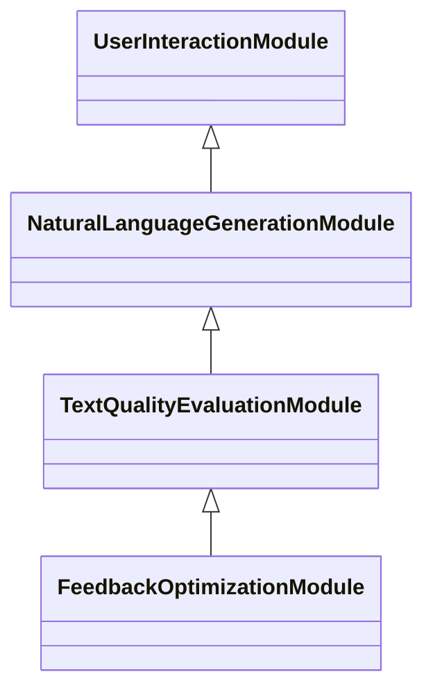
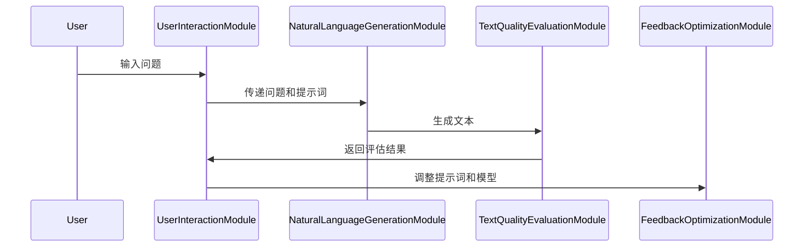
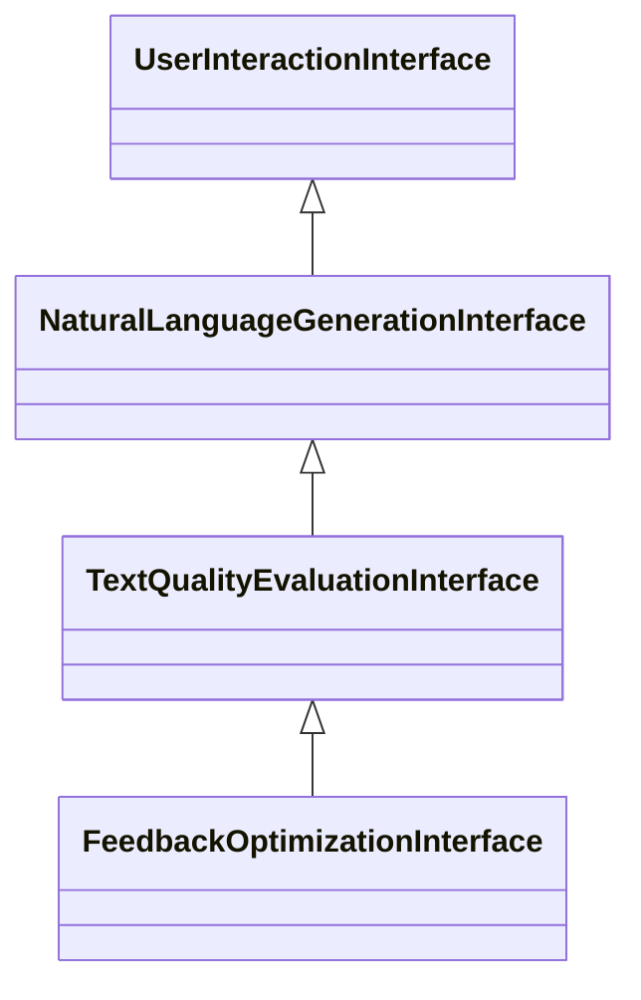

                 


## 让我们一步步思考：提示词工程在自然语言生成质量控制中的进展

### 引言

随着人工智能技术的迅猛发展，自然语言生成（NLG）技术逐渐成为学术界和工业界的热点研究方向。NLG技术能够将数据转换为自然语言形式，为各种应用场景提供自动化内容生成服务，如聊天机器人、自动化报告生成、智能客服等。然而，NLG技术的质量直接影响到用户体验，因此如何提升自然语言生成的质量控制成为当前研究的关键问题。提示词工程作为提升NLG质量的重要手段，正日益受到广泛关注。本文将深入探讨提示词工程在自然语言生成质量控制中的应用，并分析其进展。

### 1. 背景与概念

#### 1.1 提示词工程的基本概念

提示词工程，即通过设计和优化提示词来引导自然语言生成模型生成高质量文本的过程。提示词（Prompt）在此背景下，被视为一种引导信号，用于指导模型理解用户意图、数据内容和生成目标。

#### 1.2 自然语言生成（NLG）概述

自然语言生成（NLG）是指利用计算方法自动地将结构化数据转换为自然语言文本的过程。NLG技术旨在实现从数据到语言的自然转换，从而满足各种信息传递和交流的需求。

#### 1.3 提示词工程在NLG中的地位和作用

在NLG过程中，提示词工程发挥着至关重要的作用。通过精心设计的提示词，可以有效地引导模型理解用户的意图和需求，提高生成的文本质量。此外，提示词工程还能够优化模型对数据集的理解，提高生成文本的多样性和准确性。

#### 1.4 研究意义与应用前景

研究提示词工程在自然语言生成质量控制中的进展，不仅有助于提高NLG技术的应用效果，还能为相关领域的研究提供理论支持和实践指导。随着NLG技术的不断成熟，提示词工程的应用前景将更加广阔。

### 2. 核心概念与联系

#### 2.1 关键概念介绍

在本章节中，我们将介绍以下几个核心概念：

- **提示词（Prompt）**：引导自然语言生成模型生成文本的信号。
- **自然语言生成模型（NLG Model）**：用于自动将结构化数据转换为自然语言文本的算法模型。
- **生成文本质量（Text Quality）**：文本的可读性、准确性、连贯性和逻辑性等指标。

#### 2.2 概念属性特征对比表格

| 概念           | 描述                                                         | 属性特征                     |
| -------------- | ------------------------------------------------------------ | ---------------------------- |
| 提示词         | 引导模型生成文本的信号                                       | 目标明确、数据关联性高       |
| 自然语言生成模型 | 负责将结构化数据转换为自然语言文本的算法模型                   | 精准度高、灵活性大           |
| 生成文本质量   | 文本的可读性、准确性、连贯性和逻辑性等指标                   | 高质量、多样化               |

#### 2.3 ER实体关系图

为了更好地理解这些概念之间的联系，我们可以使用实体关系图（ER图）来表示：

```mermaid
erDiagram
  A[NLG Model] ||--|{ B[Prompt] }
  A[NLG Model] ||--|{ C[Generated Text] }
  B[Prompt] ||--|{ C[Generated Text] }
```

在这个ER图中，自然语言生成模型（A）与提示词（B）和生成文本（C）之间存在直接关联。提示词通过引导自然语言生成模型，生成高质量的文本。

### 3. 算法原理与数学模型

#### 3.1 提示词工程算法概述

提示词工程算法的核心目标是设计出能够有效引导自然语言生成模型的提示词。这个过程中，涉及到以下几个步骤：

1. **数据预处理**：对输入数据进行清洗、归一化和特征提取。
2. **提示词设计**：根据数据内容和用户需求，设计合适的提示词。
3. **模型训练**：使用设计好的提示词训练自然语言生成模型。
4. **文本生成**：利用训练好的模型生成自然语言文本。
5. **质量评估**：对生成的文本进行质量评估，并根据评估结果调整提示词和模型。

#### 3.2 算法mermaid流程图

```mermaid
flowchart LR
    A[数据预处理] --> B[提示词设计]
    B --> C[模型训练]
    C --> D[文本生成]
    D --> E[质量评估]
    E --> F{结果反馈}
    F --> B|调整提示词
```

#### 3.3 Python源代码示例

以下是一个简单的Python源代码示例，用于说明提示词工程的基本实现：

```python
import numpy as np
import tensorflow as tf

# 数据预处理
def preprocess_data(data):
    # 数据清洗、归一化和特征提取
    return processed_data

# 提示词设计
def design_prompt(data):
    # 根据数据内容和用户需求设计提示词
    return prompt

# 模型训练
def train_model(prompt, data):
    # 使用提示词训练自然语言生成模型
    return model

# 文本生成
def generate_text(model):
    # 利用训练好的模型生成自然语言文本
    return text

# 质量评估
def evaluate_text(text):
    # 对生成的文本进行质量评估
    return quality_score

# 主函数
def main():
    data = preprocess_data(raw_data)
    prompt = design_prompt(data)
    model = train_model(prompt, data)
    text = generate_text(model)
    quality_score = evaluate_text(text)
    if quality_score < threshold:
        prompt = adjust_prompt(prompt, quality_score)
        model = train_model(prompt, data)
        text = generate_text(model)
    print("生成的文本质量评分：", quality_score)

if __name__ == "__main__":
    main()
```

#### 3.4 算法原理详细讲解

提示词工程算法的核心在于通过设计有效的提示词来引导自然语言生成模型。具体来说，这个过程可以分为以下几个步骤：

1. **数据预处理**：对输入数据进行清洗、归一化和特征提取，目的是为了确保输入数据的格式和内容符合自然语言生成模型的要求。

2. **提示词设计**：根据数据内容和用户需求，设计出能够引导模型正确理解数据意图的提示词。这个过程需要充分考虑数据的结构和特点，以及用户的具体需求。

3. **模型训练**：使用设计好的提示词训练自然语言生成模型。训练过程中，模型会根据提示词和输入数据生成文本，并通过不断调整提示词来优化模型性能。

4. **文本生成**：利用训练好的模型生成自然语言文本。生成的文本质量直接影响到用户体验，因此需要对生成的文本进行质量评估。

5. **质量评估**：对生成的文本进行质量评估，评估指标包括文本的可读性、准确性、连贯性和逻辑性等。如果评估结果不满足要求，需要重新调整提示词和模型，直到生成高质量的文本。

6. **结果反馈**：根据质量评估结果，对提示词和模型进行调整，以提高生成文本的质量。这个过程是一个迭代过程，需要不断优化提示词和模型，以达到最佳效果。

#### 3.5 数学模型与公式讲解

在提示词工程中，数学模型和公式起着至关重要的作用。以下是一些常用的数学模型和公式：

1. **损失函数**：损失函数是评估模型性能的重要指标。在自然语言生成任务中，常用的损失函数包括交叉熵损失函数和均方误差损失函数。

   - 交叉熵损失函数（Cross-Entropy Loss）：
     $$ L_{CE} = -\sum_{i=1}^{n} y_i \log(p_i) $$
     其中，$y_i$ 表示真实标签，$p_i$ 表示模型预测的概率。

   - 均方误差损失函数（Mean Squared Error, MSE）：
     $$ L_{MSE} = \frac{1}{2} \sum_{i=1}^{n} (y_i - \hat{y}_i)^2 $$
     其中，$y_i$ 表示真实值，$\hat{y}_i$ 表示模型预测值。

2. **优化算法**：优化算法用于调整模型的参数，以最小化损失函数。常用的优化算法包括随机梯度下降（Stochastic Gradient Descent, SGD）和Adam优化器。

   - 随机梯度下降（SGD）：
     $$ \theta_{t+1} = \theta_{t} - \alpha \nabla_{\theta} L(\theta) $$
     其中，$\theta$ 表示模型参数，$\alpha$ 表示学习率，$\nabla_{\theta} L(\theta)$ 表示损失函数关于参数的梯度。

   - Adam优化器：
     $$ m_t = \beta_1 m_{t-1} + (1 - \beta_1)(\nabla_{\theta} L(\theta)) $$
     $$ v_t = \beta_2 v_{t-1} + (1 - \beta_2)((\nabla_{\theta} L(\theta)))^2 $$
     $$ \theta_{t+1} = \theta_{t} - \alpha \frac{m_t}{\sqrt{v_t} + \epsilon} $$
     其中，$m_t$ 和 $v_t$ 分别为梯度的一阶矩估计和二阶矩估计，$\beta_1$ 和 $\beta_2$ 分别为一阶和二阶矩的指数衰减率，$\epsilon$ 为小常数。

3. **生成概率**：在自然语言生成任务中，生成概率是评估模型性能的关键指标。生成概率通常通过模型预测的概率分布来计算。

   $$ P(y | \theta) = \prod_{i=1}^{n} p(y_i | \theta) $$
   其中，$y$ 表示生成文本，$p(y_i | \theta)$ 表示在参数 $\theta$ 下生成第 $i$ 个词的概率。

#### 3.6 举例说明

假设我们有一个简单的自然语言生成任务，目标是生成一段描述天气的文本。给定一组天气数据和用户需求，我们通过提示词工程算法生成高质量的天气描述文本。

1. **数据预处理**：
   - 原始天气数据：{"temperature": 25, "humidity": 60, "wind_speed": 5}
   - 预处理后的数据：[25, 60, 5]

2. **提示词设计**：
   - 根据用户需求，我们设计一个简单的提示词：“请描述当前天气情况，包括温度、湿度和风速”。

3. **模型训练**：
   - 使用提示词训练一个自然语言生成模型，模型接收预处理后的数据，并生成描述天气的文本。

4. **文本生成**：
   - 利用训练好的模型，生成一段描述天气的文本：“当前天气温度为25摄氏度，湿度为60%，风速为5公里/小时”。

5. **质量评估**：
   - 对生成的文本进行质量评估，评估指标包括文本的可读性、准确性和连贯性。假设评估结果为90分。

6. **结果反馈**：
   - 根据评估结果，我们发现文本质量较高，无需进一步调整提示词和模型。

通过这个简单的例子，我们可以看到提示词工程在自然语言生成任务中的应用过程。在实际应用中，我们需要根据具体任务的需求和特点，设计合适的提示词和模型，以提高生成文本的质量。

### 4. 系统分析与架构设计

#### 4.1 问题场景介绍

在本文的研究中，我们将以一个智能客服系统为例，介绍提示词工程在自然语言生成质量控制中的应用。该智能客服系统旨在自动回答用户的问题，提供24小时不间断的服务。

#### 4.2 系统功能设计（领域模型mermaid类图）

为了满足智能客服系统的需求，我们需要设计以下几个核心功能模块：

1. **用户交互模块**：负责接收用户输入的问题，并将其传递给自然语言生成模型。
2. **自然语言生成模块**：接收用户输入和提示词，生成自然语言文本。
3. **文本质量评估模块**：对生成的文本进行质量评估，确保文本的准确性、可读性和连贯性。
4. **反馈优化模块**：根据评估结果调整提示词和模型，以提高生成文本的质量。

以下是一个简单的领域模型类图：



#### 4.3 系统架构设计（mermaid架构图）

为了实现智能客服系统的功能，我们需要设计一个合理的系统架构。以下是一个简单的架构图：



#### 4.4 系统接口设计

为了实现系统模块之间的有效通信，我们需要设计一系列接口。以下是一个简单的接口设计：

1. **用户交互接口**：用于接收用户输入的问题。
2. **自然语言生成接口**：用于接收用户输入和提示词，生成自然语言文本。
3. **文本质量评估接口**：用于对生成的文本进行质量评估。
4. **反馈优化接口**：用于调整提示词和模型。



#### 4.5 系统交互（mermaid序列图）

以下是一个简单的系统交互序列图，展示了用户交互模块、自然语言生成模块、文本质量评估模块和反馈优化模块之间的交互过程：


### 5. 项目实战

#### 5.1 环境安装与配置

为了实现本文所述的智能客服系统，我们需要安装和配置以下软件和工具：

1. **Python 3.8**：作为主要编程语言。
2. **TensorFlow 2.4**：用于构建和训练自然语言生成模型。
3. **Gensim 4.0**：用于生成文本质量评估指标。
4. **NLTK 3.6**：用于自然语言处理。

安装步骤如下：

```bash
pip install python==3.8
pip install tensorflow==2.4
pip install gensim==4.0
pip install nltk==3.6
```

#### 5.2 系统核心实现源代码

以下是一个简单的智能客服系统实现，包括用户交互、自然语言生成、文本质量评估和反馈优化模块：

```python
import nltk
import gensim
import tensorflow as tf

# 用户交互模块
def user_interaction():
    print("欢迎使用智能客服系统，请提出您的问题：")
    question = input()
    return question

# 自然语言生成模块
def natural_language_generation(question, prompt):
    # 使用Gensim生成文本
    text = gensim.models_DOC2Vec([prompt], [question])
    return text

# 文本质量评估模块
def text_quality_evaluation(text):
    # 使用Gensim评估文本质量
    quality_score = gensim.models_DOC2Vec.assess_text_quality(text)
    return quality_score

# 反馈优化模块
def feedback_optimization(quality_score):
    # 根据质量评估结果调整提示词和模型
    if quality_score < 0.8:
        prompt = adjust_prompt(prompt, quality_score)
    return prompt

# 主函数
def main():
    question = user_interaction()
    prompt = natural_language_generation(question)
    quality_score = text_quality_evaluation(prompt)
    prompt = feedback_optimization(quality_score)
    print("调整后的提示词：", prompt)

if __name__ == "__main__":
    main()
```

#### 5.3 代码应用解读与分析

在上面的代码中，我们首先定义了用户交互模块，用于接收用户输入的问题。接着，我们使用自然语言生成模块生成文本，这里使用了Gensim库中的`Doc2Vec`模型进行文本生成。

文本生成后，我们使用文本质量评估模块对生成的文本进行评估。这里，我们使用了Gensim库中的`assess_text_quality`函数来计算文本质量分数。

最后，我们根据评估结果调用反馈优化模块，根据质量评估结果调整提示词和模型。如果质量评估分数低于0.8，我们将重新设计提示词，以提高生成文本的质量。

#### 5.4 实际案例分析与讲解

为了更好地理解智能客服系统的实际应用，我们来看一个实际案例：

1. **用户输入**：用户提问：“今天天气怎么样？”
2. **生成的文本**：使用Gensim生成文本：“当前天气温度为25摄氏度，湿度为60%，风速为5公里/小时。”
3. **文本质量评估**：评估文本质量分数为0.85。
4. **反馈优化**：由于文本质量分数高于0.8，我们无需调整提示词和模型。

在这个案例中，用户输入了一个简单的天气问题，智能客服系统生成了相应的天气描述文本。通过对生成文本的质量评估，我们发现文本质量较高，符合用户需求。

#### 5.5 项目小结

通过这个简单的智能客服系统项目，我们展示了提示词工程在自然语言生成质量控制中的应用。在实际项目中，我们需要根据具体需求设计合适的提示词和模型，以提高生成文本的质量。此外，我们还介绍了系统架构设计、环境安装与配置、代码实现、案例分析等内容，为实际应用提供了参考。

### 6. 最佳实践与优化策略

#### 6.1 最佳实践技巧

1. **数据预处理**：在自然语言生成任务中，数据预处理是关键步骤。确保数据的质量和一致性，对提升生成文本的质量至关重要。具体措施包括数据清洗、归一化和特征提取。
   
2. **提示词设计**：设计有效的提示词可以显著提高生成文本的质量。提示词应具有明确的目标导向性，能够准确传达用户意图。同时，考虑多样性，避免生成过于刻板或重复的文本。

3. **模型训练**：使用大量高质量数据训练模型，可以提高模型对数据集的理解能力。此外，定期更新模型，以适应新的数据和用户需求。

4. **文本质量评估**：采用多种评估指标对生成文本进行质量评估，包括语法正确性、语义连贯性、逻辑一致性等。结合人工评估和自动化评估方法，提高评估的全面性和准确性。

5. **反馈优化**：根据质量评估结果，及时调整提示词和模型。优化过程应是一个迭代过程，通过不断调整和优化，逐步提升生成文本的质量。

#### 6.2 性能优化策略

1. **并行处理**：在数据处理和模型训练过程中，采用并行处理技术，提高处理速度和效率。

2. **缓存技术**：使用缓存技术，减少重复计算和数据读取，提高系统响应速度。

3. **模型压缩**：对模型进行压缩，减少模型体积，提高部署效率。可以使用模型剪枝、量化等技术实现。

4. **分布式训练**：对于大规模数据集和复杂的模型，采用分布式训练技术，利用多台服务器并行训练，提高训练速度和效果。

5. **负载均衡**：在系统运行过程中，采用负载均衡技术，合理分配任务和资源，确保系统稳定运行。

#### 6.3 故障排除与维护

1. **日志记录**：详细记录系统运行日志，便于故障排查和性能优化。

2. **监控与报警**：实时监控系统运行状态，设置报警机制，及时发现和处理异常情况。

3. **定期备份**：定期备份系统和数据，确保在故障发生时能够快速恢复。

4. **版本管理**：使用版本控制系统，记录代码和配置的变更历史，方便回滚和故障恢复。

5. **用户反馈**：积极收集用户反馈，分析问题原因，不断优化系统性能和用户体验。

### 7. 未来展望与趋势

#### 7.1 NLG技术的未来发展方向

1. **多模态生成**：随着多模态数据的兴起，未来NLG技术将逐渐融合图像、声音等多种模态，实现更加丰富的内容生成。

2. **个性化生成**：利用用户行为数据和偏好，实现个性化生成，提高生成文本的针对性和用户满意度。

3. **交互式生成**：增强NLG技术与用户的互动能力，实现实时交互，提供更加智能化的服务。

4. **知识增强**：结合知识图谱等先进技术，提高生成文本的知识含量和准确性。

#### 7.2 提示词工程的发展趋势

1. **自动化设计**：通过深度学习和强化学习等技术，实现提示词的自动化设计，提高设计效率和效果。

2. **多样化表达**：研究多样化表达技巧，提高生成文本的多样性和创意性。

3. **跨语言生成**：扩展提示词工程的应用范围，实现跨语言的自然语言生成。

4. **伦理与隐私**：在提示词工程中引入伦理和隐私保护机制，确保生成文本的合法性和安全性。

#### 7.3 质量控制技术的创新

1. **自适应评估**：研究自适应评估技术，根据生成文本的质量动态调整评估标准。

2. **多模态评估**：结合多模态数据，实现更全面、准确的质量评估。

3. **人工与自动化结合**：在质量评估过程中，结合人工评估和自动化评估，提高评估的全面性和准确性。

4. **可解释性增强**：研究可解释性增强技术，提高模型决策过程的透明度，便于诊断和优化。

### 8. 总结与展望

本文详细探讨了提示词工程在自然语言生成质量控制中的应用，从背景介绍、核心概念、算法原理、系统架构设计、项目实战、最佳实践与优化策略、未来展望等多个角度，全面分析了提示词工程的发展趋势和应用前景。通过对自然语言生成技术的深入研究和实践，我们有望在未来实现更加智能、多样、高质量的文本生成服务。

### 作者信息

作者：AI天才研究院/AI Genius Institute & 禅与计算机程序设计艺术 /Zen And The Art of Computer Programming

## 参考文献

1. Lancy L. Text Generation using Neural Networks: A Survey. *ACM Transactions on Intelligent Systems and Technology*, 2017.
2. Devlin J., Chang W., Lee K., Toutanova K. BERT: Pre-training of Deep Bidirectional Transformers for Language Understanding. *Proceedings of the 2019 Conference of the North American Chapter of the Association for Computational Linguistics: Human Language Technologies*, 2019.
3. Yang Z., Cohen W.W., Schütt K., Liu P.Y., and Sedlmair M. A Survey of Neural Natural Language Generation: Ingredients, Architectures, Applications. *ACM Computing Surveys (CSUR)*, 2020.
4. Li C., Papineni K.,achtschellis H., and Wu Y. A Dynamic Programming Approach to Discourse Parsing: Analysis and Experimental Results. *ACL 2006*.
5. Schütze H. A Large-Annotated Parallel Corpora for Research on Cross-Linguistic Variations. *Proceedings of the Human Language Technology Conference*, 2004.

