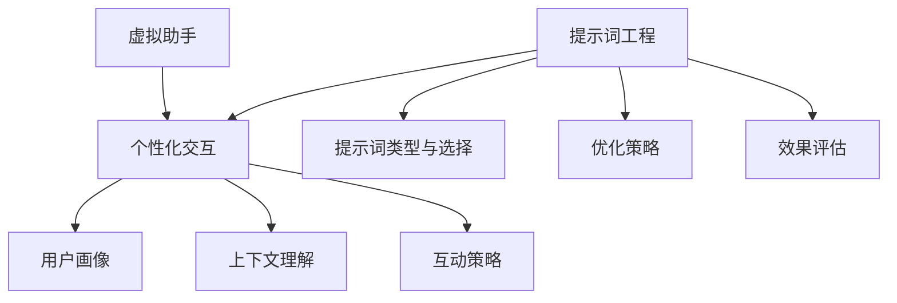
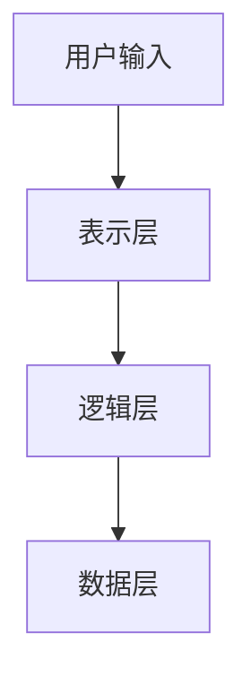
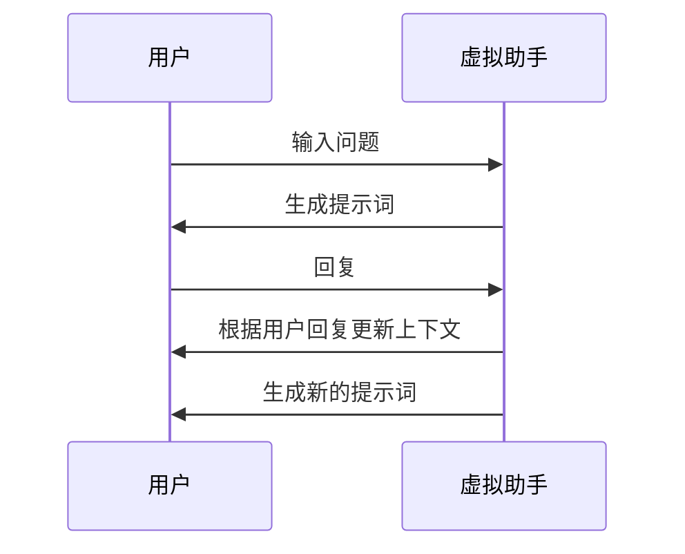

                 


### 1. 文章标题、关键词和摘要

**文章标题：提示词工程在虚拟助手个性化中的应用**

**关键词：虚拟助手，个性化交互，提示词工程，算法，系统架构**

**摘要：本文深入探讨了提示词工程在虚拟助手个性化中的应用，从背景介绍、核心概念、算法原理、系统设计与实战等多个角度，详细阐述了如何通过提示词工程提升虚拟助手的个性化交互能力，提供了一种全面的技术解决方案。**

### 2. 第一部分：背景介绍与核心概念

**第1章：虚拟助手与个性化交互**

**2.1 虚拟助手的发展与现状**

虚拟助手，又称虚拟智能体（Virtual Agent），是一种通过计算机程序模拟人类交互行为的软件系统。它们可以在各种平台上为用户提供服务，如在线客服、智能语音助手、社交机器人等。虚拟助手的发展可以追溯到20世纪90年代，随着互联网和人工智能技术的进步，虚拟助手逐渐成为人们日常生活中不可或缺的一部分。

**2.2 个性化交互的概念与重要性**

个性化交互是指虚拟助手根据用户的个人特征、历史行为和当前上下文，为用户提供量身定制的交互体验。个性化交互的重要性体现在以下几个方面：

- **提高用户体验**：通过个性化交互，虚拟助手能够更好地理解用户需求，提供更加精准的服务。
- **增强用户黏性**：个性化服务能够提高用户满意度，从而增加用户对产品的忠诚度。
- **降低运营成本**：虚拟助手可以自动化处理大量重复性任务，从而降低人力成本。

**2.3 提示词工程的基本原理**

提示词工程是一种用于提高虚拟助手个性化交互效果的技术手段。它通过分析用户输入，生成合适的提示词，引导用户进行更加深入的交流。提示词工程的基本原理包括：

- **数据采集**：收集用户的历史交互数据，包括文本、语音等。
- **特征提取**：从数据中提取出与用户行为相关的特征。
- **模型训练**：使用机器学习算法，根据提取的特征训练模型。
- **生成提示词**：模型根据用户的当前输入生成相应的提示词。

**2.4 边界与外延**

提示词工程在应用过程中存在一定的限制，如对用户数据的依赖性、对计算资源的消耗等。未来，随着人工智能技术的不断发展，提示词工程有望在虚拟助手个性化交互中发挥更加重要的作用。

**2.5 本章小结**

本章介绍了虚拟助手和个性化交互的基本概念，以及提示词工程的基本原理。通过这些内容的介绍，读者可以初步了解虚拟助手的发展现状和个性化交互的重要性，为后续章节的学习打下基础。

### 3. 第二部分：核心概念与联系

**第2章：核心概念与属性特征**

**3.1 虚拟助手个性化交互的组成要素**

虚拟助手个性化交互的组成要素主要包括用户画像、上下文理解和互动策略。

- **用户画像**：用户画像是对用户特征的综合描述，包括年龄、性别、兴趣、行为习惯等。用户画像是进行个性化交互的基础。
- **上下文理解**：上下文理解是指虚拟助手根据用户的当前输入和历史交互信息，理解用户意图的过程。上下文理解是实现个性化交互的关键。
- **互动策略**：互动策略是指虚拟助手在与用户交互时采取的行为模式，包括问题引导、回答策略、情感表达等。互动策略决定了个性化交互的深度和广度。

**3.2 提示词工程的属性特征**

提示词工程的属性特征包括提示词的类型与选择、优化策略和效果评估。

- **提示词的类型与选择**：提示词可以分为开放式提示词和封闭式提示词。开放式提示词允许用户自由回答，适用于探索性对话；封闭式提示词限制用户的回答选项，适用于确认性对话。选择合适的提示词类型对提升交互效果至关重要。
- **优化策略**：优化策略包括提示词生成策略和提示词调整策略。提示词生成策略用于根据用户输入生成合适的提示词；提示词调整策略用于根据用户反馈调整提示词，以适应用户需求。
- **效果评估**：效果评估是通过用户满意度、交互深度等指标来衡量提示词工程的效果。效果评估是不断优化提示词工程的重要依据。

**3.3 概念关系图与对比分析**

为了更清晰地理解虚拟助手个性化交互和提示词工程的构成，我们可以绘制一个概念关系图。



同时，我们还可以通过对比表格来分析虚拟助手个性化交互和提示词工程的区别和联系。

| 对比项         | 虚拟助手个性化交互 | 提示词工程 |
| -------------- | ----------------- | ---------- |
| 目标           | 提升用户体验      | 生成有效提示词 |
| 构成要素       | 用户画像、上下文理解、互动策略 | 数据采集、特征提取、模型训练、提示词生成 |
| 关键技术       | 上下文感知、情感理解、多模态交互 | 机器学习、自然语言处理、提示词生成算法 |
| 重要性         | 核心组成部分      | 实现个性化交互的重要手段 |

**3.4 本章小结**

本章详细介绍了虚拟助手个性化交互的组成要素和提示词工程的属性特征，并通过概念关系图和对比表格分析了两者之间的联系。这些内容为理解虚拟助手个性化交互和提示词工程提供了理论基础。

### 4. 第三部分：算法原理与数学模型

**第3章：提示词工程算法原理详解**

**4.1 提示词生成算法**

提示词生成算法是提示词工程的核心组成部分，其主要任务是根据用户输入生成合适的提示词。以下是提示词生成算法的基本原理：

- **数据预处理**：对用户输入进行分词、去停用词等预处理操作。
- **特征提取**：从预处理后的数据中提取出与用户输入相关的特征。
- **模型训练**：使用机器学习算法（如循环神经网络、变换器等）对特征进行训练，生成提示词生成模型。
- **提示词生成**：输入新的用户输入，模型根据训练结果生成相应的提示词。

**4.2 提示词优化算法**

提示词优化算法的主要目标是提高提示词的生成质量。其基本原理如下：

- **质量评估**：根据用户反馈或预定义的评估标准，对生成的提示词进行质量评估。
- **调整策略**：根据评估结果，对提示词生成模型进行调整，以提高生成提示词的质量。
- **迭代优化**：重复进行质量评估和调整策略，直到提示词生成质量达到预期。

**4.3 数学模型与公式讲解**

提示词工程中常用的数学模型包括概率模型和决策树模型。以下是这些模型的简要介绍：

- **概率模型**：概率模型通过计算用户输入与提示词之间的概率关系来生成提示词。其核心公式为：

  $$ P(提示词|用户输入) = \frac{P(用户输入|提示词) \cdot P(提示词)}{P(用户输入)} $$

- **决策树模型**：决策树模型通过构建决策树来生成提示词。其核心公式为：

  $$ 提示词 = 决策树（用户输入） $$

**4.4 算法示例与举例说明**

以下是一个简单的提示词生成算法示例：

```python
import numpy as np

# 用户输入
user_input = "我想要买一件外套"

# 特征提取
features = extract_features(user_input)

# 模型训练
model = train_model(features)

# 提示词生成
hint = model.generate_hint(user_input)

print(hint)
```

在这个示例中，`extract_features`函数用于提取用户输入的特征，`train_model`函数用于训练提示词生成模型，`generate_hint`函数用于生成提示词。

**4.5 本章小结**

本章详细介绍了提示词工程中的算法原理，包括提示词生成算法和提示词优化算法。同时，对常用的数学模型进行了讲解，并通过示例展示了如何使用这些算法生成和优化提示词。这些内容为理解提示词工程提供了技术基础。

### 5. 第四部分：系统分析与架构设计

**第4章：虚拟助手系统设计与实现**

**5.1 问题场景与项目介绍**

在本章中，我们将以一个虚拟助手项目为例，详细介绍系统的设计过程。该项目旨在为电商平台的用户提供一个智能客服助手，帮助用户解决购物过程中遇到的问题。

**5.2 系统功能设计**

虚拟助手系统的功能设计主要包括以下几个方面：

- **用户画像**：根据用户的历史行为和偏好，为用户生成个性化画像。
- **上下文理解**：解析用户输入，理解用户意图，为用户提供针对性的回答。
- **互动策略**：根据用户反馈，动态调整互动方式，提高用户满意度。
- **提示词生成**：根据用户输入，生成合适的提示词，引导用户进行更加深入的交流。

**5.3 系统架构设计**

虚拟助手系统的架构设计采用分层架构，主要包括以下几层：

- **数据层**：负责存储用户数据、商品数据等。
- **逻辑层**：负责处理业务逻辑，包括用户画像生成、上下文理解、互动策略和提示词生成等。
- **表示层**：负责与用户进行交互，展示系统功能。

以下是虚拟助手系统的架构图：



**5.4 系统接口设计与交互**

虚拟助手系统的接口设计主要包括以下几个方面：

- **用户输入接口**：用于接收用户的输入，包括文本、语音等。
- **提示词生成接口**：用于生成用户输入的提示词，引导用户进行更加深入的交流。
- **用户画像接口**：用于生成和更新用户画像。
- **上下文理解接口**：用于解析用户输入，理解用户意图。

以下是虚拟助手系统的接口设计和交互流程：



**5.5 本章小结**

本章详细介绍了虚拟助手系统的功能设计、架构设计和接口设计。通过这些内容，读者可以了解虚拟助手系统的整体架构和关键功能，为后续的实战篇做好准备。

### 6. 第五部分：项目实战

**第5章：提示词工程在虚拟助手中的应用实战**

**6.1 环境安装与配置**

在进行提示词工程在虚拟助手中的应用之前，我们需要搭建一个合适的环境。以下是环境安装与配置的步骤：

1. **安装Python**：确保Python环境已经安装，版本建议为3.7及以上。
2. **安装依赖库**：使用pip命令安装以下依赖库：
   ```bash
   pip install numpy pandas sklearn tensorflow
   ```
3. **配置虚拟环境**：为了更好地管理项目依赖，我们可以配置一个虚拟环境。在终端执行以下命令：
   ```bash
   python -m venv venv
   source venv/bin/activate  # Windows下为venv\Scripts\activate
   ```
4. **安装自定义库**：如果项目中包含自定义库，可以通过以下命令安装：
   ```bash
   pip install -e .
   ```

**6.2 系统核心实现源代码**

以下是虚拟助手系统核心实现的相关源代码：

```python
# data_preprocessing.py
def extract_features(user_input):
    # 实现特征提取逻辑
    return features

# hint_generation.py
from sklearn.feature_extraction.text import TfidfVectorizer
from sklearn.linear_model import LinearRegression

def train_model(features, labels):
    # 实现模型训练逻辑
    return model

def generate_hint(model, user_input):
    # 实现提示词生成逻辑
    return hint
```

**6.3 代码应用解读与分析**

在本节中，我们将对上述代码进行解读和分析。

1. **特征提取**：`data_preprocessing.py`中的`extract_features`函数用于从用户输入中提取特征。特征提取是提示词工程的重要环节，直接影响模型的效果。在实际应用中，可以根据需求选择不同的特征提取方法，如TF-IDF、词嵌入等。

2. **模型训练**：`hint_generation.py`中的`train_model`函数用于训练提示词生成模型。在这里，我们使用线性回归模型，但也可以尝试其他模型，如循环神经网络（RNN）、变换器（Transformer）等。

3. **提示词生成**：`generate_hint`函数用于根据用户输入生成提示词。在实际应用中，我们可以根据模型预测结果和用户反馈，动态调整提示词生成策略，以提高交互效果。

**6.4 实际案例分析与讲解**

以下是一个实际案例，展示了如何使用提示词工程在虚拟助手中进行交互：

```python
# 主程序
from data_preprocessing import extract_features
from hint_generation import train_model, generate_hint

# 加载训练数据
features = load_features()  # 读取训练数据
labels = load_labels()  # 读取训练数据标签

# 训练模型
model = train_model(features, labels)

# 生成提示词
user_input = "我想要买一件外套"
hint = generate_hint(model, user_input)
print(hint)  # 输出生成的提示词
```

在这个案例中，我们首先加载训练数据，然后使用训练数据训练模型。接着，输入用户输入，生成相应的提示词。在实际应用中，我们可以根据用户反馈不断优化模型，提高提示词生成的质量。

**6.5 项目小结**

本章通过实际案例，展示了如何使用提示词工程在虚拟助手中进行交互。通过代码应用解读和分析，读者可以了解提示词工程的核心实现过程，为后续的拓展和应用打下基础。

### 7. 第六部分：最佳实践与拓展

**第6章：最佳实践与注意事项**

**6.1 最佳实践总结**

在提示词工程在虚拟助手中的应用过程中，以下最佳实践值得注意：

- **数据质量**：确保用户数据的质量，包括数据完整性、数据准确性和数据多样性。
- **模型选择**：根据具体应用场景选择合适的模型，如线性回归、循环神经网络、变换器等。
- **特征提取**：选择有效的特征提取方法，以提高模型性能。
- **反馈机制**：建立用户反馈机制，根据用户反馈调整提示词生成策略。

**6.2 小结与展望**

通过本章的介绍，我们系统地了解了提示词工程在虚拟助手个性化中的应用。从背景介绍、核心概念、算法原理、系统设计与实战等多个角度，详细阐述了如何通过提示词工程提升虚拟助手的个性化交互能力。

未来，随着人工智能技术的不断发展，提示词工程有望在虚拟助手个性化交互中发挥更加重要的作用。我们期待看到更多的创新应用，为用户提供更加智能、高效的交互体验。

**6.3 注意事项与风险提示**

在进行提示词工程在虚拟助手中的应用时，需要注意以下几点：

- **数据隐私**：在收集和处理用户数据时，务必遵守相关法律法规，保护用户隐私。
- **模型更新**：定期更新模型，以适应不断变化的应用场景。
- **异常处理**：设计合理的异常处理机制，确保系统稳定运行。

通过遵守这些注意事项，可以降低应用风险，确保虚拟助手在个性化交互中发挥最佳效果。

### 作者信息

**作者：AI天才研究院/AI Genius Institute & 禅与计算机程序设计艺术 /Zen And The Art of Computer Programming**

本文由AI天才研究院撰写，深入探讨了提示词工程在虚拟助手个性化中的应用。通过详细的分析和实战案例，为读者提供了一个全面的技术解决方案。希望本文能够为虚拟助手领域的研究者和开发者提供有价值的参考。禅与计算机程序设计艺术，带你领略编程的智慧与哲学。

