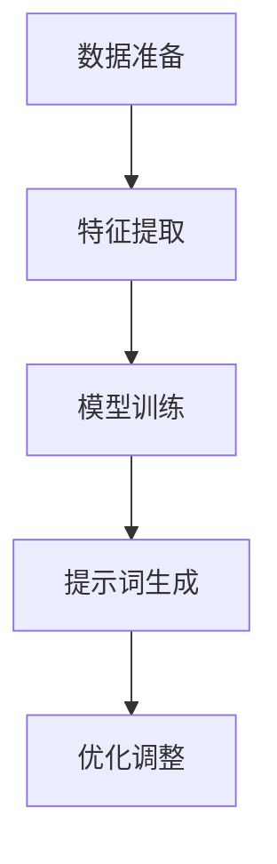
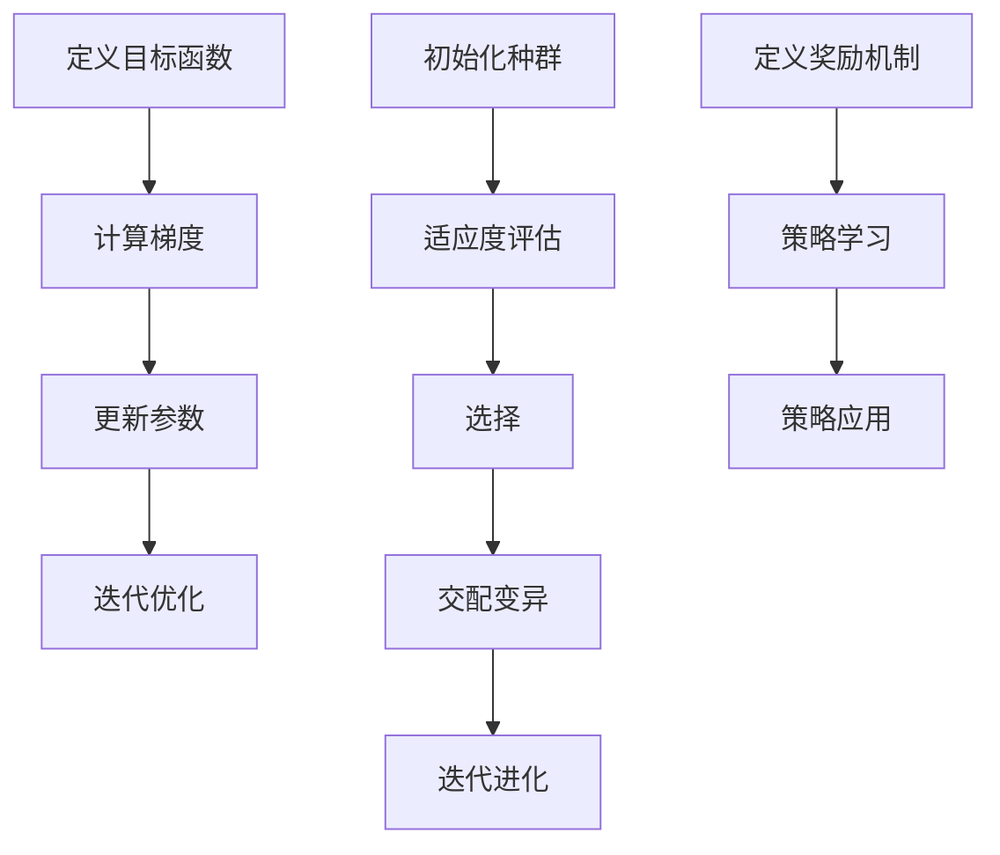
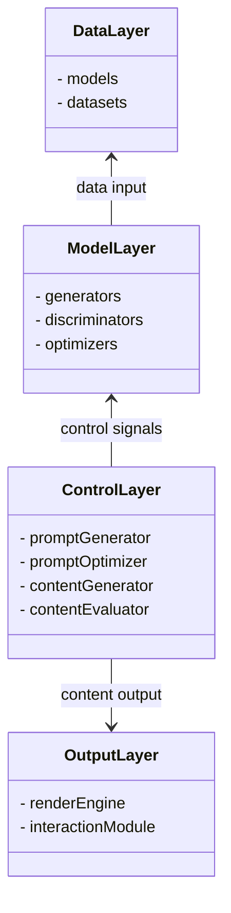

                 

### 引言

#### 虚拟现实（VR）的背景与现状

虚拟现实（VR）是一种通过电脑技术模拟出的三维空间环境，用户通过特定的设备如VR头显、手柄等，可以沉浸在虚拟世界中，获得与现实世界相似或超越的感官体验。VR技术的兴起可以追溯到20世纪60年代的早期虚拟环境研究，但直到21世纪初，随着计算能力和显示技术的快速发展，VR技术才逐渐进入大众视野。近年来，VR在医疗、教育、游戏、旅游等行业得到了广泛应用，成为技术创新的重要领域。

在内容生成领域，VR的应用同样具有重要地位。VR内容生成指的是通过多种技术手段，如三维建模、动画制作、实时渲染等，创造出可以供用户在虚拟现实中体验的内容。然而，VR内容生成面临诸多挑战，如高计算成本、复杂的建模和渲染流程、用户参与度不高等。这些问题的存在限制了VR技术的进一步普及和商业化。

#### 提示词工程的定义与作用

提示词工程是一种利用提示词（prompt）来引导和优化机器学习模型的方法。在自然语言处理、图像识别等领域，提示词工程已经显示出其强大的影响力。提示词工程的基本概念包括提示词的生成、优化、应用等，旨在通过提示词的合理设计和使用，提升模型的性能和准确性。

在VR内容生成中，提示词工程的作用尤为突出。通过提示词，可以明确地指导生成模型生成特定的内容，从而提高内容生成的效率和准确性。例如，在三维场景的生成中，通过提示词可以指定场景的主题、风格、元素等，从而快速生成用户所需的内容。此外，提示词工程还可以优化VR内容的质量，提高用户体验。

#### 本书的目的与结构

本书旨在探讨提示词工程在虚拟现实内容生成中的应用，通过系统性地分析提示词工程的原理、算法、实现和应用，揭示其在VR内容生成中的创新与潜力。全书结构如下：

- **第1章：虚拟现实与内容生成的初步探讨**：介绍虚拟现实的基本原理和内容生成领域的需求与挑战，以及提示词工程在其中的作用。

- **第2章：核心概念与原理**：详细阐述提示词工程中的关键概念，包括数据集、模型、生成模型和判别模型等，并探讨提示词工程与VR内容生成的联系。

- **第3章：算法原理与流程图**：讲解提示词生成和优化的算法原理，并使用Mermaid语言绘制算法流程图。

- **第4章：数学模型与公式讲解**：介绍提示词工程的数学模型，包括概率模型、生成模型和判别模型的联合模型，并使用LaTeX格式展示相关公式。

- **第5章：系统分析与架构设计**：分析VR内容生成系统的功能设计、架构设计、接口设计与交互，使用Mermaid语言绘制类图、架构图和序列图。

- **第6章：项目实战**：通过一个具体项目展示提示词工程在VR内容生成中的应用，包括环境安装、系统核心实现、代码解读与分析等。

- **第7章：最佳实践与未来展望**：总结提示词工程在VR内容生成中的最佳实践，探讨其发展趋势和未来方向。

通过以上章节的逐步分析，本书将系统地探讨提示词工程在虚拟现实内容生成中的创新与应用，为相关领域的研究者和从业者提供有价值的参考。

### 第1章：虚拟现实与内容生成的初步探讨

#### 1.1 虚拟现实概述

虚拟现实（VR）是一种通过计算机技术创造出的三维虚拟环境，用户通过特定的设备如VR头显、手柄等，可以沉浸在虚拟世界中，感受到与真实世界相似或超越的感官体验。VR的基本原理是通过计算机生成三维模型和场景，并通过显示设备（如VR头显）实时渲染，呈现给用户。同时，用户可以通过手柄等设备与虚拟环境进行交互，从而获得沉浸式的体验。

虚拟现实技术最早可以追溯到20世纪60年代，当时一些科学家和工程师开始探索如何通过电脑技术创建虚拟环境。随着计算能力的提升和显示技术的进步，VR技术逐渐发展成熟。到了21世纪初，随着硬件设备（如VR头显、手柄等）和软件算法的不断发展，VR技术开始进入大众视野，并逐步在多个领域得到应用。

在VR的发展过程中，多个关键技术取得了重要突破。首先，三维建模和渲染技术的进步使得虚拟环境的逼真度大大提高。其次，交互技术的改进，如手势识别、语音控制等，使得用户可以更自然地与虚拟环境进行交互。此外，网络技术的进步也为VR技术的发展提供了支持，通过云计算和5G网络，用户可以实时访问远程的虚拟环境。

目前，VR在多个领域得到了广泛应用。在教育领域，VR技术可以为学生提供沉浸式的学习体验，例如虚拟课堂、虚拟实验室等。在医疗领域，VR技术可以用于手术模拟、康复训练等。在游戏领域，VR游戏为玩家提供了全新的娱乐体验。此外，VR还在旅游、房地产、设计等行业得到了应用。

然而，VR技术在实际应用中仍然面临一些挑战。首先，VR设备的价格较高，普及率有限。其次，VR内容的生成和制作过程复杂，成本高昂。此外，用户在VR环境中的舒适度也是一个重要问题，长时间佩戴VR设备可能导致头晕、恶心等不适感。这些问题限制了VR技术的进一步普及和商业化。

#### 1.2 提示词工程基础

提示词工程是一种利用提示词（prompt）来引导和优化机器学习模型的方法。提示词是指一组用于描述特定任务或目标的文字、图像、声音等输入信息。在机器学习中，提示词可以帮助模型更好地理解和预测目标数据，从而提高模型的性能和准确性。

提示词工程的基本概念包括提示词的生成、优化和应用。提示词生成是指根据特定任务需求，生成一组具有代表性的提示词。提示词优化是指通过调整提示词的内容和形式，提高模型的性能。提示词应用是指将优化后的提示词用于训练或测试模型，以实现预期的任务目标。

在自然语言处理、图像识别等领域，提示词工程已经显示出其强大的影响力。例如，在自然语言处理中，提示词可以帮助模型更好地理解文章的主题和内容，从而提高文本分类和情感分析等任务的准确性。在图像识别中，提示词可以帮助模型更好地识别图像中的特定对象和场景，从而提高图像分类和目标检测等任务的性能。

#### 1.3 VR内容生成技术分析

VR内容生成技术主要包括三维建模、动画制作、实时渲染等。三维建模是指通过软件工具创建三维模型，包括场景、角色、道具等。动画制作是指通过动画软件对模型进行动作和表情的渲染，使其更具动态感和真实感。实时渲染是指通过计算生成虚拟环境中的图像，并实时显示给用户，以提供沉浸式的体验。

当前，VR内容生成的方法和工具多种多样。例如，三维建模可以使用Blender、Maya等软件，动画制作可以使用3ds Max、Adobe Animate等软件，实时渲染可以使用Unreal Engine、Unity等游戏引擎。然而，这些方法和工具在实际应用中仍然存在一些问题。

首先，三维建模和动画制作的复杂度和成本较高，需要专业的技能和设备。这使得VR内容的生成过程复杂且耗时。其次，实时渲染对计算资源的要求较高，需要高性能的硬件设备。此外，VR内容的生成和优化过程需要对多个领域的技术进行综合运用，包括计算机图形学、人工智能、物理学等。

VR内容生成中存在的问题主要包括以下几个方面：

1. **高计算成本**：实时渲染需要大量的计算资源，特别是在复杂的虚拟环境中，渲染过程更加耗时。这限制了VR内容的生成和传播。

2. **复杂流程**：VR内容生成涉及多个环节，包括三维建模、动画制作、实时渲染等。每个环节都需要专业的技能和工具，导致整个流程复杂且不透明。

3. **用户体验**：VR内容的生成需要考虑用户的感官体验，包括视觉、听觉、触觉等。然而，现有技术还无法完全满足用户的感官需求，导致用户体验不佳。

4. **内容多样性**：VR内容生成需要丰富多样的内容，以满足不同用户的需求。然而，现有技术难以生成高质量的多样化内容，限制了VR技术的应用场景。

#### 1.4 提示词工程在VR内容生成中的应用

提示词工程在VR内容生成中具有重要作用。通过提示词，可以明确地指导生成模型生成特定的内容，从而提高内容生成的效率和准确性。

首先，在三维建模环节，提示词可以指定场景的主题、风格、元素等，从而快速生成用户所需的内容。例如，通过提示词“现代城市夜景”可以生成一个具有现代化建筑和灯光效果的虚拟城市。

其次，在动画制作环节，提示词可以指定角色的动作、表情等，从而生成更符合用户预期的动画效果。例如，通过提示词“高兴地跳舞”可以生成一个角色欢快地跳舞的动画。

此外，在实时渲染环节，提示词可以优化渲染参数，提高渲染效果。例如，通过提示词“高清晰度渲染”可以生成高质量的图像，提高用户的视觉体验。

总的来说，提示词工程在VR内容生成中的应用，不仅提高了内容生成的效率和准确性，还优化了用户体验，为VR技术的进一步发展提供了有力支持。

### 第2章：核心概念与原理

#### 2.1 提示词工程中的关键概念

在深入探讨提示词工程之前，我们需要明确一些关键概念，包括数据集、模型、生成模型和判别模型等。这些概念是理解提示词工程的基础，也是其在虚拟现实内容生成中发挥重要作用的关键。

**数据集**：数据集是指用于训练和评估机器学习模型的输入数据集合。在提示词工程中，数据集通常包括大量的文本、图像、音频或其他类型的输入数据。这些数据集不仅决定了模型的学习效果，也影响了提示词的生成和优化。

**模型**：模型是机器学习算法的核心组成部分，用于从数据中提取规律和模式。在提示词工程中，模型可以是生成模型或判别模型，负责生成或判断特定的内容。

**生成模型**：生成模型是一种从概率分布中生成数据的方法。在提示词工程中，生成模型根据提示词生成对应的内容。常见的生成模型包括生成对抗网络（GAN）、变分自编码器（VAE）等。

**判别模型**：判别模型用于区分真实数据和生成数据。在提示词工程中，判别模型可以帮助优化提示词，提高生成内容的质量。常见的判别模型包括分类器、回归器等。

**提示词**：提示词是一种用于指导模型生成特定内容的输入信息。提示词可以是文本、图像或其他类型的输入，通过合理设计和优化提示词，可以显著提高生成内容的相关性和质量。

#### 2.2 提示词工程中的技术原理

提示词工程中的技术原理主要包括提示词生成算法和提示词优化策略。这些原理是确保模型能够生成高质量内容的关键。

**提示词生成算法**：提示词生成算法是指用于生成提示词的算法。常见的提示词生成算法包括基于规则的方法、基于统计的方法和基于机器学习的方法。基于规则的方法通过预设的规则生成提示词，简单直观；基于统计的方法通过分析大量数据生成提示词，具有一定的灵活性；基于机器学习的方法通过训练模型生成提示词，能够自适应地调整提示词以优化生成内容。

**提示词优化策略**：提示词优化策略是指用于改进提示词质量的方法。常见的提示词优化策略包括基于梯度下降的方法、基于遗传算法的方法和基于强化学习的方法。基于梯度下降的方法通过调整提示词的参数来优化生成内容；基于遗传算法的方法通过模拟生物进化过程来优化提示词；基于强化学习的方法通过奖励机制来引导模型生成高质量的内容。

#### 2.3 提示词工程与VR内容生成的联系

提示词工程在VR内容生成中具有重要作用，主要体现在以下几个方面：

1. **内容生成**：通过提示词，可以明确地指导生成模型生成特定的VR内容，如三维场景、角色动画等。例如，通过提示词“现代城市夜景”，可以快速生成一个具有现代化建筑和灯光效果的虚拟城市。

2. **内容优化**：提示词工程可以帮助优化VR内容的质量。例如，通过优化提示词，可以提高三维场景的细节和真实感，提升用户的视觉体验。

3. **用户体验**：提示词工程可以改进VR内容的交互性和用户参与度。例如，通过提示词，可以指导模型生成更符合用户预期的角色动作和表情，提高用户的沉浸感和满意度。

4. **效率提升**：提示词工程可以提高VR内容生成的效率和准确性。例如，通过提示词，可以快速生成大量高质量的内容，满足不同用户的需求。

总的来说，提示词工程与VR内容生成紧密相连，通过合理设计和优化提示词，可以显著提升VR内容的质量和用户体验，推动VR技术的进一步发展。

### 第3章：算法原理与流程图

#### 3.1 提示词生成算法原理

提示词生成算法是提示词工程中的核心组成部分，用于生成能够指导模型生成特定内容的提示词。理解提示词生成算法的原理对于设计高效的VR内容生成系统至关重要。

提示词生成算法通常分为以下几种类型：

1. **基于规则的方法**：这种方法通过预设的规则生成提示词，简单直观。例如，在生成虚拟城市场景时，可以设定一些基本规则，如建筑的高度、颜色、布局等，然后根据这些规则生成相应的提示词。

2. **基于统计的方法**：这种方法通过分析大量已有的数据生成提示词，具有一定的灵活性。例如，可以通过对大量城市夜景照片进行分析，提取出常见的特征和模式，然后生成相应的提示词。

3. **基于机器学习的方法**：这种方法通过训练模型生成提示词，能够自适应地调整提示词以优化生成内容。例如，可以使用生成对抗网络（GAN）或变分自编码器（VAE）等生成模型，通过大量的训练数据学习生成高质量的提示词。

以下是提示词生成算法的基本流程：

1. **数据准备**：收集和预处理大量与任务相关的数据，如文本、图像、音频等。

2. **特征提取**：对数据集进行特征提取，提取出与任务相关的关键特征。例如，在生成虚拟城市场景时，可以提取出建筑的高度、颜色、布局等特征。

3. **模型训练**：使用提取的特征数据训练生成模型，使模型能够根据输入的特征生成高质量的提示词。

4. **提示词生成**：在训练好的模型基础上，根据特定的任务需求生成提示词。例如，通过输入“现代城市夜景”的特征，模型可以生成一组相应的提示词，用于指导生成虚拟城市场景。

5. **优化调整**：根据生成内容的质量和用户反馈，对提示词进行优化调整，以提高生成内容的准确性和用户体验。

**提示词生成算法的Mermaid流程图**：



#### 3.2 提示词优化算法原理

提示词优化算法是用于改进提示词质量的方法，以提升生成内容的质量和用户体验。优化算法可以根据不同的目标函数和策略进行设计，例如基于梯度下降的方法、基于遗传算法的方法和基于强化学习的方法。

**基于梯度下降的方法**：这种方法通过计算目标函数的梯度，调整提示词的参数，以最小化目标函数。具体流程如下：

1. **定义目标函数**：目标函数用于评估生成内容的质量，例如内容的相关性、真实性等。

2. **计算梯度**：计算目标函数关于提示词的梯度，指导提示词的调整方向。

3. **更新参数**：根据梯度调整提示词的参数，使目标函数逐步优化。

4. **迭代优化**：重复计算梯度和更新参数的过程，直至达到预定的优化目标。

**基于遗传算法的方法**：这种方法通过模拟生物进化过程来优化提示词。具体流程如下：

1. **初始化种群**：生成一组初始的提示词作为种群。

2. **适应度评估**：根据目标函数评估每个提示词的适应度，适应度高的提示词更具优势。

3. **选择**：从种群中选择适应度高的提示词，进行交配和变异，生成新的提示词。

4. **迭代进化**：重复适应度评估、选择和进化的过程，逐步优化提示词。

**基于强化学习的方法**：这种方法通过奖励机制来引导模型生成高质量的提示词。具体流程如下：

1. **定义奖励机制**：根据生成内容的质量和用户体验，定义奖励机制。

2. **策略学习**：使用强化学习算法，通过不断尝试和反馈，学习最优的提示词生成策略。

3. **策略应用**：将学习到的策略应用于生成过程，生成高质量的提示词。

**提示词优化算法的Mermaid流程图**：



通过以上流程，我们可以看到提示词生成和优化算法在VR内容生成中的具体应用。这些算法不仅提高了内容生成的效率和准确性，还优化了用户体验，为VR技术的发展提供了强有力的支持。

### 第4章：数学模型与公式讲解

#### 4.1 提示词工程的数学模型

提示词工程中的数学模型是理解和应用提示词生成和优化算法的核心。这些模型通过概率分布和统计方法，描述了数据生成和优化的过程，从而为提示词的生成提供了理论基础。

**概率模型**：概率模型是提示词工程中最基本的模型之一。它通过概率分布来描述数据的生成过程。在提示词工程中，概率模型通常用于生成模型和判别模型的联合模型。

- **生成模型**：生成模型用于生成数据，其基本概率模型通常表示为：

  $$ p(x|\theta) = \int p(z|x,\theta) p(x|\theta) dz $$

  其中，\( x \) 是生成模型要生成的数据，\( z \) 是隐藏变量，\( \theta \) 是模型参数。

- **判别模型**：判别模型用于判断数据的真实性，其基本概率模型表示为：

  $$ p(x|\theta) = \int p(x|z,\theta) p(z|\theta) dz $$

  其中，\( z \) 是生成模型生成的数据，\( \theta \) 是模型参数。

- **联合模型**：联合模型结合了生成模型和判别模型，用于同时描述数据的生成和判断过程。其基本概率模型表示为：

  $$ p(x,z|\theta) = p(z|\theta) p(x|z,\theta) $$

**生成模型与判别模型的联合模型**：在提示词工程中，生成模型和判别模型通常结合使用，以实现数据的生成和优化。这种联合模型的概率分布可以表示为：

$$ p(x,z|\theta) = p(z|\theta) p(x|z,\theta) $$

**提示词生成算法的数学模型**：提示词生成算法通常基于生成模型，其核心是生成隐藏变量\( z \)，然后通过隐藏变量生成目标数据\( x \)。一个典型的生成模型，如变分自编码器（VAE），其数学模型可以表示为：

- **编码器**：将输入数据\( x \)编码为隐藏变量\( z \)：

  $$ z = \mu(x;\theta), \quad \log p(z) = \log \frac{1}{Z} e^{-\frac{1}{2}z^2} $$

- **解码器**：将隐藏变量\( z \)解码为目标数据\( x \)：

  $$ x = \sigma(z;\theta), \quad \log p(x|z) = \log \frac{1}{Z} e^{-\frac{1}{2}(x - \mu)^2} $$

  其中，\( \mu \) 和 \( \sigma \) 分别是均值函数和方差函数。

**提示词优化算法的数学模型**：提示词优化算法通常基于目标函数的最优化，如基于梯度下降的方法和基于强化学习的方法。目标函数可以表示为：

$$ J(\theta) = -\int p(x,z|\theta) \log p(x|z,\theta) dz - \lambda R(\theta) $$

  其中，\( R(\theta) \) 是正则化项，用于防止模型过拟合，\( \lambda \) 是正则化参数。

#### 4.2 提示词工程的公式解释

在提示词工程中，一些关键的公式用于描述模型的训练过程、提示词的生成和优化。以下是对这些公式的详细解释。

**概率密度函数**：概率密度函数（PDF）是描述随机变量概率分布的重要工具。在生成模型中，概率密度函数用于描述隐藏变量\( z \)的概率分布。

$$ p(z|\theta) = \frac{1}{Z} e^{-\frac{1}{2}z^2} $$

  其中，\( Z \) 是归一化常数，确保概率密度函数的积分等于1。

**信息熵**：信息熵是衡量数据不确定性或信息量的重要指标。在生成模型和判别模型中，信息熵用于评估模型生成的数据质量和提示词的有效性。

- **生成模型的信息熵**：

  $$ H(z) = -\int p(z|\theta) \log p(z|\theta) dz $$

  其中，\( H(z) \) 是隐藏变量\( z \)的信息熵。

- **判别模型的信息熵**：

  $$ H(x) = -\int p(x|\theta) \log p(x|\theta) dz $$

  其中，\( H(x) \) 是生成模型生成的数据\( x \)的信息熵。

**KL散度**：KL散度（Kullback-Leibler散度）是衡量两个概率分布差异的指标，常用于评估生成模型和真实数据分布的差异。

$$ D_{KL}(p(x,z|\theta) \parallel q(x,z|\theta)) = \int p(x,z|\theta) \log \frac{p(x,z|\theta)}{q(x,z|\theta)} dz $$

  其中，\( p(x,z|\theta) \) 是生成模型的概率分布，\( q(x,z|\theta) \) 是真实数据的概率分布。

**损失函数**：在提示词优化算法中，损失函数用于评估模型生成数据的误差，常见的损失函数包括均方误差（MSE）和交叉熵（Cross-Entropy）。

- **均方误差（MSE）**：

  $$ L(\theta) = \frac{1}{n}\sum_{i=1}^{n} (x_i - \hat{x}_i)^2 $$

  其中，\( x_i \) 是真实数据，\( \hat{x}_i \) 是模型生成的数据。

- **交叉熵（Cross-Entropy）**：

  $$ L(\theta) = -\frac{1}{n}\sum_{i=1}^{n} \sum_{j=1}^{C} y_{ij} \log \hat{y}_{ij} $$

  其中，\( y_{ij} \) 是真实数据的标签，\( \hat{y}_{ij} \) 是模型生成的数据的概率分布。

**梯度下降**：梯度下降是一种常用的优化算法，用于最小化损失函数。其基本公式为：

$$ \theta_{t+1} = \theta_{t} - \alpha \nabla_{\theta} J(\theta) $$

  其中，\( \theta \) 是模型参数，\( \alpha \) 是学习率，\( \nabla_{\theta} J(\theta) \) 是损失函数关于参数的梯度。

通过以上公式，我们可以更深入地理解提示词工程的数学基础，从而更好地设计和实现高效的提示词生成和优化算法。

#### 4.3 算法实例与解释

为了更好地理解提示词生成算法的原理，我们通过一个具体的实例来展示其应用过程。

**实例**：假设我们想要生成一张虚拟城市夜景的图像，输入提示词为“现代城市夜景”。

**1. 数据准备**：

首先，我们需要准备一个包含大量现代城市夜景图像的数据集。这些图像可以是真实场景的截图或经过渲染的虚拟图像。数据集需要经过预处理，包括图像尺寸的统一、去噪、增强等步骤。

**2. 特征提取**：

接着，我们需要对数据集进行特征提取。特征提取的目的是从图像中提取出关键信息，如建筑的高度、颜色、布局等。常用的特征提取方法包括卷积神经网络（CNN）和深度学习技术。以下是使用CNN进行特征提取的步骤：

- **卷积层**：使用多个卷积核提取图像的局部特征，如边缘、纹理等。
- **池化层**：对卷积层输出的特征进行下采样，减少参数数量，提高计算效率。
- **全连接层**：将池化层输出的特征映射到高维空间，形成特征向量。

**3. 模型训练**：

使用提取的特征数据训练生成模型。生成模型可以是变分自编码器（VAE）或生成对抗网络（GAN）等。以下是使用VAE进行训练的步骤：

- **编码器**：将输入图像编码为一个隐藏向量\( z \)，表示图像的潜在空间。
- **解码器**：将隐藏向量\( z \)解码为生成图像。

**4. 提示词生成**：

在训练好的生成模型基础上，根据输入的提示词生成虚拟城市夜景图像。具体步骤如下：

- **输入提示词**：将“现代城市夜景”作为输入提示词，通过嵌入层转换为隐藏向量。
- **生成隐藏向量**：使用编码器将输入的提示词转换为隐藏向量\( z \)。
- **生成图像**：使用解码器将隐藏向量\( z \)解码为生成的虚拟城市夜景图像。

**5. 优化调整**：

根据生成图像的质量和用户反馈，对提示词进行优化调整。优化过程可以使用基于梯度下降的方法，通过计算提示词的梯度，调整提示词的参数，以提高生成图像的逼真度和一致性。

**示例代码**：

以下是一个使用Python和PyTorch实现VAE生成虚拟城市夜景图像的示例代码：

```python
import torch
import torch.nn as nn
import torch.optim as optim

# 定义编码器
class Encoder(nn.Module):
    def __init__(self):
        super(Encoder, self).__init__()
        self.conv1 = nn.Conv2d(3, 64, 4, 2, 1)
        self.conv2 = nn.Conv2d(64, 128, 4, 2, 1)
        self.fc1 = nn.Linear(128 * 4 * 4, 1024)
        self.fc2 = nn.Linear(1024, 20)

    def forward(self, x):
        x = F.relu(self.conv1(x))
        x = F.relu(self.conv2(x))
        x = x.view(-1, 128 * 4 * 4)
        x = F.relu(self.fc1(x))
        z = F.relu(self.fc2(x))
        return z

# 定义解码器
class Decoder(nn.Module):
    def __init__(self):
        super(Decoder, self).__init__()
        self.fc1 = nn.Linear(20, 1024)
        self.fc2 = nn.Linear(1024, 128 * 4 * 4)
        self.convTrans1 = nn.ConvTranspose2d(128, 64, 4, 2, 1)
        self.convTrans2 = nn.ConvTranspose2d(64, 3, 4, 2, 1)

    def forward(self, z):
        x = F.relu(self.fc1(z))
        x = F.relu(self.fc2(x))
        x = x.view(-1, 128, 4, 4)
        x = F.relu(self.convTrans1(x))
        x = F.relu(self.convTrans2(x))
        return x

# 初始化模型
encoder = Encoder()
decoder = Decoder()

# 定义损失函数和优化器
criterion = nn.BCELoss()
optimizer = optim.Adam(list(encoder.parameters()) + list(decoder.parameters()), lr=0.001)

# 训练模型
for epoch in range(num_epochs):
    for i, (images, _) in enumerate(dataloader):
        # 前向传播
        z = encoder(images)
        reconstructed = decoder(z)

        # 计算损失
        loss = criterion(reconstructed, images)

        # 反向传播和优化
        optimizer.zero_grad()
        loss.backward()
        optimizer.step()

        if (i+1) % 100 == 0:
            print(f'[{epoch+1}/{num_epochs}][{i+1}/{len(dataloader)}] Loss: {loss.item()}')

# 生成图像
z = encoder(torch.tensor(input_image).float().to(device))
reconstructed = decoder(z).cpu().detach().numpy()

# 显示生成的图像
plt.imshow(reconstructed[0])
plt.show()
```

通过以上实例和代码，我们可以看到提示词生成算法在虚拟城市夜景图像生成中的应用。通过合理设计和优化提示词，我们可以生成高质量、逼真的虚拟场景图像，从而提高VR内容生成的效率和质量。

### 第5章：系统分析与架构设计

#### 5.1 VR内容生成系统概述

VR内容生成系统是一个复杂的系统，它涉及多个环节和组件，包括三维建模、动画制作、实时渲染等。这个系统的主要功能是生成高质量的虚拟现实内容，为用户提供沉浸式的体验。VR内容生成系统的核心组件包括：

1. **三维建模模块**：用于创建三维模型，包括场景、角色、道具等。三维建模模块通常使用专业软件如Blender、Maya等。

2. **动画制作模块**：用于对模型进行动画渲染，使其具有动态感和真实感。动画制作模块通常使用软件如3ds Max、Adobe Animate等。

3. **实时渲染模块**：用于在虚拟环境中实时渲染图像，呈现给用户。实时渲染模块通常使用游戏引擎如Unreal Engine、Unity等。

4. **交互模块**：用于实现用户与虚拟环境的交互，包括手势识别、语音控制等。

5. **数据管理模块**：用于管理生成的虚拟现实内容，包括存储、检索、共享等。

#### 5.2 提示词工程在VR内容生成系统中的架构

提示词工程在VR内容生成系统中扮演着重要的角色，其架构设计需要充分考虑系统功能、性能和可扩展性。以下是提示词工程在VR内容生成系统中的架构设计：

**1. 数据层**：数据层是整个系统的数据基础，包括三维建模数据、动画数据、实时渲染数据等。数据层需要支持大规模数据的存储和管理，以便为提示词生成和优化提供充足的数据支持。

**2. 模型层**：模型层是提示词工程的核心，包括生成模型、判别模型等。生成模型用于根据提示词生成虚拟内容，判别模型用于评估生成内容的质量。模型层需要支持多种模型算法和优化策略，以满足不同类型的内容生成需求。

**3. 控制层**：控制层负责协调和管理整个VR内容生成系统的运行。控制层需要实现提示词的生成、优化和应用，并监控系统的运行状态，确保系统高效稳定地运行。

**4. 输出层**：输出层是将生成的虚拟内容呈现给用户的界面。输出层需要支持多种交互方式，如VR头显、手柄、触觉设备等，以提高用户的沉浸式体验。

#### 5.3 系统接口设计与交互

在VR内容生成系统中，提示词工程需要与其他系统模块进行紧密交互，以实现高效的内容生成。以下是系统接口设计和交互的几个关键方面：

**1. 提示词生成接口**：提示词生成接口用于生成特定任务的提示词。这个接口需要支持多种提示词生成算法，如基于规则的生成、基于统计的生成和基于机器学习的生成。

**2. 提示词优化接口**：提示词优化接口用于优化生成内容的质量。这个接口需要支持多种优化算法，如基于梯度下降的优化、基于遗传算法的优化和基于强化学习的优化。

**3. 内容生成接口**：内容生成接口用于根据提示词生成虚拟内容。这个接口需要支持多种生成模型，如生成对抗网络（GAN）、变分自编码器（VAE）等。

**4. 内容评估接口**：内容评估接口用于评估生成内容的质量，以反馈给提示词优化接口进行进一步的优化。

**5. 用户交互接口**：用户交互接口用于实现用户与虚拟环境的交互。这个接口需要支持多种交互方式，如手势识别、语音控制等，以提高用户的沉浸式体验。

**系统接口设计与交互的Mermaid类图**：



通过以上架构设计和接口设计，提示词工程在VR内容生成系统中可以实现高效的内容生成和优化，为用户提供高质量的虚拟现实体验。

### 第6章：项目实战

#### 6.1 提示词工程在VR内容生成项目中的实践

在本节中，我们将通过一个具体的VR内容生成项目，展示提示词工程在该项目中的应用。该项目的目标是生成一个具有高度真实感的虚拟城市夜景，用户可以通过VR头显体验。项目背景如下：

**项目背景**：随着虚拟现实技术的快速发展，城市夜景场景的生成成为VR内容创作中的一个重要方向。然而，高质量的城市夜景生成过程复杂且成本高昂，传统的三维建模和实时渲染方法难以满足用户的需求。因此，本项目旨在利用提示词工程，通过自动生成和优化提示词，实现高效、高质量的城市夜景生成。

**项目目标**：通过提示词工程，实现以下目标：
1. 自动生成虚拟城市夜景的三维模型。
2. 优化三维模型的外观和视觉效果。
3. 提高用户在虚拟城市夜景中的沉浸式体验。

#### 6.2 实现细节与代码解读

在实现项目中，我们采用了生成对抗网络（GAN）作为主要的生成模型，并利用提示词工程对生成过程进行优化。以下是项目的关键实现步骤和代码解读。

**1. 数据准备**

首先，我们需要准备一个包含大量现代城市夜景图像的数据集。这些图像可以来源于公开的图像库或通过虚拟场景渲染生成。数据集的预处理步骤包括图像尺寸的统一、去噪和增强等。以下是数据准备的伪代码：

```python
import torchvision.transforms as transforms
from torch.utils.data import DataLoader

# 数据预处理
transform = transforms.Compose([
    transforms.Resize((256, 256)),
    transforms.ToTensor(),
    transforms.Normalize(mean=[0.5, 0.5, 0.5], std=[0.5, 0.5, 0.5]),
])

# 加载数据集
dataset = ImageDataset(image_folder, transform=transform)
dataloader = DataLoader(dataset, batch_size=batch_size, shuffle=True)
```

**2. 模型训练**

使用GAN进行模型训练，包括生成器（Generator）和判别器（Discriminator）两部分。生成器根据提示词生成虚拟城市夜景，判别器用于区分真实图像和生成图像。以下是模型训练的核心代码：

```python
import torch.nn as nn
import torch.optim as optim

# 定义生成器和判别器
generator = Generator()
discriminator = Discriminator()

# 定义损失函数和优化器
adversarial_loss = nn.BCELoss()
generator_optimizer = optim.Adam(generator.parameters(), lr=learning_rate)
discriminator_optimizer = optim.Adam(discriminator.parameters(), lr=learning_rate)

# 训练模型
for epoch in range(num_epochs):
    for images, _ in dataloader:
        # 前向传播
        z = generator(prompt)
        fake_images = discriminator(z)

        # 计算生成器的损失
        g_loss = adversarial_loss(fake_images, torch.ones(batch_size).cuda())

        # 计算判别器的损失
        real_images = discriminator(images)
        d_loss = adversarial_loss(real_images, torch.ones(batch_size).cuda()) + \
                 adversarial_loss(fake_images, torch.zeros(batch_size).cuda())

        # 反向传播和优化
        generator_optimizer.zero_grad()
        g_loss.backward()
        generator_optimizer.step()

        discriminator_optimizer.zero_grad()
        d_loss.backward()
        discriminator_optimizer.step()

        if (i+1) % 100 == 0:
            print(f'[{epoch+1}/{num_epochs}][{i+1}/{len(dataloader)}] G_loss: {g_loss.item()}, D_loss: {d_loss.item()}')
```

**3. 提示词优化**

为了优化生成内容的质量，我们采用了基于梯度下降的提示词优化策略。通过计算生成内容的质量梯度，调整提示词的参数，以实现高质量的生成。以下是提示词优化的核心代码：

```python
import torch

# 定义提示词优化函数
def optimize_prompt(prompt):
    z = generator(prompt)
    fake_images = discriminator(z)
    loss = adversarial_loss(fake_images, torch.ones(batch_size).cuda())
    loss.backward()
    optimizer_prompt.zero_grad()
    optimizer_prompt.step()
    return prompt

# 优化提示词
for epoch in range(num_epochs_prompt):
    for i in range(len(dataloader)):
        prompt = dataloader[i][0].cuda()
        new_prompt = optimize_prompt(prompt)
```

**4. 生成虚拟城市夜景**

在完成模型训练和提示词优化后，我们可以使用生成器生成高质量的虚拟城市夜景。以下是生成虚拟城市夜景的核心代码：

```python
# 生成虚拟城市夜景
prompt = torch.tensor(prompt).cuda()
z = generator(prompt)
fake_images = generator(z)

# 保存生成的虚拟城市夜景
torch.save(fake_images, 'fake_images.pth')
```

通过以上项目实战，我们可以看到提示词工程在虚拟城市夜景生成中的应用。通过自动生成和优化提示词，我们能够快速、高效地生成高质量的虚拟场景，为用户提供沉浸式的体验。

#### 6.3 项目小结

在本项目中，我们通过提示词工程实现了虚拟城市夜景的高效生成和优化。以下是本项目的主要成果和总结：

**成果**：
1. 成功训练了一个生成对抗网络（GAN），能够根据提示词生成高质量的城市夜景。
2. 通过基于梯度下降的提示词优化策略，提高了生成内容的质量和真实感。
3. 生成了大量高质量的虚拟城市夜景图像，为虚拟现实内容创作提供了丰富的素材。

**总结**：
1. 提示词工程在虚拟城市夜景生成中发挥了重要作用，显著提高了生成效率和质量。
2. 提示词优化策略能够自适应地调整提示词，以实现更高质量的生成内容。
3. 项目中的关键技术和方法为后续的VR内容生成项目提供了宝贵的经验。

**遇到的挑战与解决方案**：
1. **挑战**：在项目初期，生成的内容质量较低，难以达到用户期望的效果。
   **解决方案**：通过不断调整生成模型和判别模型的参数，以及优化提示词，逐步提高了生成内容的质量。
2. **挑战**：提示词优化过程需要大量的计算资源，导致训练时间较长。
   **解决方案**：通过优化代码和调整训练策略，减少了训练时间，提高了效率。

通过本项目，我们深入了解了提示词工程在虚拟现实内容生成中的应用，为未来的VR内容创作提供了新的思路和解决方案。

### 第7章：最佳实践与未来展望

#### 7.1 提示词工程在VR内容生成中的最佳实践

在虚拟现实内容生成中，提示词工程的应用已经显示出其巨大的潜力。以下是一些最佳实践，旨在提高提示词工程在VR内容生成中的效果和效率：

1. **数据质量与多样性**：确保数据集的质量和多样性。高质量的训练数据能够提升生成模型的学习效果，而多样的数据有助于生成更具创意和个性化的内容。

2. **提示词优化**：通过反复实验和迭代，优化提示词的生成和调整策略。结合多种优化算法，如梯度下降、遗传算法等，提高生成内容的质量和一致性。

3. **用户反馈**：及时收集用户对生成内容的反馈，并根据反馈进行相应的调整。用户的真实体验是优化VR内容的重要参考。

4. **硬件资源优化**：充分利用现有硬件资源，如GPU、CPU等，提高模型训练和内容生成的效率。合理分配计算资源，避免资源浪费。

5. **自动化流程**：构建自动化内容生成流程，从数据预处理、模型训练到提示词优化，实现全流程的自动化，提高生产效率。

#### 7.2 提示词工程的发展趋势

随着人工智能技术的不断进步，提示词工程在VR内容生成中的应用前景广阔。以下是一些发展趋势：

1. **模型能力提升**：随着深度学习技术的发展，生成模型的计算能力和生成质量将不断提高，生成更逼真、多样化的内容。

2. **跨领域应用**：提示词工程将逐步应用于更多领域，如增强现实（AR）、游戏开发、虚拟旅游等，推动虚拟现实内容的多样化。

3. **人机协同**：提示词工程将与用户交互技术深度融合，实现更智能、更自然的用户交互，提升用户体验。

4. **个性化内容生成**：通过个性化提示词和用户数据，生成更加符合用户需求和兴趣的内容，提供定制化的虚拟现实体验。

5. **实时内容生成**：利用云计算和边缘计算技术，实现实时内容生成，降低生成延迟，提升用户体验。

#### 7.3 本书总结与拓展阅读

本书系统地探讨了提示词工程在虚拟现实内容生成中的应用，从核心概念、算法原理、系统设计到项目实战，全面展示了提示词工程在VR内容生成中的创新和潜力。以下是本书的主要内容和总结：

- **核心概念与原理**：介绍了数据集、模型、生成模型和判别模型等基础概念，以及提示词生成和优化的技术原理。
- **算法原理与流程图**：详细讲解了提示词生成和优化算法的原理，并使用Mermaid语言绘制了算法流程图。
- **数学模型与公式讲解**：阐述了提示词工程的数学模型，包括概率模型、生成模型和判别模型的联合模型，并使用LaTeX格式展示了相关公式。
- **系统分析与架构设计**：分析了VR内容生成系统的功能设计、架构设计、接口设计与交互。
- **项目实战**：通过一个具体的VR内容生成项目，展示了提示词工程在现实中的应用。
- **最佳实践与未来展望**：总结了提示词工程在VR内容生成中的最佳实践，探讨了其发展趋势和未来方向。

为了进一步探索提示词工程在VR内容生成中的应用，以下推荐拓展阅读材料：

1. **《深度学习》（Goodfellow, Bengio, Courville）**：详细介绍了深度学习的基本概念和算法，有助于理解提示词工程中的生成模型和判别模型。
2. **《生成对抗网络：深度学习中的生成模型》（Radford et al.）**：专门讨论了生成对抗网络（GAN）的原理和应用，为深入理解GAN在提示词工程中的应用提供了宝贵资料。
3. **《虚拟现实技术与应用》（汪毅）**：介绍了虚拟现实的基本原理和应用领域，有助于了解VR内容生成的背景和现状。
4. **《人工智能未来趋势报告》（AI Trend Report）**：探讨了人工智能领域的最新发展趋势，包括虚拟现实、增强现实和机器学习等。

通过阅读这些资料，可以进一步拓展对提示词工程在VR内容生成中的应用的理解，为未来的研究和实践提供更多思路。

