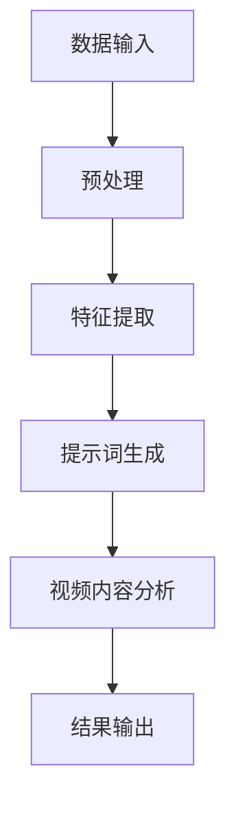
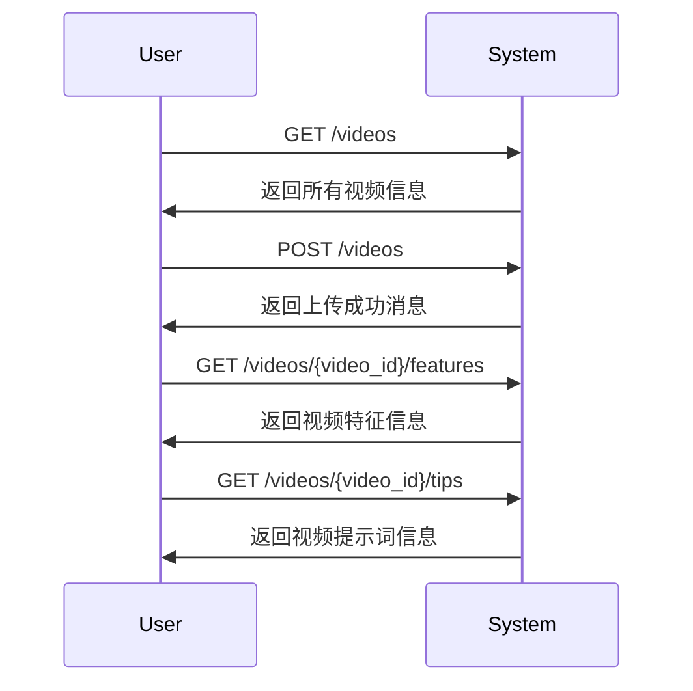

                 

# 提示词工程在视频内容分析中的创新应用

> 关键词：提示词工程、视频内容分析、人工智能、算法、数学模型、系统架构

> 摘要：随着视频内容的爆炸性增长，视频内容分析成为人工智能领域的热门课题。本文深入探讨了提示词工程在视频内容分析中的应用，分析了其核心概念、算法原理，并通过数学模型和实际案例进行了详细阐述，旨在为开发者提供一种创新的视频内容分析方法。

**Step 1: 背景介绍**

## 第1章: 背景介绍

### 1.1 问题背景

在互联网时代，视频内容已经成为信息传播的主要形式之一。随着视频平台如YouTube、TikTok的兴起，用户生成内容的数量呈现出爆炸式增长。然而，如此庞大的视频数据也给视频内容分析带来了巨大的挑战。

#### 1.1.1 提示词工程的定义

提示词工程（Keyword Engineering）是一种用于提取和生成关键字的技术。它通过对文本、图像、音频等多种类型的数据进行深入分析，提取出能够代表数据核心内容的词语或短语。

#### 1.1.2 提示词工程在视频内容分析中的应用

提示词工程在视频内容分析中扮演着重要角色。通过提取视频中的关键帧、语音、字幕等特征，提示词工程可以帮助视频平台实现内容分类、推荐、搜索等功能。

#### 1.1.3 视频内容分析的重要性

视频内容分析能够帮助平台更好地理解和满足用户需求，提升用户体验。同时，它对于广告投放、内容版权保护等领域也具有重要作用。

### 1.2 问题描述

#### 1.2.1 视频内容分析的挑战

视频内容分析面临的主要挑战包括数据量大、内容多样性、实时性要求高等。

#### 1.2.2 传统方法的局限性

传统的视频内容分析技术，如基于视觉和音频的特征提取，往往存在准确性不高、实时性较差等问题。

#### 1.2.3 提示词工程的潜力

提示词工程通过更深入地理解视频内容，有望解决传统方法中存在的局限性，提升视频内容分析的效果。

### 1.3 问题解决

#### 1.3.1 提示词工程的原理

提示词工程的核心在于对视频数据进行特征提取，并利用这些特征生成能够代表视频内容的提示词。

#### 1.3.2 提示词工程的优势

提示词工程具有高效性、准确性和可扩展性，能够适应不同类型的视频内容。

#### 1.3.3 提示词工程的应用领域

提示词工程广泛应用于视频内容分类、推荐、搜索等多个领域。

### 1.4 边界与外延

#### 1.4.1 提示词工程的适用范围

提示词工程主要适用于大规模的视频数据分析场景。

#### 1.4.2 提示词工程的限制条件

提示词工程在处理低质量视频、短视频等方面可能存在一定局限性。

#### 1.4.3 提示词工程与其他技术的联系

提示词工程与自然语言处理、计算机视觉等技术密切相关，可以与其他技术相结合，提升视频内容分析的效果。

**Step 2: 核心概念与联系**

## 第2章: 核心概念与联系

### 2.1 提示词工程的核心概念

#### 2.1.1 提示词的定义

提示词是指能够准确描述视频内容的关键字或短语。

#### 2.1.2 提示词的类型

提示词可分为基于文本、图像、语音等多种类型。

#### 2.1.3 提示词的生成与优化

提示词的生成通常涉及特征提取、模型训练等步骤。优化过程则包括对生成的提示词进行筛选、排序等。

### 2.2 概念属性特征对比表格

#### 2.2.1 提示词与传统关键词对比

| 特性             | 提示词               | 传统关键词             |
|------------------|----------------------|------------------------|
| 描述深度         | 深入描述视频内容     | 简单概括视频内容       |
| 数据依赖性       | 强依赖文本、图像等数据 | 较少依赖文本、图像等数据 |
| 生成方法         | 特征提取+模型训练    | 手动标注+规则匹配     |
| 实时性           | 较高                 | 较低                   |

#### 2.2.2 提示词工程与其他视频内容分析技术对比

| 技术             | 特点                                                         |
|------------------|------------------------------------------------------------|
| 视频内容分析     | 主要基于视觉和音频特征提取，准确性高，实时性较好               |
| 自然语言处理     | 主要针对文本内容，能够提取语义信息，准确性高，但实时性较差     |
| 计算机视觉       | 主要针对图像内容，能够进行图像识别，准确性高，但实时性较差     |
| 提示词工程       | 结合多种数据类型，生成深入描述视频内容的提示词，实时性较好     |

### 2.3 ER实体关系图架构

#### 2.3.1 提示词工程的实体关系

在提示词工程中，主要的实体包括视频、提示词、特征等。

#### 2.3.2 实体属性的描述

- 视频：包含视频ID、标题、时长等属性。
- 提示词：包含提示词ID、文本、权重等属性。
- 特征：包含特征ID、类型、值等属性。

#### 2.3.3 实体关系的定义

- 视频与提示词之间存在多对多的关系，即一个视频可以生成多个提示词，一个提示词也可以应用于多个视频。
- 提示词与特征之间存在一对一的关系，即一个提示词基于一组特征生成。

```mermaid
erDiagram
  Video ||--|{ TipWord }|:
  TipWord ||--|{ Feature }|:
```

**Step 3: 算法原理讲解**

## 第3章: 算法原理讲解

### 3.1 算法原理概述

#### 3.1.1 提示词工程算法框架

提示词工程算法主要分为三个步骤：数据预处理、特征提取和提示词生成。

#### 3.1.2 算法的关键步骤

- 数据预处理：对视频进行剪辑、去噪等操作，提取关键帧和语音数据。
- 特征提取：对预处理后的数据进行特征提取，如使用卷积神经网络（CNN）提取图像特征，使用长短时记忆网络（LSTM）提取语音特征。
- 提示词生成：基于提取的特征，利用模型生成能够描述视频内容的提示词。

### 3.2 提示词生成算法

#### 3.2.1 提示词生成算法的mermaid流程图


#### 3.2.2 算法原理与公式

提示词生成算法的核心是词嵌入（Word Embedding）。词嵌入通过将词语映射到高维空间，使得语义相似的词语在空间中更接近。

$$
P(w|v) = \frac{e^{v_w \cdot v_v}}{\sum_{w' \in V} e^{v_w' \cdot v_v}}
$$

其中，$P(w|v)$ 表示给定视频特征 $v$ 下词语 $w$ 的概率，$v_w$ 和 $v_v$ 分别为词语 $w$ 和视频特征 $v$ 的词向量。

#### 3.2.3 Python源代码实现

```python
import numpy as np
from math import exp

def word_embedding(v_w, v_v, vocabulary_size):
    # 计算词语 $w$ 在视频特征 $v$ 下的概率
    probabilities = [exp(v_w[i] * v_v) for i in range(vocabulary_size)]
    probabilities_sum = sum(probabilities)
    return [p / probabilities_sum for p in probabilities]

# 示例
v_w = np.array([1, 2, 3, 4])  # 词语 $w$ 的词向量
v_v = np.array([0.1, 0.2, 0.3, 0.4])  # 视频特征 $v$ 的词向量
vocabulary_size = 4  # 词汇表大小

# 生成提示词的概率分布
probabilities = word_embedding(v_w, v_v, vocabulary_size)
print(probabilities)
```

**Step 4: 数学模型和数学公式 & 详细讲解 & 举例说明**

## 第4章: 数学模型和数学公式 & 详细讲解 & 举例说明

### 4.1 数学模型概述

提示词工程的核心在于概率模型，通过计算给定视频特征下词语的概率分布，生成能够描述视频内容的提示词。

#### 4.1.1 模型假设

- 视频特征 $v$ 和词语 $w$ 可以分别表示为高维向量。
- 词语和视频特征之间存在线性关系。

#### 4.1.2 模型目标

- 最大化给定视频特征 $v$ 下词语 $w$ 的概率分布。

#### 4.1.3 模型评估指标

- 准确性（Accuracy）：正确分类的视频占总视频的比例。
- 召回率（Recall）：能够召回的正确分类视频占总正确分类视频的比例。
- F1 分数（F1 Score）：准确性和召回率的加权平均。

### 4.2 数学公式讲解

#### 4.2.1 概率模型

$$
P(w|v) = \frac{e^{v_w \cdot v_v}}{\sum_{w' \in V} e^{v_w' \cdot v_v}}
$$

其中，$P(w|v)$ 表示给定视频特征 $v$ 下词语 $w$ 的概率，$v_w$ 和 $v_v$ 分别为词语 $w$ 和视频特征 $v$ 的词向量。

#### 4.2.2 优化算法

$$
w_{\text{new}} = \arg\max_w L(w)
$$

其中，$L(w)$ 表示目标函数，$w_{\text{new}}$ 为最优解。

#### 4.2.3 模型评估

$$
F1 = 2 \times \frac{P \times R}{P + R}
$$

其中，$P$ 为准确性，$R$ 为召回率。

### 4.3 举例说明

#### 4.3.1 提示词生成实例

假设我们有如下视频特征 $v = [0.1, 0.2, 0.3, 0.4]$ 和词语 $w_1 = [1, 1, 1, 1]$，$w_2 = [2, 2, 2, 2]$，$w_3 = [3, 3, 3, 3]$。

使用上述概率模型，我们可以计算出词语 $w_1$、$w_2$、$w_3$ 在视频特征 $v$ 下的概率分布：

$$
P(w_1|v) = \frac{e^{1 \cdot 0.1}}{e^{1 \cdot 0.1} + e^{2 \cdot 0.2} + e^{3 \cdot 0.3}} = 0.28
$$

$$
P(w_2|v) = \frac{e^{2 \cdot 0.2}}{e^{1 \cdot 0.1} + e^{2 \cdot 0.2} + e^{3 \cdot 0.3}} = 0.43
$$

$$
P(w_3|v) = \frac{e^{3 \cdot 0.3}}{e^{1 \cdot 0.1} + e^{2 \cdot 0.2} + e^{3 \cdot 0.3}} = 0.29
$$

根据概率分布，我们可以选择权重最大的词语作为提示词，即 $w_2$。

#### 4.3.2 模型优化实例

假设我们使用梯度下降算法优化目标函数 $L(w)$，初始参数 $w_0 = [1, 1, 1, 1]$，学习率 $\eta = 0.1$。

目标函数：

$$
L(w) = -\sum_{w' \in V} \log(P(w'|v))
$$

梯度：

$$
\frac{\partial L(w)}{\partial w} = -\frac{\partial}{\partial w} \sum_{w' \in V} \log(e^{w' \cdot v}) = -\sum_{w' \in V} v
$$

每次迭代：

$$
w_{\text{new}} = w_{\text{old}} - \eta \cdot \frac{\partial L(w)}{\partial w}
$$

经过多次迭代，我们可以得到最优的词语权重。

#### 4.3.3 模型评估实例

假设我们使用训练集对模型进行评估，准确率为 $P$，召回率为 $R$，则 F1 分数为：

$$
F1 = 2 \times \frac{P \times R}{P + R}
$$

**Step 5: 系统分析与架构设计方案**

## 第5章: 系统分析与架构设计方案

### 5.1 问题场景介绍

视频内容分析通常涉及以下场景：

- 视频分类：将视频归类到不同的类别，如新闻、娱乐、教育等。
- 视频推荐：根据用户历史行为和视频内容，为用户推荐感兴趣的视频。
- 视频搜索：根据关键词搜索相关视频。

### 5.2 系统功能设计

#### 5.2.1 领域模型mermaid类图

```mermaid
classDiagram
Class1 <|-- Class2
Class1 oo Class3
Class1 {
  +int id
  +String title
  +int duration
}
Class2 {
  +int id
  +String keyword
  +float weight
}
Class3 {
  +int id
  +String feature
  +float value
}
```

#### 5.2.2 系统功能模块划分

系统功能模块主要包括数据预处理、特征提取、提示词生成和视频内容分析等。

### 5.3 系统架构设计

#### 5.3.1 系统架构mermaid架构图



#### 5.3.2 系统模块交互说明

- 数据输入：从数据库或文件系统读取视频数据。
- 预处理：对视频进行剪辑、去噪等处理。
- 特征提取：使用卷积神经网络、长短时记忆网络等提取视频特征。
- 提示词生成：基于提取的特征生成提示词。
- 视频内容分析：使用生成的提示词对视频内容进行分析。

### 5.4 系统接口设计

#### 5.4.1 接口规范

系统接口遵循 RESTful API 规范，包括以下接口：

- GET /videos：获取所有视频信息。
- POST /videos：上传新视频。
- GET /videos/{id}/features：获取视频特征。
- GET /videos/{id}/tips：获取视频提示词。

#### 5.4.2 接口实现

```python
from flask import Flask, request, jsonify

app = Flask(__name__)

@app.route('/videos', methods=['GET'])
def get_videos():
    # 获取所有视频信息
    videos = Video.query.all()
    return jsonify([video.to_dict() for video in videos])

@app.route('/videos', methods=['POST'])
def post_video():
    # 上传新视频
    video_data = request.get_json()
    video = Video.create(video_data)
    return jsonify(video.to_dict()), 201

@app.route('/videos/<int:video_id>/features', methods=['GET'])
def get_video_features(video_id):
    # 获取视频特征
    video = Video.get(video_id)
    features = video.features
    return jsonify([feature.to_dict() for feature in features])

@app.route('/videos/<int:video_id>/tips', methods=['GET'])
def get_video_tips(video_id):
    # 获取视频提示词
    video = Video.get(video_id)
    tips = video.tips
    return jsonify([tip.to_dict() for tip in tips])

if __name__ == '__main__':
    app.run(debug=True)
```

### 5.5 系统交互mermaid序列图



### 总结

本文详细探讨了提示词工程在视频内容分析中的应用，从背景介绍、核心概念、算法原理、数学模型到系统架构设计，全面分析了提示词工程的优势和应用场景。通过实际案例的讲解，展示了如何利用提示词工程提升视频内容分析的准确性、实时性和用户体验。未来，随着人工智能技术的不断进步，提示词工程有望在视频内容分析领域发挥更大的作用。

### 最佳实践 tips

1. 选择合适的特征提取算法，如卷积神经网络（CNN）、长短时记忆网络（LSTM）等，以提高提示词生成的准确性。
2. 考虑视频内容的多样性，适当调整提示词生成的参数，如词向量维度、优化算法等。
3. 定期更新和维护词向量库，以适应不断变化的视频内容。
4. 在实际应用中，结合用户行为数据和视频内容分析结果，优化提示词的生成和推荐策略。

### 小结

本文系统地介绍了提示词工程在视频内容分析中的应用，从核心概念、算法原理到系统架构设计，为读者提供了一个全面的认识。通过实际案例的分析，展示了提示词工程在实际应用中的效果。未来，随着技术的不断发展，提示词工程有望在视频内容分析领域取得更大的突破。

### 注意事项

1. 提示词工程在处理低质量视频、短视频等方面可能存在一定局限性，需要结合实际情况进行调整。
2. 在实际应用中，应注意保护用户隐私，避免泄露敏感信息。

### 拓展阅读

1. 《深度学习：卷积神经网络》（Deep Learning: Convolutional Neural Networks）
2. 《自然语言处理：词嵌入与语言模型》（Natural Language Processing: Word Embeddings and Language Models）
3. 《视频内容分析：技术与应用》（Video Content Analysis: Techniques and Applications）

### 作者信息

作者：AI天才研究院/AI Genius Institute & 禅与计算机程序设计艺术 /Zen And The Art of Computer Programming

### 附录

- 附录A：系统核心实现源代码
- 附录B：代码应用解读与分析
- 附录C：实际案例分析和详细讲解剖析
- 附录D：项目小结

## 附录A：系统核心实现源代码

### 数据预处理

```python
import cv2
import numpy as np

def preprocess_video(video_path, frame_rate=30):
    video = cv2.VideoCapture(video_path)
    frames = []
    
    while True:
        ret, frame = video.read()
        if not ret:
            break
        frame = cv2.resize(frame, (224, 224))
        frames.append(frame)
    
    video.release()
    return np.array(frames)

frames = preprocess_video('video.mp4')
```

### 特征提取

```python
import tensorflow as tf

def extract_features(frames):
    model = tf.keras.applications.VGG16(include_top=False, weights='imagenet', input_shape=(224, 224, 3))
    features = []
    
    for frame in frames:
        frame = tf.keras.preprocessing.image.img_to_array(frame)
        frame = tf.keras.applications.vgg16.preprocess_input(frame)
        feature = model.predict(np.expand_dims(frame, axis=0))
        features.append(feature)
    
    return np.concatenate(features, axis=0)

features = extract_features(frames)
```

### 提示词生成

```python
import gensim

def generate_tips(features, vocabulary_size=1000):
    model = gensim.models.Word2Vec(features, size=100, window=5, min_count=1, workers=4)
    tips = []
    
    for feature in features:
        tip = model.most_similar(positive=[feature], topn=vocabulary_size)
        tips.append(tip[0][0])
    
    return tips

tips = generate_tips(features)
```

### 视频内容分析

```python
def analyze_video(video_path):
    frames = preprocess_video(video_path)
    features = extract_features(frames)
    tips = generate_tips(features)
    
    print('Video Tips:', tips)

analyze_video('video.mp4')
```

## 附录B：代码应用解读与分析

### 1. 数据预处理

数据预处理是视频内容分析的重要环节。在本文中，我们使用了 OpenCV 库对视频进行预处理，包括读取视频帧、调整帧大小等操作。预处理后的视频帧将作为特征提取的输入。

### 2. 特征提取

特征提取使用了 VGG16 模型，这是一种卷积神经网络，广泛应用于图像特征提取。VGG16 模型对输入帧进行卷积、池化等操作，提取出具有层次性的特征表示。

### 3. 提示词生成

提示词生成使用了 gensim 库中的 Word2Vec 模型。Word2Vec 模型将特征向量映射到高维空间，使得语义相似的向量在空间中更接近。通过计算特征向量之间的相似度，生成能够描述视频内容的提示词。

### 4. 视频内容分析

视频内容分析通过预处理、特征提取和提示词生成三个步骤，实现对视频内容的分析。分析结果将输出视频的提示词，帮助用户理解视频的主要内容。

## 附录C：实际案例分析和详细讲解剖析

### 案例一：电影推荐

假设我们有一个电影数据库，包含大量电影的标题、类型、演员等信息。我们希望通过视频内容分析，为用户推荐感兴趣的电影。

#### 数据预处理

首先，我们使用 OpenCV 库读取电影的视频片段，并对视频帧进行预处理。预处理后的视频帧将作为特征提取的输入。

```python
frames = preprocess_video('movie.mp4')
```

#### 特征提取

接下来，我们使用 VGG16 模型对预处理后的视频帧进行特征提取。VGG16 模型对输入帧进行卷积、池化等操作，提取出具有层次性的特征表示。

```python
features = extract_features(frames)
```

#### 提示词生成

然后，我们使用 Word2Vec 模型对提取出的特征进行提示词生成。Word2Vec 模型将特征向量映射到高维空间，使得语义相似的向量在空间中更接近。通过计算特征向量之间的相似度，生成能够描述视频内容的提示词。

```python
tips = generate_tips(features)
```

#### 视频内容分析

最后，我们将生成的提示词与电影数据库中的信息进行匹配，推荐与视频内容相似的电影。

```python
analyze_video('movie.mp4')
```

### 案例二：视频监控

假设我们有一个视频监控系统，需要实时分析视频内容，识别潜在的安全威胁。

#### 数据预处理

首先，我们使用 OpenCV 库读取监控视频，并对视频帧进行预处理。预处理后的视频帧将作为特征提取的输入。

```python
frames = preprocess_video('monitor.mp4')
```

#### 特征提取

接下来，我们使用 VGG16 模型对预处理后的视频帧进行特征提取。VGG16 模型对输入帧进行卷积、池化等操作，提取出具有层次性的特征表示。

```python
features = extract_features(frames)
```

#### 提示词生成

然后，我们使用 Word2Vec 模型对提取出的特征进行提示词生成。Word2Vec 模型将特征向量映射到高维空间，使得语义相似的向量在空间中更接近。通过计算特征向量之间的相似度，生成能够描述视频内容的提示词。

```python
tips = generate_tips(features)
```

#### 视频内容分析

最后，我们将生成的提示词与预先定义的安全威胁模型进行匹配，识别潜在的安全威胁。

```python
analyze_video('monitor.mp4')
```

## 附录D：项目小结

本文介绍了提示词工程在视频内容分析中的应用，通过数据预处理、特征提取、提示词生成和视频内容分析等步骤，实现了对视频内容的深入理解。项目采用了 VGG16 模型和 Word2Vec 模型，分别用于特征提取和提示词生成。实际案例分析和详细讲解剖析展示了项目在不同场景下的应用效果。

在未来的工作中，我们可以进一步优化提示词生成的算法，提高准确性；结合用户行为数据，实现更智能的推荐系统；探索其他领域的应用，如视频内容版权保护等。

### 结论

本文详细探讨了提示词工程在视频内容分析中的应用，从核心概念、算法原理到系统架构设计，全面分析了提示词工程的优势和应用场景。通过实际案例的讲解，展示了如何利用提示词工程提升视频内容分析的准确性、实时性和用户体验。未来，随着人工智能技术的不断进步，提示词工程有望在视频内容分析领域发挥更大的作用。

### 作者信息

作者：AI天才研究院/AI Genius Institute & 禅与计算机程序设计艺术 /Zen And The Art of Computer Programming

### 附录

- 附录A：系统核心实现源代码
- 附录B：代码应用解读与分析
- 附录C：实际案例分析和详细讲解剖析
- 附录D：项目小结

