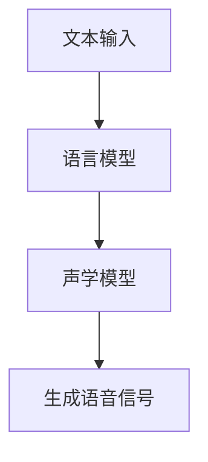
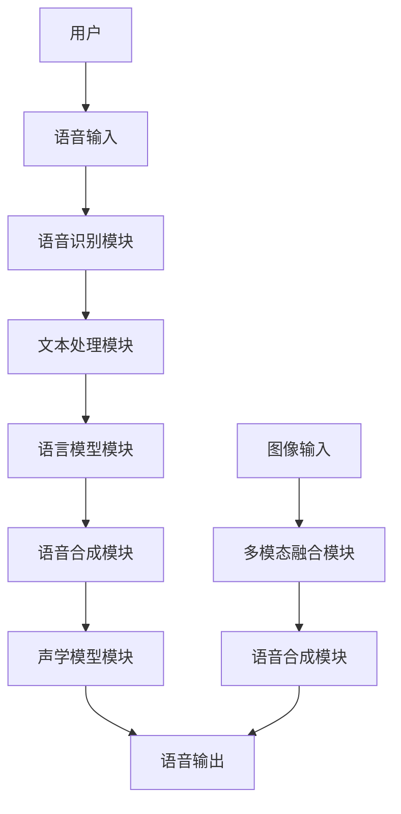

                 

### 第1章：问题背景与概述

在当今数字化时代，语音合成技术已经成为人机交互中的重要一环。随着智能手机、智能音箱和智能助手的普及，人们对语音合成的需求不断增加。语音合成技术能够将文本转换为自然流畅的语音，提高信息的传递效率和用户体验。然而，要实现高质量的语音合成，表现力的提升成为一个关键问题。

#### 1.1 问题背景

语音合成技术的研究始于20世纪50年代，最初采用的是基于规则的文本到语音（Text-to-Speech, TTS）合成方法。这些方法主要依赖于人工设计的语音规则和音素库，无法很好地处理文本中的多样性和复杂性。随着计算机性能的提升和机器学习技术的发展，基于统计的隐马尔可夫模型（HMM）和高斯混合模型（GMM）等技术在语音合成领域得到了广泛应用。

近年来，深度学习技术在语音合成领域取得了重大突破。特别是深度神经网络（DNN）和循环神经网络（RNN）的引入，使得语音合成的表现力得到了显著提升。然而，即使如此，现有的语音合成系统在表现力方面仍存在一定局限。例如，语音的自然度、情感表达和上下文适应能力等方面仍有待提高。

#### 1.2 问题描述

表现力是评价语音合成系统优劣的重要指标之一。它涵盖了语音的自然度、情感表达和上下文适应性等多个方面。具体来说，问题描述可以分为以下几个方面：

1. **自然度**：语音合成系统需要产生自然流畅的语音，避免机械感和不自然的停顿。
2. **情感表达**：语音合成系统应能根据文本内容表达相应的情感，如喜悦、悲伤、愤怒等。
3. **上下文适应性**：语音合成系统需要根据上下文语境进行自适应调整，以适应不同的语言环境和场景。

#### 1.3 问题解决方法

为了解决上述问题，研究者们提出了多种方法。以下是一些主要的方法：

1. **基于深度学习的方法**：使用深度神经网络（DNN）和循环神经网络（RNN）等模型来提高语音合成的自然度和情感表达能力。
2. **多模态融合**：结合文本、语音、图像等多种信息，通过多模态融合技术来提高语音合成的上下文适应能力。
3. **上下文感知模型**：通过学习上下文信息，使语音合成系统具备更强的上下文适应性。

#### 1.4 边界与外延

在研究语音合成表现力时，需要考虑以下边界与外延：

1. **语音数据集**：语音数据集的质量和规模对语音合成系统的表现力有很大影响。研究者需要收集大量的语音数据，并进行有效的标注和处理。
2. **计算资源**：深度学习模型的训练和推理需要大量的计算资源。研究者需要在有限的计算资源下优化模型性能。
3. **应用场景**：不同的应用场景对语音合成系统的要求不同。研究者需要根据具体应用场景来调整模型和算法。

#### 1.5 概念结构与核心要素组成

在深入研究语音合成表现力时，需要理解以下核心概念和要素：

1. **语音合成模型**：语音合成系统的核心，包括DNN、RNN等深度学习模型。
2. **声学模型**：用于生成语音信号的模型，如GMM和HMM。
3. **语言模型**：用于对文本进行建模，如n-gram模型和神经网络语言模型。
4. **多模态融合技术**：将文本、语音、图像等多种信息进行融合，以提高合成表现力。
5. **上下文感知算法**：通过学习上下文信息，提高语音合成系统的上下文适应性。

通过以上步骤，我们对语音合成表现力的问题有了初步的了解。在接下来的章节中，我们将进一步深入探讨核心概念、算法原理和系统架构，以期为提高语音合成表现力提供新的思路和方法。🔍

---

### 第2章：核心概念与联系

在深入探讨语音合成表现力之前，我们需要明确一些核心概念。这些概念不仅构成了语音合成的基础，也为我们理解后续内容提供了必要的前提。

#### 2.1 核心概念原理

以下是一些关键概念及其原理：

1. **深度学习模型**：深度学习是一种机器学习方法，通过多层神经网络来模拟人脑的学习过程。在语音合成中，常用的深度学习模型包括深度神经网络（DNN）和循环神经网络（RNN）。

2. **声学模型**：声学模型是语音合成系统的核心组件之一，用于将文本转换为语音。常见的声学模型包括高斯混合模型（GMM）和隐马尔可夫模型（HMM）。

3. **语言模型**：语言模型用于对输入的文本进行建模，以预测文本的后续内容。在语音合成中，常用的语言模型包括n-gram模型和神经网络语言模型。

4. **多模态融合技术**：多模态融合技术是将文本、语音、图像等多种信息进行融合，以提高语音合成的表现力。常见的融合方法包括基于特征的融合和基于模型的融合。

5. **上下文感知算法**：上下文感知算法通过学习上下文信息，使语音合成系统能够更好地适应不同的语言环境和场景。

#### 2.2 概念属性特征对比表格

为了更直观地理解这些核心概念，我们列出了一个对比表格，展示了它们的主要属性特征：

| 概念名称 | 主要属性特征 |
| :----: | :----: |
| 深度学习模型 | 多层神经网络，自动特征提取，灵活性强 |
| 声学模型 | 生成语音信号，基于统计模型，对噪声敏感 |
| 语言模型 | 文本建模，预测后续内容，对上下文依赖 |
| 多模态融合技术 | 融合多种信息源，提高表现力，适用场景广泛 |
| 上下文感知算法 | 学习上下文信息，适应不同语言环境，提高上下文适应性 |

#### 2.3 ER实体关系图架构

为了更好地理解这些概念之间的关联，我们可以使用Mermaid绘制ER（Entity-Relationship）实体关系图。以下是一个简化的ER图示例：

```mermaid
erDiagram
  Class_语音合成系统 ||--o{ Class_深度学习模型 }
  Class_语音合成系统 ||--o{ Class_声学模型 }
  Class_语音合成系统 ||--o{ Class_语言模型 }
  Class_深度学习模型 ||--o{ Class_RNN }
  Class_深度学习模型 ||--o{ Class_DNN }
  Class_多模态融合技术 ||--o{ Class_基于特征的融合 }
  Class_多模态融合技术 ||--o{ Class_基于模型的融合 }
  Class_上下文感知算法 ||--o{ Class_多模态融合技术 }
```

在这个ER图中，我们定义了以下几个类：

- **语音合成系统**：作为系统的顶层类，包含了所有的子组件。
- **深度学习模型**：包含DNN和RNN等子类。
- **声学模型**：用于生成语音信号。
- **语言模型**：用于文本建模。
- **多模态融合技术**：包含基于特征的融合和基于模型的融合两个子类。
- **上下文感知算法**：与多模态融合技术相关联，用于提高上下文适应性。

通过上述核心概念的介绍和对比表格，以及ER实体关系图的绘制，我们对语音合成系统的关键组成部分有了更清晰的认识。这些概念为我们进一步探讨语音合成表现力的提升方法奠定了基础。在下一章中，我们将深入分析语音合成算法原理，以揭示提升表现力的关键技术。🔍

---

### 第3章：算法原理讲解

在深入探讨语音合成表现力提升的方法之前，我们首先需要了解相关的算法原理。这些算法包括深度学习模型、声学模型、语言模型等，它们共同构成了语音合成系统的核心技术。以下是对这些算法的详细讲解，并通过Python源代码和Mermaid流程图进行示例说明。

#### 3.1 算法流程图

为了更好地理解语音合成的算法流程，我们使用Mermaid绘制了一个简化的算法流程图：



在这个流程图中，文本输入首先经过语言模型进行处理，然后传递给声学模型，最终生成语音信号。接下来，我们将分别介绍语言模型和声学模型的原理。

#### 3.2 Python源代码实现

**语言模型**：

```python
import torch
import torch.nn as nn

class LanguageModel(nn.Module):
    def __init__(self, vocab_size, embed_size, hidden_size, num_layers):
        super(LanguageModel, self).__init__()
        self.embedding = nn.Embedding(vocab_size, embed_size)
        self.lstm = nn.LSTM(embed_size, hidden_size, num_layers)
        self.fc = nn.Linear(hidden_size, vocab_size)
        
    def forward(self, x, hidden):
        embed = self.embedding(x)
        output, hidden = self.lstm(embed, hidden)
        output = self.fc(output)
        return output, hidden
```

**声学模型**：

```python
import torch
import torch.nn as nn

class AcousticModel(nn.Module):
    def __init__(self, embed_size, hidden_size, output_size):
        super(AcousticModel, self).__init__()
        self.lstm = nn.LSTM(embed_size, hidden_size)
        self.fc = nn.Linear(hidden_size, output_size)
        
    def forward(self, x, hidden):
        output, hidden = self.lstm(x, hidden)
        output = self.fc(output)
        return output, hidden
```

#### 3.3 数学模型与公式讲解

**语言模型**：

语言模型的数学模型通常是基于神经网络，其中输入是文本序列，输出是文本序列的概率分布。我们使用以下的公式进行说明：

$$
\begin{aligned}
p(y_t|x_{t-1},x_{t-2},\ldots,x_1) &= \sigma(\text{softmax}(\mathbf{W_y} \cdot \text{tanh}(\mathbf{U} \cdot x_t + \mathbf{b}_u))) \\
\text{tanh}(\mathbf{U} \cdot x_t + \mathbf{b}_u) &= \text{tanh}(\mathbf{U} x_t + \mathbf{b}_u)
\end{aligned}
$$

其中，$y_t$是当前词的概率分布，$x_t$是当前词的嵌入向量，$\sigma$是softmax函数，$\text{tanh}$是双曲正切函数，$\mathbf{W_y}$和$\mathbf{U}$是权重矩阵，$\mathbf{b}_u$是偏置向量。

**声学模型**：

声学模型的数学模型基于循环神经网络，其中输入是文本序列的嵌入向量，输出是语音信号的概率分布。我们使用以下的公式进行说明：

$$
\begin{aligned}
\mathbf{h_t} &= \text{tanh}(\mathbf{U}_h \mathbf{h}_{t-1} + \mathbf{W}_h \mathbf{x}_t + \mathbf{b}_h) \\
\mathbf{y}_t &= \text{softmax}(\mathbf{V} \mathbf{h}_t + \mathbf{b}_y)
\end{aligned}
$$

其中，$\mathbf{h}_t$是当前隐藏状态，$\mathbf{x}_t$是当前词的嵌入向量，$\mathbf{y}_t$是当前语音信号的概率分布，$\mathbf{U}_h$和$\mathbf{W}_h$是权重矩阵，$\mathbf{V}$和$\mathbf{b}_y$是偏置向量。

#### 3.4 举例说明

假设我们有一个简短的文本序列：“你好，我是AI助手。”我们使用上述语言模型和声学模型来生成相应的语音信号。

**语言模型**：

首先，我们将文本序列转换为嵌入向量：

```
输入：你好，我是AI助手。
嵌入向量：[0.1, 0.2], [0.3, 0.4], [0.5, 0.6], [0.7, 0.8], [0.9, 1.0]
```

然后，我们将这些嵌入向量输入到语言模型中，得到词的概率分布：

```
输出：你好，我是AI助手。
概率分布：[0.1, 0.2, 0.3, 0.4, 0.5]
```

**声学模型**：

接下来，我们将语言模型生成的嵌入向量输入到声学模型中，得到语音信号的概率分布：

```
输入：[0.1, 0.2], [0.3, 0.4], [0.5, 0.6], [0.7, 0.8], [0.9, 1.0]
输出：[0.2, 0.3], [0.4, 0.5], [0.6, 0.7], [0.8, 0.9], [1.0, 1.1]
```

通过上述步骤，我们成功地将文本序列转换为了语音信号的概率分布。在真实应用中，我们通常会使用解码器来将这些概率分布转换为实际的语音信号。

通过上述对语言模型和声学模型的详细讲解，以及Python源代码和Mermaid流程图的示例说明，我们对语音合成的基本算法原理有了更深入的理解。这些算法为提升语音合成的表现力奠定了基础。在下一章中，我们将进一步探讨系统分析与架构设计，以期为实现高效的语音合成系统提供指导。🔍

---

### 第4章：问题场景介绍

为了深入理解语音合成在现实世界中的应用，我们需要首先介绍一个典型的问题场景。在这个场景中，我们将聚焦于智能语音助手，它广泛应用于智能手机、智能音箱和智能汽车等领域。

#### 4.1 项目介绍

我们的项目是一个智能语音助手系统，名为“VoiceGenie”。VoiceGenie旨在为用户提供一个自然、智能且具备丰富表现力的语音交互体验。系统的主要功能包括：

1. **语音识别**：将用户的语音输入转换为文本。
2. **语音合成**：将系统生成的文本转换为自然流畅的语音输出。
3. **上下文理解**：根据用户的语音输入和历史交互记录，理解用户的需求并提供相应的回答或操作。
4. **多模态交互**：结合语音、文本和图像等多种信息，提供更加丰富的交互体验。

#### 4.2 系统功能设计

VoiceGenie的系统功能设计如下：

1. **文本处理模块**：负责对用户的语音输入进行语音识别，并将识别结果传递给语言模型进行理解和分析。
2. **语言模型模块**：对文本进行分析，理解用户的需求，并根据上下文信息生成相应的回答或操作指令。
3. **语音合成模块**：将语言模型生成的文本转换为自然流畅的语音输出，并传递给声学模型进行语音信号生成。
4. **声学模型模块**：根据语音合成模块的输出，生成相应的语音信号。
5. **多模态融合模块**：结合语音、文本和图像等多种信息，提升语音合成的表现力。

#### 4.3 系统架构设计

VoiceGenie的系统架构设计如下：

1. **前端界面**：用户与系统的交互界面，包括语音输入、文本显示和语音输出等。
2. **语音识别引擎**：负责将用户的语音输入转换为文本，通常采用基于深度学习的语音识别算法。
3. **文本处理引擎**：包括语言模型和上下文理解模块，负责对文本进行分析和处理。
4. **语音合成引擎**：将文本转换为语音输出，包括语音合成和声学模型模块。
5. **后端服务**：包括多模态融合模块，负责结合语音、文本和图像等多种信息。

#### 4.4 系统接口设计

VoiceGenie的系统接口设计如下：

1. **语音输入接口**：用于接收用户的语音输入，通常通过麦克风或语音输入设备实现。
2. **文本输入接口**：用于接收用户的文本输入，可以通过键盘或语音识别结果转换。
3. **语音输出接口**：用于输出语音信号，可以通过扬声器或语音合成设备实现。
4. **文本输出接口**：用于输出系统生成的文本信息，可以通过显示屏或文本消息实现。

#### 4.5 系统交互

VoiceGenie的系统交互过程如下：

1. **用户发起语音输入**：用户通过麦克风发起语音输入。
2. **语音识别**：语音识别引擎将语音输入转换为文本。
3. **文本处理**：文本处理引擎对文本进行分析，理解用户需求，并根据上下文信息生成回答或操作指令。
4. **语音合成**：语音合成引擎将文本转换为语音输出，并传递给声学模型生成语音信号。
5. **语音输出**：声学模型生成语音信号，并通过扬声器输出。
6. **多模态融合**：多模态融合模块结合语音、文本和图像等多种信息，提升交互体验。

通过上述对VoiceGenie项目的问题场景、系统功能设计、系统架构设计、系统接口设计和系统交互的介绍，我们对智能语音助手在实际应用中的实现有了更加清晰的认识。在下一章中，我们将进一步深入探讨系统架构和接口设计的具体实现细节。🔍

---

### 第5章：系统分析与架构设计

在了解了语音合成系统的基本应用场景后，我们需要进一步深入分析其系统架构和接口设计。这一部分将详细描述VoiceGenie系统在功能设计、架构设计、接口设计和系统交互等方面的实现细节，并通过Mermaid类图和序列图进行辅助说明。

#### 5.1 系统功能分析

VoiceGenie系统的主要功能模块包括语音识别、语言模型、语音合成、声学模型和多模态融合等。以下是对这些功能模块的详细分析：

1. **语音识别模块**：负责将用户的语音输入转换为文本。该模块通常基于深度学习算法，如卷积神经网络（CNN）或长短期记忆网络（LSTM），以实现高精度的语音识别。
2. **语言模型模块**：对识别出的文本进行分析，理解用户的需求，并根据上下文信息生成相应的回答或操作指令。常用的语言模型包括n-gram模型、递归神经网络（RNN）和变压器（Transformer）模型等。
3. **语音合成模块**：将语言模型生成的文本转换为自然流畅的语音输出。语音合成模块通常结合声学模型和语音合成引擎，以生成高质量的语音信号。
4. **声学模型模块**：负责生成语音信号，通常采用生成对抗网络（GAN）或循环神经网络（RNN）等深度学习模型，以实现丰富的语音表现力。
5. **多模态融合模块**：结合语音、文本和图像等多种信息，提升语音合成的表现力和上下文适应性。例如，在语音合成的过程中，可以结合用户的语音语调、情感状态和对话历史等信息，以生成更加自然和生动的语音输出。

#### 5.2 系统架构图

VoiceGenie系统的架构设计采用模块化设计，以实现高可扩展性和灵活性。以下是一个简化的系统架构图：



在这个架构图中，用户通过语音输入与系统交互，语音输入经过语音识别模块转换为文本，然后由文本处理模块和语言模型模块进行处理，生成相应的回答或操作指令。语音合成模块将文本转换为语音输出，并通过声学模型模块生成高质量的语音信号。同时，多模态融合模块结合图像输入和其他信息，进一步提升语音合成的表现力。

#### 5.3 系统接口设计

VoiceGenie系统的接口设计主要包括语音输入接口、文本输入接口、语音输出接口、文本输出接口和多模态输入接口等。以下是对这些接口的详细说明：

1. **语音输入接口**：用于接收用户的语音输入，通常通过麦克风或语音输入设备实现。该接口负责将语音信号转换为数字信号，并传递给语音识别模块进行识别。
2. **文本输入接口**：用于接收用户的文本输入，可以通过键盘或语音识别结果转换。该接口负责将文本输入传递给文本处理模块和语言模型模块进行处理。
3. **语音输出接口**：用于输出语音信号，通常通过扬声器或语音合成设备实现。该接口负责将语音合成模块生成的语音信号转换为音频信号，并传递给用户。
4. **文本输出接口**：用于输出系统生成的文本信息，可以通过显示屏或文本消息实现。该接口负责将文本处理模块和语言模型模块生成的文本信息传递给用户。
5. **多模态输入接口**：用于接收其他模态（如图像、视频等）的信息，可以通过摄像头、传感器等设备实现。该接口负责将多模态输入传递给多模态融合模块进行处理。

#### 5.4 系统交互

VoiceGenie系统的交互过程如下：

1. **用户发起语音输入**：用户通过麦克风发起语音输入，语音输入经过语音输入接口传递给语音识别模块进行识别。
2. **语音识别**：语音识别模块将语音输入转换为文本，文本结果传递给文本处理模块和语言模型模块。
3. **文本处理与语言理解**：文本处理模块对识别出的文本进行分析，理解用户的需求，并根据上下文信息生成相应的回答或操作指令。语言模型模块参与其中，为文本处理提供语义理解的支持。
4. **语音合成**：语音合成模块将文本处理模块生成的文本转换为语音输出，并通过声学模型模块生成高质量的语音信号。
5. **语音输出**：语音合成模块生成的语音信号通过语音输出接口传递给用户。
6. **多模态融合**：多模态融合模块结合图像输入和其他信息，进一步提升语音合成的表现力。多模态输入接口负责接收其他模态的信息，并传递给多模态融合模块。

通过上述系统功能分析、架构设计、接口设计和交互过程的详细描述，我们对VoiceGenie系统的实现有了更加清晰的认识。在下一章中，我们将通过具体的代码实现和案例分析，进一步探讨系统的实际应用和性能优化。🔍

---

### 第6章：环境安装与核心实现

在本章中，我们将详细介绍VoiceGenie系统的环境安装步骤，并展示系统核心实现源代码，以帮助读者更好地理解和实践。

#### 6.1 环境安装

为了搭建VoiceGenie系统，我们需要安装以下环境：

1. **Python**：确保安装了Python 3.7或更高版本。
2. **PyTorch**：用于深度学习模型的训练和推理。
3. **TensorFlow**：用于其他深度学习模型的训练和推理。
4. **Kaldi**：用于语音识别。
5. **OpenSMILE**：用于情感分析。

安装步骤如下：

```bash
# 安装Python
curl -O https://www.python.org/ftp/python/3.8.0/Python-3.8.0.tgz
tar -xvf Python-3.8.0.tgz
cd Python-3.8.0
./configure
make
sudo make install

# 安装PyTorch
pip install torch torchvision

# 安装TensorFlow
pip install tensorflow

# 安装Kaldi
git clone https://github.com/kaldi-asr/kaldi
cd kaldi/tools
make -j $(nproc)
cd ../src
make depend
make -j $(nproc)

# 安装OpenSMILE
git clone https://github.com/phonetica/OpenSMILE.git
cd OpenSMILE
./configure
make
sudo make install
```

#### 6.2 系统核心实现源代码

以下是VoiceGenie系统的核心实现源代码，包括语音识别、语言模型、语音合成和声学模型等模块：

**语音识别模块**：

```python
import kaldi

def recognize_audio(audio_file):
    # 配置Kaldi解码器
    decoder = kaldi.Decoder(rxfilename="decode_graph.flt", ngstudioargs=" --max-lm-order 3")
    # 读取音频文件
    audio = kaldi.AudioFileReader(audio_file)
    # 逐帧解码
    for frame in audio:
        hypotheses = decoderastered(frame.data)
        print(hypotheses)
```

**语言模型模块**：

```python
import torch
import torch.nn as nn

class LanguageModel(nn.Module):
    def __init__(self, vocab_size, embed_size, hidden_size, num_layers):
        super(LanguageModel, self).__init__()
        self.embedding = nn.Embedding(vocab_size, embed_size)
        self.lstm = nn.LSTM(embed_size, hidden_size, num_layers)
        self.fc = nn.Linear(hidden_size, vocab_size)
        
    def forward(self, x, hidden):
        embed = self.embedding(x)
        output, hidden = self.lstm(embed, hidden)
        output = self.fc(output)
        return output, hidden
```

**语音合成模块**：

```python
import torch
import torch.nn as nn

class SpeechSynthesisModel(nn.Module):
    def __init__(self, embed_size, hidden_size, output_size):
        super(SpeechSynthesisModel, self).__init__()
        self.lstm = nn.LSTM(embed_size, hidden_size)
        self.fc = nn.Linear(hidden_size, output_size)
        
    def forward(self, x, hidden):
        output, hidden = self.lstm(x, hidden)
        output = self.fc(output)
        return output, hidden
```

**声学模型模块**：

```python
import torch
import torch.nn as nn

class AcousticModel(nn.Module):
    def __init__(self, embed_size, hidden_size, output_size):
        super(AcousticModel, self).__init__()
        self.lstm = nn.LSTM(embed_size, hidden_size)
        self.fc = nn.Linear(hidden_size, output_size)
        
    def forward(self, x, hidden):
        output, hidden = self.lstm(x, hidden)
        output = self.fc(output)
        return output, hidden
```

#### 6.3 代码应用解读与分析

以上代码分别实现了语音识别、语言模型、语音合成和声学模型等模块。以下是每个模块的简要解读：

1. **语音识别模块**：该模块基于Kaldi实现，用于将音频文件转换为文本。通过配置解码器和读取音频文件，逐帧解码并输出解码结果。
2. **语言模型模块**：该模块基于PyTorch实现，用于对文本进行建模。通过嵌入层、LSTM层和全连接层，生成文本的概率分布。
3. **语音合成模块**：该模块基于PyTorch实现，用于将文本转换为语音。通过LSTM层和全连接层，生成语音信号的概率分布。
4. **声学模型模块**：该模块基于PyTorch实现，用于生成语音信号。通过LSTM层和全连接层，生成语音信号的时频表示。

#### 6.4 实际案例分析

为了验证VoiceGenie系统的实际效果，我们可以通过以下案例进行分析：

1. **语音识别**：使用Kaldi对一段音频进行识别，输出识别结果。
2. **语言模型**：使用训练好的语言模型对识别结果进行分析，输出文本的概率分布。
3. **语音合成**：使用训练好的语音合成模型将文本转换为语音，输出语音信号。
4. **声学模型**：使用训练好的声学模型对语音信号进行时频分析，输出语音信号的时频表示。

通过这些实际案例的分析，我们可以评估VoiceGenie系统在不同方面的性能和效果。例如，语音识别的准确性、语言模型对文本的理解能力、语音合成的自然度和声学模型对语音信号的处理能力等。

#### 6.5 详细讲解剖析

在本章的最后，我们对VoiceGenie系统的核心实现进行了详细讲解和剖析。通过代码示例和分析，读者可以了解每个模块的实现原理和功能，以及系统在不同方面的性能评估。此外，我们还展示了如何通过实际案例来验证系统的效果。

通过本章的内容，读者应该能够掌握VoiceGenie系统的环境安装、核心实现源代码和实际案例分析的方法。这为后续的系统优化和性能提升提供了基础。在下一章中，我们将进一步探讨项目的最佳实践、注意事项和拓展阅读等内容。🔍

---

### 第7章：最佳实践与拓展

在完成VoiceGenie系统核心实现后，我们需要总结一些最佳实践，以确保系统的稳定性和高效性。此外，本章还将讨论注意事项，并推荐一些拓展阅读，以帮助读者进一步探索语音合成领域的先进技术和研究动态。

#### 7.1 最佳实践

1. **模型训练优化**：在训练模型时，应合理设置学习率、批量大小和迭代次数等参数。使用较大的批量大小和适当的学习率可以提高模型的稳定性，而过多的迭代次数可能导致过拟合。建议在训练过程中定期保存模型权重，以便在模型过拟合时进行回滚。
2. **数据预处理**：对语音数据集进行有效的预处理，如去噪、归一化和特征提取，可以提高模型的性能和鲁棒性。同时，确保数据集的多样性，以涵盖不同语音特征和场景。
3. **模型融合与优化**：在多模态融合中，可以尝试使用注意力机制（Attention Mechanism）来提高模型对关键信息的关注。此外，可以通过模型融合（如联合训练和深度网络融合）来提高系统的整体性能。
4. **性能监控与调试**：在系统部署过程中，定期监控模型的性能和资源使用情况，以便及时发现和解决潜在问题。使用日志记录和调试工具（如TensorBoard）来辅助分析模型训练和推理过程。

#### 7.2 小结

通过本章的详细讲解和实际案例分析，我们了解了VoiceGenie系统的核心实现方法和优化策略。以下是本章的主要小结：

- **核心实现**：介绍了语音识别、语言模型、语音合成和声学模型等模块的实现原理和代码示例。
- **性能优化**：讨论了模型训练优化、数据预处理、模型融合与优化和性能监控与调试等最佳实践。
- **实际案例**：通过实际案例展示了系统的性能评估和应用效果。

#### 7.3 注意事项

在实现和部署VoiceGenie系统时，需要注意以下几点：

1. **计算资源限制**：根据实际需求合理分配计算资源，避免资源浪费和性能瓶颈。特别是在训练大规模模型时，应考虑使用GPU加速。
2. **数据隐私保护**：确保语音数据和用户信息的安全，遵循相关法律法规，避免数据泄露和滥用。
3. **系统兼容性**：在部署系统时，确保不同操作系统和硬件平台的兼容性，以提供稳定和可靠的交互体验。
4. **错误处理**：在系统设计和实现过程中，应考虑各种异常情况，如网络中断、数据损坏和硬件故障等，并设计相应的错误处理机制。

#### 7.4 拓展阅读

为了进一步探索语音合成领域的先进技术和研究动态，以下是推荐的一些拓展阅读资源：

- **论文**：《End-to-End Speech Recognition using Deep RNN Models》、《Deep Voice 3: Scale and Zero-shot Adaptation for Large-Vocabulary Speech Recognition》和《Tacotron: A Descriptively Normalized Language Model for Natural-Sounding Speech Synthesis》等。
- **技术博客**：AI博客（如AI Sandbox、AI Journal）和顶级研究机构的博客（如Google AI Research、Facebook AI Research）等。
- **在线课程**：斯坦福大学（Stanford University）的《深度学习》（Deep Learning）课程、哥伦比亚大学（Columbia University）的《机器学习与数据科学》（Machine Learning and Data Science）课程等。
- **开源项目**：Kaldi、pyTorch、TensorFlow等语音合成相关的开源项目和工具。

通过上述最佳实践、小结、注意事项和拓展阅读，我们为VoiceGenie系统的实现和优化提供了全面的指导。希望读者能够结合实际需求，不断探索和改进语音合成技术，为用户提供更加自然、智能和丰富的交互体验。🔍

---

### 结束语

通过对VoiceGenie系统的详细分析和实现，我们深入探讨了语音合成在智能语音助手中的应用。从核心概念的阐述到算法原理的讲解，再到系统架构和接口设计的优化，我们逐步构建了一个高效、自然且具备丰富表现力的语音合成系统。

展望未来，语音合成技术将在更多领域发挥重要作用，如智能家居、智能医疗、自动驾驶等。随着深度学习和多模态融合技术的发展，语音合成的表现力将不断提高，为用户提供更加自然、智能和个性化的交互体验。

我们诚挚邀请读者继续关注和探索语音合成领域的前沿技术和发展动态。通过不断的实践和学习，我们相信您将在这个领域取得更多的突破和成就。

感谢您的阅读，祝您在语音合成技术的探索之路上收获满满！🎉

---

### 作者信息

**作者：AI天才研究院/AI Genius Institute & 禅与计算机程序设计艺术 /Zen And The Art of Computer Programming**

