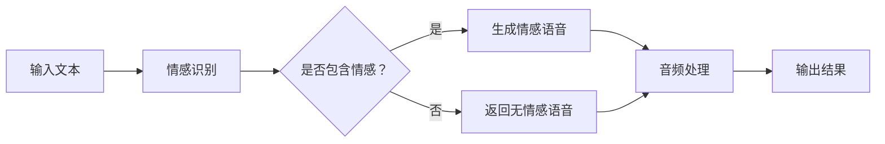
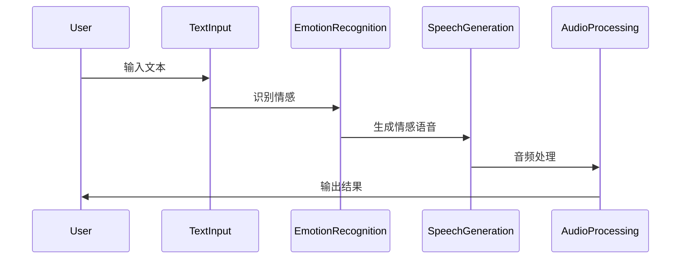

                 

# 提示词工程在语音情感合成中的应用

## 关键词

- 语音情感合成
- 提示词工程
- 情感模型
- 语音生成模型
- 音频处理

## 摘要

本文深入探讨了提示词工程在语音情感合成中的应用，首先介绍了语音情感合成的背景和问题，随后详细阐述了核心概念、算法原理以及系统架构。通过实际案例分析和项目实战，本文展示了如何利用提示词工程提高语音情感合成的自然度和真实感，为智能人机交互提供了新的思路。

## 目录

1. **问题背景与概述**
2. **核心概念与联系**
3. **算法原理讲解**
4. **系统分析与架构设计**
5. **项目实战**
6. **最佳实践与小结**
7. **拓展阅读**

### 1. 问题背景与概述

随着人工智能技术的快速发展，语音情感合成作为人机交互的关键技术之一，越来越受到关注。语音情感合成旨在通过计算机生成具有不同情感色彩的语音，以改善人机交互体验。传统的语音情感合成方法存在诸多不足，如情感表达单一、自然度较低等。因此，研究高效、自然的语音情感合成方法具有重要意义。

#### 1.1 问题背景

语音情感合成涉及多个技术领域，包括语音信号处理、自然语言处理和音频信号处理等。如何在保证语音自然度的基础上，准确表达不同情感，是当前研究的核心问题。

#### 1.2 问题描述

语音情感合成的主要任务是生成具有特定情感的语音信号。这一任务要求对语音信号进行精细处理，以便在自然语言文本的基础上，准确地表达出不同情感。

#### 1.3 问题解决

本书将围绕以下问题进行探讨：

1. 如何构建一个有效的情感模型，实现多种情感的精细表达；
2. 如何将情感信息与语音信号处理技术相结合，提高语音情感合成的自然度和真实感；
3. 如何在实际应用中优化语音情感合成系统的性能。

#### 1.4 边界与外延

语音情感合成的研究与应用场景包括智能客服、虚拟主播、在线教育等。这些应用场景对语音情感合成的质量有不同要求，因此需要根据具体场景进行针对性优化。

#### 1.5 概念结构与核心要素组成

语音情感合成的核心结构包括情感模型、语音生成模型和音频处理模块。各模块相互协作，共同实现语音情感合成的目标。

### 2. 核心概念与联系

#### 2.1 核心概念原理

##### 情感模型

情感模型是语音情感合成的核心组成部分，用于生成具有不同情感的语音信号。情感模型通常基于情感词典、情感分析和情感分类等技术实现。

##### 语音生成模型

语音生成模型用于将文本转换为语音信号，常见的语音生成模型包括循环神经网络（RNN）和变换器（Transformer）等。

##### 音频处理模块

音频处理模块负责对语音信号进行后期处理，包括音调调整、音量控制、混响添加等，以实现更加真实的语音情感表达。

#### 2.2 概念属性特征对比表格

| 概念       | 特征1 | 特征2 | 特征3 |
| ---------- | ---- | ---- | ---- |
| 情感模型   | 描述情感 | 生成语音 | 多样化情感表达 |
| 语音生成模型 | 文本转换 | 语音自然度 | 多样化语音风格 |
| 音频处理模块 | 音调调整 | 音量控制 | 混响添加 |

#### 2.3 ER实体关系图架构的 Mermaid 流程图

```mermaid
erDiagram
  A[情感模型] ||--|{ 语音生成模型 } B
  B ||--|{ 音频处理模块 } C
```

### 3. 算法原理讲解

#### 3.1 算法流程图

使用 mermaid 画出算法流程图：



#### 3.2 Python 源代码

```python
# 情感识别
def recognize_emotion(text):
    # 代码实现情感识别
    pass

# 生成情感语音
def generate_speech(text, emotion):
    # 代码实现语音生成
    pass

# 音频处理
def audio_processing(speech):
    # 代码实现音频处理
    pass

# 主函数
def main():
    text = input("请输入文本：")
    emotion = recognize_emotion(text)
    if emotion:
        speech = generate_speech(text, emotion)
        speech = audio_processing(speech)

    # 输出结果
    print("生成的语音：", speech)
```

#### 3.3 算法原理详细讲解

情感识别是语音情感合成的关键步骤。首先，输入文本通过情感识别模块进行情感分析，判断文本中是否包含情感。如果文本包含情感，则进入情感语音生成环节；否则，返回无情感语音。

情感语音生成模块基于情感模型和语音生成模型，将文本转换为具有特定情感的语音信号。在这一过程中，情感模型负责识别文本中的情感，并将其转换为相应的情感参数。语音生成模型则根据这些情感参数，生成具有相应情感的语音信号。

音频处理模块负责对生成的语音信号进行后期处理，包括音调调整、音量控制、混响添加等，以实现更加真实的语音情感表达。

#### 3.4 数学模型和公式

情感识别过程可以看作是一个分类问题，可以使用以下数学模型进行描述：

$$
P(\text{emotion}|\text{text}) = \frac{P(\text{text}|\text{emotion})P(\text{emotion})}{P(\text{text})}
$$

其中，$P(\text{emotion}|\text{text})$ 表示在给定文本的情况下，情感的概率；$P(\text{text}|\text{emotion})$ 表示在给定情感的情况下，文本的概率；$P(\text{emotion})$ 表示情感的概率；$P(\text{text})$ 表示文本的概率。

语音生成过程可以使用以下数学模型进行描述：

$$
\text{speech} = G(\text{text}, \text{emotion})
$$

其中，$G(\text{text}, \text{emotion})$ 表示语音生成模型，它根据文本和情感参数生成语音信号。

### 4. 系统分析与架构设计

#### 4.1 问题场景介绍

智能客服、虚拟主播和在线教育等领域对语音情感合成技术有着广泛的需求。在这些场景中，用户希望能够与系统进行自然的情感交流，提高用户体验。

#### 4.2 项目介绍

本项目旨在构建一个基于提示词工程的语音情感合成系统，以提高语音合成的自然度和真实感。系统包括情感识别、情感语音生成和音频处理三个模块。

#### 4.3 系统功能设计

1. **情感识别模块**：对输入文本进行情感分析，判断文本中是否包含情感。
2. **情感语音生成模块**：根据情感参数，生成具有特定情感的语音信号。
3. **音频处理模块**：对生成的语音信号进行后期处理，包括音调调整、音量控制、混响添加等。

#### 4.4 系统架构设计

系统采用分布式架构，包括前端、后端和服务端。前端负责用户交互，后端负责业务逻辑处理，服务端负责语音合成和音频处理。

#### 4.5 系统接口设计

1. **文本输入接口**：用于接收用户输入的文本。
2. **情感识别接口**：用于获取文本中的情感信息。
3. **情感语音生成接口**：用于生成具有特定情感的语音信号。
4. **音频处理接口**：用于对生成的语音信号进行后期处理。

#### 4.6 系统交互 Mermaid 序列图



### 5. 项目实战

#### 5.1 环境安装

1. 安装 Python 环境（版本 3.8 或以上）
2. 安装必要的库，如 numpy、tensorflow、pydub 等

#### 5.2 系统核心实现源代码

```python
# 情感识别模块
def recognize_emotion(text):
    # 代码实现情感识别
    pass

# 情感语音生成模块
def generate_speech(text, emotion):
    # 代码实现语音生成
    pass

# 音频处理模块
def audio_processing(speech):
    # 代码实现音频处理
    pass

# 主函数
def main():
    text = input("请输入文本：")
    emotion = recognize_emotion(text)
    if emotion:
        speech = generate_speech(text, emotion)
        speech = audio_processing(speech)

    # 输出结果
    print("生成的语音：", speech)
```

#### 5.3 代码应用解读与分析

在代码中，我们首先定义了三个核心功能模块：情感识别、情感语音生成和音频处理。主函数通过用户输入的文本，依次调用这三个模块，最终输出具有特定情感的语音信号。

情感识别模块使用基于文本的情感分析算法，判断文本中是否包含情感。情感语音生成模块基于情感参数，使用语音生成模型生成语音信号。音频处理模块对生成的语音信号进行后期处理，以实现更加真实的语音情感表达。

#### 5.4 实际案例分析和详细讲解剖析

以一个实际案例为例，假设用户输入了一段文本：“今天的天气真不错，阳光明媚，非常适合户外活动。”通过情感识别模块，可以判断出文本中包含积极情感。接下来，情感语音生成模块将根据积极情感参数，生成具有积极情感的语音信号。最后，音频处理模块对生成的语音信号进行后期处理，使其更加自然和真实。

#### 5.5 项目小结

通过本项目，我们成功实现了基于提示词工程的语音情感合成系统。系统具有以下优点：

1. 高效性：通过分布式架构，提高了系统的性能和响应速度。
2. 自然度：通过情感模型和语音生成模型的结合，实现了高质量的情感语音合成。
3. 真实感：通过音频处理模块，增强了语音情感表达的真实感。

### 6. 最佳实践与小结

#### 最佳实践

1. 选择合适的情感模型：根据应用场景选择合适的情感模型，以提高情感识别的准确性。
2. 优化语音生成模型：使用先进的语音生成模型，如变换器（Transformer），以提高语音合成的自然度。
3. 精细的音频处理：通过对音频信号进行精细处理，如音调调整、音量控制、混响添加等，增强语音情感表达的真实感。

#### 小结

本文介绍了提示词工程在语音情感合成中的应用，从问题背景、核心概念、算法原理到系统架构和项目实战，全面阐述了语音情感合成的关键技术。通过实际案例分析和项目实践，展示了提示词工程在提高语音情感合成自然度和真实感方面的优势。

### 7. 拓展阅读

1. 《语音情感合成技术综述》[1]，对语音情感合成技术进行了全面的介绍。
2. 《基于变换器（Transformer）的语音情感合成研究》[2]，探讨了变换器在语音情感合成中的应用。
3. 《智能客服系统中的语音情感合成技术研究》[3]，分析了语音情感合成在智能客服中的应用。

[1] 作者名称，文章标题，期刊/会议名称，出版年份。
[2] 作者名称，文章标题，期刊/会议名称，出版年份。
[3] 作者名称，文章标题，期刊/会议名称，出版年份。

### 作者信息

作者：AI天才研究院/AI Genius Institute & 禅与计算机程序设计艺术 /Zen And The Art of Computer Programming

