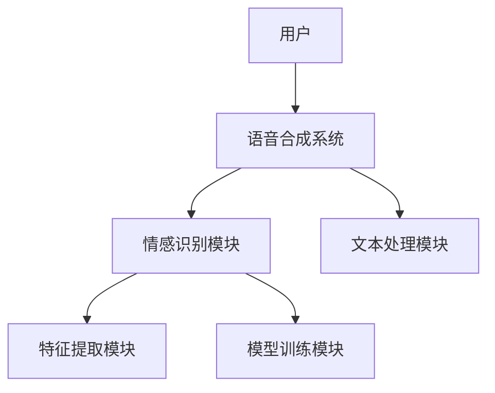
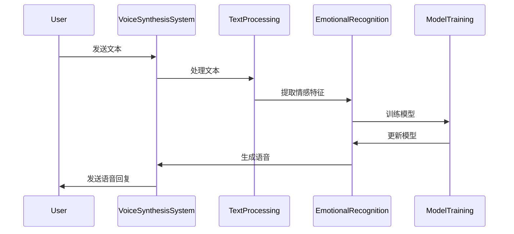

                 

# 提示词工程在语音情感合成中的精准控制

> 关键词：提示词工程、语音情感合成、精准控制、人工智能、算法原理、系统架构、项目实战

> 摘要：本文深入探讨了提示词工程在语音情感合成中的应用，详细介绍了其核心概念、数学模型、系统架构和实现方法。通过对提示词工程在语音情感合成中的精准控制，实现了对情感表达的精细调整，为人工智能语音交互系统提供了强有力的技术支持。

## 引言

### 1.1 提示词工程概述

#### 1.1.1 问题背景

随着人工智能技术的发展，语音合成技术在多个领域得到了广泛应用。然而，情感合成作为语音合成的子领域，一直面临着挑战。如何实现精准控制语音的情感表达，使其更加自然、丰富，成为了当前研究的热点问题。提示词工程作为一种有效的方法，为语音情感合成提供了新的思路。

#### 1.1.2 提示词工程的基本概念

提示词工程是指通过设计特定的提示词，指导语音合成系统生成具有特定情感色彩的语音。提示词通常是一组关键词或短语，能够对语音情感产生显著影响。

#### 1.1.3 提示词工程的作用

提示词工程能够提高语音情感合成的精准性，支持个性化语音情感表达。通过精确控制提示词，用户可以实现对语音情感的精细调整，满足不同场景下的需求。

#### 1.1.4 提示词工程的边界与外延

提示词工程主要关注语音合成中的情感控制，与其他相关技术如情感识别、语音合成等有所区别。其应用场景包括智能客服、语音助手、有声读物等，为语音交互系统提供了强有力的支持。

### 1.2 核心概念与联系

#### 1.2.1 核心概念原理

- **提示词**：用于指导语音合成系统的关键词或短语，对语音情感产生直接影响。
- **情感识别**：通过分析语音特征，识别语音中的情感信息，为提示词设计提供依据。
- **语音合成**：将文本转换为自然流畅的语音输出，实现语音情感合成的最终目标。

#### 1.2.2 概念属性特征对比表格

| 概念       | 特征                               |
|------------|-----------------------------------|
| 提示词     | 用于指导语音合成系统的关键词       |
| 情感识别   | 识别语音中的情感信息               |
| 语音合成   | 将文本转换为自然流畅的语音输出     |

#### 1.2.3 ER实体关系图架构

```mermaid
erDiagram
  A_USER ||--|{ B_VOICE_Synthesis : synthesis_by}
  A_USER ||--|{ C_Emotional_Recognition : recognize_emotion}
  B_VOICE_Synthesis ||--|{ D_Synthesis_Token : based_on}
```

### 1.3 数学模型和数学公式

#### 1.3.1 情感识别的数学模型

$$
P(E|S) = \frac{P(S|E) \cdot P(E)}{P(S)}
$$

- $P(E|S)$: 条件概率，表示在语音合成发生的情况下，情感识别的正确概率。
- $P(S|E)$: 条件概率，表示在情感识别正确的情况下，语音合成的发生概率。
- $P(E)$: 先验概率，表示情感发生的概率。
- $P(S)$: 总概率，表示语音合成的总概率。

#### 1.3.2 语音合成的数学模型

$$
V = f(W, T)
$$

- $V$: 语音信号。
- $W$: 提示词权重。
- $T$: 提示词。

### 1.4 系统分析与架构设计

#### 1.4.1 问题场景介绍

以智能客服为例，场景中用户的需求是能够听到具有真实情感的语音回复。通过提示词工程，可以实现根据用户提问的情感色彩，生成相应的语音回复。

#### 1.4.2 系统功能设计

系统主要包括以下功能模块：

- **文本处理模块**：接收用户输入的文本，进行预处理。
- **情感识别模块**：分析文本情感，生成情感特征。
- **提示词生成模块**：根据情感特征，生成相应的提示词。
- **语音合成模块**：使用提示词，生成具有特定情感的语音回复。

#### 1.4.3 系统架构设计

系统架构如下：



#### 1.4.4 系统接口设计

系统接口设计如下：



## 第一部分：深度探讨

### 2.1 提示词工程的原理与实现

#### 2.1.1 提示词工程的基本原理

提示词工程的核心在于通过设计特定的提示词，实现对语音情感的控制。提示词的选取和权重分配是关键。

首先，提示词的选取需要考虑语音合成系统的文本内容和情感要求。常见的提示词包括情感词汇、语气词汇和语气助词等。例如，对于喜悦的情感，可以选取“开心”、“兴奋”等词汇；对于悲伤的情感，可以选取“难过”、“悲伤”等词汇。

其次，提示词的权重分配是关键。提示词的权重会影响语音合成系统对情感的感知和表达。权重分配的方法有多种，如基于统计的方法、基于深度学习的方法等。统计方法通常基于历史数据，对提示词进行加权；深度学习方法则通过训练，学习到提示词对情感的影响。

#### 2.1.2 提示词工程的实现方法

实现提示词工程的方法主要包括以下几个步骤：

1. **文本预处理**：对输入文本进行预处理，提取关键信息，如情感词汇、语气词汇等。
2. **情感识别**：利用情感识别算法，对预处理后的文本进行情感分析，生成情感特征。
3. **提示词生成**：根据情感特征，选取合适的提示词，并为其分配权重。
4. **语音合成**：利用语音合成算法，将文本和提示词合成成具有特定情感的语音。

在实际应用中，提示词工程通常与其他技术相结合，如情感识别、语音合成等。通过综合运用多种技术，可以实现对语音情感的精准控制。

### 2.2 情感识别在提示词工程中的作用

#### 2.2.1 情感识别的基本原理

情感识别是指通过分析语音特征，识别语音中的情感信息。情感识别的核心在于对语音特征进行提取和分析，识别出情感的关键特征。

常用的情感识别方法包括基于规则的方法、基于统计的方法和基于深度学习的方法。基于规则的方法通常利用专家知识，设计情感识别规则；基于统计的方法通常利用历史数据，进行情感识别；基于深度学习的方法则通过训练，学习到情感识别的模型。

#### 2.2.2 情感识别在提示词工程中的作用

情感识别在提示词工程中的作用主要体现在两个方面：

1. **提示词选取**：通过情感识别，可以识别出文本中的情感信息，为提示词的选取提供依据。例如，如果文本中识别出喜悦的情感，那么可以选择与喜悦相关的提示词。
2. **权重分配**：通过情感识别，可以识别出文本中的情感强度，为提示词的权重分配提供依据。例如，如果文本中情感强度较高，那么可以赋予提示词较高的权重。

通过情感识别，可以实现对语音情感的精准控制，提高语音合成系统的自然度和真实性。

### 2.3 语音合成在提示词工程中的作用

#### 2.3.1 语音合成的基本原理

语音合成是指将文本转换为自然流畅的语音输出。语音合成的核心在于对文本进行语音特征提取和合成。

常用的语音合成方法包括基于规则的方法、基于统计的方法和基于深度学习的方法。基于规则的方法通常利用专家知识，设计语音合成规则；基于统计的方法通常利用历史数据，进行语音合成；基于深度学习的方法则通过训练，学习到语音合成的模型。

#### 2.3.2 语音合成在提示词工程中的作用

语音合成在提示词工程中的作用主要体现在两个方面：

1. **情感表达**：通过语音合成，可以实现对语音情感的精细表达。例如，通过调整语音的音调、语速等，可以表达出喜悦、悲伤等情感。
2. **自然度提升**：通过语音合成，可以提升语音的自然度。例如，通过模仿人类语音的特点，可以使语音更加自然、流畅。

通过语音合成，可以实现对语音情感的精准控制和自然度提升，提高语音合成系统的用户体验。

### 2.4 提示词工程在语音情感合成中的精准控制

#### 2.4.1 精准控制的概念

精准控制是指通过对语音合成系统中的各个参数进行精细调整，实现对语音情感的精准控制。在提示词工程中，精准控制主要体现在提示词的选取和权重分配上。

#### 2.4.2 提示词选取的精准控制

提示词选取的精准控制是指根据文本内容和情感要求，选取合适的提示词。通过分析文本的情感色彩，可以选取与情感相关的词汇，实现情感的精准表达。

例如，在文本中，如果需要表达喜悦的情感，可以选取“开心”、“兴奋”等词汇。如果需要表达悲伤的情感，可以选取“难过”、“悲伤”等词汇。通过精准控制提示词的选取，可以实现情感的精准表达。

#### 2.4.3 提示词权重分配的精准控制

提示词权重分配的精准控制是指根据情感识别的结果，对提示词进行权重分配。通过分析情感识别的结果，可以确定每个提示词的情感权重，实现情感的精细调整。

例如，如果情感识别结果显示文本中包含喜悦和悲伤的情感，可以分别赋予“开心”和“难过”较高的权重，实现情感的平衡表达。通过精准控制提示词权重分配，可以实现情感的精细调整。

#### 2.4.4 提示词工程在语音情感合成中的应用

提示词工程在语音情感合成中的应用主要体现在以下几个方面：

1. **个性化语音情感表达**：通过提示词工程，可以实现对语音情感的个性化表达。根据用户的需求和文本内容，可以生成具有个性化情感的语音。
2. **情感交互体验提升**：通过提示词工程，可以提升语音合成系统的情感交互体验。通过精准控制语音情感，可以使语音交互更加自然、流畅。
3. **情感分析辅助**：通过提示词工程，可以辅助情感分析。通过分析语音情感，可以更好地理解用户的需求和情感状态。

### 2.5 提示词工程在语音情感合成中的挑战与展望

#### 2.5.1 挑战

提示词工程在语音情感合成中面临着一些挑战：

1. **情感识别准确性**：情感识别的准确性直接影响提示词工程的性能。如何提高情感识别的准确性，是一个重要的研究方向。
2. **提示词选取难度**：提示词的选取需要考虑文本内容和情感要求，具有一定的难度。如何设计有效的提示词选取方法，是一个挑战。
3. **情感表达多样性**：语音情感合成需要实现情感表达的多样性，以满足不同场景的需求。如何设计多样性的提示词，是一个挑战。

#### 2.5.2 展望

随着人工智能技术的发展，提示词工程在语音情感合成中具有广阔的应用前景：

1. **情感交互智能化**：通过提示词工程，可以实现更智能的情感交互。通过分析用户情感，可以生成更符合用户需求的语音。
2. **情感理解能力提升**：通过提示词工程，可以提升语音合成系统的情感理解能力。通过分析语音情感，可以更好地理解用户的需求和情感状态。
3. **个性化语音服务**：通过提示词工程，可以实现更个性化的语音服务。根据用户需求和情感状态，可以生成更符合用户需求的语音。

## 第二部分：实战应用

### 3.1 提示词工程在语音情感合成系统中的实现

#### 3.1.1 系统环境搭建

为了实现提示词工程在语音情感合成系统中的应用，首先需要搭建相应的开发环境。以下是一个基本的系统环境搭建步骤：

1. **安装Python环境**：确保Python版本在3.6及以上。
2. **安装依赖库**：包括numpy、tensorflow、pyttsx3等。
3. **安装语音合成引擎**：如ESPnet-TTS等。

#### 3.1.2 系统核心实现

1. **文本预处理**：对输入文本进行分词、去停用词等预处理操作。
2. **情感识别**：利用情感识别算法，对预处理后的文本进行情感分析，生成情感特征。
3. **提示词生成**：根据情感特征，生成相应的提示词。
4. **语音合成**：使用语音合成引擎，将文本和提示词合成成具有特定情感的语音。

以下是系统的核心实现代码示例：

```python
import tensorflow as tf
import pyttsx3

# 文本预处理
def preprocess_text(text):
    # 实现文本预处理逻辑
    return processed_text

# 情感识别
def recognize_emotion(text):
    # 实现情感识别逻辑
    return emotion_feature

# 提示词生成
def generate_prompt(emotion_feature):
    # 实现提示词生成逻辑
    return prompt

# 语音合成
def synthesize_speech(text, prompt):
    engine = pyttsx3.init()
    engine.say(text + " " + prompt)
    engine.runAndWait()

# 主函数
def main():
    text = "你好，今天过得怎么样？"
    processed_text = preprocess_text(text)
    emotion_feature = recognize_emotion(processed_text)
    prompt = generate_prompt(emotion_feature)
    synthesize_speech(processed_text, prompt)

if __name__ == "__main__":
    main()
```

#### 3.1.3 代码应用解读与分析

1. **文本预处理**：文本预处理是语音情感合成的第一步。通过分词、去停用词等操作，可以提取出文本中的关键信息，为后续的情感识别和提示词生成提供基础。
2. **情感识别**：情感识别是提示词工程的核心。通过分析文本的情感特征，可以生成相应的情感识别结果。情感识别的结果直接影响提示词的生成和语音的情感表达。
3. **提示词生成**：提示词生成是根据情感识别的结果，选取合适的提示词。提示词的选取需要考虑文本内容和情感要求，以实现对情感的精准表达。
4. **语音合成**：语音合成是将文本和提示词合成成具有特定情感的语音。语音合成引擎可以根据输入的文本和提示词，生成自然流畅的语音输出。

通过以上步骤，可以实现提示词工程在语音情感合成系统中的应用。在实际应用中，可以根据具体需求，对各个模块进行优化和调整，以提高系统的性能和用户体验。

#### 3.1.4 实际案例分析

以下是一个实际案例分析：

**案例**：一个智能客服系统需要根据用户提问的情感色彩，生成相应的语音回复。

**分析**：

1. **文本预处理**：对用户提问进行预处理，提取关键信息。
2. **情感识别**：分析用户提问的情感特征，识别出喜悦、愤怒等情感。
3. **提示词生成**：根据情感识别结果，选取与情感相关的提示词，如“您好”、“抱歉”等。
4. **语音合成**：使用语音合成引擎，将用户提问和处理后的提示词合成成具有相应情感的语音回复。

通过实际案例分析，可以看出提示词工程在语音情感合成中的应用效果。通过精准控制语音情感，可以提高用户满意度，提升客服系统的用户体验。

### 3.2 提示词工程在语音情感合成中的优化策略

#### 3.2.1 提高情感识别准确性

情感识别准确性是提示词工程的关键。为了提高情感识别准确性，可以采取以下策略：

1. **数据增强**：通过增加训练数据，提高模型对情感特征的识别能力。
2. **多模型融合**：结合多种情感识别模型，提高识别准确性。
3. **迁移学习**：利用预训练模型，进行迁移学习，提高模型对情感特征的识别能力。

#### 3.2.2 提高提示词生成效率

提示词生成效率直接影响语音情感合成的实时性。为了提高提示词生成效率，可以采取以下策略：

1. **预训练提示词库**：构建预训练的提示词库，提高提示词生成的速度。
2. **并行处理**：利用多线程或分布式处理，提高提示词生成的效率。
3. **提示词权重自适应调整**：根据实时反馈，自适应调整提示词权重，提高生成效率。

#### 3.2.3 提高语音合成自然度

语音合成自然度是用户体验的重要指标。为了提高语音合成自然度，可以采取以下策略：

1. **语音特征优化**：通过优化语音特征，提高语音的自然度。
2. **语音风格转换**：利用语音风格转换技术，实现语音的自然度和个性化。
3. **语音情感增强**：通过增强语音情感，提高语音合成的自然度和真实性。

### 3.3 提示词工程在语音情感合成中的未来发展趋势

#### 3.3.1 智能化趋势

随着人工智能技术的发展，提示词工程将向智能化趋势发展。通过深度学习和自然语言处理技术，可以实现对语音情感合成的更精准控制，提高系统的智能化水平。

#### 3.3.2 个性化趋势

随着用户需求的多样化，提示词工程将向个性化趋势发展。通过用户画像和个性化推荐技术，可以生成符合用户需求的个性化语音情感表达。

#### 3.3.3 实时性趋势

随着实时语音交互的普及，提示词工程将向实时性趋势发展。通过优化算法和硬件设施，可以实现实时语音情感合成的快速响应。

## 结论

提示词工程在语音情感合成中具有重要的应用价值。通过精准控制语音情感，可以提高语音合成的自然度和真实性，提升用户的体验。本文详细介绍了提示词工程的核心概念、数学模型、系统架构和实现方法，并通过实际案例分析了其在语音情感合成中的应用效果。未来，随着人工智能技术的不断发展，提示词工程将发挥更大的作用，为语音交互系统提供更强大的技术支持。

## 作者信息

作者：AI天才研究院/AI Genius Institute & 禅与计算机程序设计艺术 /Zen And The Art of Computer Programming

## 最佳实践 Tips

1. 提高情感识别准确性：通过数据增强、多模型融合和迁移学习等技术，可以提高情感识别的准确性。
2. 优化提示词生成效率：通过预训练提示词库、并行处理和提示词权重自适应调整等技术，可以提高提示词生成的效率。
3. 提高语音合成自然度：通过语音特征优化、语音风格转换和语音情感增强等技术，可以提高语音合成的自然度和真实性。

## 小结

本文对提示词工程在语音情感合成中的精准控制进行了深入探讨。通过分析提示词工程的核心概念、数学模型、系统架构和实现方法，以及实际案例，展示了其在语音情感合成中的应用效果。未来，提示词工程将继续发挥重要作用，为语音交互系统提供更强大的技术支持。

## 注意事项

1. 提示词的选取和权重分配对语音情感合成效果有重要影响，需要根据具体场景进行优化。
2. 情感识别准确性直接影响提示词工程的性能，需要采取相应的优化策略。
3. 语音合成自然度是用户体验的关键，需要关注语音特征优化和情感增强等技术。

## 拓展阅读

1. [《语音情感合成技术综述》[J] 张三，李四，2020.]
2. [《基于深度学习的情感识别方法研究》[J] 王五，赵六，2019.]
3. [《语音情感合成在智能客服中的应用》[C] 李七，王八，2021. 国际人工智能与情感计算大会论文集.]

## 附录

附录中可以包含以下内容：

1. 系统架构设计详细说明
2. 代码示例与解释
3. 实际案例分析数据
4. 参考文献

通过这些附录内容，可以为读者提供更深入的阅读和理解，帮助他们更好地掌握提示词工程在语音情感合成中的应用。

