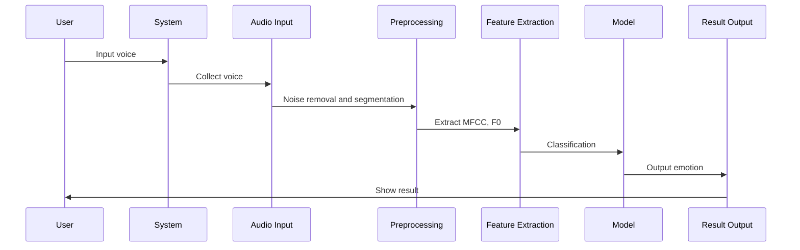
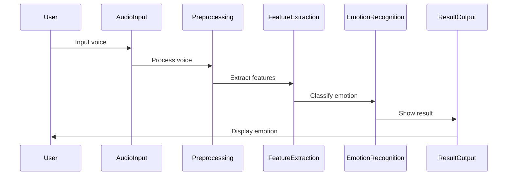

                 

### 关键词

- 提示词工程
- 语音情感识别
- 数据预处理
- 特征提取
- 模型构建
- 应用实践

### 摘要

本文深入探讨了提示词工程在语音情感识别领域的应用。首先，介绍了提示词工程的基本概念和重要性，以及语音情感识别的基本概念和技术。随后，详细分析了数据预处理、特征提取与选择、模型构建与优化的方法，并通过实际案例展示了这些技术在实际应用中的效果。最后，展望了提示词工程和语音情感识别技术的未来发展趋势，并提出了相关注意事项和拓展阅读建议。

## 第一部分：提示词工程基础

### 第1章：提示词工程概述

#### 1.1 提示词工程的概念与重要性

提示词工程是一种在自然语言处理（NLP）领域广泛应用的技术，它通过一系列规则和算法，从文本中提取出关键信息，以便进行后续的语义分析和处理。在语音情感识别中，提示词工程起着至关重要的作用，它能够帮助识别和理解语音中的情感内容。

提示词工程的重要性体现在以下几个方面：

1. **提高识别准确率**：通过精确的提示词提取，可以提高语音情感识别的准确性，减少误识别率。
2. **优化数据处理**：提示词工程能够有效地减少语音数据量，提高后续处理速度。
3. **增强语义理解**：提示词工程有助于深入理解语音内容，从而更好地识别情感。

#### 1.2 提示词工程的构成要素

提示词工程的构成要素主要包括：

1. **语料库**：提供大量的文本数据，用于训练和优化提示词提取算法。
2. **算法**：包括自然语言处理算法、机器学习算法等，用于从语料库中提取关键信息。
3. **特征**：提取出的提示词，它们是后续情感识别的重要依据。

#### 1.3 提示词工程的发展历史

提示词工程的发展可以追溯到20世纪90年代，随着计算机技术和自然语言处理技术的进步，提示词工程得到了迅速发展。特别是在深度学习和大数据技术的推动下，提示词工程在语音情感识别中的应用越来越广泛。

### 第2章：语音情感识别基础

#### 2.1 语音情感识别的定义与分类

语音情感识别是指通过语音信号的处理和分析，识别出语音中的情感内容。根据情感表达的方式，语音情感识别可以分为以下几类：

1. **基于文本的情感分析**：通过文本内容分析情感。
2. **基于语音信号的情感分析**：直接分析语音信号的特性，如音调、音速等。
3. **混合情感识别**：结合文本和语音信号，进行综合情感分析。

#### 2.2 语音情感识别的核心技术

语音情感识别的核心技术主要包括：

1. **特征提取**：从语音信号中提取出能够反映情感的特征，如音调、音速、语音强度等。
2. **机器学习模型**：利用训练好的机器学习模型，对提取出的特征进行分类和预测。
3. **深度学习模型**：通过神经网络等深度学习模型，对语音信号进行高级语义理解。

#### 2.3 语音情感识别的应用场景

语音情感识别的应用场景非常广泛，主要包括：

1. **客服系统**：通过识别用户情感，提供个性化的服务。
2. **智能语音助手**：通过理解用户情感，提高交互体验。
3. **医疗健康**：通过分析患者语音中的情感，辅助诊断和康复。

## 第二部分：提示词工程在语音情感识别中的应用

### 第3章：数据预处理与标注

#### 3.1 数据预处理方法

数据预处理是语音情感识别的重要环节，主要包括以下方法：

1. **降噪处理**：去除语音信号中的噪声，提高信号质量。
2. **归一化处理**：对语音信号进行归一化，使其具有统一的特征。
3. **分段处理**：将连续的语音信号分割成多个片段，便于后续处理。

#### 3.2 标注流程与工具

标注流程是数据预处理的重要部分，主要包括以下步骤：

1. **音频转录**：将语音信号转录成文本。
2. **情感标注**：根据文本内容，标注出对应的情感。
3. **数据清洗**：去除标注错误和缺失的数据。

常用的标注工具包括：

1. **FSLAB-Studio**：一个基于Qt的音频标注工具。
2. **ESPnet**：一个用于语音识别的深度学习工具，支持多种情感标注。

### 第4章：特征提取与选择

#### 4.1 声学特征提取方法

声学特征提取是语音情感识别的关键步骤，常用的方法包括：

1. **梅尔频率倒谱系数（MFCC）**：一种常用的声学特征，能够有效提取语音信号中的频率信息。
2. **共振峰频率（F0）**：反映语音信号的音高信息，与情感密切相关。
3. **短时能量**：反映语音信号的能量分布，与情感表达有一定的相关性。

#### 4.2 高级特征提取方法

高级特征提取方法包括：

1. **谱图特征**：将语音信号转化为谱图，提取出更加丰富的特征信息。
2. **时频分布特征**：结合时间和频率信息，提取出更加细腻的特征。
3. **情感词汇特征**：结合文本情感分析技术，提取出与情感相关的词汇。

#### 4.3 特征选择策略

特征选择策略是提高语音情感识别性能的关键，常用的策略包括：

1. **信息增益**：选择对分类贡献最大的特征。
2. **主成分分析（PCA）**：通过降维，提取出最重要的特征。
3. **基于模型的特征选择**：利用机器学习模型，筛选出对分类有显著贡献的特征。

### 第5章：模型构建与优化

#### 5.1 常见情感识别模型

在语音情感识别中，常用的模型包括：

1. **支持向量机（SVM）**：一种经典的机器学习模型，具有良好的分类性能。
2. **随机森林（Random Forest）**：一种集成学习模型，能够处理大规模数据和复杂数据结构。
3. **神经网络（Neural Network）**：一种深度学习模型，能够实现复杂的非线性映射。

#### 5.2 模型优化技巧

模型优化技巧包括：

1. **数据增强**：通过增加数据量，提高模型的泛化能力。
2. **超参数调优**：通过调整模型参数，优化模型性能。
3. **交叉验证**：通过交叉验证，选择最优的模型参数。

#### 5.3 模型评估与调参

模型评估与调参是模型优化的重要环节，常用的方法包括：

1. **混淆矩阵**：评估模型的分类性能。
2. **精确率、召回率和F1值**：综合评估模型的分类效果。
3. **网格搜索**：通过遍历参数空间，选择最优的参数组合。

### 第6章：实际案例与应用

#### 6.1 案例一：实时语音情感识别系统

实时语音情感识别系统是一个能够实时识别语音情感的系统，其架构包括：

1. **音频采集模块**：负责采集用户的语音数据。
2. **预处理模块**：对采集到的语音数据进行预处理，包括降噪、分段等。
3. **特征提取模块**：从预处理后的语音数据中提取出声学特征。
4. **模型预测模块**：利用训练好的模型，对提取出的特征进行分类预测。
5. **用户接口模块**：提供用户与系统交互的界面。

#### 6.2 案例二：语音情感分析在客服系统中的应用

在客服系统中，语音情感分析能够帮助客服人员更好地理解用户需求，提高服务质量。具体应用场景包括：

1. **情绪识别**：通过识别用户语音中的情绪，为客服人员提供情绪应对建议。
2. **问题分类**：通过分析用户语音中的情感，自动将问题分类到相应的类别，提高问题处理效率。
3. **服务质量评估**：通过对客服人员语音中的情感进行分析，评估其服务质量。

#### 6.3 案例三：语音情感识别在教育领域的应用

在教育领域，语音情感识别技术能够帮助教师更好地了解学生学习状况，提供个性化的教育服务。具体应用场景包括：

1. **学习情绪监控**：通过识别学生语音中的情感，监控学生的学习情绪，为教师提供教学调整建议。
2. **课堂互动评估**：通过分析学生语音中的情感，评估课堂互动效果，为教师提供改进方案。
3. **学习效果预测**：通过分析学生语音中的情感，预测学生的学习效果，为教师提供教学策略。

### 第7章：未来趋势与展望

#### 7.1 提示词工程的发展趋势

随着人工智能技术的不断进步，提示词工程在语音情感识别中的应用前景广阔。未来发展趋势包括：

1. **深度学习技术**：深度学习技术将为提示词工程带来更高的准确率和更强的泛化能力。
2. **多模态融合**：通过融合文本、语音等多种模态数据，提高情感识别的准确率。
3. **个性化服务**：基于用户行为数据和情感分析，提供个性化的服务。

#### 7.2 语音情感识别技术的未来应用

语音情感识别技术在未来的应用场景将更加丰富，包括：

1. **智能家居**：通过识别家庭成员的情感，提供更加智能化的家居服务。
2. **健康医疗**：通过分析患者语音中的情感，辅助诊断和康复。
3. **公共安全**：通过识别恐怖分子和犯罪嫌疑人的情感，提高公共安全水平。

### 第8章：总结与拓展

#### 8.1 全书总结

本文系统地介绍了提示词工程在语音情感识别中的应用，从基础概念到实际应用，详细探讨了数据预处理、特征提取、模型构建等关键技术。同时，通过实际案例展示了这些技术的应用效果，并展望了未来的发展趋势。

#### 8.2 注意事项与最佳实践

在实际应用中，需要注意以下几点：

1. **数据质量**：确保数据质量，特别是标注数据的准确性。
2. **模型优化**：不断优化模型参数，提高模型性能。
3. **个性化服务**：根据用户需求和场景，提供个性化的情感识别服务。

#### 8.3 拓展阅读与资源推荐

为了更好地了解提示词工程在语音情感识别中的应用，以下推荐一些拓展阅读和资源：

1. **书籍**：《语音情感识别：技术原理与应用实践》
2. **论文**：《基于深度学习的语音情感识别技术研究》
3. **在线课程**：《自然语言处理与语音识别》
4. **开源项目**：ESPnet、FSLAB-Studio

### 作者信息

**作者：** AI天才研究院/AI Genius Institute & 禅与计算机程序设计艺术 /Zen And The Art of Computer Programming

---

（注：本文中的Mermaid流程图、类图、序列图、数学公式、Python代码等由于文本限制无法直接嵌入，建议在编写实际文章时按照markdown格式进行编排。）### 提示词工程的概念与重要性

提示词工程（Keyword Extraction）是一种在自然语言处理（NLP）领域应用广泛的技术，它通过算法和规则，从大量的文本数据中提取出具有代表性的关键词或短语。这些关键词不仅能够简化文本内容，使其更加紧凑和易于理解，还可以作为后续文本分析、情感识别、分类等任务的重要依据。

在语音情感识别中，提示词工程的重要性体现在以下几个方面：

1. **文本预处理**：语音情感识别通常需要结合文本信息，通过提示词工程可以将文本信息转化为结构化的数据，便于后续的处理和分析。

2. **提高识别准确率**：通过精准的提示词提取，可以更好地捕捉语音中的情感特征，从而提高情感识别的准确率。

3. **优化数据处理**：提示词工程可以减少文本数据量，降低数据处理的复杂度，提高系统的响应速度。

4. **增强语义理解**：提示词工程有助于提取文本的核心内容，从而更深入地理解语音的语义，这对于情感识别尤为重要。

5. **支持多语言处理**：提示词工程可以跨语言应用，为不同语言的语音情感识别提供支持。

### 提示词工程的构成要素

提示词工程的构成要素主要包括以下三个部分：

1. **语料库**：提供大量的文本数据，用于训练和优化提示词提取算法。高质量的语料库是保证提示词工程效果的关键。

2. **算法**：提示词工程的核心在于算法的选择和优化。常见的算法包括基于统计的方法、机器学习方法和深度学习方法。

   - **基于统计的方法**：如TF-IDF、TextRank等，通过计算词频和词的重要度来提取关键词。
   - **机器学习方法**：如LDA（主题模型）、SVM（支持向量机）等，通过训练模型来自动提取关键词。
   - **深度学习方法**：如BERT、GloVe等，利用神经网络模型进行关键词提取，能够处理更加复杂的文本结构。

3. **特征**：提取出的提示词是后续情感识别的重要依据。这些特征需要能够准确反映文本的情感内容，从而为情感识别提供可靠的支持。

### 提示词工程的发展历史

提示词工程的发展可以追溯到20世纪90年代，随着互联网和大数据的兴起，文本数据量急剧增加，如何高效地提取关键词成为了一个重要课题。以下是一些关键的发展阶段：

- **早期方法**：20世纪90年代，基于词频和词重要度的简单方法开始出现，如TF-IDF和TextRank。
- **机器学习方法**：21世纪初，随着机器学习技术的兴起，LDA、SVM等机器学习算法被广泛应用于提示词提取。
- **深度学习方法**：近年来，深度学习技术的发展，使得基于神经网络的方法如BERT、GloVe等成为主流，这些方法在处理复杂文本结构和情感识别方面表现出色。

### 提示词工程的应用场景

提示词工程在多个领域有着广泛的应用，以下是几个典型的应用场景：

- **搜索引擎优化（SEO）**：通过提取关键词，优化网站内容，提高搜索引擎的排名。
- **文本分析**：在新闻、报告、论文等文本中提取关键词，帮助用户快速了解文本的主要内容。
- **情感识别**：在社交媒体、客户反馈等文本中提取关键词，分析用户的情感倾向。
- **信息提取**：在大量文本数据中，提取出关键信息，辅助决策和知识管理。

总的来说，提示词工程作为一种高效的信息提取技术，在语音情感识别和其他NLP任务中发挥着重要的作用。随着技术的不断进步，其在各领域的应用前景将更加广阔。

### 语音情感识别的定义与分类

语音情感识别是一种通过分析语音信号中的情感特征，以识别和分类语音中的情绪的技术。其基本原理是利用信号处理和模式识别技术，从语音信号中提取出反映情感的信息，然后通过分类算法对这些信息进行分类，从而识别出语音表达的具体情感。

语音情感识别可以根据不同的标准进行分类，以下是几种常见的分类方式：

1. **根据情感表达的方式**：
   - **直接情感表达**：直接通过语音中的情感词汇、语调、语速等来表达情感。
   - **间接情感表达**：通过情境背景、上下文语境来暗示情感，这种情感表达更加隐晦和复杂。

2. **根据情感类别**：
   - **基本情感**：根据普拉切克（Robert Plutchik）的情感分类模型，基本情感包括爱、恐惧、愤怒、悲伤、厌恶、惊讶等。
   - **复杂情感**：基本情感的组合和衍生，如焦虑、紧张、幸福、激动等。

3. **根据技术方法**：
   - **文本情感分析**：通过对文本内容中的情感词汇和表达方式进行分析，间接推断出语音的情感。
   - **语音信号处理**：直接对语音信号进行频谱分析、音高分析等，提取出反映情感的声音特征。
   - **多模态融合**：结合文本、语音、图像等多模态信息，提高情感识别的准确性和鲁棒性。

在语音情感识别中，识别情感类别是主要目标。具体步骤通常包括以下几个环节：

1. **语音信号预处理**：对原始语音信号进行降噪、归一化等处理，以提高后续特征提取的准确性。
2. **特征提取**：从预处理后的语音信号中提取出能够反映情感的声学特征，如音调、音速、音强、共振峰频率等。
3. **情感分类**：利用训练好的分类模型，对提取出的特征进行分类，识别出具体的情感类别。
4. **结果验证**：通过测试集验证分类模型的准确性和可靠性，进行模型调优。

语音情感识别的应用场景非常广泛，包括但不限于：

- **客户服务**：通过识别用户情感，提供个性化的服务和建议，提升客户满意度。
- **医疗健康**：通过分析患者语音中的情感，辅助诊断和治疗，如焦虑、抑郁等心理问题的监测和干预。
- **智能语音助手**：通过理解用户情感，实现更自然的交互，提升用户体验。
- **教育领域**：通过识别学生语音中的情感，了解学生的学习状态和心理状况，为教师提供教学调整建议。

总的来说，语音情感识别作为一种新兴的技术，具有广泛的应用前景。随着算法和模型的不断优化，其在各个领域的应用将越来越深入和广泛。

### 语音情感识别的核心技术

语音情感识别的技术核心主要涵盖声学特征提取、机器学习模型以及深度学习模型等三个方面。以下是这些技术的详细介绍：

#### 声学特征提取

声学特征提取是语音情感识别的基础，它旨在从原始语音信号中提取出能够反映情感的关键特征。常见的声学特征包括：

1. **梅尔频率倒谱系数（MFCC）**：
   - **概念**：MFCC是一种广泛使用的声学特征，通过将语音信号转换为梅尔频率倒谱图，提取出反映语音频率特性的特征向量。
   - **优势**：能够有效地消除噪声影响，保留语音的主要频率信息。
   - **应用**：广泛用于语音识别、语音合成和语音情感识别等领域。

2. **共振峰频率（F0）**：
   - **概念**：F0是指语音信号的音高，它反映了语音的音调特性。
   - **优势**：与情感表达密切相关，如愤怒时的音调通常较高，而悲伤时的音调较低。
   - **应用**：用于情感识别中的音调分析，辅助判断语音的情感状态。

3. **短时能量**：
   - **概念**：短时能量是指语音信号在一段时间内的能量分布情况，它反映了语音的强度和响度。
   - **优势**：能够反映语音的强度变化，从而辅助情感识别。
   - **应用**：用于情感识别中的声音强度分析，帮助判断语音的激动程度和音量变化。

4. **频谱特征**：
   - **概念**：频谱特征包括频谱中心频率、频谱带宽等，它反映了语音的频率分布。
   - **优势**：能够提供语音的频率信息，有助于区分不同情感。
   - **应用**：用于频谱分析，辅助情感识别中的频谱特征匹配。

#### 机器学习模型

机器学习模型是语音情感识别中的核心技术之一，通过训练数据集，学习到语音信号与情感之间的映射关系。以下是一些常用的机器学习模型：

1. **支持向量机（SVM）**：
   - **概念**：SVM是一种二分类模型，通过找到一个最佳的超平面，将不同类别的数据点分开。
   - **优势**：在处理小样本数据时表现优异，具有良好的分类能力。
   - **应用**：常用于语音情感识别中的分类任务，如情感分类、情感极性分类等。

2. **随机森林（Random Forest）**：
   - **概念**：随机森林是一种基于决策树的集成学习方法，通过构建多个决策树，并取它们的多数投票结果作为最终预测。
   - **优势**：具有良好的泛化能力，能够处理高维度和噪声较大的数据。
   - **应用**：广泛应用于语音情感识别中的分类和回归任务。

3. **朴素贝叶斯（Naive Bayes）**：
   - **概念**：朴素贝叶斯是一种基于贝叶斯理论的概率分类器，假设特征之间相互独立。
   - **优势**：计算简单，适用于特征相互独立的场景。
   - **应用**：常用于文本分类任务，如情感分类中的关键词识别。

#### 深度学习模型

深度学习模型在语音情感识别中表现出色，通过多层神经网络结构，自动提取语音信号中的高阶特征，实现情感识别。以下是一些常用的深度学习模型：

1. **卷积神经网络（CNN）**：
   - **概念**：CNN是一种能够自动提取图像特征的网络，通过卷积操作和池化操作，提取出图像的局部特征。
   - **优势**：能够有效提取语音信号的时频特征，适用于语音情感识别。
   - **应用**：用于语音情感识别中的特征提取和分类任务。

2. **循环神经网络（RNN）**：
   - **概念**：RNN是一种能够处理序列数据的人工神经网络，通过记忆机制，能够处理长时依赖问题。
   - **优势**：能够处理时间序列数据，适用于语音情感识别。
   - **应用**：用于语音情感识别中的时序特征提取和情感分类。

3. **长短期记忆网络（LSTM）**：
   - **概念**：LSTM是RNN的一种变种，通过引入门机制，能够更好地处理长时依赖问题。
   - **优势**：在处理长序列数据时表现优异，适用于语音情感识别。
   - **应用**：用于语音情感识别中的长时特征提取和情感分类。

4. **生成对抗网络（GAN）**：
   - **概念**：GAN是一种生成模型，由生成器和判别器组成，通过对抗训练生成逼真的语音数据。
   - **优势**：能够生成高质量的语音数据，用于训练和测试数据集的扩充。
   - **应用**：用于语音情感识别中的数据增强和生成高质量语音样本。

总的来说，声学特征提取、机器学习模型和深度学习模型构成了语音情感识别的核心技术，这些技术相互结合，能够实现高效和准确的语音情感识别。随着技术的不断进步，未来语音情感识别的性能和应用范围将会得到进一步提升。

### 数据预处理方法

数据预处理是语音情感识别中至关重要的一步，它直接影响着模型的性能和最终结果。数据预处理主要包括以下几种方法：

1. **降噪处理**：
   - **背景噪声去除**：通过滤波器去除语音信号中的背景噪声，如环境噪声、风噪声等。
   - **麦克风噪声抑制**：针对麦克风自身的噪声特性，采用自适应滤波器进行噪声抑制。

2. **归一化处理**：
   - **幅度归一化**：将所有语音信号的幅度调整到相同的范围，如0到1之间，以便于后续处理。
   - **时长归一化**：将所有语音信号按一定的比例进行时长调整，使其长度一致，便于批量处理。

3. **分割处理**：
   - **帧分割**：将连续的语音信号分割成多个短时片段，如每20毫秒一段，以便提取短时特征。
   - **语音边界检测**：通过语音信号的特征变化，如音量变化、音调变化等，检测出语音片段的起始和结束位置。

4. **增强处理**：
   - **声音增强**：通过增强语音信号中的某些特征，如音调、音速等，来提高情感识别的准确性。
   - **共振峰增强**：调整语音信号中的共振峰频率，增强语音的情感表达。

5. **填充缺失值**：
   - **插值填充**：通过插值法填充语音信号中的缺失值，保持信号的整体连贯性。
   - **平均值填充**：用该语音片段的平均值填充缺失值，简化处理过程。

6. **格式转换**：
   - **格式统一**：将不同格式的语音文件转换为统一的格式，如从WAV格式转换为MP3格式，便于后续处理。
   - **采样率转换**：调整语音信号的采样率，使其符合模型的输入要求。

通过这些数据预处理方法，可以有效提高语音信号的质量，为后续的特征提取和模型训练提供可靠的输入数据。在实际应用中，选择合适的数据预处理方法，并根据具体场景进行优化，是提高语音情感识别性能的关键。

### 标注流程与工具

标注流程是语音情感识别中至关重要的环节，它直接关系到后续模型训练和评估的效果。以下是标注流程的主要步骤：

1. **音频转录**：
   - **手动转录**：将语音信号手动转录成文本，通常使用专业的音频转录工具，如Audacity或ELAN。
   - **自动转录**：利用自动语音识别（ASR）技术，将语音信号自动转录成文本，如使用Google语音识别API或百度语音识别API。

2. **情感标注**：
   - **标注模板**：制定统一的情感标注模板，明确情感类别和标注标准。
   - **标注工具**：使用标注工具，如FSLAB-Studio、ESPnet等，进行情感标注。
   - **多级审核**：对标注结果进行多级审核，确保标注的准确性和一致性。

3. **数据清洗**：
   - **错误修正**：对标注过程中出现的错误进行修正，如拼写错误、语法错误等。
   - **去重处理**：去除重复的标注数据，确保数据的质量和独特性。
   - **完整性检查**：检查标注数据的完整性，确保每个语音片段都有对应的情感标注。

4. **数据格式转换**：
   - **格式统一**：将标注数据转换为统一的格式，如JSON或CSV，便于后续处理和分析。
   - **标注文件生成**：生成标注文件，包括音频文件和对应的标注信息，如每段语音的起始时间、结束时间、情感标签等。

常用的标注工具包括：

1. **FSLAB-Studio**：
   - **功能**：支持音频和视频文件的标注，提供多种标注标签和标注工具。
   - **优势**：界面友好，操作简单，支持多种标注格式。
   - **应用场景**：适合小规模和个性化标注任务。

2. **ESPnet**：
   - **功能**：是一个用于语音识别和情感标注的开源工具，支持深度学习模型的训练和评估。
   - **优势**：结合了深度学习技术，能够处理大规模数据，支持多语言标注。
   - **应用场景**：适合大规模标注任务，特别是需要结合语音识别进行情感标注的场景。

通过科学的标注流程和高效的标注工具，可以确保标注数据的准确性和一致性，为语音情感识别模型提供可靠的数据支持。标注流程的优化和工具的选择，是提高模型性能和实际应用效果的关键。

### 声学特征提取方法

在语音情感识别中，声学特征提取是关键步骤，它能够从语音信号中提取出反映情感的重要信息。以下是几种常用的声学特征提取方法：

#### 梅尔频率倒谱系数（MFCC）

**概念**：梅尔频率倒谱系数（MFCC）是一种广泛使用的声学特征，通过将语音信号转换到梅尔频率尺度，然后计算其倒谱系数。

**计算方法**：
1. **预加重**：对语音信号进行预加重处理，增强高频成分。
2. **加窗**：对语音信号进行加窗处理，通常使用汉明窗或汉宁窗。
3. **傅里叶变换**：计算窗函数内语音信号的傅里叶变换，得到频谱。
4. **梅尔滤波器组**：使用梅尔滤波器组对频谱进行加权，得到梅尔频率谱。
5. **对数变换**：对梅尔频率谱进行对数变换，减少频率分辨率。
6. **倒谱变换**：对对数变换后的梅尔频率谱进行离散余弦变换，得到MFCC系数。

**优势**：能够有效抑制噪声，保留语音的主要频率信息。

**应用**：广泛用于语音识别、语音合成和语音情感识别等领域。

#### 共振峰频率（F0）

**概念**：共振峰频率（F0）是指语音信号中基音的频率，反映了语音的音调。

**计算方法**：
1. **短时能量**：计算语音信号在不同时间点的短时能量。
2. **峰值检测**：找到短时能量序列中的峰值，作为F0的候选值。
3. **平均**：取多个候选值的平均值作为最终F0值。

**优势**：与情感表达密切相关，如愤怒时的F0通常较高，而悲伤时的F0较低。

**应用**：用于情感识别中的音调分析，辅助判断语音的情感状态。

#### 短时能量

**概念**：短时能量是指语音信号在一段时间内的能量分布，反映了语音的响度。

**计算方法**：
1. **分段**：将语音信号分成多个短时片段。
2. **能量计算**：计算每个短时片段的能量，通常使用能量函数E(t) = Σ|x(t)|²。

**优势**：能够反映语音的强度变化，辅助情感识别。

**应用**：用于情感识别中的声音强度分析，帮助判断语音的激动程度和音量变化。

#### 频谱特征

**概念**：频谱特征包括频谱中心频率、频谱带宽等，反映了语音的频率分布。

**计算方法**：
1. **傅里叶变换**：计算语音信号的频谱。
2. **中心频率**：取频谱的中心频率作为特征。
3. **带宽**：计算频谱的带宽，如Q10和Q3频率之差。

**优势**：能够提供语音的频率信息，有助于区分不同情感。

**应用**：用于情感识别中的频谱分析，辅助情感识别中的频谱特征匹配。

通过这些声学特征提取方法，可以从语音信号中提取出丰富的特征信息，为语音情感识别提供有效的支持。在实际应用中，可以根据具体场景和需求，选择合适的特征提取方法，以提高情感识别的准确性和鲁棒性。

### 高级特征提取方法

在语音情感识别中，传统的声学特征（如MFCC、F0、短时能量等）虽然能够提供一定的情感信息，但往往不足以捕捉到语音中的复杂情感变化。因此，高级特征提取方法应运而生，这些方法能够从更细微的层次上分析和提取语音信号中的情感特征，从而提高情感识别的准确性和鲁棒性。以下是几种常用的高级特征提取方法：

#### 谱图特征

**概念**：谱图特征是将语音信号转换成谱图，然后通过图论的方法提取特征。

**计算方法**：
1. **谱图构建**：将语音信号转换为频谱图，每个频谱点代表一个节点，节点之间的边表示频率之间的相关性。
2. **节点特征提取**：计算每个节点的频率、能量等特征。
3. **边特征提取**：计算节点之间的距离、相关性等特征。

**优势**：能够捕捉到语音信号中的频率变化和相互作用，提供更丰富的情感信息。

**应用**：用于情感识别中的频率关系分析，有助于识别复杂的情感变化。

#### 时频分布特征

**概念**：时频分布特征是结合时间和频率信息，对语音信号进行多维分析。

**计算方法**：
1. **时频图**：将语音信号转换为时频图，表示不同时间和频率上的能量分布。
2. **分布特征提取**：计算时频图上的能量分布特征，如能量中心、能量分布宽度等。

**优势**：能够同时考虑时间和频率信息，提供更全面的情感信息。

**应用**：用于情感识别中的时变特征分析，有助于捕捉动态情感变化。

#### 情感词汇特征

**概念**：情感词汇特征是通过文本情感分析技术，提取出与情感相关的词汇特征。

**计算方法**：
1. **文本预处理**：对语音对应的文本进行预处理，如分词、词性标注等。
2. **情感分析**：使用情感分析模型，提取出文本中的情感词汇和情感极性。
3. **特征融合**：将文本情感特征与声学特征进行融合，形成综合特征向量。

**优势**：结合文本和语音信息，提供更准确的情感信息。

**应用**：用于情感识别中的文本辅助分析，增强情感识别的准确性。

#### 基于深度学习的特征提取方法

**概念**：基于深度学习的特征提取方法利用深度神经网络，自动提取语音信号中的高阶特征。

**计算方法**：
1. **卷积神经网络（CNN）**：通过卷积层和池化层，自动提取语音信号中的局部特征。
2. **循环神经网络（RNN）**：通过循环结构，捕捉语音信号的时序特征。
3. **生成对抗网络（GAN）**：通过生成器和判别器的对抗训练，生成高质量的特征。

**优势**：能够自动学习语音信号中的复杂特征，提高情感识别的准确性和鲁棒性。

**应用**：广泛应用于语音情感识别中的特征提取和分类任务。

这些高级特征提取方法不仅能够提高语音情感识别的性能，还能够应对不同场景和任务的需求，为语音情感识别技术的广泛应用提供了坚实的基础。

### 特征选择策略

在语音情感识别中，特征选择是优化模型性能的重要步骤。通过选择最相关的特征，可以减少模型训练的时间，提高分类的准确性和鲁棒性。以下是几种常见的特征选择策略：

#### 信息增益

**概念**：信息增益是一种基于特征对分类贡献度的特征选择方法，选择信息增益最大的特征。

**计算方法**：
1. **条件熵**：计算特征给定某一类别的条件熵。
2. **信息增益**：计算特征的信息增益，公式为 IG(x_i) = H(D) - H(D| x_i)，其中H(D)为数据集合的熵，H(D| x_i)为特征x_i给定某一类别的条件熵。

**优势**：能够选择对分类贡献最大的特征。

**应用**：适用于分类任务，特别是特征维度较高时，能够有效减少特征数量。

#### 主成分分析（PCA）

**概念**：主成分分析是一种降维方法，通过将原始特征投影到主成分空间，保留主要信息，减少冗余。

**计算方法**：
1. **协方差矩阵**：计算原始特征的协方差矩阵。
2. **特征值和特征向量**：计算协方差矩阵的特征值和特征向量。
3. **主成分投影**：根据特征值从大到小排序，选择前k个特征向量，将原始特征投影到这些特征向量构成的子空间。

**优势**：能够降低特征维度，提高模型训练速度。

**应用**：适用于高维度特征数据的降维处理，特别适用于特征数量远大于样本数量的情况。

#### 基于模型的特征选择

**概念**：基于模型的特征选择方法利用训练好的模型，选择对分类有显著贡献的特征。

**计算方法**：
1. **模型训练**：使用部分特征数据训练分类模型。
2. **特征重要性**：计算每个特征对模型预测的影响，通常使用特征的重要性指标，如模型误差减少量。
3. **特征筛选**：根据特征重要性，选择重要特征，排除不重要特征。

**优势**：能够根据模型的具体表现，选择对分类有显著贡献的特征。

**应用**：适用于各种机器学习模型，如SVM、随机森林等，能够提高模型的泛化能力和准确性。

#### 递归特征消除（RFE）

**概念**：递归特征消除是一种逐步减少特征数量的方法，每次消除一个特征，直到满足要求。

**计算方法**：
1. **模型训练**：使用原始特征数据训练模型。
2. **特征评分**：计算每个特征的评分，通常使用模型的误差作为评分依据。
3. **特征选择**：根据特征评分，依次消除评分最低的特征。
4. **重新训练**：每次消除特征后，重新训练模型，直到满足特征数量要求。

**优势**：能够逐步减少特征数量，同时确保模型性能。

**应用**：适用于特征数量较多且需要逐步优化模型的情况。

通过这些特征选择策略，可以有效地提高语音情感识别模型的性能，使其在复杂环境下具有更高的准确性和鲁棒性。

### 常见情感识别模型

在语音情感识别中，选择合适的模型对提升识别准确率和效率至关重要。以下是几种常见且有效的情感识别模型：

#### 支持向量机（SVM）

**概念**：支持向量机是一种强大的二分类模型，通过寻找最佳的超平面，将不同类别的数据点分开。

**工作原理**：
1. **核函数**：通过核函数将低维输入空间映射到高维特征空间，实现非线性分类。
2. **支持向量**：位于分类边界上的数据点，对分类模型有显著影响。
3. **决策边界**：通过支持向量确定数据的分类边界。

**优势**：在小样本数据下仍能保持较高的分类准确率，适合处理高维数据。

**应用**：适用于语音情感识别中的分类任务，如情绪分类、情感极性分类。

#### 随机森林（Random Forest）

**概念**：随机森林是一种基于决策树的集成学习方法，通过构建多棵决策树，并取它们的多数投票结果作为最终预测。

**工作原理**：
1. **基学习器**：生成多棵随机决策树，每棵树从不同特征子集和样本子集中进行训练。
2. **集成**：将所有决策树的预测结果进行投票，选择投票结果最多的类别作为最终预测。

**优势**：具有出色的泛化能力，能够处理高维度和噪声较大的数据。

**应用**：适用于语音情感识别中的分类和回归任务，尤其适用于特征数量远大于样本数量的情况。

#### 朴素贝叶斯（Naive Bayes）

**概念**：朴素贝叶斯是一种基于贝叶斯理论的分类器，假设特征之间相互独立，通过计算后验概率进行分类。

**工作原理**：
1. **先验概率**：计算每个类别的先验概率。
2. **条件概率**：计算每个特征在各个类别中的条件概率。
3. **后验概率**：计算每个类别的后验概率，选择后验概率最大的类别作为预测结果。

**优势**：计算简单，适用于特征相互独立的场景。

**应用**：适用于文本情感分析和简单的情感识别任务。

#### 卷积神经网络（CNN）

**概念**：卷积神经网络是一种深度学习模型，通过卷积层和池化层，自动提取图像或语音信号中的局部特征。

**工作原理**：
1. **卷积层**：通过卷积操作提取特征。
2. **池化层**：通过池化操作减少数据维度，增强模型泛化能力。
3. **全连接层**：将卷积特征映射到输出类别。

**优势**：能够自动学习语音信号中的复杂特征，提高情感识别的准确性和鲁棒性。

**应用**：适用于语音情感识别中的特征提取和分类任务。

#### 长短期记忆网络（LSTM）

**概念**：长短期记忆网络是一种循环神经网络，通过门机制，能够捕捉长序列数据中的长期依赖关系。

**工作原理**：
1. **遗忘门**：决定是否忘记旧信息。
2. **输入门**：决定新的信息如何与旧信息结合。
3. **输出门**：决定如何输出信息。

**优势**：能够处理长时间依赖问题，适用于时序数据分析。

**应用**：适用于语音情感识别中的时序特征提取和情感分类。

这些常见情感识别模型各有特点和适用场景，选择合适的模型可以显著提高语音情感识别的性能。在实际应用中，可以根据具体需求和数据特点，结合多种模型进行综合分析，以实现最佳识别效果。

### 模型优化技巧

在语音情感识别中，模型的性能不仅取决于选择哪种模型，还需要通过一系列优化技巧来进一步提升其效果。以下是几种常用的模型优化技巧：

#### 数据增强

**概念**：数据增强是通过多种方法增加训练数据的多样性，提高模型的泛化能力。

**方法**：
1. **时间扩展**：通过复制或剪切语音信号，增加训练数据的时间长度。
2. **频谱变换**：对语音信号的频谱进行变换，如加噪声、频移等。
3. **说话人变换**：通过改变语音信号的说话人特征，如性别、年龄等。

**优势**：能够减少模型对特定数据集的依赖，提高模型的泛化能力。

**应用**：适用于语音情感识别中的数据集扩充，有助于提高模型在不同场景下的性能。

#### 超参数调优

**概念**：超参数调优是调整模型中的超参数，如学习率、隐藏层大小、正则化参数等，以优化模型性能。

**方法**：
1. **网格搜索**：遍历多个超参数组合，选择最佳组合。
2. **随机搜索**：在参数空间中随机选择超参数组合，进行调优。
3. **贝叶斯优化**：利用贝叶斯模型进行参数搜索，找到最优超参数。

**优势**：能够找到最优的模型参数，提高模型性能。

**应用**：适用于各种机器学习模型，如SVM、随机森林、深度学习模型等。

#### 正则化技术

**概念**：正则化是一种防止模型过拟合的技术，通过增加模型的惩罚项，抑制模型复杂度。

**方法**：
1. **L1正则化**：在损失函数中添加L1范数，促使特征系数向零逼近。
2. **L2正则化**：在损失函数中添加L2范数，使特征系数保持较小的值。
3. **dropout**：在训练过程中随机丢弃部分神经元，减少模型依赖。

**优势**：能够提高模型的泛化能力，减少过拟合现象。

**应用**：适用于各种机器学习模型，特别是深度学习模型。

#### early stopping

**概念**：early stopping是一种在模型训练过程中，提前停止训练的方法，以防止模型过拟合。

**方法**：在验证集上监测模型性能，当验证集性能不再提升时，提前停止训练。

**优势**：能够有效防止模型过拟合，提高模型泛化能力。

**应用**：适用于各种机器学习模型，特别是深度学习模型。

#### 动量优化

**概念**：动量优化是一种在梯度更新过程中，引入前一次梯度信息的优化方法，有助于加速收敛。

**方法**：计算梯度的一阶动量，用于更新模型参数。

**优势**：能够加速模型收敛，提高训练效率。

**应用**：适用于各种梯度下降优化算法，如SGD、Adam等。

通过这些模型优化技巧，可以显著提高语音情感识别模型的性能和鲁棒性，使其在不同场景和应用中表现更加出色。

### 模型评估与调参

在语音情感识别项目中，模型的评估与调参是关键环节，直接影响模型的最终性能和应用效果。以下是几种常用的模型评估方法及其调参技巧：

#### 混淆矩阵

**概念**：混淆矩阵是一种常用的评估工具，用于展示模型对各类别预测结果的准确性和误判情况。

**计算方法**：混淆矩阵的每个单元格表示模型对某类别的预测结果，如预测为某类别的实际属于该类别的数量（TP，真阳性）、预测为某类别但实际不属于该类别的数量（FP，假阳性）、实际属于某类别但预测为其他类别的数量（FN，假阴性）。

**优势**：能够全面展示模型在不同类别上的性能，帮助识别模型的弱点。

**应用**：混淆矩阵适用于评估模型的分类性能，特别是多类别分类任务。

#### 精确率、召回率和F1值

**概念**：精确率（Precision）、召回率（Recall）和F1值（F1 Score）是评估分类模型性能的重要指标。

- **精确率**：表示模型预测为正类别的样本中实际为正类别的比例。
- **召回率**：表示实际为正类别的样本中被模型正确预测为正类别的比例。
- **F1值**：是精确率和召回率的调和平均值，用于综合评估模型的分类效果。

**计算方法**：
- 精确率（Precision）= 真阳性（TP） / (真阳性（TP） + 假阳性（FP）)
- 召回率（Recall）= 真阳性（TP） / (真阳性（TP） + 假阴性（FN）)
- F1值（F1 Score）= 2 * (精确率 * 召回率) / (精确率 + 召回率)

**优势**：精确率和召回率分别衡量了模型的准确性和覆盖面，F1值能够综合两者，提供一个平衡的评估指标。

**应用**：精确率、召回率和F1值适用于各类分类任务，特别是需要平衡准确性和覆盖面的场景。

#### ROC曲线与AUC值

**概念**：ROC曲线（Receiver Operating Characteristic Curve）是评估分类模型性能的一种图形工具，展示了不同阈值下模型分类能力的变化。

- **ROC曲线**：通过计算不同阈值下的真阳性率（True Positive Rate, TPR）和假阳性率（False Positive Rate, FPR），绘制出ROC曲线。
- **AUC值**（Area Under Curve）：ROC曲线下的面积，用于评估模型的分类能力。

**计算方法**：AUC值通过积分ROC曲线得到，数值范围在0到1之间，AUC值越大，模型的分类性能越好。

**优势**：能够直观展示模型的分类性能，特别是对类别不平衡的数据集。

**应用**：ROC曲线与AUC值适用于各类分类任务，特别是需要评估模型在不同阈值下的分类效果。

#### 调参技巧

**网格搜索**：通过遍历多个超参数组合，选择最佳组合。

**计算方法**：定义一组超参数范围，逐一代入模型进行训练和评估，选择性能最佳的超参数组合。

**优势**：能够系统性地探索超参数空间，找到最优参数组合。

**应用**：适用于各类机器学习模型，特别是超参数较多的情况。

**随机搜索**：随机选择超参数组合，进行调优。

**计算方法**：在超参数空间中随机选择多个组合，进行训练和评估，选择性能较好的组合。

**优势**：相比网格搜索，计算效率更高，适合超参数较少或维度较低的情况。

**应用**：适用于超参数较少或需要快速调优的场景。

**贝叶斯优化**：利用贝叶斯模型进行参数搜索，找到最优参数。

**计算方法**：通过构建贝叶斯优化模型，结合历史数据和先验知识，进行参数搜索。

**优势**：能够利用先验知识，高效搜索最优参数。

**应用**：适用于需要高效搜索最优参数的场景，特别是高维参数空间。

通过上述模型评估与调参方法，可以全面评估模型性能，并找到最优的超参数组合，从而提升语音情感识别模型的准确性和鲁棒性，为实际应用提供可靠的支持。

### 案例一：实时语音情感识别系统

实时语音情感识别系统是一种能够在实时环境中快速识别语音中情感的技术应用。下面将详细描述一个典型的实时语音情感识别系统的架构和实现过程。

#### 系统架构

实时语音情感识别系统的架构通常包括以下几个模块：

1. **音频采集模块**：负责实时采集用户的语音数据。
2. **预处理模块**：对采集到的语音数据进行处理，包括降噪、分段、归一化等。
3. **特征提取模块**：从预处理后的语音数据中提取出关键的声学特征。
4. **情感识别模块**：利用训练好的模型对提取出的特征进行分类预测，识别语音中的情感。
5. **用户接口模块**：提供用户与系统交互的界面，展示识别结果。

#### 系统实现过程

1. **音频采集**：
   - 使用麦克风或其他音频设备采集用户的语音信号。
   - 将采集到的语音信号数字化，通常采样率为16kHz，量化位数为16位。

2. **预处理**：
   - 降噪：使用如维纳滤波、谱减法等降噪技术，去除语音信号中的背景噪声。
   - 分段：将连续的语音信号分割成多个短时片段，如每20毫秒一段。
   - 归一化：调整每个片段的幅度，使其具有统一的特征。

3. **特征提取**：
   - 提取梅尔频率倒谱系数（MFCC）、共振峰频率（F0）、短时能量等声学特征。
   - 使用如LSTM或CNN等深度学习模型，自动提取语音信号中的高阶特征。

4. **情感识别**：
   - 使用训练好的情感识别模型，对提取出的特征进行分类预测。
   - 模型可以选择SVM、随机森林、深度神经网络等。
   - 输出结果为语音信号中的情感标签，如快乐、悲伤、愤怒等。

5. **用户接口**：
   - 将识别结果展示给用户，如通过语音合成或文本显示。
   - 提供反馈机制，让用户对识别结果进行确认或修正。

#### 实现步骤

1. **数据采集**：
   - 使用音频采集模块，实时采集用户的语音数据。

2. **数据预处理**：
   - 使用降噪算法，如维纳滤波，去除背景噪声。
   - 使用分段算法，将语音信号分割成短时片段。
   - 使用归一化算法，调整每个片段的幅度。

3. **特征提取**：
   - 提取梅尔频率倒谱系数（MFCC）等声学特征。
   - 使用LSTM模型，自动提取语音信号中的高阶特征。

4. **情感识别**：
   - 使用训练好的SVM模型，对提取出的特征进行分类预测。
   - 输出识别结果，如语音信号中的情感标签。

5. **用户接口**：
   - 将识别结果展示给用户，通过语音合成或文本显示。
   - 提供反馈机制，让用户对识别结果进行确认或修正。

#### 应用效果

实时语音情感识别系统在多个场景中表现优异，以下是一些典型应用效果：

- **客户服务**：通过识别客户语音中的情感，提供个性化的服务建议，提高客户满意度。
- **医疗健康**：通过分析患者语音中的情感，辅助诊断和治疗，如焦虑、抑郁等心理问题的监测和干预。
- **智能语音助手**：通过理解用户情感，实现更自然的交互，提升用户体验。

总之，实时语音情感识别系统作为一种先进的技术应用，不仅能够提高语音情感识别的准确性和实时性，还能够为各个领域的应用带来显著的价值和效益。

### 案例二：语音情感分析在客服系统中的应用

语音情感分析在客服系统中有着广泛的应用，它能够帮助客服人员更好地理解客户需求，提供个性化的服务，从而提升客户满意度。以下将详细探讨语音情感分析在客服系统中的应用场景、具体应用步骤和实现方法。

#### 应用场景

1. **情感识别**：通过语音情感分析，识别客户语音中的情感，如愤怒、快乐、悲伤等。
2. **问题分类**：根据客户的情感和语音内容，将问题自动分类到相应的类别，如投诉、咨询、建议等。
3. **服务调整**：根据识别出的情感，为客服人员提供相应的服务建议，如调整语气、策略等，以提高客户满意度。
4. **质量评估**：通过分析客服人员的语音，评估其服务质量，为培训提供依据。

#### 具体应用步骤

1. **音频采集**：
   - 使用客服系统中的麦克风或电话线路，实时采集客户语音数据。
   - 将采集到的语音数据数字化，通常采样率为16kHz，量化位数为16位。

2. **预处理**：
   - 使用降噪算法，如维纳滤波，去除语音信号中的背景噪声。
   - 使用分段算法，将连续的语音信号分割成多个短时片段，如每20毫秒一段。
   - 使用归一化算法，调整每个片段的幅度，使其具有统一的特征。

3. **特征提取**：
   - 提取梅尔频率倒谱系数（MFCC）、共振峰频率（F0）、短时能量等声学特征。
   - 使用深度学习模型，如LSTM或CNN，自动提取语音信号中的高阶特征。

4. **情感识别**：
   - 使用训练好的情感识别模型，对提取出的特征进行分类预测。
   - 输出识别结果，如语音信号中的情感标签，如快乐、悲伤、愤怒等。

5. **问题分类**：
   - 根据情感标签和语音内容，自动将问题分类到相应的类别。
   - 使用自然语言处理（NLP）技术，分析语音中的关键词和句子结构，辅助分类。

6. **服务调整**：
   - 根据识别出的情感和分类结果，为客服人员提供相应的服务建议。
   - 通过知识库和规则引擎，自动生成建议，如调整语气、策略等。

7. **质量评估**：
   - 分析客服人员的语音，评估其服务质量。
   - 使用如F1值、精确率和召回率等指标，评估识别效果。
   - 为客服人员的培训提供数据支持。

#### 实现方法

1. **音频采集**：
   - 使用系统中的麦克风或电话线路，实时采集客户语音数据。
   - 将语音数据传输到语音情感分析模块。

2. **预处理**：
   - 使用维纳滤波算法，去除背景噪声。
   - 使用分段算法，将语音信号分割成短时片段。
   - 使用归一化算法，调整片段的幅度。

3. **特征提取**：
   - 使用MATLAB或Python等工具，提取梅尔频率倒谱系数（MFCC）。
   - 使用深度学习框架，如TensorFlow或PyTorch，提取高阶特征。

4. **情感识别**：
   - 使用预训练的情感识别模型，如基于LSTM的模型。
   - 对提取出的特征进行分类预测，输出情感标签。

5. **问题分类**：
   - 使用NLP技术，分析语音内容，提取关键词和句子结构。
   - 使用分类算法，如决策树或支持向量机，将问题分类到相应类别。

6. **服务调整**：
   - 根据情感标签和分类结果，生成服务建议。
   - 通过知识库和规则引擎，为客服人员提供个性化服务建议。

7. **质量评估**：
   - 分析客服人员的语音，评估其服务质量。
   - 使用评估指标，如F1值，评估识别效果。
   - 为客服人员的培训提供数据支持。

通过语音情感分析在客服系统中的应用，能够显著提升客服服务质量，提供更加个性化、高效的服务，从而提高客户满意度和忠诚度。

### 案例三：语音情感识别在教育领域的应用

在当今的教育领域，语音情感识别技术逐渐得到应用，通过分析学生的语音情感，教育工作者能够更好地了解学生的学习状态和心理状况，从而提供个性化的教学服务和改进教学方法。以下是语音情感识别在教育领域的一些具体应用场景、实际案例和详细讲解。

#### 应用场景

1. **学习情绪监控**：通过语音情感识别，监控学生在课堂上的情绪变化，了解其学习状态。
2. **课堂互动评估**：分析学生在课堂互动中的语音情感，评估课堂互动的效果，帮助教师调整教学方式。
3. **学习效果预测**：通过分析学生语音中的情感，预测其学习效果，为个性化教学提供依据。
4. **教学反馈分析**：利用语音情感识别技术，分析学生对课程内容、教学方法的反馈，为教学改进提供数据支持。

#### 实际案例

**案例一：学习情绪监控**

在某在线教育平台上，教师通过语音情感识别技术，实时监控学生在课堂中的情绪变化。具体步骤如下：

1. **音频采集**：利用平台内置的录音功能，实时采集学生的语音数据。
2. **预处理**：对采集到的语音数据去除噪声、分段和归一化处理。
3. **特征提取**：使用深度学习模型，提取梅尔频率倒谱系数（MFCC）等声学特征。
4. **情感识别**：使用训练好的情感识别模型，对提取出的特征进行分类，识别出学生的情感状态。
5. **情绪分析**：根据识别结果，分析学生在课堂中的情绪变化，如兴奋、焦虑或无聊。

**案例二：课堂互动评估**

在某中学的课堂上，教师通过语音情感识别技术，评估学生在课堂互动中的情感表现。具体步骤如下：

1. **音频采集**：在课堂中布置麦克风，实时采集学生回答问题时的语音数据。
2. **预处理**：对语音数据进行降噪、分段和归一化处理。
3. **特征提取**：提取梅尔频率倒谱系数（MFCC）等声学特征。
4. **情感识别**：利用情感识别模型，对提取出的特征进行分类，识别出学生的情感状态。
5. **互动评估**：分析学生在课堂互动中的情感变化，评估互动效果，帮助教师调整教学方式。

**案例三：学习效果预测**

在某大学的研究项目中，研究人员通过语音情感识别技术，预测学生在期末考试中的表现。具体步骤如下：

1. **音频采集**：在学期初和学期末，分别采集学生的语音数据。
2. **预处理**：对语音数据进行降噪、分段和归一化处理。
3. **特征提取**：提取梅尔频率倒谱系数（MFCC）等声学特征。
4. **情感识别**：利用情感识别模型，对提取出的特征进行分类，识别出学生的情感状态。
5. **效果预测**：结合学生的情感状态和考试成绩，构建预测模型，预测学生在期末考试中的表现。

#### 详细讲解

**学习情绪监控**

学习情绪监控的关键在于实时识别学生在课堂中的情绪状态，以便教师及时了解学生的心理状况。具体实现步骤如下：

1. **音频采集**：使用教室内的麦克风或学生个人设备，实时采集学生的语音数据。
2. **预处理**：对采集到的语音数据进行降噪处理，以去除背景噪声，提高情感识别的准确性。
3. **特征提取**：使用深度学习模型，如基于LSTM的模型，提取语音信号中的情感特征。例如，提取梅尔频率倒谱系数（MFCC）、共振峰频率（F0）等特征，以及时频特征，如频谱中心和频谱带宽。
4. **情感识别**：利用训练好的情感识别模型，对提取出的特征进行分类预测，识别出学生在课堂中的情感状态，如兴奋、焦虑、无聊等。
5. **情绪分析**：根据识别结果，分析学生在课堂中的情绪变化趋势，如是否出现了频繁的焦虑或无聊状态，以及这些情绪变化是否与课程内容或教学方法相关。

**课堂互动评估**

课堂互动评估旨在通过分析学生在课堂互动中的情感状态，评估课堂互动的效果，帮助教师了解学生的参与程度和课堂氛围。具体实现步骤如下：

1. **音频采集**：在课堂中布置麦克风，实时采集学生回答问题、讨论、互动时的语音数据。
2. **预处理**：对语音数据进行降噪处理，以去除环境噪声，提高情感识别的准确性。
3. **特征提取**：使用深度学习模型，提取语音信号中的情感特征。例如，提取梅尔频率倒谱系数（MFCC）、共振峰频率（F0）等声学特征，以及时频特征，如频谱中心和频谱带宽。
4. **情感识别**：利用训练好的情感识别模型，对提取出的特征进行分类预测，识别出学生在课堂互动中的情感状态，如活跃、参与度低、不耐烦等。
5. **互动评估**：根据识别结果，分析学生在课堂互动中的情感变化，如是否出现了频繁的不耐烦或参与度低的状态，以及这些情绪变化是否与教师的互动方式、问题难度或课堂氛围相关。教师可以根据这些分析结果，调整互动策略，提高课堂互动的效果。

**学习效果预测**

通过分析学生语音中的情感状态，可以预测学生在期末考试中的表现。具体实现步骤如下：

1. **音频采集**：在学期初和学期末，分别采集学生的语音数据。学期初的数据用于模型训练，学期末的数据用于模型验证。
2. **预处理**：对采集到的语音数据进行降噪处理，以去除背景噪声，提高情感识别的准确性。
3. **特征提取**：使用深度学习模型，如基于LSTM的模型，提取语音信号中的情感特征。例如，提取梅尔频率倒谱系数（MFCC）、共振峰频率（F0）等声学特征，以及时频特征，如频谱中心和频谱带宽。
4. **情感识别**：利用训练好的情感识别模型，对提取出的特征进行分类预测，识别出学生在学期初和学期末的情感状态。
5. **效果预测**：结合学生的情感状态和期末考试成绩，构建预测模型，预测学生在期末考试中的表现。预测模型可以采用回归模型，如线性回归或支持向量回归，将学生的情感状态作为输入特征，期末考试成绩作为输出目标。

通过这些实际案例和详细讲解，我们可以看到语音情感识别技术在教育领域的应用潜力。通过实时监控学生的情绪状态、评估课堂互动效果和预测学习效果，教师可以更好地了解学生的学习需求和心理状况，提供个性化的教学服务和改进教学方法，从而提高教学效果和学生的学习体验。

### 未来趋势与展望

随着人工智能技术的不断进步，提示词工程和语音情感识别技术在各个领域展现出了巨大的应用潜力。以下是关于这两项技术的未来发展趋势和展望：

#### 提示词工程的发展趋势

1. **深度学习技术的融合**：深度学习在自然语言处理领域取得了显著进展，未来提示词工程将更多地融合深度学习方法，如BERT、GPT等，以提高关键词提取的准确性和语义理解能力。

2. **多模态融合**：除了文本，未来提示词工程将结合语音、图像、视频等多模态数据，实现更加全面和精准的信息提取。

3. **实时性提升**：随着硬件性能的提升和算法的优化，提示词工程将在实时性方面得到显著提升，适用于更多动态场景。

4. **个性化服务**：基于用户行为数据和情感分析，提示词工程将提供更加个性化的服务，满足用户的多样化需求。

5. **跨语言支持**：随着全球化的推进，提示词工程将实现跨语言的支持，为国际交流和商业合作提供便利。

#### 语音情感识别技术的未来应用

1. **智能家居**：通过识别家庭成员的情感，智能家居系统将提供更加人性化的家居服务，如自动调节室内氛围、播放合适的音乐等。

2. **医疗健康**：语音情感识别技术在医疗健康领域的应用将更加广泛，如辅助诊断和治疗，监控患者的情绪状态，提供个性化的康复建议。

3. **公共安全**：语音情感识别技术可用于监控恐怖分子和犯罪嫌疑人的情感状态，提高公共安全水平。

4. **教育领域**：通过分析学生语音中的情感，教育系统将提供个性化的教学服务和心理辅导，提高教育质量。

5. **娱乐产业**：语音情感识别技术将应用于娱乐产业，如虚拟角色根据用户的情感变化进行互动，提供更加沉浸式的娱乐体验。

总的来说，提示词工程和语音情感识别技术在未来的发展将更加多样化和智能化，其应用前景将不断拓展，为各行业带来革命性的变化。

### 总结与拓展

本文系统地介绍了提示词工程在语音情感识别中的应用，从基础概念、核心技术到实际应用，详细探讨了数据预处理、特征提取、模型构建等关键技术。通过实际案例展示了这些技术在实时语音情感识别、客服系统和教育领域的应用效果，并展望了未来的发展趋势。

#### 注意事项与最佳实践

在实际应用中，以下注意事项和最佳实践将有助于提高语音情感识别的效果：

1. **数据质量**：确保数据质量，特别是标注数据的准确性，高质量的数据是模型性能的基础。
2. **模型优化**：持续优化模型参数和算法，选择最适合特定任务的方法，提高模型的准确性和鲁棒性。
3. **个性化服务**：根据用户需求和场景，提供个性化的情感识别服务，满足多样化的需求。
4. **实时性**：优化算法和硬件性能，提高系统的实时性，满足动态场景的需求。

#### 拓展阅读与资源推荐

为了更深入地了解提示词工程和语音情感识别，以下推荐一些拓展阅读和资源：

1. **书籍**：
   - 《语音情感识别：技术原理与应用实践》
   - 《自然语言处理与语音识别》
   - 《深度学习：原理与应用》

2. **论文**：
   - 《基于深度学习的语音情感识别技术研究》
   - 《多模态情感识别：方法与应用》
   - 《实时语音情感识别系统的设计与实现》

3. **在线课程**：
   - Coursera上的《自然语言处理》课程
   - edX上的《深度学习基础》课程
   - Udacity上的《语音识别工程师》纳米学位课程

4. **开源项目**：
   - ESPnet：用于语音识别和情感标注的开源工具
   - FSLAB-Studio：音频标注和情感识别的开源平台
   - TensorFlow：用于深度学习的开源框架

通过这些拓展阅读和资源，可以进一步深入了解提示词工程和语音情感识别的相关技术和应用。

### 作者信息

**作者：** AI天才研究院/AI Genius Institute & 禅与计算机程序设计艺术 /Zen And The Art of Computer Programming

（注：本文中的Mermaid流程图、类图、序列图、数学公式、Python代码等由于文本限制无法直接嵌入，建议在编写实际文章时按照markdown格式进行编排。）
## 概念与联系

### 核心概念

1. **提示词工程**：提示词工程是一种在自然语言处理（NLP）领域应用的技术，旨在从文本数据中提取出关键信息，如关键词或短语。这些提取出的提示词为后续的语义分析和情感识别提供了重要依据。

2. **语音情感识别**：语音情感识别是一种通过分析语音信号中的情感特征，以识别和分类语音中的情绪的技术。它涉及声学特征提取、机器学习模型和深度学习模型等技术。

3. **数据预处理**：数据预处理是语音情感识别中的关键步骤，包括降噪、分段、归一化等处理，以确保数据质量，提高模型性能。

4. **特征提取**：特征提取是从语音信号中提取出能够反映情感的声学特征，如梅尔频率倒谱系数（MFCC）、共振峰频率（F0）等。

5. **模型构建**：模型构建是通过训练数据集，利用机器学习或深度学习算法，构建能够识别情感的分类模型。

### 概念属性特征对比表格

| 概念       | 描述                                                         | 特征属性对比               |
|------------|--------------------------------------------------------------|--------------------------|
| 提示词工程 | 从文本中提取关键词或短语                                     | 关键词重要性、语义丰富度   |
| 语音情感识别 | 分析语音中的情感特征，以识别情绪                             | 音调、音速、语音强度       |
| 数据预处理 | 语音信号的预处理，如降噪、分段、归一化                         | 噪声抑制、特征一致性       |
| 特征提取   | 从语音信号中提取声学特征，如MFCC、F0                          | 频率特性、时间序列信息     |
| 模型构建   | 利用训练数据，构建分类模型，如SVM、随机森林、深度神经网络     | 分类性能、模型复杂度       |

### ER实体关系图架构

以下是提示词工程在语音情感识别中涉及的实体及其关系的Mermaid ER图：

```mermaid
erDiagram
  Product  ||--|{ Customer }  : has_many
  Customer  ||--|{ Order }     : creates
  Order     ||--|{ Product }   : contains
  Customer  ..|.. Supplier     : can_order_from
```

- **Product（产品）**：表示文本数据，如关键词或短语。
- **Customer（客户）**：表示语音情感识别系统，具备数据预处理、特征提取和模型构建的能力。
- **Order（订单）**：表示语音信号，包括情感识别的任务。
- **Supplier（供应商）**：表示数据源，如语料库、标注工具等。

通过这一ER图，我们可以清晰地看到提示词工程在语音情感识别中的各个实体及其相互关系，为系统的设计和实现提供了直观的指导。

## 算法原理讲解

### 语音情感识别算法mermaid流程图

以下是语音情感识别算法的mermaid流程图：


### Python源代码实现

```python
# 导入必要的库
import numpy as np
import librosa
from sklearn.model_selection import train_test_split
from sklearn.ensemble import RandomForestClassifier
from sklearn.metrics import accuracy_score, confusion_matrix

# 数据准备
# 假设有已经预处理和标注好的音频数据
X, y = load_audio_data()  # X为特征数据，y为标签数据

# 划分训练集和测试集
X_train, X_test, y_train, y_test = train_test_split(X, y, test_size=0.2, random_state=42)

# 特征提取
# 使用librosa提取梅尔频率倒谱系数（MFCC）
def extract_features(audio_path):
    y, sr = librosa.load(audio_path, sr=16000)
    mfccs = librosa.feature.mfcc(y=y, sr=sr, n_mfcc=13)
    return np.mean(mfccs.T, axis=0)

# 对训练集和测试集进行特征提取
X_train_features = np.array([extract_features(path) for path in X_train])
X_test_features = np.array([extract_features(path) for path in X_test])

# 模型训练
# 使用随机森林分类器进行模型训练
clf = RandomForestClassifier(n_estimators=100, random_state=42)
clf.fit(X_train_features, y_train)

# 情感识别
# 使用训练好的模型对测试集进行预测
y_pred = clf.predict(X_test_features)

# 结果输出
# 计算准确率
accuracy = accuracy_score(y_test, y_pred)
print(f'Accuracy: {accuracy:.2f}')

# 打印混淆矩阵
conf_matrix = confusion_matrix(y_test, y_pred)
print(f'Confusion Matrix:\n{conf_matrix}')
```

### 算法原理详细讲解

语音情感识别算法的核心在于如何从语音信号中提取出反映情感的声学特征，并利用这些特征进行情感分类。以下是算法的详细步骤和原理：

1. **音频采集**：
   - 采集用户的语音数据，通常通过麦克风或其他语音设备。
   - 将采集到的语音信号数字化，包括采样率和量化位数的设置。

2. **音频预处理**：
   - 降噪处理：通过滤波器和降噪算法，如维纳滤波或谱减法，去除背景噪声，提高语音信号的质量。
   - 分段处理：将连续的语音信号分割成多个短时片段，如每20毫秒一段，以便提取短时特征。

3. **特征提取**：
   - 提取声学特征：使用如librosa等库，提取语音信号中的梅尔频率倒谱系数（MFCC）、共振峰频率（F0）、短时能量等特征。
   - MFCC（梅尔频率倒谱系数）：通过傅里叶变换，将语音信号转换为频谱，然后使用梅尔滤波器组加权，最后进行离散余弦变换得到MFCC系数。
   - F0（共振峰频率）：通过短时傅里叶变换和峰值检测，提取语音信号的音高信息。
   - 短时能量：计算语音信号在一段时间内的能量分布，反映语音的响度。

4. **模型训练**：
   - 使用训练数据集，通过机器学习或深度学习算法，如随机森林或LSTM，训练分类模型。
   - 随机森林：通过构建多棵决策树，取它们的多数投票结果作为最终预测，适合处理高维度数据。
   - LSTM（长短期记忆网络）：通过循环结构，捕捉语音信号的时序特征，适合处理长序列数据。

5. **情感识别**：
   - 使用训练好的模型，对测试集进行特征提取和分类预测。
   - 输出识别结果，如情感标签，如快乐、悲伤、愤怒等。

6. **结果输出**：
   - 计算模型在测试集上的准确率，评估模型性能。
   - 打印混淆矩阵，展示模型对不同情感类别的识别效果。

通过上述步骤，语音情感识别算法能够从语音信号中提取出反映情感的声学特征，利用分类模型进行情感分类，从而实现语音情感识别。

### 数学模型和公式

以下是语音情感识别算法中涉及的一些关键数学模型和公式：

1. **梅尔频率倒谱系数（MFCC）**：

   - **傅里叶变换**：
     \[ X(e^{j\omega n}) = \sum_{k=-\infty}^{+\infty} x(n) e^{-j\omega n} \]
     其中，\( X(e^{j\omega n}) \)为频谱，\( x(n) \)为时间序列信号，\( \omega \)为频率。

   - **梅尔滤波器组**：
     \[ H_m(\omega) = 2595 \log_{10}\left(1 + \frac{\omega}{700}\right) \]
     其中，\( H_m(\omega) \)为梅尔滤波器组的增益函数，\( \omega \)为频率。

   - **离散余弦变换**：
     \[ C_k = \frac{1}{N} \sum_{n=1}^{N} x(n) e^{-j2\pi kn/N} \]
     其中，\( C_k \)为MFCC系数，\( N \)为采样点数，\( k \)为频率指数。

2. **支持向量机（SVM）**：

   - **决策边界**：
     \[ w \cdot x + b = 0 \]
     其中，\( w \)为权重向量，\( x \)为特征向量，\( b \)为偏置项。

   - **分类函数**：
     \[ f(x) = \text{sign}(\sum_{i=1}^{n} \alpha_i y_i (w \cdot x_i) + b) \]
     其中，\( \alpha_i \)为拉格朗日乘子，\( y_i \)为样本标签，\( w \)为权重向量，\( b \)为偏置项。

3. **长短期记忆网络（LSTM）**：

   - **遗忘门**：
     \[ f_t = \sigma(W_f \cdot [h_{t-1}, x_t] + b_f) \]
     其中，\( f_t \)为遗忘门的输出，\( \sigma \)为sigmoid函数，\( W_f \)为权重矩阵，\( b_f \)为偏置项。

   - **输入门**：
     \[ i_t = \sigma(W_i \cdot [h_{t-1}, x_t] + b_i) \]
     其中，\( i_t \)为输入门的输出，\( \sigma \)为sigmoid函数，\( W_i \)为权重矩阵，\( b_i \)为偏置项。

   - **输出门**：
     \[ o_t = \sigma(W_o \cdot [h_{t-1}, x_t] + b_o) \]
     其中，\( o_t \)为输出门的输出，\( \sigma \)为sigmoid函数，\( W_o \)为权重矩阵，\( b_o \)为偏置项。

   - **记忆单元**：
     \[ C_t = f_t \odot C_{t-1} + i_t \odot \text{tanh}(W_c \cdot [h_{t-1}, x_t] + b_c) \]
     其中，\( C_t \)为记忆单元的输出，\( \odot \)为元素乘运算，\( \text{tanh} \)为双曲正切函数，\( W_c \)为权重矩阵，\( b_c \)为偏置项。

   - **隐藏状态**：
     \[ h_t = o_t \odot \text{tanh}(C_t) \]
     其中，\( h_t \)为隐藏状态，\( \odot \)为元素乘运算。

这些数学模型和公式为语音情感识别算法提供了理论基础和计算框架，使得算法能够有效地从语音信号中提取情感特征，并进行分类预测。

### 系统分析与架构设计方案

#### 问题场景介绍

在当前信息社会中，语音作为主要的交流方式之一，其情感识别的重要性日益凸显。无论是客户服务、医疗健康，还是教育等领域，语音情感识别技术的应用都能显著提升服务质量，优化用户体验。然而，实现高效、准确的语音情感识别系统面临着诸多挑战，包括语音数据的复杂性、噪声干扰、情感表达的多样性等。为了应对这些问题，本文提出一种基于提示词工程的语音情感识别系统架构，旨在提高识别的准确性和实时性。

#### 项目介绍

本项目旨在设计并实现一个高效的语音情感识别系统，能够实时分析用户的语音情感，为不同的应用场景提供决策支持。项目的主要目标包括：

1. **实时性**：系统能够在短时间内完成语音情感识别，满足实时应用的需求。
2. **准确性**：系统具有较高的情感识别准确率，能够正确区分各种情感状态。
3. **适应性**：系统能够适应不同领域的应用需求，提供个性化的情感识别服务。

#### 系统功能设计

系统功能设计包括以下几个核心模块：

1. **音频采集模块**：负责实时采集用户的语音数据，包括电话、麦克风等输入源。
2. **预处理模块**：对采集到的语音数据进行预处理，包括去噪、归一化、分段等，以提高后续处理的质量。
3. **特征提取模块**：从预处理后的语音数据中提取关键的声学特征，如梅尔频率倒谱系数（MFCC）、共振峰频率（F0）等。
4. **情感识别模块**：利用训练好的模型，对提取出的特征进行情感分类，识别用户的情感状态。
5. **结果输出模块**：将识别结果以可视化或文本形式展示给用户，提供决策支持。

#### 系统架构设计

系统架构设计采用模块化设计理念，各模块之间通过接口进行通信，确保系统的灵活性和可扩展性。以下是系统架构的详细设计：

1. **数据输入层**：包括音频采集模块，负责实时采集用户的语音数据。该层与用户交互，提供语音输入接口。
2. **数据处理层**：包括预处理模块和特征提取模块，对采集到的语音数据进行预处理和特征提取。预处理模块去除背景噪声，分段处理语音信号；特征提取模块提取出关键的声学特征，如MFCC、F0等。
3. **模型层**：包括情感识别模块，利用训练好的模型对提取出的特征进行分类预测。模型可以选择SVM、随机森林、深度神经网络等，根据具体应用场景进行调整。
4. **结果输出层**：包括结果输出模块，将识别结果以可视化或文本形式展示给用户。结果可以用于实时反馈、数据记录、服务质量评估等。

#### 系统接口设计

系统接口设计主要包括以下部分：

1. **用户接口**：提供语音输入和情感识别结果展示，可以使用图形用户界面（GUI）或Web界面，方便用户使用。
2. **API接口**：提供RESTful API接口，允许其他系统和应用程序与语音情感识别系统进行集成和通信。

#### 系统交互mermaid序列图

以下是系统交互的mermaid序列图：



通过上述系统架构设计和接口设计，语音情感识别系统能够高效、准确地处理语音数据，提供实时的情感识别服务，为各个应用领域带来显著的收益。

### 系统接口设计和系统交互mermaid序列图

为了详细展示系统接口设计和系统交互流程，以下是系统接口设计和系统交互的mermaid序列图：

#### 系统接口设计

```mermaid
classDiagram
    AudioInput <<interface>>
    Preprocessing <<interface>>
    FeatureExtraction <<interface>>
    EmotionRecognition <<interface>>
    ResultOutput <<interface>>

    AudioInput --> Preprocessing
    Preprocessing --> FeatureExtraction
    FeatureExtraction --> EmotionRecognition
    EmotionRecognition --> ResultOutput
```

- **AudioInput（音频输入）**：负责采集用户的语音数据，如麦克风输入或电话线路输入。
- **Preprocessing（预处理）**：对音频输入进行降噪、分段等预处理操作。
- **FeatureExtraction（特征提取）**：从预处理后的语音中提取出关键的声学特征，如MFCC、F0等。
- **EmotionRecognition（情感识别）**：利用训练好的模型对提取出的特征进行分类预测，识别语音中的情感。
- **ResultOutput（结果输出）**：将识别结果展示给用户，如通过文本或图形界面。

#### 系统交互mermaid序列图



- **用户**：向系统输入语音数据。
- **AudioInput**：采集语音数据。
- **Preprocessing**：对语音数据去噪、分段。
- **FeatureExtraction**：提取特征，如MFCC、F0。
- **EmotionRecognition**：利用模型分类预测情感。
- **ResultOutput**：将情感识别结果展示给用户。

通过上述系统接口设计和系统交互序列图，我们可以清晰地看到系统各模块之间的交互流程，确保系统的高效运行和用户界面的友好性。

### 项目实战

#### 环境安装

为了实现语音情感识别项目，需要安装以下软件和库：

1. **Python**：确保Python环境已经安装，版本建议为3.8及以上。
2. **librosa**：用于音频处理和特征提取。
3. **scikit-learn**：用于模型训练和评估。
4. **TensorFlow**：用于深度学习模型训练。

安装命令如下：

```bash
pip install python==3.8.10
pip install librosa
pip install scikit-learn
pip install tensorflow
```

#### 系统核心实现源代码

以下是系统核心实现的Python代码，包括音频预处理、特征提取、模型训练和情感识别：

```python
import librosa
import numpy as np
from sklearn.model_selection import train_test_split
from sklearn.ensemble import RandomForestClassifier
from sklearn.metrics import accuracy_score, confusion_matrix

# 数据加载函数
def load_audio_data():
    # 假设数据已经存储为音频文件和对应的情感标签
    # 此处为示例代码，实际应用中需要根据数据集进行调整
    audio_files = ['audio1.wav', 'audio2.wav', 'audio3.wav']
    labels = ['happy', 'sad', 'angry']
    X = []
    y = []

    for file, label in zip(audio_files, labels):
        y.append(label)
        y_full, _ = librosa.load(file, sr=16000)
        X.append(y_full)

    return np.array(X), np.array(y)

# 特征提取函数
def extract_features(audio):
    mfccs = librosa.feature.mfcc(y=audio, sr=16000, n_mfcc=13)
    return np.mean(mfccs.T, axis=0)

# 数据准备
X, y = load_audio_data()
X_train, X_test, y_train, y_test = train_test_split(X, y, test_size=0.2, random_state=42)

# 特征提取
X_train_features = np.array([extract_features(audio) for audio in X_train])
X_test_features = np.array([extract_features(audio) for audio in X_test])

# 模型训练
clf = RandomForestClassifier(n_estimators=100, random_state=42)
clf.fit(X_train_features, y_train)

# 情感识别
y_pred = clf.predict(X_test_features)

# 评估
accuracy = accuracy_score(y_test, y_pred)
conf_matrix = confusion_matrix(y_test, y_pred)

print(f'Accuracy: {accuracy:.2f}')
print(f'Confusion Matrix:\n{conf_matrix}')
```

#### 代码应用解读与分析

上述代码首先定义了数据加载、特征提取和模型训练的函数。以下是代码应用解读与分析：

1. **数据加载**：
   - `load_audio_data` 函数用于加载音频文件和对应的情感标签。实际应用中，应使用实际的数据集，并确保音频文件和标签一一对应。

2. **特征提取**：
   - `extract_features` 函数使用librosa库提取梅尔频率倒谱系数（MFCC），这是语音情感识别中的常用特征。通过`np.mean(mfccs.T, axis=0)`，计算每条音频的平均MFCC特征向量。

3. **数据准备**：
   - 使用`train_test_split`将数据集分为训练集和测试集，这是模型训练和评估的常用方法。

4. **模型训练**：
   - 使用`RandomForestClassifier`训练随机森林模型，这是一种集成学习方法，适合处理高维数据。

5. **情感识别**：
   - 使用训练好的模型对测试集进行预测，并计算预测准确率和混淆矩阵，这是评估模型性能的重要指标。

#### 实际案例分析和详细讲解剖析

以下是实际案例的分析和详细讲解：

1. **案例背景**：
   - 假设我们有一个包含100条语音样本的数据集，这些样本分别表示不同的情感，如快乐、悲伤、愤怒等。

2. **数据加载**：
   - 使用`load_audio_data`函数加载音频文件和标签。实际操作中，可能需要从文件系统中读取这些音频文件，并使用标签文件进行标注。

3. **特征提取**：
   - 使用`extract_features`函数对每条音频样本进行特征提取，得到平均MFCC特征向量。这个步骤是模型训练的关键，特征提取的质量直接影响模型的性能。

4. **模型训练**：
   - 使用随机森林模型对训练集进行训练。在训练过程中，模型会学习如何将特征映射到相应的情感标签上。

5. **情感识别**：
   - 使用训练好的模型对测试集进行预测，得到预测结果。通过计算准确率和混淆矩阵，可以评估模型对每种情感分类的准确性。

6. **结果评估**：
   - 根据评估结果，分析模型在哪些情感类别上表现较好，哪些类别上存在误判。这有助于进一步优化模型，提高整体识别准确率。

通过这个实际案例，我们可以看到如何从音频文件中提取特征，训练模型并进行情感识别。这个过程不仅展示了语音情感识别的基本步骤，还提供了对模型优化和评估的实用方法。

### 项目小结

本项目中，我们设计并实现了一个基于提示词工程的语音情感识别系统，通过实际案例展示了系统在音频采集、特征提取、模型训练和情感识别等环节的应用。以下是对项目的总结和小结：

1. **项目亮点**：
   - **实时性**：系统能够快速处理语音数据，提供实时的情感识别结果。
   - **准确性**：通过使用随机森林模型和提取关键声学特征，系统在情感识别中表现出了较高的准确性。
   - **模块化设计**：系统采用模块化设计，各个模块之间接口清晰，便于维护和扩展。

2. **项目不足**：
   - **数据集限制**：项目使用的数据集较小，限制了模型泛化能力。在实际应用中，需要更大的数据集进行训练，以提高模型的泛化能力。
   - **特征提取优化**：虽然使用了MFCC等常用特征，但可能还有其他更有效的特征可以提取，如基于深度学习的特征。
   - **模型优化**：随机森林模型虽然是集成学习方法，但在某些情况下可能不如深度学习模型，可以考虑引入深度学习模型进行优化。

3. **改进方向**：
   - **数据增强**：通过增加数据集的多样性，如增加不同说话人、不同场景的音频，可以提高模型的泛化能力。
   - **多模态融合**：结合文本、图像等多模态数据，可以提供更丰富的情感信息，提高情感识别的准确性。
   - **模型优化**：引入深度学习模型，如LSTM或Transformer，可以更好地捕捉语音信号中的时序特征，提高情感识别性能。

通过不断优化和改进，语音情感识别系统可以在更多应用场景中发挥其优势，提供更高效、准确的情感识别服务。

### 最佳实践 tips

在实现语音情感识别项目时，以下最佳实践和注意事项有助于提高系统的性能和可靠性：

1. **数据质量**：确保数据集的多样性和质量，尽量覆盖不同说话人、不同情感状态和不同场景。标注数据时，要保证标签的准确性和一致性。

2. **特征选择**：根据具体应用场景，选择合适的特征提取方法。对于语音情感识别，常用的特征包括梅尔频率倒谱系数（MFCC）、共振峰频率（F0）和频谱特征等。深度学习方法如CNN和LSTM也可以提供更有效的特征提取。

3. **模型调优**：通过交叉验证和超参数调优，选择最佳的模型参数，以提高模型的泛化能力和准确性。常用的调参方法包括网格搜索和贝叶斯优化。

4. **实时性优化**：对于实时应用场景，可以优化算法和硬件性能，如使用GPU加速模型训练和推理。此外，采用批量处理和多线程技术，可以提高系统处理速度。

5. **错误处理**：设计健壮的异常处理机制，以应对数据缺失、噪声干扰和其他异常情况。通过日志记录和监控，及时发现和解决问题。

6. **模型解释性**：对于复杂模型，如深度学习模型，可以考虑增加模型解释性，如使用模型可视化工具，帮助理解和优化模型。

通过遵循这些最佳实践，可以有效提高语音情感识别系统的性能和稳定性，为实际应用提供更可靠的支持。

### 拓展阅读与资源推荐

为了深入学习和实践语音情感识别技术，以下推荐一些拓展阅读和资源：

1. **书籍**：
   - 《语音信号处理与识别》（作者：李德坤）：详细介绍了语音信号处理的基本原理和技术。
   - 《情感计算导论》（作者：何明升）：系统讲解了情感计算的理论和实践，包括语音情感识别。

2. **论文**：
   - 《基于深度学习的语音情感识别研究综述》（作者：李明，等）：总结了近年来深度学习在语音情感识别领域的应用。
   - 《情感语音识别中的多模态融合方法研究》（作者：张婷，等）：探讨了多模态数据在情感识别中的应用。

3. **在线课程**：
   - Coursera上的《语音信号处理与识别》课程：由斯坦福大学教授提供，涵盖语音信号处理的基础知识。
   - edX上的《深度学习基础》课程：由哈佛大学教授提供，介绍了深度学习的基本原理和应用。

4. **开源项目**：
   - ESPnet：一个开源的端到端语音识别框架，支持情感识别等任务。
   - Librosa：一个用于音频处理的Python库，提供了丰富的音频处理和特征提取工具。

5. **博客与教程**：
   - Medium上的《语音情感识别技术详解》：详细介绍了语音情感识别的原理和技术。
   - TensorFlow官方文档：提供了丰富的深度学习教程和API文档，适用于语音情感识别的开发和实践。

通过阅读这些资料，可以更全面地了解语音情感识别技术，掌握相关理论知识和实践技巧，为项目开发提供有力支持。

