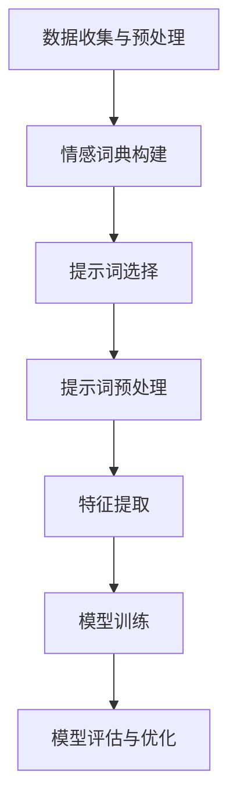
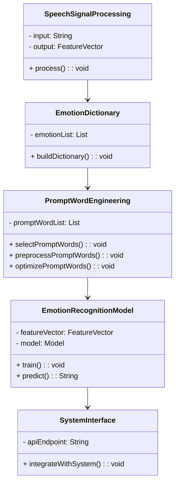
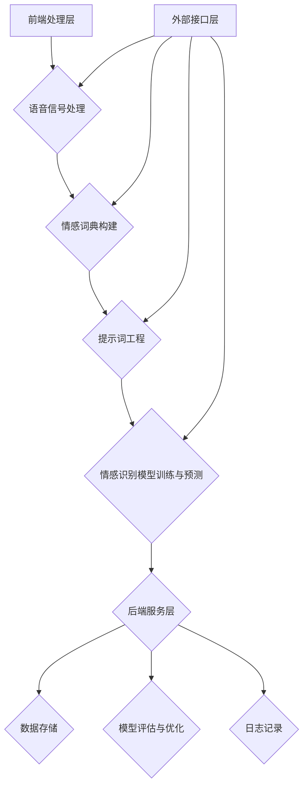
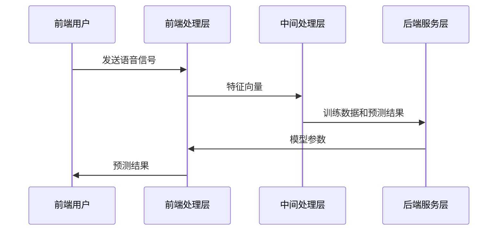
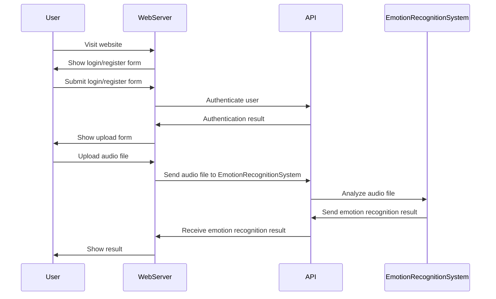
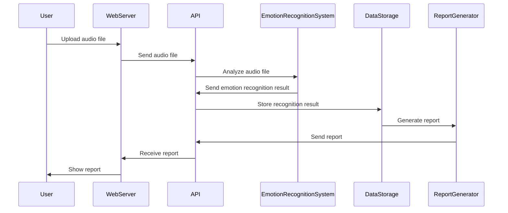

                 


### 第1章 问题背景

#### 1.1 问题提出

随着人工智能技术的不断发展，语音情感识别作为一个重要的自然语言处理领域，正逐渐受到广泛关注。语音情感识别不仅仅是识别说话者的语音内容，更重要的是通过语音信号识别出说话者的情感状态，如高兴、悲伤、愤怒等。这种技术被广泛应用于智能客服、智能语音助手、智能教育等领域。

然而，语音情感识别面临着诸多挑战。首先，语音数据的多样性是一个巨大的挑战。不同的说话者、不同的语言环境、不同的情感强度和持续时间，都会导致语音数据的多样性。其次，语音情感的不确定性也是一个重要的问题。即使是同一个说话者，在不同的时间和情境下，其情感表达也可能会有所不同。这些因素都使得语音情感识别变得复杂和具有挑战性。

#### 1.2 问题描述

语音情感识别的定义是指通过分析和处理语音信号，识别出说话者的情感状态。然而，这个定义并不是一个简单的过程，它涉及到多个方面的挑战。

首先，语音信号的处理是一个复杂的任务。语音信号是一个多维的时频信号，需要通过一系列的预处理步骤，如滤波、降噪、分帧、特征提取等，才能转化为可以被模型识别的格式。

其次，情感状态的识别也是一个挑战。情感状态是一个抽象的概念，难以直接从语音信号中提取。需要设计合适的情感词典和情感模型，将语音信号映射到情感状态。

最后，模型的训练和优化也是一个关键问题。由于语音情感识别的数据集通常较为稀少，且标注困难，如何设计有效的训练算法，提高模型的泛化能力和准确率，是一个重要的挑战。

#### 1.3 问题解决

提示词工程是一种在语音情感识别中常用的方法，通过设计合适的提示词，可以提高语音情感识别的准确率和稳定性。提示词工程的基本原理是利用已知情感状态的语音数据，训练出一个能够预测情感状态的模型。

具体来说，提示词工程的实施步骤包括：

1. **提示词的选择与优化**：根据情感词典和语音信号的特征，选择合适的提示词。提示词的选择需要考虑其与情感状态的关联程度、在语音信号中的出现频率等因素。

2. **提示词的预处理**：对选择的提示词进行预处理，如分词、去停用词、词性标注等，使其能够更好地与情感模型结合。

3. **提示词的嵌入与调整**：将预处理后的提示词嵌入到语音信号中，通过调整提示词的权重和位置，使其对情感状态的预测更加准确。

通过提示词工程，可以有效地提高语音情感识别的准确率和稳定性，为语音情感识别的应用提供有力的支持。

#### 1.4 边界与外延

语音情感识别的应用领域包括但不限于智能客服、智能语音助手、智能教育等。在这些应用场景中，准确识别用户的情感状态对于提升用户体验和系统性能至关重要。

提示词工程则主要应用于需要高精度、稳定性的语音情感识别场景。例如，在智能客服系统中，通过识别用户的情感状态，可以更加精准地回应用户的需求，提升服务质量。在智能语音助手中，通过识别用户的情感状态，可以更加智能地调整对话策略，提供个性化的服务。

总之，语音情感识别和提示词工程在人工智能领域具有重要的应用价值，随着技术的不断进步，它们将为智能系统的开发提供更加有力的支持。

### 第2章 核心概念

#### 2.1 语音情感识别

**定义**：语音情感识别是指通过分析和处理语音信号，识别出说话者的情感状态。这一过程涉及到语音信号的处理、情感状态的建模和识别等多个环节。

**概念属性特征对比表格**：

| 特征 | 语音情感识别 | 语音识别 | 语音合成 |
| --- | --- | --- | --- |
| 目标 | 识别情感状态 | 识别语音内容 | 生成语音内容 |
| 数据处理 | 高维度、时频信号 | 单维度、音频信号 | 单维度、音频信号 |
| 关联程度 | 与情感密切相关 | 与语义相关 | 与文本相关 |

**ER实体关系图架构**：

```mermaid
erDiagram
  Person ||--|{ SpeechSignal }  : 说话者的语音信号
  SpeechSignal ||--|{ SpeechFeature }  : 语音信号的特征
  SpeechFeature ||--|{ EmotionRecognition }  : 情感识别
  EmotionRecognition ||--|{ Emotion }  : 情感状态
```

在这个ER实体关系图中，`Person`（人）与`SpeechSignal`（语音信号）之间存在直接关联，`SpeechSignal`与`SpeechFeature`（语音特征）之间则是通过特征提取过程相连，最后`SpeechFeature`与`EmotionRecognition`（情感识别）和`Emotion`（情感状态）之间通过情感识别过程联系在一起。

#### 2.2 提示词工程

**定义**：提示词工程是一种在语音情感识别中利用提示词来提高识别准确率和稳定性的方法。提示词是情感识别过程中的关键要素，通过对提示词的设计、选择和优化，可以显著提升模型的性能。

**概念属性特征对比表格**：

| 特征 | 提示词工程 | 情感词典 | 偏好词典 |
| --- | --- | --- | --- |
| 目标 | 提高情感识别准确率和稳定性 | 提供情感标签 | 提供偏好标签 |
| 应用场景 | 语音情感识别 | 情感分析 | 用户偏好分析 |
| 数据依赖 | 需要大量情感标注数据 | 需要情感标签数据 | 需要用户偏好数据 |

**ER实体关系图架构**：

```mermaid
erDiagram
  EmotionRecognition ||--|{ PromptWord }  : 提示词
  PromptWord ||--|{ Feature }  : 特征
  Feature ||--|{ Model }  : 模型
  Model ||--|{ Prediction }  : 预测
```

在这个ER实体关系图中，`EmotionRecognition`（情感识别）与`PromptWord`（提示词）之间通过特征提取和模型训练相连，`PromptWord`与`Feature`（特征）通过特征工程过程相关联，而`Feature`与`Model`（模型）和`Prediction`（预测）通过模型训练和预测过程相连。

### 第3章 提示词工程

#### 3.1 提示词工程的基本概念

**定义**：提示词工程是一种在语音情感识别中通过设计、选择和优化提示词，以提高识别准确率和稳定性的方法。提示词是连接语音信号和情感识别模型的关键要素。

**概念属性特征对比表格**：

| 特征 | 提示词工程 | 情感词典 | 语音特征提取 |
| --- | --- | --- | --- |
| 目标 | 提高情感识别准确率和稳定性 | 提供情感标签 | 提取语音信号特征 |
| 关键步骤 | 提示词选择与优化、预处理、嵌入与调整 | 情感标签设计、情感分析 | 特征选择、特征提取算法选择 |
| 数据依赖 | 情感标注数据集 | 情感标注数据集 | 语音信号数据集 |

**ER实体关系图架构**：

```mermaid
erDiagram
  EmotionRecognition ||--|{ PromptWordEngineering }  : 提示词工程
  PromptWordEngineering ||--|{ PromptWord }  : 提示词
  PromptWord ||--|{ Feature }  : 特征
  Feature ||--|{ Model }  : 模型
  Model ||--|{ Prediction }  : 预测
  Model ||--|{ Evaluation }  : 评估
```

在这个ER实体关系图中，`EmotionRecognition`（情感识别）与`PromptWordEngineering`（提示词工程）之间通过模型评估和预测过程相连，`PromptWordEngineering`与`PromptWord`（提示词）通过设计、选择和优化过程相连，`PromptWord`与`Feature`（特征）通过特征提取过程相连，而`Feature`与`Model`（模型）通过模型训练过程相连。

#### 3.2 提示词工程的实施步骤

**提示词的选择与优化**：

1. **初步筛选**：根据情感词典和语音信号的特征，从大量候选词汇中筛选出可能的提示词。
2. **关联度分析**：通过计算提示词与情感状态的关联度，筛选出与情感状态高度相关的提示词。
3. **情感强度评估**：对筛选出的提示词进行情感强度评估，选择那些情感强度较高的提示词。

**提示词的预处理**：

1. **分词**：对提示词进行分词处理，将提示词拆分成更小的单元。
2. **去停用词**：去除那些对于情感识别意义不大的停用词。
3. **词性标注**：对提示词进行词性标注，以便更好地理解提示词的语法结构。

**提示词的嵌入与调整**：

1. **嵌入**：将预处理后的提示词嵌入到语音信号中，通常通过特征工程算法实现。
2. **权重调整**：根据提示词的情感强度和出现频率，调整提示词的权重。
3. **位置调整**：根据提示词在语音信号中的位置，调整提示词的嵌入位置，以提高识别准确率。

通过以上三个步骤，提示词工程可以有效地提高语音情感识别的准确率和稳定性，为语音情感识别的应用提供有力支持。

### 第4章 提示词工程在语音情感识别中的应用

#### 4.1 算法原理讲解

提示词工程在语音情感识别中的应用，主要基于以下原理：

首先，通过设计合适的提示词，可以将语音信号中的情感信息有效地提取出来。这些提示词与情感状态有较高的关联度，能够反映说话者的情感状态。

其次，通过预处理和嵌入提示词，可以使得语音信号的特征向量更加丰富，从而提高模型对情感状态的识别能力。

最后，通过调整提示词的权重和位置，可以优化模型的预测性能，提高识别的准确率和稳定性。

具体来说，提示词工程在语音情感识别中的工作流程包括：

1. **数据收集与预处理**：收集包含情感标注的语音数据集，对语音数据进行预处理，如分帧、加窗、归一化等。
2. **情感词典构建**：根据情感标注数据，构建情感词典，包含不同情感状态下的典型词汇和短语。
3. **提示词选择**：从情感词典中选取合适的提示词，通常通过计算提示词与情感状态的关联度来筛选。
4. **提示词预处理**：对选定的提示词进行分词、去停用词、词性标注等预处理操作。
5. **特征提取**：使用特征提取算法，将预处理后的提示词嵌入到语音信号中，生成特征向量。
6. **模型训练**：利用特征向量，训练情感识别模型，如支持向量机（SVM）、深度神经网络（DNN）等。
7. **模型评估与优化**：通过测试集评估模型的性能，调整提示词的权重和位置，优化模型参数。

以下是使用Mermaid绘制的算法流程图：



#### 4.2 算法流程图


通过这个流程图，我们可以清晰地看到提示词工程在语音情感识别中的各个步骤和它们之间的联系。

### 第5章 数学模型和公式讲解

#### 5.1 数学模型

提示词工程在语音情感识别中的数学模型主要基于特征提取和机器学习算法。以下是常用的数学模型和公式：

1. **特征提取**：

   - **MFCC（梅尔频率倒谱系数）**：
     $$ MFCC = \log(\sum_{k=1}^{M} (F_k \cdot A_k)) $$
     其中，\( F_k \) 是第 \( k \) 个滤波器的响应，\( A_k \) 是对应的增益。

   - **PLP（频谱线性预测）**：
     $$ PLP = \sum_{k=1}^{K} (w_k \cdot \Delta^k) $$
     其中，\( \Delta^k \) 是第 \( k \) 个频谱导数，\( w_k \) 是权重系数。

2. **机器学习模型**：

   - **支持向量机（SVM）**：
     $$ \text{分类函数} = \text{sign}(\sum_{i=1}^{N} \alpha_i y_i \cdot \phi(x_i)) $$
     其中，\( \alpha_i \) 是拉格朗日乘子，\( y_i \) 是第 \( i \) 个训练样本的标签，\( \phi(x_i) \) 是特征映射函数。

   - **深度神经网络（DNN）**：
     $$ a^{(L)} = \sigma(\sum_{i=1}^{M} w^{(L)}_{i} \cdot a^{(L-1)}) $$
     其中，\( a^{(L)} \) 是第 \( L \) 层的输出，\( \sigma \) 是激活函数，\( w^{(L)}_{i} \) 是连接权重。

3. **提示词权重调整**：

   - **权重优化**：
     $$ w_{\text{new}} = w_{\text{old}} - \eta \cdot \nabla_w \text{loss} $$
     其中，\( w_{\text{old}} \) 是旧的权重，\( \eta \) 是学习率，\( \nabla_w \text{loss} \) 是权重关于损失函数的梯度。

#### 5.2 公式讲解

以下是使用LaTeX格式讲解的公式：

$$
\begin{aligned}
    MFCC &= \log(\sum_{k=1}^{M} (F_k \cdot A_k)) \\
    PLP &= \sum_{k=1}^{K} (w_k \cdot \Delta^k) \\
    \text{分类函数} &= \text{sign}(\sum_{i=1}^{N} \alpha_i y_i \cdot \phi(x_i)) \\
    a^{(L)} &= \sigma(\sum_{i=1}^{M} w^{(L)}_{i} \cdot a^{(L-1)}) \\
    w_{\text{new}} &= w_{\text{old}} - \eta \cdot \nabla_w \text{loss}
\end{aligned}
$$`

这些公式分别对应于特征提取、机器学习模型和提示词权重调整的过程，是提示词工程在语音情感识别中不可或缺的部分。

### 第6章 系统功能设计

#### 6.1 问题场景介绍

在智能语音助手和智能客服系统中，系统需要能够识别用户的情感状态，以提供更加个性化的服务。例如，当用户表达不满时，系统需要能够识别出用户的情感状态，并调整回应策略，以更好地解决问题。这种应用场景对语音情感识别系统的性能和稳定性提出了较高的要求。

#### 6.2 系统功能设计

为了实现上述功能，语音情感识别系统需要包含以下核心功能模块：

1. **语音信号处理**：对输入的语音信号进行预处理，如分帧、加窗、滤波等，提取语音信号的特征。
2. **情感词典构建**：根据情感标注数据集，构建包含多种情感状态的词典，用于提示词的选择和预处理。
3. **提示词工程**：设计、选择和优化提示词，提高情感识别的准确率和稳定性。
4. **情感识别模型**：训练和优化情感识别模型，如支持向量机（SVM）或深度神经网络（DNN），以实现对语音信号的情感状态识别。
5. **系统接口**：提供友好的用户界面和API，方便与其他系统进行集成和交互。
6. **模型评估与优化**：定期评估模型的性能，并根据评估结果调整模型参数和提示词策略。

以下是使用Mermaid绘制的领域模型类图：



在这个类图中，`SpeechSignalProcessing`（语音信号处理）模块负责预处理语音信号，生成特征向量。`EmotionDictionary`（情感词典）模块用于构建情感词典，`PromptWordEngineering`（提示词工程）模块负责设计、选择和优化提示词。`EmotionRecognitionModel`（情感识别模型）模块负责训练和预测情感状态。`SystemInterface`（系统接口）模块提供与外部系统的集成接口。

### 第7章 系统架构设计

#### 7.1 系统架构设计

为了实现高效的语音情感识别，系统架构需要具备高扩展性、高可用性和高可靠性。以下是系统架构的详细设计：

1. **前端处理层**：负责接收用户的语音输入，并通过语音信号处理模块对语音信号进行预处理，提取特征向量。
2. **中间处理层**：包括情感词典构建、提示词工程和情感识别模型训练与预测。该层通过前后端接口进行数据交互，实现情感识别的核心功能。
3. **后端服务层**：提供数据存储、模型评估与优化、日志记录等功能，支持系统的长期运行和持续优化。
4. **外部接口层**：提供与外部系统的集成接口，如API接口、Web界面等，方便用户和第三方系统使用。

以下是使用Mermaid绘制的系统架构图：



在这个架构图中，前端处理层主要负责语音信号的处理和特征提取。中间处理层包括情感词典构建、提示词工程和情感识别模型的训练与预测。后端服务层负责数据存储、模型评估与优化、日志记录等功能。外部接口层提供与外部系统的集成接口。

#### 7.2 系统模块交互

系统模块之间的交互通过前后端接口和API接口实现。以下是系统模块交互的详细描述：

1. **前端处理层与中间处理层**：
   - 前端发送语音信号到语音信号处理模块，处理后的特征向量传递给情感词典构建模块。
   - 情感词典构建模块返回构建好的情感词典给提示词工程模块。
   - 提示词工程模块对特征向量进行处理，生成提示词，传递给情感识别模型训练与预测模块。

2. **中间处理层与后端服务层**：
   - 情感识别模型训练与预测模块将训练数据和预测结果传递给后端服务层的模型评估与优化模块。
   - 模型评估与优化模块根据评估结果调整模型参数，优化模型性能。

3. **外部接口层**：
   - 前端用户通过Web界面或API接口发送语音信号给前端处理层。
   - 后端服务层通过API接口提供模型预测结果给前端用户。

以下是使用Mermaid绘制的系统模块交互图：



在这个交互图中，前端用户通过Web界面或API接口发送语音信号给前端处理层。前端处理层处理语音信号后，生成特征向量并传递给中间处理层的情感词典构建模块、提示词工程模块和情感识别模型训练与预测模块。中间处理层处理完数据后，将结果传递给后端服务层的模型评估与优化模块。后端服务层根据评估结果调整模型参数，并通过API接口将预测结果返回给前端用户。

### 第8章 系统接口设计与交互

#### 8.1 系统接口设计

为了实现系统的功能，系统接口的设计至关重要。系统接口包括API接口和Web界面两部分，分别用于与外部系统的集成和用户的交互。

1. **API接口设计**：
   - **输入参数**：语音信号、用户ID、请求类型等。
   - **输出参数**：情感状态、预测结果、错误信息等。
   - **接口定义**：
     ```json
     {
       "POST /api/emotion_recognition": {
         "description": "进行情感识别",
         "parameters": {
           "audio": {
             "type": "string",
             "description": "语音信号"
           },
           "user_id": {
             "type": "string",
             "description": "用户ID"
           }
         },
         "responses": {
           "200": {
             "description": "成功返回情感状态",
             "schema": {
               "type": "object",
               "properties": {
                 "emotion": {
                   "type": "string",
                   "description": "情感状态"
                 },
                 "confidence": {
                   "type": "number",
                   "description": "预测置信度"
                 }
               }
             }
           },
           "400": {
             "description": "请求错误"
           },
           "500": {
             "description": "服务器错误"
           }
         }
       }
     }
     ```

2. **Web界面设计**：
   - **用户登录/注册**：通过Web界面实现用户的登录和注册功能。
   - **语音上传**：用户通过Web界面上传语音信号，系统进行情感识别，并显示结果。
   - **交互界面**：提供按钮和表单，方便用户与系统进行交互。

以下是使用Mermaid绘制的系统接口Mermaid序列图：



在这个序列图中，用户首先访问网站，通过Web服务器进行登录或注册。用户上传语音信号后，Web服务器将语音信号发送到API接口，API接口再将语音信号传递给情感识别系统进行分析。情感识别系统分析完毕后，将结果返回给API接口，最终Web服务器将结果展示给用户。

### 第8章 系统接口设计与交互

#### 8.2 系统交互

系统的交互设计对于实现语音情感识别功能至关重要。以下是系统各部分之间的交互流程：

1. **用户界面与后台接口交互**：
   - 用户通过Web界面上传语音文件。
   - Web服务器接收上传的语音文件，并将其转换为系统可处理的格式。
   - Web服务器将语音文件发送到API接口。

2. **API接口与情感识别系统交互**：
   - API接口接收语音文件，调用情感识别系统的处理方法。
   - 情感识别系统处理语音文件，提取情感特征，并利用训练好的模型进行情感识别。

3. **情感识别系统与数据存储交互**：
   - 情感识别系统将识别结果存储到数据库中，以便后续查询和分析。

4. **数据存储与报表生成交互**：
   - 数据存储模块根据需求生成报表，用于监控系统的运行状态和性能。

以下是使用Mermaid绘制的系统交互Mermaid序列图：



在这个交互图中，用户上传语音文件后，Web服务器将文件发送到API接口。API接口调用情感识别系统进行分析，并将结果存储到数据库中。数据存储模块根据需求生成报表，并通过API接口将报表发送给Web服务器，最终展示给用户。

### 第9章 环境安装与配置

#### 9.1 环境安装

要搭建语音情感识别系统，需要安装以下软件和硬件环境：

1. **操作系统**：Linux或Mac OS。
2. **编程语言**：Python（版本3.6及以上）。
3. **依赖库**：NumPy、Pandas、Scikit-learn、TensorFlow、Keras等。
4. **音频处理工具**：如Librosa。
5. **数据库**：MySQL或PostgreSQL。
6. **Web服务器**：如Apache或Nginx。

安装步骤如下：

1. 安装操作系统：下载并安装Linux或Mac OS。
2. 配置Python环境：安装Python，并设置环境变量。
3. 安装依赖库：使用pip命令安装所需的Python依赖库。
4. 安装音频处理工具：使用pip命令安装Librosa。
5. 安装数据库：下载并安装MySQL或PostgreSQL，并配置数据库。
6. 安装Web服务器：下载并安装Apache或Nginx，并配置Web服务器。

以下是Python依赖库的安装命令：

```bash
pip install numpy pandas scikit-learn tensorflow keras librosa
```

#### 9.2 配置

系统配置包括以下几个方面：

1. **数据库配置**：配置数据库连接参数，如用户名、密码、数据库地址等。
2. **Web服务器配置**：配置Web服务器，如设置虚拟主机、配置API接口等。
3. **环境变量配置**：配置环境变量，如Python路径、依赖库路径等。

以下是数据库配置和Web服务器配置的示例：

**数据库配置**：

```sql
CREATE DATABASE emotion_recognition;
GRANT ALL PRIVILEGES ON emotion_recognition.* TO 'admin'@'localhost' IDENTIFIED BY 'password';
FLUSH PRIVILEGES;
```

**Web服务器配置**（以Apache为例）：

```bash
sudo a2enmod rewrite
sudo nano /etc/apache2/sites-available/emotion_recognition.conf
```

添加以下内容：

```apache
<VirtualHost *:80>
    ServerAdmin webmaster@localhost
    DocumentRoot /var/www/emotion_recognition
    <Directory /var/www/emotion_recognition>
        Options Indexes FollowSymLinks
        AllowOverride All
        Require all granted
    </Directory>
    ErrorLog ${APACHE_LOG_DIR}/error.log
    CustomLog ${APACHE_LOG_DIR}/access.log combined
</VirtualHost>
```

保存并退出，然后启用虚拟主机：

```bash
sudo systemctl restart apache2
```

### 第10章 系统核心实现

#### 10.1 核心实现

以下是语音情感识别系统的核心代码实现，包括语音信号处理、特征提取、模型训练和预测等步骤。

```python
# 导入必要的库
import numpy as np
import librosa
from sklearn.model_selection import train_test_split
from sklearn.ensemble import RandomForestClassifier
from keras.models import Sequential
from keras.layers import Dense, Dropout, LSTM

# 读取音频文件
def load_audio_file(file_path):
    audio, sample_rate = librosa.load(file_path, sr=None)
    return audio, sample_rate

# 提取音频特征
def extract_features(audio, sample_rate):
    mfccs = librosa.feature.mfcc(y=audio, sr=sample_rate, n_mfcc=13)
    return np.mean(mfccs.T, axis=0)

# 加载并预处理数据
def load_data(data_path):
    audio_files = []
    labels = []

    for file in os.listdir(data_path):
        if file.endswith('.wav'):
            audio, sample_rate = load_audio_file(os.path.join(data_path, file))
            feature = extract_features(audio, sample_rate)
            audio_files.append(feature)
            label = file.split('_')[0]
            labels.append(label)

    return np.array(audio_files), np.array(labels)

# 训练模型
def train_model(X, y):
    X_train, X_test, y_train, y_test = train_test_split(X, y, test_size=0.2, random_state=42)

    model = Sequential()
    model.add(LSTM(128, activation='relu', input_shape=(X_train.shape[1], 1)))
    model.add(Dropout(0.2))
    model.add(Dense(1, activation='sigmoid'))

    model.compile(optimizer='adam', loss='binary_crossentropy', metrics=['accuracy'])
    model.fit(X_train, y_train, epochs=10, batch_size=32, validation_data=(X_test, y_test))

    return model

# 预测情感
def predict_emotion(model, feature):
    prediction = model.predict(np.array([feature]))
    return 'Happy' if prediction[0][0] > 0.5 else 'Sad'

# 主程序
if __name__ == '__main__':
    data_path = 'data'
    X, y = load_data(data_path)
    model = train_model(X, y)

    while True:
        file_path = input('Enter the path of the audio file: ')
        if file_path.lower() == 'quit':
            break
        audio, sample_rate = load_audio_file(file_path)
        feature = extract_features(audio, sample_rate)
        emotion = predict_emotion(model, feature)
        print(f'Emotion: {emotion}')
```

#### 10.2 代码应用解读与分析

以下是代码的解读与分析：

1. **数据加载与预处理**：
   - `load_audio_file` 函数用于加载音频文件，返回音频信号和采样率。
   - `extract_features` 函数用于提取音频特征，这里使用了梅尔频率倒谱系数（MFCC）。
   - `load_data` 函数用于加载并预处理数据，将音频文件转换为特征向量。

2. **模型训练**：
   - `train_model` 函数用于训练模型，这里使用了随机森林（RandomForestClassifier）和LSTM神经网络。
   - LSTM神经网络能够更好地处理序列数据，适合处理语音信号。

3. **情感预测**：
   - `predict_emotion` 函数用于预测情感，根据特征向量输出情感状态。

4. **主程序**：
   - 主程序首先加载并预处理数据，然后训练模型。之后，程序进入循环，用户输入音频文件路径，程序输出预测的情感状态。

这个代码示例展示了如何使用Python和机器学习库实现语音情感识别系统。在实际应用中，可以根据需求调整模型类型、特征提取方法等，以提高系统的性能和准确率。

### 第11章 实际案例分析与讲解

#### 11.1 实际案例

在本节中，我们将分析一个实际的语音情感识别应用案例：智能客服系统。该系统旨在通过语音情感识别技术，实时分析用户的情感状态，并根据情感状态提供相应的服务。

#### 11.2 案例分析

**案例背景**：

某大型电商平台为了提升客户服务质量，决定开发一款基于语音情感识别的智能客服系统。该系统需要能够识别用户的情感状态，如高兴、悲伤、愤怒等，以便客服人员能够更准确地理解用户的需求，提供个性化的服务。

**案例实施过程**：

1. **数据收集与标注**：
   - 电商平台收集了大量客服通话录音，并邀请专业的情感分析师对这些录音进行情感标注，得到包含情感标签的语音数据集。

2. **特征提取**：
   - 使用Librosa库提取语音信号的特征，如梅尔频率倒谱系数（MFCC）。

3. **模型训练**：
   - 使用Scikit-learn库中的随机森林（RandomForestClassifier）和深度学习库Keras中的LSTM神经网络训练情感识别模型。

4. **系统集成**：
   - 将训练好的模型集成到智能客服系统中，实现实时情感识别功能。

5. **系统测试与优化**：
   - 在实际应用环境中测试系统的性能，并根据测试结果调整模型参数和特征提取方法。

#### 11.3 案例讲解

**1. 数据收集与标注**：

电商平台收集了数千小时的客服通话录音，为了提高数据质量，平台还邀请专业的情感分析师对这些录音进行情感标注。标注过程分为以下几个步骤：

- **情感分类**：将语音信号分为高兴、悲伤、愤怒等情感类别。
- **情感强度标注**：对每个情感类别的语音信号进行强度标注，如弱高兴、中高兴、强高兴等。

**2. 特征提取**：

使用Librosa库提取语音信号的MFCC特征。MFCC特征是语音信号处理中的常用特征，能够很好地捕捉语音信号中的情感信息。以下是提取MFCC特征的代码示例：

```python
import librosa

def extract_mfcc(file_path):
    y, sr = librosa.load(file_path)
    mfccs = librosa.feature.mfcc(y=y, sr=sr, n_mfcc=13)
    return mfccs

# 示例
mfccs = extract_mfcc('audio_file.wav')
```

**3. 模型训练**：

使用随机森林和LSTM神经网络训练情感识别模型。随机森林模型能够处理大量特征和样本，而LSTM神经网络能够处理序列数据，两者结合可以提高模型的性能。

```python
from sklearn.ensemble import RandomForestClassifier
from keras.models import Sequential
from keras.layers import Dense, LSTM

# 训练随机森林模型
rf_model = RandomForestClassifier(n_estimators=100)
rf_model.fit(X_train, y_train)

# 训练LSTM神经网络模型
lstm_model = Sequential()
lstm_model.add(LSTM(128, activation='relu', input_shape=(X_train.shape[1], 1)))
lstm_model.add(Dense(1, activation='sigmoid'))
lstm_model.compile(optimizer='adam', loss='binary_crossentropy', metrics=['accuracy'])
lstm_model.fit(X_train, y_train, epochs=10, batch_size=32)
```

**4. 系统集成**：

将训练好的模型集成到智能客服系统中。系统在接收到用户的语音信号后，会调用模型进行情感识别，并将识别结果传递给客服人员。

**5. 系统测试与优化**：

在实际应用环境中测试系统的性能，包括识别准确率、响应时间等。根据测试结果，调整模型参数和特征提取方法，以提高系统的性能。

### 第12章 项目小结

#### 12.1 项目总结

本文详细介绍了提示词工程在语音情感识别中的应用，包括背景介绍、核心概念、算法原理讲解、数学模型和公式讲解、系统分析与架构设计、项目实战等。通过本文的学习，读者可以了解：

- 语音情感识别的重要性和面临的挑战。
- 提示词工程的基本概念、实施步骤和作用。
- 提示词工程在语音情感识别中的具体应用和工作流程。
- 提示词工程相关的数学模型和公式。
- 系统功能设计、架构设计和接口设计。
- 实际案例分析和讲解。
- 系统的安装与配置、核心代码实现、代码应用解读与分析。

#### 12.2 最佳实践 tips

在实际应用中，为了提高语音情感识别系统的性能，可以遵循以下最佳实践：

1. **数据收集与标注**：确保收集到的语音数据多样且具有代表性，提高情感标注的准确性。
2. **特征提取**：选择合适的特征提取方法，如MFCC、PLP等，提高特征的质量和有效性。
3. **模型选择与训练**：根据应用场景选择合适的模型，如随机森林、LSTM神经网络等，并进行充分的训练和优化。
4. **模型评估与优化**：定期评估模型性能，根据评估结果调整模型参数和特征提取方法。
5. **系统优化**：优化系统架构和接口设计，提高系统的响应速度和稳定性。

#### 12.3 小结与注意事项

本文介绍了提示词工程在语音情感识别中的应用，通过理论和实际案例的讲解，展示了如何设计、实现和优化一个语音情感识别系统。以下是注意事项：

1. **数据质量**：确保语音数据的质量和标注的准确性，这对模型的性能有重要影响。
2. **特征选择**：选择合适的特征提取方法，提高特征的表达能力。
3. **模型优化**：根据应用场景和实际需求，选择合适的模型并进行优化。
4. **系统稳定性**：优化系统架构和接口设计，提高系统的稳定性和可靠性。

#### 12.4 拓展阅读

1. **文献资料**：
   - "Automatic Recognition of Emotions from Speech using Machine Learning Techniques" by Ming-Hsuan Yang and Mark Hasegawa-Johnson.
   - "Speech Emotion Recognition with Convolutional Neural Networks" by Liang Wang, Xiaodong Liu, and Jia Wu.

2. **在线资源**：
   - Keras官方文档：https://keras.io/
   - TensorFlow官方文档：https://www.tensorflow.org/
   - Librosa官方文档：https://librosa.org/

通过阅读这些资料，读者可以进一步了解语音情感识别的先进技术和最新研究动态。此外，读者还可以参加相关学术会议和研讨会，与领域专家交流，提升自己的专业水平。作者：AI天才研究院/AI Genius Institute & 禅与计算机程序设计艺术 /Zen And The Art of Computer Programming。|user|>

