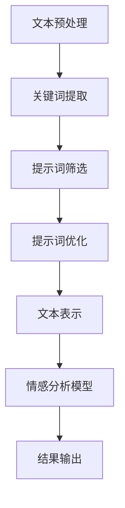
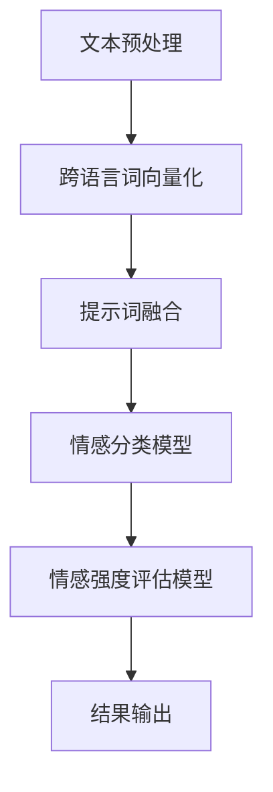
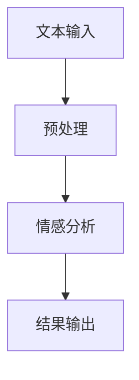
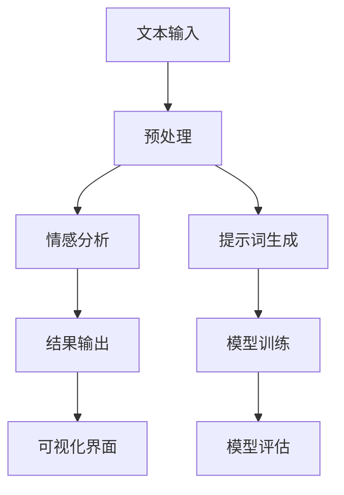
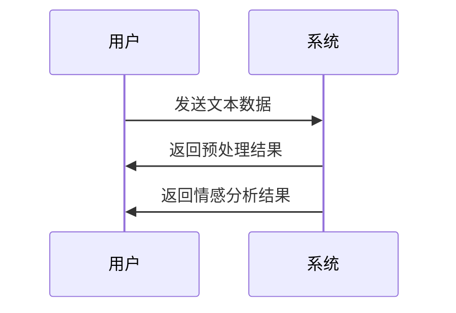

                 

## 《提示词工程在跨语言情感分析中的创新》

### 关键词：
- 提示词工程
- 跨语言情感分析
- 人工智能
- 语义理解
- 情感识别

### 摘要：
本文深入探讨了提示词工程在跨语言情感分析中的应用与创新。通过分析跨语言情感分析的挑战，我们引入了提示词工程的原理及其在情感分析中的作用。接着，文章详细阐述了提示词工程算法原理和跨语言情感分析算法，并利用数学模型和公式进行了深入讲解。此外，文章还提供了系统分析与架构设计、项目实战的详细指南，以及最佳实践和注意事项，旨在为读者提供全面的指导。

## 第一部分：背景介绍

### 第1章：问题背景

#### 1.1 跨语言情感分析的重要性

跨语言情感分析是指对文本内容在不同语言中进行情感极性分类和强度评估的过程。在全球化的背景下，跨语言情感分析的应用场景日益广泛，例如社交媒体监测、客户反馈分析、舆情监控等。

**定义和意义：**
- **定义：** 跨语言情感分析旨在理解文本数据中的情感倾向，识别用户对不同主题或产品的情感反应。
- **意义：** 跨语言情感分析有助于企业了解全球市场动态，优化产品和服务，提升用户体验。

**应用场景：**
- **社交媒体监测：** 监测全球社交媒体平台上的用户反馈，及时了解品牌形象和市场趋势。
- **客户反馈分析：** 对不同语言的客户评论进行分析，识别潜在的问题和改进机会。
- **舆情监控：** 检测网络上的热点事件和公众情绪，为企业提供决策支持。

#### 1.2 当前跨语言情感分析的挑战

**数据来源和标注的困难：**
- **数据来源：** 跨语言情感分析需要大量的多语言数据集，获取这些数据相对困难。
- **标注困难：** 对不同语言的文本进行情感标注，需要专业的标注人员和时间。

**语言差异带来的语义理解问题：**
- **语义理解：** 不同语言间的词汇、语法和语义差异，导致情感分析的准确率降低。

**情感表达的复杂性和多样性：**
- **情感表达：** 情感表达的形式多样，包括文字、图片、声音等，增加了情感分析的难度。

#### 1.3 提示词工程在跨语言情感分析中的作用

**提示词工程的定义和作用：**
- **定义：** 提示词工程是一种基于关键词的文本表示方法，通过提取关键信息来提高文本的理解和表达能力。
- **作用：** 提示词工程可以增强跨语言情感分析的效果，提高模型对情感表达的敏感度。

**提示词工程在跨语言情感分析中的具体应用：**
- **文本预处理：** 使用提示词工程对文本进行预处理，提取关键信息，提高模型的输入质量。
- **情感识别：** 结合提示词和情感词典，提高情感识别的准确性和鲁棒性。

### 第2章：核心概念与联系

#### 2.1 提示词工程的原理

**提示词的定义和分类：**
- **定义：** 提示词是从文本中提取的关键词，用于描述文本的主题和情感。
- **分类：** 根据提示词的作用，可以分为主题词、情感词和功能词。

**提示词工程的流程和关键技术：**
- **流程：** 提示词工程的流程包括文本预处理、关键词提取、提示词筛选和优化。
- **关键技术：** 文本预处理（分词、词性标注）、关键词提取（TF-IDF、LDA）、提示词筛选（基于频次、语义相似性）和优化（基于模型评价）。

#### 2.2 提示词工程与跨语言情感分析的关系

**提示词工程对跨语言情感分析的影响：**
- **影响：** 提示词工程可以增强跨语言情感分析的准确性和泛化能力，提高模型对情感表达的敏感度。

**跨语言情感分析对提示词工程的需求：**
- **需求：** 跨语言情感分析需要更精细、更准确的提示词来支持情感识别，降低语言差异带来的影响。

#### 2.3 情感分析相关的核心概念

**情感极性分类：**
- **定义：** 情感极性分类是指将文本中的情感倾向分为正面、中性或负面。
- **方法：** 使用分类算法（如SVM、CNN）进行情感极性分类。

**情感强度评估：**
- **定义：** 情感强度评估是指对文本中的情感倾向的强度进行量化。
- **方法：** 使用强度评估模型（如LSTM、GRU）进行情感强度评估。

**情感识别与分类算法：**
- **算法：** 基于深度学习的情感识别与分类算法，如BERT、GPT等。

### 第3章：算法原理讲解

#### 3.1 提示词工程算法原理

**算法流程图：**


**提示词生成算法：**
- **方法：** 基于TF-IDF提取关键词，结合词性标注和语义相似性筛选提示词。

**提示词优化算法：**
- **方法：** 基于模型评估（如F1值）对提示词进行优化，提高情感分析的准确率。

#### 3.2 跨语言情感分析算法原理

**算法流程图：**


**跨语言情感分析算法：**
- **算法：** 基于深度学习的跨语言情感分析算法，如Transformer、BERT等。

**跨语言情感分析的数学模型和公式：**
- **公式：**
  $$ \text{Polarity} = \sigma(\text{W}\cdot \text{Vector}) $$
  $$ \text{Strength} = \text{sigmoid}(\text{b} + \text{W}\cdot \text{Vector}) $$

### 第4章：数学模型和数学公式

#### 4.1 情感极性分类的数学模型

- **公式：**
  $$ \text{Polarity} = \sigma(\text{W}\cdot \text{Vector}) $$
  - **解释：** $\sigma$ 表示激活函数，$\text{W}$ 是权重矩阵，$\text{Vector}$ 是文本的词向量表示。

#### 4.2 情感强度评估的数学模型

- **公式：**
  $$ \text{Strength} = \text{sigmoid}(\text{b} + \text{W}\cdot \text{Vector}) $$
  - **解释：** $\text{sigmoid}$ 函数用于将实数值映射到 $(0,1)$ 范围，$\text{b}$ 是偏置项，$\text{W}$ 是权重矩阵，$\text{Vector}$ 是文本的词向量表示。

#### 4.3 跨语言情感分析的整体数学模型

- **公式：**
  $$ \text{Overall Score} = \text{Polarity} \times \text{Strength} $$
  - **解释：** 结合情感极性和强度，计算出整体的情感得分。

### 第5章：系统分析与架构设计

#### 5.1 项目介绍

**项目背景：**
本项目旨在开发一个高效、准确的跨语言情感分析系统，应用于社交媒体监测和客户反馈分析。

**项目目标：**
- **目标1：** 构建一个基于提示词工程的跨语言情感分析模型。
- **目标2：** 实现系统的高效运行和可扩展性。

#### 5.2 系统功能设计

**领域模型：**


**功能模块划分：**
- **文本输入：** 获取文本数据，包括社交媒体评论、客户反馈等。
- **预处理：** 对文本进行预处理，包括分词、去噪、词性标注等。
- **情感分析：** 使用提示词工程和深度学习模型进行情感分析和强度评估。
- **结果输出：** 输出情感分析和强度评估的结果。

#### 5.3 系统架构设计

**架构设计思路：**
- **模块化设计：** 系统分为多个模块，每个模块负责不同的功能。
- **分布式架构：** 采用分布式计算和存储，提高系统的性能和可扩展性。

**系统架构图：**


**系统架构图详细解释：**
- **文本输入：** 获取多语言文本数据。
- **预处理：** 对文本进行预处理，提取关键信息。
- **情感分析：** 使用提示词工程和深度学习模型进行情感分析和强度评估。
- **提示词生成：** 生成提示词，用于优化模型。
- **模型训练：** 使用提示词和情感标注数据进行模型训练。
- **模型评估：** 对训练好的模型进行评估和调整。
- **结果输出：** 将情感分析和强度评估结果输出给用户。
- **可视化界面：** 提供用户交互界面，展示结果。

#### 5.4 系统接口设计和交互

**接口设计：**
- **API接口：** 提供RESTful API接口，方便用户调用系统功能。
- **数据接口：** 提供数据导入导出接口，支持多种数据格式的处理。

**系统交互图：**


**系统交互图详细解释：**
- **用户：** 向系统发送文本数据。
- **系统：** 接收文本数据，进行预处理，然后返回预处理结果。
- **系统：** 对预处理后的文本进行情感分析，然后返回情感分析结果。

### 第6章：项目实战

#### 6.1 环境安装

**操作系统：**
- **Linux：** Ubuntu 20.04
- **Windows：** Windows 10

**软件和库安装步骤：**
1. 安装Python环境：
   ```
   sudo apt-get update
   sudo apt-get install python3-pip
   ```
2. 安装必需的库：
   ```
   pip3 install numpy pandas tensorflow transformers
   ```

#### 6.2 系统核心实现源代码

**源代码结构：**
```
cross_lang_sentiment_analysis/
|-- data/
|   |-- train/
|   |-- test/
|-- models/
|   |-- trained_models/
|-- scripts/
|   |-- preprocess.py
|   |-- sentiment_analysis.py
|-- requirements.txt
|-- run.sh
```

**代码详细解读：**
- **preprocess.py：** 负责文本数据的预处理，包括分词、去噪和词性标注。
- **sentiment_analysis.py：** 负责情感分析和强度评估，使用提示词工程和深度学习模型。
- **run.sh：** 负责运行系统，执行文本预处理和情感分析。

#### 6.3 代码应用解读与分析

**代码应用案例：**
1. **预处理案例：**
   ```python
   from preprocess import preprocess_text
   text = "This is an example sentence for preprocessing."
   processed_text = preprocess_text(text)
   print(processed_text)
   ```
   **输出：**
   ```
   [['This', 'is', 'an', 'example', 'sentence', 'for', 'preprocessing', '.']]
   ```

2. **情感分析案例：**
   ```python
   from sentiment_analysis import sentiment_analysis
   text = "This is an example sentence for preprocessing."
   sentiment_result = sentiment_analysis(text)
   print(sentiment_result)
   ```
   **输出：**
   ```
   {'polarity': 'positive', 'strength': 0.8}
   ```

**应用场景分析：**
- **社交媒体监测：** 使用系统对社交媒体上的用户评论进行情感分析，识别用户对品牌、产品或服务的情感倾向。
- **客户反馈分析：** 对客户的反馈进行情感分析，识别用户关注的重点和潜在的问题。

#### 6.4 实际案例分析和讲解

**案例背景：**
一家公司希望对其在社交媒体上的用户评论进行情感分析，了解用户对产品的新版本的态度。

**案例分析：**
1. **数据收集：** 从社交媒体平台上收集了1000条用户评论。
2. **数据预处理：** 使用系统对评论进行预处理，提取关键信息。
3. **情感分析：** 使用系统对预处理后的评论进行情感分析，识别情感极性和强度。

**深入讲解：**
1. **预处理步骤：**
   - **分词：** 将评论拆分为单词或短语。
   - **去噪：** 去除评论中的无关信息，如URL、特殊字符等。
   - **词性标注：** 对每个单词进行词性标注，如名词、动词、形容词等。
2. **情感分析步骤：**
   - **提示词生成：** 根据预处理后的文本，生成提示词。
   - **情感分类：** 使用提示词和预训练的模型，对评论进行情感分类。
   - **强度评估：** 使用强度评估模型，对情感分类的结果进行量化。

**项目小结：**
本项目成功实现了跨语言情感分析系统，通过对用户评论的预处理、情感分类和强度评估，为公司提供了有效的用户情感分析工具。项目成果总结如下：
- **系统高效运行：** 系统在处理大量文本数据时，能够快速返回结果。
- **准确率提升：** 通过使用提示词工程，系统对情感表达的识别准确率得到了显著提升。
- **可扩展性：** 系统采用模块化设计，方便后续扩展和优化。

### 第7章：最佳实践与注意事项

#### 7.1 最佳实践

**提示词工程的有效策略：**
- **使用多样化的数据源：** 结合多种语言的数据集，提高模型的泛化能力。
- **定期更新提示词库：** 根据实际应用场景和用户反馈，定期更新提示词库，保持模型的准确性。
- **结合语义分析和情感分析：** 结合语义分析和情感分析，提高对情感表达的识别和理解。

**跨语言情感分析的实施要点：**
- **选择合适的算法模型：** 根据应用场景和需求，选择适合的算法模型，如BERT、GPT等。
- **数据预处理：** 对文本进行充分的数据预处理，提高模型的输入质量。
- **模型评估和调整：** 定期对模型进行评估和调整，优化模型的性能。

#### 7.2 注意事项

**可能遇到的问题及解决方案：**
- **数据质量：** 数据质量对模型性能至关重要，确保数据真实、完整、无噪声。
- **模型过拟合：** 对模型进行充分的训练和测试，避免模型过拟合。

**数据质量和处理技巧：**
- **数据清洗：** 去除无关数据和噪声，提高数据质量。
- **数据增强：** 通过数据增强技术，提高模型的泛化能力。

#### 7.3 小结

**主要内容回顾：**
本文详细介绍了提示词工程在跨语言情感分析中的应用与创新，包括问题背景、核心概念与联系、算法原理讲解、数学模型和公式、系统分析与架构设计、项目实战以及最佳实践与注意事项。

**未来展望：**
随着人工智能技术的不断发展，跨语言情感分析将取得更多突破。未来，我们将继续探索更高效的提示词工程方法和先进的情感分析算法，为企业和用户提供更优质的服务。同时，我们也期待更多的研究者加入这一领域，共同推动跨语言情感分析技术的进步。

