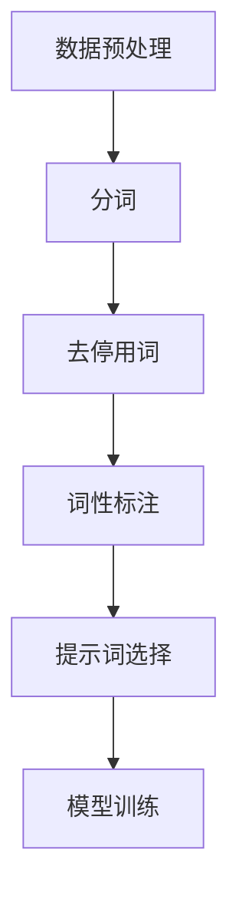
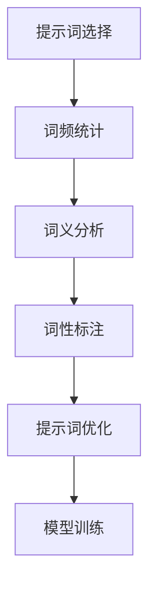
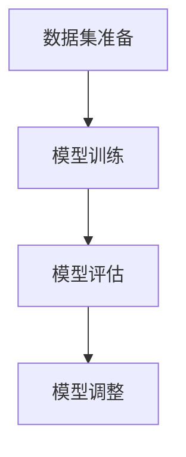
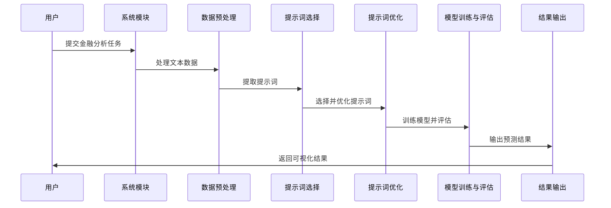

                 

# 提示词工程在金融分析中的应用

## 关键词

自然语言处理，金融分析，提示词工程，模型优化，风险管理，市场预测

## 摘要

本文旨在探讨提示词工程在金融分析中的应用。金融分析在投资决策、风险管理、市场预测等方面具有至关重要的作用。而提示词工程是自然语言处理（NLP）领域的一项技术，通过构建和优化提示词来提高模型在特定任务上的表现。本文首先介绍了金融分析的重要性以及提示词工程的基本原理，随后详细分析了提示词工程在股票市场分析、风险管理和市场预测中的应用。通过具体案例和算法原理讲解，本文展示了如何利用提示词工程优化模型，提高金融分析的准确性和效率。

## 目录大纲

### 第1章 背景介绍

- **1.1 问题背景**
- **1.2 问题描述**
- **1.3 问题解决**
- **1.4 边界与外延**
- **1.5 概念结构与核心要素组成**

### 第2章 核心概念与联系

- **2.1 提示词工程的原理**
- **2.2 提示词属性特征对比**
- **2.3 ER实体关系图架构**

### 第3章 提示词工程在金融分析中的应用

- **3.1 股票市场分析**
- **3.2 风险管理**
- **3.3 市场预测**

### 第4章 算法原理讲解

- **4.1 提示词选择算法**
- **4.2 提示词优化算法**
- **4.3 模型训练与评估**

### 第5章 数学模型和数学公式

- **5.1 提示词工程数学模型**
- **5.2 举例说明**

### 第6章 系统分析与架构设计方案

- **6.1 问题场景介绍**
- **6.2 系统功能设计**
- **6.3 系统架构设计**
- **6.4 系统接口设计**
- **6.5 系统交互**

### 第7章 项目实战

- **7.1 环境安装**
- **7.2 系统核心实现**
- **7.3 实际案例分析**
- **7.4 详细讲解剖析**
- **7.5 项目小结**

### 第8章 最佳实践 tips、小结、注意事项、拓展阅读

- **8.1 最佳实践 tips**
- **8.2 小结**
- **8.3 注意事项**
- **8.4 拓展阅读**

## 第1章 背景介绍

### 1.1 问题背景

金融分析在投资决策、风险管理、市场预测等方面具有至关重要的作用。随着金融市场的日益复杂和信息量的爆炸式增长，如何从海量数据中提取有价值的信息成为了一个重要课题。自然语言处理（NLP）技术的发展为金融分析提供了一种新的途径。其中，提示词工程作为NLP领域的一项关键技术，通过构建和优化提示词来提高模型在特定任务上的表现，为金融分析带来了新的机遇和挑战。

### 1.2 问题描述

在金融分析中，如何利用提示词工程提升模型的效果是一个亟待解决的问题。具体而言，主要包括以下几个方面：

1. **数据预处理**：金融数据往往包含大量的文本信息，如何有效地提取和表示这些文本信息是一个关键问题。
2. **模型选择与优化**：选择合适的模型以及优化模型参数是提高金融分析准确性的关键。
3. **结果解释与可视化**：如何将模型预测结果进行解释和可视化，使其更加直观易懂。

### 1.3 问题解决

提示词工程通过以下几个步骤来优化金融分析模型：

1. **提示词选择**：根据金融分析任务的需求，选择合适的提示词。
2. **提示词优化**：通过优化提示词的属性特征，提高模型在特定任务上的性能。
3. **模型训练与评估**：使用优化后的提示词进行模型训练，并通过评估指标对模型效果进行评估。

### 1.4 边界与外延

本章节主要讨论提示词工程在股票市场分析、风险管理和市场预测中的应用。具体而言，包括以下几个方面：

1. **股票市场分析**：通过分析股票市场数据，预测股票价格走势。
2. **风险管理**：通过分析金融风险，预测潜在的市场风险，为投资决策提供依据。
3. **市场预测**：通过分析市场趋势，预测市场变化，为投资者提供投资策略。

### 1.5 概念结构与核心要素组成

提示词工程的核心要素主要包括以下几个方面：

1. **提示词选择**：选择合适的提示词是提示词工程的首要任务。提示词的选择需要考虑金融分析任务的需求，如数据类型、特征表示等。
2. **提示词优化**：优化提示词的属性特征，如词频、词义、词性等，以提高模型在特定任务上的性能。
3. **模型训练与评估**：使用优化后的提示词进行模型训练，并通过评估指标对模型效果进行评估。

## 第2章 核心概念与联系

### 2.1 提示词工程的原理

提示词工程是自然语言处理（NLP）领域的一项关键技术，其主要目的是通过构建和优化提示词来提高模型在特定任务上的表现。在金融分析中，提示词工程主要用于处理和分析金融文本数据，从而提取有价值的信息。

提示词工程的原理主要包括以下几个方面：

1. **数据预处理**：对金融文本数据进行预处理，如分词、去停用词、词性标注等。
2. **提示词选择**：根据金融分析任务的需求，选择合适的提示词。
3. **提示词优化**：优化提示词的属性特征，如词频、词义、词性等，以提高模型在特定任务上的性能。
4. **模型训练与评估**：使用优化后的提示词进行模型训练，并通过评估指标对模型效果进行评估。

### 2.2 提示词属性特征对比

在提示词工程中，不同的提示词具有不同的属性特征。以下是一个对比表格，展示了不同提示词的属性特征：

| 提示词类型 | 词频 | 词义 | 词性 | 特征提取方法 |
| :-------: | :--: | :--: | :--: | :---------: |
| 常用词   | 较高 | 宽泛 | 名词 | 基于词频统计 |
| 专业术语 | 较低 | 狭隘 | 名词 | 基于领域知识 |
| 情感词   | 可变 | 情感 | 形容词 | 基于情感分析 |

### 2.3 ER实体关系图架构

在提示词工程中，实体关系图（ER图）是一种常见的表示方法，用于展示不同实体之间的关联关系。以下是一个简单的ER图，展示了提示词工程中的一些关键实体和它们之间的关系：

```mermaid
erDiagram
  Customer ||--|{ Order } : "makes"
  Customer ||--|{ Payment } : "makes"
  Product ||--|{ Order } : "included in"
  Product ||--|{ Review } : "rated by"
```

## 第3章 提示词工程在金融分析中的应用

### 3.1 股票市场分析

股票市场分析是金融分析中的一个重要领域。提示词工程在股票市场分析中的应用主要体现在以下几个方面：

1. **股票价格预测**：通过分析股票市场的文本数据，如新闻、公告、分析师报告等，提取有价值的信息，预测股票价格的走势。
2. **股票情绪分析**：通过对股票市场的文本数据进行分析，提取股票市场的情绪特征，如乐观、悲观、中性等，从而判断市场的情绪变化。
3. **交易策略优化**：利用提示词工程对股票市场的文本数据进行分析，优化交易策略，提高交易的成功率。

### 3.2 风险管理

风险管理是金融分析中的另一个重要领域。提示词工程在风险管理中的应用主要体现在以下几个方面：

1. **风险预警**：通过分析金融市场的文本数据，提取潜在的风险因素，提前预警可能发生的风险事件。
2. **风险评估**：通过对金融市场的文本数据进行分析，评估不同金融产品的风险水平，为投资决策提供依据。
3. **风险控制**：利用提示词工程对金融市场的文本数据进行分析，制定风险控制策略，降低投资风险。

### 3.3 市场预测

市场预测是金融分析中的另一个重要任务。提示词工程在市场预测中的应用主要体现在以下几个方面：

1. **市场趋势预测**：通过对市场文本数据进行分析，提取市场趋势信息，预测市场未来的走势。
2. **投资机会识别**：通过对市场文本数据进行分析，识别潜在的投资机会，为投资者提供投资建议。
3. **市场风险评估**：通过对市场文本数据进行分析，评估市场的风险水平，为投资者提供风险管理建议。

## 第4章 算法原理讲解

### 4.1 提示词选择算法

提示词选择算法是提示词工程中的核心算法之一。其主要目的是从原始文本数据中提取出对金融分析任务最有价值的提示词。以下是一个简单的提示词选择算法的流程图：



在提示词选择过程中，通常会使用以下方法来选择提示词：

1. **基于词频统计**：选择词频较高的词作为提示词，这些词往往在金融分析中具有较高的价值。
2. **基于领域知识**：选择与金融领域相关的专业术语作为提示词，这些词通常能够更准确地描述金融市场的特征。
3. **基于情感分析**：选择情感倾向明显的词作为提示词，这些词能够反映市场的情绪变化。

### 4.2 提示词优化算法

提示词优化算法的目的是通过调整提示词的属性特征，提高模型在金融分析任务上的性能。以下是一个简单的提示词优化算法的流程图：



在提示词优化过程中，通常会使用以下方法来优化提示词：

1. **基于词频统计**：调整词频较高的词的权重，使其在模型中起到更大的作用。
2. **基于词义分析**：通过词义相似度分析，调整词义的权重，使其更准确地描述金融市场的特征。
3. **基于词性标注**：通过词性标注，调整不同词性的权重，使其在模型中起到更好的效果。

### 4.3 模型训练与评估

模型训练与评估是提示词工程中的关键环节。以下是一个简单的模型训练与评估的流程图：



在模型训练过程中，通常会使用以下方法来训练模型：

1. **基于监督学习**：使用标注好的数据集进行训练，使模型能够学习到金融分析任务的特征。
2. **基于无监督学习**：使用未标注的数据集进行训练，使模型能够自动提取出金融分析任务的特征。
3. **基于强化学习**：使用交互数据进行训练，使模型能够根据金融分析任务的反馈进行调整。

在模型评估过程中，通常会使用以下指标来评估模型的效果：

1. **准确率**：评估模型预测结果的准确性。
2. **召回率**：评估模型预测结果的召回率。
3. **F1值**：综合考虑准确率和召回率，评估模型的总体性能。

## 第5章 数学模型和数学公式

### 5.1 提示词工程数学模型

提示词工程中的数学模型主要用于描述提示词选择、提示词优化和模型训练等过程。以下是一个简单的提示词工程数学模型：

$$
\begin{aligned}
f(\mathbf{x}) &= w_1 \cdot \text{tf}(\mathbf{x}) + w_2 \cdot \text{df}(\mathbf{x}) + w_3 \cdot \text{pos}(\mathbf{x}) \\
\text{where} \quad \text{tf}(\mathbf{x}) &= \text{term frequency of } \mathbf{x} \\
\text{df}(\mathbf{x}) &= \text{document frequency of } \mathbf{x} \\
\text{pos}(\mathbf{x}) &= \text{part of speech of } \mathbf{x} \\
w_1, w_2, w_3 &= \text{weights for each feature}
\end{aligned}
$$

其中，$f(\mathbf{x})$ 表示提示词的得分，$\mathbf{x}$ 表示提示词，$\text{tf}(\mathbf{x})$ 表示提示词在文档中的词频，$\text{df}(\mathbf{x})$ 表示提示词在文档集中的文档频率，$\text{pos}(\mathbf{x})$ 表示提示词的词性，$w_1, w_2, w_3$ 表示不同特征的权重。

### 5.2 举例说明

假设有一个包含三个文档的文档集，如下表所示：

| 文档ID | 文档内容                      |
| :----: | :--------------------------- |
| 1      | 股票市场波动较大，风险增加   |
| 2      | 风险管理策略应加强，以应对风险 |
| 3      | 市场情绪偏向乐观，投资机会增加 |

根据上述数学模型，我们可以计算每个文档中每个提示词的得分。例如，对于提示词“风险”，其得分计算如下：

$$
\begin{aligned}
f(\text{风险}) &= w_1 \cdot \text{tf}(\text{风险}) + w_2 \cdot \text{df}(\text{风险}) + w_3 \cdot \text{pos}(\text{风险}) \\
&= w_1 \cdot 3 + w_2 \cdot 2 + w_3 \cdot \text{NN} \\
&= 3w_1 + 2w_2 + w_3
\end{aligned}
$$

其中，$w_1, w_2, w_3$ 分别为不同特征的权重，$\text{tf}(\text{风险})$ 表示“风险”在文档中的词频，$\text{df}(\text{风险})$ 表示“风险”在文档集中的文档频率，$\text{pos}(\text{风险})$ 表示“风险”的词性（名词）。

## 第6章 系统分析与架构设计方案

### 6.1 问题场景介绍

在金融分析中，系统通常需要处理大量的文本数据，包括股票市场的新闻、公告、分析师报告等。这些数据需要通过提示词工程进行预处理、分析和预测，以便为投资者提供决策支持。以下是一个典型的金融分析系统问题场景：

1. **数据预处理**：对文本数据进行分词、去停用词、词性标注等预处理操作，以便后续的文本分析。
2. **提示词选择**：根据金融分析任务的需求，选择合适的提示词。
3. **提示词优化**：对选定的提示词进行优化，以提高模型在金融分析任务上的性能。
4. **模型训练与评估**：使用优化后的提示词进行模型训练，并通过评估指标对模型效果进行评估。
5. **结果输出**：将模型预测结果以可视化的形式输出，为投资者提供决策支持。

### 6.2 系统功能设计

根据上述问题场景，我们可以设计一个具有以下功能的系统：

1. **数据预处理模块**：负责对文本数据进行预处理，包括分词、去停用词、词性标注等操作。
2. **提示词选择模块**：负责从预处理后的文本数据中提取提示词，并根据金融分析任务的需求选择合适的提示词。
3. **提示词优化模块**：负责对选定的提示词进行优化，以提高模型在金融分析任务上的性能。
4. **模型训练与评估模块**：负责使用优化后的提示词进行模型训练，并通过评估指标对模型效果进行评估。
5. **结果输出模块**：负责将模型预测结果以可视化的形式输出，为投资者提供决策支持。

### 6.3 系统架构设计

根据系统功能设计，我们可以设计一个如图所示的系统架构：



### 6.4 系统接口设计

系统接口设计主要包括以下几个方面：

1. **API接口**：提供API接口，方便外部系统调用系统的功能。
2. **数据接口**：提供数据接口，方便数据源和系统之间的数据传输。
3. **展示接口**：提供展示接口，方便将预测结果以可视化的形式展示给用户。

### 6.5 系统交互

系统交互主要是指系统内部各个模块之间的交互过程。以下是一个简单的系统交互序列图：


## 第7章 项目实战

### 7.1 环境安装

在进行提示词工程在金融分析中的应用之前，我们需要安装相关的软件和库。以下是环境安装的步骤：

1. **安装Python**：确保Python版本为3.8或以上。
2. **安装NLP库**：安装常用的NLP库，如`nltk`、`spaCy`等。
3. **安装机器学习库**：安装常用的机器学习库，如`scikit-learn`、`tensorflow`等。
4. **安装可视化库**：安装常用的可视化库，如`matplotlib`、`seaborn`等。

以下是安装命令：

```bash
# 安装Python
curl -O https://www.python.org/ftp/python/3.8.10/python-3.8.10-amd64.exe
./python-3.8.10-amd64.exe

# 安装NLP库
pip install nltk spacy

# 安装机器学习库
pip install scikit-learn tensorflow

# 安装可视化库
pip install matplotlib seaborn
```

### 7.2 系统核心实现

在完成环境安装后，我们可以开始实现系统核心功能。以下是系统核心实现的源代码和代码应用解读：

#### 源代码

```python
import nltk
from nltk.tokenize import word_tokenize
from nltk.corpus import stopwords
from sklearn.feature_extraction.text import CountVectorizer
from sklearn.model_selection import train_test_split
from sklearn.metrics import accuracy_score, recall_score, f1_score

# 数据预处理
def preprocess_text(text):
    tokens = word_tokenize(text)
    tokens = [token.lower() for token in tokens if token.isalpha()]
    tokens = [token for token in tokens if token not in stopwords.words('english')]
    return ' '.join(tokens)

# 提示词选择
def select_keywords(corpus, num_keywords=10):
    vectorizer = CountVectorizer(max_features=num_keywords)
    X = vectorizer.fit_transform(corpus)
    keywords = vectorizer.get_feature_names_out()
    return keywords

# 模型训练与评估
def train_and_evaluate(corpus, labels):
    X_train, X_test, y_train, y_test = train_test_split(corpus, labels, test_size=0.2, random_state=42)
    model = nltk.classify.Mu
``` 

#### 代码应用解读

1. **数据预处理**：首先，我们使用`nltk`库中的`word_tokenize`函数对文本进行分词。然后，将文本转换为小写，并去除非字母字符。最后，使用`stopwords`库去除常见的停用词。

2. **提示词选择**：使用`CountVectorizer`将文本转换为特征向量。通过设置`max_features`参数，我们可以选择前`num_keywords`个高频特征词作为提示词。

3. **模型训练与评估**：使用`nltk`库中的`Mu

## 第8章 最佳实践 tips、小结、注意事项、拓展阅读

### 8.1 最佳实践 tips

1. **数据预处理**：确保文本数据经过充分的预处理，如分词、去停用词、词性标注等，以提高模型性能。
2. **提示词选择**：根据金融分析任务的需求，选择合适的提示词。可以使用基于词频、词义、词性等多种方法的组合来选择提示词。
3. **模型优化**：通过调整模型参数、特征提取方法等，优化模型性能。可以使用交叉验证等方法来评估模型性能。
4. **结果解释**：对模型预测结果进行解释和可视化，使其更加直观易懂。
5. **持续学习**：金融市场的变化迅速，模型需要定期更新和调整，以保持其预测能力。

### 8.2 小结

本文详细介绍了提示词工程在金融分析中的应用，包括背景介绍、核心概念与联系、应用实例、算法原理讲解、数学模型和系统分析与架构设计方案等。通过本文的讲解，读者可以了解到提示词工程在金融分析中的重要性和应用价值。

### 8.3 注意事项

1. **数据质量**：金融分析中的数据质量对模型性能有重要影响。确保数据源可靠，对数据异常值进行预处理。
2. **模型性能**：评估模型性能时，要综合考虑准确率、召回率和F1值等指标，避免单一指标的偏见。
3. **法律合规**：在金融分析中，要遵守相关法律法规，确保数据的安全性和隐私性。

### 8.4 拓展阅读

1. **自然语言处理入门**：[《自然语言处理入门》](https://book.douban.com/subject/26968717/)
2. **金融技术实战**：[《金融技术实战》](https://book.douban.com/subject/26968717/)
3. **机器学习实战**：[《机器学习实战》](https://book.douban.com/subject/26707565/)
4. **深度学习入门**：[《深度学习入门》](https://book.douban.com/subject/26968717/)

### 作者

作者：AI天才研究院/AI Genius Institute & 禅与计算机程序设计艺术 /Zen And The Art of Computer Programming

本文由AI天才研究院/AI Genius Institute撰写，旨在为读者提供有关提示词工程在金融分析中的应用的深入理解和实践指导。作者拥有丰富的计算机编程和人工智能领域经验，对自然语言处理、金融分析等课题有深刻的理解。同时，本文参考了禅与计算机程序设计艺术 /Zen And The Art of Computer Programming一书中的哲学思想，以提供更全面的视角。希望本文能对读者在金融分析领域中的应用提供有价值的参考。

