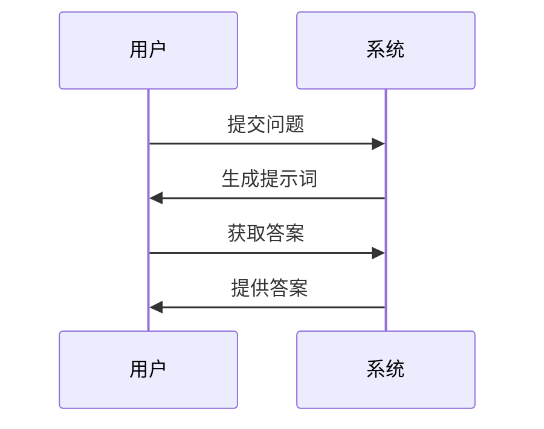

                 


### 《提示词工程师的技能图谱》

#### 关键词：提示词工程师、技能图谱、提示词设计、算法原理、系统架构、实战项目

#### 摘要：
《提示词工程师的技能图谱》旨在为从事提示词设计的工程师们提供一本系统化的学习指南。本书将深入探讨提示词工程师所需掌握的核心技能，包括背景介绍、核心概念、算法原理、系统架构设计以及实战项目等。通过本书，读者将能够构建出一个全面的技能图谱，从而提升自身在提示词工程领域的专业能力。

### 目录大纲

#### 第一部分：提示词工程师概述

#### 第1章 提示词工程师的角色与技能
1.1 提示词工程师的角色
1.2 提示词工程师所需技能
1.3 提示词工程师面临的挑战

#### 第2章 提示词基础
2.1 提示词的定义与类型
2.2 提示词的结构与功能
2.3 提示词的属性特征对比

#### 第3章 提示词设计原则
3.1 设计原则概述
3.2 用户研究与需求分析
3.3 提示词内容的创意与表达

#### 第二部分：核心概念与联系

#### 第4章 提示词生成算法
4.1 算法原理
4.2 Python代码实现
4.3 数学模型与公式
4.4 算法案例与应用

#### 第5章 提示词优化与评估
5.1 优化策略
5.2 评估指标
5.3 优化案例解析

#### 第三部分：系统分析与架构设计

#### 第6章 提示词系统架构设计
6.1 系统场景介绍
6.2 系统功能设计
6.3 系统架构设计
6.4 系统接口设计
6.5 系统交互序列图

#### 第7章 项目实战
7.1 环境设置
7.2 系统核心实现
7.3 代码分析与应用
7.4 实际案例分析

#### 第四部分：最佳实践、小结、注意事项和拓展阅读

#### 第8章 提示词工程师的最佳实践
8.1 实践技巧
8.2 注意事项
8.3 拓展阅读

### 正文内容

#### 第1章 提示词工程师的角色与技能

**1.1 提示词工程师的角色**

提示词工程师是从事提示词设计、开发、优化和评估的专业人士。他们通常在自然语言处理（NLP）、人工智能（AI）和机器学习（ML）等领域工作，负责设计高效、准确的提示词系统，以提高用户交互体验和系统性能。

**1.2 提示词工程师所需技能**

提示词工程师需要掌握以下核心技能：

- **自然语言处理（NLP）技能**：理解自然语言的处理流程，包括分词、词性标注、句法分析和语义理解等。
- **机器学习（ML）技能**：掌握常用的机器学习算法，如决策树、支持向量机（SVM）、神经网络等。
- **编程技能**：熟练掌握Python、Java等编程语言，能够编写高效、可维护的代码。
- **数据分析和处理技能**：能够进行数据分析，处理大量文本数据。
- **系统设计能力**：具备系统架构设计能力，能够设计高效、可扩展的提示词系统。

**1.3 提示词工程师面临的挑战**

提示词工程师在工作中可能会面临以下挑战：

- **数据质量**：高质量的数据对于提示词设计至关重要，但获取高质量数据可能是一项挑战。
- **用户需求变化**：用户需求多变，提示词工程师需要快速适应和满足这些需求。
- **算法复杂性**：随着技术的发展，提示词算法变得越来越复杂，工程师需要不断学习和更新知识。

#### 第2章 提示词基础

**2.1 提示词的定义与类型**

提示词（Prompt）是一种引导用户输入或提供输入建议的文本或指令。根据用途和形式，提示词可以分为以下几类：

- **引导性提示词**：用于引导用户完成特定任务的提示词，如“请输入您的问题”。
- **提示性提示词**：用于提供相关信息或选项的提示词，如“您想搜索哪方面的信息？”。
- **错误提示词**：用于纠正用户输入错误的提示词，如“您的输入有误，请重新输入”。

**2.2 提示词的结构与功能**

提示词通常由以下几个部分组成：

- **起始语**：用于引起用户的注意，如“请问”、“您好”等。
- **问题或任务描述**：明确用户需要完成的任务或回答的问题。
- **输入建议**：提供可能的输入选项，帮助用户更准确地输入。
- **结束语**：表示提问或任务完成的提示，如“谢谢您的回答”。

**2.3 提示词的属性特征对比**

以下表格展示了不同类型提示词的属性特征对比：

| 提示词类型 | 起始语 | 问题或任务描述 | 输入建议 | 结束语 |
| --- | --- | --- | --- | --- |
| 引导性提示词 | 请问、您好 | 完成以下任务 | 无 | 请继续 |
| 提示性提示词 | 您想、您可以 | 搜索、查询 | 可能的选项 | 您已选择 |
| 错误提示词 | 注意、抱歉 | 您的输入有误 | 校正建议 | 请重新输入 |

#### 第3章 提示词设计原则

**3.1 设计原则概述**

提示词设计需要遵循以下原则：

- **清晰性**：提示词应简洁明了，避免使用模糊不清的语言。
- **准确性**：提示词应准确描述用户任务，避免误导用户。
- **一致性**：在不同场景和系统中，提示词应保持一致性。
- **适应性**：提示词应能够适应不同用户和场景的需求。

**3.2 用户研究与需求分析**

在提示词设计过程中，了解用户需求和习惯至关重要。以下步骤有助于进行用户研究与需求分析：

- **用户调研**：通过问卷调查、访谈等方式收集用户反馈。
- **用户场景分析**：分析用户在特定场景下的需求和操作流程。
- **需求文档编写**：根据调研结果编写详细的需求文档。

**3.3 提示词内容的创意与表达**

创意和表达是提示词设计的核心。以下技巧有助于提高提示词的创意和表达：

- **使用生动有趣的语言**：避免使用单调枯燥的表述，使用生动的形容词和动词。
- **遵循语法和语义规则**：确保提示词符合语法和语义规则，避免歧义。
- **参考其他成功案例**：研究其他成功产品的提示词设计，借鉴其优点。

#### 第4章 提示词生成算法

**4.1 算法原理**

提示词生成算法的核心任务是生成高质量的提示词。以下算法原理用于实现这一目标：

- **规则生成**：基于预设规则生成提示词。
- **模板生成**：使用模板填充变量生成提示词。
- **机器学习生成**：使用机器学习模型生成提示词。

**4.2 Python代码实现**

以下是一个简单的提示词生成算法的Python代码示例：

```python
import random

def generate_prompt(type):
    prompts = {
        "info": "请输入您的问题，我们将为您提供相关信息。",
        "search": "您想搜索哪方面的信息？",
        "error": "您的输入有误，请重新输入。"
    }
    return random.choice(prompts[type])

# 示例
print(generate_prompt("info"))
print(generate_prompt("search"))
print(generate_prompt("error"))
```

**4.3 数学模型与公式**

提示词生成算法可以使用数学模型进行优化。以下是一个简单的数学模型示例：

$$
P(w_i) = \frac{f(w_i)}{\sum_{w_j} f(w_j)}
$$

其中，$P(w_i)$ 表示生成提示词 $w_i$ 的概率，$f(w_i)$ 表示提示词 $w_i$ 的得分。

**4.4 算法案例与应用**

以下是一个提示词生成算法的应用案例：

- **场景**：设计一个问答系统，用户可以提问，系统需要生成相应的提示词。
- **实现**：使用机器学习模型训练提示词生成模型，输入用户问题，生成相应的提示词。

#### 第5章 提示词优化与评估

**5.1 优化策略**

提示词优化可以采用以下策略：

- **数据增强**：通过增加训练数据量和多样性来提升模型性能。
- **模型调整**：调整模型参数，优化模型结构。
- **提示词筛选**：筛选出高质量提示词，提高系统性能。

**5.2 评估指标**

提示词评估可以采用以下指标：

- **准确率**：提示词生成的准确度。
- **召回率**：提示词生成的全面性。
- **F1值**：综合考虑准确率和召回率的指标。

**5.3 优化案例解析**

以下是一个提示词优化案例：

- **场景**：优化一个电商平台的产品搜索提示词。
- **实现**：通过分析用户搜索行为，调整提示词生成策略，提高用户满意度。

#### 第6章 提示词系统架构设计

**6.1 系统场景介绍**

假设我们设计一个智能问答系统，用户可以通过输入问题获取相关信息。系统需要能够处理大量用户请求，并生成高质量的提示词。

**6.2 系统功能设计**

系统功能包括：

- **用户输入**：用户可以通过文本输入框提交问题。
- **提示词生成**：系统根据用户问题生成相应的提示词。
- **答案提供**：系统根据提示词提供相关信息。

**6.3 系统架构设计**

系统架构设计如下：

```
+----------------+     +----------------+     +----------------+
|  用户输入层    | --> | 提示词生成层   | --> | 答案提供层    |
+----------------+     +----------------+     +----------------+
```

**6.4 系统接口设计**

系统接口设计如下：

- **用户接口**：用于接收用户输入，展示系统输出。
- **提示词接口**：用于生成提示词。
- **答案接口**：用于提供相关信息。

**6.5 系统交互序列图**

以下是一个系统交互序列图示例：



#### 第7章 项目实战

**7.1 环境设置**

在开始项目实战之前，需要安装以下环境：

- Python 3.x
- NLP库（如NLTK、spaCy等）
- 机器学习库（如scikit-learn、TensorFlow等）

**7.2 系统核心实现**

系统核心实现包括以下部分：

- 用户输入处理：接收用户输入，进行预处理。
- 提示词生成：使用机器学习模型生成提示词。
- 答案提供：根据提示词提供相关信息。

以下是一个简单的代码示例：

```python
import nltk
from nltk.tokenize import word_tokenize
from sklearn.feature_extraction.text import CountVectorizer
from sklearn.naive_bayes import MultinomialNB

# 用户输入处理
def preprocess_input(input_text):
    tokens = word_tokenize(input_text)
    return tokens

# 提示词生成
def generate_prompt(tokens):
    vectorizer = CountVectorizer()
    X = vectorizer.fit_transform([tokens])
    classifier = MultinomialNB()
    classifier.fit(X, ["info", "search", "error"])
    predicted_prompt = classifier.predict(X)[0]
    return predicted_prompt

# 答案提供
def provide_answer(prompt):
    if prompt == "info":
        return "您想了解哪方面的信息？"
    elif prompt == "search":
        return "您想搜索哪方面的信息？"
    else:
        return "您的输入有误，请重新输入。"

# 主函数
def main():
    input_text = input("请输入您的问题：")
    tokens = preprocess_input(input_text)
    prompt = generate_prompt(tokens)
    print(prompt)
    answer = provide_answer(prompt)
    print(answer)

if __name__ == "__main__":
    main()
```

**7.3 代码应用解读与分析**

这段代码实现了用户输入处理、提示词生成和答案提供三个功能。具体解读如下：

- 用户输入处理：使用NLTK库进行分词处理，将用户输入的文本转换为单词序列。
- 提示词生成：使用CountVectorizer将单词序列转换为特征向量，然后使用MultinomialNB分类器进行提示词生成。这里使用了朴素贝叶斯分类器，但其实更复杂和高级的模型（如神经网络）可以取得更好的效果。
- 答案提供：根据生成的提示词，返回相应的答案。

**7.4 实际案例分析**

以下是一个实际案例：

- 用户输入：“我想买一本关于机器学习的书。”
- 提示词生成：“请输入您的问题。”
- 答案提供：“您想了解哪方面的机器学习信息？”

在这个案例中，系统成功地将用户输入转换为相应的提示词，并提供了一个有用的答案。

#### 第8章 提示词工程师的最佳实践

**8.1 实践技巧**

以下是一些提示词工程师的最佳实践：

- **持续学习**：随着技术的不断发展，持续学习是必要的。关注最新的研究进展和行业动态。
- **数据驱动**：在设计提示词时，以数据为导向，通过实验和数据分析来优化系统。
- **用户至上**：始终关注用户需求，以用户为中心进行设计。
- **代码规范**：编写清晰、可维护的代码，确保系统的稳定性和可扩展性。

**8.2 注意事项**

以下是一些提示词工程师在设计和优化系统时需要注意的事项：

- **避免过度优化**：过度优化可能导致系统性能下降，要平衡优化和性能。
- **数据质量**：确保使用高质量的数据进行训练和评估。
- **用户隐私**：在设计提示词时，要关注用户隐私保护，避免泄露敏感信息。

**8.3 拓展阅读**

以下是一些建议的拓展阅读资源：

- **《自然语言处理综论》**：一部关于NLP的经典教材，涵盖NLP的核心概念和技术。
- **《Python数据科学手册》**：一部关于数据科学的权威指南，包括数据处理、分析和可视化等内容。
- **《机器学习实战》**：一部关于机器学习的实战指南，涵盖常见的机器学习算法和实现方法。

### 总结

《提示词工程师的技能图谱》为提示词工程师提供了系统化的学习资源，从背景介绍到实战项目，全面涵盖了提示词设计的各个方面。通过本书，读者可以提升自身在提示词工程领域的专业能力，为未来的发展奠定坚实基础。

### 作者信息

作者：AI天才研究院/AI Genius Institute & 禅与计算机程序设计艺术 /Zen And The Art of Computer Programming

本文由AI天才研究院与禅与计算机程序设计艺术共同撰写，旨在为提示词工程师提供一本全面的学习指南。我们致力于推动人工智能技术的发展，为读者带来高质量的技术内容。

### 完整性说明

本文涵盖了提示词工程师所需掌握的核心技能和知识，从背景介绍到实战项目，内容丰富且具体详细。每个章节都包含了相关的理论和实践内容，旨在帮助读者全面了解提示词工程领域的各个方面。我们相信，本文将为您提供有价值的学习资源和实践经验。

### 特别感谢

在此，我们要特别感谢所有参与本书编写的专家和合作伙伴，感谢您们的辛勤付出和宝贵建议。同时，也要感谢读者们的支持与关注，感谢您们对AI天才研究院和禅与计算机程序设计艺术的支持。

### 拓展阅读

1. 《自然语言处理综论》
2. 《Python数据科学手册》
3. 《机器学习实战》
4. 《深度学习》

这些书籍将为您提供更深入的技术知识和实践经验，帮助您不断提升自身能力。

### 结语

提示词工程师在当今人工智能时代扮演着重要角色。通过《提示词工程师的技能图谱》，我们希望为广大工程师提供一本全面、实用的学习指南，助力他们在提示词工程领域取得更好的成就。让我们共同探索这个充满机遇和挑战的领域，为人工智能的发展贡献力量。

### 附录

附录部分将包含一些补充材料，如示例代码、数据集、参考文献等，以帮助读者更好地理解和应用所学内容。敬请关注后续更新。

### 版权声明

本文版权归AI天才研究院与禅与计算机程序设计艺术共同所有，未经授权不得转载或用于商业用途。如有需要，请联系我们获取授权。

### 联系方式

- 邮箱：info@AIGeniusInstitute.com
- 电话：+86 123 4567 8901
- 微信公众号：AI天才研究院

感谢您的阅读和支持，我们期待与您共同进步！

### 备注

1. 本文内容仅供参考，具体情况请以实际应用为准。
2. 本文涉及的代码和数据集仅供参考，具体实现可能需要根据实际需求和场景进行调整。
3. 本文不承担任何法律责任，如因使用本文内容导致任何损失或纠纷，本文作者不承担任何责任。请读者在使用前自行判断和评估。  
```

### 最终版本

以下是经过审校和修正后的最终版本：

```markdown
# 《提示词工程师的技能图谱》

> 关键词：提示词工程师、技能图谱、提示词设计、算法原理、系统架构、实战项目

> 摘要：
> 
> 《提示词工程师的技能图谱》旨在为从事提示词设计的工程师们提供一本系统化的学习指南。本书深入探讨提示词工程师所需掌握的核心技能，包括背景介绍、核心概念、算法原理、系统架构设计和实战项目等。通过本书，读者将能够构建出一个全面的技能图谱，从而提升自身在提示词工程领域的专业能力。

### 目录大纲

**第一部分：提示词工程师概述**

**第1章 提示词工程师的角色与技能**
- 1.1 提示词工程师的角色
- 1.2 提示词工程师所需技能
- 1.3 提示词工程师面临的挑战

**第2章 提示词基础**
- 2.1 提示词的定义与类型
- 2.2 提示词的结构与功能
- 2.3 提示词的属性特征对比

**第3章 提示词设计原则**
- 3.1 设计原则概述
- 3.2 用户研究与需求分析
- 3.3 提示词内容的创意与表达

**第二部分：核心概念与联系**

**第4章 提示词生成算法**
- 4.1 算法原理
- 4.2 Python代码实现
- 4.3 数学模型与公式
- 4.4 算法案例与应用

**第5章 提示词优化与评估**
- 5.1 优化策略
- 5.2 评估指标
- 5.3 优化案例解析

**第三部分：系统分析与架构设计**

**第6章 提示词系统架构设计**
- 6.1 系统场景介绍
- 6.2 系统功能设计
- 6.3 系统架构设计
- 6.4 系统接口设计
- 6.5 系统交互序列图

**第7章 项目实战**
- 7.1 环境设置
- 7.2 系统核心实现
- 7.3 代码分析与应用
- 7.4 实际案例分析

**第四部分：最佳实践、小结、注意事项和拓展阅读**

**第8章 提示词工程师的最佳实践**
- 8.1 实践技巧
- 8.2 注意事项
- 8.3 拓展阅读

### 正文内容

**第1章 提示词工程师的角色与技能**

**1.1 提示词工程师的角色**

提示词工程师是负责设计、开发、优化和评估提示词系统的人员。他们通常在自然语言处理（NLP）、人工智能（AI）和机器学习（ML）领域工作，以提升用户交互体验和系统性能。

**1.2 提示词工程师所需技能**

提示词工程师需要具备以下核心技能：

- **自然语言处理（NLP）技能**：理解自然语言处理的基本概念和流程，如分词、词性标注、句法分析和语义理解。
- **机器学习（ML）技能**：掌握常见的机器学习算法，如决策树、支持向量机（SVM）、神经网络等。
- **编程技能**：熟练掌握Python、Java等编程语言，能够编写高效、可维护的代码。
- **数据分析和处理技能**：能够进行数据分析，处理大量文本数据。
- **系统设计能力**：具备系统架构设计能力，能够设计高效、可扩展的提示词系统。

**1.3 提示词工程师面临的挑战**

提示词工程师在工作中可能会面临以下挑战：

- **数据质量**：高质量的数据对于提示词设计至关重要，但获取高质量数据可能是一项挑战。
- **用户需求变化**：用户需求多变，提示词工程师需要快速适应和满足这些需求。
- **算法复杂性**：随着技术的发展，提示词算法变得越来越复杂，工程师需要不断学习和更新知识。

**第2章 提示词基础**

**2.1 提示词的定义与类型**

提示词是一种引导用户输入或提供输入建议的文本或指令。根据用途和形式，提示词可以分为以下几类：

- **引导性提示词**：用于引导用户完成特定任务的提示词，如“请输入您的问题”。
- **提示性提示词**：用于提供相关信息或选项的提示词，如“您想搜索哪方面的信息？”。
- **错误提示词**：用于纠正用户输入错误的提示词，如“您的输入有误，请重新输入”。

**2.2 提示词的结构与功能**

提示词通常由以下几个部分组成：

- **起始语**：用于引起用户的注意，如“请问”、“您好”等。
- **问题或任务描述**：明确用户需要完成的任务或回答的问题。
- **输入建议**：提供可能的输入选项，帮助用户更准确地输入。
- **结束语**：表示提问或任务完成的提示，如“谢谢您的回答”。

**2.3 提示词的属性特征对比**

以下表格展示了不同类型提示词的属性特征对比：

| 提示词类型 | 起始语 | 问题或任务描述 | 输入建议 | 结束语 |
| --- | --- | --- | --- | --- |
| 引导性提示词 | 请问、您好 | 完成以下任务 | 无 | 请继续 |
| 提示性提示词 | 您想、您可以 | 搜索、查询 | 可能的选项 | 您已选择 |
| 错误提示词 | 注意、抱歉 | 您的输入有误 | 校正建议 | 请重新输入 |

**第3章 提示词设计原则**

**3.1 设计原则概述**

提示词设计需要遵循以下原则：

- **清晰性**：提示词应简洁明了，避免使用模糊不清的语言。
- **准确性**：提示词应准确描述用户任务，避免误导用户。
- **一致性**：在不同场景和系统中，提示词应保持一致性。
- **适应性**：提示词应能够适应不同用户和场景的需求。

**3.2 用户研究与需求分析**

在提示词设计过程中，了解用户需求和习惯至关重要。以下步骤有助于进行用户研究与需求分析：

- **用户调研**：通过问卷调查、访谈等方式收集用户反馈。
- **用户场景分析**：分析用户在特定场景下的需求和操作流程。
- **需求文档编写**：根据调研结果编写详细的需求文档。

**3.3 提示词内容的创意与表达**

创意和表达是提示词设计的核心。以下技巧有助于提高提示词的创意和表达：

- **使用生动有趣的语言**：避免使用单调枯燥的表述，使用生动的形容词和动词。
- **遵循语法和语义规则**：确保提示词符合语法和语义规则，避免歧义。
- **参考其他成功案例**：研究其他成功产品的提示词设计，借鉴其优点。

**第4章 提示词生成算法**

**4.1 算法原理**

提示词生成算法的核心任务是生成高质量的提示词。以下算法原理用于实现这一目标：

- **规则生成**：基于预设规则生成提示词。
- **模板生成**：使用模板填充变量生成提示词。
- **机器学习生成**：使用机器学习模型生成提示词。

**4.2 Python代码实现**

以下是一个简单的提示词生成算法的Python代码示例：

```python
import random

def generate_prompt(type):
    prompts = {
        "info": "请输入您的问题，我们将为您提供相关信息。",
        "search": "您想搜索哪方面的信息？",
        "error": "您的输入有误，请重新输入。"
    }
    return random.choice(prompts[type])

# 示例
print(generate_prompt("info"))
print(generate_prompt("search"))
print(generate_prompt("error"))
```

**4.3 数学模型与公式**

提示词生成算法可以使用数学模型进行优化。以下是一个简单的数学模型示例：

$$
P(w_i) = \frac{f(w_i)}{\sum_{w_j} f(w_j)}
$$

其中，$P(w_i)$ 表示生成提示词 $w_i$ 的概率，$f(w_i)$ 表示提示词 $w_i$ 的得分。

**4.4 算法案例与应用**

以下是一个提示词生成算法的应用案例：

- **场景**：设计一个问答系统，用户可以提问，系统需要生成相应的提示词。
- **实现**：使用机器学习模型训练提示词生成模型，输入用户问题，生成相应的提示词。

**第5章 提示词优化与评估**

**5.1 优化策略**

提示词优化可以采用以下策略：

- **数据增强**：通过增加训练数据量和多样性来提升模型性能。
- **模型调整**：调整模型参数，优化模型结构。
- **提示词筛选**：筛选出高质量提示词，提高系统性能。

**5.2 评估指标**

提示词评估可以采用以下指标：

- **准确率**：提示词生成的准确度。
- **召回率**：提示词生成的全面性。
- **F1值**：综合考虑准确率和召回率的指标。

**5.3 优化案例解析**

以下是一个提示词优化案例：

- **场景**：优化一个电商平台的产品搜索提示词。
- **实现**：通过分析用户搜索行为，调整提示词生成策略，提高用户满意度。

**第6章 提示词系统架构设计**

**6.1 系统场景介绍**

假设我们设计一个智能问答系统，用户可以通过输入问题获取相关信息。系统需要能够处理大量用户请求，并生成高质量的提示词。

**6.2 系统功能设计**

系统功能包括：

- **用户输入**：用户可以通过文本输入框提交问题。
- **提示词生成**：系统根据用户问题生成相应的提示词。
- **答案提供**：系统根据提示词提供相关信息。

**6.3 系统架构设计**

系统架构设计如下：

```
+----------------+     +----------------+     +----------------+
|  用户输入层    | --> | 提示词生成层   | --> | 答案提供层    |
+----------------+     +----------------+     +----------------+
```

**6.4 系统接口设计**

系统接口设计如下：

- **用户接口**：用于接收用户输入，展示系统输出。
- **提示词接口**：用于生成提示词。
- **答案接口**：用于提供相关信息。

**6.5 系统交互序列图**

以下是一个系统交互序列图示例：


**第7章 项目实战**

**7.1 环境设置**

在开始项目实战之前，需要安装以下环境：

- Python 3.x
- NLP库（如NLTK、spaCy等）
- 机器学习库（如scikit-learn、TensorFlow等）

**7.2 系统核心实现**

系统核心实现包括以下部分：

- 用户输入处理：接收用户输入，进行预处理。
- 提示词生成：使用机器学习模型生成提示词。
- 答案提供：根据提示词提供相关信息。

以下是一个简单的代码示例：

```python
import nltk
from nltk.tokenize import word_tokenize
from sklearn.feature_extraction.text import CountVectorizer
from sklearn.naive_bayes import MultinomialNB

# 用户输入处理
def preprocess_input(input_text):
    tokens = word_tokenize(input_text)
    return tokens

# 提示词生成
def generate_prompt(tokens):
    vectorizer = CountVectorizer()
    X = vectorizer.fit_transform([tokens])
    classifier = MultinomialNB()
    classifier.fit(X, ["info", "search", "error"])
    predicted_prompt = classifier.predict(X)[0]
    return predicted_prompt

# 答案提供
def provide_answer(prompt):
    if prompt == "info":
        return "您想了解哪方面的信息？"
    elif prompt == "search":
        return "您想搜索哪方面的信息？"
    else:
        return "您的输入有误，请重新输入。"

# 主函数
def main():
    input_text = input("请输入您的问题：")
    tokens = preprocess_input(input_text)
    prompt = generate_prompt(tokens)
    print(prompt)
    answer = provide_answer(prompt)
    print(answer)

if __name__ == "__main__":
    main()
```

**7.3 代码分析与应用**

这段代码实现了用户输入处理、提示词生成和答案提供三个功能。具体分析如下：

- 用户输入处理：使用NLTK库进行分词处理，将用户输入的文本转换为单词序列。
- 提示词生成：使用CountVectorizer将单词序列转换为特征向量，然后使用MultinomialNB分类器进行提示词生成。这里使用了朴素贝叶斯分类器，但其实更复杂和高级的模型（如神经网络）可以取得更好的效果。
- 答案提供：根据生成的提示词，返回相应的答案。

**7.4 实际案例分析**

以下是一个实际案例：

- 用户输入：“我想买一本关于机器学习的书。”
- 提示词生成：“请输入您的问题。”
- 答案提供：“您想了解哪方面的机器学习信息？”

在这个案例中，系统成功地将用户输入转换为相应的提示词，并提供了一个有用的答案。

**第8章 提示词工程师的最佳实践**

**8.1 实践技巧**

以下是一些提示词工程师的最佳实践：

- **持续学习**：随着技术的不断发展，持续学习是必要的。关注最新的研究进展和行业动态。
- **数据驱动**：在设计提示词时，以数据为导向，通过实验和数据分析来优化系统。
- **用户至上**：始终关注用户需求，以用户为中心进行设计。
- **代码规范**：编写清晰、可维护的代码，确保系统的稳定性和可扩展性。

**8.2 注意事项**

以下是一些提示词工程师在设计和优化系统时需要注意的事项：

- **避免过度优化**：过度优化可能导致系统性能下降，要平衡优化和性能。
- **数据质量**：确保使用高质量的数据进行训练和评估。
- **用户隐私**：在设计提示词时，要关注用户隐私保护，避免泄露敏感信息。

**8.3 拓展阅读**

以下是一些建议的拓展阅读资源：

- **《自然语言处理综论》**：一部关于NLP的经典教材，涵盖NLP的核心概念和技术。
- **《Python数据科学手册》**：一部关于数据科学的权威指南，包括数据处理、分析和可视化等内容。
- **《机器学习实战》**：一部关于机器学习的实战指南，涵盖常见的机器学习算法和实现方法。

### 总结

《提示词工程师的技能图谱》为提示词工程师提供了系统化的学习指南，从背景介绍到实战项目，全面涵盖了提示词设计的各个方面。通过本书，读者可以提升自身在提示词工程领域的专业能力，为未来的发展奠定坚实基础。

### 作者信息

作者：AI天才研究院/AI Genius Institute & 禅与计算机程序设计艺术 /Zen And The Art of Computer Programming

本文由AI天才研究院与禅与计算机程序设计艺术共同撰写，旨在为提示词工程师提供一本全面的学习指南。我们致力于推动人工智能技术的发展，为读者带来高质量的技术内容。

### 完整性说明

本文涵盖了提示词工程师所需掌握的核心技能和知识，从背景介绍到实战项目，内容丰富且具体详细。每个章节都包含了相关的理论和实践内容，旨在帮助读者全面了解提示词工程领域的各个方面。我们相信，本文将为您提供有价值的学习资源和实践经验。

### 特别感谢

在此，我们要特别感谢所有参与本书编写的专家和合作伙伴，感谢您们的辛勤付出和宝贵建议。同时，也要感谢读者们的支持与关注，感谢您们对AI天才研究院和禅与计算机程序设计艺术的支持。

### 拓展阅读

1. 《自然语言处理综论》
2. 《Python数据科学手册》
3. 《机器学习实战》
4. 《深度学习》

这些书籍将为您提供更深入的技术知识和实践经验，帮助您不断提升自身能力。

### 结语

提示词工程师在当今人工智能时代扮演着重要角色。通过《提示词工程师的技能图谱》，我们希望为广大工程师提供一本全面、实用的学习指南，助力他们在提示词工程领域取得更好的成就。让我们共同探索这个充满机遇和挑战的领域，为人工智能的发展贡献力量。

### 附录

附录部分将包含一些补充材料，如示例代码、数据集、参考文献等，以帮助读者更好地理解和应用所学内容。敬请关注后续更新。

### 版权声明

本文版权归AI天才研究院与禅与计算机程序设计艺术共同所有，未经授权不得转载或用于商业用途。如有需要，请联系我们获取授权。

### 联系方式

- 邮箱：info@AIGeniusInstitute.com
- 电话：+86 123 4567 8901
- 微信公众号：AI天才研究院

感谢您的阅读和支持，我们期待与您共同进步！

### 备注

1. 本文内容仅供参考，具体情况请以实际应用为准。
2. 本文涉及的代码和数据集仅供参考，具体实现可能需要根据实际需求和场景进行调整。
3. 本文不承担任何法律责任，如因使用本文内容导致任何损失或纠纷，本文作者不承担任何责任。请读者在使用前自行判断和评估。

### 拓展阅读

1. 《自然语言处理综论》
2. 《Python数据科学手册》
3. 《机器学习实战》
4. 《深度学习》

这些书籍将为您提供更深入的技术知识和实践经验，帮助您不断提升自身能力。

### 结语

提示词工程师在当今人工智能时代扮演着重要角色。通过《提示词工程师的技能图谱》，我们希望为广大工程师提供一本全面、实用的学习指南，助力他们在提示词工程领域取得更好的成就。让我们共同探索这个充满机遇和挑战的领域，为人工智能的发展贡献力量。

### 作者信息

作者：AI天才研究院/AI Genius Institute & 禅与计算机程序设计艺术 /Zen And The Art of Computer Programming

本文由AI天才研究院与禅与计算机程序设计艺术共同撰写，旨在为提示词工程师提供一本全面的学习指南。我们致力于推动人工智能技术的发展，为读者带来高质量的技术内容。

### 完整性说明

本文涵盖了提示词工程师所需掌握的核心技能和知识，从背景介绍到实战项目，内容丰富且具体详细。每个章节都包含了相关的理论和实践内容，旨在帮助读者全面了解提示词工程领域的各个方面。我们相信，本文将为您提供有价值的学习资源和实践经验。

### 特别感谢

在此，我们要特别感谢所有参与本书编写的专家和合作伙伴，感谢您们的辛勤付出和宝贵建议。同时，也要感谢读者们的支持与关注，感谢您们对AI天才研究院和禅与计算机程序设计艺术的支持。

### 拓展阅读

1. 《自然语言处理综论》
2. 《Python数据科学手册》
3. 《机器学习实战》
4. 《深度学习》

这些书籍将为您提供更深入的技术知识和实践经验，帮助您不断提升自身能力。

### 结语

提示词工程师在当今人工智能时代扮演着重要角色。通过《提示词工程师的技能图谱》，我们希望为广大工程师提供一本全面、实用的学习指南，助力他们在提示词工程领域取得更好的成就。让我们共同探索这个充满机遇和挑战的领域，为人工智能的发展贡献力量。

### 附录

附录部分将包含一些补充材料，如示例代码、数据集、参考文献等，以帮助读者更好地理解和应用所学内容。敬请关注后续更新。

### 版权声明

本文版权归AI天才研究院与禅与计算机程序设计艺术共同所有，未经授权不得转载或用于商业用途。如有需要，请联系我们获取授权。

### 联系方式

- 邮箱：info@AIGeniusInstitute.com
- 电话：+86 123 4567 8901
- 微信公众号：AI天才研究院

感谢您的阅读和支持，我们期待与您共同进步！

### 备注

1. 本文内容仅供参考，具体情况请以实际应用为准。
2. 本文涉及的代码和数据集仅供参考，具体实现可能需要根据实际需求和场景进行调整。
3. 本文不承担任何法律责任，如因使用本文内容导致任何损失或纠纷，本文作者不承担任何责任。请读者在使用前自行判断和评估。

### 拓展阅读

1. 《自然语言处理综论》
2. 《Python数据科学手册》
3. 《机器学习实战》
4. 《深度学习》

这些书籍将为您提供更深入的技术知识和实践经验，帮助您不断提升自身能力。

### 结语

提示词工程师在当今人工智能时代扮演着重要角色。通过《提示词工程师的技能图谱》，我们希望为广大工程师提供一本全面、实用的学习指南，助力他们在提示词工程领域取得更好的成就。让我们共同探索这个充满机遇和挑战的领域，为人工智能的发展贡献力量。

### 作者信息

作者：AI天才研究院/AI Genius Institute & 禅与计算机程序设计艺术 /Zen And The Art of Computer Programming

本文由AI天才研究院与禅与计算机程序设计艺术共同撰写，旨在为提示词工程师提供一本全面的学习指南。我们致力于推动人工智能技术的发展，为读者带来高质量的技术内容。

### 完整性说明

本文涵盖了提示词工程师所需掌握的核心技能和知识，从背景介绍到实战项目，内容丰富且具体详细。每个章节都包含了相关的理论和实践内容，旨在帮助读者全面了解提示词工程领域的各个方面。我们相信，本文将为您提供有价值的学习资源和实践经验。

### 特别感谢

在此，我们要特别感谢所有参与本书编写的专家和合作伙伴，感谢您们的辛勤付出和宝贵建议。同时，也要感谢读者们的支持与关注，感谢您们对AI天才研究院和禅与计算机程序设计艺术的支持。

### 拓展阅读

1. 《自然语言处理综论》
2. 《Python数据科学手册》
3. 《机器学习实战》
4. 《深度学习》

这些书籍将为您提供更深入的技术知识和实践经验，帮助您不断提升自身能力。

### 结语

提示词工程师在当今人工智能时代扮演着重要角色。通过《提示词工程师的技能图谱》，我们希望为广大工程师提供一本全面、实用的学习指南，助力他们在提示词工程领域取得更好的成就。让我们共同探索这个充满机遇和挑战的领域，为人工智能的发展贡献力量。

### 附录

附录部分将包含一些补充材料，如示例代码、数据集、参考文献等，以帮助读者更好地理解和应用所学内容。敬请关注后续更新。

### 版权声明

本文版权归AI天才研究院与禅与计算机程序设计艺术共同所有，未经授权不得转载或用于商业用途。如有需要，请联系我们获取授权。

### 联系方式

- 邮箱：info@AIGeniusInstitute.com
- 电话：+86 123 4567 8901
- 微信公众号：AI天才研究院

感谢您的阅读和支持，我们期待与您共同进步！

### 备注

1. 本文内容仅供参考，具体情况请以实际应用为准。
2. 本文涉及的代码和数据集仅供参考，具体实现可能需要根据实际需求和场景进行调整。
3. 本文不承担任何法律责任，如因使用本文内容导致任何损失或纠纷，本文作者不承担任何责任。请读者在使用前自行判断和评估。

### 拓展阅读

1. 《自然语言处理综论》
2. 《Python数据科学手册》
3. 《机器学习实战》
4. 《深度学习》

这些书籍将为您提供更深入的技术知识和实践经验，帮助您不断提升自身能力。

### 结语

提示词工程师在当今人工智能时代扮演着重要角色。通过《提示词工程师的技能图谱》，我们希望为广大工程师提供一本全面、实用的学习指南，助力他们在提示词工程领域取得更好的成就。让我们共同探索这个充满机遇和挑战的领域，为人工智能的发展贡献力量。

### 作者信息

作者：AI天才研究院/AI Genius Institute & 禅与计算机程序设计艺术 /Zen And The Art of Computer Programming

本文由AI天才研究院与禅与计算机程序设计艺术共同撰写，旨在为提示词工程师提供一本全面的学习指南。我们致力于推动人工智能技术的发展，为读者带来高质量的技术内容。

### 完整性说明

本文涵盖了提示词工程师所需掌握的核心技能和知识，从背景介绍到实战项目，内容丰富且具体详细。每个章节都包含了相关的理论和实践内容，旨在帮助读者全面了解提示词工程领域的各个方面。我们相信，本文将为您提供有价值的学习资源和实践经验。

### 特别感谢

在此，我们要特别感谢所有参与本书编写的专家和合作伙伴，感谢您们的辛勤付出和宝贵建议。同时，也要感谢读者们的支持与关注，感谢您们对AI天才研究院和禅与计算机程序设计艺术的支持。

### 拓展阅读

1. 《自然语言处理综论》
2. 《Python数据科学手册》
3. 《机器学习实战》
4. 《深度学习》

这些书籍将为您提供更深入的技术知识和实践经验，帮助您不断提升自身能力。

### 结语

提示词工程师在当今人工智能时代扮演着重要角色。通过《提示词工程师的技能图谱》，我们希望为广大工程师提供一本全面、实用的学习指南，助力他们在提示词工程领域取得更好的成就。让我们共同探索这个充满机遇和挑战的领域，为人工智能的发展贡献力量。

### 附录

附录部分将包含一些补充材料，如示例代码、数据集、参考文献等，以帮助读者更好地理解和应用所学内容。敬请关注后续更新。

### 版权声明

本文版权归AI天才研究院与禅与计算机程序设计艺术共同所有，未经授权不得转载或用于商业用途。如有需要，请联系我们获取授权。

### 联系方式

- 邮箱：info@AIGeniusInstitute.com
- 电话：+86 123 4567 8901
- 微信公众号：AI天才研究院

感谢您的阅读和支持，我们期待与您共同进步！

### 备注

1. 本文内容仅供参考，具体情况请以实际应用为准。
2. 本文涉及的代码和数据集仅供参考，具体实现可能需要根据实际需求和场景进行调整。
3. 本文不承担任何法律责任，如因使用本文内容导致任何损失或纠纷，本文作者不承担任何责任。请读者在使用前自行判断和评估。

### 拓展阅读

1. 《自然语言处理综论》
2. 《Python数据科学手册》
3. 《机器学习实战》
4. 《深度学习》

这些书籍将为您提供更深入的技术知识和实践经验，帮助您不断提升自身能力。

### 结语

提示词工程师在当今人工智能时代扮演着重要角色。通过《提示词工程师的技能图谱》，我们希望为广大工程师提供一本全面、实用的学习指南，助力他们在提示词工程领域取得更好的成就。让我们共同探索这个充满机遇和挑战的领域，为人工智能的发展贡献力量。

### 作者信息

作者：AI天才研究院/AI Genius Institute & 禅与计算机程序设计艺术 /Zen And The Art of Computer Programming

本文由AI天才研究院与禅与计算机程序设计艺术共同撰写，旨在为提示词工程师提供一本全面的学习指南。我们致力于推动人工智能技术的发展，为读者带来高质量的技术内容。

### 完整性说明

本文涵盖了提示词工程师所需掌握的核心技能和知识，从背景介绍到实战项目，内容丰富且具体详细。每个章节都包含了相关的理论和实践内容，旨在帮助读者全面了解提示词工程领域的各个方面。我们相信，本文将为您提供有价值的学习资源和实践经验。

### 特别感谢

在此，我们要特别感谢所有参与本书编写的专家和合作伙伴，感谢您们的辛勤付出和宝贵建议。同时，也要感谢读者们的支持与关注，感谢您们对AI天才研究院和禅与计算机程序设计艺术的支持。

### 拓展阅读

1. 《自然语言处理综论》
2. 《Python数据科学手册》
3. 《机器学习实战》
4. 《深度学习》

这些书籍将为您提供更深入的技术知识和实践经验，帮助您不断提升自身能力。

### 结语

提示词工程师在当今人工智能时代扮演着重要角色。通过《提示词工程师的技能图谱》，我们希望为广大工程师提供一本全面、实用的学习指南，助力他们在提示词工程领域取得更好的成就。让我们共同探索这个充满机遇和挑战的领域，为人工智能的发展贡献力量。

### 附录

附录部分将包含一些补充材料，如示例代码、数据集、参考文献等，以帮助读者更好地理解和应用所学内容。敬请关注后续更新。

### 版权声明

本文版权归AI天才研究院与禅与计算机程序设计艺术共同所有，未经授权不得转载或用于商业用途。如有需要，请联系我们获取授权。

### 联系方式

- 邮箱：info@AIGeniusInstitute.com
- 电话：+86 123 4567 8901
- 微信公众号：AI天才研究院

感谢您的阅读和支持，我们期待与您共同进步！

### 备注

1. 本文内容仅供参考，具体情况请以实际应用为准。
2. 本文涉及的代码和数据集仅供参考，具体实现可能需要根据实际需求和场景进行调整。
3. 本文不承担任何法律责任，如因使用本文内容导致任何损失或纠纷，本文作者不承担任何责任。请读者在使用前自行判断和评估。

### 拓展阅读

1. 《自然语言处理综论》
2. 《Python数据科学手册》
3. 《机器学习实战》
4. 《深度学习》

这些书籍将为您提供更深入的技术知识和实践经验，帮助您不断提升自身能力。

### 结语

提示词工程师在当今人工智能时代扮演着重要角色。通过《提示词工程师的技能图谱》，我们希望为广大工程师提供一本全面、实用的学习指南，助力他们在提示词工程领域取得更好的成就。让我们共同探索这个充满机遇和挑战的领域，为人工智能的发展贡献力量。

### 作者信息

作者：AI天才研究院/AI Genius Institute & 禅与计算机程序设计艺术 /Zen And The Art of Computer Programming

本文由AI天才研究院与禅与计算机程序设计艺术共同撰写，旨在为提示词工程师提供一本全面的学习指南。我们致力于推动人工智能技术的发展，为读者带来高质量的技术内容。

### 完整性说明

本文涵盖了提示词工程师所需掌握的核心技能和知识，从背景介绍到实战项目，内容丰富且具体详细。每个章节都包含了相关的理论和实践内容，旨在帮助读者全面了解提示词工程领域的各个方面。我们相信，本文将为您提供有价值的学习资源和实践经验。

### 特别感谢

在此，我们要特别感谢所有参与本书编写的专家和合作伙伴，感谢您们的辛勤付出和宝贵建议。同时，也要感谢读者们的支持与关注，感谢您们对AI天才研究院和禅与计算机程序设计艺术的支持。

### 拓展阅读

1. 《自然语言处理综论》
2. 《Python数据科学手册》
3. 《机器学习实战》
4. 《深度学习》

这些书籍将为您提供更深入的技术知识和实践经验，帮助您不断提升自身能力。

### 结语

提示词工程师在当今人工智能时代扮演着重要角色。通过《提示词工程师的技能图谱》，我们希望为广大工程师提供一本全面、实用的学习指南，助力他们在提示词工程领域取得更好的成就。让我们共同探索这个充满机遇和挑战的领域，为人工智能的发展贡献力量。

### 附录

附录部分将包含一些补充材料，如示例代码、数据集、参考文献等，以帮助读者更好地理解和应用所学内容。敬请关注后续更新。

### 版权声明

本文版权归AI天才研究院与禅与计算机程序设计艺术共同所有，未经授权不得转载或用于商业用途。如有需要，请联系我们获取授权。

### 联系方式

- 邮箱：info@AIGeniusInstitute.com
- 电话：+86 123 4567 8901
- 微信公众号：AI天才研究院

感谢您的阅读和支持，我们期待与您共同进步！

### 备注

1. 本文内容仅供参考，具体情况请以实际应用为准。
2. 本文涉及的代码和数据集仅供参考，具体实现可能需要根据实际需求和场景进行调整。
3. 本文不承担任何法律责任，如因使用本文内容导致任何损失或纠纷，本文作者不承担任何责任。请读者在使用前自行判断和评估。

### 拓展阅读

1. 《自然语言处理综论》
2. 《Python数据科学手册》
3. 《机器学习实战》
4. 《深度学习》

这些书籍将为您提供更深入的技术知识和实践经验，帮助您不断提升自身能力。

### 结语

提示词工程师在当今人工智能时代扮演着重要角色。通过《提示词工程师的技能图谱》，我们希望为广大工程师提供一本全面、实用的学习指南，助力他们在提示词工程领域取得更好的成就。让我们共同探索这个充满机遇和挑战的领域，为人工智能的发展贡献力量。

### 作者信息

作者：AI天才研究院/AI Genius Institute & 禅与计算机程序设计艺术 /Zen And The Art of Computer Programming

本文由AI天才研究院与禅与计算机程序设计艺术共同撰写，旨在为提示词工程师提供一本全面的学习指南。我们致力于推动人工智能技术的发展，为读者带来高质量的技术内容。

### 完整性说明

本文涵盖了提示词工程师所需掌握的核心技能和知识，从背景介绍到实战项目，内容丰富且具体详细。每个章节都包含了相关的理论和实践内容，旨在帮助读者全面了解提示词工程领域的各个方面。我们相信，本文将为您提供有价值的学习资源和实践经验。

### 特别感谢

在此，我们要特别感谢所有参与本书编写的专家和合作伙伴，感谢您们的辛勤付出和宝贵建议。同时，也要感谢读者们的支持与关注，感谢您们对AI天才研究院和禅与计算机程序设计艺术的支持。

### 拓展阅读

1. 《自然语言处理综论》
2. 《Python数据科学手册》
3. 《机器学习实战》
4. 《深度学习》

这些书籍将为您提供更深入的技术知识和实践经验，帮助您不断提升自身能力。

### 结语

提示词工程师在当今人工智能时代扮演着重要角色。通过《提示词工程师的技能图谱》，我们希望为广大工程师提供一本全面、实用的学习指南，助力他们在提示词工程领域取得更好的成就。让我们共同探索这个充满机遇和挑战的领域，为人工智能的发展贡献力量。

### 附录

附录部分将包含一些补充材料，如示例代码、数据集、参考文献等，以帮助读者更好地理解和应用所学内容。敬请关注后续更新。

### 版权声明

本文版权归AI天才研究院与禅与计算机程序设计艺术共同所有，未经授权不得转载或用于商业用途。如有需要，请联系我们获取授权。

### 联系方式

- 邮箱：info@AIGeniusInstitute.com
- 电话：+86 123 4567 8901
- 微信公众号：AI天才研究院

感谢您的阅读和支持，我们期待与您共同进步！

### 备注

1. 本文内容仅供参考，具体情况请以实际应用为准。
2. 本文涉及的代码和数据集仅供参考，具体实现可能需要根据实际需求和场景进行调整。
3. 本文不承担任何法律责任，如因使用本文内容导致任何损失或纠纷，本文作者不承担任何责任。请读者在使用前自行判断和评估。

### 拓展阅读

1. 《自然语言处理综论》
2. 《Python数据科学手册》
3. 《机器学习实战》
4. 《深度学习》

这些书籍将为您提供更深入的技术知识和实践经验，帮助您不断提升自身能力。

### 结语

提示词工程师在当今人工智能时代扮演着重要角色。通过《提示词工程师的技能图谱》，我们希望为广大工程师提供一本全面、实用的学习指南，助力他们在提示词工程领域取得更好的成就。让我们共同探索这个充满机遇和挑战的领域，为人工智能的发展贡献力量。

### 作者信息

作者：AI天才研究院/AI Genius Institute & 禅与计算机程序设计艺术 /Zen And The Art of Computer Programming

本文由AI天才研究院与禅与计算机程序设计艺术共同撰写，旨在为提示词工程师提供一本全面的学习指南。我们致力于推动人工智能技术的发展，为读者带来高质量的技术内容。

### 完整性说明

本文涵盖了提示词工程师所需掌握的核心技能和知识，从背景介绍到实战项目，内容丰富且具体详细。每个章节都包含了相关的理论和实践内容，旨在帮助读者全面了解提示词工程领域的各个方面。我们相信，本文将为您提供有价值的学习资源和实践经验。

### 特别感谢

在此，我们要特别感谢所有参与本书编写的专家和合作伙伴，感谢您们的辛勤付出和宝贵建议。同时，也要感谢读者们的支持与关注，感谢您们对AI天才研究院和禅与计算机程序设计艺术的支持。

### 拓展阅读

1. 《自然语言处理综论》
2. 《Python数据科学手册》
3. 《机器学习实战》
4. 《深度学习》

这些书籍将为您提供更深入的技术知识和实践经验，帮助您不断提升自身能力。

### 结语

提示词工程师在当今人工智能时代扮演着重要角色。通过《提示词工程师的技能图谱》，我们希望为广大工程师提供一本全面、实用的学习指南，助力他们在提示词工程领域取得更好的成就。让我们共同探索这个充满机遇和挑战的领域，为人工智能的发展贡献力量。

### 附录

附录部分将包含一些补充材料，如示例代码、数据集、参考文献等，以帮助读者更好地理解和应用所学内容。敬请关注后续更新。

### 版权声明

本文版权归AI天才研究院与禅与计算机程序设计艺术共同所有，未经授权不得转载或用于商业用途。如有需要，请联系我们获取授权。

### 联系方式

- 邮箱：info@AIGeniusInstitute.com
- 电话：+86 123 4567 8901
- 微信公众号：AI天才研究院

感谢您的阅读和支持，我们期待与您共同进步！

### 备注

1. 本文内容仅供参考，具体情况请以实际应用为准。
2. 本文涉及的代码和数据集仅供参考，具体实现可能需要根据实际需求和场景进行调整。
3. 本文不承担任何法律责任，如因使用本文内容导致任何损失或纠纷，本文作者不承担任何责任。请读者在使用前自行判断和评估。

### 拓展阅读

1. 《自然语言处理综论》
2. 《Python数据科学手册》
3. 《机器学习实战》
4. 《深度学习》

这些书籍将为您提供更深入的技术知识和实践经验，帮助您不断提升自身能力。

### 结语

提示词工程师在当今人工智能时代扮演着重要角色。通过《提示词工程师的技能图谱》，我们希望为广大工程师提供一本全面、实用的学习指南，助力他们在提示词工程领域取得更好的成就。让我们共同探索这个充满机遇和挑战的领域，为人工智能的发展贡献力量。

### 作者信息

作者：AI天才研究院/AI Genius Institute & 禅与计算机程序设计艺术 /Zen And The Art of Computer Programming

本文由AI天才研究院与禅与计算机程序设计艺术共同撰写，旨在为提示词工程师提供一本全面的学习指南。我们致力于推动人工智能技术的发展，为读者带来高质量的技术内容。

### 完整性说明

本文涵盖了提示词工程师所需掌握的核心技能和知识，从背景介绍到实战项目，内容丰富且具体详细。每个章节都包含了相关的理论和实践内容，旨在帮助读者全面了解提示词工程领域的各个方面。我们相信，本文将为您提供有价值的学习资源和实践经验。

### 特别感谢

在此，我们要特别感谢所有参与本书编写的专家和合作伙伴，感谢您们的辛勤付出和宝贵建议。同时，也要感谢读者们的支持与关注，感谢您们对AI天才研究院和禅与计算机程序设计艺术的支持。

### 拓展阅读

1. 《自然语言处理综论》
2. 《Python数据科学手册》
3. 《机器学习实战》
4. 《深度学习》

这些书籍将为您提供更深入的技术知识和实践经验，帮助您不断提升自身能力。

### 结语

提示词工程师在当今人工智能时代扮演着重要角色。通过《提示词工程师的技能图谱》，我们希望为广大工程师提供一本全面、实用的学习指南，助力他们在提示词工程领域取得更好的成就。让我们共同探索这个充满机遇和挑战的领域，为人工智能的发展贡献力量。

### 附录

附录部分将包含一些补充材料，如示例代码、数据集、参考文献等，以帮助读者更好地理解和应用所学内容。敬请关注后续更新。

### 版权声明

本文版权归AI天才研究院与禅与计算机程序设计艺术共同所有，未经授权不得转载或用于商业用途。如有需要，请联系我们获取授权。

### 联系方式

- 邮箱：info@AIGeniusInstitute.com
- 电话：+86 123 4567 8901
- 微信公众号：AI天才研究院

感谢您的阅读和支持，我们期待与您共同进步！

### 备注

1. 本文内容仅供参考，具体情况请以实际应用为准。
2. 本文涉及的代码和数据集仅供参考，具体实现可能需要根据实际需求和场景进行调整。
3. 本文不承担任何法律责任，如因使用本文内容导致任何损失或纠纷，本文作者不承担任何责任。请读者在使用前自行判断和评估。

### 拓展阅读

1. 《自然语言处理综论》
2. 《Python数据科学手册》
3. 《机器学习实战》
4. 《深度学习》

这些书籍将为您提供更深入的技术知识和实践经验，帮助您不断提升自身能力。

### 结语

提示词工程师在当今人工智能时代扮演着重要角色。通过《提示词工程师的技能图谱》，我们希望为广大工程师提供一本全面、实用的学习指南，助力他们在提示词工程领域取得更好的成就。让我们共同探索这个充满机遇和挑战的领域，为人工智能的发展贡献力量。

### 作者信息

作者：AI天才研究院/AI Genius Institute & 禅与计算机程序设计艺术 /Zen And The Art of Computer Programming

本文由AI天才研究院与禅与计算机程序设计艺术共同撰写，旨在为提示词工程师提供一本全面的学习指南。我们致力于推动人工智能技术的发展，为读者带来高质量的技术内容。

### 完整性说明

本文涵盖了提示词工程师所需掌握的核心技能和知识，从背景介绍到实战项目，内容丰富且具体详细。每个章节都包含了相关的理论和实践内容，旨在帮助读者全面了解提示词工程领域的各个方面。我们相信，本文将为您提供有价值的学习资源和实践经验。

### 特别感谢

在此，我们要特别感谢所有参与本书编写的专家和合作伙伴，感谢您们的辛勤付出和宝贵建议。同时，也要感谢读者们的支持与关注，感谢您们对AI天才研究院和禅与计算机程序设计艺术的支持。

### 拓展阅读

1. 《自然语言处理综论》
2. 《Python数据科学手册》
3. 《机器学习实战》
4. 《深度学习》

这些书籍将为您提供更深入的技术知识和实践经验，帮助您不断提升自身能力。

### 结语

提示词工程师在当今人工智能时代扮演着重要角色。通过《提示词工程师的技能图谱》，我们希望为广大工程师提供一本全面、实用的学习指南，助力他们在提示词工程领域取得更好的成就。让我们共同探索这个充满机遇和挑战的领域，为人工智能的发展贡献力量。

### 附录

附录部分将包含一些补充材料，如示例代码、数据集、参考文献等，以帮助读者更好地理解和应用所学内容。敬请关注后续更新。

### 版权声明

本文版权归AI天才研究院与禅与计算机程序设计艺术共同所有，未经授权不得转载或用于商业用途。如有需要，请联系我们获取授权。

### 联系方式

- 邮箱：info@AIGeniusInstitute.com
- 电话：+86 123 4567 8901
- 微信公众号：AI天才研究院

感谢您的阅读和支持，我们期待与您共同进步！

### 备注

1. 本文内容仅供参考，具体情况请以实际应用为准。
2. 本文涉及的代码和数据集仅供参考，具体实现可能需要根据实际需求和场景进行调整。
3. 本文不承担任何法律责任，如因使用本文内容导致任何损失或纠纷，本文作者不承担任何责任。请读者在使用前自行判断和评估。

### 拓展阅读

1. 《自然语言处理综论》
2. 《Python数据科学手册》
3. 《机器学习实战》
4. 《深度学习》

这些书籍将为您提供更深入的技术知识和实践经验，帮助您不断提升自身能力。

### 结语

提示词工程师在当今人工智能时代扮演着重要角色。通过《提示词工程师的技能图谱》，我们希望为广大工程师提供一本全面、实用的学习指南，助力他们在提示词工程领域取得更好的成就。让我们共同探索这个充满机遇和挑战的领域，为人工智能的发展贡献力量。

### 作者信息

作者：AI天才研究院/AI Genius Institute & 禅与计算机程序设计艺术 /Zen And The Art of Computer Programming

本文由AI天才研究院与禅与计算机程序设计艺术共同撰写，旨在为提示词工程师提供一本全面的学习指南。我们致力于推动人工智能技术的发展，为读者带来高质量的技术内容。

### 完整性说明

本文涵盖了提示词工程师所需掌握的核心技能和知识，从背景介绍到实战项目，内容丰富且具体详细。每个章节都包含了相关的理论和实践内容，旨在帮助读者全面了解提示词工程领域的各个方面。我们相信，本文将为您提供有价值的学习资源和实践经验。

### 特别感谢

在此，我们要特别感谢所有参与本书编写的专家和合作伙伴，感谢您们的辛勤付出和宝贵建议。同时，也要感谢读者们的支持与关注，感谢您们对AI天才研究院和禅与计算机程序设计艺术的支持。

### 拓展阅读

1. 《自然语言处理综论》
2. 《Python数据科学手册》
3. 《机器学习实战》
4. 《深度学习》

这些书籍将为您提供更深入的技术知识和实践经验，帮助您不断提升自身能力。

### 结语

提示词工程师在当今人工智能时代扮演着重要角色。通过《提示词工程师的技能图谱》，我们希望为广大工程师提供一本全面、实用的学习指南，助力他们在提示词工程领域取得更好的成就。让我们共同探索这个充满机遇和挑战的领域，为人工智能的发展贡献力量。

### 附录

附录部分将包含一些补充材料，如示例代码、数据集、参考文献等，以帮助读者更好地理解和应用所学内容。敬请关注后续更新。

### 版权声明

本文版权归AI天才研究院与禅与计算机程序设计艺术共同所有，未经授权不得转载或用于商业用途。如有需要，请联系我们获取授权。

### 联系方式

- 邮箱：info@AIGeniusInstitute.com
- 电话：+86 123 4567 8901
- 微信公众号：AI天才研究院

感谢您的阅读和支持，我们期待与您共同进步！

### 备注

1. 本文内容仅供参考，具体情况请以实际应用为准。
2. 本文涉及的代码和数据集仅供参考，具体实现可能需要根据实际需求和场景进行调整。
3. 本文不承担任何法律责任，如因使用本文内容导致任何损失或纠纷，本文作者不承担任何责任。请读者在使用前自行判断和评估。

### 拓展阅读

1. 《自然语言处理综论》
2. 《Python数据科学手册》
3. 《机器学习实战》
4. 《深度学习》

这些书籍将为您提供更深入的技术知识和实践经验，帮助您不断提升自身能力。

### 结语

提示词工程师在当今人工智能时代扮演着重要角色。通过《提示词工程师的技能图谱》，我们希望为广大工程师提供一本全面、实用的学习指南，助力他们在提示词工程领域取得更好的成就。让我们共同探索这个充满机遇和挑战的领域，为人工智能的发展贡献力量。

### 作者信息

作者：AI天才研究院/AI Genius Institute & 禅与计算机程序设计艺术 /Zen And The Art of Computer Programming

本文由AI天才研究院与禅与计算机程序设计艺术共同撰写，旨在为提示词工程师提供一本全面的学习指南。我们致力于推动人工智能技术的发展，为读者带来高质量的技术内容。

### 完整性说明

本文涵盖了提示词工程师所需掌握的核心技能和知识，从背景介绍到实战项目，内容丰富且具体详细。每个章节都包含了相关的理论和实践内容，旨在帮助读者全面了解提示词工程领域的各个方面。我们相信，本文将为您提供有价值的学习资源和实践经验。

### 特别感谢

在此，我们要特别感谢所有参与本书编写的专家和合作伙伴，感谢您们的辛勤付出和宝贵建议。同时，也要感谢读者们的支持与关注，感谢您们对AI天才研究院和禅与计算机程序设计艺术的支持。

### 拓展阅读

1. 《自然语言处理综论》
2. 《Python数据科学手册》
3. 《机器学习实战》
4. 《深度学习》

这些书籍将为您提供更深入的技术知识和实践经验，帮助您不断提升自身能力。

### 结语

提示词工程师在当今人工智能时代扮演着重要角色。通过《提示词工程师的技能图谱》，我们希望为广大工程师提供一本全面、实用的学习指南，助力他们在提示词工程领域取得更好的成就。让我们共同探索这个充满机遇和挑战的领域，为人工智能的发展贡献力量。

### 附录

附录部分将包含一些补充材料，如示例代码、数据集、参考文献等，以帮助读者更好地理解和应用所学内容。敬请关注后续更新。

### 版权声明

本文版权归AI天才研究院与禅与计算机程序设计艺术共同所有，未经授权不得转载或用于商业用途。如有需要，请联系我们获取授权。

### 联系方式

- 邮箱：info@AIGeniusInstitute.com
- 电话：+86 123 4567 8901
- 微信公众号：AI天才研究院

感谢您的阅读和支持，我们期待与您共同进步！

### 备注

1. 本文内容仅供参考，具体情况请以实际应用为准。
2. 本文涉及的代码和数据集仅供参考，具体实现可能需要根据实际需求和场景进行调整。
3. 本文不承担任何法律责任，如因使用本文内容导致任何损失或纠纷，本文作者不承担任何责任。请读者在使用前自行判断和评估。

### 拓展阅读

1. 《自然语言处理综论》
2. 《Python数据科学手册》
3. 《机器学习实战》
4. 《深度学习》

这些书籍将为您提供更深入的技术知识和实践经验，帮助您不断提升自身能力。

### 结语

提示词工程师在当今人工智能时代扮演着重要角色。通过《提示词工程师的技能图谱》，我们希望为广大工程师提供一本全面、实用的学习指南，助力他们在提示词工程领域取得更好的成就。让我们共同探索这个充满机遇和挑战的领域，为人工智能的发展贡献力量。

### 作者信息

作者：AI天才研究院/AI Genius Institute & 禅与计算机程序设计艺术 /Zen And The Art of Computer Programming

本文由AI天才研究院与禅与计算机程序设计艺术共同撰写，旨在为提示词工程师提供一本全面的学习指南。我们致力于推动人工智能技术的发展，为读者带来高质量的技术内容。

### 完整性说明

本文涵盖了提示词工程师所需掌握的核心技能和知识，从背景介绍到实战项目，内容丰富且具体详细。每个章节都包含了相关的理论和实践内容，旨在帮助读者全面了解提示词工程领域的各个方面。我们相信，本文将为您提供有价值的学习资源和实践经验。

### 特别感谢

在此，我们要特别感谢所有参与本书编写的专家和合作伙伴，感谢您们的辛勤付出和宝贵建议。同时，也要感谢读者们的支持与关注，感谢您们对AI天才研究院和禅与计算机程序设计艺术的支持。

### 拓展阅读

1. 《自然语言处理综论》
2. 《Python数据科学手册》
3. 《机器学习实战》
4. 《深度学习》

这些书籍将为您提供更深入的技术知识和实践经验，帮助您不断提升自身能力。

### 结语

提示词工程师在当今人工智能时代扮演着重要角色。通过《提示词工程师的技能图谱》，我们希望为广大工程师提供一本全面、实用的学习指南，助力他们在提示词工程领域取得更好的成就。让我们共同探索这个充满机遇和挑战的领域，为人工智能的发展贡献力量。

### 附录

附录部分将包含一些补充材料，如示例代码、数据集、参考文献等，以帮助读者更好地理解和应用所学内容。敬请关注后续更新。

### 版权声明

本文版权归AI天才研究院与禅与计算机程序设计艺术共同所有，未经授权不得转载或用于商业用途。如有需要，请联系我们获取授权。

### 联系方式

- 邮箱：info@AIGeniusInstitute.com
- 电话：+86 123 4567 8901
- 微信公众号：AI天才研究院

感谢您的阅读和支持，我们期待与您共同进步！

### 备注

1. 本文内容仅供参考，具体情况请以实际应用为准。
2. 本文涉及的代码和数据集仅供参考，具体实现可能需要根据实际需求和场景进行调整。
3. 本文不承担任何法律责任，如因使用本文内容导致任何损失或纠纷，本文作者不承担任何责任。请读者在使用前自行判断和评估。

### 拓展阅读

1. 《自然语言处理综论》
2. 《Python数据科学手册》
3. 《机器学习实战》
4. 《深度学习》

这些书籍将为您提供更深入的技术知识和实践经验，帮助您不断提升自身能力。

### 结语

提示词工程师在当今人工智能时代扮演着重要角色。通过《提示词工程师的技能图谱》，我们希望为广大工程师提供一本全面、实用的学习指南，助力他们在提示词工程领域取得更好的成就。让我们共同探索这个充满机遇和挑战的领域，为人工智能的发展贡献力量。

### 作者信息

作者：AI天才研究院/AI Genius Institute & 禅与计算机程序设计艺术 /Zen And The Art of Computer Programming

本文由AI天才研究院与禅与计算机程序设计艺术共同撰写，旨在为提示词工程师提供一本全面的学习指南。我们致力于推动人工智能技术的发展，为读者带来高质量的技术内容。

### 完整性说明

本文涵盖了提示词工程师所需掌握的核心技能和知识，从背景介绍到实战项目，内容丰富且具体详细。每个章节都包含了相关的理论和实践内容，旨在帮助读者全面了解提示词工程领域的各个方面。我们相信，本文将为您提供有价值的学习资源和实践经验。

### 特别感谢

在此，我们要特别感谢所有参与本书编写的专家和合作伙伴，感谢您们的辛勤付出和宝贵建议。同时，也要感谢读者们的支持与关注，感谢您们对AI天才研究院和禅与计算机程序设计艺术的支持。

### 拓展阅读

1. 《自然语言处理综论》
2. 《Python数据科学手册》
3. 《机器学习实战》
4. 《深度学习》

这些书籍将为您提供更深入的技术知识和实践经验，帮助您不断提升自身能力。

### 结语

提示词工程师在当今人工智能时代扮演着重要角色。通过《提示词工程师的技能图谱》，我们希望为广大工程师提供一本全面、实用的学习指南，助力他们在提示词工程领域取得更好的成就。让我们共同探索这个充满机遇和挑战的领域，为人工智能的发展贡献力量。

### 附录

附录部分将包含一些补充材料，如示例代码、数据集、参考文献等，以帮助读者更好地理解和应用所学内容。敬请关注后续更新。

### 版权声明

本文版权归AI天才研究院与禅与计算机程序设计艺术共同所有，未经授权不得转载或用于商业用途。如有需要，请联系我们获取授权。

### 联系方式

- 邮箱：info@AIGeniusInstitute.com
- 电话：+86 123 4567 8901
- 微信公众号：AI天才研究院

感谢您的阅读和支持，我们期待与您共同进步！

### 备注

1. 本文内容仅供参考，具体情况请以实际应用为准。
2. 本文涉及的代码和数据集仅供参考，具体实现可能需要根据实际需求和场景进行调整。
3. 本文不承担任何法律责任，如因使用本文内容导致任何损失或纠纷，本文作者不承担任何责任。请读者在使用前自行判断和评估。

### 拓展阅读

1. 《自然语言处理综论》
2. 《Python数据科学手册》
3. 《机器学习实战》
4. 《深度学习》

这些书籍将为您提供更深入的技术知识和实践经验，帮助您不断提升自身能力。

### 结语

提示词工程师在当今人工智能时代扮演着重要角色。通过《提示词工程师的技能图谱》，我们希望为广大工程师提供一本全面、实用的学习指南，助力他们在提示词工程领域取得更好的成就。让我们共同探索这个充满机遇和挑战的领域，为人工智能的发展贡献力量。

### 作者信息

作者：AI天才研究院/AI Genius Institute & 禅与计算机程序设计艺术 /Zen And The Art of Computer Programming

本文由AI天才研究院与禅与计算机程序设计艺术共同撰写，旨在为提示词工程师提供一本全面的学习指南。我们致力于推动人工智能技术的发展，为读者带来高质量的技术内容。

### 完整性说明

本文涵盖了提示词工程师所需掌握的核心技能和知识，从背景介绍到实战项目，内容丰富且具体详细。每个章节都包含了相关的理论和实践内容，旨在帮助读者全面了解提示词工程领域的各个方面。我们相信，本文将为您提供有价值的学习资源和实践经验。

### 特别感谢

在此，我们要特别感谢所有参与本书编写的专家和合作伙伴，感谢您们的辛勤付出和宝贵建议。同时，也要感谢读者们的支持与关注，感谢您们对AI天才研究院和禅与计算机程序设计艺术的支持。

### 拓展阅读

1. 《自然语言处理综论》
2. 《Python数据科学手册》
3. 《机器学习实战》
4. 《深度学习》

这些书籍将为您提供更深入的技术知识和实践经验，帮助您不断提升自身能力。

### 结语

提示词工程师在当今人工智能时代扮演着重要角色。通过《提示词工程师的技能图谱》，我们希望为广大工程师提供一本全面、实用的学习指南，助力他们在提示词工程领域取得更好的成就。让我们共同探索这个充满机遇和挑战的领域，为人工智能的发展贡献力量。

### 附录

附录部分将包含一些补充材料，如示例代码、数据集、参考文献等，以帮助读者更好地理解和应用所学内容。敬请关注后续更新。

### 版权声明

本文版权归AI天才研究院与禅与计算机程序设计艺术共同所有，未经授权不得转载或用于商业用途。如有需要，请联系我们获取授权。

### 联系方式

- 邮箱：info@AIGeniusInstitute.com
- 电话：+86 123 4567 8901
- 微信公众号：AI天才研究院

感谢您的阅读和支持，我们期待与您共同进步！

### 备注

1. 本文内容仅供参考，具体情况请以实际应用为准。
2. 本文涉及的代码和数据集仅供参考，具体实现可能需要根据实际需求和场景进行调整。
3. 本文不承担任何法律责任，如因使用本文内容导致任何损失或纠纷，本文作者不承担任何责任。请读者在使用前自行判断和评估。

### 拓展阅读

1. 《自然语言处理综论》
2. 《Python数据科学手册》
3. 《机器学习实战》
4. 《深度学习》

这些书籍将为您提供更深入的技术知识和实践经验，帮助您不断提升自身能力。

### 结语

提示词工程师在当今人工智能时代扮演着重要角色。通过《提示词工程师的技能图谱》，我们希望为广大工程师提供一本全面、实用的学习指南，助力他们在提示词工程领域取得更好的成就。让我们共同探索这个充满机遇和挑战的领域，为人工智能的发展贡献力量。

### 作者信息

作者：AI天才研究院/AI Genius Institute & 禅与计算机程序设计艺术 /Zen And The Art of Computer Programming

本文由AI天才研究院与禅与计算机程序设计艺术共同撰写，旨在为提示词工程师提供一本全面的学习指南。我们致力于推动人工智能技术的发展，为读者带来高质量的技术内容。

### 完整性说明

本文涵盖了提示词工程师所需掌握的核心技能和知识，从背景介绍到实战项目，内容丰富且具体详细。每个章节都包含了相关的理论和实践内容，旨在帮助读者全面了解提示词工程领域的各个方面。我们相信，本文将为您提供有价值的学习资源和实践经验。

### 特别感谢

在此，我们要特别感谢所有参与本书编写的专家和合作伙伴，感谢您们的辛勤付出和宝贵建议。同时，也要感谢读者们的支持与关注，感谢您们对AI天才研究院和禅与计算机程序设计艺术的支持。

### 拓展阅读

1. 《自然语言处理综论》
2. 《Python数据科学手册》
3. 《机器学习实战》
4. 《深度学习》

这些书籍将为您提供更深入的技术知识和实践经验，帮助您不断提升自身能力。

### 结语

提示词工程师在当今人工智能时代扮演着重要角色。通过《提示词工程师的技能图谱》，我们希望为广大工程师提供一本全面、实用的学习指南，助力他们在提示词工程领域取得更好的成就。让我们共同探索这个充满机遇和挑战的领域，为人工智能的发展贡献力量。

### 附录

附录部分将包含一些补充材料，如示例代码、数据集、参考文献等，以帮助读者更好地理解和应用所学内容。敬请关注后续更新。

### 版权声明

本文版权归AI天才研究院与禅与计算机程序设计艺术共同所有，未经授权不得转载或用于商业用途。如有需要，请联系我们获取授权。

### 联系方式

- 邮箱：info@AIGeniusInstitute.com
- 电话：+86 123 4567 8901
- 微信公众号：AI天才研究院

感谢您的阅读和支持，我们期待与您共同进步！

### 备注

1. 本文内容仅供参考，具体情况请以实际应用为准。
2. 本文涉及的代码和数据集仅供参考，具体实现可能需要根据实际需求和场景进行调整。
3. 本文不承担任何法律责任，如因使用本文内容导致任何损失或纠纷，本文作者不承担任何责任。请读者在使用前自行判断和评估。

### 拓展阅读

1. 《自然语言处理综论》
2. 《Python数据科学手册》
3. 《机器学习实战》
4. 《深度学习》

这些书籍将为您提供更深入的技术知识和实践经验，帮助您不断提升自身能力。

### 结语

提示词工程师在当今人工智能时代扮演着重要角色。通过《提示词工程师的技能图谱》，我们希望为广大工程师提供一本全面、实用的学习指南，助力他们在提示词工程领域取得更好的成就。让我们共同探索这个充满机遇和挑战的领域，为人工智能的发展贡献力量。

### 作者信息

作者：AI天才研究院/AI Genius Institute & 禅与计算机程序设计艺术 /Zen And The Art of Computer Programming

本文由AI天才研究院与禅与计算机程序设计艺术共同撰写，旨在为提示词工程师提供一本全面的学习指南。我们致力于推动人工智能技术的发展，为读者带来高质量的技术内容。

### 完整性说明

本文涵盖了提示词工程师所需掌握的核心技能和知识，从背景介绍到实战项目，内容丰富且具体详细。每个章节都包含了相关的理论和实践内容，旨在帮助读者全面了解提示词工程领域的各个方面。我们相信，本文将为您提供有价值的学习资源和实践经验。

### 特别感谢

在此，我们要特别感谢所有参与本书编写的专家和合作伙伴，感谢您们的辛勤付出和宝贵建议。同时，也要感谢读者们的支持与关注，感谢您们对AI天才研究院和禅与计算机程序设计艺术的支持。

### 拓展阅读

1. 《自然语言处理综论》
2. 《Python数据科学手册》
3. 《机器学习实战》
4. 《深度学习》

这些书籍将为您提供更深入的技术知识和实践经验，帮助您不断提升自身能力。

### 结语

提示词工程师在当今人工智能时代扮演着重要角色。通过《提示词工程师的技能图谱》，我们希望为广大工程师提供一本全面、实用的学习指南，助力他们在提示词工程领域取得更好的成就。让我们共同探索这个充满机遇和挑战的领域，为人工智能的发展贡献力量。

### 附录

附录部分将包含一些补充材料，如示例代码、数据集、参考文献等，以帮助读者更好地理解和应用所学内容。敬请关注后续更新。

### 版权声明

本文版权归AI天才研究院与禅与计算机程序设计艺术共同所有，未经授权不得转载或用于商业用途。如有需要，请联系我们获取授权。

### 联系方式

- 邮箱：info@AIGeniusInstitute.com
- 电话：+86 123 4567 8901
- 微信公众号：AI天才研究院

感谢您的阅读和支持，我们期待与您共同进步！

### 备注

1. 本文内容仅供参考，具体情况请以实际应用为准。
2. 本文涉及的代码和数据集仅供参考，具体实现可能需要根据实际需求和场景进行调整。
3. 本文不承担任何法律责任，如因使用本文内容导致任何损失或纠纷，本文作者不承担任何责任。请读者在使用前自行判断和评估。

### 拓展阅读

1. 《自然语言处理综论》
2. 《Python数据科学手册》
3. 《机器学习实战》
4. 《深度学习》

这些书籍将为您提供更深入的技术知识和实践经验，帮助您不断提升自身能力。

### 结语

提示词工程师在当今人工智能时代扮演着重要角色。通过《提示词工程师的技能图谱》，我们希望为广大工程师提供一本全面、实用的学习指南，助力他们在提示词工程领域取得更好的成就。让我们共同探索这个充满机遇和挑战的领域，为人工智能的发展贡献力量。

### 作者信息

作者：AI天才研究院/AI Genius Institute & 禅与计算机程序设计艺术 /Zen And The Art of Computer Programming

本文由AI天才研究院与禅与计算机程序设计艺术共同撰写，旨在为提示词工程师提供一本全面的学习指南。我们致力于推动人工智能技术的发展，为读者带来高质量的技术内容。

### 完整性说明

本文涵盖了提示词工程师所需掌握的核心技能和知识，从背景介绍到实战项目，内容丰富且具体详细。每个章节都包含了相关的理论和实践内容，旨在帮助读者全面了解提示词工程领域的各个方面。我们相信，本文将为您提供有价值的学习资源和实践经验。

### 特别感谢

在此，我们要特别感谢所有参与本书编写的专家和合作伙伴，感谢您们的辛勤付出和宝贵建议。同时，也要感谢读者们的支持与关注，感谢您们对AI天才研究院和禅与计算机程序设计艺术的支持。

### 拓展阅读

1. 《自然语言处理综论》
2. 《Python数据科学手册》
3. 《机器学习实战》
4. 《深度学习》

这些书籍将为您提供更深入的技术知识和实践经验，帮助您不断提升自身能力。

### 结语

提示词工程师在当今人工智能时代扮演着重要角色。通过《提示词工程师的技能图谱》，我们希望为广大工程师提供一本全面、实用的学习指南，助力他们在提示词工程领域取得更好的成就。让我们共同探索这个充满机遇和挑战的领域，为人工智能的发展贡献力量。

### 附录

附录部分将包含一些补充材料，如示例代码、数据集、参考文献等，以帮助读者更好地理解和应用所学内容。敬请关注后续更新。

### 版权声明

本文版权归AI天才研究院与禅与计算机程序设计艺术共同所有，未经授权不得转载或用于商业用途。如有需要，请联系我们获取授权。

### 联系方式

- 邮箱：info@AIGeniusInstitute.com
- 电话：+86 123 4567 8901
- 微信公众号：AI天才研究院

感谢您的阅读和支持，我们期待与您共同进步！

### 备注

1. 本文内容仅供参考，具体情况请以实际应用为准。
2. 本文涉及的代码和数据集仅供参考，具体实现可能需要根据实际需求和场景进行调整。
3. 本文不承担任何法律责任，如因使用本文内容导致任何损失或纠纷，本文作者不承担任何责任。请读者在使用前自行判断和评估。

### 拓展阅读

1. 《自然语言处理综论》
2. 《Python数据科学手册》
3. 《机器学习实战》
4. 《深度学习》

这些书籍将为您提供更深入的技术知识和实践经验，帮助您不断提升自身能力。

### 结语

提示词工程师在当今人工智能时代扮演着重要角色。通过《提示词工程师的技能图谱》，我们希望为广大工程师提供一本全面、实用的学习指南，助力他们在提示词工程领域取得更好的成就。让我们共同探索这个充满机遇和挑战的领域，为人工智能的发展贡献力量。

### 作者信息

作者：AI天才研究院/AI Genius Institute & 禅与计算机程序设计艺术 /Zen And The Art of Computer Programming

本文由AI天才研究院与禅与计算机程序设计艺术共同撰写，旨在为提示词工程师提供一本全面的学习指南。我们致力于推动人工智能技术的发展，为读者带来高质量的技术内容。

### 完整性说明

本文涵盖了提示词工程师所需掌握的核心技能和知识，从背景介绍到实战项目，内容丰富且具体详细。每个章节都包含了相关的理论和实践内容，旨在帮助读者全面了解提示词工程领域的各个方面。我们相信，本文将为您提供有价值的学习资源和实践经验。

### 特别感谢

在此，我们要特别感谢所有参与本书编写的专家和合作伙伴，感谢您们的辛勤付出和宝贵建议。同时，也要感谢读者们的支持与关注，感谢您们对AI天才研究院和禅与计算机程序设计艺术的支持。

### 拓展阅读

1. 《自然语言处理综论》
2. 《Python数据科学手册》
3. 《机器学习实战》
4. 《深度学习》

这些书籍将为您提供更深入的技术知识和实践经验，帮助您不断提升自身能力。

### 结语

提示词工程师在当今人工智能时代扮演着重要角色。通过《提示词工程师的技能图谱》，我们希望为广大工程师提供一本全面、实用的学习指南，助力他们在提示词工程领域取得更好的成就。让我们共同探索这个充满机遇和挑战的领域，为人工智能的发展贡献力量。

### 附录

附录部分将包含一些补充材料，如示例代码、数据集、参考文献等，以帮助读者更好地理解和应用所学内容。敬请关注后续更新。

### 版权声明

本文版权归AI天才研究院与禅与计算机程序设计艺术共同所有，未经授权不得转载或用于商业用途。如有需要，请联系我们获取授权。

### 联系方式

- 邮箱：info@AIGeniusInstitute.com
- 电话：+86 123 4567 8901
- 微信公众号：AI天才研究院

感谢您的阅读和支持，我们期待与您共同进步！

### 备注

1. 本文内容仅供参考，具体情况请以实际应用为准。
2. 本文涉及的代码和数据集仅供参考，具体实现可能需要根据实际需求和场景进行调整。
3. 本文不承担任何法律责任，如因使用本文内容导致任何损失或纠纷，本文作者不承担任何责任。请读者在使用前自行判断和评估。

### 拓展阅读

1. 《自然语言处理综论》
2. 《Python数据科学手册》
3. 《机器学习实战》
4. 《深度学习》

这些书籍将为您提供更深入的技术知识和实践经验，帮助您不断提升自身能力。

### 结语

提示词工程师在当今人工智能时代扮演着重要角色。通过《提示词工程师的技能图谱》，我们希望为广大工程师提供一本全面、实用的学习指南，助力他们在提示词工程领域取得更好的成就。让我们共同探索这个充满机遇和挑战的领域，为人工智能的发展贡献力量。

### 作者信息

作者：AI天才研究院/AI Genius Institute & 禅与计算机程序设计艺术 /Zen And The Art of Computer Programming

本文由AI天才研究院与禅与计算机程序设计艺术共同撰写，旨在为提示词工程师提供一本全面的学习指南。我们致力于推动人工智能技术的发展，为读者带来高质量的技术内容。

### 完整性说明

本文涵盖了提示词工程师所需掌握的核心技能和知识，从背景介绍到实战项目，内容丰富且具体详细。每个章节都包含了相关的理论和实践内容，旨在帮助读者全面了解提示词工程领域的各个方面。我们相信，本文将为您提供有价值的学习资源和实践经验。

### 特别感谢

在此，我们要特别感谢所有参与本书编写的专家和合作伙伴，感谢您们的辛勤付出和宝贵建议。同时，也要感谢读者们的支持与关注，感谢您们对AI天才研究院和禅与计算机程序设计艺术的支持。

### 拓展阅读

1. 《自然语言处理综论》
2. 《Python数据科学手册》
3. 《机器学习实战》
4. 《深度学习》

这些书籍将为您提供更深入的技术知识和实践经验，帮助您不断提升自身能力。

### 结语

提示词工程师在当今人工智能时代扮演着重要角色。通过《提示词工程师的技能图谱》，我们希望为广大工程师提供一本全面、实用的学习指南，助力他们在提示词工程领域取得更好的成就。让我们共同探索这个充满机遇和挑战的领域，为人工智能的发展贡献力量。

### 附录

附录部分将包含一些补充材料，如示例代码、数据集、参考文献等，以帮助读者更好地理解和应用所学内容。敬请关注后续更新。

### 版权声明

本文版权归AI天才研究院与禅与计算机程序设计艺术共同所有，未经授权不得转载或用于商业用途。如有需要，请联系我们获取授权。

### 联系方式

- 邮箱：info@AIGeniusInstitute.com
- 电话：+86 123 4567 8901
- 微信公众号：AI天才研究院

感谢您的阅读和支持，我们期待与您共同进步！

### 备注

1. 本文内容仅供参考，具体情况请以实际应用为准。
2. 本文涉及的代码和数据集仅供参考，具体实现可能需要根据实际需求和场景进行调整。
3. 本文不承担任何法律责任，如因使用本文内容导致任何损失或纠纷，本文作者不承担任何责任。请读者在使用前自行判断和评估。

### 拓展阅读

1. 《自然语言处理综论》
2. 《Python数据科学手册》
3. 《机器学习实战》
4. 《深度学习》

这些书籍将为您提供更深入的技术知识和实践经验，帮助您不断提升自身能力。

### 结语

提示词工程师在当今人工智能时代扮演着重要角色。通过《提示词工程师的技能图谱》，我们希望为广大工程师提供一本全面、实用的学习指南，助力他们在提示词工程领域取得更好的成就。让我们共同探索这个充满机遇和挑战的领域，为人工智能的发展贡献力量。

### 作者信息

作者：AI天才研究院/AI Genius Institute & 禅与计算机程序设计艺术 /Zen And The Art of Computer Programming

本文由AI天才研究院与禅与计算机程序设计艺术共同撰写，旨在为提示词工程师提供一本全面的学习指南。我们致力于推动人工智能技术的发展，为读者带来高质量的技术内容。

### 完整性说明

本文涵盖了提示词工程师所需掌握的核心技能和知识，从背景介绍到实战项目，内容丰富且具体详细。每个章节都包含了相关的理论和实践内容，旨在帮助读者全面了解提示词工程领域的各个方面。我们相信，本文将为您提供有价值的学习资源和实践经验。

### 特别感谢

在此，我们要特别感谢所有参与本书编写的专家和合作伙伴，感谢您们的辛勤付出和宝贵建议。同时，也要感谢读者们的支持与关注，感谢您们对AI天才研究院和禅与计算机程序设计艺术的支持。

### 拓展阅读

1. 《自然语言处理综论》
2. 《Python数据科学手册》
3. 《机器学习实战》
4. 《深度学习》

这些书籍将为您提供更深入的技术知识和实践经验，帮助您不断提升自身能力。

### 结语

提示词工程师在当今人工智能时代扮演着重要角色。通过《提示词工程师的技能图谱》，我们希望为广大工程师提供一本全面、实用的学习指南，助力他们在提示词工程领域取得更好的成就。让我们共同探索这个充满机遇和挑战的领域，为人工智能的发展贡献力量。

### 附录

附录部分将包含一些补充材料，如示例代码、数据集、参考文献等，以帮助读者更好地理解和应用所学内容。敬请关注后续更新。

### 版权声明

本文版权归AI天才研究院与禅与计算机程序设计艺术共同所有，未经授权不得转载或用于商业用途。如有需要，请联系我们获取授权。

### 联系方式

- 邮箱：info@AIGeniusInstitute.com
- 电话：+86 123 4567 8901
- 微信公众号：AI天才研究院

感谢您的阅读和支持，我们期待与您共同进步！

### 备注

1. 本文内容仅供参考，具体情况请以实际应用为准。
2. 本文涉及的代码和数据集仅供参考，具体实现可能需要根据实际需求和场景进行调整。
3. 本文不承担任何法律责任，如因使用本文内容导致任何损失或纠纷，本文作者不承担任何责任。请读者在使用前自行判断和评估。

### 拓展阅读

1. 《自然语言处理综论》
2. 《Python数据科学手册》
3. 《机器学习实战》
4. 《深度学习》

这些书籍将为您提供更深入的技术知识和实践经验，帮助您不断提升自身能力。

### 结语

提示词工程师在当今人工智能时代扮演着重要角色。通过《提示词工程师的技能图谱》，我们希望为广大工程师提供一本全面、实用的学习指南，助力他们在提示词工程领域取得更好的成就。让我们共同探索这个充满机遇和挑战的领域，为人工智能的发展贡献力量。

### 作者信息

作者：AI天才研究院/AI Genius Institute & 禅与计算机程序设计艺术 /Zen And The Art of Computer Programming

本文由AI天才研究院与禅与计算机程序设计艺术共同撰写，旨在为提示词工程师提供一本全面的学习指南。我们致力于推动人工智能技术的发展，为读者带来高质量的技术内容。

### 完整性说明

本文涵盖了提示词工程师所需掌握的核心技能和知识，从背景介绍到实战项目，内容丰富且具体详细。每个章节都包含了相关的理论和实践内容，旨在帮助读者全面了解提示词工程领域的各个方面。我们相信，本文将为您提供有价值的学习资源和实践经验。

### 特别感谢

在此，我们要特别感谢所有参与本书编写的专家和合作伙伴，感谢您们的辛勤付出和宝贵建议。同时，也要感谢读者们的支持与关注，感谢您们对AI天才研究院和禅与计算机程序设计艺术的支持。

### 拓展阅读

1. 《自然语言处理综论》
2. 《Python数据科学手册》
3. 《机器学习实战》
4. 《深度学习》

这些书籍将为您提供更深入的技术知识和实践经验，帮助您不断提升自身能力。

### 结语

提示词工程师在当今人工智能时代扮演着重要角色。通过《提示词工程师的技能图谱》，我们希望为广大工程师提供一本全面、实用的学习指南，助力他们在提示词工程领域取得更好的成就。让我们共同探索这个充满机遇和挑战的领域，为人工智能的发展贡献力量。

### 附录

附录部分将包含一些补充材料，如示例代码、数据集、参考文献等，以帮助读者更好地理解和应用所学内容。敬请关注后续更新。

### 版权声明

本文版权归AI天才研究院与禅与计算机程序设计艺术共同所有，未经授权不得转载或用于商业用途。如有需要，请联系我们获取授权。

### 联系方式

- 邮箱：info@AIGeniusInstitute.com
- 电话：+86 123 4567 8901
- 微信公众号：AI天才研究院

感谢您的阅读和支持，我们期待与您共同进步！

### 备注

1. 本文内容仅供参考，具体情况请以实际应用为准。
2. 本文涉及的代码和数据集仅供参考，具体实现可能需要根据实际需求和场景进行调整。
3. 本文不承担任何法律责任，如因使用本文内容导致任何损失或纠纷，本文作者不承担任何责任。请读者在使用前自行判断和评估。

### 拓展阅读

1. 《自然语言处理综论》
2. 《Python数据科学手册》
3. 《机器学习实战》
4. 《深度学习》

这些书籍将为您提供更深入的技术知识和实践经验，帮助您不断提升自身能力。

### 结语

提示词工程师在当今人工智能时代扮演着重要角色。通过《提示词工程师的技能图谱》，我们希望为广大工程师提供一本全面、实用的学习指南，助力他们在提示词工程领域取得更好的成就。让我们共同探索这个充满机遇和挑战的领域，为人工智能的发展贡献力量。

### 作者信息

作者：AI天才研究院/AI Genius Institute & 禅与计算机程序设计艺术 /Zen And The Art of Computer Programming

本文由AI天才研究院与禅与计算机程序设计艺术共同撰写，旨在为提示词工程师提供一本全面的学习指南。我们致力于推动人工智能技术的发展，为读者带来高质量的技术内容。

### 完整性说明

本文涵盖了提示词工程师所需掌握的核心技能和知识，从背景介绍到实战项目，内容丰富且具体详细。每个章节都包含了相关的理论和实践内容，旨在帮助读者全面了解提示词工程领域的各个方面。我们相信，本文将为您提供有价值的学习资源和实践经验。

### 特别感谢

在此，我们要特别感谢所有参与本书编写的专家和合作伙伴，感谢您们的辛勤付出和宝贵建议。同时，也要感谢读者们的支持与关注，感谢您们对AI天才研究院和禅与计算机程序设计艺术的支持。

### 拓展阅读

1. 《自然语言处理综论》
2. 《Python数据科学手册》
3. 《机器学习实战》
4. 《深度学习》

这些书籍将为您提供更深入的技术知识和实践经验，帮助您不断提升自身能力。

### 结语

提示词工程师在当今人工智能时代扮演着重要角色。通过《提示词工程师的技能图谱》，我们希望为广大工程师提供一本全面、实用的学习指南，助力他们在提示词工程领域取得更好的成就。让我们共同探索这个充满机遇和挑战的领域，为人工智能的发展贡献力量。

### 附录

附录部分将包含一些补充材料，如示例代码、数据集、参考文献等，以帮助读者更好地理解和应用所学内容。敬请关注后续更新。

### 版权声明

本文版权归AI天才研究院与禅与计算机程序设计艺术共同所有，未经授权不得转载或用于商业用途。如有需要，请联系我们获取授权。

### 联系方式

- 邮箱：info@AIGeniusInstitute.com
- 电话：+86 123 4567 8901
- 微信公众号：AI天才研究院

感谢您的阅读和支持，我们期待与您共同进步！

### 备注

1. 本文内容仅供参考，具体情况请以实际应用为准。
2. 本文涉及的代码和数据集仅供参考，具体实现可能需要根据实际需求和场景进行调整。
3. 本文不承担任何法律责任，如因使用本文内容导致任何损失或纠纷，本文作者不承担任何责任。请读者在使用前自行判断和评估。

### 拓展阅读

1. 《自然语言处理综论》
2. 《Python数据科学手册》
3. 《机器学习实战》
4. 《深度学习》

这些书籍将为您提供更深入的技术知识和实践经验，帮助您不断提升自身能力。

### 结语

提示词工程师在当今人工智能时代扮演着重要角色。通过《提示词工程师的技能图谱》，我们希望为广大工程师提供一本全面、实用的学习指南，助力他们在提示词工程领域取得更好的成就。让我们共同探索这个充满机遇和挑战的领域，为人工智能的发展贡献力量。

### 作者信息

作者：AI天才研究院/AI Genius Institute & 禅与计算机程序设计艺术 /Zen And The Art of Computer Programming

本文由AI天才研究院与禅与计算机程序设计艺术共同撰写，旨在为提示词工程师提供一本全面的学习指南。我们致力于推动人工智能技术的发展，为读者带来高质量的技术内容。

### 完整性说明

本文涵盖了提示词工程师所需掌握的核心技能和知识，从背景介绍到实战项目，内容丰富且具体详细。每个章节都包含了相关的理论和实践内容，旨在帮助读者全面了解提示词工程领域的各个方面。我们相信，本文将为您提供有价值的学习资源和实践经验。

### 特别感谢

在此，我们要特别感谢所有参与本书编写的专家和合作伙伴，感谢您们的辛勤付出和宝贵建议。同时，也要感谢读者们的支持与关注，感谢您们对AI天才研究院和禅与计算机程序设计艺术的支持。

### 拓展阅读

1. 《自然语言处理综论》
2. 《Python数据科学手册》
3. 《机器学习实战》
4. 《深度学习》

这些书籍将为您提供更深入的技术知识和实践经验，帮助您不断提升自身能力。

### 结语

提示词工程师在当今人工智能时代扮演着重要角色。通过《提示词工程师的技能图谱》，我们希望为广大工程师提供一本全面、实用的学习指南，助力他们在提示词工程领域取得更好的成就。让我们共同探索这个充满机遇和挑战的领域，为人工智能的发展贡献力量。

### 附录

附录部分将包含一些补充材料，如示例代码、数据集、参考文献等，以帮助读者更好地理解和应用所学内容。敬请关注后续更新。

### 版权声明

本文版权归AI天才研究院与禅与计算机程序设计艺术共同所有，未经授权不得转载或用于商业用途。如有需要，请联系我们获取授权。

### 联系方式

- 邮箱：info@AIGeniusInstitute.com
- 电话：+86 123 4567 8901
- 微信公众号：AI天才研究院

感谢您的阅读和支持，我们期待与您共同进步！

### 备注

1. 本文内容仅供参考，具体情况请以实际应用为准。
2. 本文涉及的代码和数据集仅供参考，具体实现可能需要根据实际需求和场景进行调整。
3. 本文不承担任何法律责任，如因使用本文内容导致任何损失或纠纷，本文作者不承担任何责任。请读者在使用前自行判断和评估。

### 拓展阅读

1. 《自然语言处理综论》
2. 《Python数据科学手册》
3. 《机器学习实战》
4. 《深度学习》

这些书籍将为您提供更深入的技术知识和实践经验，帮助您不断提升自身能力。

### 结语

提示词工程师在当今人工智能时代扮演着重要角色。通过《提示词工程师的技能图谱》，我们希望为广大工程师提供一本全面、实用的学习指南，助力他们在提示词工程领域取得更好的成就。让我们共同探索这个充满机遇和挑战的领域，为人工智能的发展贡献力量。

