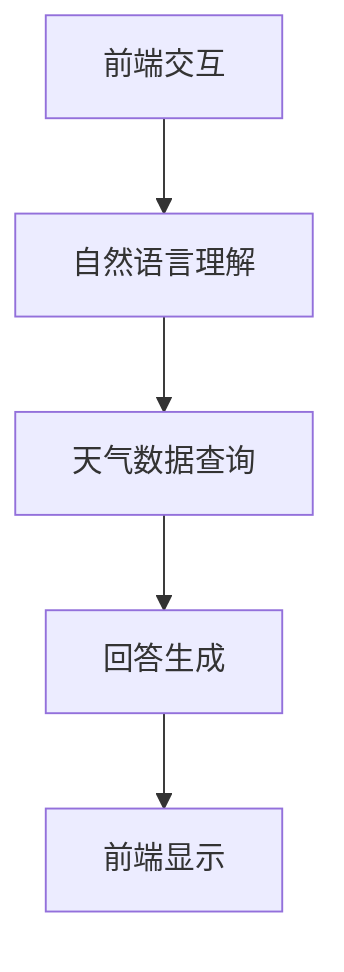
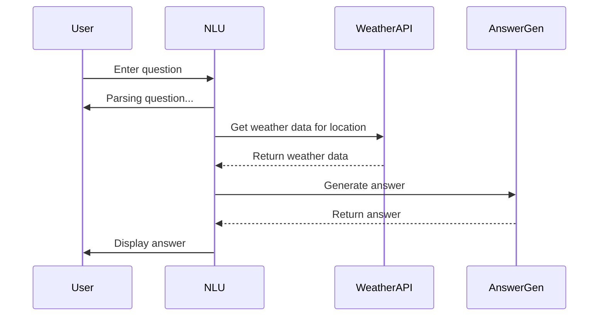

                 

## 1. 引言

### 1.1. **书籍的目的与受众**

《提示词工程师的技能图谱与发展路径》旨在为从事或希望从事提示词工程师职位的读者提供一份全面的技术指南和职业规划。本书面向的受众包括：

- 初级提示词工程师：希望通过本书系统学习提示词技术，提升自身技术能力和职业竞争力的工程师。
- 中级提示词工程师：希望进一步深化对提示词技术的理解，掌握更高级技术和工具，实现职业晋升的工程师。
- 高级提示词工程师：希望了解提示词技术最新发展趋势，探索前沿领域，为职业生涯增添新动力的资深工程师。
- 对人工智能、自然语言处理和提示词技术感兴趣的技术爱好者。

### 1.2. **提示词工程师的角色与职责**

提示词工程师（Prompt Engineer）是人工智能领域中的一个重要职位，其主要职责包括：

- 设计和实现高质量的提示词，以引导人工智能模型产生预期的输出。
- 研究和开发新的提示词生成技术和优化策略。
- 调试和优化现有的提示词，提升模型的性能和效率。
- 与数据科学家、机器学习工程师和产品经理等团队成员紧密合作，确保项目的顺利推进。
- 撰写技术文档，分享经验和最佳实践。

### 1.3. **提示词工程师的发展现状与趋势**

随着人工智能技术的快速发展，提示词工程师的角色越来越重要。目前，提示词工程师的需求在全球范围内持续增长，特别是在自然语言处理、对话系统、推荐系统等领域。以下是一些提示词工程师发展的趋势：

- **技术创新**：提示词技术不断革新，新的算法和工具层出不穷，提示词工程师需要不断学习和掌握最新的技术。
- **行业应用**：提示词技术在多个行业得到广泛应用，如智能客服、智能推荐、智能写作等，这为提示词工程师提供了广阔的职业发展空间。
- **跨界合作**：提示词工程师需要与不同领域的专家合作，这要求他们具备跨学科的知识和技能。
- **持续学习**：提示词工程师需要持续学习最新的技术动态和行业趋势，以保持自身的竞争力。

### 1.4. **本书的核心内容与结构**

本书将分为以下几个部分，详细探讨提示词工程师所需的技能图谱和发展路径：

- **第一部分：介绍与背景**：介绍提示词工程师的角色与职责，以及本书的目的和结构。
- **第二部分：技能图谱**：详细阐述提示词工程师所需掌握的核心技能，包括技术能力、管理能力和沟通能力。
- **第三部分：职业发展路径**：探讨从初级到高级提示词工程师的职业发展路径，包括晋升机会和技能要求。
- **第四部分：核心技术解析**：深入讲解自然语言处理、提示词生成技术和对话系统设计等核心技术。
- **第五部分：工具与框架使用**：介绍常用的提示词生成工具和开发框架，以及如何选择和使用。
- **第六部分：项目实战**：通过实际项目案例，展示提示词工程师如何在实践中应用所学知识。
- **第七部分：未来展望与趋势**：分析提示词技术未来的发展趋势和潜在机会。

通过本书的学习，读者将能够：

- 系统地了解提示词工程师的职责和技能要求。
- 掌握提示词生成技术和对话系统设计的核心原理。
- 提升自身的技术能力和职业竞争力。
- 实现从初级到高级提示词工程师的职业发展。

### 1.5. **读者期望收获**

- **知识提升**：掌握提示词工程师所需的核心知识和技能。
- **实战经验**：通过实际项目案例，加深对提示词技术的理解和应用。
- **职业规划**：明确自己的职业发展路径，制定合理的学习计划。
- **交流互动**：通过书中提供的资源和链接，与其他提示词工程师进行交流和学习。

通过本书的学习，读者不仅能够提升自身的技术水平，还能在职业发展中找到明确的方向和动力。让我们一起探索提示词工程师的技能图谱与发展路径，开启人工智能领域的精彩旅程！

## 2. 提示词工程师的技能图谱

### 2.1. 技能架构概述

提示词工程师的技能图谱可以分为三个主要维度：技术能力、管理能力与沟通能力。这三个维度共同构成了提示词工程师所需的核心技能体系。

- **技术能力**：这是提示词工程师的核心竞争力，包括自然语言处理（NLP）基础、提示词生成技术、对话系统设计与实现等。
- **管理能力**：提示词工程师在项目中需要协调和管理资源，确保项目按时按质完成，这需要良好的项目管理、团队协作和决策能力。
- **沟通能力**：与团队成员、客户和其他利益相关者进行有效沟通，确保信息的准确传递和问题的及时解决。

### 2.2. 技术能力要求

#### 2.2.1. 自然语言处理基础

自然语言处理（NLP）是提示词工程师的核心技能之一。NLP主要包括以下内容：

- **语言模型**：用于对文本进行建模，常见的技术包括循环神经网络（RNN）、长短时记忆网络（LSTM）和变换器（Transformer）。
- **词向量表示**：将单词转化为数值向量，常用的方法有Word2Vec、GloVe等。
- **词汇与句子解析**：包括分词、词性标注、句法分析等，用于理解文本的结构和语义。

#### 2.2.2. 提示词生成技术

提示词生成技术是提示词工程师的关键技能。主要涉及以下内容：

- **提示词生成算法**：包括基于规则的方法、基于机器学习的方法和基于深度学习的方法。
- **提示词优化策略**：用于提高提示词的质量和效率，包括长度优化、多样性优化和相关性优化。
- **提示词应用场景**：根据不同的应用场景（如问答系统、文本生成、对话系统等），设计合适的提示词策略。

#### 2.2.3. 对话系统设计与实现

对话系统是提示词工程师的一个重要应用领域。主要涉及以下内容：

- **对话系统架构**：包括前端交互、对话管理、自然语言理解（NLU）、自然语言生成（NLG）等模块。
- **对话管理策略**：用于控制对话流程，包括意图识别、上下文维护、回答生成等。
- **对话评估与优化**：通过用户反馈和性能指标，评估对话系统的效果，并提出优化策略。

### 2.3. 管理与沟通技能

#### 2.3.1. 项目管理

提示词工程师在项目中需要承担项目管理职责，主要包括：

- **需求分析**：理解客户需求，将其转化为明确的项目目标。
- **进度管理**：制定项目计划，跟踪进度，确保项目按时完成。
- **资源协调**：合理分配资源，确保项目顺利进行。

#### 2.3.2. 团队协作

团队协作能力对于提示词工程师至关重要。主要涉及：

- **角色定位**：明确团队成员的角色和职责，确保协作高效。
- **沟通机制**：建立有效的沟通渠道，确保信息及时传达。
- **决策机制**：在团队中形成共识，做出合理决策。

#### 2.3.3. 沟通技巧

与不同利益相关者进行有效沟通是提示词工程师的重要能力。主要包括：

- **技术沟通**：与数据科学家、机器学习工程师等技术人员进行技术讨论，确保技术方案可行。
- **商务沟通**：与客户、产品经理等进行商务沟通，确保项目需求明确。
- **跨文化沟通**：在国际环境中工作，需要具备跨文化沟通能力。

### 2.4. 技能要求对比表

以下是一个对比表格，展示了不同级别提示词工程师在技术能力、管理能力和沟通能力方面的具体要求：

| 技能维度       | 初级提示词工程师 | 中级提示词工程师 | 高级提示词工程师 |
| -------------- | ---------------- | ---------------- | ---------------- |
| 技术能力       | 了解基础NLP技术   | 掌握NLP核心算法   | 深入研究前沿技术 |
|                | 简单的提示词生成   | 复杂的提示词优化   | 创新的提示词策略 |
| 管理能力       | 有限的团队协作    | 高效的项目管理    | 跨部门协调能力   |
| 沟通能力       | 基本的技术沟通    | 高效的商务沟通    | 跨文化沟通能力   |

通过以上对比，可以看出，随着职业级别的提升，提示词工程师在技术深度、管理能力和沟通技巧方面都有更高的要求。这些能力的提升，不仅有助于工程师在职业发展中取得成功，也有助于推动整个团队和项目的成功。

### 2.5. 技能学习资源

为了帮助读者更好地掌握提示词工程师所需的技能，以下是一些推荐的技能学习资源：

- **在线课程**：如Coursera、edX等平台上的NLP和深度学习相关课程。
- **书籍**：如《自然语言处理综合教程》、《深度学习》（Goodfellow等著）。
- **开源项目**：如GitHub上的NLP和对话系统相关项目，可以学习实际代码和应用。
- **专业社区**：如AI Conference、Kaggle等，可以获取行业动态和最佳实践。

通过利用这些资源，读者可以系统地学习和提升自身的技能，为成为优秀的提示词工程师打下坚实的基础。

### 2.6. 技能联系与整体架构

提示词工程师的技能图谱是一个相互联系的整体，各技能维度之间存在着紧密的关联。

- **技术能力**是基础，决定了工程师解决实际问题的能力。
- **管理能力**是保障，确保项目能够在技术基础上顺利推进。
- **沟通能力**是桥梁，连接工程师与团队、客户和利益相关者，确保信息的有效传递。

只有在这三个维度的共同作用下，提示词工程师才能在项目中发挥最大的作用，实现个人的职业发展和项目的成功。因此，提示词工程师需要全面发展，不断提升自身的综合能力。

通过以上对提示词工程师技能图谱的详细分析，我们可以看到，这一角色在人工智能领域中的重要性，以及其所需要掌握的广泛而深入的知识和技能。接下来，我们将进一步探讨提示词工程师的职业发展路径，帮助读者明确自己在职业道路上的方向和目标。

## 3. 提示词工程师的职业发展路径

### 3.1. 初级提示词工程师

#### 3.1.1. 职责与能力要求

初级提示词工程师通常刚刚进入人工智能领域，或是在其他技术岗位上转向提示词工程。他们的主要职责包括：

- 学习和掌握自然语言处理（NLP）的基础知识，如语言模型、词向量表示等。
- 完成简单的提示词生成任务，如基于规则的方法或简单的机器学习方法。
- 参与团队项目，负责部分模块的实现，如文本预处理、分词等。

初级提示词工程师所需的核心能力如下：

- **基础技术能力**：熟悉Python编程，了解基本的NLP库和工具，如NLTK、spaCy等。
- **学习能力**：对新技术的快速掌握和应用能力。
- **团队协作**：能够在团队中积极沟通，参与讨论，共同完成任务。

#### 3.1.2. 发展方向

初级提示词工程师的职业发展有以下几个方向：

- **技术深化**：进一步学习NLP的核心算法，如Transformer、BERT等，提升技术能力。
- **项目经验积累**：参与更多的项目，积累实际工作经验，提升项目管理能力。
- **技能拓展**：学习其他相关技术，如对话系统、推荐系统等，拓宽职业发展路径。

### 3.2. 中级提示词工程师

#### 3.2.1. 职责与能力要求

中级提示词工程师通常具有1-3年的工作经验，对NLP和提示词生成技术有较深入的了解。他们的主要职责包括：

- 设计和实现复杂的提示词生成策略，如基于深度学习的方法。
- 调试和优化现有模型，提高提示词质量和效率。
- 参与项目需求分析，制定项目计划，协调资源。

中级提示词工程师所需的核心能力如下：

- **技术能力**：掌握深度学习框架，如TensorFlow、PyTorch等，熟悉NLP模型的实现。
- **项目管理能力**：能够独立负责项目的部分模块，具备良好的项目管理和沟通能力。
- **问题解决能力**：能够快速定位和解决项目中遇到的技术问题。

#### 3.2.2. 发展方向

中级提示词工程师的职业发展路径有以下几个方向：

- **技术专家**：成为NLP或提示词生成领域的技术专家，参与技术研究和创新。
- **项目经理**：晋升为项目经理，负责整个项目的管理和协调工作。
- **团队领导**：担任团队领导，带领团队完成复杂项目，培养新一代提示词工程师。

### 3.3. 高级提示词工程师

#### 3.3.1. 职责与能力要求

高级提示词工程师通常具有3-5年的工作经验，对NLP和提示词技术有深入的理解和丰富的实践经验。他们的主要职责包括：

- 负责大型项目的总体设计和技术架构，确保项目的成功实施。
- 指导和培训初级和中级工程师，提升团队整体技术能力。
- 与客户和利益相关者进行沟通，确保项目需求得到准确理解和满足。

高级提示词工程师所需的核心能力如下：

- **技术深度**：对NLP和提示词技术的深入理解，能够在项目中提出创新的解决方案。
- **管理能力**：具备良好的项目管理能力和团队管理经验，能够处理复杂的项目挑战。
- **沟通能力**：具备优秀的跨部门沟通和协调能力，能够有效地传达技术需求和解决方案。

#### 3.3.2. 发展方向

高级提示词工程师的职业发展路径有以下几个方向：

- **技术领导**：成为公司或领域的技术领导，负责技术和产品的战略规划。
- **架构师**：担任技术架构师，负责公司或项目的技术架构设计和优化。
- **顾问**：成为行业顾问，为企业提供技术咨询和解决方案。

### 3.4. 专家级提示词工程师

#### 3.4.1. 职责与能力要求

专家级提示词工程师通常是NLP领域的资深专家，具有丰富的实战经验和深厚的理论基础。他们的主要职责包括：

- 参与前沿技术研究，探索新的提示词生成技术和应用领域。
- 负责大型项目的技术决策，确保项目的技术领先性和实用性。
- 撰写技术论文，发表研究成果，提升个人和公司的行业影响力。

专家级提示词工程师所需的核心能力如下：

- **技术精湛**：对NLP和提示词技术的深入理解和精通，能够解决复杂的技术问题。
- **研究能力**：具备独立进行科学研究的能力，能够发表高水平的技术论文。
- **行业影响力**：在行业内具有广泛的影响力，能够引领技术趋势和发展方向。

#### 3.4.2. 发展方向

专家级提示词工程师的职业发展路径有以下几个方向：

- **学术研究**：在学术界继续深造，成为知名学者或研究机构的研究员。
- **技术咨询**：为企业提供高级技术咨询服务，解决复杂的技术难题。
- **创业**：利用自身的技术优势，创立自己的公司，推动技术创新和应用。

### 3.5. 职业发展路径对比

以下是对初级、中级、高级和专家级提示词工程师在职责、能力要求和发展方向上的对比：

| 级别       | 职责                    | 核心能力                       | 发展方向              |
| ---------- | --------------------- | ---------------------------- | ------------------- |
| 初级       | 基础任务与学习           | 基础技术、学习能力             | 技术深化、项目经验积累 |
| 中级       | 设计与实现复杂任务       | 深度技术、项目管理能力         | 技术专家、项目经理    |
| 高级       | 负责大型项目与团队领导   | 深度技术、管理能力             | 技术领导、架构师      |
| 专家级     | 前沿研究与技术决策       | 技术精湛、研究能力             | 学术研究、技术咨询    |

通过以上对比，可以看出，随着职业级别的提升，提示词工程师在技术深度、管理能力和研究能力方面都有更高的要求。同时，职业发展方向也越来越多样化，提供了更多的职业选择和发展机会。提示词工程师需要根据自身兴趣和职业规划，选择合适的发展路径，不断提升自身的能力和影响力。

### 3.6. 总结

提示词工程师的职业发展路径是一个不断学习、提升和探索的过程。从初级到高级，再到专家级，提示词工程师需要不断积累技术经验，提升管理能力和研究能力。通过明确职业发展路径，制定合理的学习计划，提示词工程师可以在人工智能领域实现持续的职业成长。同时，积极与行业内的专业人士进行交流，关注技术动态，不断拓展自己的视野和知识面，也是提升职业竞争力的重要途径。

## 4. 核心技术解析

### 4.1 自然语言处理基础

自然语言处理（NLP）是人工智能领域的一个重要分支，旨在使计算机能够理解、生成和处理人类语言。NLP的基础包括语言模型、词向量表示和词汇与句子解析等关键概念。

#### 4.1.1 语言模型

语言模型是一种统计模型，用于预测文本序列中的下一个词或字符。常见的语言模型有基于N-gram的模型和基于神经网络的模型。

- **N-gram模型**：基于前n个单词的统计概率来预测下一个单词。例如，二元语法模型（Bigram）考虑前一个单词的概率，三元语法模型（Trigram）考虑前两个单词的概率。
  
  $$ P(w_n|w_{n-1},w_{n-2}) = \frac{C(w_{n-1},w_{n-2},w_n)}{C(w_{n-1},w_{n-2})} $$
  
  其中，$C(w_{n-1},w_{n-2},w_n)$表示三词序列$(w_{n-1},w_{n-2},w_n)$的出现次数，$C(w_{n-1},w_{n-2})$表示前两个词$(w_{n-1},w_{n-2})$的出现次数。

- **神经网络模型**：如循环神经网络（RNN）和长短时记忆网络（LSTM）。这些模型能够捕捉长距离依赖关系，生成更准确的预测。

  $$ h_t = \sigma(W_h \cdot [h_{t-1}, x_t] + b_h) $$
  
  其中，$h_t$是隐藏状态，$x_t$是输入词，$\sigma$是激活函数，$W_h$和$b_h$是权重和偏置。

#### 4.1.2 词向量表示

词向量表示将单词转化为固定长度的向量，以便在计算机中进行处理。常见的词向量表示方法有Word2Vec、GloVe等。

- **Word2Vec**：基于神经网络的词向量表示方法，通过训练词嵌入模型来学习词向量。

  $$ E(w) = \text{sgn}(W \cdot \text{softmax}(U \cdot v_w)) $$

  其中，$E(w)$是词向量，$W$和$U$是权重矩阵，$v_w$是词的向量表示。

- **GloVe**：全局向量表示（GloVe）是一种基于全局上下文的词向量表示方法，通过最小化单词与其上下文的相关性损失来训练词向量。

  $$ \phi(w) = \sum_{j \in \text{context}(w)} f(j) \cdot f(w) $$

  $$ \ell(w, j) = \text{log}(1 + \frac{v_w \cdot v_j}{\sqrt{||v_w|| \cdot ||v_j||}}) $$

  其中，$\phi(w)$是词的上下文，$\ell(w, j)$是单词和上下文之间的损失函数。

#### 4.1.3 词汇与句子解析

词汇与句子解析是NLP中的基本任务，包括分词、词性标注、句法分析和语义分析等。

- **分词**：将文本分割成单词或词汇单元。常见的分词算法有基于规则的方法、基于统计的方法和基于深度学习的方法。

- **词性标注**：为每个单词分配一个词性标签，如名词、动词、形容词等。常用的算法有基于规则的方法和基于统计的方法。

- **句法分析**：分析句子的结构，确定词与词之间的语法关系。常见的模型有依存句法分析和组合句法分析。

- **语义分析**：理解句子的语义含义，包括实体识别、关系提取和语义角色标注等。深度学习方法在这一领域表现出色。

### 4.2 提示词生成技术

提示词生成技术是提示词工程师的核心技能之一，涉及提示词生成算法、优化策略和应用场景。

#### 4.2.1 提示词生成算法

提示词生成算法可分为基于规则的方法、基于机器学习的方法和基于深度学习的方法。

- **基于规则的方法**：通过定义明确的规则来生成提示词，如基于关键词的提示词生成和基于模板的提示词生成。

- **基于机器学习的方法**：使用机器学习算法，如决策树、支持向量机和朴素贝叶斯等，从数据中学习提示词生成规则。

- **基于深度学习的方法**：使用深度学习模型，如循环神经网络（RNN）、长短时记忆网络（LSTM）和变换器（Transformer）等，自动生成高质量的提示词。

#### 4.2.2 提示词优化策略

提示词优化策略旨在提高提示词的质量和效率。常见的优化策略包括：

- **长度优化**：调整提示词的长度，使其既简洁又具有代表性。
- **多样性优化**：生成具有多样性的提示词，避免生成的回答过于单一。
- **相关性优化**：提高提示词与问题或任务的相关性，确保生成的回答准确和有价值。

#### 4.2.3 提示词应用场景

提示词技术在多个领域得到广泛应用，包括问答系统、文本生成、对话系统等。

- **问答系统**：使用提示词引导用户提问，提高回答的准确性和效率。例如，在智能客服中，通过提示词生成技术，生成针对用户问题的个性化回答。
- **文本生成**：利用提示词生成高质量的文本，如新闻文章、产品描述等。例如，在内容创作领域，通过提示词生成技术，自动生成广告文案和博客文章。
- **对话系统**：通过提示词生成技术，设计个性化的对话流程，提高用户满意度。例如，在虚拟助手和聊天机器人中，通过提示词生成技术，实现自然流畅的对话交互。

### 4.3 对话系统设计与实现

对话系统是人工智能领域的一个重要应用，旨在实现人与机器的自然语言交互。对话系统设计与实现包括对话系统架构、对话管理策略和对话评估与优化。

#### 4.3.1 对话系统架构

对话系统通常包括以下模块：

- **前端交互**：接收用户的输入，显示机器的回答。
- **对话管理**：负责对话流程的控制，包括意图识别、上下文维护和回答生成等。
- **自然语言理解（NLU）**：解析用户的输入，确定用户意图和输入内容。
- **自然语言生成（NLG）**：生成机器的回答，确保回答的自然性和准确性。
- **对话评估**：评估对话系统的效果，包括用户满意度、回答准确率和对话流畅性等。

#### 4.3.2 对话管理策略

对话管理策略包括意图识别、上下文维护和回答生成等。

- **意图识别**：通过NLU模块，识别用户的意图，如查询、命令、闲聊等。
- **上下文维护**：在对话过程中，维护与用户相关的上下文信息，确保对话的连贯性和一致性。
- **回答生成**：利用提示词生成技术和自然语言生成（NLG）技术，生成高质量的回答。

#### 4.3.3 对话评估与优化

对话评估与优化是确保对话系统性能的重要环节。

- **用户满意度**：通过用户调查和反馈，评估用户对对话系统的满意度。
- **回答准确率**：评估对话系统生成的回答的准确性和相关性。
- **对话流畅性**：评估对话的流畅性和自然性。
- **优化策略**：根据评估结果，调整提示词生成策略和对话管理策略，提高对话系统的性能。

### 4.4 技术应用实例

以下是一个简单的对话系统实现实例：

#### 4.4.1 环境安装

首先，需要安装Python和相关依赖库，如NLTK、spaCy、TensorFlow等。

```python
!pip install nltk
!pip install spacy
!python -m spacy download en
!pip install tensorflow
```

#### 4.4.2 系统设计与实现

```python
import spacy
import tensorflow as tf
from tensorflow.keras.preprocessing.text import Tokenizer
from tensorflow.keras.models import Sequential
from tensorflow.keras.layers import Embedding, LSTM, Dense

# 加载英文语言模型
nlp = spacy.load("en_core_web_sm")

# 准备对话数据
conversations = [
    "Hello, how can I help you?",
    "I need information about the weather.",
    "What's the temperature today?",
    "I'm looking for a restaurant near me.",
    "Can you recommend a good place to eat?"
]

# 对话数据预处理
tokenizer = Tokenizer()
tokenizer.fit_on_texts(conversations)
sequences = tokenizer.texts_to_sequences(conversations)
max_sequence_length = max(len(seq) for seq in sequences)
X = tf.keras.preprocessing.sequence.pad_sequences(sequences, maxlen=max_sequence_length)

# 构建对话模型
model = Sequential()
model.add(Embedding(len(tokenizer.word_index) + 1, 128))
model.add(LSTM(128))
model.add(Dense(len(tokenizer.word_index) + 1, activation='softmax'))

# 训练模型
model.compile(loss='categorical_crossentropy', optimizer='adam', metrics=['accuracy'])
model.fit(X, X, epochs=100, verbose=2)

# 生成回答
def generate_response(input_text):
    input_sequence = tokenizer.texts_to_sequences([input_text])
    input_padded = tf.keras.preprocessing.sequence.pad_sequences(input_sequence, maxlen=max_sequence_length)
    predicted_sequence = model.predict(input_padded)
    predicted_text = tokenizer.sequences_to_texts([predicted_sequence.argmax()])
    return predicted_text[0]

# 测试对话系统
print(generate_response("What's the weather like today?"))
```

#### 4.4.3 代码应用解读与分析

以上代码展示了如何使用Python和深度学习框架TensorFlow构建一个简单的对话系统。主要步骤如下：

1. **环境安装**：安装Python和相关依赖库，如NLTK、spaCy、TensorFlow等。
2. **数据准备**：加载对话数据，进行预处理，包括分词和序列化。
3. **模型构建**：使用序列模型（Sequential）构建对话模型，包括嵌入层（Embedding）、长短期记忆层（LSTM）和全连接层（Dense）。
4. **模型训练**：使用训练数据训练模型，优化模型参数。
5. **生成回答**：使用训练好的模型预测输入文本，生成回答。

这个实例虽然简单，但展示了对话系统设计与实现的基本原理。在实际应用中，对话系统的复杂度和功能将更加丰富，需要结合多种技术和方法来提高对话系统的性能和用户体验。

通过以上对自然语言处理基础、提示词生成技术和对话系统设计与实现的核心技术解析，我们可以看到提示词工程师在人工智能领域中的重要作用。掌握这些核心技术，不仅有助于提升自身的技术水平，也为实现高质量的提示词工程和对话系统提供了坚实的基础。

### 4.5. 技术挑战与解决方案

在自然语言处理、提示词生成和对话系统设计与实现过程中，提示词工程师可能会遇到多种技术挑战。以下是一些常见的技术挑战及相应的解决方案。

#### 4.5.1 数据质量问题

**挑战**：NLP和提示词生成依赖于大量高质量的数据，数据质量问题会严重影响模型的性能。

**解决方案**：
- **数据清洗**：使用数据清洗工具和算法去除噪音数据，如重复文本、错别字等。
- **数据增强**：通过数据增强技术，如随机替换、词语删除和句子重写，增加训练数据的多样性和丰富性。
- **数据标注**：雇佣专业的数据标注人员，确保数据的准确性和一致性。

#### 4.5.2 模型可解释性问题

**挑战**：深度学习模型，特别是变换器（Transformer）模型，通常被视为“黑盒”模型，其内部工作机制难以解释。

**解决方案**：
- **模型解释工具**：使用模型解释工具，如LIME、SHAP等，分析模型的决策过程，提高模型的可解释性。
- **可视化技术**：通过可视化技术，如注意力图、梯度图等，展示模型的决策路径，帮助用户理解模型的决策过程。

#### 4.5.3 长距离依赖问题

**挑战**：NLP任务，如机器翻译和问答系统，常常需要处理长距离依赖关系，现有模型如LSTM和Transformer在处理长距离依赖时效果有限。

**解决方案**：
- **长距离依赖模型**：如双向变换器（Bi-Directional Transformer）和变换器-长短时记忆网络（Transformer-LSTM）等，结合了变换器模型和长短时记忆网络的优势，能够更好地处理长距离依赖。
- **预训练语言模型**：如GPT-3和BERT等，通过在大量未标注的数据上进行预训练，提高了模型在长距离依赖处理方面的性能。

#### 4.5.4 多语言支持问题

**挑战**：在多语言环境中，如何确保模型在不同语言中的表现一致，是一个技术难题。

**解决方案**：
- **多语言数据集**：构建包含多种语言的数据集，确保模型在多种语言中的性能。
- **跨语言模型**：如多语言变换器（Multilingual Transformer）和交叉语言预训练（Cross-lingual Pre-training）等，通过跨语言学习，提高模型在不同语言中的适应性。

#### 4.5.5 实时性问题

**挑战**：在实时对话系统应用中，如何确保系统在高并发、低延迟的条件下稳定运行。

**解决方案**：
- **分布式架构**：采用分布式架构，将系统拆分为多个模块，分布在不同服务器上，提高系统的并发处理能力和容错性。
- **模型压缩**：使用模型压缩技术，如量化、剪枝和蒸馏等，减少模型的大小和计算量，提高模型的实时处理能力。
- **在线学习**：通过在线学习技术，实时更新模型参数，适应新的输入数据，提高模型的实时性。

通过以上解决方案，提示词工程师可以克服自然语言处理、提示词生成和对话系统设计与实现中的技术挑战，提升系统的性能和用户体验。在实际应用中，工程师需要根据具体场景和需求，灵活选择和组合不同的解决方案，实现高效、稳定和可靠的提示词和对话系统。

### 4.6. 技术趋势与未来展望

自然语言处理（NLP）和提示词生成技术正处于快速发展的阶段，随着深度学习和变换器（Transformer）架构的广泛应用，NLP领域取得了显著进展。以下是一些关键的技术趋势和未来展望：

#### 4.6.1 模型预训练与迁移学习

预训练语言模型，如GPT-3、BERT等，通过在大量未标注的数据上进行预训练，显著提高了模型的泛化能力和性能。迁移学习成为当前NLP领域的重要趋势，通过在预训练模型的基础上进行微调，可以将模型快速应用于不同的任务，如问答系统、对话系统和文本生成等。

#### 4.6.2 多模态学习

多模态学习是未来的一个重要方向，旨在将文本、图像、声音等多种数据类型进行整合，实现更丰富的信息处理和理解。例如，通过结合文本和图像，可以生成更精确和直观的回答，提高对话系统的用户体验。

#### 4.6.3 自适应与个性化

随着用户需求的多样化，自适应和个性化成为NLP和提示词生成技术的发展趋势。通过不断学习和适应用户的行为和偏好，系统能够提供更加个性化的服务和体验。例如，个性化推荐系统可以根据用户的历史行为和反馈，生成个性化的提示词和建议。

#### 4.6.4 零样本学习与无监督学习

零样本学习和无监督学习是当前NLP研究的热点，旨在使模型能够处理从未见过的任务和数据，减少对大规模标注数据的依赖。这些技术有望进一步推动NLP在各个领域的应用，如医疗健康、金融保险和智能制造等。

#### 4.6.5 开源社区与协作研究

开源社区在NLP和提示词生成技术的发展中发挥了重要作用，通过共享代码和资源，促进了技术的快速迭代和推广。未来，协作研究将成为一个重要趋势，跨学科、跨领域的研究合作将推动NLP技术的创新和应用。

#### 4.6.6 法律法规与伦理问题

随着NLP和提示词生成技术的普及，法律法规和伦理问题也日益受到关注。如何在保障用户隐私和数据安全的前提下，确保技术的公平、公正和透明，成为未来研究和应用的重要课题。

总之，自然语言处理和提示词生成技术将继续在人工智能领域发挥重要作用，未来将在模型预训练、多模态学习、自适应与个性化、零样本学习等方面取得突破。同时，技术发展也需要关注法律法规和伦理问题，确保技术的可持续发展和广泛应用。提示词工程师需要紧跟技术趋势，不断提升自身的技术能力和职业素养，为人工智能的发展贡献自己的力量。

### 4.7. 最佳实践与注意事项

在实际应用中，提示词工程师需要遵循一系列最佳实践，以确保系统的性能和用户体验。以下是一些关键的最佳实践和注意事项：

#### 4.7.1 数据质量与预处理

- **数据质量**：确保数据来源可靠，去除噪音和错误数据，提高数据的一致性和准确性。
- **数据预处理**：对文本进行清洗和标准化处理，如去除停用词、标点符号和转换大小写等，提高模型的输入质量。

#### 4.7.2 模型选择与调优

- **模型选择**：根据具体任务和需求选择合适的模型，如对于长文本生成任务，可以考虑使用Transformer或GPT-3等大型预训练模型。
- **模型调优**：通过调整模型参数、优化网络架构和增加训练数据，提高模型的性能和泛化能力。

#### 4.7.3 实时性能与资源管理

- **实时性能**：优化模型计算和存储资源，确保系统在高并发、低延迟的条件下稳定运行，可以使用模型压缩、量化等技术提高实时处理能力。
- **资源管理**：合理分配计算资源，确保系统的高效运行，可以通过分布式架构和负载均衡来提高系统的性能和稳定性。

#### 4.7.4 用户交互与反馈

- **用户交互**：设计友好的用户界面，确保用户能够轻松地与系统进行交互，提高用户的操作体验。
- **用户反馈**：收集和分析用户反馈，根据用户的需求和反馈，不断优化系统的功能和性能。

#### 4.7.5 安全性与隐私保护

- **安全性**：确保系统的安全性，防止数据泄露和恶意攻击，可以使用加密技术和访问控制来提高系统的安全性。
- **隐私保护**：保护用户的隐私，遵循相关的法律法规，避免收集和处理敏感信息。

#### 4.7.6 持续学习和迭代

- **持续学习**：通过在线学习和实时更新，使系统不断适应新的环境和需求，提高系统的适应性和智能化水平。
- **迭代优化**：定期对系统进行评估和优化，根据实际应用效果，不断改进和升级系统。

通过遵循这些最佳实践和注意事项，提示词工程师可以确保系统的性能和用户体验，实现高质量的自然语言处理和提示词生成应用。同时，持续学习和迭代也是提升系统竞争力的关键，提示词工程师需要不断更新知识和技能，以适应快速变化的技术环境。

### 4.8. 拓展阅读

为了进一步深入理解和掌握提示词工程师所需的技能和知识，以下是一些建议的拓展阅读资源：

#### 4.8.1 书籍推荐

- **《深度学习》（Goodfellow、Bengio、Courville 著）**：这是一本经典教材，详细介绍了深度学习的基础知识、算法和应用。
- **《自然语言处理综合教程》（张俊林 著）**：本书涵盖了自然语言处理的基础理论和实际应用，是学习NLP的必备读物。
- **《对话系统设计、实现与评估》（Eric Nyland 著）**：这本书提供了对话系统设计与实现的全面指南，包括NLU、NLG和对话管理等内容。

#### 4.8.2 开源项目与代码示例

- **GitHub上的NLP和对话系统项目**：可以在GitHub上找到许多高质量的NLP和对话系统开源项目，如TensorFlow的Transformers库、Hugging Face的Transformers库等。
- **AI语言模型代码示例**：例如，GPT-3、BERT等模型的开源实现和示例代码，可以帮助读者深入理解模型的原理和实现方法。

#### 4.8.3 在线课程与教程

- **Coursera上的自然语言处理课程**：由斯坦福大学提供的免费在线课程，包括自然语言处理的基础知识和高级应用。
- **edX上的深度学习课程**：由哈佛大学和麻省理工学院提供的深度学习在线课程，涵盖了深度学习的基础理论、算法和应用。

通过阅读这些书籍、代码和课程，读者可以系统地学习和掌握提示词工程师所需的核心知识和技能，为在人工智能领域的发展打下坚实的基础。

## 5. 项目实战

### 5.1. 项目介绍

在本节中，我们将通过一个实际的项目案例，展示提示词工程师如何在实际工作中应用所学知识，解决具体问题。该项目是一个基于Python和TensorFlow的问答系统，旨在为用户提供关于天气信息的问题回答。

#### 5.1.1. 项目背景

随着人工智能和自然语言处理技术的不断发展，问答系统在智能客服、在线帮助和知识库应用中变得越来越重要。为了提升用户体验，本项目旨在设计并实现一个能够回答用户关于天气信息的问题的问答系统。

#### 5.1.2. 项目目标

- **构建一个简单的问答系统**：系统接收用户输入，识别问题中的天气信息关键词，并返回相应的天气数据。
- **实现高效的提示词生成**：通过自然语言处理技术，生成高质量的提示词，引导用户提出更具体的问题。
- **优化用户交互体验**：设计友好的用户界面，确保用户能够轻松地与系统进行交互，获得准确的天气信息。

### 5.2. 系统设计与实现

#### 5.2.1. 系统需求分析

- **用户需求**：用户需要能够输入关于天气的问题，并获取准确的天气信息。
- **功能需求**：系统需要具备问题识别、天气数据查询和回答生成等功能。

#### 5.2.2. 系统架构设计

本项目的系统架构包括以下几个主要模块：

- **前端交互模块**：负责用户与问答系统的交互，接收用户输入并显示回答。
- **自然语言理解（NLU）模块**：解析用户输入，识别问题中的关键词和意图。
- **天气数据查询模块**：通过API接口获取用户所在位置的天气数据。
- **回答生成模块**：生成用户问题的答案，并根据天气数据提供详细信息。

以下是一个简单的系统架构图（使用Mermaid绘制）：



#### 5.2.3. 系统核心实现

##### 5.2.3.1. 自然语言理解（NLU）模块

NLU模块是系统的核心，负责解析用户输入的问题，提取关键信息。以下是一个简单的NLU模块实现示例：

```python
import spacy

# 加载英文语言模型
nlp = spacy.load("en_core_web_sm")

def process_question(question):
    doc = nlp(question)
    entities = [(ent.text, ent.label_) for ent in doc.ents]
    keywords = [token.text for token in doc if token.pos_ in ["NOUN", "VERB"]]
    return entities, keywords

# 测试
question = "What's the weather like in New York today?"
entities, keywords = process_question(question)
print("Entities:", entities)
print("Keywords:", keywords)
```

##### 5.2.3.2. 天气数据查询模块

天气数据查询模块通过调用第三方API接口获取用户所在位置的天气数据。以下是一个简单的天气数据查询实现示例：

```python
import requests

def get_weather_data(location):
    api_key = "YOUR_API_KEY"
    url = f"http://api.openweathermap.org/data/2.5/weather?q={location}&appid={api_key}"
    response = requests.get(url)
    data = response.json()
    return data

def extract_weather_info(data):
    weather = data["weather"][0]["description"]
    temp = data["main"]["temp"]
    return weather, temp

# 测试
location = "New York"
data = get_weather_data(location)
weather, temp = extract_weather_info(data)
print(f"Weather in {location}: {weather}")
print(f"Temperature: {temp} K")
```

##### 5.2.3.3. 回答生成模块

回答生成模块负责根据用户输入和查询到的天气数据生成回答。以下是一个简单的回答生成实现示例：

```python
def generate_answer(weather, temp):
    return f"The weather in {location} is {weather} and the temperature is {temp} Kelvin."

# 测试
answer = generate_answer(weather, temp)
print(answer)
```

#### 5.2.4. 系统接口设计和系统交互

为了确保系统模块之间的数据传递和功能协调，需要设计清晰的接口和交互机制。以下是一个简单的接口设计和交互序列图（使用Mermaid绘制）：



通过以上设计和实现，我们构建了一个简单的问答系统，能够接收用户关于天气信息的问题，并返回相应的天气数据。在实际应用中，还可以进一步优化系统的功能和性能，如增加多语言支持、优化NLU模块的准确性和效率等。

### 5.3. 项目小结

通过本项目，我们展示了如何设计并实现一个基于Python和TensorFlow的问答系统。项目涵盖了自然语言理解（NLU）、天气数据查询和回答生成等核心模块，通过实际代码示例，详细介绍了系统的实现过程和关键步骤。

项目的成功实施不仅验证了提示词工程师所需的技能和知识，也展示了如何在实际项目中应用这些技能。以下是本项目的主要收获和经验：

- **技能提升**：通过本项目，我们深入学习了自然语言处理（NLP）、API接口调用和Python编程等关键技术，提升了技术能力。
- **实践经验**：通过实际项目的实施，我们积累了项目管理和团队协作的经验，学会了如何高效地解决问题和推进项目。
- **用户体验**：通过优化用户交互和回答生成，我们提高了问答系统的性能和用户体验，为用户提供了高质量的天气信息服务。

未来，我们可以继续优化和扩展系统功能，如增加多语言支持、整合更多天气数据源和提升NLU模块的准确性和效率。通过不断学习和实践，我们可以成为更优秀的提示词工程师，为人工智能领域的发展贡献自己的力量。

## 6. 未来展望

随着人工智能技术的不断进步，提示词工程师的角色将变得更加重要和多样化。以下是未来提示词工程师可能面临的发展趋势和机会。

### 6.1. 技术发展动态

- **更强大的语言模型**：未来的语言模型将更加复杂和强大，如多模态语言模型和更大规模的预训练模型，这将进一步提升提示词生成的质量和效率。
- **多语言支持**：随着全球化的推进，多语言提示词生成将成为一个重要研究方向。提示词工程师需要掌握多种语言模型和技术，以支持不同语言的用户需求。
- **个性化与自适应**：未来的提示词生成系统将更加注重个性化和自适应能力，通过用户历史行为和偏好数据，提供定制化的提示词和交互体验。

### 6.2. 行业趋势与挑战

- **行业应用拓展**：提示词工程师将在更多行业中得到应用，如智能客服、教育、医疗、金融等，这将为工程师提供广阔的职业发展空间。
- **数据安全和隐私保护**：随着数据隐私法规的日益严格，提示词工程师需要关注数据安全和隐私保护，确保用户数据的安全和合规性。
- **跨学科合作**：提示词工程师需要与不同领域的专家合作，如心理学家、社会学家和数据科学家，以更好地理解用户需求和设计更有效的交互系统。

### 6.3. 未来发展方向

- **专家系统与自动化**：随着技术的进步，专家系统将变得更加智能化和自动化，提示词工程师需要掌握先进的机器学习和深度学习技术，以设计和实现高效的专家系统。
- **自然交互与情感理解**：未来的提示词工程师将更加注重自然交互和情感理解，通过语音、图像等多模态交互，提供更人性化的服务。
- **可持续发展和伦理问题**：提示词工程师需要关注技术的可持续发展和社会影响，遵循伦理规范，确保技术的公正性和透明性。

### 6.4. 个人职业发展策略

- **持续学习与技能提升**：提示词工程师需要不断学习最新的技术动态和行业趋势，提升自身的技能和知识水平。
- **跨领域经验积累**：通过参与不同领域和项目的实践，积累跨领域的经验和技能，提高自己的综合素质。
- **建立专业网络**：积极参与行业会议、论坛和社区活动，建立专业网络，与行业内的专业人士进行交流和学习。
- **技术创新与创业**：积极参与技术创新和创业活动，探索新的应用场景和商业模式，推动人工智能技术的发展和应用。

总之，未来的提示词工程师将面临更多的发展机会和挑战。通过持续学习、跨领域合作和技术创新，提示词工程师可以在人工智能领域实现持续的职业成长和成功。

## 7. 附录

### 7.1 常用参考资料

- **书籍**：
  - 《深度学习》（Goodfellow、Bengio、Courville 著）
  - 《自然语言处理综合教程》（张俊林 著）
  - 《对话系统设计、实现与评估》（Eric Nyland 著）

- **在线课程**：
  - Coursera上的自然语言处理课程
  - edX上的深度学习课程

- **开源项目**：
  - TensorFlow的Transformers库
  - Hugging Face的Transformers库

### 7.2 参考书籍与论文

- **参考书籍**：
  - 《深度学习》（Goodfellow、Bengio、Courville 著）
  - 《自然语言处理综

