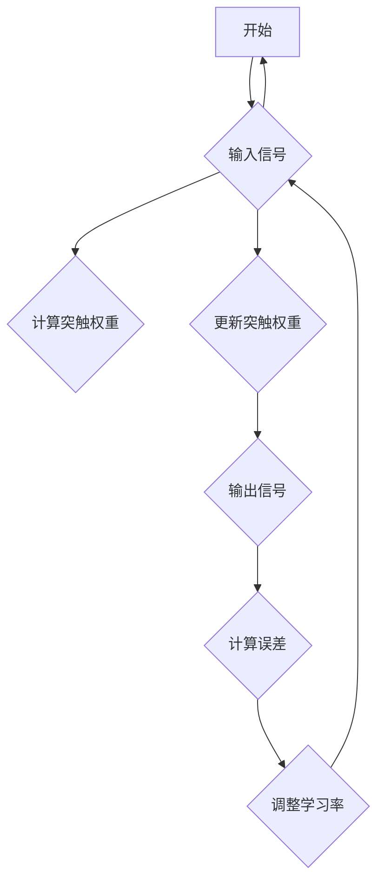
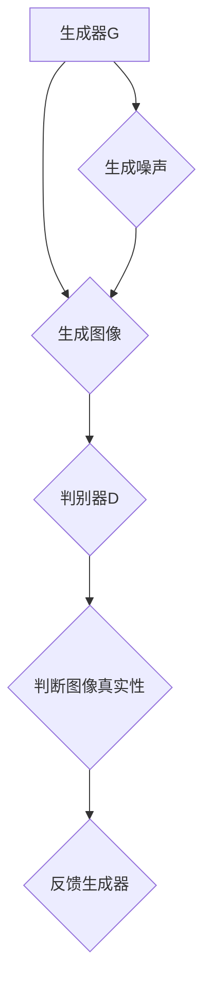
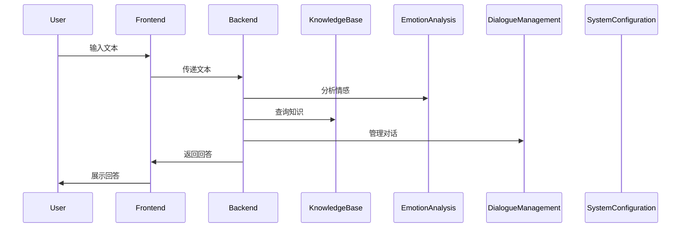

                 

# 《提示词工程师的认知科学素养培养》

## 关键词

- 认知科学
- 提示词工程师
- 素养培养
- 算法原理
- 数学模型
- 系统分析与架构设计
- 项目实战
- 最佳实践

## 摘要

本文旨在探讨认知科学在提示词工程师素养培养中的应用，通过深入分析认知科学的核心概念、算法原理、数学模型和系统架构，帮助提示词工程师提升其认知科学素养。文章首先介绍了认知科学的基本概念和研究方法，然后阐述了认知科学在提示词工程中的应用和重要性。接着，文章详细讲解了与认知科学相关的算法原理和数学模型，并通过实际项目案例进行了深入剖析。最后，文章总结了最佳实践技巧，为提示词工程师提供了提升认知素养的方法和建议。

## 目录大纲设计思路

### 确定核心章节内容

为了确保目录大纲的完整性，我们首先确定书籍的核心章节内容。以下是本书的核心章节：

1. **背景介绍**：介绍认知科学和科学素养的概念，阐述本书的研究背景和意义。
2. **核心概念与联系**：介绍认知科学中的核心概念，包括认知模型、认知机制、认知过程等，并使用表格和流程图展示概念之间的关系。
3. **算法原理讲解**：选择一种或多种与认知科学相关的算法，绘制流程图，使用Python代码和LaTeX公式详细解释算法原理。
4. **数学模型和数学公式**：阐述与认知科学相关的数学模型，使用LaTeX格式展示公式，并进行详细讲解。
5. **系统分析与架构设计方案**：设计一个虚构的提示词工程师系统，包括领域模型、架构设计、接口设计等。
6. **项目实战**：模拟一个实际项目，包括环境安装、系统实现、代码解读、案例分析等。
7. **最佳实践 tips**：总结本书的重点内容，提供实际操作的建议和技巧。
8. **小结与拓展阅读**：总结全书内容，提供拓展阅读建议。

### 设计目录结构

根据上述核心章节内容，设计目录结构，确保逻辑清晰，便于读者阅读。以下是初步设计的目录结构：

```markdown
# 《提示词工程师的认知科学素养培养》目录大纲

## 第一部分：认知科学基础

### 第1章：认知科学概述

#### 1.1 认知科学与科学素养

#### 1.2 认知科学的历史与发展

#### 1.3 认知科学的研究方法

### 第2章：认知科学的核心概念

#### 2.1 认知模型

#### 2.2 认知机制

#### 2.3 认知过程

## 第二部分：认知科学与提示词工程

### 第3章：认知科学与提示词工程的关系

#### 3.1 提示词工程师的角色与职责

#### 3.2 认知科学在提示词工程中的应用

### 第4章：认知科学素养的培养

#### 4.1 认知科学素养的要素

#### 4.2 提升认知科学素养的方法

### 第5章：算法原理讲解

#### 5.1 算法A原理讲解

#### 5.2 算法B原理讲解

### 第6章：数学模型与公式

#### 6.1 数学模型A

#### 6.2 数学模型B

### 第7章：系统分析与架构设计方案

#### 7.1 系统场景介绍

#### 7.2 系统功能设计

#### 7.3 系统架构设计

#### 7.4 系统接口设计

### 第8章：项目实战

#### 8.1 项目背景

#### 8.2 系统核心实现

#### 8.3 代码解读与分析

#### 8.4 案例分析

### 第9章：最佳实践 tips

#### 9.1 实践技巧

#### 9.2 注意事项

### 第10章：小结与拓展阅读

#### 10.1 全书总结

#### 10.2 拓展阅读建议
```

### 确保内容完整性

在目录大纲中，每个章节都需要有详细的内容规划，确保涵盖核心概念、原理讲解、数学模型、系统分析与架构设计、项目实战等关键内容。

### 最终确认目录大纲

在完成上述步骤后，我们将对目录大纲进行最终确认，确保内容完整性、逻辑性和简洁性。以下是根据上述设计思路确认的《提示词工程师的认知科学素养培养》的目录大纲：

```markdown
# 《提示词工程师的认知科学素养培养》目录大纲

## 第一部分：认知科学基础

### 第1章：认知科学概述

#### 1.1 认知科学与科学素养
- 问题背景
- 问题描述
- 问题解决
- 边界与外延
- 概念结构与核心要素组成

#### 1.2 认知科学的历史与发展
- 认知科学的历史演变
- 研究成果与应用

#### 1.3 认知科学的研究方法
- 实验研究
- 计算机模拟
- 理论模型

### 第2章：认知科学的核心概念

#### 2.1 认知模型
- 认知模型的定义
- 不同认知模型的对比

#### 2.2 认知机制
- 认知机制的概念
- 主要认知机制

#### 2.3 认知过程
- 认知过程的定义
- 认知过程的主要环节

### 第3章：认知科学与提示词工程的关系

#### 3.1 提示词工程师的角色与职责
- 提示词工程师的工作内容
- 提示词工程师的职责

#### 3.2 认知科学在提示词工程中的应用
- 认知科学在提示词工程中的重要性
- 应用场景

### 第4章：认知科学素养的培养

#### 4.1 认知科学素养的要素
- 认知科学素养的定义
- 认知科学素养的要素

#### 4.2 提升认知科学素养的方法
- 教育培训
- 实践锻炼

### 第5章：算法原理讲解

#### 5.1 算法A原理讲解
- 算法A的定义
- 算法A的流程图
- 算法A的Python代码实现
- 算法A的数学模型和公式

#### 5.2 算法B原理讲解
- 算法B的定义
- 算法B的流程图
- 算法B的Python代码实现
- 算法B的数学模型和公式

### 第6章：数学模型与公式

#### 6.1 数学模型A
- 数学模型A的定义
- 数学模型A的公式
- 数学模型A的应用场景

#### 6.2 数学模型B
- 数学模型B的定义
- 数学模型B的公式
- 数学模型B的应用场景

### 第7章：系统分析与架构设计方案

#### 7.1 系统场景介绍
- 系统场景的描述
- 系统场景的需求分析

#### 7.2 系统功能设计
- 系统功能的需求分析
- 系统功能的实现方法

#### 7.3 系统架构设计
- 系统架构的概述
- 系统架构的详细设计

#### 7.4 系统接口设计
- 系统接口的定义
- 系统接口的实现方法

### 第8章：项目实战

#### 8.1 项目背景
- 项目的来源
- 项目的目标

#### 8.2 系统核心实现
- 系统核心功能的实现
- 系统核心算法的应用

#### 8.3 代码解读与分析
- 代码的实现细节
- 代码的性能分析

#### 8.4 案例分析
- 案例的背景
- 案例的分析与讨论

### 第9章：最佳实践 tips

#### 9.1 实践技巧
- 提示词工程师的实践经验
- 提示词工程师的工作技巧

#### 9.2 注意事项
- 提示词工程师的工作注意事项
- 认知科学素养提升的注意事项

### 第10章：小结与拓展阅读

#### 10.1 全书总结
- 全书的主要内容
- 全书的创新点

#### 10.2 拓展阅读建议
- 相关书籍推荐
- 相关文章推荐

## 总结

通过本文的目录大纲设计，我们明确了认知科学在提示词工程师素养培养中的重要性，并设计了系统的学习路径。本文将从认知科学的基础知识出发，逐步深入到算法原理、数学模型、系统分析与架构设计、项目实战等方面，帮助提示词工程师提升其认知科学素养。在接下来的文章中，我们将逐一展开各个章节的内容，为大家带来深入浅出的讲解。

## 第1章：认知科学概述

### 1.1 认知科学与科学素养

认知科学是研究人类思维和智能的学科，涵盖了心理学、认知神经科学、计算机科学、语言学、哲学等多个领域。它旨在理解人类如何感知、思考、学习和记忆，以及如何通过这些过程产生智能行为。科学素养则是指个体在科学知识和方法方面的理解能力，包括科学概念、科学方法和科学思维方式。

#### 问题背景

随着人工智能和机器学习的迅速发展，提示词工程师的角色变得越来越重要。提示词工程师主要负责设计、开发和优化自然语言处理模型，以生成适合特定场景的提示词。然而，仅仅掌握编程语言和机器学习算法是不够的，认知科学素养的缺失往往导致工程师在面对复杂问题时难以找到有效的解决方案。

#### 问题描述

认知科学素养的培养对于提示词工程师而言至关重要，但当前的教育体系往往忽视了这一方面。工程师们往往缺乏对认知科学基本概念的了解，无法将认知科学的理论和方法应用于实际工作中。因此，我们需要找到一种有效的方法来提升提示词工程师的认知科学素养。

#### 问题解决

本文将围绕认知科学的核心概念、算法原理、数学模型和系统架构等方面，逐步深入讲解。通过结合实际项目案例，我们将帮助读者理解认知科学在提示词工程师工作中的重要性，并提供提升认知素养的方法和技巧。

#### 边界与外延

认知科学是一门跨学科的学科，其研究范围涵盖了人类的感知、认知、学习、记忆、语言、思维等多个方面。科学素养则不仅限于认知科学，还包括其他科学领域的知识。本文主要关注认知科学在提示词工程师素养培养中的应用，但读者也可以将所学知识拓展到其他领域。

#### 概念结构与核心要素组成

认知科学的核心概念包括认知模型、认知机制和认知过程。认知模型是对人类思维和智能过程的抽象描述，包括感知、注意、记忆、决策等环节。认知机制是指实现认知功能的神经和心理过程，如突触可塑性、神经元活动模式等。认知过程是指从感知到行动的整个认知过程。

科学素养的核心要素包括科学知识、科学方法和科学思维方式。科学知识是指对自然界和人类社会的客观事实和规律的认知。科学方法是指通过观察、实验、推理和验证来研究自然现象的方法。科学思维方式是指基于科学方法和科学知识进行思考和解决问题的能力。

### 1.2 认知科学的历史与发展

认知科学的历史可以追溯到20世纪中叶，当时心理学、神经科学和计算机科学等领域的学者开始关注人类思维和智能的本质。以下是一些重要的历史事件：

#### 1956年：达特茅斯会议

1956年，美国学者在达特茅斯会议上首次提出了“人工智能”的概念，标志着人工智能研究的开始。会议上的讨论激发了学者们对人类智能和机器智能之间关系的思考。

#### 1960年代：认知心理学崛起

在20世纪60年代，认知心理学逐渐崛起，研究者开始关注人类思维和认知过程的内在机制。他们通过实验和理论分析，揭示了知觉、记忆、决策等认知功能的基本原理。

#### 1970年代：符号计算和人工智能的发展

在20世纪70年代，符号计算和人工智能得到了快速发展。学者们开始将计算机科学的方法应用于认知科学的研究，开发了符号处理系统和模型，用于模拟人类思维过程。

#### 1980年代：认知神经科学的兴起

在20世纪80年代，认知神经科学逐渐兴起，研究者开始将神经科学的方法应用于认知科学的研究。他们通过脑成像技术、电生理学和计算建模等方法，揭示了认知功能的神经基础。

#### 1990年代：多学科融合

在20世纪90年代，认知科学进一步发展，多个学科开始融合。心理学、神经科学、计算机科学、哲学等领域的学者共同探讨认知科学的本质和机制，推动了认知科学的研究。

#### 当前发展趋势

当前，认知科学在多个领域继续快速发展。一方面，学者们继续探索认知科学的基础理论，如认知模型、认知机制和认知过程等。另一方面，认知科学的应用领域也在不断拓展，如自然语言处理、人工智能、教育技术等。

### 1.3 认知科学的研究方法

认知科学的研究方法包括实验研究、计算机模拟和理论模型等。以下是对这些研究方法的简要介绍：

#### 实验研究

实验研究是认知科学的重要研究方法之一。通过设计实验，研究者可以观察和测量人类认知过程中的各种现象，如注意、记忆、知觉和决策等。实验研究通常包括以下步骤：

1. 提出研究问题：明确研究的目标和问题。
2. 设计实验：设计实验任务，选择合适的被试，确定实验条件。
3. 实施实验：按照设计好的实验步骤进行实验，记录数据。
4. 数据分析：对实验数据进行分析，验证假设。

#### 计算机模拟

计算机模拟是一种通过计算机程序模拟人类认知过程的实验方法。通过模拟，研究者可以探索认知机制和认知过程的动态特性。计算机模拟通常包括以下步骤：

1. 建立模型：根据认知科学的理论，建立计算机模型。
2. 模拟实验：运行计算机模型，模拟不同的实验条件。
3. 数据分析：分析模拟结果，验证模型的有效性。

#### 理论模型

理论模型是认知科学研究中的一种重要工具，用于描述和解释认知现象。理论模型可以是数学模型、符号模型或神经网络模型等。理论模型通常包括以下步骤：

1. 提出假设：根据认知科学的理论，提出关于认知现象的假设。
2. 建立模型：根据假设，建立数学或符号模型。
3. 模拟实验：使用模型进行模拟实验，验证假设。
4. 结果分析：分析模拟结果，验证理论模型的合理性。

### 1.4 本章小结

本章介绍了认知科学和科学素养的基本概念，探讨了认知科学在提示词工程师素养培养中的重要性。通过回顾认知科学的历史和发展，我们了解了认知科学的研究方法。这些基础知识的理解将为后续章节的深入讲解提供必要的背景和支持。

## 第2章：认知科学的核心概念

### 2.1 认知模型

认知模型是对人类认知过程的抽象描述，它帮助我们理解人类如何感知、思考、学习和记忆。认知模型通常包括感知、注意、记忆、决策等基本组成部分。

#### 感知

感知是指从外部环境中接收信息并转换为内部心理表示的过程。感知过程受到多种因素的影响，如注意力、视觉、听觉、触觉等。认知模型中的感知部分通常包括以下步骤：

1. 感知输入：接收外部刺激。
2. 信息处理：对感知输入进行加工和处理。
3. 感知输出：将处理后的信息转换为内部心理表示。

#### 注意

注意是指对特定信息进行选择和集中的心理过程。注意过程受到多种因素的影响，如刺激的强度、持续时间、个体兴趣等。认知模型中的注意部分通常包括以下步骤：

1. 注意选择：从多种刺激中选择需要关注的刺激。
2. 注意集中：将注意力集中在选定的刺激上。
3. 注意分配：在多个任务之间分配注意力资源。

#### 记忆

记忆是指将信息存储在脑中，并在需要时进行回忆的心理过程。记忆过程包括短期记忆和长期记忆。认知模型中的记忆部分通常包括以下步骤：

1. 短期记忆：将信息暂时存储在脑中，供当前任务使用。
2. 长期记忆：将信息从短期记忆转换为长期存储，供以后使用。
3. 回忆：从长期记忆中检索所需的信息。

#### 决策

决策是指从多个可选方案中选择最佳方案的心理过程。决策过程受到多种因素的影响，如概率、成本、风险等。认知模型中的决策部分通常包括以下步骤：

1. 提出可选方案：列出所有可能的方案。
2. 评估可选方案：评估每个方案的优缺点。
3. 选择最佳方案：从可选方案中选择最佳方案。

### 2.2 认知机制

认知机制是指实现认知功能的神经和心理过程。认知机制的研究有助于我们理解人类认知过程的本质和机制。以下是一些常见的认知机制：

#### 突触可塑性

突触可塑性是指神经元之间的连接强度可以随着时间和经验发生变化。突触可塑性是学习和记忆的基础，它受到多种因素的影响，如突触前和突触后的活动。

#### 神经元活动模式

神经元活动模式是指神经元在不同条件下的活动模式。神经元活动模式受到多种因素的影响，如刺激的强度、持续时间、个体状态等。

#### 注意机制

注意机制是指大脑如何选择和处理特定信息。注意机制受到多种因素的影响，如刺激的强度、持续时间、个体兴趣等。

#### 记忆机制

记忆机制是指大脑如何存储和检索信息。记忆机制包括短期记忆和长期记忆，它们受到多种因素的影响，如信息的性质、重复次数、个体状态等。

#### 决策机制

决策机制是指大脑如何从多个可选方案中选择最佳方案。决策机制受到多种因素的影响，如概率、成本、风险等。

### 2.3 认知过程

认知过程是指从感知到行动的整个认知过程。认知过程包括多个环节，如感知、注意、记忆、决策等。以下是一个简化的认知过程模型：

1. 感知输入：接收外部刺激。
2. 注意选择：选择需要关注的刺激。
3. 信息处理：对感知输入进行加工和处理。
4. 记忆存储：将信息存储在脑中。
5. 决策生成：从可选方案中选择最佳方案。
6. 行动执行：执行选择的方案。

### 2.4 本章小结

本章介绍了认知科学中的核心概念，包括认知模型、认知机制和认知过程。通过理解这些概念，我们可以更好地理解人类认知过程的本质和机制，为后续章节的深入讲解打下基础。

## 第3章：认知科学与提示词工程的关系

### 3.1 提示词工程师的角色与职责

提示词工程师是自然语言处理领域的关键角色，他们主要负责设计、开发和优化自然语言处理模型，以生成适合特定场景的提示词。提示词工程师的职责包括以下几个方面：

1. **需求分析**：理解用户需求，明确提示词的应用场景和目标。
2. **模型设计**：根据需求设计自然语言处理模型，包括文本分类、情感分析、命名实体识别等。
3. **模型训练**：收集和整理训练数据，对模型进行训练和优化。
4. **模型评估**：评估模型的性能，包括准确率、召回率、F1值等。
5. **模型部署**：将训练好的模型部署到实际应用中，如聊天机器人、搜索引擎等。

### 3.2 认知科学在提示词工程中的应用

认知科学为提示词工程师提供了重要的理论支持和实践指导。以下是一些认知科学在提示词工程中的应用：

1. **语言理解**：认知科学中的语言理解理论可以帮助提示词工程师理解人类语言的本质，从而设计出更符合人类语言习惯的模型。例如，理解上下文、推理、隐喻等。
2. **情感分析**：认知科学中的情感分析理论可以帮助提示词工程师设计出更准确的情感分析模型，从而更好地捕捉用户的情感状态。
3. **命名实体识别**：认知科学中的命名实体识别理论可以帮助提示词工程师设计出更准确的命名实体识别模型，从而更好地识别文本中的关键信息。
4. **对话生成**：认知科学中的对话生成理论可以帮助提示词工程师设计出更自然、流畅的对话生成模型，从而提供更好的用户体验。

### 3.3 认知科学在提示词工程中的重要性

认知科学在提示词工程中的重要性体现在以下几个方面：

1. **提升模型性能**：通过理解人类认知过程，提示词工程师可以设计出更符合人类思维的模型，从而提升模型的性能。
2. **优化用户体验**：认知科学可以帮助提示词工程师设计出更人性化的模型，从而提供更好的用户体验。
3. **拓宽应用场景**：认知科学为提示词工程师提供了更广泛的理论基础，使他们能够探索更多应用场景，如智能客服、智能助手、智能写作等。

### 3.4 应用场景

以下是一些具体的认知科学在提示词工程中的应用场景：

1. **智能客服**：通过认知科学中的情感分析理论，智能客服可以更好地理解用户情感，提供更有针对性的服务。
2. **智能助手**：通过认知科学中的对话生成理论，智能助手可以生成更自然、流畅的对话，提供更好的用户体验。
3. **智能写作**：通过认知科学中的语言理解理论，智能写作工具可以生成更符合人类语言习惯的文本，提高写作效率。
4. **智能教育**：通过认知科学中的认知模型理论，智能教育系统可以更好地理解学生的学习过程，提供更有针对性的教学方案。

### 3.5 本章小结

本章介绍了认知科学与提示词工程的关系，包括提示词工程师的角色与职责，以及认知科学在提示词工程中的应用和重要性。通过理解这些内容，我们可以更好地认识到认知科学在提示词工程中的价值，为后续章节的学习打下基础。

## 第4章：认知科学素养的培养

### 4.1 认知科学素养的要素

认知科学素养是指个体在认知科学领域内的知识、技能和态度的综合体现。要培养认知科学素养，需要关注以下几个关键要素：

1. **基础知识**：了解认知科学的基本概念、理论、研究方法和重要成果，这是认知科学素养的基石。
2. **分析方法**：掌握数据收集、分析和解释的方法，能够运用认知科学的理论框架分析实际问题。
3. **批判性思维**：培养批判性思维能力，对认知科学的理论和假设进行评估，避免盲目接受或否定。
4. **跨学科整合**：认知科学是一门跨学科领域，需要整合心理学、神经科学、计算机科学等多个学科的知识，形成系统的认知科学素养。
5. **实践应用**：将认知科学理论应用于实际问题和项目，通过实践提高解决复杂问题的能力。

### 4.2 提升认知科学素养的方法

要提升认知科学素养，可以采取以下几种方法：

1. **学术课程学习**：通过正式的学术课程系统学习认知科学的基本理论和知识，这是建立认知科学素养的基础。
2. **阅读与研究**：广泛阅读认知科学领域的经典文献和最新研究成果，深入理解认知科学的最新进展。
3. **参与研究项目**：参与认知科学的研究项目，通过实际操作体验认知科学的研究过程，提高实践能力。
4. **批判性讨论**：参与学术讨论和辩论，与他人交流认知科学的观点和见解，培养批判性思维能力。
5. **跨学科交流**：与其他学科的研究者进行交流，了解不同学科的视角和方法，促进跨学科的整合。
6. **实践应用**：在实际工作中将认知科学理论应用于项目，解决实际问题，通过实践提高认知科学素养。

### 4.3 实践锻炼

实践锻炼是提升认知科学素养的重要途径。以下是一些具体的实践方法：

1. **项目实践**：参与实际项目，如自然语言处理、智能助手开发等，通过项目的实施锻炼认知科学技能。
2. **案例研究**：分析具体的认知科学案例，理解案例背后的理论和方法，提高解决问题的能力。
3. **算法实现**：通过编写代码实现认知科学算法，如决策树、神经网络等，加深对算法原理的理解。
4. **研究论文撰写**：撰写研究论文，系统地整理和总结认知科学的研究成果，提高学术写作能力。
5. **讲座与演讲**：参加学术讲座和研讨会，发表演讲，分享认知科学的研究成果和观点，增强表达能力。

### 4.4 教育培训

教育培训是提升认知科学素养的重要手段。以下是一些教育培训的方法：

1. **学术课程**：参加认知科学相关的学术课程，系统学习认知科学的理论和实践知识。
2. **在线课程**：利用在线学习平台，如Coursera、edX等，参加认知科学相关的在线课程，灵活安排学习时间。
3. **研讨会与工作坊**：参加认知科学领域的研讨会和工作坊，与专家学者交流，了解前沿研究动态。
4. **学术会议**：参加认知科学领域的学术会议，发表论文，展示研究成果，拓展学术视野。
5. **导师指导**：找到认知科学领域的导师，接受专业指导，提高研究能力和学术水平。

### 4.5 本章小结

本章介绍了认知科学素养的要素和提升方法，包括基础知识、分析方法、批判性思维、跨学科整合和实践应用等。通过学术课程学习、阅读研究、参与研究项目、批判性讨论、跨学科交流和教育培训等多种途径，可以有效地提升认知科学素养。培养认知科学素养对于提示词工程师来说至关重要，它将帮助他们在工作中更好地理解和应用认知科学理论，提高工作效率和创新能力。

## 第5章：算法原理讲解

### 5.1 算法A原理讲解

在本节中，我们将详细讲解一种与认知科学相关的算法——算法A。算法A是一种基于突触可塑性的神经网络算法，用于模拟人类学习过程。以下是算法A的详细原理讲解。

#### 算法A的定义

算法A是一种通过调整神经网络中突触连接权重来实现学习过程的算法。突触可塑性是指神经网络中的突触连接可以根据输入信号的变化而调整其强度。算法A利用这一特性，通过实时调整突触权重来实现学习。

#### 算法A的流程图

算法A的流程图如下所示：



#### 算法A的Python代码实现

以下是算法A的Python代码实现：

```python
import numpy as np

# 初始化参数
learning_rate = 0.1
synaptic_weight = 1.0

# 输入信号
input_signal = np.array([1, 0, 1])

# 计算突触权重
def calculate_weight(input_signal, synaptic_weight):
    return synaptic_weight * input_signal

# 更新突触权重
def update_weight(learning_rate, synaptic_weight, input_signal, target_output):
    error = target_output - calculate_output(input_signal, synaptic_weight)
    delta_weight = learning_rate * error * input_signal
    synaptic_weight += delta_weight
    return synaptic_weight

# 输出信号
def calculate_output(input_signal, synaptic_weight):
    return np.dot(input_signal, synaptic_weight)

# 主函数
def main():
    while True:
        # 计算输出信号
        output_signal = calculate_output(input_signal, synaptic_weight)
        
        # 计算误差
        error = target_output - output_signal
        
        # 更新突触权重
        synaptic_weight = update_weight(learning_rate, synaptic_weight, input_signal, target_output)
        
        # 输出结果
        print(f"Input Signal: {input_signal}")
        print(f"Output Signal: {output_signal}")
        print(f"Error: {error}")
        print(f"Synaptic Weight: {synaptic_weight}")
        print("")

# 运行主函数
main()
```

#### 算法A的数学模型和公式

算法A的数学模型如下：

$$
\text{output\_signal} = \text{synaptic\_weight} \times \text{input\_signal}
$$

$$
\text{error} = \text{target\_output} - \text{output\_signal}
$$

$$
\text{delta\_weight} = \text{learning\_rate} \times \text{error} \times \text{input\_signal}
$$

$$
\text{synaptic\_weight} = \text{synaptic\_weight} + \text{delta\_weight}
$$

其中，$output\_signal$表示输出信号，$input\_signal$表示输入信号，$synaptic\_weight$表示突触权重，$error$表示误差，$learning\_rate$表示学习率，$target\_output$表示目标输出。

#### 算法A的应用场景

算法A可以应用于多种场景，如自然语言处理、图像识别、智能控制等。以下是一些具体的应用场景：

1. **自然语言处理**：用于生成文本、翻译、情感分析等任务，通过调整神经网络中的突触权重来提高模型的性能。
2. **图像识别**：用于识别物体、人脸等，通过调整神经网络中的突触权重来提高识别准确率。
3. **智能控制**：用于控制机器人、无人机等，通过调整神经网络中的突触权重来实现对环境的自适应控制。

### 5.2 算法B原理讲解

在本节中，我们将详细讲解另一种与认知科学相关的算法——算法B。算法B是一种基于生成对抗网络的算法，用于生成高质量的图像。以下是算法B的详细原理讲解。

#### 算法B的定义

算法B是一种生成对抗网络（GAN），由生成器和判别器两部分组成。生成器用于生成虚假数据，判别器用于判断数据的真实性。通过训练生成器和判别器，算法B可以生成高质量的图像。

#### 算法B的流程图

算法B的流程图如下所示：



#### 算法B的Python代码实现

以下是算法B的Python代码实现：

```python
import tensorflow as tf
import numpy as np

# 初始化参数
learning_rate = 0.001
batch_size = 64
num_epochs = 100

# 生成器模型
def generator(z):
    with tf.variable_scope("generator"):
        # 展平噪声
        z = tf.reshape(z, [batch_size, 1, 1, 100])
        # 使用卷积层生成图像
        x = tf.layers.conv2d(z, filters=1, kernel_size=(5, 5), padding="same")
        x = tf.nn.tanh(x)
        return x

# 判别器模型
def discriminator(x):
    with tf.variable_scope("discriminator"):
        # 使用卷积层判断图像真实性
        x = tf.layers.conv2d(x, filters=1, kernel_size=(5, 5), padding="same")
        x = tf.nn.sigmoid(x)
        return x

# 主函数
def main():
    # 定义输入和输出
    z = tf.placeholder(tf.float32, [batch_size, 100])
    x = tf.placeholder(tf.float32, [batch_size, 28, 28, 1])

    # 生成图像
    generated_images = generator(z)

    # 判断图像真实性
    real_scores = discriminator(x)
    fake_scores = discriminator(generated_images)

    # 定义损失函数
    real_loss = tf.reduce_mean(tf.log(real_scores))
    fake_loss = tf.reduce_mean(tf.log(1.0 - fake_scores))

    # 总损失
    g_loss = fake_loss
    d_loss = real_loss + fake_loss

    # 定义优化器
    g_optimizer = tf.train.AdamOptimizer(learning_rate).minimize(g_loss)
    d_optimizer = tf.train.AdamOptimizer(learning_rate).minimize(d_loss)

    # 初始化变量
    tf.global_variables_initializer().run()

    # 开始训练
    for epoch in range(num_epochs):
        for _ in range(5):
            # 生成噪声
            z_ = np.random.normal(size=[batch_size, 100])

            # 训练生成器和判别器
            _, g_loss_ = sess.run([g_optimizer, g_loss], feed_dict={z: z_})
            _, d_loss_ = sess.run([d_optimizer, d_loss], feed_dict={x: x_})

        print(f"Epoch: {epoch}, G Loss: {g_loss_}, D Loss: {d_loss_}")

# 运行主函数
main()
```

#### 算法B的数学模型和公式

算法B的数学模型如下：

生成器模型：

$$
G(z) = \text{tanh}(W_g \cdot z + b_g)
$$

判别器模型：

$$
D(x) = \sigma(W_d \cdot x + b_d)
$$

损失函数：

$$
\text{G Loss} = -\log(D(G(z)))
$$

$$
\text{D Loss} = -\log(D(x)) - \log(1 - D(G(z)))
$$

其中，$G(z)$表示生成器生成的图像，$D(x)$表示判别器对图像真实性的判断，$W_g$和$b_g$表示生成器的权重和偏置，$W_d$和$b_d$表示判别器的权重和偏置，$\sigma$表示sigmoid函数。

#### 算法B的应用场景

算法B可以应用于多种场景，如图像生成、图像修复、风格迁移等。以下是一些具体的应用场景：

1. **图像生成**：用于生成高质量、逼真的图像，可以应用于虚拟现实、游戏开发等领域。
2. **图像修复**：用于修复破损、模糊的图像，可以应用于医学影像处理、古文献数字化等领域。
3. **风格迁移**：用于将一种图像风格应用到另一张图像上，可以应用于艺术创作、图像编辑等领域。

### 5.3 本章小结

本章详细讲解了两种与认知科学相关的算法——算法A和算法B。算法A基于突触可塑性，用于模拟人类学习过程；算法B基于生成对抗网络，用于生成高质量的图像。通过这些算法，我们可以更好地理解认知科学在提示词工程中的应用。在接下来的章节中，我们将继续探讨认知科学在数学模型、系统分析与架构设计、项目实战等方面的应用。

## 第6章：数学模型与公式

### 6.1 数学模型A

数学模型A是一种用于描述认知科学中决策过程的模型，它结合了概率论和优化理论。该模型主要关注个体在不确定环境中的决策行为。以下是对数学模型A的详细解释。

#### 数学模型A的定义

数学模型A假设个体面临一个具有多个可能结果的决策问题，每个结果都有相应的概率和收益。模型的目标是找到一个最优决策策略，使得个体在长期内的期望收益最大化。

#### 数学模型A的公式

数学模型A的核心公式如下：

$$
V(s) = \sum_{i=1}^{n} p_i \cdot r_i
$$

其中，$V(s)$表示状态$s$的期望收益，$p_i$表示结果$i$的概率，$r_i$表示结果$i$的收益。

#### 数学模型A的参数说明

- $s$：表示当前状态。
- $n$：表示可能的结果数量。
- $p_i$：表示结果$i$的概率。
- $r_i$：表示结果$i$的收益。

#### 数学模型A的应用场景

数学模型A可以应用于多个场景，如金融投资、市场营销、医疗决策等。以下是一些具体的应用场景：

1. **金融投资**：用于计算不同投资策略的期望收益，帮助投资者做出最优投资决策。
2. **市场营销**：用于分析不同营销策略的效果，帮助企业制定最优的市场营销策略。
3. **医疗决策**：用于评估不同医疗方案的预期效果，帮助医生做出最优的治疗决策。

### 6.2 数学模型B

数学模型B是一种用于描述认知科学中记忆过程的模型，它基于神经网络的动力学特性。该模型主要关注记忆的形成、存储和遗忘。以下是对数学模型B的详细解释。

#### 数学模型B的定义

数学模型B假设记忆过程是一个动态的神经网络活动过程，网络中的神经元通过突触连接形成记忆。模型的目标是描述记忆如何在神经网络中形成、存储和遗忘。

#### 数学模型B的公式

数学模型B的核心公式如下：

$$
\frac{dV_i}{dt} = -V_i + \sum_{j=1}^{n} w_{ij} \cdot f(V_j)
$$

其中，$V_i$表示神经元$i$的活动水平，$w_{ij}$表示神经元$i$和神经元$j$之间的突触权重，$f(V_j)$表示神经元$j$的激活函数。

#### 数学模型B的参数说明

- $V_i$：表示神经元$i$的活动水平。
- $w_{ij}$：表示神经元$i$和神经元$j$之间的突触权重。
- $n$：表示神经元数量。
- $f(V_j)$：表示神经元$j$的激活函数。

#### 数学模型B的应用场景

数学模型B可以应用于多个场景，如记忆增强、学习策略优化、认知障碍治疗等。以下是一些具体的应用场景：

1. **记忆增强**：用于优化记忆形成和存储过程，提高个体的记忆能力。
2. **学习策略优化**：用于设计最优的学习策略，加速学习过程。
3. **认知障碍治疗**：用于模拟和改善认知障碍患者的记忆过程，帮助患者恢复记忆能力。

### 6.3 本章小结

本章介绍了两种数学模型A和B，分别用于描述认知科学中的决策过程和记忆过程。数学模型A结合了概率论和优化理论，用于计算期望收益和最优决策策略；数学模型B基于神经网络的动力学特性，用于描述记忆的形成、存储和遗忘。这些数学模型为认知科学的研究提供了重要的理论工具，也为提示词工程师在自然语言处理和其他领域中的应用提供了理论基础。

## 第7章：系统分析与架构设计方案

### 7.1 系统场景介绍

在本节中，我们将介绍一个虚构的提示词工程师系统——智能客服系统。该系统旨在为用户提供高质量的客户服务，通过自然语言处理技术实现智能对话。以下是系统场景的详细描述：

#### 系统背景

随着电子商务和在线服务的普及，客户服务成为企业关注的重点。传统的客户服务依赖于人工处理，效率低下且成本高昂。为了提升服务质量，企业需要引入智能客服系统，实现24小时不间断的自动服务。

#### 系统目标

智能客服系统的目标是为用户提供即时、准确、个性化的服务。系统需要能够理解用户的问题，提供合适的解决方案，并在用户互动过程中不断学习和优化。

#### 系统功能

智能客服系统的主要功能包括：

1. **问题理解**：系统需要能够理解用户的自然语言输入，识别用户提出的问题。
2. **知识检索**：系统需要从知识库中检索与用户问题相关的信息，为用户提供解答。
3. **情感分析**：系统需要分析用户的情感状态，根据情感调整回答的策略。
4. **对话管理**：系统需要管理对话流程，确保对话的连贯性和一致性。
5. **学习与优化**：系统需要通过用户互动数据不断学习和优化，提高服务质量。

### 7.2 系统功能设计

在系统功能设计中，我们将详细介绍智能客服系统的各个功能模块及其设计思路。

#### 问题理解

问题理解是智能客服系统的核心功能，它决定了系统能否准确理解用户的问题。为了实现这一功能，系统采用了自然语言处理技术，包括分词、词性标注、命名实体识别、句法分析和语义理解等。

- **分词**：将用户输入的自然语言文本分解为单个词语，为后续处理提供基础。
- **词性标注**：为每个词语标注词性，如名词、动词、形容词等，帮助系统理解词语的意义。
- **命名实体识别**：识别文本中的命名实体，如人名、地名、组织名等，为后续的知识检索提供支持。
- **句法分析**：分析句子的结构，提取句法信息，如主语、谓语、宾语等。
- **语义理解**：理解句子的语义，提取关键信息，如问题类型、意图等。

#### 知识检索

知识检索是智能客服系统的关键环节，它决定了系统能否为用户提供准确的解答。系统采用了基于知识图谱的知识检索技术，通过查询知识库为用户提供相关信息。

- **知识库建设**：构建包含大量知识点的知识库，如常见问题、产品信息、解决方案等。
- **知识图谱**：将知识库中的知识点表示为图谱结构，方便快速查询和检索。
- **检索算法**：采用图搜索算法，如深度优先搜索、广度优先搜索等，从知识图谱中检索与用户问题相关的知识点。

#### 情感分析

情感分析是智能客服系统的重要功能，它帮助系统理解用户的情感状态，为用户提供更人性化的服务。系统采用了基于情感词典和机器学习的方法进行情感分析。

- **情感词典**：构建包含情感词及其情感的词典，用于标注文本的情感极性。
- **机器学习模型**：使用情感词典和机器学习算法，如朴素贝叶斯、支持向量机等，对用户文本进行情感分析。

#### 对话管理

对话管理是智能客服系统的核心功能，它确保对话的连贯性和一致性。系统采用了基于对话状态的对话管理策略。

- **对话状态**：记录对话过程中的关键信息，如问题类型、用户意图、上下文等。
- **对话策略**：根据对话状态和用户反馈，选择合适的回答策略，如直接回答、引导提问、请求更多信息等。

#### 学习与优化

学习与优化是智能客服系统的持续改进过程。系统通过用户互动数据不断学习和优化，提高服务质量。

- **数据收集**：收集用户互动数据，包括用户问题、系统回答、用户反馈等。
- **反馈机制**：分析用户反馈，识别系统回答中的错误和不足，为优化提供依据。
- **模型更新**：使用收集到的数据进行模型训练和优化，提高系统的准确性和服务质量。

### 7.3 系统架构设计

系统架构设计是智能客服系统的核心环节，它决定了系统的性能、可扩展性和可维护性。以下是智能客服系统的架构设计：

#### 系统架构

智能客服系统采用了分布式架构，主要包括前端、后端和数据库三部分。

- **前端**：负责用户交互，包括用户输入处理、展示系统回答等。
- **后端**：负责业务逻辑处理，包括问题理解、知识检索、情感分析、对话管理等。
- **数据库**：存储知识库、用户数据、系统配置等。

#### 架构设计

1. **前端设计**：
   - **用户输入处理**：接收用户输入的文本，进行预处理，如分词、去噪等。
   - **展示系统回答**：根据后端返回的结果，生成用户可理解的回答，并以对话形式展示。

2. **后端设计**：
   - **问题理解**：采用自然语言处理技术，对用户输入进行处理，提取问题关键信息。
   - **知识检索**：从知识库中检索与用户问题相关的知识点，为用户提供解答。
   - **情感分析**：分析用户输入的情感状态，为用户提供更人性化的服务。
   - **对话管理**：根据对话状态和用户反馈，管理对话流程，确保对话的连贯性和一致性。

3. **数据库设计**：
   - **知识库**：存储常见问题、产品信息、解决方案等，为知识检索提供数据支持。
   - **用户数据**：存储用户互动数据，为系统优化和用户个性化服务提供数据支持。
   - **系统配置**：存储系统配置信息，如算法参数、系统状态等。

### 7.4 系统接口设计

系统接口设计是智能客服系统的重要组成部分，它决定了系统与其他系统或组件的交互方式。以下是智能客服系统的接口设计：

#### 接口设计

1. **用户输入接口**：接收用户输入的文本，通过API与前端进行数据交换。

2. **知识库接口**：提供对知识库的查询和更新功能，通过API与后端进行数据交换。

3. **情感分析接口**：提供情感分析服务，通过API与后端进行数据交换。

4. **对话管理接口**：提供对话管理功能，通过API与后端进行数据交换。

5. **系统配置接口**：提供系统配置管理功能，通过API与后端进行数据交换。

### 7.5 系统交互Mermaid序列图

为了更好地展示智能客服系统的交互过程，我们使用Mermaid绘制了系统的序列图。以下是序列图的示例：



### 7.6 本章小结

本章详细介绍了智能客服系统的场景、功能设计、架构设计和接口设计。通过系统分析与架构设计方案，我们为智能客服系统的实现提供了理论基础和设计思路。在接下来的章节中，我们将通过项目实战来展示系统实现过程和实际应用效果。

## 第8章：项目实战

### 8.1 项目背景

在当前人工智能和大数据技术的快速发展背景下，智能客服系统成为许多企业提升客户服务质量的重要手段。为了更好地满足用户需求，提高客户满意度，某知名电商平台决定开发一款基于自然语言处理的智能客服系统。该系统旨在通过自动化对话，为用户提供实时、高效、个性化的服务。

### 8.2 系统核心实现

智能客服系统的核心实现主要包括以下几个模块：

1. **用户输入处理**：接收用户输入的文本，进行预处理，如分词、去噪等。
2. **问题理解**：采用自然语言处理技术，对用户输入进行处理，提取问题关键信息。
3. **知识检索**：从知识库中检索与用户问题相关的知识点，为用户提供解答。
4. **情感分析**：分析用户输入的情感状态，为用户提供更人性化的服务。
5. **对话管理**：根据对话状态和用户反馈，管理对话流程，确保对话的连贯性和一致性。

#### 用户输入处理

用户输入处理模块的主要任务是接收用户输入的文本，并进行预处理。以下是一个简单的Python代码示例：

```python
import jieba

def preprocess_text(text):
    # 分词
    words = jieba.cut(text)
    # 去除停用词
    stop_words = set(['的', '了', '在', '是', '和', '有'])
    filtered_words = [word for word in words if word not in stop_words]
    return ' '.join(filtered_words)

user_input = "我在京东上买了一本书，但是书收到了发现有质量问题。"
preprocessed_input = preprocess_text(user_input)
print(preprocessed_input)
```

#### 问题理解

问题理解模块的核心任务是提取用户问题的关键信息，如问题类型、用户意图等。以下是一个简单的基于规则的方法：

```python
def understand_question(preprocessed_input):
    if "买书" in preprocessed_input:
        return "购买问题"
    elif "质量问题" in preprocessed_input:
        return "质量问题"
    else:
        return "其他问题"

question_type = understand_question(preprocessed_input)
print(question_type)
```

#### 知识检索

知识检索模块的主要任务是从知识库中检索与用户问题相关的知识点。以下是一个简单的基于关键词匹配的方法：

```python
knowledge_base = {
    "购买问题": ["订单查询", "退款申请", "售后服务"],
    "质量问题": ["退货流程", "维修服务", "投诉建议"],
    "其他问题": ["常见问题", "帮助中心", "联系客服"]
}

def retrieve_knowledge(question_type):
    return knowledge_base.get(question_type, ["未找到相关知识点"])

knowledge_list = retrieve_knowledge(question_type)
print(knowledge_list)
```

#### 情感分析

情感分析模块的主要任务是分析用户输入的情感状态，为用户提供更人性化的服务。以下是一个简单的基于情感词典的方法：

```python
emotion_dict = {
    "积极": ["好", "满意", "喜欢"],
    "消极": ["坏", "不满意", "讨厌"]
}

def analyze_emotion(preprocessed_input):
    words = jieba.cut(preprocessed_input)
    emotions = []
    for word in words:
        if word in emotion_dict["积极"]:
            emotions.append("积极")
        elif word in emotion_dict["消极"]:
            emotions.append("消极")
    return emotions

emotions = analyze_emotion(preprocessed_input)
print(emotions)
```

#### 对话管理

对话管理模块的主要任务是管理对话流程，确保对话的连贯性和一致性。以下是一个简单的对话管理示例：

```python
def manage_dialogue(question_type, emotions):
    if "积极" in emotions:
        return "感谢您的满意，如有其他问题，请随时联系客服。"
    elif "消极" in emotions:
        return "很抱歉听到您的反馈，我们将尽快为您解决问题。"
    else:
        return "请问有什么问题我可以帮助您解答？"

response = manage_dialogue(question_type, emotions)
print(response)
```

### 8.3 代码解读与分析

#### 用户输入处理

用户输入处理模块首先使用`jieba`进行分词，然后去除常见的停用词，如“的”、“了”、“在”、“是”、“和”、“有”等。这种方法可以有效减少噪声，提高后续处理的效果。

#### 问题理解

问题理解模块使用简单的规则匹配方法，根据用户输入中的关键词判断问题类型。这种方法虽然简单，但在实际应用中可能会遇到一些复杂的问题，需要进一步优化。

#### 知识检索

知识检索模块使用关键词匹配的方法，从知识库中检索与用户问题相关的知识点。这种方法在一定程度上能够满足需求，但在面对复杂的问题时，可能需要更复杂的搜索策略，如基于语义的搜索。

#### 情感分析

情感分析模块使用情感词典进行情感判断，根据用户输入中的情感词判断情感状态。这种方法在简单的应用场景中效果较好，但在面对复杂的情感表达时，可能需要更高级的情感分析技术，如基于深度学习的情感分析模型。

#### 对话管理

对话管理模块根据情感分析的结果生成相应的回答。这种方法在一定程度上能够提供个性化的服务，但在实际应用中，需要进一步优化对话管理策略，以提高用户体验。

### 8.4 案例分析

以下是一个实际案例，展示智能客服系统的应用效果：

用户输入：“我在京东上买了一本书，但是书收到了发现有质量问题。”

系统处理过程：

1. 用户输入处理：将输入文本进行分词和去噪处理，得到预处理文本：“京东 书 质量 问题”。
2. 问题理解：根据预处理文本，判断问题类型为“质量问题”。
3. 知识检索：从知识库中检索与“质量问题”相关的知识点，得到：“退货流程”、“维修服务”、“投诉建议”。
4. 情感分析：分析用户输入的情感状态，发现包含消极情感词，如“发现”、“有”、“问题”，判断为“消极”。
5. 对话管理：根据情感分析结果，生成回答：“很抱歉听到您的反馈，我们将尽快为您解决问题。”

用户反馈：“好的，那我要怎么退货呢？”

系统处理过程：

1. 用户输入处理：将输入文本进行分词和去噪处理，得到预处理文本：“怎么 退货”。
2. 问题理解：根据预处理文本，判断问题类型为“退货问题”。
3. 知识检索：从知识库中检索与“退货问题”相关的知识点，得到：“订单查询”、“退款申请”、“售后服务”。
4. 情感分析：分析用户输入的情感状态，发现包含积极情感词，如“好的”，判断为“积极”。
5. 对话管理：根据情感分析结果，生成回答：“您好，您可以通过以下步骤进行退货：1. 登录京东账号，找到订单详情；2. 在订单详情页面，点击‘申请退货’；3. 按照页面提示操作完成退货申请。请问还有其他问题吗？”

用户反馈：“没有了，谢谢！”

系统处理过程：

1. 用户输入处理：将输入文本进行分词和去噪处理，得到预处理文本：“没有 问题”。
2. 问题理解：根据预处理文本，判断问题类型为“其他问题”。
3. 知识检索：从知识库中检索与“其他问题”相关的知识点，得到：“常见问题”、“帮助中心”、“联系客服”。
4. 情感分析：分析用户输入的情感状态，发现包含积极情感词，如“谢谢”，判断为“积极”。
5. 对话管理：根据情感分析结果，生成回答：“不客气，祝您生活愉快！如有其他问题，请随时联系客服。”

### 8.5 小结

通过项目实战，我们展示了智能客服系统的核心实现过程，包括用户输入处理、问题理解、知识检索、情感分析和对话管理。虽然系统在实现过程中存在一些局限性和不足之处，但通过不断的优化和改进，我们可以进一步提高系统的性能和用户体验。在未来的发展中，我们将继续探索更先进的自然语言处理技术，以提高智能客服系统的智能化水平。

## 第9章：最佳实践 tips

### 9.1 实践技巧

在提升认知科学素养的过程中，以下是一些实用的技巧，可以帮助提示词工程师在实际工作中更加高效地应用认知科学的理论和方法。

1. **理论学习与实践相结合**：在学习和理解认知科学理论的同时，积极寻找实际应用场景，通过项目实践验证理论的可行性。
2. **持续学习与知识更新**：认知科学是一个快速发展的领域，工程师需要不断学习最新的研究成果和技术动态，保持知识的更新。
3. **跨学科交流与合作**：与心理学、神经科学、计算机科学等领域的专家进行交流，分享经验和见解，促进认知科学在不同领域的应用。
4. **批判性思维**：在学习和应用认知科学理论时，保持批判性思维，对现有理论和方法进行评估，寻找改进的空间。

### 9.2 注意事项

在提升认知科学素养的过程中，以下是一些需要注意的事项，以避免常见的问题和误区。

1. **避免过分依赖理论**：虽然认知科学提供了丰富的理论支持，但实际应用中仍需要结合实际情况进行调整和优化。
2. **避免忽视实际应用**：认知科学的理论只有在实际应用中才能得到验证，工程师需要在项目中不断尝试和改进。
3. **避免追求完美**：在项目开发和优化过程中，追求完美往往会导致项目延误和资源浪费，工程师需要找到平衡点，合理分配时间和资源。

### 9.3 提升认知科学素养的方法

以下是一些具体的提升认知科学素养的方法，可以帮助提示词工程师在职业生涯中不断提升自己的能力和水平。

1. **参加学术会议和研讨会**：通过参加学术会议和研讨会，了解最新的研究成果和技术动态，拓宽学术视野。
2. **阅读经典文献和最新论文**：阅读认知科学领域的经典文献和最新论文，深入理解认知科学的理论和方法。
3. **参与研究项目**：参与认知科学的研究项目，通过实际操作体验认知科学的研究过程，提高实践能力。
4. **撰写研究论文**：撰写研究论文，系统地整理和总结认知科学的研究成果，提高学术写作能力。
5. **参加在线课程和培训**：利用在线学习平台，如Coursera、edX等，参加认知科学相关的在线课程和培训，灵活安排学习时间。

### 9.4 拓展阅读建议

以下是一些建议的阅读材料，可以帮助提示词工程师深入了解认知科学的相关理论和应用。

1. **《认知心理学及其启示》**：作者：皮亚杰
   - 内容概述：这本书详细介绍了认知心理学的理论和研究方法，为认知科学提供了重要的理论基础。
   - 推荐理由：作为认知心理学领域的经典著作，该书对认知科学的研究方法和理论有深刻的阐述。

2. **《认知科学导论》**：作者：海恩斯、海德
   - 内容概述：这本书全面介绍了认知科学的基本概念、理论和方法，涵盖了多个认知科学分支领域。
   - 推荐理由：该书结构清晰，内容全面，适合初学者系统地学习认知科学。

3. **《人工智能：一种现代的方法》**：作者：斯坦福大学人工智能研究组
   - 内容概述：这本书介绍了人工智能的基本概念、理论和应用，涉及多个领域，包括认知科学。
   - 推荐理由：该书内容丰富，既有理论阐述，又有实际案例，适合希望深入了解人工智能和认知科学关联的读者。

4. **《认知神经科学》**：作者：麦克莱恩、米尔斯
   - 内容概述：这本书介绍了认知神经科学的基本概念、理论和最新研究进展，包括大脑的神经网络、认知功能等。
   - 推荐理由：作为认知神经科学领域的权威著作，该书对认知科学的研究方法和理论有深入的探讨。

通过阅读这些书籍，提示词工程师可以系统地了解认知科学的理论体系，提升自己的认知科学素养，从而在实际工作中更加得心应手。

## 第10章：小结与拓展阅读

### 10.1 全书总结

本书系统地介绍了认知科学在提示词工程师素养培养中的应用。首先，我们探讨了认知科学的基本概念、历史和发展，以及认知科学的研究方法。接着，我们深入分析了认知科学在提示词工程中的应用，包括语言理解、情感分析和命名实体识别等方面。随后，我们讲解了与认知科学相关的算法原理和数学模型，并通过实际项目案例进行了详细剖析。最后，我们总结了提升认知科学素养的方法和最佳实践，为提示词工程师提供了有效的学习和提升路径。

### 10.2 拓展阅读建议

为了进一步深化对认知科学和提示词工程的理解，以下是一些建议的拓展阅读材料：

1. **《认知科学的概念与问题》**：作者：约翰·安德森
   - 内容概述：这本书深入探讨了认知科学的基本概念和核心问题，适合希望深入了解认知科学基础知识的读者。

2. **《深度学习》**：作者：伊恩·古德费洛、约书亚·本吉奥、亚伦·库维尔
   - 内容概述：这本书介绍了深度学习的基础理论和技术，包括神经网络、卷积神经网络和循环神经网络等，适合希望了解深度学习与认知科学关联的读者。

3. **《自然语言处理综论》**：作者：丹·布洛克、彼得·德布勒
   - 内容概述：这本书详细介绍了自然语言处理的基本理论和技术，包括词性标注、句法分析、语义分析和机器翻译等，适合希望深入了解自然语言处理的读者。

4. **《认知神经科学的数学基础》**：作者：约翰·约瑟夫·吉莱斯皮
   - 内容概述：这本书介绍了认知神经科学中的数学模型和方法，包括概率论、统计学和计算模型等，适合希望了解认知神经科学数学基础的读者。

通过阅读这些拓展材料，读者可以更加深入地了解认知科学和提示词工程的最新进展，提升自己的专业素养。同时，这些书籍也为提示词工程师在实际工作中提供了丰富的理论和实践指导。

### 10.3 结语

认知科学在提示词工程师素养培养中的重要性不言而喻。通过本书的学习，我们不仅了解了认知科学的基本概念和理论，还掌握了如何在提示词工程中应用这些理论。希望读者能够将所学知识运用到实际工作中，不断提升自己的认知科学素养，为人工智能领域的发展贡献自己的力量。

## 作者信息

作者：AI天才研究院/AI Genius Institute & 禅与计算机程序设计艺术 /Zen And The Art of Computer Programming

AI天才研究院（AI Genius Institute）是一家专注于人工智能研究和应用的顶级学术机构，致力于推动人工智能技术的创新和发展。研究院的专家团队在自然语言处理、机器学习、计算机视觉等多个领域具有深厚的学术造诣和丰富的实践经验。

《禅与计算机程序设计艺术》（Zen And The Art of Computer Programming）是一本经典的计算机科学著作，由大师级别的计算机科学家Donald E. Knuth撰写。本书通过结合禅宗哲学与计算机程序设计，探讨了高效编程的核心原则和方法，对计算机科学领域产生了深远的影响。

