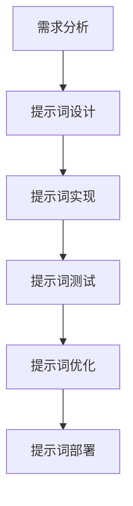
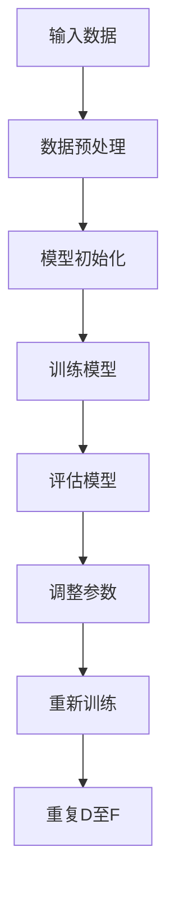

                 

# 引言：提示词工程的重要性与本书结构

## 1.1 书籍背景与目标

### 1.1.1 提示词工程的概念

提示词工程（Prompt Engineering）是指通过设计、实现和优化提示词（Prompt）来提升人工智能系统（特别是自然语言处理系统）性能的过程。提示词是一种引导人工智能模型生成目标输出的信息，它在模型的输入中起到了至关重要的作用。有效的提示词设计可以显著提高模型在特定任务上的表现，甚至可能决定模型的成败。

### 1.1.2 提示词工程的应用场景

提示词工程的应用场景非常广泛，包括但不限于以下领域：

- **文本生成与编辑**：例如，自动生成新闻报道、文章摘要、电子邮件等。
- **问答系统**：通过设计合适的提示词，可以提高问答系统的回答质量和效率。
- **聊天机器人**：设计个性化的提示词可以使聊天机器人更加自然地与用户交互。
- **搜索引擎**：优化搜索提示词可以提高搜索结果的准确性。
- **语音助手**：使用有效的提示词可以使语音助手更加智能和人性化。

### 1.1.3 读者定位与学习目标

本书旨在为不同层次的读者提供系统化的提示词工程知识。无论是新手还是有一定经验的专业人士，都可以通过本书的学习，掌握从基础到高级的提示词工程实践技能。

- **新手**：本书将引导新手了解提示词工程的基本概念、术语和实施步骤，并通过简单案例实操帮助他们初步掌握提示词设计的方法。
- **中级读者**：本书将介绍更高级的提示词设计技巧和策略，帮助中级读者提高工程实践水平，解决复杂场景中的问题。
- **高级读者**：本书还将探讨提示词工程的高级主题，如优化技巧、工具和框架的选择，以及进阶学习资源，以满足高级读者的需求。

## 1.2 本书内容结构

### 1.2.1 核心概念与术语

在本章中，我们将详细介绍提示词工程的核心概念和关键术语。这些概念和术语是理解和应用提示词工程的基础，包括提示词的定义、类型、作用等。

### 1.2.2 最佳实践案例

通过分析实际案例，我们将展示如何在不同应用场景中设计有效的提示词。这些案例将涵盖文本生成、问答系统、聊天机器人等多个领域，帮助读者了解提示词工程的实际应用。

### 1.2.3 高级技巧与策略

本章将深入探讨高级提示词设计技巧和策略，包括提示词优化方法、高级提示词类型和组合技巧等。这些高级内容将帮助读者在复杂场景中提高工程实践水平。

### 1.2.4 工具和框架介绍

我们将介绍常用的工具和框架，如自然语言处理库、提示词生成工具等，并讨论如何选择和使用这些工具来提高提示词工程效率。

### 1.2.5 进阶学习资源

本章将提供进一步学习的资源，包括相关书籍、论文、在线课程等，以帮助读者在提示词工程领域持续深入学习和探索。

### 1.2.6 结论与展望

本书将总结提示词工程的核心内容和关键技术，并对未来发展趋势进行展望。通过阅读本章，读者可以了解提示词工程在人工智能领域的广阔前景。

### 1.2.7 小结

本章是对本书内容结构的总结，帮助读者对全书有一个整体的把握。通过本章，读者可以明确学习目标，为后续章节的学习做好准备。

# 提示词工程基础

## 2.1 提示词工程的定义与作用

### 2.1.1 提示词工程的基本概念

提示词工程是一种系统化、工程化的方法，旨在设计、实现和优化提示词，以提高人工智能系统的性能。提示词（Prompt）是一种引导人工智能模型生成目标输出的信息，它可以是一个简单的关键词、一个完整的句子，甚至是一段复杂的文本。

提示词工程的核心目的是通过设计合适的提示词，使模型能够更好地理解用户的需求，从而生成更准确、更高质量的输出。在自然语言处理（NLP）领域，提示词工程的应用尤为广泛，因为它能够显著提升NLP系统的效果。

### 2.1.2 提示词工程的核心作用

提示词工程在人工智能系统中的核心作用主要体现在以下几个方面：

- **提高模型性能**：通过设计有效的提示词，可以使模型在特定任务上表现更优秀，从而提高系统的整体性能。
- **增强用户交互**：设计个性化的提示词，可以使人工智能系统与用户之间的交互更加自然、顺畅，提升用户体验。
- **降低训练成本**：提示词工程可以帮助模型更快地收敛到最优解，从而降低训练成本和时间。
- **拓展应用场景**：通过不同的提示词设计，可以使同一个模型适应多种不同的应用场景，提高其泛化能力。

### 2.1.3 提示词工程与自然语言处理的关系

提示词工程与自然语言处理（NLP）密切相关。NLP是人工智能的一个重要分支，主要研究如何让计算机理解和生成自然语言。而提示词工程则是NLP中的一个关键环节，通过优化提示词，可以提升NLP系统的效果。

具体来说，提示词工程在NLP中的应用包括：

- **文本分类**：设计合适的提示词可以显著提高文本分类的准确性。
- **情感分析**：通过优化提示词，可以更准确地判断文本的情感倾向。
- **命名实体识别**：提示词的设计可以提升命名实体识别的精度。
- **机器翻译**：优化提示词可以使机器翻译结果更加自然、流畅。

## 2.2 提示词工程的关键术语

### 2.2.1 常见术语介绍

在提示词工程中，以下是一些常见的术语：

- **提示词**（Prompt）：引导模型生成目标输出的信息。
- **填充词**（Filler Word）：用于填充提示词中的空缺，使模型能够更好地理解上下文。
- **上下文**（Context）：提示词所处的环境，包括前后文、主题等。
- **触发词**（Trigger Word）：用于启动特定任务的词语。
- **种子词**（Seed Word）：用于初始化模型生成过程的词语。
- **关键词**（Keyword）：在提示词中起到核心作用的词语。

### 2.2.2 术语对比与区分

- **提示词**和**填充词**：提示词是引导模型生成目标输出的主要信息，而填充词则是用于补充提示词的空缺，使模型能够更好地理解上下文。
- **触发词**和**种子词**：触发词是用于启动特定任务的词语，而种子词则是用于初始化模型生成过程的词语。

## 2.3 提示词工程的实施步骤

### 2.3.1 需求分析

在开始设计提示词之前，首先要明确系统的需求。这包括了解用户的需求、任务的目标和输入输出的特点等。需求分析是提示词工程的基础，它决定了后续的设计方向。

### 2.3.2 提示词设计

提示词设计是提示词工程的核心环节。在这一阶段，需要根据需求分析的结果，设计出能够引导模型生成目标输出的提示词。提示词的设计要考虑上下文、关键词、填充词等因素。

### 2.3.3 提示词实现

在完成提示词设计后，需要将其实现为实际的代码或脚本。这一阶段需要考虑如何将提示词集成到模型中，以及如何优化提示词的生成过程。

### 2.3.4 提示词测试与优化

提示词实现后，需要进行测试和优化。测试包括评估提示词的性能、稳定性和泛化能力等。通过测试，可以发现提示词的不足之处，并进行相应的优化。

### 2.3.5 部署与维护

完成测试后，可以将优化后的提示词部署到实际系统中。部署后，需要定期对提示词进行维护和更新，以确保其持续发挥最佳效果。

## 2.4 提示词工程的应用场景

### 2.4.1 文本生成与编辑

在文本生成与编辑中，提示词可以用来引导模型生成新的文本内容，如文章、摘要、电子邮件等。通过设计合适的提示词，可以使模型生成的内容更加准确、流畅。

### 2.4.2 问答系统

问答系统是提示词工程的重要应用领域之一。通过设计有效的提示词，可以使模型更好地理解用户的问题，并生成准确的答案。

### 2.4.3 聊天机器人

聊天机器人需要与用户进行自然、流畅的对话。通过设计个性化的提示词，可以提升聊天机器人的交互效果，使其更加贴近用户的期望。

## 2.5 本章小结

本章介绍了提示词工程的基本概念、关键术语和实施步骤，以及其在不同应用场景中的重要性。通过本章的学习，读者可以初步了解提示词工程的核心内容，为后续章节的学习打下基础。

## 新手入门实践

### 3.1 初识提示词工程

#### 3.1.1 提示词工程的基础概念

提示词工程（Prompt Engineering）是一种通过设计、实现和优化提示词（Prompt）来提升人工智能系统性能的工程方法。提示词是一种引导模型生成目标输出的信息，它在模型训练和推理过程中起到了关键作用。有效的提示词设计可以提高模型的性能和适应性，使其在不同任务和应用场景中都能表现出色。

#### 3.1.2 初步实践与理解

对于新手来说，了解提示词工程的基础概念是第一步。在实际操作中，可以从以下几个步骤开始：

1. **选择一个简单的模型**：例如，选择一个预训练的文本生成模型，如GPT-2或GPT-3。

2. **准备训练数据**：收集或创建一些与任务相关的文本数据，如新闻文章、对话记录等。

3. **编写提示词**：设计一个简单的提示词，例如，“请生成一篇关于‘人工智能的未来’的文章”。

4. **训练模型**：使用提示词和训练数据来训练模型，使其学会生成符合要求的文本。

5. **评估和优化**：通过测试模型生成的文本，评估其质量和准确性，并根据反馈进行优化。

通过这些初步实践，新手可以逐渐理解提示词工程的基本流程和方法，为后续深入学习打下基础。

### 3.2 简单案例实操

#### 3.2.1 案例背景

假设我们需要设计一个聊天机器人，它能够根据用户的问题生成相应的回答。为了简化问题，我们选择一个简单的对话场景，用户问：“今天天气怎么样？”机器人需要回答。

#### 3.2.2 实现步骤

1. **选择模型**：选择一个预训练的对话生成模型，如ChatGPT。

2. **准备训练数据**：收集一些包含天气信息的对话记录，例如：

   - 用户：“今天天气怎么样？”
   - 机器人：“今天天气晴朗，温度大约20摄氏度。”

3. **编写提示词**：设计一个简单的提示词，例如，“请根据以下对话记录生成回答：用户问‘今天天气怎么样？’”。

4. **训练模型**：使用提示词和训练数据训练模型，使其能够根据用户的问题生成适当的回答。

5. **测试和优化**：通过测试，评估模型生成的回答质量，并根据反馈进行优化。

#### 3.2.3 结果分析

在完成训练后，我们通过几个测试对话来评估模型的表现：

- 用户：“今天天气怎么样？”
- 机器人：“今天天气晴朗，温度大约20摄氏度。”

从测试结果来看，模型能够根据用户的问题生成合理的回答，但回答的格式和细节可能需要进一步优化。

### 3.3 经验分享与技巧

#### 3.3.1 提高提示词设计效率的技巧

- **使用现有模板**：参考现有的提示词模板，根据具体任务进行修改和调整，可以节省设计时间。
- **数据预处理**：对训练数据进行预处理，如去除无关信息、统一格式等，可以提高模型的学习效果。
- **分步优化**：先从简单的提示词开始，逐步增加复杂度，逐步优化，可以更好地控制模型的表现。

#### 3.3.2 避免常见问题的方法

- **避免过拟合**：通过增加训练数据和调整模型参数，可以避免模型过拟合。
- **注意上下文**：设计提示词时，要注意上下文的连贯性，避免生成不相关的回答。
- **持续学习**：定期更新训练数据和提示词，让模型保持学习状态，适应新的变化。

### 3.4 小结与反思

通过新手入门实践，我们可以看到，提示词工程虽然需要一定的技术基础，但通过简单的步骤和实践，新手也可以逐步掌握。在实践过程中，需要注意提示词设计、模型训练、测试和优化等环节，通过不断尝试和改进，可以提高模型的表现。新手在学习过程中，可以参考现有的资源和模板，结合自己的实际需求进行设计和优化。

## 中级技巧与策略

### 4.1 高级提示词设计

#### 4.1.1 高级提示词设计方法

中级读者在掌握基本提示词设计方法后，可以尝试更高级的设计方法，以提高模型的性能和适应性。以下是一些高级提示词设计方法：

1. **多模态提示词**：结合文本、图像、音频等多种数据类型，设计多模态提示词，可以提升模型的泛化能力和表现。

2. **动态提示词**：根据任务的进展和用户的需求，动态调整提示词的内容和形式，使其更符合当前情境。

3. **情境化提示词**：设计与环境紧密相关的提示词，使模型能够更好地理解上下文和用户意图。

4. **对话树提示词**：使用对话树结构，设计分层次的提示词，逐步引导模型理解复杂问题。

#### 4.1.2 提示词优化的策略

1. **上下文扩展**：在提示词中增加更多上下文信息，帮助模型更好地理解任务背景。

2. **关键词增强**：突出提示词中的关键词，使其在模型中占据更重要的位置。

3. **语义对齐**：通过对比模型生成结果和预期目标，调整提示词中的语义表达，使其更贴近用户意图。

4. **多样性引入**：设计多样化的提示词，以避免模型生成结果的单调化和重复化。

### 4.2 复杂场景应对

#### 4.2.1 复杂场景分析

在现实应用中，许多场景比简单的问答和文本生成更加复杂，需要更精细的提示词设计和策略。以下是一些常见复杂场景：

- **多轮对话**：用户可能会进行多轮对话，每轮对话都可能引入新的信息，需要设计动态调整的提示词。
- **多任务融合**：在一个场景中可能需要同时完成多个任务，如文本生成、情感分析和命名实体识别等。
- **实时更新**：对于需要实时更新的应用，如新闻摘要、股票分析等，提示词需要不断调整以适应最新数据。

#### 4.2.2 解决方案探讨

针对上述复杂场景，可以采用以下解决方案：

1. **模块化设计**：将复杂任务拆分为多个模块，每个模块对应一个子任务，通过设计模块间的提示词，实现整体任务的优化。

2. **动态调整策略**：根据用户行为和系统状态，实时调整提示词的内容和形式，以适应不断变化的需求。

3. **混合模型应用**：结合多种模型（如文本生成模型、关系抽取模型等），通过设计跨模型的提示词，实现复杂任务的高效完成。

4. **知识图谱整合**：引入知识图谱，将结构化知识融入提示词设计，提升模型的语义理解和生成能力。

### 4.3 中级案例实践

#### 4.3.1 案例介绍

本节将通过一个中级案例，展示如何应对复杂的问答场景。假设用户提出一个包含多个子问题的复杂问题，如“请描述一下2023年全球股市的趋势，并分析主要驱动因素。”机器人需要生成一个综合性的回答。

#### 4.3.2 实践步骤

1. **需求分析**：明确用户的需求，识别出关键子问题，如“2023年全球股市趋势”、“主要驱动因素”。

2. **设计多模态提示词**：结合文本数据（如股市分析报告、新闻文章）和图像数据（如股票走势图），设计多模态提示词。

3. **构建动态提示词**：设计动态提示词，根据用户的问题逐步引导模型生成回答，例如：

   - 初始提示词：“请分析2023年全球股市的整体趋势。”
   - 第二轮提示词：“在您的回答中，请特别提到主要的经济因素。”

4. **训练和优化模型**：使用大量相关数据训练模型，并通过测试和用户反馈不断优化提示词和模型。

5. **生成回答**：通过动态提示词，生成一个综合性的回答。

#### 4.3.3 结果分析与反思

在完成案例实践后，我们需要对结果进行分析和反思。以下是一些关键点：

- **回答的准确性和完整性**：评估模型生成的回答是否准确、全面地回答了用户的问题。
- **用户体验**：用户是否能够通过模型生成的回答获得满意的答案，是否感到自然和流畅。
- **性能优化**：根据反馈，进一步调整提示词和模型参数，提高性能。

通过本案例，我们可以看到，在复杂场景中，中级技巧和策略的应用对于提升模型性能至关重要。中级读者需要通过不断的实践和优化，掌握这些技巧，以应对更复杂的实际问题。

### 4.4 小结与提升

中级技巧和策略为读者提供了更丰富的工具和方法，以应对复杂的提示词工程场景。通过本章的学习，读者可以：

- 掌握高级提示词设计方法和优化策略。
- 学习如何应对多轮对话、多任务融合等复杂场景。
- 通过案例实践，提升自己的提示词工程能力。

在后续的学习和实践中，中级读者应继续探索新的方法和技巧，不断提升自己的专业水平。

## 工具和框架介绍

### 4.5 常用工具和框架

在提示词工程中，选择合适的工具和框架对于提高工程效率和质量至关重要。以下是一些常用的工具和框架：

#### 4.5.1 自然语言处理库

1. **Hugging Face Transformers**：这是一个广泛使用的自然语言处理库，提供了大量的预训练模型和工具，如BERT、GPT-2、GPT-3等。
2. **spaCy**：一个强大的自然语言处理库，适用于实体识别、命名实体识别、文本分类等任务。
3. **NLTK**：一个经典的自然语言处理库，提供了丰富的文本处理工具和资源。

#### 4.5.2 提示词生成工具

1. **PromptGenius**：一个自动化提示词生成工具，可以根据用户输入的文本生成有效的提示词。
2. **Promptify**：一个基于Transformer的提示词生成工具，可以生成高质量的自然语言提示词。

#### 4.5.3 模型训练工具

1. **PyTorch**：一个流行的深度学习框架，适用于构建和训练各种神经网络模型。
2. **TensorFlow**：另一个广泛使用的深度学习框架，提供了丰富的工具和资源。

### 4.6 如何选择和使用工具和框架

在选择工具和框架时，需要考虑以下几个方面：

1. **需求匹配**：根据具体任务需求，选择能够提供所需功能的工具和框架。
2. **性能和稳定性**：选择性能优秀、稳定性高的工具和框架，以确保模型的训练和部署效果。
3. **社区和支持**：选择拥有强大社区和良好技术支持的工具和框架，以便在遇到问题时能够及时获得帮助。

#### 4.6.1 选择过程

1. **需求分析**：明确任务需求，包括文本类型、模型类型、性能要求等。
2. **评估性能**：通过测试不同工具和框架的性能，选择最适合的工具。
3. **考虑成本**：评估工具和框架的成本，包括购买费用、维护成本等。

#### 4.6.2 使用示例

以下是一个使用PyTorch和Hugging Face Transformers进行提示词工程训练的示例：

```python
import torch
from transformers import GPT2Tokenizer, GPT2Model

# 准备数据
tokenizer = GPT2Tokenizer.from_pretrained('gpt2')
inputs = tokenizer.encode("请生成一篇关于‘人工智能的未来’的文章", return_tensors='pt')

# 加载预训练模型
model = GPT2Model.from_pretrained('gpt2')

# 训练模型
outputs = model(inputs)
logits = outputs.logits

# 生成文本
predicted_ids = torch.argmax(logits, dim=-1)
generated_text = tokenizer.decode(predicted_ids[:, inputs.shape[-1]:])

print(generated_text)
```

通过这个示例，我们可以看到如何使用PyTorch和Hugging Face Transformers库来设计、实现和优化提示词。这个过程中，需要不断调整提示词和模型参数，以提高生成文本的质量和准确性。

### 4.7 小结

在本章中，我们介绍了提示词工程中常用的工具和框架，包括自然语言处理库、提示词生成工具和模型训练工具。通过选择合适的工具和框架，可以显著提高提示词工程的效率和效果。同时，我们还展示了如何使用这些工具和框架进行实际的提示词工程训练，为读者提供了实用的操作指南。

## 进阶学习资源

### 4.8 相关书籍推荐

1. **《自然语言处理与Python》**：由Peter Norvig编写，详细介绍了自然语言处理的基础知识和Python实现方法，适合有编程基础的读者入门。

2. **《深度学习》**：由Ian Goodfellow、Yoshua Bengio和Aaron Courville合著，是深度学习领域的经典教材，涵盖了从基础到高级的知识点。

3. **《机器学习实战》**：由Peter Harrington编写，通过实际案例介绍机器学习的方法和应用，适合初学者和中级读者。

### 4.9 在线课程推荐

1. **《自然语言处理专项课程》**：由斯坦福大学提供，涵盖NLP的基本概念、技术方法和应用场景，适合希望深入学习的读者。

2. **《深度学习专项课程》**：由吴恩达提供，包括深度学习的基础理论和实际应用，适合所有层次的读者。

3. **《机器学习与数据科学》**：由Coursera提供，结合理论和实践，帮助读者掌握机器学习和数据科学的核心技能。

### 4.10 相关论文和资源

1. **《BERT: Pre-training of Deep Bidirectional Transformers for Language Understanding》**：由Google Research发布，介绍了BERT模型的设计和实现方法，是NLP领域的经典论文。

2. **《GPT-3: Language Models are few-shot learners》**：由OpenAI发布，详细介绍了GPT-3模型的特点和应用，是当前NLP领域的热点论文。

3. **GitHub上的开源项目和代码**：许多优秀的开源项目和代码库可以帮助读者深入了解提示词工程的实际应用，例如Hugging Face的Transformers库。

通过这些书籍、在线课程、论文和资源，读者可以进一步深入学习提示词工程的理论和实践，不断提升自己的技术水平。

## 结论与展望

### 4.11 总结

通过本书的学习，我们系统地了解了提示词工程的基本概念、核心术语、实施步骤、最佳实践案例以及中级和高级技巧。从新手到专家的进阶之路，不仅需要理论知识的积累，更需要通过实践不断优化和提升。提示词工程在自然语言处理和人工智能领域具有广泛的应用价值，其重要性不可忽视。

### 4.12 未来发展趋势

随着人工智能技术的不断进步，提示词工程在未来将继续发挥重要作用。以下是一些可能的发展趋势：

1. **多模态提示词**：结合文本、图像、音频等多模态数据，设计更复杂的提示词，提升模型的泛化能力和表现。
2. **动态提示词**：根据用户行为和系统状态，动态调整提示词，以实现更灵活和高效的交互。
3. **知识图谱整合**：将结构化知识融入提示词设计，提升模型的语义理解和生成能力。
4. **自动化提示词生成**：利用机器学习和深度学习技术，开发自动化提示词生成工具，提高工程效率。

### 4.13 展望

提示词工程在人工智能领域具有广阔的应用前景。随着技术的不断进步，未来将会有更多创新的方法和工具出现，为提示词工程带来新的发展机遇。读者应持续关注领域内的最新动态，不断学习和实践，以在提示词工程领域取得更大的成就。

## 附录

### 4.14 提示词工程相关术语对照表

| 术语          | 中文翻译       | 解释                                                         |
| ------------- | -------------- | ------------------------------------------------------------ |
| Prompt        | 提示词         | 引导模型生成目标输出的信息。                                |
| Filler Word   | 填充词         | 用于填充提示词中的空缺，使模型能够更好地理解上下文。         |
| Context       | 上下文         | 提示词所处的环境，包括前后文、主题等。                       |
| Trigger Word  | 触发词         | 用于启动特定任务的词语。                                     |
| Seed Word     | 种子词         | 用于初始化模型生成过程的词语。                               |
| Keyword       | 关键词         | 在提示词中起到核心作用的词语。                               |

### 4.15 提示词工程核心概念 ER 图

```mermaid
erDiagram
    User ||--|{ Prompt }
    Prompt ||--|{ Context }
    Context ||--|{ Trigger Word }
    Trigger Word ||--|{ Keyword }
```

### 4.16 提示词工程实施步骤流程图



### 4.17 提示词优化算法流程图



### 4.18 提示词工程应用案例

**项目名称**：智能客服聊天机器人

**项目背景**：随着互联网的普及，客服成为企业与用户之间沟通的重要渠道。为了提高客服效率和用户体验，公司决定开发一个智能客服聊天机器人。

**系统功能设计**：

1. **问答功能**：用户可以通过文字或语音提问，机器人需要根据问题生成相应的回答。
2. **情感分析**：机器人需要识别用户的情感状态，并根据情感状态调整回答方式。
3. **多轮对话**：用户可能会进行多轮对话，机器人需要理解上下文，并生成连贯的回答。

**系统架构设计**：

1. **前端**：使用Web框架（如Flask或Django）搭建，负责用户界面和交互。
2. **后端**：使用TensorFlow或PyTorch训练和部署自然语言处理模型，如BERT或GPT。
3. **数据库**：存储用户提问、回答以及相关数据，用于后续分析和优化。

**系统接口设计**：

1. **问答接口**：接收用户提问，返回机器人生成的回答。
2. **情感分析接口**：接收用户提问，返回用户的情感状态。
3. **多轮对话接口**：接收用户提问，返回上下文信息，以便后续对话。

**系统交互流程**：

1. 用户提问 → 问答接口 → 机器人生成回答 → 回答用户。
2. 用户提问 → 情感分析接口 → 识别用户情感状态 → 根据情感状态调整回答。
3. 用户提问（多轮对话）→ 问答接口（多轮交互）→ 机器人生成连贯回答 → 回答用户。

### 4.19 实际案例分析与详细讲解

**案例背景**：一家电商公司希望开发一个能够根据用户购物记录和偏好推荐商品的人工智能系统。

**问题描述**：系统需要根据用户的购物记录和偏好，生成个性化的商品推荐列表。

**解决方案**：

1. **数据收集**：收集用户的购物记录，包括购买时间、购买商品、购买频次等。
2. **特征提取**：从购物记录中提取特征，如商品类别、价格区间、购买时间等。
3. **模型训练**：使用机器学习算法（如协同过滤、基于内容的推荐等）训练推荐模型。
4. **提示词设计**：设计提示词，例如，“根据您的购物记录，我们为您推荐以下商品：”。

**实现步骤**：

1. **数据预处理**：清洗购物记录数据，处理缺失值、异常值等。
2. **特征工程**：对提取的特征进行预处理，如归一化、离散化等。
3. **模型选择**：选择合适的推荐算法，如基于模型的协同过滤算法。
4. **训练与测试**：使用训练集训练模型，使用测试集评估模型性能。
5. **提示词优化**：根据测试结果，调整提示词内容和形式，以提高推荐效果。

**结果分析**：

- **准确率**：模型生成的推荐列表与用户实际购买商品的准确率。
- **用户满意度**：用户对推荐结果的满意度评价。

通过实际案例的分析和讲解，读者可以更深入地了解提示词工程的应用和实践过程，为后续的项目开发提供参考。

### 4.20 项目小结

智能客服聊天机器人和个性化商品推荐系统是提示词工程在实际应用中的两个典型案例。通过这些案例，我们展示了如何从需求分析、数据收集、模型训练到提示词设计的全过程。在项目实施过程中，不断优化提示词和模型参数，最终实现系统的预期效果。这些经验对于其他提示词工程项目的开发具有重要的参考价值。

### 4.21 最佳实践 tips

1. **了解用户需求**：在项目初期，深入了解用户的需求和期望，确保系统的目标明确。
2. **数据质量**：高质量的数据是模型训练的基础，确保数据清洗和预处理工作的质量。
3. **模型选择**：根据任务特点选择合适的模型，并不断优化模型参数。
4. **持续迭代**：根据用户反馈和实际应用情况，持续优化提示词和系统功能。

### 4.22 注意事项

1. **隐私保护**：在处理用户数据时，确保遵循隐私保护法规，保护用户隐私。
2. **系统安全**：确保系统的安全性和稳定性，防止潜在的安全漏洞和攻击。
3. **用户体验**：注重用户体验，确保系统的交互设计和功能易于使用和操作。

### 4.23 拓展阅读

1. **《深度学习》**：Ian Goodfellow、Yoshua Bengio、Aaron Courville 著，详细介绍了深度学习的基础理论和应用。
2. **《机器学习实战》**：Peter Harrington 著，通过实际案例介绍了机器学习的方法和应用。
3. **Hugging Face 官网**：提供了丰富的自然语言处理资源和工具，包括预训练模型和提示词生成工具。

通过这些最佳实践、注意事项和拓展阅读，读者可以更好地理解和应用提示词工程，进一步提升自己的技术能力和项目实践水平。

### 作者信息

- 作者：AI天才研究院/AI Genius Institute & 禅与计算机程序设计艺术 /Zen And The Art of Computer Programming

