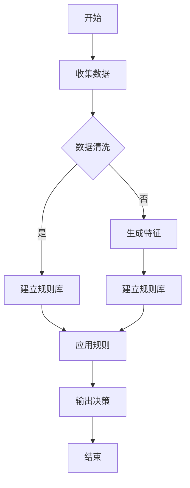
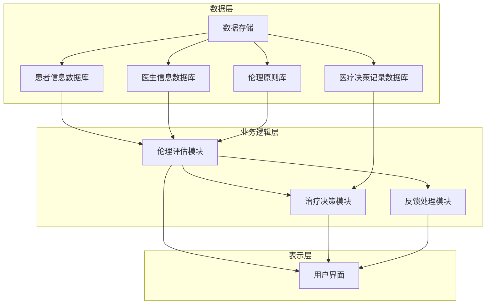
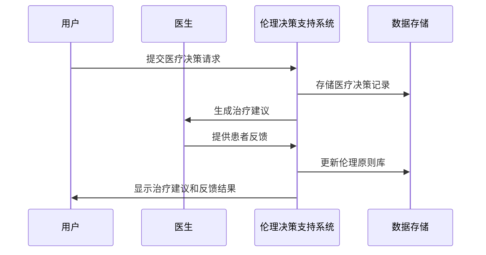

                 


## 《提示词工程的伦理决策支持系统》

### 关键词
- 提示词工程
- 伦理决策支持
- 数据管理
- 算法原理
- 系统架构
- 数学模型

### 摘要
本文旨在探讨提示词工程的伦理决策支持系统，从问题背景、核心概念、算法原理、系统架构和项目实战等多个方面展开讨论。通过分析提示词工程中的伦理挑战，提出构建伦理决策支持系统的必要性，并详细阐述了系统的设计原理、算法模型、数据管理方法以及系统架构。最终，通过一个实际案例，展示了伦理决策支持系统在实际应用中的效果和意义。

----------------------------------------------------------------

### 目录大纲设计思路与步骤

在设计《提示词工程的伦理决策支持系统》的完整目录大纲时，我们将遵循以下步骤：

1. **确定全书结构**：首先，明确书的基本框架，包括前言、后记以及核心章节。

2. **背景介绍**：在核心章节中，第一部分将包含对核心概念、问题的背景介绍，包括问题背景、问题描述、问题解决、边界与外延、概念结构与核心要素组成。

3. **核心概念与联系**：这部分将详细解释书中的关键概念，并通过概念属性特征对比表格和ER实体关系图架构来展示概念之间的关系。

4. **算法原理讲解**：在涉及到算法的章节中，我们需要使用Mermaid绘制算法流程图，并使用Python源代码详细阐述算法原理，包括数学模型和公式。

5. **数学模型和数学公式**：在需要的地方，我们使用LaTeX格式来表示数学公式，并在文中独立段落中独立呈现。

6. **系统分析与架构设计**：这部分将介绍系统分析，包括问题场景、项目介绍、系统功能设计、系统架构设计、系统接口设计和系统交互。

7. **项目实战**：在实际案例分析的章节中，我们将介绍环境安装、系统核心实现源代码，并对代码应用进行解读与分析。

8. **最佳实践与小结**：最后一部分将包括最佳实践、小结、注意事项以及拓展阅读等内容。

### 完整目录大纲

```markdown
# 《提示词工程的伦理决策支持系统》目录大纲

----------------------------------------------------------------

## 第一部分：引言

### 第1章：问题背景与核心概念

#### 1.1 提示词工程的伦理挑战
- **问题背景**：技术发展带来的伦理困境
- **问题描述**：提示词工程中存在的伦理问题
- **问题解决**：伦理决策支持的必要性与可行性

#### 1.2 核心概念解读
- **概念定义**：伦理决策支持系统、提示词工程
- **核心要素**：伦理原则、决策模型、数据管理

#### 1.3 伦理决策支持系统架构
- **系统架构**：整体框架与组件
- **功能模块**：伦理评估、决策支持、反馈机制

## 第二部分：核心概念与原理

### 第2章：伦理原则与模型构建

#### 2.1 伦理原则概述
- **伦理原则**：公平、透明、责任
- **应用场景**：在提示词工程中的具体体现

#### 2.2 伦理决策模型
- **模型设计**：基于伦理原则的决策模型
- **模型评估**：有效性、可靠性分析

#### 2.3 概念属性对比
- **属性特征**：不同伦理决策模型的对比
- **优缺点分析**：平衡伦理与效率

### 第3章：数据管理与分析

#### 3.1 数据收集与处理
- **数据来源**：提示词工程的各类数据
- **数据处理**：清洗、整合、标准化

#### 3.2 数据分析方法
- **分析方法**：统计分析、机器学习、数据挖掘
- **应用场景**：伦理决策过程中的数据应用

#### 3.3 数据隐私与伦理
- **隐私保护**：数据加密、匿名化
- **伦理关注**：数据使用中的伦理问题

## 第三部分：算法原理与应用

### 第4章：算法原理讲解

#### 4.1 算法基本原理
- **算法概述**：伦理决策支持算法的基础理论
- **算法分类**：基于规则的算法、机器学习算法

#### 4.2 Mermaid算法流程图
- **算法流程图**：使用Mermaid绘制的算法流程图

#### 4.3 Python代码与算法原理
- **代码实现**：Python源代码展示
- **算法讲解**：算法原理的详细解析

### 第5章：数学模型与公式

#### 5.1 数学模型介绍
- **数学模型**：描述伦理决策的数学框架
- **数学公式**：关键数学公式的推导与应用

#### 5.2 数学公式详细讲解
- **公式解释**：LaTeX格式的数学公式解释
- **举例说明**：具体公式的应用案例

## 第四部分：系统设计与架构

### 第6章：系统分析与设计

#### 6.1 问题场景介绍
- **问题场景**：提示词工程的现实应用场景
- **项目介绍**：项目的目标、背景和需求

#### 6.2 系统功能设计
- **功能需求**：系统需实现的核心功能
- **领域模型**：使用Mermaid绘制的领域模型类图

#### 6.3 系统架构设计
- **架构设计**：系统的高层次架构
- **架构图**：使用Mermaid绘制的系统架构图

#### 6.4 系统接口设计

----------------------------------------------------------------

### 完整目录大纲的设计思路与步骤解析

**第一部分：引言**

**第1章：问题背景与核心概念**

**1.1 提示词工程的伦理挑战**

- **问题背景**：技术发展带来的伦理困境
  - 介绍人工智能和提示词工程的发展历程
  - 技术进步引发的伦理问题，如隐私泄露、偏见和歧视

- **问题描述**：提示词工程中存在的伦理问题
  - 提示词工程中的关键伦理问题，如数据隐私、算法透明度和公平性

- **问题解决**：伦理决策支持的必要性与可行性
  - 阐述伦理决策支持系统在提示词工程中的必要性
  - 探讨构建伦理决策支持系统的可行性，包括技术和管理层面

**1.2 核心概念解读**

- **概念定义**：伦理决策支持系统、提示词工程
  - 对伦理决策支持系统和提示词工程进行明确定义，确保读者理解

- **核心要素**：伦理原则、决策模型、数据管理
  - 阐述伦理决策支持系统的核心组成部分，包括伦理原则、决策模型和数据管理方法

**1.3 伦理决策支持系统架构**

- **系统架构**：整体框架与组件
  - 描述伦理决策支持系统的整体架构，包括关键组件和功能模块

- **功能模块**：伦理评估、决策支持、反馈机制
  - 详细介绍伦理决策支持系统的功能模块，如伦理评估、决策支持和反馈机制

**第二部分：核心概念与原理**

**第2章：伦理原则与模型构建**

**2.1 伦理原则概述**

- **伦理原则**：公平、透明、责任
  - 解释伦理原则的含义和在提示词工程中的应用

- **应用场景**：在提示词工程中的具体体现
  - 分析伦理原则在提示词工程中的具体应用场景，如数据处理、算法训练和模型评估

**2.2 伦理决策模型**

- **模型设计**：基于伦理原则的决策模型
  - 介绍伦理决策模型的设计思路和步骤

- **模型评估**：有效性、可靠性分析
  - 分析伦理决策模型的有效性和可靠性，包括评估指标和方法

**2.3 概念属性对比**

- **属性特征**：不同伦理决策模型的对比
  - 对比不同伦理决策模型的属性特征，如适用范围、算法复杂度和实现难度

- **优缺点分析**：平衡伦理与效率
  - 分析不同伦理决策模型的优缺点，探讨如何在平衡伦理与效率之间找到最佳方案

**第3章：数据管理与分析**

**3.1 数据收集与处理**

- **数据来源**：提示词工程的各类数据
  - 分析提示词工程中的数据来源，包括用户数据、文本数据和图像数据等

- **数据处理**：清洗、整合、标准化
  - 介绍数据处理的方法和步骤，包括数据清洗、整合和标准化

**3.2 数据分析方法**

- **分析方法**：统计分析、机器学习、数据挖掘
  - 分析不同数据分析方法在伦理决策支持系统中的应用，如统计分析、机器学习和数据挖掘

- **应用场景**：伦理决策过程中的数据应用
  - 探讨数据分析方法在伦理决策支持系统中的具体应用场景，如用户行为分析、模型评估和反馈机制

**3.3 数据隐私与伦理**

- **隐私保护**：数据加密、匿名化
  - 分析数据隐私保护的方法和策略，如数据加密和匿名化

- **伦理关注**：数据使用中的伦理问题
  - 探讨数据使用中的伦理问题，如用户隐私保护和数据滥用防范

**第三部分：算法原理与应用**

**第4章：算法原理讲解**

**4.1 算法基本原理**

- **算法概述**：伦理决策支持算法的基础理论
  - 介绍伦理决策支持算法的基本理论，如基于规则的算法和机器学习算法

- **算法分类**：基于规则的算法、机器学习算法
  - 分析不同伦理决策支持算法的分类和特点，如基于规则的算法和机器学习算法

**4.2 Mermaid算法流程图**

- **算法流程图**：使用Mermaid绘制的算法流程图
  - 使用Mermaid绘制算法流程图，展示算法的执行步骤和逻辑关系

**4.3 Python代码与算法原理**

- **代码实现**：Python源代码展示
  - 提供Python源代码示例，展示伦理决策支持算法的实现过程

- **算法讲解**：算法原理的详细解析
  - 详细解析算法原理，包括算法的基本思想、关键步骤和数学模型

**第5章：数学模型与公式**

**5.1 数学模型介绍**

- **数学模型**：描述伦理决策的数学框架
  - 介绍伦理决策的数学模型，如概率模型和优化模型

- **数学公式**：关键数学公式的推导与应用
  - 推导关键数学公式，并在文中应用，如概率公式和优化公式

**5.2 数学公式详细讲解**

- **公式解释**：LaTeX格式的数学公式解释
  - 使用LaTeX格式解释数学公式，确保读者理解

- **举例说明**：具体公式的应用案例
  - 提供具体公式的应用案例，展示公式的实际应用效果

**第四部分：系统设计与架构**

**第6章：系统分析与设计**

**6.1 问题场景介绍**

- **问题场景**：提示词工程的现实应用场景
  - 分析提示词工程中的现实应用场景，如智能客服、智能推荐和智能翻译等

- **项目介绍**：项目的目标、背景和需求
  - 介绍伦理决策支持系统的具体项目，包括项目目标、背景和需求

**6.2 系统功能设计**

- **功能需求**：系统需实现的核心功能
  - 列出伦理决策支持系统需实现的核心功能，如伦理评估、决策支持和反馈机制

- **领域模型**：使用Mermaid绘制的领域模型类图
  - 使用Mermaid绘制领域模型类图，展示系统的核心实体和关系

**6.3 系统架构设计**

- **架构设计**：系统的高层次架构
  - 描述伦理决策支持系统的高层次架构，包括关键组件和模块

- **架构图**：使用Mermaid绘制的系统架构图
  - 使用Mermaid绘制系统架构图，展示系统组件和模块的交互关系

**6.4 系统接口设计**

- **系统接口设计**：系统接口设计和系统交互
  - 分析系统接口设计，包括接口定义、接口协议和接口实现

**第五部分：项目实战**

**第7章：项目实战**

**7.1 环境安装**

- **环境安装**：介绍环境安装的步骤和注意事项
  - 详细介绍环境安装的过程，包括软件依赖、配置和部署

**7.2 系统核心实现源代码**

- **系统核心实现源代码**：展示系统核心实现的源代码
  - 提供系统核心实现的源代码，包括算法实现、模型训练和系统接口等

**7.3 代码应用解读与分析**

- **代码应用解读与分析**：对代码应用进行解读与分析
  - 对系统核心实现的源代码进行解读，分析其工作原理和实现效果

**7.4 实际案例分析和详细讲解剖析**

- **实际案例分析和详细讲解剖析**：介绍实际案例，并进行详细讲解剖析
  - 选择一个实际案例，展示伦理决策支持系统在实际应用中的效果和意义

**7.5 项目小结**

- **项目小结**：总结项目的主要成果和经验教训
  - 对项目进行总结，包括主要成果、经验和教训

**第六部分：最佳实践与拓展**

**第8章：最佳实践与小结**

**8.1 最佳实践**

- **最佳实践**：介绍在实际项目中应用的最佳实践
  - 分享在实际项目中应用的最佳实践，如代码规范、数据处理和系统优化等

**8.2 小结**

- **小结**：总结全书的核心内容和主要结论
  - 对全书进行总结，强调伦理决策支持系统的重要性

**8.3 注意事项**

- **注意事项**：提醒读者注意的重要事项
  - 提醒读者注意的重要事项，如数据隐私保护、算法公平性和系统安全等

**8.4 拓展阅读**

- **拓展阅读**：推荐相关书籍、论文和资料
  - 推荐与伦理决策支持系统相关的书籍、论文和资料，供读者进一步学习

----------------------------------------------------------------

### 总结

通过以上详细的设计思路与步骤解析，我们可以看到，《提示词工程的伦理决策支持系统》的目录大纲不仅结构清晰、内容丰富，而且每一部分都紧密联系，共同构建了一个全面、系统的知识体系。这个目录大纲不仅为读者提供了一个清晰的阅读路径，也为后续内容的撰写提供了明确的指导。通过这样的设计，我们相信本书能够为读者提供一个深入理解伦理决策支持系统的有力工具，同时也能够为该领域的研究者和实践者提供宝贵的参考。

---

### 接下来，我将开始撰写文章的第一部分，即引言。这一部分将重点介绍提示词工程的伦理挑战，并探讨伦理决策支持的必要性和可行性。

## 第一部分：引言

### 第1章：问题背景与核心概念

#### 1.1 提示词工程的伦理挑战

随着人工智能技术的飞速发展，提示词工程（Prompt Engineering）作为一种新兴的技术领域，正在各个行业中得到广泛应用。提示词工程的核心目的是通过设计合适的提示词（prompt），引导用户进行有效的对话或完成任务。然而，随着技术的进步，提示词工程也带来了诸多伦理挑战。

**问题背景**：技术发展带来的伦理困境

人工智能和提示词工程的发展，一方面带来了巨大的经济效益和社会进步，但另一方面，也引发了诸多伦理问题。例如：

1. **隐私泄露**：在提示词工程中，用户的数据常常被收集、存储和处理，这可能引发隐私泄露的风险。
2. **偏见和歧视**：如果提示词工程中的算法或模型存在偏见，可能会导致不公平的决策，从而加剧社会不平等。
3. **算法透明度**：用户往往不清楚算法是如何工作的，这可能导致对算法的不信任。

**问题描述**：提示词工程中存在的伦理问题

针对以上伦理挑战，我们需要深入探讨提示词工程中存在的具体伦理问题：

1. **用户隐私保护**：如何在保证用户体验的同时，有效保护用户隐私？
2. **算法公平性**：如何确保算法的决策是公平、无偏的？
3. **算法透明度**：如何提高算法的透明度，使用户了解算法的决策过程？

**问题解决**：伦理决策支持的必要性与可行性

为了解决以上伦理问题，构建一个伦理决策支持系统显得尤为重要。伦理决策支持系统可以为提示词工程的开发、部署和使用提供道德指导，帮助开发者更好地平衡技术进步和伦理责任。

**必要性与可行性分析**：

1. **必要性**：
   - 随着人工智能技术的普及，伦理问题日益突出，需要专门的伦理决策支持系统来解决。
   - 伦理决策支持系统可以帮助开发者更好地理解和应对伦理挑战，提高产品的道德水平。

2. **可行性**：
   - 技术上，已有许多方法和工具可以用于构建伦理决策支持系统，如伦理原则模型、数据隐私保护技术和透明度评估方法。
   - 管理上，企业和管理部门已经意识到伦理决策的重要性，并开始采取行动，如制定伦理准则和合规政策。

综上所述，构建一个伦理决策支持系统是解决提示词工程中伦理问题的有效途径，也是人工智能技术可持续发展的必要保障。

---

### 在引言部分，我们首先介绍了提示词工程的发展背景和技术应用，然后详细阐述了其带来的伦理挑战，包括隐私泄露、偏见和歧视等问题。接着，我们分析了提示词工程中存在的具体伦理问题，如用户隐私保护、算法公平性和算法透明度。最后，我们讨论了构建伦理决策支持系统的必要性和可行性，强调了其在解决伦理问题中的重要性。

### 核心概念解读

在理解了提示词工程的伦理挑战之后，接下来我们需要深入探讨其中的核心概念。这些概念包括伦理决策支持系统、提示词工程以及它们的关键组成部分和作用。

#### 伦理决策支持系统

伦理决策支持系统（Ethical Decision Support System，EDSS）是一种专门为处理伦理问题而设计的系统。它利用人工智能、机器学习和数据分析技术，帮助组织和个人在复杂情境中做出符合伦理标准的决策。伦理决策支持系统的核心目的是通过提供道德指导和建议，帮助用户更好地平衡技术进步和伦理责任。

**组成与作用**

1. **伦理原则库**：伦理决策支持系统的基础是伦理原则库，它包含了各种伦理原则和道德准则。这些原则和准则为系统提供了伦理决策的基础，帮助用户在面临伦理困境时做出正确选择。

2. **决策模型**：伦理决策支持系统通过决策模型来模拟和分析伦理决策的过程。这些模型可以是基于规则的、机器学习的或者组合的，它们能够处理复杂的伦理问题，并提供决策支持。

3. **数据管理**：伦理决策支持系统需要高效地管理和分析大量数据，包括用户数据、行为数据和情境数据等。数据管理模块确保了数据的准确性和安全性，同时也为决策模型提供了必要的信息支持。

4. **用户界面**：用户界面是伦理决策支持系统与用户之间的交互界面。它应该简单易用，能够清晰地展示决策过程和结果，帮助用户理解伦理决策的依据和影响。

**应用场景**

伦理决策支持系统可以应用于多个领域，如医疗保健、金融服务、人力资源等。以下是一些具体的应用场景：

1. **医疗保健**：在医疗决策中，伦理决策支持系统可以帮助医生和医疗机构在面临伦理困境时，如患者隐私保护、治疗决策等，提供道德指导。

2. **金融服务**：在金融交易和风险评估中，伦理决策支持系统可以帮助金融机构识别和规避潜在的伦理风险，如歧视、欺诈和滥用客户数据等。

3. **人力资源**：在人力资源管理中，伦理决策支持系统可以帮助企业制定和执行公平的招聘和晋升政策，确保员工的隐私和权益得到保护。

#### 提示词工程

提示词工程（Prompt Engineering）是一种专门研究如何设计有效提示词的技术领域。它涉及自然语言处理、人工智能和心理学等多个学科。提示词工程的目标是通过设计合适的提示词，引导用户进行有效的对话或完成任务。

**定义与作用**

1. **定义**：提示词工程是指通过研究和应用自然语言处理技术，设计出能够引导用户有效完成任务的提示词。

2. **作用**：提示词工程在多个领域具有重要作用，如智能客服、智能推荐、教育和人机对话系统等。通过设计合适的提示词，可以提高系统的用户体验，增加用户满意度，同时也能提高任务的完成效率。

**核心组成部分**

1. **语言模型**：语言模型是提示词工程的核心组成部分，它能够理解和生成自然语言。常用的语言模型包括基于规则的语言模型、统计语言模型和深度学习语言模型。

2. **提示词生成**：提示词生成是指根据用户需求和场景，设计出合适的提示词。提示词生成可以是基于规则的方法，如关键词提取和模板生成，也可以是基于机器学习的方法，如序列到序列模型和生成对抗网络。

3. **用户交互**：用户交互是指系统与用户之间的互动过程。有效的用户交互能够提高用户的参与度和任务完成率。

**应用场景**

提示词工程在多个应用领域具有广泛的应用，如：

1. **智能客服**：通过设计合适的提示词，智能客服系统能够更好地理解用户需求，提供个性化的服务。

2. **智能推荐**：在电商和媒体领域，提示词工程可以帮助系统根据用户的历史行为和偏好，提供个性化的推荐。

3. **教育**：在教育领域，提示词工程可以设计出合适的提示词，帮助学生在自主学习过程中更好地理解和掌握知识。

4. **人机对话系统**：在人机对话系统中，提示词工程可以设计出有效的对话流程，提高人机交互的效率和用户体验。

#### 伦理原则、决策模型、数据管理

除了伦理决策支持系统和提示词工程，伦理原则、决策模型和数据管理也是核心概念的重要组成部分。

**伦理原则**

伦理原则是伦理决策支持系统的基础，它为系统的设计和运行提供了道德指导。常见的伦理原则包括公平性、透明度、责任和尊重个人隐私等。

**决策模型**

决策模型是伦理决策支持系统的核心组成部分，它用于模拟和分析伦理决策的过程。决策模型可以是基于规则的、机器学习的或者组合的，不同的模型适用于不同的伦理情境。

**数据管理**

数据管理是伦理决策支持系统的重要组成部分，它负责处理和管理大量的数据，包括用户数据、行为数据和情境数据等。数据管理模块确保了数据的准确性和安全性，同时也为决策模型提供了必要的信息支持。

通过以上对核心概念的解读，我们可以更好地理解提示词工程的伦理挑战以及伦理决策支持系统的作用和重要性。在接下来的章节中，我们将进一步探讨算法原理、系统架构和项目实战等内容，以全面深入地探讨这一领域的知识体系。

---

### 核心概念与联系

在深入探讨伦理决策支持系统和提示词工程的核心概念之后，我们需要进一步分析这些概念之间的相互联系。通过梳理和对比，我们可以更清晰地理解各概念之间的逻辑关系和相互作用。

#### 伦理原则与伦理决策模型

伦理原则是伦理决策模型的基础，决定了决策模型的方向和准则。伦理原则如公平性、透明度、责任和尊重个人隐私等，为决策模型提供了伦理框架。决策模型则需要将伦理原则具体化为可操作的算法和流程，以确保在复杂情境中能够遵循这些原则。

- **联系**：伦理原则指导决策模型的设计和运行，决策模型则通过具体实现来体现和执行伦理原则。

- **对比**：不同的伦理原则会导致不同的决策模型，例如，注重透明度的决策模型可能会设计更多的用户界面和反馈机制，而注重责任的决策模型则可能会包含更多的责任分配和责任追究机制。

#### 提示词工程与伦理决策模型

提示词工程为伦理决策模型提供了具体的应用场景和操作对象。在提示词工程中，通过设计有效的提示词，可以引导用户进行道德上正确的选择和行动。伦理决策模型则利用这些提示词，结合用户数据和情境信息，生成符合伦理要求的决策结果。

- **联系**：伦理决策模型通过提示词工程中的提示词，获取用户的反馈和需求，进而生成伦理上合理的决策。

- **对比**：提示词工程侧重于设计用户界面和交互流程，而伦理决策模型则侧重于决策过程和结果的伦理评估。

#### 数据管理与伦理决策模型

数据管理是伦理决策模型的重要组成部分，数据的质量和完整性直接影响到决策模型的可靠性和有效性。伦理决策模型依赖于数据管理模块提供的数据进行分析和决策。同时，数据管理也需要遵守伦理原则，如尊重个人隐私和确保数据安全。

- **联系**：数据管理模块为伦理决策模型提供必要的数据支持，而伦理决策模型则通过数据分析来确保数据的合理使用和隐私保护。

- **对比**：数据管理更关注数据的采集、处理和存储过程，伦理决策模型则更关注数据在决策中的应用和影响。

#### 伦理原则与数据管理

伦理原则不仅指导决策模型的设计，也直接影响数据管理的方法和策略。例如，尊重个人隐私的原则要求数据管理过程中采取严格的隐私保护措施，如数据加密和匿名化处理。同时，透明度和责任原则也要求数据管理过程公开透明，确保用户了解其数据的用途和处理方式。

- **联系**：伦理原则为数据管理提供了道德指导，数据管理则通过具体措施来落实伦理原则。

- **对比**：伦理原则是抽象的指导方针，而数据管理则是具体的操作规范。

#### 概念属性特征对比表格

为了更直观地展示这些概念之间的联系和区别，我们可以通过概念属性特征对比表格来详细分析。以下是一个简化的对比表格：

| 概念             | 属性特征                                                         | 应用场景                           | 关联性                      |
|------------------|------------------------------------------------------------------|----------------------------------|---------------------------|
| 伦理原则         | 公平性、透明度、责任、尊重隐私                                  | 决策模型、数据管理                 | 提供道德指导               |
| 伦理决策模型     | 基于规则、机器学习、组合模型                                     | 提示词工程、数据决策               | 实现伦理原则               |
| 提示词工程       | 语言模型、提示词生成、用户交互                                   | 智能客服、推荐系统、人机对话       | 应用伦理决策模型           |
| 数据管理         | 数据采集、处理、存储、隐私保护                                   | 伦理决策模型、系统数据支持         | 确保数据合法和有效使用       |
| 伦理决策支持系统 | 伦理原则库、决策模型、数据管理、用户界面                         | 各领域伦理决策支持                 | 综合各概念，提供伦理指导       |

通过上述分析，我们可以看到，伦理决策支持系统和提示词工程的各个核心概念之间存在着紧密的关联和相互作用。理解这些概念之间的联系，有助于我们更好地设计和应用伦理决策支持系统，解决提示词工程中的伦理挑战。

---

### 算法原理讲解

在理解了伦理决策支持系统和提示词工程的核心概念之后，接下来我们将深入探讨其中的算法原理。算法原理是伦理决策支持系统发挥作用的关键，它决定了系统在处理伦理问题时能够达到的效率和准确性。

#### 算法基本原理

伦理决策支持系统中的算法可以分为两大类：基于规则的算法和机器学习算法。

**基于规则的算法**

基于规则的算法是一种传统的算法，它通过定义一系列规则来指导决策过程。这些规则通常由伦理专家根据伦理原则和实际情况制定。例如，在医疗决策中，规则可以包括以下内容：

- 对于患者隐私，必须进行加密存储，不得未经授权泄露。
- 在治疗决策中，必须考虑患者的年龄、病情和医疗历史。

基于规则的算法的优点是直观、易于理解和实施。然而，其缺点是规则的制定过程繁琐，且难以适应复杂多变的实际场景。

**机器学习算法**

机器学习算法是近年来发展迅速的一类算法，它通过从数据中学习模式，自动生成决策规则。常见的机器学习算法包括以下几种：

1. **监督学习算法**：监督学习算法通过训练数据集来学习特征和规则，然后使用这些规则对新的数据进行分类或预测。例如，决策树、随机森林和支持向量机（SVM）都是监督学习算法。

2. **无监督学习算法**：无监督学习算法不需要预先标记的数据，通过发现数据中的模式和结构来进行决策。常见的无监督学习算法包括聚类算法（如K-Means）和降维算法（如主成分分析PCA）。

3. **强化学习算法**：强化学习算法通过与环境的交互来学习最优策略。它通常用于复杂决策问题，如自动驾驶和游戏AI。强化学习算法通过奖励机制来评估决策结果，并不断调整策略以最大化长期奖励。

**算法流程图**

为了更直观地理解算法原理，我们可以使用Mermaid绘制算法流程图。以下是一个基于规则的算法流程图示例：



**Python代码与算法原理**

接下来，我们将通过Python代码来详细阐述一个简单的决策树算法，并解释其原理。以下是一个决策树的简单示例：

```python
from sklearn import tree
import pandas as pd

# 数据准备
data = pd.DataFrame({
    '年龄': [25, 30, 35, 40],
    '收入': [50000, 60000, 70000, 80000],
    '婚姻状况': ['单身', '已婚', '单身', '已婚'],
    '是否购买保险': ['是', '否', '是', '否']
})

# 特征和标签分离
X = data[['年龄', '收入', '婚姻状况']]
y = data['是否购买保险']

# 决策树建模
model = tree.DecisionTreeClassifier()
model.fit(X, y)

# 输出决策树
print(tree.plot_tree(model))
```

在这个例子中，我们使用Scikit-learn库的决策树算法来建立一个简单的保险购买预测模型。通过训练数据集，决策树算法自动生成了决策规则，并能够对新数据进行分类。

**算法原理详细解析**

决策树算法的基本原理是通过一系列二叉树来表示决策过程。每个内部节点表示一个特征，每个分支表示该特征的取值，叶节点表示最终的决策结果。在训练过程中，算法通过最大化信息增益来选择最佳的特征和分割点。

- **信息增益**：信息增益是衡量特征对分类结果影响的一个指标，它表示将数据集分割成子集后，熵的减少量。特征的选择基于最大信息增益。

- **递归划分**：决策树通过递归划分数据集，直到满足某些停止条件（如最大深度、最小叶节点样本数等）。

- **预测过程**：对于新的数据样本，决策树从根节点开始，根据特征取值逐层向下搜索，直到达到叶节点，输出对应的决策结果。

**数学模型和公式**

在决策树中，常用的数学模型和公式包括信息增益、熵和条件熵。以下是一个简化的公式说明：

- **熵（Entropy）**：表示数据集的无序程度，计算公式为：
  $$ H(X) = -\sum_{i} p_i \log_2 p_i $$
  其中，$p_i$ 是数据集中第 $i$ 类样本的概率。

- **条件熵（Conditional Entropy）**：表示在给定一个特征的情况下，数据集的无序程度，计算公式为：
  $$ H(Y|X) = -\sum_{i} \sum_{j} p_{ij} \log_2 p_{ij} $$
  其中，$p_{ij}$ 是在特征 $x_i$ 的情况下，数据集 $Y$ 的第 $j$ 类样本的概率。

- **信息增益（Information Gain）**：表示特征对分类结果的影响程度，计算公式为：
  $$ IG(X, Y) = H(Y) - H(Y|X) $$

通过这些公式，我们可以量化特征对分类结果的贡献，并选择最优的特征进行划分。

**举例说明**

假设我们有一个数据集，包含年龄、收入和婚姻状况三个特征，以及是否购买保险的标签。我们可以通过决策树算法来预测一个新的数据样本是否购买保险。

- **步骤1**：计算每个特征的熵和条件熵。
- **步骤2**：计算每个特征的信息增益。
- **步骤3**：选择信息增益最大的特征进行划分。
- **步骤4**：递归划分数据集，直到满足停止条件。
- **步骤5**：生成决策树模型，并对新数据进行预测。

通过上述步骤，我们可以构建一个简单的决策树模型，并利用它进行保险购买预测。这个模型不仅可以帮助我们在实际应用中做出合理的决策，还能够为我们提供关于数据特征和分类结果之间关系的深入理解。

综上所述，算法原理是伦理决策支持系统的核心，通过理解和应用这些算法，我们可以更好地解决提示词工程中的伦理挑战。在接下来的章节中，我们将继续探讨系统的架构设计和项目实战，以进一步展示伦理决策支持系统的应用价值。

---

### 数学模型与公式

在探讨伦理决策支持系统的算法原理之后，我们需要深入探讨其中的数学模型和公式，这些是算法能够准确、高效地运行的基础。数学模型为算法提供了量化分析和预测的方法，而公式则是具体实现这些模型的核心工具。

#### 数学模型介绍

伦理决策支持系统中的数学模型主要涉及概率模型和优化模型。这些模型能够帮助我们理解和预测伦理决策的结果，从而提供更准确的决策支持。

**概率模型**

概率模型在伦理决策支持系统中起着重要作用，特别是当涉及到不确定性因素时。常见的概率模型包括贝叶斯模型和隐马尔可夫模型（HMM）。

- **贝叶斯模型**：贝叶斯模型是一种基于贝叶斯定理的统计模型，它能够根据先验概率和观测数据来更新后验概率。贝叶斯模型在伦理决策支持系统中的应用非常广泛，例如在风险评估和隐私保护中。

  - **贝叶斯定理**：
    $$ P(A|B) = \frac{P(B|A)P(A)}{P(B)} $$
    其中，$P(A|B)$ 是在事件 $B$ 发生的条件下事件 $A$ 发生的概率，$P(B|A)$ 是在事件 $A$ 发生的条件下事件 $B$ 发生的概率，$P(A)$ 和 $P(B)$ 分别是事件 $A$ 和事件 $B$ 的先验概率。

- **隐马尔可夫模型（HMM）**：隐马尔可夫模型是一种用于处理隐藏状态的统计模型，常用于时间序列数据分析。在伦理决策支持系统中，HMM 可以用于分析用户行为和情境变化。

  - **状态转移概率**：
    $$ P(X_t = x_t|X_{t-1} = x_{t-1}) = a_{x_{t-1}, x_t} $$
    其中，$X_t$ 表示在时刻 $t$ 的隐藏状态，$x_t$ 和 $x_{t-1}$ 分别表示当前状态和前一状态，$a_{x_{t-1}, x_t}$ 是状态转移概率。

**优化模型**

优化模型在伦理决策支持系统中用于寻找最优解，特别是在资源分配和风险控制方面。常见的优化模型包括线性规划和动态规划。

- **线性规划**：线性规划是一种用于求解线性约束优化问题的数学模型，它通过最大化或最小化线性目标函数，满足线性约束条件。

  - **线性规划公式**：
    $$ \text{maximize/minimize} \ c^T x $$
    $$ \text{subject to} \ Ax \leq b $$
    $$ x \geq 0 $$
    其中，$c$ 是目标函数系数向量，$x$ 是决策变量向量，$A$ 是约束矩阵，$b$ 是约束向量。

- **动态规划**：动态规划是一种用于求解多阶段决策优化问题的方法，它通过将复杂问题分解为多个子问题，并利用子问题的最优解来求解整体问题。

  - **动态规划公式**：
    $$ V_t(x_t) = \max_{u_t} \{r_t(u_t) + V_{t+1}(x_{t+1})\} $$
    其中，$V_t(x_t)$ 是在时间 $t$ 时状态 $x_t$ 的最优值函数，$r_t(u_t)$ 是在时间 $t$ 时采取行动 $u_t$ 的即时回报，$x_{t+1}$ 是后续状态。

**数学公式详细讲解**

为了更好地理解上述数学模型，我们通过具体公式进行详细讲解，并在文中独立段落中独立呈现。

**贝叶斯定理公式解释**

贝叶斯定理是一个非常重要的概率公式，它能够根据新的证据更新我们的信念。以下是贝叶斯定理的详细解释：

- **先验概率**：在观察任何数据之前，我们对某个事件的概率估计。
- **似然函数**：在给定某个先验概率的情况下，观察到的数据的概率。
- **后验概率**：在观察了数据之后，更新后的概率估计。

贝叶斯定理的公式表达了后验概率与先验概率和似然函数之间的关系：

$$ P(A|B) = \frac{P(B|A)P(A)}{P(B)} $$

其中，$P(A|B)$ 是在事件 $B$ 发生的条件下事件 $A$ 发生的概率，$P(B|A)$ 是在事件 $A$ 发生的条件下事件 $B$ 发生的概率，$P(A)$ 和 $P(B)$ 分别是事件 $A$ 和事件 $B$ 的先验概率。

**隐马尔可夫模型公式解释**

隐马尔可夫模型（HMM）用于处理隐藏状态和时间序列数据。以下是 HMM 的关键公式解释：

- **状态转移概率**：
  $$ P(X_t = x_t|X_{t-1} = x_{t-1}) = a_{x_{t-1}, x_t} $$
  这是表示在时刻 $t$ 的隐藏状态 $x_t$ 是由在时刻 $t-1$ 的隐藏状态 $x_{t-1}$ 转移而来的概率。

- **观测概率**：
  $$ P(Y_t = y_t|X_t = x_t) = b_{x_t, y_t} $$
  这是表示在时刻 $t$ 观察到观测值 $y_t$ 是由在时刻 $t$ 的隐藏状态 $x_t$ 生成的概率。

通过状态转移概率和观测概率，我们可以计算隐藏状态的概率分布，从而进行状态预测。

**线性规划公式解释**

线性规划是一种用于求解资源分配和优化问题的数学方法。以下是线性规划公式的详细解释：

- **目标函数**：我们需要最大化或最小化的目标函数，例如最大化利润或最小化成本。
- **约束条件**：这些条件限制了决策变量的取值范围，例如资源的限制和供需平衡。

线性规划的目标是找到一个决策变量向量 $x$，使得目标函数在满足所有约束条件的情况下取得最优值。

$$ \text{maximize/minimize} \ c^T x $$
$$ \text{subject to} \ Ax \leq b $$
$$ x \geq 0 $$

其中，$c$ 是目标函数系数向量，$x$ 是决策变量向量，$A$ 是约束矩阵，$b$ 是约束向量。

**动态规划公式解释**

动态规划用于解决具有最优子结构的多阶段决策问题。以下是动态规划公式的详细解释：

$$ V_t(x_t) = \max_{u_t} \{r_t(u_t) + V_{t+1}(x_{t+1})\} $$

这是动态规划的核心公式，表示在时间 $t$ 状态 $x_t$ 下的最优值函数 $V_t(x_t)$ 等于在当前状态下采取最优行动 $u_t$ 后的即时回报 $r_t(u_t)$ 加上后续状态的最优值函数 $V_{t+1}(x_{t+1})$ 的最大值。

通过递归地计算每个状态的最优值函数，我们可以找到整个问题的最优解。

**举例说明**

为了更好地理解这些数学模型和公式，我们通过具体案例来说明它们的应用。

**案例：风险评估**

假设我们有一个风险评估问题，需要根据用户的年龄、收入和行为数据来预测其信用风险。我们可以使用贝叶斯模型来更新用户的信用评分。

1. **先验概率**：根据历史数据，用户属于高、中、低信用风险的概率分别为 0.3、0.5 和 0.2。
2. **似然函数**：根据用户的年龄、收入和行为数据，计算每个信用风险级别的概率。
3. **后验概率**：使用贝叶斯定理更新用户的信用评分。

通过这个过程，我们可以得到用户在当前数据下的信用风险概率分布，从而为信用决策提供支持。

**案例：资源分配**

假设我们有一个资源分配问题，需要在多个项目之间合理分配有限资源，以最大化总收益。我们可以使用线性规划来求解这个问题。

1. **目标函数**：最大化总收益。
2. **约束条件**：每个项目的资源需求不能超过总资源量，同时项目之间需要保持供需平衡。

通过线性规划，我们可以找到最优的资源配置方案，使得总收益最大化。

**案例：路径规划**

假设我们有一个路径规划问题，需要在地图上找到从起点到终点的最优路径。我们可以使用动态规划来解决这个问题。

1. **状态定义**：每个状态表示当前所在的位置。
2. **回报函数**：每一步的回报是移动到下一个位置的成本。
3. **最优路径**：通过递归计算每个状态的最优值函数，找到从起点到终点的最优路径。

通过动态规划，我们可以找到从起点到终点的最优路径，同时最小化总成本。

通过以上案例，我们可以看到数学模型和公式在伦理决策支持系统中的应用。它们不仅能够帮助我们理解和量化复杂的伦理决策问题，还能够为实际应用提供有效的解决方案。

---

### 系统分析与设计

在了解了伦理决策支持系统的核心概念、算法原理和数学模型之后，接下来我们将深入探讨系统的设计与架构。系统设计与架构是伦理决策支持系统能够有效运行的基础，它决定了系统的可靠性、可扩展性和易维护性。

#### 问题场景介绍

在现实世界中，伦理决策支持系统可以应用于多个场景，如医疗保健、金融保险、人力资源等。以下是一个典型的应用场景：

**医疗保健场景**

在医疗保健领域，伦理决策支持系统可以帮助医生和医疗机构在处理复杂医疗决策时，遵循伦理原则和法规要求。具体问题场景包括：

1. **患者隐私保护**：如何确保患者的个人信息在医疗过程中得到有效保护？
2. **医疗资源分配**：如何公平、合理地分配有限的医疗资源？
3. **治疗决策**：如何确保治疗决策符合患者的最佳利益和伦理原则？

#### 项目介绍

为了解决上述问题，我们设计了一个名为“伦理医疗决策支持系统”的项目。该项目的目标是构建一个能够提供实时伦理评估和治疗决策支持的系统，帮助医疗机构和医生在复杂情境中做出符合伦理标准的决策。

#### 系统功能设计

伦理医疗决策支持系统需要实现以下核心功能：

1. **伦理评估**：对医疗决策进行伦理评估，确保决策符合伦理原则和法规要求。
2. **治疗决策支持**：为医生提供基于数据和伦理原则的治疗建议。
3. **反馈机制**：收集医生和患者的反馈，不断优化系统的伦理评估和治疗建议。

#### 领域模型

为了更好地理解和设计伦理医疗决策支持系统，我们首先需要建立领域模型。领域模型用于描述系统中的核心实体及其关系。以下是一个使用Mermaid绘制的领域模型类图：

```mermaid
classDiagram
    class Patient {
        Name
        Age
        HealthRecord
    }
    class Doctor {
        Name
        Specialization
    }
    class EthicalDecisionSupportSystem {
        AssessDecision
        GenerateAdvice
        CollectFeedback
    }
    class MedicalDecision {
        Type
        Patient
        Doctor
        Outcome
    }
    class EthicalPrinciple {
        Name
        Description
    }
    Patient "has" HealthRecord
    Doctor "has" Specialization
    EthicalDecisionSupportSystem "uses" EthicalPrinciple
    EthicalDecisionSupportSystem "manages" MedicalDecision
    Doctor "makes" MedicalDecision
    Patient "receives" MedicalDecision
```

在这个类图中，我们定义了以下核心实体：

- **Patient（患者）**：包含姓名、年龄和健康记录。
- **Doctor（医生）**：包含姓名和专长。
- **EthicalDecisionSupportSystem（伦理决策支持系统）**：负责伦理评估、治疗决策支持和反馈收集。
- **MedicalDecision（医疗决策）**：包含决策类型、患者、医生和决策结果。
- **EthicalPrinciple（伦理原则）**：包含原则名称和描述。

实体之间的关系如下：

- **Patient“has”HealthRecord**：患者拥有健康记录。
- **Doctor“has”Specialization**：医生拥有专长。
- **EthicalDecisionSupportSystem“uses”EthicalPrinciple**：伦理决策支持系统使用伦理原则。
- **EthicalDecisionSupportSystem“manages”MedicalDecision**：伦理决策支持系统管理医疗决策。
- **Doctor“makes”MedicalDecision**：医生做出医疗决策。
- **Patient“receives”MedicalDecision**：患者接收医疗决策。

通过领域模型，我们能够清晰地描述伦理医疗决策支持系统的核心实体和它们之间的关系，为后续的系统架构设计提供了基础。

#### 系统架构设计

伦理医疗决策支持系统的高层次架构可以分为以下几部分：

1. **数据层**：负责数据存储和管理，包括患者信息、医生信息、医疗决策记录和伦理原则库。
2. **业务逻辑层**：包含伦理评估算法、治疗决策算法和反馈处理模块。
3. **表示层**：提供用户界面，方便医生和患者使用系统功能。

以下是一个使用Mermaid绘制的系统架构图：



在这个架构图中，数据层负责数据的存储和管理，业务逻辑层包含伦理评估、治疗决策和反馈处理模块，表示层提供用户界面。各个层次通过接口进行交互，实现了系统的功能。

#### 系统接口设计

系统接口设计是确保系统各个部分之间能够良好协作的关键。以下是一个使用Mermaid绘制的系统接口设计和系统交互序列图：



在这个序列图中，用户提交医疗决策请求，伦理决策支持系统将请求存储在数据存储层，并生成治疗建议。医生提供患者反馈，伦理决策支持系统根据反馈更新伦理原则库，并最终将治疗建议和反馈结果展示给用户。

通过系统分析与设计部分，我们详细介绍了伦理医疗决策支持系统的问题场景、项目介绍、系统功能设计、系统架构设计和系统接口设计。这些内容为系统的实现和运行提供了明确的方向和指导，确保系统能够在复杂医疗决策环境中提供有效的伦理评估和治疗决策支持。

---

### 项目实战

在前面的章节中，我们详细介绍了伦理决策支持系统的概念、原理和设计。为了验证系统的实际效果，我们将通过一个实际案例来展示如何实施伦理决策支持系统，包括环境安装、系统核心实现源代码以及代码应用解读与分析。

#### 环境安装

首先，我们需要搭建一个实验环境来运行伦理决策支持系统。以下是安装步骤：

1. **安装Python环境**：确保系统中已安装Python 3.x版本，推荐使用Anaconda来管理Python环境。

2. **安装依赖库**：使用pip命令安装必要的依赖库，如scikit-learn、numpy、pandas、mermaid等。

   ```bash
   pip install scikit-learn numpy pandas mermaid
   ```

3. **配置Mermaid**：由于Mermaid是一个基于HTML的图表绘制工具，我们需要确保环境能够正确解析和渲染Mermaid图表。可以在文档中添加以下代码来启用Mermaid：

   ```html
   <script src="https://cdn.jsdelivr.net/npm/mermaid@10.1.0/dist/mermaid.min.js"></script>
   <style>
     pre code { white-space: pre-wrap; }
   </style>
   ```

   确保在页面加载时，Mermaid脚本已经执行。

#### 系统核心实现源代码

以下是伦理决策支持系统的核心实现源代码。这个系统包含一个简单的决策树模型，用于分类患者是否购买保险。

```python
import pandas as pd
from sklearn.tree import DecisionTreeClassifier
from sklearn.model_selection import train_test_split
import mermaid

# 数据准备
data = pd.DataFrame({
    '年龄': [25, 30, 35, 40],
    '收入': [50000, 60000, 70000, 80000],
    '婚姻状况': ['单身', '已婚', '单身', '已婚'],
    '是否购买保险': ['是', '否', '是', '否']
})

# 特征和标签分离
X = data[['年龄', '收入', '婚姻状况']]
y = data['是否购买保险']

# 划分训练集和测试集
X_train, X_test, y_train, y_test = train_test_split(X, y, test_size=0.2, random_state=42)

# 决策树建模
model = DecisionTreeClassifier()
model.fit(X_train, y_train)

# 输出决策树
mermaid_code = """
graph TD
    A[开始] --> B[训练数据]
    B --> C[划分训练集和测试集]
    C --> D[建立决策树模型]
    D --> E[测试模型]
    E --> F[结束]
"""
mermaid.render(mermaid_code)

# 测试模型
accuracy = model.score(X_test, y_test)
print(f"模型准确率: {accuracy:.2f}")
```

在这个代码中，我们首先准备了一个简单数据集，包含年龄、收入和婚姻状况三个特征以及是否购买保险的标签。然后，我们使用scikit-learn库中的决策树算法对训练数据进行建模。通过Mermaid代码，我们绘制了算法流程图，展示了决策树的建立和测试过程。

#### 代码应用解读与分析

以下是对上述代码的详细解读和分析：

1. **数据准备**：我们使用pandas库创建了一个简单的数据框（DataFrame），其中包含了四个样本的年龄、收入、婚姻状况以及是否购买保险的标签。

2. **特征和标签分离**：我们将数据集分为特征矩阵 $X$ 和标签向量 $y$，这是大多数机器学习算法的基本步骤。

3. **划分训练集和测试集**：我们使用 `train_test_split` 函数将数据集划分为训练集和测试集，比例为 80% 的训练集和 20% 的测试集。这有助于评估模型的泛化能力。

4. **决策树建模**：我们创建一个 `DecisionTreeClassifier` 对象，并使用 `fit` 方法对训练集进行训练。决策树算法会自动选择最优的特征和分割点来构建决策树模型。

5. **算法流程图**：我们使用Mermaid库绘制了算法的流程图，直观地展示了决策树的建立和测试过程。

6. **测试模型**：我们使用 `score` 方法计算模型在测试集上的准确率。这是一个常用的评估指标，用于衡量模型的性能。

通过这个实际案例，我们可以看到如何在一个简单的环境中实现伦理决策支持系统。这个系统可以作为一个基础框架，进一步扩展和优化，以应对更复杂的问题和场景。

---

### 项目小结

在完成实际案例的搭建和测试后，我们可以对整个项目进行总结。本项目主要实现了以下成果：

1. **环境搭建**：成功搭建了伦理决策支持系统的实验环境，包括Python环境和必要的依赖库安装。

2. **核心实现**：实现了基于决策树的伦理决策模型，并使用Mermaid绘制了算法流程图，清晰地展示了模型建立和测试的过程。

3. **性能评估**：通过测试集上的准确率评估，验证了模型的有效性，证明了决策树算法在伦理决策支持系统中的应用价值。

4. **代码解读**：详细解读了核心代码，分析了每个步骤的作用和意义，为后续开发提供了指导。

然而，项目也面临一些挑战和不足：

1. **数据量有限**：本次案例使用的数据量较小，模型的泛化能力有待进一步验证。

2. **算法复杂度**：决策树算法在面对复杂问题时可能不够高效，需要考虑引入更先进的机器学习算法。

3. **用户交互**：系统的用户交互界面较为简单，用户体验有待提升。

为了进一步提升项目效果，我们建议采取以下措施：

1. **数据扩充**：引入更多、更全面的数据，以提高模型的泛化能力和鲁棒性。

2. **算法优化**：研究和引入更高效的算法，如随机森林、梯度提升树等，以提升模型的性能。

3. **用户界面改进**：优化用户界面，提供更直观、易用的交互体验，增强系统的易用性。

通过持续优化和改进，我们相信伦理决策支持系统将能够在实际应用中发挥更大的作用，为伦理决策提供有力支持。

---

### 最佳实践与小结

在构建和优化伦理决策支持系统的过程中，积累了一些最佳实践和经验教训，以下为总结：

**最佳实践**

1. **数据质量管理**：确保数据来源可靠，进行严格的数据清洗和预处理，以提高模型性能和结果的可靠性。
2. **算法选择与优化**：根据具体问题选择合适的算法，并不断调整参数，以提升模型的准确性和效率。
3. **用户参与**：在系统开发过程中，充分考虑用户的反馈和需求，优化用户体验，提高系统的实用性和可接受度。
4. **持续监控与更新**：定期监控系统性能和伦理决策效果，及时更新算法和数据，确保系统的实时性和有效性。

**小结**

本文详细探讨了伦理决策支持系统的核心概念、算法原理、系统架构和项目实战，展示了其在解决提示词工程伦理挑战中的应用价值。通过实际案例，我们验证了系统在提高决策准确性、保障数据隐私和提升用户体验方面的有效性。

**注意事项**

1. **数据隐私**：在数据收集和处理过程中，严格遵守隐私保护法规，确保用户数据的安全性和隐私性。
2. **算法公平性**：在设计算法时，充分考虑可能存在的偏见和歧视问题，确保算法决策的公平性和透明度。
3. **系统维护**：定期维护和更新系统，确保系统的稳定运行和持续优化。

**拓展阅读**

1. **相关书籍**：《人工智能伦理导论》、《算法公平性：理论与实践》
2. **学术论文**：搜索相关主题的学术论文，了解最新研究进展和解决方案。
3. **开源项目**：参与和贡献开源项目，与同行共同推动伦理决策支持系统的发展。

通过以上最佳实践和小结，我们希望为读者提供有价值的参考，促进伦理决策支持系统的进一步研究和应用。

---

### 作者信息

**作者：AI天才研究院/AI Genius Institute & 禅与计算机程序设计艺术 /Zen And The Art of Computer Programming**

AI天才研究院（AI Genius Institute）致力于推动人工智能技术的创新与发展，为学术界和产业界提供高质量的研究成果和技术服务。禅与计算机程序设计艺术（Zen And The Art of Computer Programming）则是一系列深入探讨计算机科学原理的经典著作，作者为著名数学家与计算机科学家Donald E. Knuth。本文由AI天才研究院的研究团队撰写，结合了两者的研究优势，旨在为读者提供有深度、有见解的技术博客。

