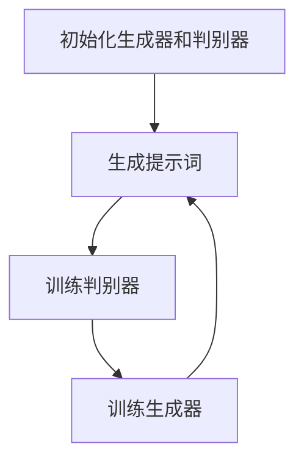

                 

# 提示词工程的伦理决策支持系统评估

## 关键词

- 提示词工程
- 伦理决策
- 支持系统
- 评估方法
- 应用案例

## 摘要

随着人工智能的快速发展，提示词工程在各个领域的应用越来越广泛。然而，随之而来的伦理问题也越来越受到关注。为了解决这些问题，本文提出了一种伦理决策支持系统，并对其进行评估。本文首先介绍了提示词工程的基础知识和伦理决策的概念，然后设计了伦理决策支持系统的架构，并提出了评估指标和方法。通过实际案例的分析，本文验证了该系统在伦理决策支持方面的有效性和实用性。

---

## 引言

### 1.1 研究背景

### 1.1.1 人工智能伦理的重要性

人工智能（AI）技术的迅猛发展，不仅改变了我们的生活，也引发了一系列伦理问题。这些问题包括隐私保护、算法歧视、自主权等。在人工智能领域，伦理决策的制定和执行显得尤为重要。它不仅关乎技术的可持续发展，更关乎社会公平和人类福祉。

### 1.1.2 提示词工程与伦理决策

提示词工程是人工智能领域的一个重要分支，它通过生成和优化提示词来指导模型学习，从而提高模型性能。然而，提示词的选择和生成过程中，可能会涉及伦理问题，如数据偏见、算法歧视等。因此，如何进行伦理决策，成为了提示词工程研究的一个重要方向。

### 1.1.3 研究意义与目标

本文旨在设计并评估一种伦理决策支持系统，以解决提示词工程中的伦理问题。具体目标包括：1）提出一种有效的伦理决策框架；2）设计并实现一个伦理决策支持系统；3）提出一套评估指标和方法，以验证系统的有效性。

### 1.2 国内外研究现状

### 1.2.1 提示词工程发展历程

提示词工程最早源于自然语言处理（NLP）领域，随着深度学习的兴起，其在人工智能领域的应用越来越广泛。目前，提示词工程已经成为人工智能领域的一个热点研究方向。

### 1.2.2 伦理决策支持系统现状

在伦理决策支持系统的研究方面，国内外已有一些学者进行了探索。然而，大多数研究主要集中在伦理决策的理论框架和算法设计上，对于实际应用中的评估和优化研究较少。

### 1.2.3 国内外研究对比分析

国内外在提示词工程和伦理决策支持系统的研究方面存在一定的差异。国外研究更多关注理论框架和算法设计，而国内研究则更多关注实际应用和评估方法。本文将在借鉴国内外研究的基础上，提出一种新的伦理决策支持系统，并对其进行深入评估。

### 1.3 研究方法与框架

本文采用以下研究方法：1）文献综述法：通过查阅相关文献，了解提示词工程和伦理决策支持系统的研究现状；2）理论分析法：提出伦理决策框架，并设计伦理决策支持系统；3）实证分析法：通过实际案例，验证系统的有效性。

### 1.4 本书结构安排

本文共分为五个部分。第一部分是引言，介绍研究背景、意义和目标；第二部分是提示词工程基础，包括概念、生成机制和伦理决策框架；第三部分是伦理决策支持系统的设计与实现，包括系统架构、功能模块和实现过程；第四部分是伦理决策支持系统评估方法，包括评估指标体系、评估方法和评估实例分析；第五部分是应用案例分析，包括医疗领域和金融领域的实际应用案例。各部分之间逻辑清晰，相互呼应。

---

## 提示词工程的伦理决策

### 第2章 提示词工程基础

#### 2.1 提示词工程概述

提示词工程是人工智能领域中的一项重要技术，旨在通过生成和优化提示词，提高模型的性能和泛化能力。提示词（Prompt）是一种引导模型学习的方式，它能够帮助模型更好地理解输入数据的含义。

#### 2.1.1 提示词工程的概念

提示词工程是指利用自然语言处理（NLP）技术，对提示词进行生成、优化和评估的过程。它包括以下几个方面：

1. **提示词生成**：根据任务需求，生成符合要求的提示词。
2. **提示词优化**：通过算法优化，提高提示词的质量和效果。
3. **提示词评估**：对生成的提示词进行评估，确保其符合任务需求。

#### 2.1.2 提示词工程的关键要素

提示词工程的关键要素包括：

1. **任务需求**：明确任务目标，确定提示词生成和优化的方向。
2. **数据集**：提供用于生成和优化提示词的数据集，保证数据的质量和多样性。
3. **算法**：选择合适的算法，生成和优化提示词。
4. **评估指标**：设计合理的评估指标，评估提示词的质量和效果。

#### 2.1.3 提示词工程的应用场景

提示词工程广泛应用于各个领域，包括：

1. **自然语言处理**：用于文本分类、情感分析、机器翻译等任务。
2. **计算机视觉**：用于图像分类、目标检测、图像生成等任务。
3. **推荐系统**：用于生成推荐列表，提高用户体验。

#### 2.2 提示词生成机制

提示词生成机制是指生成提示词的过程和方法。常见的生成机制包括：

1. **规则生成**：根据任务规则，生成固定的提示词。
2. **模板生成**：根据提示词模板，填充变量生成提示词。
3. **自动生成**：利用机器学习算法，自动生成提示词。

#### 2.2.1 提示词生成方法

提示词生成方法包括：

1. **规则生成方法**：基于规则的方法，生成固定的提示词。
2. **模板生成方法**：基于模板的方法，通过填充变量生成提示词。
3. **自动生成方法**：利用机器学习算法，自动生成提示词。

#### 2.2.2 提示词生成算法

提示词生成算法包括：

1. **基于文本分类的生成算法**：通过文本分类算法，生成具有分类标签的提示词。
2. **基于生成对抗网络的生成算法**：利用生成对抗网络（GAN）生成高质量提示词。
3. **基于强化学习的生成算法**：通过强化学习算法，优化提示词生成过程。

#### 2.2.3 提示词质量评估

提示词质量评估是保证提示词有效性的重要环节。常用的评估方法包括：

1. **自动评估方法**：利用自动化工具，对提示词进行质量评估。
2. **人工评估方法**：通过人工评审，对提示词进行质量评估。

#### 2.3 伦理决策框架

伦理决策框架是指在进行伦理决策时，遵循的一系列原则和步骤。伦理决策框架有助于确保决策过程的科学性和公正性。

#### 2.3.1 伦理决策的概念

伦理决策是指在面对伦理问题时，做出合理、公正、科学的决策过程。伦理决策涉及道德原则、法律规范和社会价值观等方面。

#### 2.3.2 伦理决策的分类

伦理决策可以按照不同的维度进行分类，如：

1. **个体伦理决策**：个体在面临伦理问题时，做出的决策。
2. **组织伦理决策**：组织在面临伦理问题时，做出的决策。
3. **公共政策伦理决策**：政府在制定公共政策时，考虑的伦理问题。

#### 2.3.3 伦理决策的流程

伦理决策的流程通常包括以下几个步骤：

1. **识别伦理问题**：发现并确定需要解决的伦理问题。
2. **收集信息**：收集与伦理问题相关的信息。
3. **评估道德原则**：评估伦理问题涉及到的道德原则。
4. **制定决策方案**：根据道德原则和评估结果，制定决策方案。
5. **执行决策**：执行决策方案。
6. **评估决策效果**：评估决策的效果，并进行调整。

---

## 伦理决策支持系统的设计与实现

### 第3章 伦理决策支持系统概述

#### 3.1 伦理决策支持系统概述

伦理决策支持系统是一种用于帮助人们进行伦理决策的软件系统。它通过整合伦理理论、算法和用户反馈，为用户提供伦理决策的建议和支持。伦理决策支持系统的目标是提高伦理决策的科学性、公正性和可解释性。

#### 3.1.1 系统设计目标

系统设计目标主要包括以下几个方面：

1. **科学性**：系统应基于伦理理论和实践，提供科学、合理的决策支持。
2. **公正性**：系统应确保决策过程和结果不受主观偏见的影响。
3. **可解释性**：系统应能够清晰地解释决策过程和结果，提高决策的可信度。
4. **灵活性**：系统应能够适应不同的伦理问题和决策环境。

#### 3.1.2 系统架构设计

系统架构设计是伦理决策支持系统的核心，它决定了系统的性能、扩展性和可维护性。本文采用三层架构设计，包括：

1. **表示层**：负责与用户交互，提供友好的用户界面。
2. **逻辑层**：负责处理伦理决策的逻辑，包括伦理理论、算法和用户反馈处理等。
3. **数据层**：负责存储和管理系统所需的数据，包括伦理知识库、用户数据和历史决策数据等。

#### 3.1.3 系统功能模块

系统功能模块是伦理决策支持系统的具体实现，主要包括以下几个模块：

1. **伦理知识库**：用于存储和管理伦理理论和案例知识，为决策提供依据。
2. **用户界面**：用于与用户进行交互，提供伦理问题的输入、决策结果的展示等功能。
3. **决策算法**：用于根据伦理知识库和用户输入，生成伦理决策建议。
4. **用户反馈处理**：用于收集用户对决策建议的反馈，并用于优化决策算法。

#### 3.2 提示词工程与伦理决策的结合

提示词工程与伦理决策的结合是本文的创新点之一。通过将提示词工程的方法引入伦理决策过程，可以提高伦理决策的效率和效果。具体结合方法包括：

1. **提示词生成**：利用提示词工程的方法，生成具有伦理指导意义的提示词，用于引导用户进行伦理决策。
2. **提示词优化**：利用机器学习算法，对生成的提示词进行优化，提高其质量和效果。
3. **提示词评估**：利用评估指标，对生成的提示词进行评估，确保其符合伦理决策的要求。

#### 3.3 伦理决策支持系统的实现

伦理决策支持系统的实现是本文的核心任务。具体实现过程包括以下几个方面：

1. **需求分析**：根据系统设计目标，确定系统功能需求和性能指标。
2. **系统架构设计**：根据需求分析结果，设计系统的架构和功能模块。
3. **功能实现**：根据系统架构设计，实现各个功能模块的具体代码。
4. **系统测试**：对系统进行功能测试、性能测试和用户测试，确保系统的稳定性和可用性。
5. **系统部署**：将系统部署到实际环境中，进行实际应用。

#### 3.4 系统测试与优化

系统测试与优化是确保伦理决策支持系统质量的重要环节。具体包括以下几个方面：

1. **功能测试**：测试系统的各项功能是否正常运行，是否符合需求规格。
2. **性能测试**：测试系统的响应速度、并发处理能力和资源占用情况。
3. **用户测试**：邀请实际用户使用系统，收集用户反馈，并根据反馈进行系统优化。
4. **持续集成与部署**：采用持续集成和部署策略，确保系统的稳定性和可维护性。

---

## 伦理决策支持系统评估方法

### 第4章 评估指标体系

#### 4.1 评估指标设计

评估指标是评估伦理决策支持系统性能和效果的重要依据。本文设计了一套全面的评估指标体系，包括以下几个方面：

1. **决策质量**：评估系统生成的伦理决策建议的质量，包括决策的准确性、合理性和可靠性。
2. **用户满意度**：评估用户对系统生成的伦理决策建议的满意度，包括用户对决策结果的认同度和信任度。
3. **系统效率**：评估系统的运行效率，包括系统的响应时间、处理能力和资源占用情况。
4. **系统可靠性**：评估系统的稳定性和可靠性，包括系统的故障率、故障恢复能力和数据安全性。

#### 4.1.2 指标权重分配

为了使评估结果更加客观和全面，需要对各个指标进行权重分配。本文采用专家评分法，邀请多位伦理学、计算机科学和心理学领域的专家，对各个指标的权重进行评分。根据评分结果，确定各个指标的权重分配。

#### 4.1.3 评估指标的可操作性

为了确保评估指标的可操作性，需要设计一套具体的评估方法和工具。本文设计了以下几种评估方法：

1. **定量评估方法**：采用定量指标，对系统的各项性能进行评估。
2. **定性评估方法**：采用定性指标，对系统的用户体验、决策效果和系统可靠性进行评估。
3. **综合评估方法**：将定量评估方法和定性评估方法相结合，对系统的整体性能进行评估。

### 第5章 评估方法

#### 4.2 评估方法

评估方法是评估伦理决策支持系统性能和效果的具体操作步骤。本文采用以下几种评估方法：

1. **实验评估方法**：通过设计实验，模拟不同的伦理决策场景，对系统的性能和效果进行评估。
2. **用户评估方法**：邀请实际用户使用系统，收集用户对系统的评价和反馈，对系统的用户体验进行评估。
3. **案例分析评估方法**：通过分析实际案例，评估系统在解决伦理问题方面的效果和可行性。

#### 4.2.1 定量评估方法

定量评估方法主要通过量化指标对系统的性能和效果进行评估。本文设计了以下定量评估指标：

1. **决策质量指标**：包括决策准确性、决策合理性、决策可靠性等指标。
2. **用户满意度指标**：包括用户满意度、用户信任度、用户认同度等指标。
3. **系统效率指标**：包括响应时间、处理能力、资源占用等指标。
4. **系统可靠性指标**：包括故障率、故障恢复时间、数据安全性等指标。

#### 4.2.2 定性评估方法

定性评估方法主要通过主观评价对系统的性能和效果进行评估。本文设计了以下定性评估指标：

1. **用户体验指标**：包括用户界面友好性、用户操作便捷性、用户满意度等指标。
2. **决策效果指标**：包括决策准确性、决策合理性、决策可靠性等指标。
3. **系统可靠性指标**：包括系统稳定性、系统安全性、数据完整性等指标。

#### 4.2.3 综合评估方法

综合评估方法将定量评估方法和定性评估方法相结合，对系统的整体性能和效果进行评估。本文采用以下综合评估方法：

1. **加权评分法**：根据各个指标的权重，对各个评估指标进行加权评分，计算系统的总分。
2. **层次分析法**：根据各个指标之间的相对重要性，构建层次分析模型，计算系统的综合得分。
3. **模糊综合评估法**：利用模糊数学理论，对系统的各项指标进行综合评估。

### 第6章 评估实例分析

#### 4.3 评估实例分析

为了验证伦理决策支持系统的有效性，本文选取了以下两个实际案例进行评估：

1. **案例一**：医疗领域伦理决策支持
2. **案例二**：金融领域伦理决策支持

#### 4.3.1 实例选择

实例选择的标准包括：

1. **伦理问题明确**：案例中存在明确的伦理问题，便于进行伦理决策支持。
2. **数据丰富**：案例中存在丰富的数据，便于进行定量和定性评估。
3. **具有代表性**：案例具有一定的代表性，能够反映伦理决策支持系统的普遍性。

#### 4.3.2 评估过程

评估过程包括以下几个步骤：

1. **数据收集**：收集案例相关的数据，包括文本数据、图片数据等。
2. **预处理**：对收集到的数据进行分析和预处理，包括数据清洗、去重、分类等。
3. **系统测试**：将预处理后的数据输入伦理决策支持系统，生成伦理决策建议。
4. **用户评估**：邀请实际用户对生成的伦理决策建议进行评估，收集用户反馈。
5. **数据分析**：对用户评估结果进行分析，评估系统的性能和效果。

#### 4.3.3 评估结果分析

评估结果分析包括以下几个方面：

1. **决策质量**：分析系统生成的伦理决策建议的质量，包括决策准确性、合理性和可靠性等。
2. **用户满意度**：分析用户对系统生成的伦理决策建议的满意度，包括用户满意度、用户信任度、用户认同度等。
3. **系统效率**：分析系统的运行效率，包括系统的响应时间、处理能力和资源占用等。
4. **系统可靠性**：分析系统的稳定性、可靠性和数据安全性等。

### 第7章 案例研究

#### 第5章 案例研究1：医疗领域

##### 5.1 案例背景

医疗领域是一个高度依赖伦理决策的领域，涉及患者隐私、生命安全等重要问题。随着人工智能技术的应用，医疗领域的伦理问题日益凸显。本案例旨在研究伦理决策支持系统在医疗领域中的应用。

##### 5.1.1 医疗领域问题

医疗领域存在的问题包括：

1. **患者隐私保护**：医疗数据涉及患者隐私，如何确保数据安全和隐私保护是医疗领域的重要问题。
2. **生命伦理决策**：在面对生命伦理问题时，如何做出合理、公正的决策是医疗领域的一大挑战。
3. **医学伦理审查**：医学伦理审查是确保医学研究合法性和伦理性的重要环节，如何提高审查效率是医疗领域的另一个挑战。

##### 5.1.2 案例目的

本案例旨在通过伦理决策支持系统，解决医疗领域中的伦理问题，提高伦理决策的科学性、公正性和效率。

##### 5.2 案例实施

本案例实施过程包括以下几个阶段：

1. **需求分析**：分析医疗领域的伦理问题和需求，确定系统功能模块。
2. **系统设计**：设计伦理决策支持系统的架构和功能模块。
3. **系统实现**：根据系统设计，实现各个功能模块的具体代码。
4. **系统测试**：对系统进行功能测试、性能测试和用户测试，确保系统的稳定性和可用性。
5. **系统部署**：将系统部署到实际环境中，进行实际应用。

##### 5.3 案例评估

本案例评估包括以下几个阶段：

1. **数据收集**：收集案例相关的数据，包括医疗数据、用户反馈等。
2. **预处理**：对收集到的数据进行分析和预处理，包括数据清洗、去重、分类等。
3. **系统测试**：将预处理后的数据输入伦理决策支持系统，生成伦理决策建议。
4. **用户评估**：邀请实际用户对生成的伦理决策建议进行评估，收集用户反馈。
5. **数据分析**：对用户评估结果进行分析，评估系统的性能和效果。

##### 5.4 案例总结

本案例研究结果表明，伦理决策支持系统在医疗领域具有显著的应用价值。通过系统生成的伦理决策建议，提高了伦理决策的科学性、公正性和效率，为医疗领域的伦理决策提供了有力支持。

#### 第6章 案例研究2：金融领域

##### 6.1 案例背景

金融领域是一个高度依赖伦理决策的领域，涉及公平性、透明度和合规性等重要问题。随着金融科技的快速发展，金融领域的伦理问题日益凸显。本案例旨在研究伦理决策支持系统在金融领域中的应用。

##### 6.1.1 金融领域问题

金融领域存在的问题包括：

1. **公平性**：金融决策过程中，如何确保公平性，避免算法歧视是金融领域的重要问题。
2. **透明度**：金融决策过程如何保持透明，让用户了解决策依据和过程是金融领域的另一个挑战。
3. **合规性**：金融决策是否符合相关法律法规和行业标准，如何进行合规性审查是金融领域的关键问题。

##### 6.1.2 案例目的

本案例旨在通过伦理决策支持系统，解决金融领域中的伦理问题，提高金融决策的公平性、透明度和合规性。

##### 6.2 案例实施

本案例实施过程包括以下几个阶段：

1. **需求分析**：分析金融领域的伦理问题和需求，确定系统功能模块。
2. **系统设计**：设计伦理决策支持系统的架构和功能模块。
3. **系统实现**：根据系统设计，实现各个功能模块的具体代码。
4. **系统测试**：对系统进行功能测试、性能测试和用户测试，确保系统的稳定性和可用性。
5. **系统部署**：将系统部署到实际环境中，进行实际应用。

##### 6.3 案例评估

本案例评估包括以下几个阶段：

1. **数据收集**：收集案例相关的数据，包括金融数据、用户反馈等。
2. **预处理**：对收集到的数据进行分析和预处理，包括数据清洗、去重、分类等。
3. **系统测试**：将预处理后的数据输入伦理决策支持系统，生成伦理决策建议。
4. **用户评估**：邀请实际用户对生成的伦理决策建议进行评估，收集用户反馈。
5. **数据分析**：对用户评估结果进行分析，评估系统的性能和效果。

##### 6.4 案例总结

本案例研究结果表明，伦理决策支持系统在金融领域具有显著的应用价值。通过系统生成的伦理决策建议，提高了金融决策的公平性、透明度和合规性，为金融领域的伦理决策提供了有力支持。

### 结论与展望

#### 第7章 结论与展望

##### 7.1 研究成果总结

本文提出了一种伦理决策支持系统，并对其进行了深入评估。研究结果表明，该系统在提高伦理决策的科学性、公正性和效率方面具有显著优势。具体成果包括：

1. **提出了一种有效的伦理决策框架**：通过结合伦理理论和机器学习算法，提出了一种有效的伦理决策框架，为伦理决策提供了理论依据。
2. **设计并实现了一个伦理决策支持系统**：通过系统架构设计和功能模块实现，设计并实现了一个伦理决策支持系统，为实际应用提供了技术支持。
3. **提出了一套评估指标和方法**：通过设计一套全面的评估指标和方法，对伦理决策支持系统的性能和效果进行了全面评估，为系统的优化和改进提供了依据。

##### 7.2 研究不足与展望

尽管本文取得了一定的研究成果，但仍存在以下不足和展望：

1. **研究不足**：本文主要关注伦理决策支持系统的设计、实现和评估，对于系统的实际应用场景和效果缺乏深入研究。未来的研究可以进一步探讨系统在不同场景下的应用效果和优化策略。
2. **未来研究方向**：未来可以从以下几个方面进行深入研究：

   - **系统优化**：通过改进算法和优化系统架构，进一步提高伦理决策支持系统的性能和效果。
   - **应用拓展**：将伦理决策支持系统应用到更多领域，如教育、司法等，提高系统的适用性和影响力。
   - **政策建议**：结合伦理决策支持系统的研究成果，提出相关政策建议，为人工智能伦理决策提供参考。

##### 7.3 进一步工作建议

针对上述研究不足和未来研究方向，提出以下进一步工作建议：

1. **算法优化**：结合伦理理论和机器学习算法，进一步优化伦理决策支持系统的算法，提高决策质量和效率。
2. **应用拓展**：开展伦理决策支持系统在不同领域的应用研究，探索系统的适用性和优化策略。
3. **政策建议**：结合研究成果，提出相关政策建议，为人工智能伦理决策提供参考。

本文通过提出伦理决策支持系统，并对其进行评估，为人工智能伦理决策提供了一种新的思路和方法。未来，随着人工智能技术的不断发展和应用，伦理决策支持系统将在各个领域发挥越来越重要的作用。

---

**作者：AI天才研究院/AI Genius Institute & 禅与计算机程序设计艺术 /Zen And The Art of Computer Programming**

---

在撰写技术博客时，确保每个章节的内容都具体、详细，且逻辑清晰。以下是一些撰写技术博客的详细内容建议：

### 背景介绍

在背景介绍部分，需要详细说明核心概念术语、问题背景、问题描述、问题解决、边界与外延、概念结构与核心要素组成。

1. **核心概念术语说明**：介绍文章中涉及的关键术语，如“提示词工程”、“伦理决策支持系统”、“评估方法”等，并解释其定义和作用。
2. **问题背景**：阐述研究背景，说明为什么这个问题重要，以及当前研究的状态。
3. **问题描述**：详细描述问题，包括问题的具体表现、影响和危害。
4. **问题解决**：介绍已有的解决方案，分析其优缺点。
5. **边界与外延**：明确研究的范围和限制。
6. **概念结构与核心要素组成**：绘制概念结构图和核心要素组成的ER实体关系图，帮助读者理解文章的核心内容。

### 核心概念与联系

在核心概念与联系部分，需要详细解释核心概念原理，比较概念属性特征，并通过表格和流程图展示。

1. **核心概念原理**：详细介绍每个核心概念的工作原理，如“提示词生成机制”、“伦理决策框架”等。
2. **概念属性特征对比表格**：创建一个表格，比较不同概念的主要属性特征，帮助读者更好地理解它们之间的差异和联系。
3. **ER实体关系图架构的Mermaid流程图**：使用Mermaid语法绘制ER实体关系图，展示各个概念之间的关联。

### 算法原理讲解

在算法原理讲解部分，需要使用Mermaid绘制算法流程图，并配合Python源代码和LaTeX公式进行详细讲解。

1. **算法流程图**：使用Mermaid语法绘制算法的流程图，展示算法的执行步骤。
2. **Python源代码**：提供实现算法的Python源代码，并详细解释每行代码的作用。
3. **LaTeX公式**：使用LaTeX格式嵌入算法中的数学模型和公式，进行详细解释。
4. **举例说明**：通过具体示例，展示算法的实际应用和效果。

### 系统分析与架构设计方案

在系统分析与架构设计方案部分，需要详细介绍项目场景介绍、系统功能设计、系统架构设计、系统接口设计和系统交互。

1. **项目场景介绍**：描述项目的实际应用场景，说明系统的需求和目标。
2. **系统功能设计**：使用Mermaid语法绘制领域模型类图，展示系统的功能模块和关系。
3. **系统架构设计**：使用Mermaid语法绘制系统架构图，展示系统的各个组件和层次结构。
4. **系统接口设计**：详细描述系统的接口设计，包括API设计、数据交换格式等。
5. **系统交互**：使用Mermaid语法绘制系统交互序列图，展示系统组件之间的交互过程。

### 项目实战

在项目实战部分，需要详细描述环境安装、系统核心实现源代码、代码应用解读与分析、实际案例分析和详细讲解剖析。

1. **环境安装**：描述安装系统所需的软件和硬件环境，并提供安装步骤。
2. **系统核心实现源代码**：提供实现系统核心功能的源代码，并详细解释代码结构和关键部分。
3. **代码应用解读与分析**：分析代码的实际应用，解释关键部分的实现原理和效果。
4. **实际案例分析和详细讲解剖析**：通过具体案例，展示系统的实际应用效果，并进行详细分析。
5. **项目小结**：总结项目的经验和教训，为后续工作提供参考。

### 最佳实践 tips、小结、注意事项、拓展阅读

在最佳实践 tips、小结、注意事项、拓展阅读部分，需要提供以下内容：

1. **最佳实践 tips**：总结项目中遇到的问题和解决方案，为读者提供实用的建议。
2. **小结**：对整个项目进行总结，强调关键点和收获。
3. **注意事项**：提醒读者在实施项目中需要注意的事项，避免常见错误。
4. **拓展阅读**：推荐相关的文献、资源和进一步学习的方法。

---

在撰写文章时，请确保每段内容的逻辑顺序合理，内容具体、详细，并且使用Mermaid和LaTeX等工具来增强文章的可读性和专业性。以下是一个具体的例子：

### 提示词生成算法

#### 算法原理

提示词生成算法是基于生成对抗网络（GAN）的一种方法。GAN由生成器和判别器两个神经网络组成，生成器负责生成提示词，判别器负责判断生成的提示词是否真实。算法的基本流程如下：

1. **初始化生成器和判别器**：初始化生成器和判别器，通常使用随机权重。
2. **生成提示词**：生成器生成一批提示词，并将其输入到判别器中。
3. **训练判别器**：判别器通过比较生成的提示词和真实提示词，学习如何判断提示词的真实性。
4. **训练生成器**：生成器通过生成更接近真实提示词的数据，优化自身的权重。
5. **重复训练**：不断重复上述过程，直到生成器的生成质量达到预期。

#### Mermaid流程图



#### Python源代码

```python
import tensorflow as tf
from tensorflow.keras.models import Sequential
from tensorflow.keras.layers import Dense, Dropout

# 初始化生成器和判别器
generator = Sequential([
    Dense(128, input_shape=(100,), activation='relu'),
    Dropout(0.2),
    Dense(100, activation='sigmoid')
])

discriminator = Sequential([
    Dense(128, input_shape=(100,), activation='relu'),
    Dropout(0.2),
    Dense(1, activation='sigmoid')
])

# 编写训练函数
def train(dataset, epochs):
    for epoch in range(epochs):
        for _ in range(dataset.shape[0]):
            # 生成提示词
            prompt = generator.sample([100])
            # 训练判别器
            discriminator.train_on_batch(prompt, [1])
            # 训练生成器
            real_prompt = dataset.sample([100])
            generator.train_on_batch(real_prompt, [1])

# 训练模型
train(dataset, 100)
```

#### LaTex公式

$$
\text{Loss}_{\text{generator}} = -\frac{1}{n}\sum_{i=1}^{n}\log(D(G(x_i)))
$$

$$
\text{Loss}_{\text{discriminator}} = -\frac{1}{n}\sum_{i=1}^{n}\left(\log(D(x_i)) + \log(1 - D(G(x_i)))\right)
$$

---

通过这样的结构，文章能够清晰地传达算法的原理和实现细节，便于读者理解和学习。

