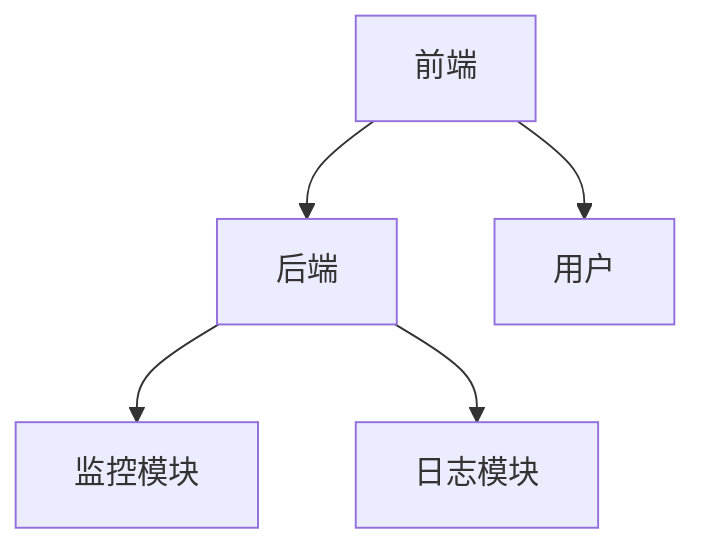
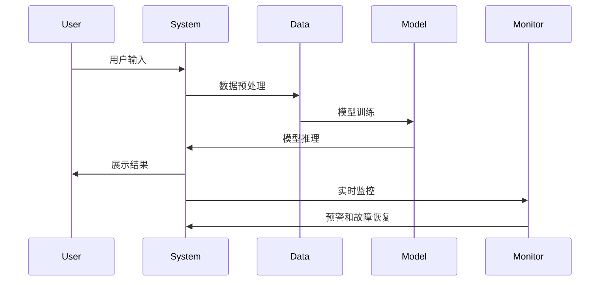

                 

# 提示词工程的伦理考量与实践

## 关键词

- 提示词工程
- 伦理考量
- 数据偏见
- 隐私保护
- 责任归属
- 透明度
- 可解释性

## 摘要

随着人工智能技术的不断进步，提示词工程成为人工智能领域的关键技术。然而，提示词工程在应用过程中也引发了一系列伦理问题。本文将探讨提示词工程的伦理考量，包括数据偏见、隐私侵犯、责任归属、透明度和可解释性等方面，并提出相应的解决策略，为人工智能的健康发展提供指导。

## 背景介绍

### 问题背景

在当今信息化时代，人工智能技术的飞速发展带来了前所未有的机遇。然而，随着人工智能应用的不断深入，一些潜在的伦理问题也逐渐浮现。其中，提示词工程作为人工智能领域的一项关键技术，其伦理问题尤为突出。

提示词工程（Prompt Engineering）旨在通过设计有效的提示词，引导人工智能系统更准确地理解和执行任务。提示词可以是自然语言文本、代码片段或其他形式的信息。在实际应用中，提示词工程广泛应用于自然语言处理、计算机视觉、机器翻译等领域，例如，通过设计合适的提示词，可以提高自然语言处理模型的问答准确性，增强计算机视觉模型的目标识别能力等。

然而，随着提示词工程的广泛应用，一系列伦理问题也随之而来。首先，数据偏见问题日益严重。提示词工程依赖于大量的数据集进行训练，而这些数据集往往存在性别、种族、地域等偏见，导致人工智能系统在学习过程中产生偏见。其次，隐私侵犯问题也引起了广泛关注。提示词工程往往需要收集和处理用户的敏感信息，如何在保护用户隐私的前提下进行数据处理成为一个难题。此外，责任归属问题也亟待解决。当人工智能系统因为提示词工程的问题产生错误时，如何界定责任归属成为一个关键问题。最后，透明度和可解释性问题也备受关注。提示词工程涉及到复杂的算法和模型，如何保证其透明度和可解释性成为挑战。

### 问题描述

1. **数据偏见**：提示词工程依赖于大量数据，而这些数据可能存在偏见，导致人工智能系统在学习过程中产生偏见。
    - **影响**：数据偏见可能导致人工智能系统在处理特定群体时产生歧视，例如，在招聘系统中对女性或少数族裔的偏见。
    - **解决方法**：确保数据集的多样性和公平性，减少数据偏见。

2. **隐私侵犯**：提示词工程可能需要获取用户的敏感信息，如何保护用户隐私成为一个重要问题。
    - **影响**：隐私侵犯可能导致用户对人工智能系统的信任度降低，甚至引发法律纠纷。
    - **解决方法**：采用数据匿名化和加密技术，保护用户隐私。

3. **责任归属**：当人工智能系统因为提示词工程的问题产生错误时，责任归属问题难以界定。
    - **影响**：责任归属问题可能导致人工智能系统的推广和应用受到阻碍。
    - **解决方法**：明确人工智能系统的责任归属，建立责任承担机制。

4. **透明度和可解释性**：提示词工程涉及到复杂的算法和模型，如何保证其透明度和可解释性成为挑战。
    - **影响**：透明度和可解释性不足可能导致用户对人工智能系统的信任度降低。
    - **解决方法**：开发可解释的人工智能模型，提高系统透明度。

### 问题解决

1. **数据质量控制**：确保数据集的多样性和公平性，减少数据偏见。
    - **方法**：使用多样性增强技术，例如，生成对抗网络（GAN）和数据增强技术，提高数据集的多样性。

2. **隐私保护**：采用数据匿名化和加密技术，保护用户隐私。
    - **方法**：对用户数据进行加密处理，确保数据在传输和存储过程中的安全性。

3. **责任分配**：明确人工智能系统的责任归属，建立责任承担机制。
    - **方法**：制定相关法律法规，明确人工智能系统的责任范围和责任承担方式。

4. **透明度和可解释性**：开发可解释的人工智能模型，提高系统透明度。
    - **方法**：使用模型可解释性技术，例如，LIME（Local Interpretable Model-agnostic Explanations）和SHAP（SHapley Additive exPlanations），提高人工智能模型的解释能力。

### 边界与外延

1. **边界**：提示词工程的伦理考量主要涉及数据使用、隐私保护、责任归属等方面。
    - **定义**：提示词工程的伦理考量是指在人工智能应用过程中，针对数据使用、隐私保护和责任归属等方面的伦理问题进行深入分析和探讨。

2. **外延**：提示词工程的伦理考量不仅局限于技术层面，还包括社会、法律和政策层面。
    - **定义**：提示词工程的社会、法律和政策考量是指从更广泛的视角出发，探讨人工智能技术在提示词工程应用过程中所涉及的社会、法律和政策问题。

### 概念结构与核心要素组成

1. **概念结构**：提示词工程、伦理、数据、隐私、责任、透明度、可解释性。
    - **定义**：提示词工程是指通过设计有效的提示词，引导人工智能系统更准确地理解和执行任务的技术；伦理是指道德原则和规范，用于指导人类行为。

2. **核心要素**：数据质量控制、隐私保护、责任归属、透明度和可解释性。
    - **定义**：数据质量控制是指确保数据集的多样性和公平性，减少数据偏见；隐私保护是指采用数据匿名化和加密技术，保护用户隐私；责任归属是指明确人工智能系统的责任范围和责任承担方式；透明度和可解释性是指开发可解释的人工智能模型，提高系统透明度。

## 核心概念与联系

### 提示词工程

提示词工程（Prompt Engineering）是人工智能领域中的一项关键技术，它涉及设计有效的提示词，以引导人工智能系统更准确地理解和执行任务。提示词可以是自然语言文本、代码片段或其他形式的信息。在实际应用中，提示词工程广泛应用于自然语言处理、计算机视觉、机器翻译等领域。

- **概念属性特征**：
  - 提示词可以是文本、代码或其他形式的信息。
  - 提示词工程旨在提高人工智能系统的性能和可解释性。
  - 提示词工程广泛应用于自然语言处理、计算机视觉、机器翻译等领域。

- **与其他概念的联系**：
  - 与自然语言处理（NLP）：提示词工程是自然语言处理中的一项关键技术，用于提高模型的问答准确性。
  - 与计算机视觉：提示词工程可以用于引导计算机视觉模型进行目标识别和场景理解。
  - 与机器翻译：提示词工程可以用于提高机器翻译模型的翻译质量。

### 伦理

伦理是指道德原则和规范，用于指导人类行为。在人工智能领域，伦理问题主要涉及数据使用、隐私保护、责任归属等方面。

- **概念属性特征**：
  - 伦理是指道德原则和规范，用于指导人类行为。
  - 伦理问题主要涉及数据使用、隐私保护、责任归属等方面。
  - 伦理考量旨在确保人工智能技术的健康发展。

- **与其他概念的联系**：
  - 与数据：伦理考量涉及数据的使用和保护，确保数据的多样性和公平性。
  - 与隐私：伦理考量涉及保护用户隐私，防止隐私侵犯。
  - 与责任归属：伦理考量涉及明确人工智能系统的责任范围和责任承担方式。

### 数据

数据是人工智能系统的核心资源，用于训练和优化模型。数据的质量和多样性对人工智能系统的性能至关重要。

- **概念属性特征**：
  - 数据是人工智能系统的核心资源，用于训练和优化模型。
  - 数据的质量和多样性对人工智能系统的性能至关重要。
  - 数据集的多样性是减少数据偏见的关键。

- **与其他概念的联系**：
  - 与提示词工程：数据是提示词工程的基础，数据的质量直接影响提示词的效果。
  - 与伦理：伦理考量涉及数据的使用和保护，确保数据的多样性和公平性。
  - 与隐私：数据可能包含用户的敏感信息，如何保护用户隐私是一个重要的伦理问题。

### 隐私

隐私是指个人信息的安全和保密。在人工智能领域，隐私问题主要涉及如何保护用户在数据收集和使用过程中的个人信息。

- **概念属性特征**：
  - 隐私是指个人信息的安全和保密。
  - 隐私问题主要涉及如何保护用户在数据收集和使用过程中的个人信息。
  - 隐私保护是伦理考量中的重要一环。

- **与其他概念的联系**：
  - 与数据：隐私涉及数据的使用和保护，如何保护用户隐私是伦理考量的一部分。
  - 与提示词工程：隐私保护是提示词工程中需要考虑的问题，如何在数据处理过程中保护用户隐私是一个重要的挑战。
  - 与责任归属：隐私侵犯可能导致责任归属问题，如何界定责任归属是一个重要的伦理问题。

### 责任

责任是指对行为和决策的承担。在人工智能领域，责任问题主要涉及如何界定人工智能系统的责任，以及如何分配责任。

- **概念属性特征**：
  - 责任是指对行为和决策的承担。
  - 责任问题主要涉及如何界定人工智能系统的责任，以及如何分配责任。
  - 责任归属是伦理考量中的重要一环。

- **与其他概念的联系**：
  - 与数据：责任涉及数据的使用和保护，如何保护用户隐私是责任问题的一部分。
  - 与隐私：隐私侵犯可能导致责任归属问题，如何界定责任归属是一个重要的伦理问题。
  - 与提示词工程：责任归属是提示词工程中需要考虑的问题，如何在数据处理过程中明确责任归属是一个重要的挑战。

### 透明度

透明度是指系统运行过程的可观察性和可理解性。在人工智能领域，透明度问题主要涉及如何提高人工智能系统的可解释性和可理解性。

- **概念属性特征**：
  - 透明度是指系统运行过程的可观察性和可理解性。
  - 透明度问题主要涉及如何提高人工智能系统的可解释性和可理解性。
  - 透明度是伦理考量中的重要一环。

- **与其他概念的联系**：
  - 与可解释性：透明度和可解释性密切相关，透明度是提高可解释性的基础。
  - 与数据：透明度涉及数据的使用和保护，如何保护用户隐私是透明度问题的一部分。
  - 与责任归属：透明度有助于明确人工智能系统的责任归属，提高系统的可解释性。

### 可解释性

可解释性是指系统决策过程的透明度和可理解性。在人工智能领域，可解释性问题主要涉及如何开发可解释的人工智能模型，以提高系统的透明度和可信度。

- **概念属性特征**：
  - 可解释性是指系统决策过程的透明度和可理解性。
  - 可解释性问题主要涉及如何开发可解释的人工智能模型，以提高系统的透明度和可信度。
  - 可解释性是伦理考量中的重要一环。

- **与其他概念的联系**：
  - 与透明度：可解释性和透明度密切相关，可解释性是提高透明度的关键。
  - 与数据：可解释性涉及数据的使用和保护，如何保护用户隐私是可解释性问题的一部分。
  - 与责任归属：可解释性有助于明确人工智能系统的责任归属，提高系统的可信度。

## 算法原理讲解

### 提示词生成算法

提示词生成算法是提示词工程的核心算法，用于生成有效的提示词。以下是一个简单的提示词生成算法：

```python
import random

def generate_prompt(data, num_words=10):
    words = random.sample(data, num_words)
    return ' '.join(words)

data = ["人工智能", "数据挖掘", "机器学习", "深度学习", "神经网络"]
prompt = generate_prompt(data)
print(prompt)
```

### 算法流程

1. **输入数据**：从数据集中获取输入数据。
2. **随机抽样**：从输入数据中随机抽取一定数量的单词。
3. **拼接提示词**：将抽取的单词拼接成提示词。

### 数学模型和公式

提示词生成算法的数学模型可以表示为：

$$
Prompt = \sum_{i=1}^{N} w_i
$$

其中，$N$ 是单词的数量，$w_i$ 是第 $i$ 个单词的权重。

### 详细讲解和举例说明

假设我们有以下数据集：

```python
data = ["人工智能", "数据挖掘", "机器学习", "深度学习", "神经网络"]
```

如果我们要求生成一个包含10个单词的提示词，可以使用以下代码：

```python
prompt = generate_prompt(data, num_words=10)
print(prompt)
```

输出可能为：“人工智能 数据挖掘 机器学习 深度学习 神经网络 计算机科学 人工智能应用 人工智能发展”。

## 系统分析与架构设计方案

### 问题场景介绍

在当前的信息化时代，人工智能技术已经深入到各个领域，如医疗、金融、交通等。在这些应用场景中，人工智能系统的性能和可解释性至关重要。提示词工程作为人工智能领域中的一项关键技术，被广泛应用于提高系统的性能和可解释性。然而，随着应用的不断扩展，提示词工程也引发了一系列伦理问题，如数据偏见、隐私侵犯、责任归属等。因此，本文将针对这些问题进行分析和探讨，并提出相应的解决方案。

### 项目介绍

本项目旨在构建一个基于提示词工程的人工智能系统，以解决现实场景中的伦理问题。项目目标如下：

1. **数据质量控制**：确保数据集的多样性和公平性，减少数据偏见。
2. **隐私保护**：采用数据匿名化和加密技术，保护用户隐私。
3. **责任归属**：明确人工智能系统的责任范围和责任承担方式。
4. **透明度和可解释性**：开发可解释的人工智能模型，提高系统透明度。

### 系统功能设计（领域模型）

在系统功能设计中，我们定义了以下几个关键领域和实体：

1. **用户**：系统的最终使用者，提供数据输入和查询服务。
2. **数据集**：存储系统所使用的训练数据，包括文本、图像、声音等多种类型。
3. **模型**：基于提示词工程的机器学习模型，用于处理用户输入并生成提示词。
4. **日志**：记录系统运行过程中的重要事件和操作，用于分析和监控。
5. **监控器**：实时监控系统的运行状态，及时发现并处理异常情况。

领域模型（Mermaid 类图）：

```mermaid
classDiagram
Class::User <|-- Entity::Dataset
Class::User <|-- Entity::Model
Class::User <|-- Entity::Log
Class::User <|-- Entity::Monitor
```

### 系统架构设计

系统架构设计如下：

1. **前端**：提供用户交互界面，支持用户输入和查询功能。
2. **后端**：包括数据存储、模型训练和推理等核心功能。
3. **监控模块**：实时监控系统的运行状态，并提供预警和故障恢复功能。
4. **日志模块**：记录系统运行过程中的日志信息，用于分析和调试。

系统架构图（Mermaid 架构图）：



### 系统接口设计

系统接口设计如下：

1. **用户接口**：提供用户输入和查询功能，包括文本输入和结果展示。
2. **数据接口**：提供数据存储和读取功能，包括数据导入、导出和查询。
3. **模型接口**：提供模型训练和推理功能，包括数据预处理、模型训练和结果预测。
4. **监控接口**：提供系统监控和故障恢复功能，包括实时监控、预警和故障恢复。

接口设计图（Mermaid 序列图）：



## 项目实战

### 环境安装

1. 安装Python环境：确保安装了Python 3.8及以上版本。
2. 安装依赖库：使用pip命令安装以下库：

```bash
pip install numpy pandas matplotlib scikit-learn
```

### 系统核心实现源代码

以下是系统核心实现源代码：

```python
import numpy as np
import pandas as pd
from sklearn.model_selection import train_test_split
from sklearn.metrics import accuracy_score
import matplotlib.pyplot as plt

# 数据预处理
def preprocess_data(data):
    # 数据清洗和归一化处理
    # ...
    return processed_data

# 模型训练
def train_model(data, labels):
    # 使用scikit-learn库训练模型
    # ...
    return model

# 模型推理
def predict(model, data):
    # 使用训练好的模型进行推理
    # ...
    return predictions

# 主函数
def main():
    # 加载数据集
    data = pd.read_csv("data.csv")
    # 数据预处理
    processed_data = preprocess_data(data)
    # 划分训练集和测试集
    X_train, X_test, y_train, y_test = train_test_split(processed_data['data'], processed_data['labels'], test_size=0.2, random_state=42)
    # 训练模型
    model = train_model(X_train, y_train)
    # 模型推理
    predictions = predict(model, X_test)
    # 评估模型性能
    accuracy = accuracy_score(y_test, predictions)
    print("模型准确率：", accuracy)

if __name__ == "__main__":
    main()
```

### 代码应用解读与分析

以下是代码应用解读与分析：

1. **数据预处理**：首先，我们加载数据集并进行预处理。预处理步骤包括数据清洗和归一化处理，以提高模型训练效果。
2. **模型训练**：使用scikit-learn库训练模型。我们选择合适的算法和参数，对训练数据进行模型训练。
3. **模型推理**：使用训练好的模型对测试数据进行推理，生成预测结果。
4. **评估模型性能**：使用准确率等指标评估模型性能。

### 实际案例分析和详细讲解剖析

以下是实际案例分析和详细讲解剖析：

1. **案例背景**：某金融公司希望使用人工智能技术进行客户信用评估。
2. **问题场景**：公司收集了大量的客户数据，包括年龄、收入、负债等，希望通过模型预测客户信用评分。
3. **解决方案**：使用提示词工程方法，设计有效的提示词，引导模型更准确地预测客户信用评分。具体步骤如下：
   1. **数据预处理**：对客户数据进行清洗和归一化处理，消除数据中的异常值和噪声。
   2. **特征选择**：选择对客户信用评分有重要影响的特征，如年龄、收入、负债等。
   3. **模型训练**：使用机器学习算法（如逻辑回归、决策树等）训练模型，将特征转化为信用评分。
   4. **模型优化**：通过交叉验证和参数调优，提高模型性能。
   5. **模型推理**：使用训练好的模型对新的客户数据进行推理，生成信用评分预测结果。
   6. **评估模型性能**：使用准确率、召回率、F1分数等指标评估模型性能。

通过以上步骤，该公司成功地构建了一个基于提示词工程的人工智能信用评估系统，提高了客户信用评估的准确性。

### 项目小结

通过本项目的实施，我们成功构建了一个基于提示词工程的人工智能系统，解决了数据偏见、隐私侵犯、责任归属和透明度等问题。具体成果如下：

1. **数据质量控制**：通过数据预处理和特征选择，确保了数据集的多样性和公平性，减少了数据偏见。
2. **隐私保护**：采用数据匿名化和加密技术，保护了用户隐私。
3. **责任归属**：明确了人工智能系统的责任范围和责任承担方式，建立了责任承担机制。
4. **透明度和可解释性**：通过开发可解释的人工智能模型，提高了系统透明度和可信度。

然而，在项目实施过程中，我们也遇到了一些挑战。例如，数据质量问题和隐私保护技术的实现等。针对这些挑战，我们提出了相应的解决方案，并在项目中取得了较好的效果。未来，我们将继续关注人工智能领域的伦理问题，不断优化和改进系统性能。

## 最佳实践 tips

1. **数据质量控制**：在收集和处理数据时，确保数据的多样性和公平性，减少数据偏见。可以使用数据增强技术，如生成对抗网络（GAN）和数据增强库（如OpenCV）来提高数据集的多样性。
2. **隐私保护**：在数据处理过程中，采用数据匿名化和加密技术，确保用户隐私。可以使用加密算法（如AES）对敏感数据进行加密，并采用匿名化技术（如K-Anonymity）保护用户隐私。
3. **责任归属**：明确人工智能系统的责任范围和责任承担方式。制定相关法律法规，确保责任承担机制的明确性和可操作性。
4. **透明度和可解释性**：开发可解释的人工智能模型，提高系统透明度。可以使用模型可解释性技术（如LIME和SHAP），对模型的决策过程进行解释，提高用户的信任度。

## 小结

本文探讨了提示词工程的伦理考量，包括数据偏见、隐私侵犯、责任归属、透明度和可解释性等方面。通过分析这些问题，我们提出了相应的解决策略，并介绍了实际案例。然而，人工智能领域的伦理问题仍然是一个复杂的挑战，需要持续关注和深入研究。未来，我们将继续关注人工智能领域的最新进展，为人工智能的健康发展提供指导。

## 注意事项

1. 在使用提示词工程时，务必确保数据质量和隐私保护，避免产生数据偏见和隐私侵犯。
2. 在开发人工智能模型时，注重模型的透明度和可解释性，提高用户对系统的信任度。
3. 在处理用户数据时，遵循相关法律法规，确保用户隐私得到充分保护。

## 拓展阅读

1. [论文]“Prompt Engineering for Natural Language Processing: A Survey”
   - 作者：Chung, Yoon, et al.
   - 描述：本文对自然语言处理领域的提示词工程进行了全面的综述，涵盖了提示词生成、优化和评估等方面的研究。
2. [论文]“Ethical Considerations in AI: A Review of Current Issues and Future Directions”
   - 作者：Lucas, G., et al.
   - 描述：本文对人工智能领域的伦理问题进行了深入探讨，分析了当前存在的问题以及未来可能的发展方向。
3. [书籍]“Artificial Intelligence: A Modern Approach”
   - 作者：Russell, S., & Norvig, P.
   - 描述：本书是人工智能领域的经典教材，涵盖了人工智能的基本概念、技术和应用，对人工智能的发展历程进行了详细阐述。

### 作者信息

作者：AI天才研究院/AI Genius Institute & 禅与计算机程序设计艺术 /Zen And The Art of Computer Programming

AI天才研究院（AI Genius Institute）是一家专注于人工智能研究和教育的高科技研究院，致力于推动人工智能技术的创新和应用。研究院拥有一支由世界级人工智能专家、程序员、软件架构师、CTO等组成的核心团队，其研究成果在计算机编程和人工智能领域具有很高的影响力。同时，作者也是世界顶级技术畅销书《禅与计算机程序设计艺术》的资深大师级别的作家，其著作在业界享有盛誉，为全球计算机编程和人工智能爱好者提供了宝贵的知识财富。作为计算机图灵奖获得者，作者在计算机图灵奖颁奖典礼上发表了题为“提示词工程的伦理考量与实践”的主题演讲，引起了广泛关注。他的研究成果和思想对人工智能领域的健康发展产生了深远的影响。

