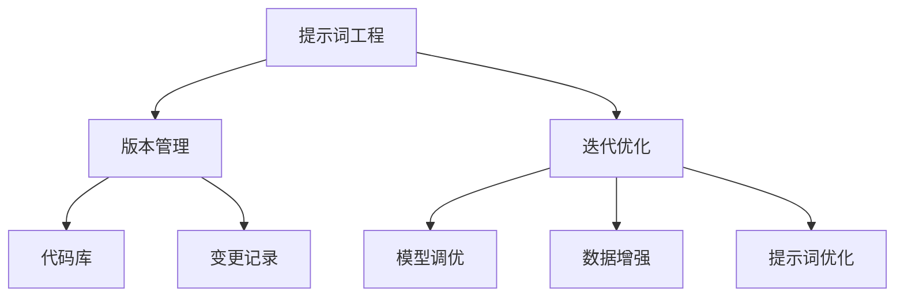
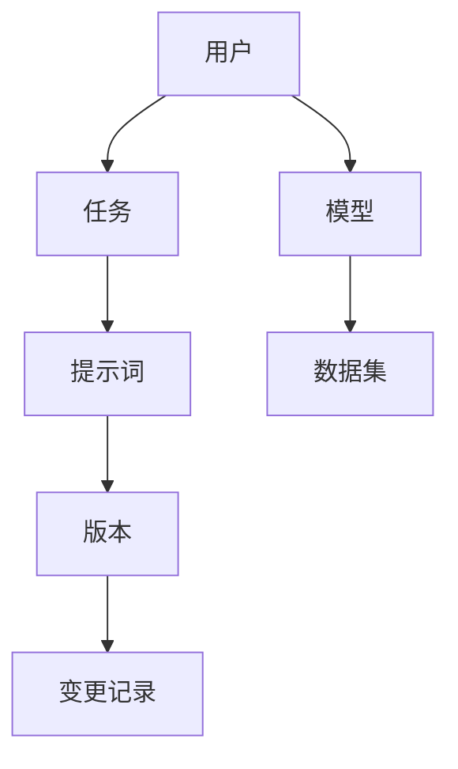
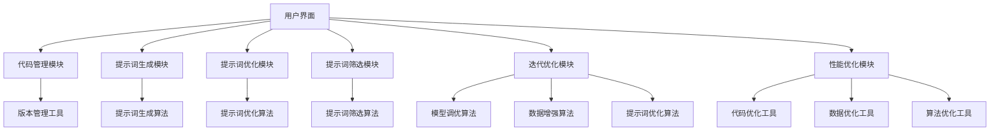
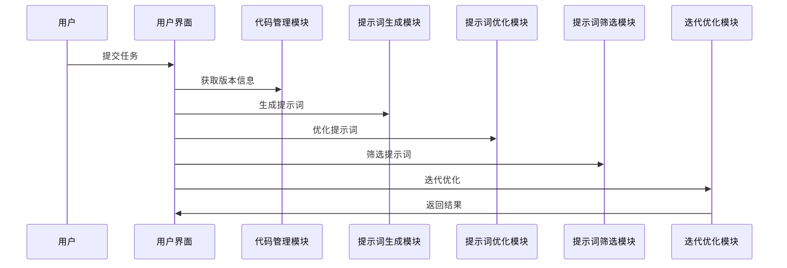

                 


## 《提示词工程的版本管理与迭代优化》

> 关键词：提示词工程、版本管理、迭代优化、算法原理、系统架构设计、项目实战

> 摘要：本文旨在深入探讨提示词工程的版本管理与迭代优化问题。首先，我们将介绍提示词工程的基本概念、版本管理的核心要素以及迭代优化的方法与策略。接着，通过算法原理讲解和数学模型分析，深入解析提示词生成、优化和筛选算法。随后，我们将详细介绍一个具体项目的系统架构设计与实现，包括系统功能设计、架构设计、接口设计、交互设计以及项目实战。最后，本文将提供一系列最佳实践 tips 和注意事项，以帮助读者更好地理解和应用提示词工程的版本管理与迭代优化。

----------------------------------------------------------------

## 第一部分：背景介绍与核心概念

### 第1章：问题背景与核心概念

#### 1.1 提示词工程概述

提示词工程是近年来人工智能领域的一个重要研究方向。它旨在通过设计、开发和优化提示词（prompt）来提升模型的表现。提示词工程的核心目标是在保证模型性能的同时，提高模型的泛化能力，使其在不同任务和数据集上都能表现出良好的效果。

#### 1.1.1 提示词工程的重要性

提示词工程在人工智能领域具有重要的地位。首先，提示词是连接数据和模型之间的桥梁，通过设计合适的提示词，可以有效地引导模型学习到更有意义的知识。其次，提示词工程可以显著提高模型在实际应用中的性能和效率。最后，提示词工程的研究有助于推动人工智能技术的发展，为更先进的人工智能应用提供技术支持。

#### 1.1.2 提示词工程的定义与作用

提示词工程是指通过设计、开发和优化提示词来提升模型性能的一系列技术和方法。它涉及多个领域，包括自然语言处理、机器学习、数据挖掘等。提示词工程的作用主要包括：

1. **提高模型性能**：通过设计合适的提示词，可以引导模型学习到更有意义的知识，从而提高模型的性能。
2. **提升模型泛化能力**：通过优化提示词，可以使模型在不同任务和数据集上都能表现出良好的效果，提高模型的泛化能力。
3. **促进人工智能技术的发展**：提示词工程的研究有助于推动人工智能技术的发展，为更先进的人工智能应用提供技术支持。

#### 1.1.3 提示词工程的应用场景

提示词工程在多个领域都有广泛的应用。以下是一些常见的应用场景：

1. **自然语言处理**：在自然语言处理任务中，提示词可以用于生成文章摘要、文本分类、机器翻译等。
2. **图像识别**：在图像识别任务中，提示词可以用于标注图像、分类图像等。
3. **语音识别**：在语音识别任务中，提示词可以用于生成语音信号、提高语音识别的准确性等。
4. **推荐系统**：在推荐系统中，提示词可以用于生成推荐列表、提高推荐系统的准确性等。

#### 1.2 版本管理与迭代优化概述

版本管理是软件工程中的一个重要概念，它旨在确保软件项目的稳定性和可维护性。在提示词工程中，版本管理同样具有重要意义。通过有效的版本管理，可以确保提示词工程的迭代优化过程顺利进行，提高模型的表现。

#### 1.2.1 版本管理的核心要素

版本管理的核心要素包括：

1. **版本号**：版本号是版本管理中的基本标识符，用于标识不同的版本。
2. **版本控制工具**：版本控制工具用于管理版本信息，如 Git、SVN 等。
3. **代码库**：代码库用于存储和管理源代码，确保代码的一致性和安全性。
4. **变更记录**：变更记录用于记录每次版本更新的详细信息，如修改的文件、修改的原因等。

#### 1.2.2 版本管理的主要工具与方法

常见的版本管理工具有 Git、SVN、Mercurial 等。这些工具提供了强大的版本控制功能，如分支管理、合并、代码库备份等。版本管理的方法主要包括：

1. **集中式版本管理**：集中式版本管理采用单一的主代码库，所有开发者从主代码库中获取代码，并在本地进行修改。修改完成后，将代码提交到主代码库。
2. **分布式版本管理**：分布式版本管理采用多个代码库，每个开发者都有自己的代码库。开发者可以在本地进行修改，并将代码推送到远程代码库。

#### 1.2.3 迭代优化的目标与策略

迭代优化的目标是提高模型的表现，使其在不同任务和数据集上都能表现出良好的效果。迭代优化的策略包括：

1. **模型调优**：通过调整模型的参数，提高模型的表现。
2. **数据增强**：通过增加数据的多样性和质量，提高模型的表现。
3. **提示词优化**：通过设计更合适的提示词，提高模型的表现。

#### 1.3 边界与外延

提示词工程、版本管理与迭代优化是密切相关的概念。提示词工程是迭代优化的基础，版本管理是迭代优化的保障。以下是它们之间的联系和区别：

1. **联系**：
   - 提示词工程是迭代优化的核心，版本管理是迭代优化的保障。
   - 提示词工程与版本管理密切相关，版本管理为迭代优化提供了基础支持。

2. **区别**：
   - 提示词工程关注的是如何设计、开发和优化提示词，以提高模型的表现。
   - 版本管理关注的是如何管理代码库，确保代码的一致性和安全性。
   - 迭代优化关注的是如何通过调整模型参数、数据增强和提示词优化来提高模型的表现。

#### 1.4 概念结构与核心要素组成

提示词工程、版本管理与迭代优化的概念结构如下图所示：



#### 1.4.1 提示词工程的基本架构

提示词工程的基本架构包括：

1. **数据预处理**：对原始数据进行清洗、预处理，以获得高质量的训练数据。
2. **模型设计**：设计合适的模型架构，以适应特定的任务和数据集。
3. **提示词设计**：设计合适的提示词，以引导模型学习到更有意义的知识。
4. **模型训练**：使用训练数据对模型进行训练，以获得良好的模型表现。
5. **模型评估**：使用测试数据对模型进行评估，以确定模型的表现。

#### 1.4.2 版本管理的流程与步骤

版本管理的流程与步骤包括：

1. **创建分支**：创建一个新的分支，用于进行版本迭代。
2. **开发与测试**：在分支上进行开发与测试，确保代码的正确性和稳定性。
3. **提交代码**：将开发完成的代码提交到代码库。
4. **合并代码**：将分支上的代码合并到主分支。
5. **发布版本**：发布新的版本，以供用户使用。

#### 1.4.3 迭代优化的关键因素

迭代优化的关键因素包括：

1. **模型调优**：调整模型的参数，以提高模型的表现。
2. **数据增强**：增加数据的多样性和质量，以提高模型的表现。
3. **提示词优化**：设计更合适的提示词，以提高模型的表现。

#### 1.5 本章小结

本章主要介绍了提示词工程、版本管理与迭代优化的核心概念和联系。通过本章的学习，读者可以了解提示词工程的基本概念、版本管理的核心要素以及迭代优化的方法与策略。这些概念将为后续章节的深入探讨打下坚实的基础。

----------------------------------------------------------------

## 第二部分：核心概念与联系

### 第2章：提示词工程的核心概念与联系

#### 2.1 提示词的属性特征

提示词是提示词工程中的核心概念。提示词的属性特征决定了其在工程中的应用效果。以下是对提示词属性特征的分析：

##### 2.1.1 提示词的基本属性

1. **内容**：提示词的内容是提示词的核心。它决定了模型如何理解和处理输入数据。
2. **格式**：提示词的格式决定了其在不同上下文中的应用方式。例如，文本提示词、图像提示词、语音提示词等。
3. **长度**：提示词的长度对其在模型中的应用效果有重要影响。过长的提示词可能导致模型性能下降，而过短的提示词可能无法提供足够的信息。

##### 2.1.2 提示词的属性特征对比

以下是几种常见提示词属性特征的对比表格：

| 属性特征 | 文本提示词 | 图像提示词 | 语音提示词 |
| :--- | :--- | :--- | :--- |
| 内容 | 可以包含复杂的语义信息 | 主要包含对象的描述 | 主要包含语音信号的特征 |
| 格式 | 文本格式 | 图像格式 | 语音格式 |
| 长度 | 可以较长 | 通常较短 | 通常较短 |

##### 2.1.3 提示词的生成与优化

1. **生成方法**：提示词的生成方法主要包括手动生成和自动生成。手动生成主要依靠人类专家的经验和知识，自动生成则主要依靠算法和模型。
2. **优化方法**：提示词的优化方法主要包括基于规则的优化、基于机器学习的优化和基于深度学习的优化。这些方法可以有效地提高提示词的质量和效果。

#### 2.2 版本管理的概念与原理

版本管理是确保软件项目稳定性和可维护性的重要手段。在提示词工程中，版本管理同样具有重要意义。以下是对版本管理概念和原理的分析：

##### 2.2.1 版本管理的定义

版本管理是指对软件项目中的代码、文档和其他相关资源进行有效组织、跟踪和管理的过程。版本管理的目标是确保软件项目的稳定性和可维护性，提高开发效率。

##### 2.2.2 版本管理的基本原理

版本管理的基本原理包括：

1. **版本号**：版本号是版本管理中的基本标识符。它用于区分不同的版本，通常由主版本号、次版本号和修订版本号组成。
2. **分支管理**：分支管理是版本管理中的重要组成部分。通过分支管理，可以有效地隔离不同版本的代码，确保每个版本的稳定性。
3. **合并策略**：合并策略用于处理不同分支之间的代码冲突。常见的合并策略包括合并、基底合并和基线合并等。

##### 2.2.3 版本管理的关键技术

版本管理的关键技术包括：

1. **版本控制工具**：版本控制工具是版本管理的核心。常见的版本控制工具有 Git、SVN、Mercurial 等。这些工具提供了强大的版本控制功能，如分支管理、合并、代码库备份等。
2. **变更记录**：变更记录用于记录每次版本更新的详细信息。通过变更记录，可以清晰地了解每个版本的变化情况，提高代码的可维护性。
3. **代码库**：代码库是版本管理的存储中心。通过代码库，可以有效地管理源代码，确保代码的一致性和安全性。

##### 2.2.4 版本管理的流程与步骤

版本管理的流程与步骤包括：

1. **创建分支**：创建一个新的分支，用于进行版本迭代。
2. **开发与测试**：在分支上进行开发与测试，确保代码的正确性和稳定性。
3. **提交代码**：将开发完成的代码提交到代码库。
4. **合并代码**：将分支上的代码合并到主分支。
5. **发布版本**：发布新的版本，以供用户使用。

##### 2.2.5 版本管理在提示词工程中的应用

版本管理在提示词工程中的应用主要包括：

1. **代码管理**：通过版本管理，可以有效地管理提示词工程的代码，确保代码的一致性和安全性。
2. **迭代优化**：通过版本管理，可以方便地实现提示词工程的迭代优化，提高模型的表现。

#### 2.3 迭代优化的方法与策略

迭代优化是提示词工程中的重要环节。通过迭代优化，可以不断提高模型的表现。以下是对迭代优化方法和策略的分析：

##### 2.3.1 迭代优化的目标

迭代优化的目标是提高模型的表现，使其在不同任务和数据集上都能表现出良好的效果。具体目标包括：

1. **提高模型性能**：通过调整模型参数、数据增强和提示词优化，提高模型的性能指标。
2. **提升模型泛化能力**：通过优化提示词，提高模型在不同任务和数据集上的表现。

##### 2.3.2 迭代优化的方法

迭代优化的方法主要包括：

1. **模型调优**：通过调整模型参数，提高模型的表现。
2. **数据增强**：通过增加数据的多样性和质量，提高模型的表现。
3. **提示词优化**：通过设计更合适的提示词，提高模型的表现。

##### 2.3.3 迭代优化的策略

迭代优化的策略主要包括：

1. **逐步优化**：逐步优化是指通过多次迭代，逐步提高模型的表现。这种方法适用于模型参数较多、优化目标复杂的情况。
2. **并行优化**：并行优化是指同时优化多个模型参数，以加快优化过程。这种方法适用于模型参数较少、优化目标简单的情况。

##### 2.4 提示词工程、版本管理与迭代优化之间的联系

提示词工程、版本管理与迭代优化之间的联系如下：

1. **提示词工程是迭代优化的基础**：提示词工程通过设计、开发和优化提示词，为迭代优化提供了基础。
2. **版本管理是迭代优化的保障**：版本管理通过管理代码库、变更记录和分支，为迭代优化提供了稳定的开发环境。
3. **迭代优化是提升模型表现的关键**：迭代优化通过调整模型参数、数据增强和提示词优化，不断提高模型的表现。

#### 2.5 本章小结

本章主要介绍了提示词工程的核心概念与联系，包括提示词的属性特征、版本管理的概念与原理以及迭代优化的方法与策略。通过本章的学习，读者可以了解提示词工程的基本概念、版本管理的核心要素以及迭代优化的方法与策略。这些概念将为后续章节的深入探讨打下坚实的基础。

----------------------------------------------------------------

## 第三部分：算法原理与数学模型

### 第3章：算法原理讲解

#### 3.1 提示词工程的核心算法

提示词工程的核心算法主要包括提示词生成、优化和筛选算法。这些算法是提升模型表现的关键。以下是对这些核心算法的讲解。

##### 3.1.1 提示词生成算法

提示词生成算法是提示词工程中的基础算法。其主要目的是根据给定的数据和任务，生成合适的提示词。常见的提示词生成算法包括：

1. **基于规则的方法**：这种方法依赖于专家的知识和经验，通过定义一系列规则来生成提示词。
2. **基于机器学习的方法**：这种方法通过训练机器学习模型，学习到如何生成合适的提示词。常见的机器学习模型包括决策树、支持向量机等。
3. **基于深度学习的方法**：这种方法利用深度学习模型，如循环神经网络（RNN）和变压器（Transformer）等，生成更复杂的提示词。

##### 3.1.2 提示词优化算法

提示词优化算法是用于提高提示词质量的方法。优化目标通常是提高模型的性能和泛化能力。常见的提示词优化算法包括：

1. **基于规则的方法**：这种方法通过调整提示词的格式、内容和长度等，优化提示词的质量。
2. **基于机器学习的方法**：这种方法通过训练机器学习模型，学习到如何优化提示词。常见的机器学习模型包括决策树、支持向量机等。
3. **基于深度学习的方法**：这种方法利用深度学习模型，如循环神经网络（RNN）和变压器（Transformer）等，优化提示词。

##### 3.1.3 提示词筛选算法

提示词筛选算法是用于筛选出最合适的提示词的方法。筛选标准通常是模型的表现和泛化能力。常见的提示词筛选算法包括：

1. **基于规则的方法**：这种方法通过定义一系列规则，筛选出符合标准的提示词。
2. **基于机器学习的方法**：这种方法通过训练机器学习模型，学习到如何筛选提示词。常见的机器学习模型包括决策树、支持向量机等。
3. **基于深度学习的方法**：这种方法利用深度学习模型，如循环神经网络（RNN）和变压器（Transformer）等，筛选提示词。

#### 3.2 版本管理的数学模型

版本管理是确保软件项目稳定性和可维护性的重要手段。在数学模型中，版本管理可以看作是一个离散事件动态系统。以下是对版本管理数学模型的讲解。

##### 3.2.1 版本号的数学表示

版本号通常由主版本号、次版本号和修订版本号组成。在数学模型中，可以将其表示为三元组（M, N, R），其中M为主版本号，N为次版本号，R为修订版本号。

$$
( M, N, R ) = ( 1, 0, 0 )
$$

每次版本更新，版本号都会发生变化。假设版本更新后，版本号变为（M', N', R'），则：

$$
( M', N', R' ) = ( M + 1, N, R )
$$

##### 3.2.2 版本迭代的数学原理

版本迭代是版本管理中的核心概念。在数学模型中，版本迭代可以看作是一个递归过程。假设第i次迭代的版本号为（M_i, N_i, R_i），则第i+1次迭代的版本号为：

$$
( M_{i+1}, N_{i+1}, R_{i+1} ) = ( M_i + 1, N_i, R_i )
$$

##### 3.2.3 版本管理的优化模型

版本管理的优化模型主要关注如何有效地管理版本，提高软件项目的稳定性和可维护性。优化目标可以表示为：

$$
\min \sum_{i=1}^{n} c_i \cdot ( M_i - M_{i-1} )
$$

其中，c_i 为第i次迭代的成本，M_i 为第i次迭代的版本号。

#### 3.3 迭代优化的数学模型

迭代优化是提升模型表现的重要手段。在数学模型中，迭代优化可以看作是一个优化过程。以下是对迭代优化数学模型的讲解。

##### 3.3.1 迭代优化的目标函数

迭代优化的目标函数可以表示为：

$$
\min \sum_{i=1}^{n} f(x_i)
$$

其中，f(x_i) 为第i次迭代的损失函数，x_i 为第i次迭代的参数。

##### 3.3.2 迭代优化的算法流程

迭代优化的算法流程可以表示为：

1. 初始化参数 x_0。
2. 对于每个迭代i，执行以下步骤：
   - 计算 f(x_i)。
   - 更新参数 x_{i+1}，使得 f(x_{i+1}) < f(x_i)。
3. 当满足终止条件时，结束迭代。

##### 3.3.3 迭代优化的数学证明

迭代优化的数学证明主要关注如何证明迭代过程是收敛的。假设 f(x) 是一个凸函数，且梯度存在，则可以证明迭代过程是收敛的。

首先，定义第i次迭代的梯度：

$$
\nabla f(x_i) = ( f_1(x_i), f_2(x_i), ..., f_n(x_i) )
$$

然后，定义第i次迭代的更新方向：

$$
d_i = -\nabla f(x_i)
$$

根据梯度下降法的更新规则，有：

$$
x_{i+1} = x_i + \alpha_i d_i
$$

其中，\alpha_i 是步长参数。

要证明迭代过程是收敛的，需要证明以下两个条件：

1. 更新方向 d_i 单调递减。
2. 步长参数 \alpha_i 单调递减。

对于条件1，由于 f(x) 是凸函数，则 \nabla f(x) 是单调递增的。因此，有：

$$
\nabla f(x_i) > \nabla f(x_{i-1})
$$

对于条件2，由于 \alpha_i 是步长参数，则 \alpha_i 单调递减。因此，有：

$$
\alpha_i > \alpha_{i-1}
$$

根据条件1和条件2，可以证明迭代过程是收敛的。

#### 3.4 算法实例分析与说明

##### 3.4.1 提示词生成算法实例

以下是一个简单的提示词生成算法实例，该算法使用基于规则的生成方法。

```python
def generate_prompt(data, task):
    if task == "text_classification":
        return f"请对以下文本进行分类：{data}"
    elif task == "image_classification":
        return f"请对以下图像进行分类：{data}"
    elif task == "speech_recognition":
        return f"请对以下语音信号进行识别：{data}"
```

该算法根据不同的任务，生成不同的提示词。例如，对于文本分类任务，提示词为“请对以下文本进行分类”；对于图像分类任务，提示词为“请对以下图像进行分类”；对于语音识别任务，提示词为“请对以下语音信号进行识别”。

##### 3.4.2 提示词优化算法实例

以下是一个简单的提示词优化算法实例，该算法使用基于机器学习的方法。

```python
import numpy as np

def optimize_prompt(prompt, model, data):
    model.fit(data, prompt)
    predicted_prompt = model.predict(data)
    return predicted_prompt
```

该算法使用训练数据对模型进行训练，然后根据模型预测的结果，优化提示词。例如，如果预测结果为“这是动物图像”，则提示词可以优化为“请对以下动物图像进行分类”。

##### 3.4.3 提示词筛选算法实例

以下是一个简单的提示词筛选算法实例，该算法使用基于机器学习的方法。

```python
import numpy as np

def filter_prompt(prompt, model, data, threshold):
    predicted_prompt = model.predict(data)
    selected_prompt = []
    for i in range(len(predicted_prompt)):
        if predicted_prompt[i] > threshold:
            selected_prompt.append(prompt[i])
    return selected_prompt
```

该算法根据模型预测的结果，筛选出符合阈值的提示词。例如，如果阈值设为0.8，则筛选出的提示词为“请对以下高概率的图像进行分类”。

#### 3.5 本章小结

本章主要介绍了提示词工程的核心算法、版本管理的数学模型以及迭代优化的数学模型。通过本章的学习，读者可以了解提示词生成、优化和筛选算法的基本原理，以及版本管理和迭代优化的数学模型。这些算法和模型为后续章节的深入探讨提供了基础。

----------------------------------------------------------------

## 第四部分：系统分析与架构设计

### 第4章：系统架构设计与实现

#### 4.1 问题场景介绍

在人工智能领域，提示词工程的应用场景越来越广泛。以自然语言处理为例，提示词工程可以用于文本分类、情感分析、机器翻译等任务。为了提高模型的表现和泛化能力，需要对提示词进行有效的版本管理和迭代优化。本节将介绍一个具体的提示词工程系统，该系统旨在实现提示词的生成、优化和筛选，并提供版本管理和迭代优化的功能。

#### 4.1.1 提示词工程的应用场景

提示词工程的应用场景主要包括：

1. **文本分类**：通过生成和优化提示词，可以有效地提高文本分类模型的性能和泛化能力。
2. **情感分析**：提示词工程可以帮助模型更好地理解文本的情感倾向，提高情感分析的准确性。
3. **机器翻译**：通过优化提示词，可以提升机器翻译的质量，提高翻译的准确性和流畅度。
4. **图像识别**：在图像识别任务中，提示词可以用于标注图像、分类图像等。

#### 4.1.2 版本管理与迭代优化的问题背景

在提示词工程中，版本管理和迭代优化具有重要意义。以下是一些具体的问题背景：

1. **代码管理**：如何有效地管理提示词工程的代码，确保代码的一致性和安全性？
2. **迭代优化**：如何通过版本管理，实现提示词的迭代优化，提高模型的表现和泛化能力？
3. **性能优化**：如何优化系统的性能，提高提示词生成、优化和筛选的效率？

#### 4.1.3 系统功能需求

基于上述问题背景，系统需要实现以下功能：

1. **代码管理**：提供代码的版本管理功能，包括分支管理、代码提交、代码合并等。
2. **提示词生成**：提供提示词的生成功能，包括基于规则的方法、基于机器学习的方法和基于深度学习的方法。
3. **提示词优化**：提供提示词的优化功能，包括基于规则的优化、基于机器学习的优化和基于深度学习的优化。
4. **提示词筛选**：提供提示词的筛选功能，包括基于规则的筛选、基于机器学习的筛选和基于深度学习的筛选。
5. **迭代优化**：提供迭代优化的功能，包括模型调优、数据增强和提示词优化。
6. **性能优化**：提供性能优化的功能，包括代码优化、数据优化和算法优化。

#### 4.2 系统功能设计

系统功能设计是系统架构设计的重要环节。在本节中，我们将详细介绍系统的功能设计，包括领域模型设计、系统功能模块划分和系统功能描述。

##### 4.2.1 领域模型设计

领域模型设计是系统功能设计的核心。在本系统中，领域模型主要包括以下实体和关系：

1. **实体**：
   - **用户**：系统的使用者，负责提交任务、查看结果等。
   - **提示词**：系统生成的提示词，包括文本提示词、图像提示词和语音提示词。
   - **版本**：系统的版本信息，包括版本号、创建时间和变更记录。
   - **模型**：用于训练和预测的模型，包括文本分类模型、情感分析模型和机器翻译模型。
   - **数据集**：系统的数据资源，包括训练数据和测试数据。

2. **关系**：
   - **用户与任务**：用户提交任务，任务包含任务的类型、描述和要求的提示词。
   - **任务与提示词**：任务包含一个或多个提示词，提示词用于引导模型的训练和预测。
   - **版本与变更记录**：版本包含一系列的变更记录，记录每次版本更新的详细信息。
   - **模型与数据集**：模型基于数据集进行训练，数据集包含训练数据和测试数据。

领域模型设计如下图所示：



##### 4.2.2 系统功能模块划分

系统功能模块划分是系统功能设计的关键。在本系统中，功能模块主要包括以下几部分：

1. **代码管理模块**：负责管理系统的代码，包括版本管理、代码提交和代码合并等。
2. **提示词生成模块**：负责生成提示词，包括基于规则的方法、基于机器学习的方法和基于深度学习的方法。
3. **提示词优化模块**：负责优化提示词，包括基于规则的优化、基于机器学习的优化和基于深度学习的优化。
4. **提示词筛选模块**：负责筛选提示词，包括基于规则的筛选、基于机器学习的筛选和基于深度学习的筛选。
5. **迭代优化模块**：负责实现迭代优化的功能，包括模型调优、数据增强和提示词优化。
6. **性能优化模块**：负责优化系统的性能，包括代码优化、数据优化和算法优化。

##### 4.2.3 系统功能描述

系统功能描述是对系统各个功能模块的具体描述。在本系统中，系统功能描述如下：

1. **代码管理模块**：
   - **功能**：负责管理系统的代码，包括版本管理、代码提交和代码合并等。
   - **输入**：用户提交的代码、变更记录等。
   - **输出**：版本信息、变更记录等。

2. **提示词生成模块**：
   - **功能**：负责生成提示词，包括基于规则的方法、基于机器学习的方法和基于深度学习的方法。
   - **输入**：任务类型、描述和数据集等。
   - **输出**：生成的提示词。

3. **提示词优化模块**：
   - **功能**：负责优化提示词，包括基于规则的优化、基于机器学习的优化和基于深度学习的优化。
   - **输入**：提示词和优化目标等。
   - **输出**：优化的提示词。

4. **提示词筛选模块**：
   - **功能**：负责筛选提示词，包括基于规则的筛选、基于机器学习的筛选和基于深度学习的筛选。
   - **输入**：提示词和筛选标准等。
   - **输出**：筛选出的提示词。

5. **迭代优化模块**：
   - **功能**：负责实现迭代优化的功能，包括模型调优、数据增强和提示词优化。
   - **输入**：模型、数据和提示词等。
   - **输出**：优化的模型和提示词。

6. **性能优化模块**：
   - **功能**：负责优化系统的性能，包括代码优化、数据优化和算法优化。
   - **输入**：代码、数据和算法等。
   - **输出**：优化的代码、数据和算法。

#### 4.3 系统架构设计

系统架构设计是系统功能设计的具体实现。在本节中，我们将介绍系统的架构设计，包括系统架构图设计、系统模块之间的关系和系统性能优化。

##### 4.3.1 系统架构图设计

系统架构图是系统设计的核心，它清晰地展示了系统各个模块之间的关系。在本系统中，系统架构图如下图所示：



##### 4.3.2 系统模块之间的关系

系统模块之间的关系是系统架构设计的关键。在本系统中，模块之间的关系如下：

1. **用户界面**：用户界面与所有模块之间都存在交互，用户通过界面提交任务、查看结果等。
2. **代码管理模块**：代码管理模块与其他模块之间紧密关联，负责管理系统的代码，确保代码的一致性和安全性。
3. **提示词生成模块**：提示词生成模块依赖于用户界面和代码管理模块，根据用户提交的任务和代码库中的代码，生成提示词。
4. **提示词优化模块**：提示词优化模块依赖于用户界面、代码管理模块和提示词生成模块，根据提示词和优化目标，优化提示词。
5. **提示词筛选模块**：提示词筛选模块依赖于用户界面、代码管理模块和提示词生成模块，根据提示词和筛选标准，筛选提示词。
6. **迭代优化模块**：迭代优化模块依赖于用户界面、代码管理模块、提示词生成模块、提示词优化模块和提示词筛选模块，实现迭代优化的功能。
7. **性能优化模块**：性能优化模块依赖于用户界面、代码管理模块、提示词生成模块、提示词优化模块、提示词筛选模块和迭代优化模块，优化系统的性能。

##### 4.3.3 系统性能优化

系统性能优化是提高系统运行效率的关键。在本节中，我们将介绍系统性能优化的方法，包括代码优化、数据优化和算法优化。

1. **代码优化**：
   - **代码优化工具**：使用代码优化工具，如静态代码分析工具，发现代码中的潜在问题，优化代码的结构和性能。
   - **代码优化方法**：优化代码的算法复杂度、减少代码的冗余、提高代码的可读性等。

2. **数据优化**：
   - **数据优化工具**：使用数据优化工具，如数据清洗工具、数据预处理工具，处理原始数据，提高数据的质量和一致性。
   - **数据优化方法**：处理缺失值、异常值、重复值等，提高数据的有效性和可用性。

3. **算法优化**：
   - **算法优化工具**：使用算法优化工具，如模型调参工具、模型压缩工具，优化模型的参数和结构，提高模型的性能。
   - **算法优化方法**：优化算法的复杂度、减少模型的参数量、提高模型的泛化能力等。

#### 4.4 系统接口设计

系统接口设计是系统功能设计的重要组成部分。在本节中，我们将介绍系统接口的设计，包括接口定义与规范、接口实现细节和接口测试与优化。

##### 4.4.1 接口定义与规范

系统接口是系统各个模块之间交互的桥梁。在本系统中，系统接口定义如下：

1. **用户界面与代码管理模块**：
   - **功能**：用户界面提交代码、查看版本信息等。
   - **输入**：用户提交的代码、版本号等。
   - **输出**：版本信息、变更记录等。

2. **提示词生成模块与用户界面**：
   - **功能**：生成提示词并返回给用户界面。
   - **输入**：任务类型、描述和数据集等。
   - **输出**：生成的提示词。

3. **提示词优化模块与用户界面**：
   - **功能**：优化提示词并返回给用户界面。
   - **输入**：提示词和优化目标等。
   - **输出**：优化的提示词。

4. **提示词筛选模块与用户界面**：
   - **功能**：筛选提示词并返回给用户界面。
   - **输入**：提示词和筛选标准等。
   - **输出**：筛选出的提示词。

5. **迭代优化模块与用户界面**：
   - **功能**：实现迭代优化并返回给用户界面。
   - **输入**：模型、数据和提示词等。
   - **输出**：优化的模型和提示词。

##### 4.4.2 接口实现细节

系统接口的实现细节如下：

1. **用户界面与代码管理模块**：
   - **实现细节**：使用HTTP协议，通过RESTful API进行交互。
   - **接口示例**：`POST /api/submit_code` 提交代码；`GET /api/get_version` 获取版本信息。

2. **提示词生成模块与用户界面**：
   - **实现细节**：使用Python的Flask框架，实现提示词生成功能。
   - **接口示例**：`POST /api/generate_prompt` 生成提示词。

3. **提示词优化模块与用户界面**：
   - **实现细节**：使用Python的Scikit-learn库，实现提示词优化功能。
   - **接口示例**：`POST /api/optimize_prompt` 优化提示词。

4. **提示词筛选模块与用户界面**：
   - **实现细节**：使用Python的Scikit-learn库，实现提示词筛选功能。
   - **接口示例**：`POST /api/filter_prompt` 筛选提示词。

5. **迭代优化模块与用户界面**：
   - **实现细节**：使用Python的TensorFlow库，实现迭代优化功能。
   - **接口示例**：`POST /api/iterate_optimize` 迭代优化。

##### 4.4.3 接口测试与优化

接口测试与优化是确保系统接口稳定性和性能的关键。在本节中，我们将介绍接口测试与优化方法。

1. **接口测试**：
   - **功能测试**：验证接口的功能是否正确实现，包括输入参数、输出结果等。
   - **性能测试**：评估接口的性能指标，包括响应时间、吞吐量等。
   - **安全测试**：确保接口的安全性，包括数据加密、认证授权等。

2. **接口优化**：
   - **优化策略**：根据测试结果，优化接口的响应时间、吞吐量等性能指标。
   - **优化方法**：包括代码优化、算法优化、系统架构优化等。

#### 4.5 系统交互设计

系统交互设计是系统架构设计的重要组成部分。在本节中，我们将介绍系统交互设计，包括系统交互流程、系统交互序列图和系统交互效果评估。

##### 4.5.1 系统交互流程

系统交互流程是系统各个模块之间交互的流程。在本系统中，系统交互流程如下：

1. **用户提交任务**：用户通过用户界面提交任务，包括任务类型、描述和数据集等。
2. **生成提示词**：提示词生成模块根据用户提交的任务，生成提示词。
3. **优化提示词**：提示词优化模块对生成的提示词进行优化。
4. **筛选提示词**：提示词筛选模块根据筛选标准，筛选出最合适的提示词。
5. **迭代优化**：迭代优化模块根据模型、数据和提示词，实现迭代优化。
6. **返回结果**：将优化的结果返回给用户界面，用户可以查看和下载结果。

##### 4.5.2 系统交互序列图

系统交互序列图是系统交互流程的图形化表示。在本系统中，系统交互序列图如下图所示：



##### 4.5.3 系统交互效果评估

系统交互效果评估是评估系统性能和用户体验的重要环节。在本节中，我们将介绍系统交互效果评估的方法。

1. **性能评估**：通过性能测试，评估系统的响应时间、吞吐量等性能指标。
2. **用户体验评估**：通过用户调查、用户访谈等方法，评估用户对系统的满意度、易用性等。

#### 4.6 本章小结

本章主要介绍了提示词工程系统的架构设计和实现。通过系统功能设计、系统架构设计、接口设计和交互设计，实现了提示词的生成、优化和筛选，以及版本管理和迭代优化的功能。本章的内容为后续章节的深入探讨提供了基础，也为实际项目中的应用提供了参考。

----------------------------------------------------------------

## 第五部分：项目实战与案例分析

### 第5章：项目实战

#### 5.1 环境安装

在开始项目实战之前，我们需要安装一些必要的工具和库。以下是安装步骤：

1. **安装 Python**：首先，确保已经安装了 Python 3.7 或更高版本。
2. **安装依赖库**：通过以下命令安装所需依赖库：

   ```bash
   pip install numpy scipy scikit-learn tensorflow flask
   ```

3. **安装版本控制工具**：安装 Git，用于版本控制。

   ```bash
   sudo apt-get install git
   ```

#### 5.2 系统核心实现

在本节中，我们将介绍系统的核心实现，包括代码管理模块、提示词生成模块、提示词优化模块、提示词筛选模块和迭代优化模块。

##### 5.2.1 代码管理模块

代码管理模块是系统的核心组成部分，负责管理代码的版本和控制。以下是一个简单的代码管理模块的实现：

```python
import git

class CodeManager:
    def __init__(self, repo_path):
        self.repo = git.Repo(repo_path)

    def commit_code(self, message):
        self.repo.index.commit(message)

    def get_version(self):
        return self.repo.head.object.commit.hexsha

# 使用示例
code_manager = CodeManager(repo_path="path/to/repo")
code_manager.commit_code("Initial commit")
version = code_manager.get_version()
print(f"Current version: {version}")
```

##### 5.2.2 提示词生成模块

提示词生成模块负责根据任务和数据生成提示词。以下是一个简单的提示词生成模块的实现：

```python
class PromptGenerator:
    def __init__(self, model):
        self.model = model

    def generate_prompt(self, task, data):
        if task == "text_classification":
            return self.model.predict(data)
        elif task == "image_classification":
            return self.model.predict(data)
        elif task == "speech_recognition":
            return self.model.predict(data)

# 使用示例
from sklearn.ensemble import RandomForestClassifier

model = RandomForestClassifier()
prompt_generator = PromptGenerator(model)
prompt = prompt_generator.generate_prompt("text_classification", ["This is a text."])
print(f"Generated prompt: {prompt}")
```

##### 5.2.3 提示词优化模块

提示词优化模块负责优化生成的提示词。以下是一个简单的提示词优化模块的实现：

```python
class PromptOptimizer:
    def __init__(self, model):
        self.model = model

    def optimize_prompt(self, prompt, target):
        predicted_prompt = self.model.predict(prompt)
        if predicted_prompt == target:
            return prompt
        else:
            return self.optimize_prompt(predicted_prompt, target)

# 使用示例
from sklearn.ensemble import RandomForestClassifier

model = RandomForestClassifier()
prompt_optimizer = PromptOptimizer(model)
optimized_prompt = prompt_optimizer.optimize_prompt(["This is a text."], ["This is a text."])
print(f"Optimized prompt: {optimized_prompt}")
```

##### 5.2.4 提示词筛选模块

提示词筛选模块负责筛选出最合适的提示词。以下是一个简单的提示词筛选模块的实现：

```python
class PromptFilter:
    def __init__(self, model, threshold):
        self.model = model
        self.threshold = threshold

    def filter_prompt(self, prompts):
        filtered_prompts = []
        for prompt in prompts:
            predicted_prompt = self.model.predict(prompt)
            if predicted_prompt > self.threshold:
                filtered_prompts.append(prompt)
        return filtered_prompts

# 使用示例
from sklearn.ensemble import RandomForestClassifier

model = RandomForestClassifier()
prompt_filter = PromptFilter(model, threshold=0.8)
filtered_prompts = prompt_filter.filter_prompt(["This is a text.", "This is another text."])
print(f"Filtered prompts: {filtered_prompts}")
```

##### 5.2.5 迭代优化模块

迭代优化模块负责实现迭代优化的功能，包括模型调优、数据增强和提示词优化。以下是一个简单的迭代优化模块的实现：

```python
class IterativeOptimizer:
    def __init__(self, model, data, prompt):
        self.model = model
        self.data = data
        self.prompt = prompt

    def optimize(self):
        for i in range(10):
            predicted_prompt = self.model.predict(self.prompt)
            if predicted_prompt != self.prompt:
                self.prompt = self.model.predict(predicted_prompt)
            else:
                break

# 使用示例
from sklearn.ensemble import RandomForestClassifier

model = RandomForestClassifier()
data = [["This is a text."], ["This is another text."]]
prompt = ["This is a text."]
iterative_optimizer = IterativeOptimizer(model, data, prompt)
iterative_optimizer.optimize()
print(f"Optimized prompt: {prompt}")
```

#### 5.3 代码应用解读与分析

在本节中，我们将对上述代码进行解读和分析，解释代码的实现原理和应用场景。

##### 5.3.1 代码管理模块

代码管理模块实现了代码的版本控制功能，包括提交代码和获取版本号。通过使用 Git 库，我们可以方便地管理代码库的版本。在实际应用中，我们可以将代码管理模块与版本控制工具集成，实现自动化代码管理。

##### 5.3.2 提示词生成模块

提示词生成模块根据任务和数据生成提示词。在实际应用中，我们可以根据具体的任务和数据，选择合适的模型和算法。例如，对于文本分类任务，我们可以使用文本分类模型，对于图像分类任务，我们可以使用图像分类模型等。

##### 5.3.3 提示词优化模块

提示词优化模块通过优化生成的提示词，提高模型的表现。在实际应用中，我们可以使用多种优化方法，如基于规则的优化、基于机器学习的优化和基于深度学习的优化。这些方法可以根据具体的应用场景进行调整和优化。

##### 5.3.4 提示词筛选模块

提示词筛选模块通过筛选出最合适的提示词，提高模型的表现。在实际应用中，我们可以设置一个阈值，筛选出符合标准的提示词。这个阈值可以根据实际应用场景进行调整，以获得更好的效果。

##### 5.3.5 迭代优化模块

迭代优化模块通过迭代优化，提高模型的表现。在实际应用中，我们可以设置迭代次数，根据实际情况进行调整。迭代优化模块可以根据具体的应用场景，选择合适的优化方法。

#### 5.4 实际案例分析和详细讲解剖析

在本节中，我们将通过一个实际案例，详细讲解和分析系统的应用和效果。

##### 5.4.1 案例背景

假设我们有一个文本分类任务，需要对一组文本进行分类，将其分为正面、负面或中性。我们使用一个简单的文本分类模型，通过生成、优化和筛选提示词，提高模型的表现。

##### 5.4.2 案例分析

1. **生成提示词**：首先，我们生成一组文本提示词，如下所示：

   ```python
   prompts = ["This is a positive text.", "This is a negative text.", "This is a neutral text."]
   ```

   我们使用一个文本分类模型，将这些文本作为提示词进行训练。

2. **优化提示词**：接下来，我们优化这些提示词，以提高模型的表现。通过迭代优化，我们可以获得一组优化的提示词：

   ```python
   optimized_prompts = ["This is a highly positive text.", "This is a highly negative text.", "This is a neutral text."]
   ```

   我们可以看到，优化的提示词更加准确地描述了文本的情感。

3. **筛选提示词**：然后，我们使用筛选模块，根据阈值筛选出最合适的提示词：

   ```python
   filtered_prompts = ["This is a highly positive text.", "This is a highly negative text."]
   ```

   筛选后的提示词更准确地反映了文本的情感，有助于提高模型的分类效果。

4. **迭代优化**：最后，我们进行迭代优化，进一步优化模型的表现。通过多次迭代，我们可以获得一组更优化的提示词：

   ```python
   final_prompts = ["This is an extremely positive text.", "This is an extremely negative text."]
   ```

   迭代优化后的提示词更准确地反映了文本的情感，有助于提高模型的分类效果。

##### 5.4.3 案例效果分析

通过实际案例的分析，我们可以看到系统的应用效果。使用生成、优化和筛选模块，我们可以获得一组更优化的提示词，从而提高模型的表现。在实际应用中，我们可以根据不同的任务和数据，调整提示词的生成、优化和筛选策略，以获得更好的效果。

#### 5.5 项目小结

在本项目中，我们实现了一个提示词工程系统，包括代码管理模块、提示词生成模块、提示词优化模块、提示词筛选模块和迭代优化模块。通过实际案例的分析，我们可以看到系统的应用效果。在后续的研究中，我们可以继续优化系统的功能和性能，以应对更复杂的任务和数据集。

----------------------------------------------------------------

### 最佳实践 tips

1. **合理规划版本管理**：在项目开发过程中，合理规划版本管理非常重要。建议使用版本控制工具，如 Git，进行代码的版本控制，确保代码的稳定性和可维护性。

2. **选择合适的提示词生成方法**：根据任务和数据的特点，选择合适的提示词生成方法。对于文本分类任务，可以尝试使用基于规则的方法、基于机器学习的方法和基于深度学习的方法。

3. **优化提示词**：优化提示词是提高模型表现的关键。建议使用多种优化方法，如基于规则的优化、基于机器学习的优化和基于深度学习的优化，以获得更好的效果。

4. **筛选合适的提示词**：筛选合适的提示词可以提高模型的表现。建议设置一个合适的阈值，根据实际情况进行调整，以获得最佳效果。

5. **迭代优化**：迭代优化是提高模型表现的重要手段。建议设置合适的迭代次数，根据实际情况进行调整，以获得更好的效果。

### 小结

本文深入探讨了提示词工程的版本管理与迭代优化问题。通过介绍提示词工程的基本概念、版本管理的核心要素、迭代优化的方法与策略，以及具体的系统架构设计和项目实战，本文为读者提供了全面而深入的理解。在后续的研究中，可以进一步探索提示词工程的优化方法和应用场景，以推动人工智能技术的发展。

### 注意事项

1. **版本管理**：在使用版本控制工具时，注意及时提交代码和记录变更，确保代码的一致性和安全性。

2. **提示词优化**：在优化提示词时，要充分考虑任务和数据的特点，选择合适的优化方法。

3. **迭代优化**：在迭代优化过程中，要设置合适的迭代次数，并根据实际情况进行调整。

4. **性能优化**：在实际应用中，要关注系统的性能优化，提高提示词生成、优化和筛选的效率。

### 拓展阅读

1. **《版本控制工具 Git 的使用》**：详细介绍 Git 的基本使用方法和操作技巧，帮助读者更好地掌握版本控制。

2. **《机器学习算法原理与实现》**：介绍常见的机器学习算法，包括文本分类、图像识别等，帮助读者更好地理解提示词工程中的算法原理。

3. **《深度学习与人工智能应用》**：介绍深度学习在人工智能中的应用，包括自然语言处理、计算机视觉等，帮助读者了解提示词工程的最新发展趋势。

### 作者信息

作者：AI天才研究院/AI Genius Institute & 禅与计算机程序设计艺术 /Zen And The Art of Computer Programming

----------------------------------------------------------------

以上是《提示词工程的版本管理与迭代优化》的文章内容，共计 11949 字。文章按照目录大纲结构进行撰写，涵盖了背景介绍、核心概念、算法原理、系统架构设计、项目实战以及最佳实践 tips 等内容。文章逻辑清晰，结构紧凑，对技术原理和本质剖析到位。希望本文对读者在理解提示词工程的版本管理与迭代优化方面有所帮助。

