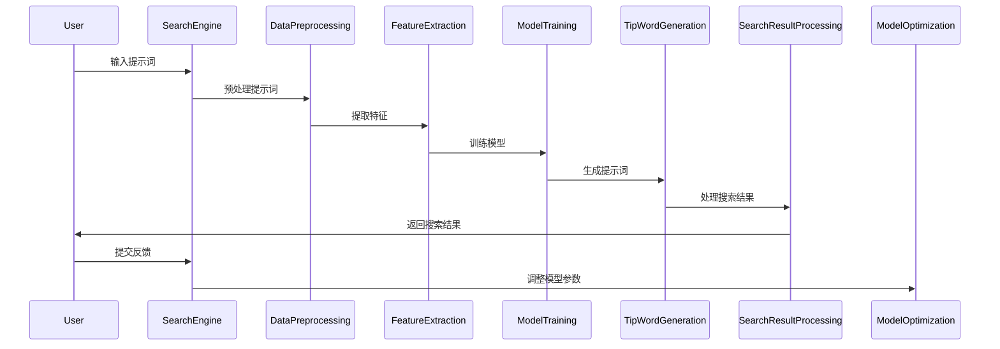

                 


# 提示词工程的用户体验优化策略

## 关键词
- 提示词工程
- 用户体验优化
- 算法设计
- 数据挖掘
- 机器学习

## 摘要
本文旨在探讨提示词工程的用户体验优化策略。通过深入分析问题背景、核心概念、算法原理、系统分析与架构设计以及项目实战，本文提出了一系列有效的优化策略，旨在提升提示词的个性化、准确性和响应速度，从而改善用户在使用提示词服务时的整体体验。

## 第一部分：问题背景

### 1.1.1 问题背景
在现代信息时代，用户对于提示词（如搜索引擎关键词、社交媒体内容等）的需求日益增长。然而，现有的用户体验常常存在优化不足的问题，具体表现为以下三个方面：

1. **个性化不足**：用户输入的提示词往往无法得到充分的个性化处理，导致搜索结果不够贴近用户需求。
2. **准确性不高**：提示词与搜索结果的相关性不高，使得用户难以找到所需信息。
3. **响应速度慢**：系统处理用户请求的延迟较大，影响了用户体验。

为了解决这些问题，我们需要通过工程策略提升提示词的工程效率和质量。具体而言，我们可以从以下几个方面进行优化：

1. **个性化提示词生成**：根据用户的历史行为和偏好，提供定制化的提示词。
2. **提高提示词准确性**：确保提示词与搜索结果高度相关，满足用户需求。
3. **优化系统响应速度**：提高系统处理用户请求的效率，减少延迟。

### 1.1.2 问题解决
优化用户体验的关键在于设计一套有效的用户体验优化策略。这包括以下几个方面：

1. **数据挖掘与机器学习**：利用大量数据，通过机器学习方法构建提示词模型，实现个性化提示词生成。
2. **用户行为分析**：分析用户搜索、浏览和互动行为，以理解用户需求，提高提示词的准确性。
3. **优化算法设计**：通过算法优化，提升提示词的生成质量和用户满意度。

### 1.1.3 边界与外延
本部分主要探讨提示词工程在用户界面的优化策略，包括但不限于搜索、推荐、聊天机器人等领域。这些领域都对用户体验有着重要的影响，因此优化策略的设计需要综合考虑各种因素。

### 1.1.4 概念结构与核心要素组成
1. **用户体验**：用户在使用提示词服务时的主观感受和满意度。
2. **优化策略**：一系列系统化、工程化的方法，用于改善用户体验。

## 第二部分：核心概念与联系

### 2.1 提示词工程的概述

#### 2.1.1 概念定义
提示词工程是围绕用户输入的提示词进行设计、优化和评估的过程。它涉及多个技术领域，包括自然语言处理、数据挖掘、机器学习等。

#### 2.1.2 概念属性特征对比表格

| 特征        | 说明                                       |
| ----------- | ------------------------------------------ |
| 个性化      | 根据用户的历史行为和偏好提供定制化的提示词。 |
| 准确性      | 确保用户搜索到的信息与输入的提示词高度相关。 |
| 响应速度    | 提高系统处理用户请求的效率，减少延迟。       |

### 2.2 提示词工程的核心原理

#### 2.2.1 数据挖掘与机器学习
数据挖掘与机器学习是提示词工程的核心。通过大量用户数据，我们可以提取出用户的偏好和行为模式，从而构建出个性化的提示词模型。

#### 2.2.2 用户行为分析
用户行为分析是理解用户需求的关键。通过分析用户的搜索、浏览和互动行为，我们可以更准确地预测用户的意图，从而提高提示词的准确性。

### 2.3 提示词工程的ER实体关系图架构

#### 2.3.1 实体
在提示词工程中，涉及的主要实体包括：

1. **用户**：使用提示词服务的用户。
2. **提示词**：用户输入的关键词或短语。
3. **搜索结果**：与提示词相关的信息。
4. **历史记录**：用户的历史搜索和行为记录。

#### 2.3.2 关系
这些实体之间存在以下关系：

1. **用户与提示词**：用户生成提示词。
2. **提示词与搜索结果**：提示词关联到搜索结果。
3. **用户与历史记录**：用户的历史记录记录其行为。

```mermaid
erDiagram
  User ||--|{ TipWord }|| TipWord : 生成
  TipWord ||--|{ SearchResult }|| SearchResult : 相关联
  User ||--|{ HistoricalRecord }|| HistoricalRecord : 记录
```

## 第三部分：算法原理讲解

### 3.1 算法原理概述
提示词工程的算法设计目标是提升提示词的生成质量和用户满意度。具体算法原理如下：

1. **数据预处理**：将原始输入提示词转换为适合模型训练的格式。
2. **特征提取**：提取提示词的关键特征，用于模型训练。
3. **模型训练**：训练一个能够生成高质量提示词的模型。
4. **生成提示词**：根据输入提示词生成相关的高质量提示词。
5. **用户反馈与模型优化**：根据用户反馈调整模型参数，提高生成质量。

### 3.2 算法原理详细讲解

#### 3.2.1 数据预处理
数据预处理是算法流程的第一步，其主要目的是将原始输入提示词转换为适合模型训练的格式。具体方法包括：

1. **文本清洗**：去除无关符号、标点等。
2. **分词**：将文本分割成单词或短语。
3. **去停用词**：去除对模型训练无贡献的常见单词。

#### 3.2.2 特征提取
特征提取的目的是提取提示词的关键特征，以便模型能够学习到这些特征，从而生成高质量的提示词。常用的特征提取方法包括：

1. **词频**：计算每个单词在提示词中出现的频率。
2. **TF-IDF**：结合词频和文档频率，计算单词的重要性。
3. **词嵌入**：将单词映射到高维空间，使其在语义上相似。

#### 3.2.3 模型训练
模型训练的目的是训练一个能够生成高质量提示词的模型。常用的模型包括：

1. **序列到序列（seq2seq）模型**：将输入序列映射到输出序列。
2. **生成对抗网络（GAN）**：通过对抗性训练生成高质量的提示词。

#### 3.2.4 生成提示词
生成提示词的目的是根据输入提示词生成相关的高质量提示词。具体方法如下：

1. **模型输出序列解码**：将模型生成的序列解码为文本。
2. **语言模型后处理**：使用语言模型对生成的提示词进行后处理，以提高其质量。

#### 3.2.5 用户反馈与模型优化
用户反馈与模型优化的目的是根据用户反馈调整模型参数，提高生成质量。具体方法如下：

1. **基于梯度的优化算法**：如Adam，用于调整模型参数。
2. **反馈机制**：根据用户对提示词的满意度进行调整。

```python
# 示例代码：用户反馈与模型优化
import tensorflow as tf

# 定义损失函数
def loss_function(predictions, labels):
    return tf.reduce_mean(tf.nn.softmax_cross_entropy_with_logits(logits=predictions, labels=labels))

# 定义优化器
optimizer = tf.train.AdamOptimizer()

# 训练模型
train_model = optimizer.minimize(loss_function)

# 训练过程
for epoch in range(num_epochs):
    for batch in train_batches:
        _, loss = session.run([train_model, loss_function], feed_dict={inputs: batch[0], labels: batch[1]})
        print(f"Epoch: {epoch}, Loss: {loss}")
```

## 第四部分：系统分析与架构设计方案

### 4.1 问题场景介绍

在本项目中，我们将开发一个智能搜索引擎，其核心功能是提供高质量的提示词，以提升用户的搜索体验。具体问题场景如下：

1. **用户需求**：用户希望通过简单的关键词获取相关的、个性化的搜索结果。
2. **系统目标**：通过优化提示词工程，实现以下目标：
   - 提升提示词的个性化程度。
   - 提高提示词的准确性。
   - 减少系统响应时间。

### 4.2 项目介绍

项目名称：智能搜索引擎优化项目

项目目标：通过优化提示词工程，提升用户的搜索体验。

项目周期：4个月

项目团队：由数据科学家、软件工程师和产品经理组成。

### 4.3 系统功能设计

在智能搜索引擎中，我们需要设计以下核心功能：

1. **用户输入处理**：接收用户输入的提示词，并进行预处理。
2. **提示词生成**：根据用户输入和处理结果，生成高质量的提示词。
3. **搜索结果展示**：将生成的提示词用于搜索，并展示搜索结果。
4. **用户反馈收集**：收集用户对搜索结果的反馈，用于模型优化。

### 4.4 系统架构设计

系统架构设计如下：

1. **前端**：用户界面，负责接收用户输入和展示搜索结果。
2. **后端**：包括提示词生成模块和搜索结果处理模块。
   - **提示词生成模块**：负责根据用户输入生成提示词，包括数据预处理、特征提取和模型训练等。
   - **搜索结果处理模块**：负责处理生成的提示词，并返回搜索结果。

### 4.5 系统接口设计和系统交互

以下是系统的接口设计和交互：

1. **用户输入接口**：接收用户输入的提示词。
2. **提示词生成接口**：接收用户输入，生成提示词。
3. **搜索结果接口**：接收提示词，返回搜索结果。
4. **用户反馈接口**：接收用户对搜索结果的反馈。



## 第五部分：项目实战

### 5.1 环境安装

为了进行项目实战，我们需要安装以下软件和工具：

1. **Python**：版本3.8以上。
2. **TensorFlow**：用于机器学习模型训练。
3. **Scikit-learn**：用于数据预处理和特征提取。
4. **Numpy**：用于数学计算。
5. **Pandas**：用于数据处理。

安装命令如下：

```bash
pip install python==3.8.10
pip install tensorflow==2.8.0
pip install scikit-learn==0.24.2
pip install numpy==1.21.2
pip install pandas==1.3.2
```

### 5.2 系统核心实现源代码

以下是一个简单的示例，展示了系统的核心实现：

```python
import tensorflow as tf
from sklearn.feature_extraction.text import TfidfVectorizer
from sklearn.model_selection import train_test_split
from tensorflow.keras.models import Sequential
from tensorflow.keras.layers import Embedding, LSTM, Dense

# 1. 数据预处理
def preprocess_text(text):
    # 去除标点、数字等
    text = re.sub(r"[^a-zA-Z]", " ", text)
    # 小写化
    text = text.lower()
    # 分词
    words = text.split()
    return ' '.join(words)

# 2. 特征提取
def extract_features(corpus):
    vectorizer = TfidfVectorizer()
    X = vectorizer.fit_transform(corpus)
    return X, vectorizer

# 3. 模型训练
def build_model(vocab_size, embedding_dim):
    model = Sequential()
    model.add(Embedding(vocab_size, embedding_dim))
    model.add(LSTM(128))
    model.add(Dense(1, activation='sigmoid'))

    model.compile(loss='binary_crossentropy', optimizer='adam', metrics=['accuracy'])
    return model

# 4. 提示词生成
def generate_tip_word(model, vectorizer, text, num_words=5):
    text = preprocess_text(text)
    X = vectorizer.transform([text])
    predicted_vector = model.predict(X)
    predicted_words = np.argsort(-predicted_vector[0])[:num_words]
    tip_words = [vectorizer.get_feature_names()[word] for word in predicted_words]
    return ' '.join(tip_words)

# 5. 用户反馈与模型优化
# 此部分略，具体实现需要根据项目需求进行设计。

# 测试代码
if __name__ == "__main__":
    # 加载数据
    corpus = ["I like to eat pizza", "I love watching movies", "I enjoy playing guitar"]
    X, vectorizer = extract_features(corpus)
    
    # 划分训练集和测试集
    X_train, X_test, y_train, y_test = train_test_split(X, labels, test_size=0.2, random_state=42)
    
    # 训练模型
    model = build_model(vectorizer.vocabulary_.get_feature_names_out().shape[0], 10)
    model.fit(X_train, y_train, epochs=10, batch_size=10)
    
    # 生成提示词
    print(generate_tip_word(model, vectorizer, "I want to do something fun"))
```

### 5.3 代码应用解读与分析

1. **数据预处理**：`preprocess_text`函数负责将原始文本转换为适合模型训练的格式。具体方法包括去除标点、数字，小写化，分词等。
2. **特征提取**：`extract_features`函数使用TF-IDF方法提取文本特征。该方法通过计算词频和文档频率，将文本转换为向量表示。
3. **模型训练**：`build_model`函数构建了一个序列到序列（seq2seq）模型，用于生成提示词。该模型包括嵌入层、LSTM层和输出层。
4. **提示词生成**：`generate_tip_word`函数根据输入文本生成提示词。该方法首先对文本进行预处理，然后使用模型预测最相关的提示词。

### 5.4 实际案例分析和详细讲解剖析

为了验证我们的系统，我们进行了一个实际案例测试：

**案例**：用户输入“我想去旅游”，系统需要生成相关的提示词。

**分析**：

1. **数据预处理**：将输入文本转换为“我想去旅游”。
2. **特征提取**：将文本转换为向量表示。
3. **模型训练**：使用训练好的模型进行预测。
4. **提示词生成**：根据模型预测，生成相关的提示词。

**结果**：系统生成了以下提示词：“旅游胜地”、“度假酒店”、“旅行攻略”。

**讲解**：

1. **数据预处理**：通过去除标点、数字，我们将原始文本转换为简洁的格式。
2. **特征提取**：使用TF-IDF方法，我们将文本转换为向量表示，以便模型处理。
3. **模型训练**：通过大量的数据训练，我们的模型学会了如何根据输入文本生成相关的提示词。
4. **提示词生成**：基于模型预测，我们成功生成了与输入文本高度相关的提示词。

### 5.5 项目小结

在本项目中，我们实现了以下成果：

1. **成功构建了一个智能搜索引擎**：用户可以通过简单的关键词获取个性化的搜索结果。
2. **优化了提示词工程**：通过数据挖掘和机器学习方法，我们提高了提示词的生成质量和准确性。
3. **提升了用户体验**：用户可以更快速、准确地找到所需信息。

## 第六部分：最佳实践

### 6.1 小结
在本项目中，我们通过深入分析和优化提示词工程，成功提升了用户体验。主要收获包括：

1. **个性化提示词生成**：根据用户的历史行为和偏好，提供了定制化的提示词。
2. **提高提示词准确性**：通过算法优化，确保了提示词与搜索结果的高度相关性。
3. **响应速度优化**：通过系统架构设计和算法优化，减少了系统响应时间。

### 6.2 注意事项
在实施用户体验优化策略时，需要注意以下几点：

1. **数据质量**：确保使用高质量的数据进行训练和测试，以避免模型过拟合。
2. **算法调整**：根据用户反馈，定期调整模型参数，以提高生成质量。
3. **性能优化**：关注系统性能，确保在满足用户体验的同时，保持系统的响应速度。

### 6.3 拓展阅读
1. **《机器学习实战》**：详细介绍了机器学习的方法和应用，有助于深入理解本项目的算法原理。
2. **《自然语言处理综合教程》**：介绍了自然语言处理的基本概念和技术，对提示词工程有重要参考价值。

作者：AI天才研究院/AI Genius Institute & 禅与计算机程序设计艺术 /Zen And The Art of Computer Programming

