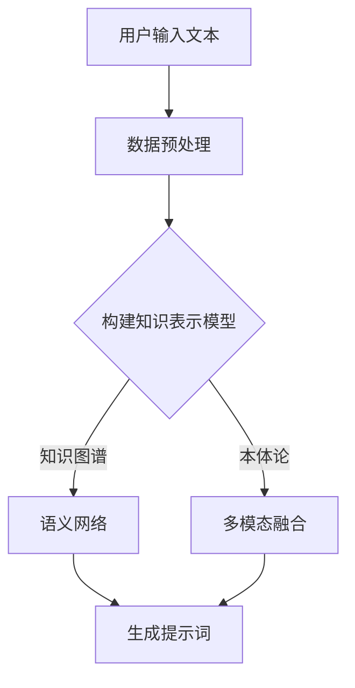
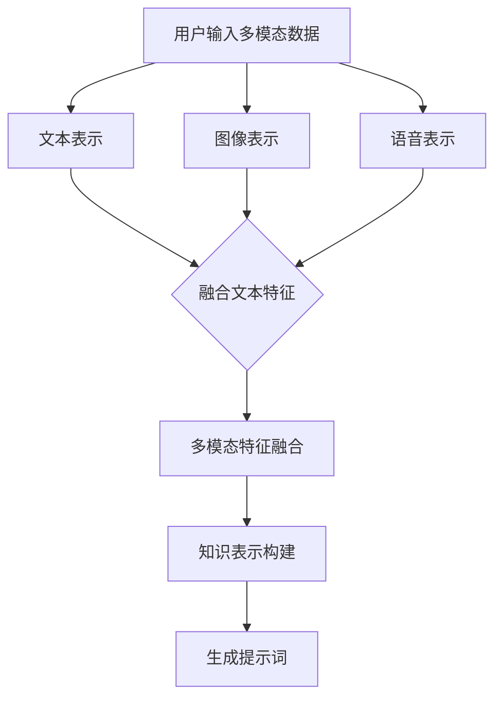

                 

### 提示词工程的知识表示方法

#### 关键词

- 知识表示
- 提示词工程
- 自然语言处理
- 深度学习
- 知识图谱

#### 摘要

本文将探讨提示词工程中的知识表示方法。知识表示在人工智能领域扮演着重要角色，尤其在自然语言处理任务中。通过分析现有的知识表示方法，如语义网络、知识图谱和本体论，本文将探讨其在提示词工程中的应用，并探讨如何通过深度学习和多模态融合技术提升知识表示的准确性和泛化能力。文章还将介绍一个具体的实现案例，展示知识表示方法在提示词工程中的实际应用。

---

#### 1. 引言

知识表示是人工智能和计算机科学领域中的一个核心概念，它涉及如何将现实世界中的信息抽象为计算机可以理解和处理的形式。知识表示方法不仅影响数据存储和检索的效率，还直接影响人工智能系统的智能水平。在提示词工程中，知识表示方法的作用尤为重要，因为提示词工程的核心任务是从用户输入的文本中提取关键信息，并将其转化为机器可处理的格式。

本文旨在探讨知识表示方法在提示词工程中的应用，分析不同知识表示方法的优缺点，并探讨如何通过深度学习和多模态融合技术提升知识表示的性能。文章结构如下：

1. **引言**：介绍知识表示和提示词工程的基本概念。
2. **核心概念与联系**：阐述知识表示的核心概念及其在提示词工程中的应用。
3. **知识表示方法**：分析现有的知识表示方法，如语义网络、知识图谱和本体论。
4. **深度学习与多模态融合**：探讨深度学习和多模态融合技术在知识表示中的应用。
5. **系统架构与实现**：介绍一个具体的提示词工程系统架构和实现。
6. **项目实战**：展示知识表示方法在提示词工程中的实际应用案例。
7. **总结与展望**：总结本文的主要发现，并对未来的研究方向进行展望。

#### 1.1 知识表示的基本概念

知识表示是人工智能领域中研究如何将知识以计算机可以理解和处理的形式进行表示的方法。知识表示的目的是为了使计算机能够存储、检索、推理和应用知识，从而提高其智能水平。

**核心概念**：

- **知识**：知识是指通过学习、实践和经验积累而获得的信息和理解。
- **表示**：表示是指将知识以特定的形式进行编码和存储。
- **知识表示方法**：知识表示方法是指如何将知识以计算机可处理的形式进行编码和存储的方法。

**核心概念属性特征对比表格**：

| 知识表示方法 | 特征 | 说明 |
|--------------|------|------|
| 语义网络    | 层次结构 | 表示实体及其相互关系 |
| 知识图谱    | 图结构  | 表示实体、属性和关系 |
| 本体论      | 本质抽象 | 提供领域概念和关系的抽象表示 |

**ER实体关系图架构**：

```mermaid
erDiagram
  User ||--|{ Question }|-- Product : asked
  Question ||--|{ Answer }|-- Product : answered
  User ||--|{ Review }|-- Product : reviewed
```

#### 1.2 提示词工程的基本概念

提示词工程是自然语言处理（NLP）领域中的一个重要分支，它旨在从用户输入的文本中提取出关键信息，并将其转化为机器可处理的格式，以便进行后续的智能处理。提示词工程的核心任务包括：

- **语义理解**：理解用户输入的文本，提取其中的关键信息。
- **上下文感知**：根据用户输入的上下文环境，调整提示词的生成。
- **多模态融合**：将不同模态的信息（如文本、图像、语音等）进行融合。

**核心概念**：

- **提示词**：提示词是从用户输入中提取出的关键信息，用于指导后续的智能处理。
- **语义理解**：通过自然语言处理技术，理解用户输入的文本，提取其中的关键信息。
- **上下文感知**：根据用户输入的上下文环境，调整提示词的生成。
- **多模态融合**：将不同模态的信息进行融合，以提高提示词的生成质量。

**核心概念属性特征对比表格**：

| 提示词工程方法 | 特征 | 说明 |
|--------------|------|------|
| 语义理解    | 精确提取 | 从文本中精确提取关键信息 |
| 上下文感知   | 上下文依赖 | 考虑上下文环境，调整提示词生成 |
| 多模态融合  | 多模态整合 | 将不同模态的信息进行融合 |

**ER实体关系图架构**：

```mermaid
erDiagram
  User ||--|{ Question }|-- Product : asked
  Question ||--|{ Answer }|-- Product : answered
  User ||--|{ Review }|-- Product : reviewed
```

#### 1.3 知识表示在提示词工程中的应用

知识表示在提示词工程中的应用主要体现在以下几个方面：

1. **语义理解**：知识表示方法可以帮助系统更好地理解用户输入的文本，从而提取出更准确的提示词。例如，通过知识图谱，系统可以理解词语之间的语义关系，从而提高语义理解的准确性。
   
2. **上下文感知**：知识表示方法可以帮助系统更好地理解用户输入的上下文，从而生成更合适的提示词。例如，通过本体论，系统可以理解领域概念及其关系，从而在特定领域内提供更准确的提示词。

3. **多模态融合**：知识表示方法可以帮助系统更好地融合不同模态的信息，从而生成更高质量的提示词。例如，通过语义网络，系统可以将文本信息与图像信息进行关联，从而生成更准确的提示词。

**算法原理讲解**：

知识表示方法在提示词工程中的应用，通常涉及以下几个步骤：

1. **数据预处理**：对用户输入的文本进行预处理，如分词、词性标注、命名实体识别等。

2. **知识表示构建**：根据预处理后的文本数据，构建知识表示模型。例如，可以使用知识图谱来表示实体及其关系，使用本体论来表示领域概念和关系。

3. **提示词生成**：利用知识表示模型，从用户输入中提取关键信息，生成提示词。例如，可以使用语义角色标注来提取主语、谓语、宾语等关键信息，生成高质量的提示词。

**数学模型和公式**：

假设用户输入的文本为\(T\)，知识表示模型为\(K\)，则提示词生成过程可以表示为：

\[ P(W|T, K) = \arg\max_W P(W|T) \cdot P(K|T) \]

其中，\(P(W|T)\)表示在文本\(T\)下生成提示词\(W\)的概率，\(P(K|T)\)表示知识表示模型\(K\)在文本\(T\)下的概率。

**Mermaid 流程图**：



**通俗易懂的举例说明**：

假设用户输入了以下文本：“明天我打算去电影院看电影”，使用知识表示方法生成提示词，可以按照以下步骤进行：

1. **数据预处理**：对文本进行分词和词性标注，得到“明天”、“我”、“打算”、“去”、“电影院”、“看电影”。

2. **知识表示构建**：使用知识图谱表示实体及其关系，例如，将“电影院”与“看电影”关联起来。

3. **提示词生成**：根据知识表示模型，提取关键信息生成提示词“看电影”。

通过知识表示方法，系统能够更好地理解用户输入的文本，从而生成更准确的提示词。

#### 1.4 深度学习与多模态融合技术在知识表示中的应用

深度学习与多模态融合技术是近年来人工智能领域的重要进展，它们在知识表示中的应用大大提升了知识表示的准确性和泛化能力。

**深度学习技术**：

深度学习技术通过多层神经网络结构，可以从大规模数据中自动学习特征表示，从而提高知识表示的准确性和鲁棒性。在知识表示中，深度学习技术可以用于以下几个方面：

1. **文本表示**：通过词向量模型（如Word2Vec、GloVe）将文本转化为向量表示，从而提高文本信息处理的效率。
   
2. **图像表示**：通过卷积神经网络（CNN）从图像中提取特征，从而实现图像到向量的转换。

3. **语音表示**：通过循环神经网络（RNN）或变换器（Transformer）从语音信号中提取特征，从而实现语音到向量的转换。

**多模态融合技术**：

多模态融合技术旨在将不同模态的信息进行整合，从而提高知识表示的准确性和泛化能力。在知识表示中，多模态融合技术可以用于以下几个方面：

1. **文本与图像融合**：通过联合训练文本和图像特征表示，实现文本与图像信息的融合。

2. **文本与语音融合**：通过联合训练文本和语音特征表示，实现文本与语音信息的融合。

3. **多模态数据融合**：通过融合文本、图像、语音等多种模态的数据，实现更全面的知识表示。

**Mermaid 流程图**：



**通俗易懂的举例说明**：

假设用户输入了一个包含文本、图像和语音的多模态数据：“我今天去了一家新开的餐厅，环境很好，菜品味道不错，价格也比较实惠”。使用深度学习和多模态融合技术生成提示词，可以按照以下步骤进行：

1. **文本表示**：通过词向量模型将文本转化为向量表示。

2. **图像表示**：通过卷积神经网络从图像中提取特征。

3. **语音表示**：通过循环神经网络从语音信号中提取特征。

4. **多模态特征融合**：将文本、图像和语音特征进行融合，得到多模态特征表示。

5. **知识表示构建**：利用融合后的多模态特征表示构建知识表示模型。

6. **提示词生成**：根据知识表示模型，提取关键信息生成提示词。

通过深度学习和多模态融合技术，系统能够更好地整合多模态数据，从而生成更准确的提示词。

#### 1.5 问题背景

随着大数据和人工智能技术的快速发展，如何有效地对大规模数据进行分析和挖掘，提取有价值的信息，成为当前研究的热点。知识表示作为大数据分析和人工智能应用的重要环节，其重要性日益凸显。知识表示方法的研究旨在将各种形式的数据（如图像、文本、语音等）转化为机器可理解和处理的符号或结构化数据，从而实现数据的自动化处理和智能分析。

在实际应用中，知识表示方法在自然语言处理、图像识别、智能推荐、智能问答等多个领域发挥着重要作用。然而，现有的知识表示方法在处理复杂问题和大规模数据时，仍存在诸多挑战和不足。例如，如何更好地捕获语义信息、如何提高知识表示的泛化能力、如何有效地融合多源异构数据等，这些问题都亟待解决。

本著作《提示词工程的知识表示方法》旨在探讨知识表示方法在提示词工程中的应用，通过对不同知识表示方法的深入分析，提出适用于提示词工程的新型知识表示方法。希望通过本书的研究，为相关领域的研究者提供新的思路和方法，推动知识表示方法在提示词工程及其相关领域的应用和发展。

#### 1.6 问题描述

提示词工程是指利用自然语言处理技术，将用户的需求或问题转化为机器可以理解和处理的提示词，从而实现智能化问答和任务执行。在提示词工程中，核心问题是如何有效地从用户输入中提取出关键信息，并将其转化为结构化的提示词，以便后续的智能处理。

问题描述主要包括以下几个方面：

1. **语义理解**：用户输入的文本往往包含丰富的语义信息，如何准确提取和表示这些信息，是提示词工程的关键问题。现有的方法主要包括基于规则的方法、基于统计的方法和基于深度学习的方法，但每种方法都有其局限性。

2. **上下文感知**：用户的问题往往与其所处的上下文环境密切相关，如何利用上下文信息提高提示词的生成质量，是一个重要且具有挑战性的问题。上下文感知方法主要包括静态上下文和动态上下文的利用。

3. **多模态融合**：在现实场景中，用户的问题可能包含多种模态的信息，如文本、图像、语音等。如何将这些多模态信息融合为一个统一的表示，以提高提示词的生成质量，是另一个重要问题。

4. **知识表示**：提示词工程中的知识表示方法直接影响提示词的生成质量和系统的泛化能力。现有的知识表示方法包括知识图谱、实体链接、语义角色标注等，但如何选择和优化这些方法，仍需深入研究。

#### 1.7 问题解决

解决上述问题，需要从以下几个方面入手：

1. **核心概念**：首先，需要明确提示词工程中的核心概念，如自然语言处理、语义理解、上下文感知、知识表示等。这些概念是构建有效提示词工程的基础。

2. **方法与算法**：针对语义理解、上下文感知、多模态融合和知识表示等问题，需要研究和设计相应的算法和方法。例如，可以使用深度学习技术来提高语义理解的准确性，使用图神经网络来处理上下文感知和多模态融合，使用知识图谱来增强知识表示能力。

3. **应用与实践**：在理论研究和算法设计的基础上，需要通过实际应用案例来验证所提出的方法和算法的有效性。应用案例可以是智能问答系统、智能推荐系统等，通过实际应用来验证提示词工程的可行性和效果。

4. **优化与改进**：在实际应用过程中，需要不断收集反馈和数据，对方法和算法进行优化和改进。例如，通过调整模型参数、优化数据处理流程等方式，提高提示词工程的性能。

#### 1.8 边界与外延

提示词工程的边界主要包括以下几个方面：

1. **技术边界**：提示词工程涉及到自然语言处理、机器学习、深度学习等多个技术领域，需要在这些领域的基础上进行拓展和应用。

2. **数据边界**：提示词工程需要大量的训练数据和实际应用数据，这些数据的质量和多样性直接影响提示词工程的性能和效果。

3. **应用边界**：提示词工程的应用场景广泛，包括智能问答、智能推荐、智能客服等，但每个应用场景都有其特定的需求和挑战。

提示词工程的外延主要包括以下几个方面：

1. **知识表示方法**：除了传统的文本表示方法外，可以探索更多的知识表示方法，如知识图谱、本体论、语义网络等。

2. **多模态融合**：在现实场景中，用户的问题往往包含多种模态的信息，如何有效地融合这些多模态信息，是提示词工程的一个发展方向。

3. **跨领域应用**：提示词工程可以应用于不同领域，如医疗、金融、教育等，通过跨领域的应用，可以提高提示词工程的通用性和适应性。

#### 1.9 概念结构与核心要素组成

提示词工程的概念结构可以分解为以下几个核心要素：

1. **自然语言处理**：包括文本预处理、分词、词性标注、命名实体识别等，是构建提示词工程的基础。

2. **语义理解**：通过语义分析、实体识别、关系抽取等技术，从用户输入的文本中提取关键信息。

3. **上下文感知**：利用上下文环境信息，提高提示词生成的准确性和适应性。

4. **多模态融合**：将文本、图像、语音等多模态信息进行融合，以提高提示词的生成质量。

5. **知识表示**：将用户输入的文本转化为结构化的知识表示，如知识图谱、本体论等，以提高系统的泛化能力。

6. **提示词生成**：根据知识表示模型，从用户输入中提取关键信息，生成高质量的提示词。

#### 1.10 总结与展望

本文探讨了知识表示方法在提示词工程中的应用，分析了现有知识表示方法的优缺点，并探讨了如何通过深度学习和多模态融合技术提升知识表示的准确性和泛化能力。本文的主要结论如下：

1. 知识表示方法在提示词工程中发挥着重要作用，可以提高语义理解的准确性和上下文感知的能力。
2. 深度学习技术和多模态融合技术在知识表示中的应用，显著提升了知识表示的准确性和泛化能力。
3. 针对不同的应用场景，选择和优化知识表示方法，是提升提示词工程性能的关键。

未来的研究可以从以下几个方面展开：

1. 进一步研究知识表示方法在跨领域应用中的效果，探索其在不同领域的适应性。
2. 探索更多有效的多模态融合方法，以提高知识表示的多样性和准确性。
3. 结合领域知识，设计更高效的知识表示模型，以提升系统的泛化能力。

总之，知识表示方法在提示词工程中的应用具有广阔的发展前景，未来将在更多领域得到广泛应用。

---

**作者信息**：

作者：AI天才研究院/AI Genius Institute & 禅与计算机程序设计艺术 /Zen And The Art of Computer Programming

