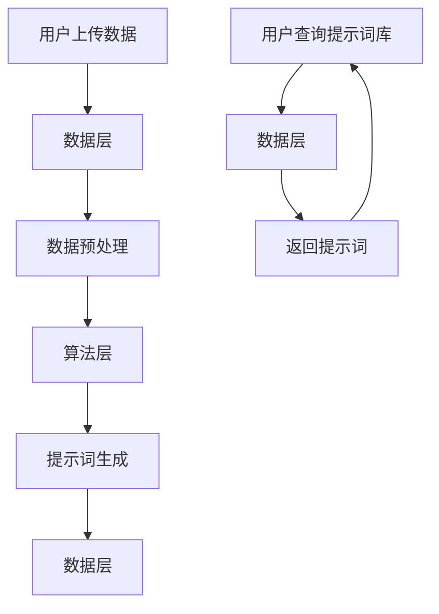
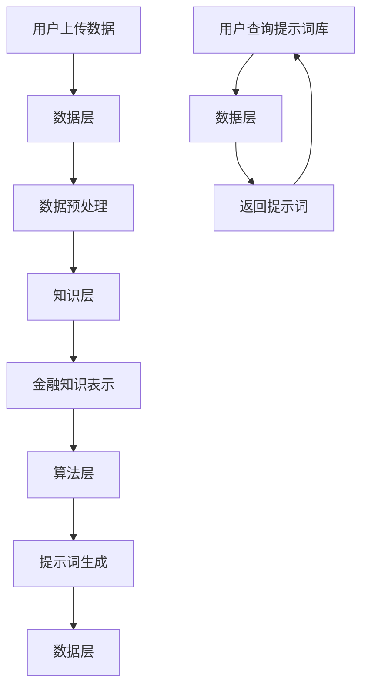

                 

# 提示词工程的知识表示标准化实践

## 关键词
- 提示词工程
- 知识表示
- 标准化实践
- 自然语言处理
- 语义分析
- 数据驱动方法
- 算法实现
- 案例分析

## 摘要
本文深入探讨了提示词工程中的知识表示标准化实践，首先概述了提示词工程的基本概念和重要性。接着，我们介绍了知识表示的基本原理和关键方法，以及如何设计提示词的标准化框架。文章详细分析了语义分析在提示词工程中的应用，讨论了自然语言处理和数据驱动方法的原理和实现。通过系统分析与架构设计，我们展示了如何实现一个高效的提示词工程系统。最后，通过实际案例，我们深入剖析了提示词工程中的实现和优化策略，并提出了最佳实践和未来趋势。本文旨在为从事提示词工程的研究人员和开发者提供一套系统化、标准化的实践指南。

## 第1章 提示词工程概述

### 1.1 提示词工程的重要性

在人工智能与自然语言处理技术不断发展的今天，提示词工程（Prompt Engineering）已成为一个至关重要的领域。提示词工程涉及创建和优化用于与机器学习模型交互的提示词，以提高模型的性能和效率。这种技术不仅用于生成自动回复、智能助手等应用，还广泛应用于文本生成、问答系统、信息提取等领域。

首先，让我们从定义上明确提示词工程的概念。提示词工程是一种跨学科的技术，它结合了语言学、计算机科学、心理学和认知科学。在机器学习领域，提示词被定义为一种引导模型生成目标输出的人类语言提示。通过精心设计和优化的提示词，我们可以显著提升模型的训练效果和生成质量。

提示词工程的重要性体现在以下几个方面：

1. **性能优化**：有效的提示词可以帮助机器学习模型更好地理解和处理输入数据，从而提高模型的准确性和效率。

2. **用户体验**：高质量的提示词可以改善用户与机器学习系统的交互体验，使系统更加直观和易用。

3. **多样性**：提示词工程还可以促进模型生成多样化和创新性的输出，这对于创意内容生成和个性化服务至关重要。

4. **可解释性**：通过优化提示词，我们可以增强模型的透明度和可解释性，这对于提升用户信任和模型可靠性至关重要。

### 1.2 提示词工程的基本概念

为了更好地理解提示词工程，我们需要了解一些基本概念。以下是一些核心概念及其定义：

- **提示词（Prompt）**：提示词是一种用于引导模型生成特定输出的文本。它可以是简单的关键词，也可以是复杂的句子或段落。

- **机器学习模型**：机器学习模型是用于自动从数据中学习并做出预测或决策的算法。常见的机器学习模型包括神经网络、决策树、支持向量机等。

- **自然语言处理（NLP）**：自然语言处理是计算机科学和人工智能的一个分支，旨在使计算机能够理解、处理和生成自然语言文本。

- **语义分析**：语义分析是NLP中的一个重要任务，旨在理解和解释文本的含义。它包括词义消歧、实体识别、情感分析等。

- **数据集**：数据集是用于训练和评估机器学习模型的文本集合。高质量的数据集是确保模型性能的关键。

### 1.3 提示词工程的发展历程

提示词工程的发展历程可以追溯到20世纪90年代的早期自然语言处理研究。当时，研究人员开始探索如何使用文本提示来指导机器学习模型。随着深度学习技术的发展，特别是循环神经网络（RNN）和Transformer模型的兴起，提示词工程迎来了新的发展机遇。

以下是一些重要的里程碑：

1. **早期研究**（1990s）：研究人员开始使用关键词和简单的句子作为提示词，以提高模型的文本生成能力。

2. **深度学习时代**（2010s）：随着深度学习技术的进步，提示词工程得到了广泛应用。RNN和其变种LSTM（长短期记忆网络）以及Transformer模型的出现，为提示词工程提供了新的方法和工具。

3. **多模态学习**（2020s）：当前，多模态学习成为趋势，提示词工程也扩展到了图像、声音和其他数据类型的处理。

### 1.4 提示词工程的核心挑战

尽管提示词工程取得了显著进展，但仍面临着一些核心挑战：

1. **数据隐私**：在使用用户生成的数据时，保护用户隐私是一个重要问题。

2. **文本质量**：设计高质量的提示词需要大量的时间和专业知识，以确保模型能够生成准确和相关的输出。

3. **跨模态挑战**：将提示词工程扩展到多模态数据（如图像和音频）需要解决新的问题，例如如何处理不同模态之间的信息不一致。

4. **计算资源**：训练大型深度学习模型需要大量的计算资源和时间，这对资源和成本控制提出了挑战。

5. **可解释性**：提高模型的可解释性，使非专业人士也能理解模型的决策过程，是一个重要的研究方向。

在接下来的章节中，我们将进一步探讨知识表示的基本原理，以及如何设计提示词的标准化框架。我们将讨论语义分析、自然语言处理和数据驱动方法，并展示如何实现一个高效的提示词工程系统。通过实际案例的分析，我们将深入理解提示词工程中的实现和优化策略，并展望其未来的发展趋势。

### 第2章 知识表示的基本原理

#### 2.1 知识表示的概念

知识表示是人工智能领域的一个重要研究方向，旨在将人类知识和信息以计算机可理解的形式进行编码和存储。知识表示的核心目标是使计算机能够处理和理解人类语言、概念和逻辑结构。在机器学习和自然语言处理（NLP）中，知识表示是一个关键环节，它决定了模型对输入数据的理解和生成输出的能力。

知识表示的基本概念包括：

- **知识**：知识是指对事实、规则、经验和概念的理解和掌握。在计算机科学中，知识通常被编码为数据结构或算法。
  
- **表示**：表示是指将知识以某种形式表示出来，使其能够被计算机处理。知识表示包括形式化表示和计算表示。

- **知识表示方法**：知识表示方法是指将知识编码成计算机可理解的形式的技术和策略。常见的知识表示方法包括语义网络、本体论、逻辑表示和框架表示等。

#### 2.2 知识表示的方法

知识表示的方法多种多样，每种方法都有其独特的特点和适用场景。以下是一些常见的知识表示方法：

1. **语义网络**（Semantic Network）
   语义网络是一种图结构的知识表示方法，它使用节点和边来表示概念及其关系。节点表示概念，边表示概念之间的关系，如“是”、“属于”等。语义网络可以直观地表示复杂的关系和层次结构，但通常难以处理大规模数据。

2. **本体论**（Ontology）
   本体论是一种基于语义网络的知识表示方法，它旨在为特定领域提供一套一致的术语和定义。本体论可以用于表示概念、属性、关系和实例，从而支持推理和知识发现。

3. **逻辑表示**（Logical Representation）
   逻辑表示使用形式逻辑（如谓词逻辑）来表示知识，这使知识表示更加精确和严格。逻辑表示可以用于推理和验证知识的一致性，但通常难以处理复杂和不确定的知识。

4. **框架表示**（Frame Representation）
   框架表示通过定义一组角色和关系来表示知识。每个框架包含一组预定义的属性和关系，这些属性和关系可以用于描述特定类型的实体。框架表示直观且易于理解，但难以处理复杂和动态的知识。

5. **概念图**（Conceptual Graph）
   概念图是一种基于语义网络和框架表示的知识表示方法，它使用节点和边来表示概念及其关系，同时保留了语义网络的灵活性和框架表示的直观性。

#### 2.3 知识表示的模型

知识表示的模型是指用于表示知识和信息的结构化框架。以下是一些常见的知识表示模型：

1. **知识图谱**（Knowledge Graph）
   知识图谱是一种大规模、结构化、语义丰富的知识表示模型，它使用节点（实体）和边（关系）来表示知识和信息。知识图谱可以用于语义检索、知识推理和智能问答。

2. **本体论模型**（Ontological Model）
   本体论模型是一种基于本体论的知识表示模型，它用于表示领域知识、概念及其关系。本体论模型可以用于领域建模、知识共享和推理。

3. **本体论 - 知识图谱模型**（Ontology-Knowledge Graph Model）
   本体论 - 知识图谱模型结合了本体论和知识图谱的优势，用于表示复杂和动态的知识。该模型可以在本体论的层次上定义概念和关系，同时利用知识图谱的结构化和语义信息。

4. **语义网络模型**（Semantic Network Model）
   语义网络模型是一种基于节点和边的知识表示模型，它用于表示概念及其关系。语义网络模型可以用于知识表示、推理和可视化。

#### 2.4 知识表示的应用

知识表示在多个领域都有广泛应用，以下是其中的一些例子：

1. **自然语言处理**（NLP）
   在自然语言处理中，知识表示用于表示词义、语法结构、语义关系等。知识表示技术可以用于词向量模型、语义分析、情感分析等任务。

2. **语义网**（Semantic Web）
   语义网是一种基于Web的技术，它使用知识表示来增强Web内容的意义和互操作性。知识表示技术可以用于语义检索、智能代理和知识共享。

3. **智能问答**（Intelligent Question Answering）
   在智能问答系统中，知识表示用于表示问题、答案和知识库。知识表示技术可以用于问题解析、答案生成和知识推理。

4. **推荐系统**（Recommendation Systems）
   在推荐系统中，知识表示用于表示用户、物品和偏好。知识表示技术可以用于用户行为分析、物品推荐和个性化服务。

5. **知识管理**（Knowledge Management）
   在知识管理系统中，知识表示用于表示知识和信息。知识表示技术可以用于知识组织、共享和协作。

在下一章中，我们将探讨如何设计提示词工程的标准化框架，以及实现这一框架的关键步骤和工具。我们将讨论语义分析、自然语言处理和数据驱动方法，并展示如何将知识表示应用于提示词工程中，以实现高效的模型训练和输出生成。

### 第3章 提示词设计的标准化框架

#### 3.1 提示词标准化的意义

在提示词工程中，标准化是一个至关重要的环节。提示词标准化不仅有助于提高模型的训练效果和生成质量，还能提升系统的可维护性和可扩展性。标准化的意义主要体现在以下几个方面：

1. **统一接口**：通过标准化，我们可以为不同的机器学习模型提供一个统一的接口，使开发人员能够更轻松地集成和更换模型。

2. **提高性能**：标准化的提示词设计可以优化模型的训练过程，减少不必要的计算和资源浪费，从而提高模型的性能和效率。

3. **可复用性**：标准化的提示词可以跨项目和领域复用，减少重复工作，提高开发效率。

4. **可解释性**：标准化的提示词设计有助于提高模型的可解释性，使非专业人士也能理解模型的决策过程。

5. **一致性**：标准化的提示词设计可以确保系统在不同环境和条件下的一致性表现，降低错误和故障的风险。

#### 3.2 提示词标准化框架

提示词标准化框架是一个系统化的方法论，用于指导提示词的设计、开发和评估。以下是一个简化的提示词标准化框架：

1. **需求分析**：首先，我们需要明确系统的需求，包括用户目标、功能需求、性能要求等。需求分析是设计标准化框架的基础。

2. **设计阶段**：
   - **概念设计**：确定提示词的类型、结构和属性，设计一个初步的提示词原型。
   - **详细设计**：细化概念设计，包括提示词的文本内容、格式和语义结构。

3. **开发阶段**：
   - **代码实现**：根据详细设计，开发提示词的代码实现，确保其可维护性和可扩展性。
   - **测试与验证**：对提示词进行单元测试和集成测试，验证其功能和行为是否符合预期。

4. **部署阶段**：
   - **上线与监控**：将提示词部署到生产环境，并进行实时监控，确保其稳定性和性能。
   - **迭代优化**：根据用户反馈和性能数据，对提示词进行迭代优化，不断提升其质量。

#### 3.3 提示词标准化流程

提示词标准化流程是一个迭代和逐步完善的过程。以下是一个简化的提示词标准化流程：

1. **需求分析**：
   - 确定系统目标和用户需求。
   - 分析现有数据和模型，确定所需的知识和信息。

2. **概念设计**：
   - 设计提示词的基本结构，包括文本、格式和语义。
   - 确定提示词的类型和用途。

3. **详细设计**：
   - 细化提示词的文本内容，确保其符合用户需求和模型预期。
   - 设计提示词的格式和样式，确保其易于理解和处理。

4. **开发阶段**：
   - 实现提示词的代码，确保其可维护性和可扩展性。
   - 进行单元测试和集成测试，验证其功能和行为。

5. **部署阶段**：
   - 将提示词部署到生产环境，并进行实时监控。
   - 根据用户反馈和性能数据，进行迭代优化。

#### 3.4 提示词标准化案例

以下是一个简化的提示词标准化案例，用于问答系统：

**需求分析**：
- 系统目标：提供一个智能问答系统，能够回答用户关于某一特定主题的问题。
- 用户需求：用户希望能够以自然语言的形式提出问题，并获得准确和相关的回答。

**概念设计**：
- 提示词类型：问题引导词和回答引导词。
- 提示词结构：包括问题的主题、关键词和回答的期望形式。

**详细设计**：
- 问题引导词：“请描述一下关于XX主题的XX问题。”
- 回答引导词：“请给出关于XX问题的XX方面的答案。”

**开发阶段**：
- 实现代码：使用自然语言处理（NLP）技术，处理和生成提示词。
- 测试与验证：测试提示词的语法、语义和功能，确保其符合预期。

**部署阶段**：
- 部署提示词：将提示词集成到问答系统中，进行实时监控。
- 迭代优化：根据用户反馈和系统性能数据，优化提示词的设计和实现。

通过以上步骤，我们可以设计出高质量的提示词，提高问答系统的性能和用户体验。在下一章中，我们将探讨语义分析在提示词工程中的应用，以及如何利用语义分析技术优化提示词的设计和实现。

### 第4章 提示词工程中的语义分析

#### 4.1 语义分析的基本概念

语义分析（Semantic Analysis）是自然语言处理（NLP）中的一个关键任务，旨在理解和解释文本的含义。语义分析的目的是将文本转化为计算机可以理解和操作的形式，以便进行进一步处理和分析。语义分析涉及到文本中的词汇、短语、句子和段落等多个层次，其核心目标是提取文本的语义信息，包括实体、关系、情感和意图等。

**语义分析的基本概念**包括：

- **词义消歧**（Word Sense Disambiguation）：确定文本中的单词在特定上下文中的准确含义。
- **实体识别**（Entity Recognition）：识别文本中提到的实体，如人名、地名、组织名等。
- **关系提取**（Relation Extraction）：确定文本中实体之间的关系，如“苹果公司是苹果的制造商”中的“是制造商”关系。
- **情感分析**（Sentiment Analysis）：判断文本的情感倾向，如正面、负面或中性。
- **意图识别**（Intent Recognition）：理解文本的意图或目的，如用户在发送消息时希望进行的操作。

#### 4.2 语义分析的技术

语义分析技术多种多样，每种技术都有其独特的原理和应用。以下是一些常见的语义分析技术：

1. **词袋模型**（Bag of Words，BoW）
   词袋模型是一种基于文本集合的表示方法，它将文本转换为词汇的集合，不考虑词汇的顺序和语法结构。词袋模型常用于文本分类和文本相似度计算。

2. **TF-IDF**（Term Frequency-Inverse Document Frequency）
   TF-IDF是一种用于衡量词语重要性的统计方法。TF表示词在一个文档中出现的频率，IDF表示词在文档集合中出现的逆频率。TF-IDF常用于文本相似度计算和文本分类。

3. **词嵌入**（Word Embedding）
   词嵌入是一种将词语映射为高维向量表示的方法。词嵌入可以捕捉词语之间的语义关系，如相似性、相关性等。常见的词嵌入方法包括Word2Vec、GloVe和BERT等。

4. **依存句法分析**（Dependency Parsing）
   依存句法分析是一种基于语法结构的语义分析方法，它通过分析词语之间的依存关系来理解句子的结构。依存句法分析可以用于句子解析、语义关系提取等任务。

5. **命名实体识别**（Named Entity Recognition，NER）
   命名实体识别是一种用于识别文本中具有特定意义的实体（如人名、地名、组织名等）的方法。NER是信息提取和知识表示的重要基础。

6. **情感分析**（Sentiment Analysis）
   情感分析是一种用于判断文本情感倾向的方法。情感分析可以用于社交媒体监测、市场调研等应用。

7. **文本分类**（Text Classification）
   文本分类是一种将文本数据分类到预定义类别的方法。文本分类可以用于垃圾邮件检测、新闻分类等任务。

8. **意图识别**（Intent Recognition）
   意图识别是一种用于理解文本意图或目的的方法。意图识别可以用于智能助手、聊天机器人等应用。

#### 4.3 语义分析在提示词工程中的应用

语义分析在提示词工程中扮演着关键角色，它可以帮助我们更好地理解和生成高质量、高相关的提示词。以下是一些具体的例子：

1. **问题引导词生成**：
   通过语义分析，我们可以理解用户提出的问题，并生成相应的问题引导词。例如，对于用户提出的问题“苹果公司的总部在哪里？”，我们可以生成引导词“请描述苹果公司的地理位置”。

2. **回答引导词生成**：
   语义分析可以帮助我们理解问题的答案类型和内容。例如，对于用户提出的问题“苹果公司的创始人是谁？”，我们可以生成回答引导词“请给出关于苹果公司创始人的信息”。

3. **语义填充**：
   在一些开放性问题中，语义分析可以帮助我们填充缺失的语义信息，从而生成更加具体的提示词。例如，对于用户提出的问题“你最喜欢的水果是什么？”的答案，我们可以通过语义分析补充具体的答案，如“我喜欢香蕉”。

4. **错误纠正**：
   语义分析可以帮助我们识别和纠正文本中的错误，从而提高提示词的准确性。例如，对于用户输入的“苹果公司的CEO是谁？”的问题，我们可以识别出“CEO”可能误写为“CFO”，并进行纠正。

5. **上下文理解**：
   语义分析可以帮助我们理解文本的上下文，从而生成更加相关和符合上下文的提示词。例如，在讨论“苹果公司”时，我们可以使用与其相关的词汇和表达方式，以提高生成文本的连贯性和相关性。

#### 4.4 语义分析工具与资源

为了方便开发者进行语义分析，许多开源工具和资源可供使用。以下是一些常用的语义分析工具和资源：

1. **NLTK**（Natural Language Toolkit）
   NLTK是一个强大的Python库，提供了多种文本处理和语义分析功能，如词性标注、命名实体识别、词嵌入等。

2. **spaCy**（spacy.io）
   spaCy是一个高效的NLP库，提供了先进的自然语言处理功能，如词性标注、依存句法分析、命名实体识别等。

3. **Stanford NLP**（stanfordnlp.py）
   Stanford NLP是一个基于Java的NLP库，提供了多种文本处理和语义分析功能，如词性标注、命名实体识别、词嵌入等。

4. **NLPR**（NLPR.org）
   NLPR是一个开源的中文自然语言处理平台，提供了多种中文NLP功能，如词性标注、命名实体识别、词嵌入等。

5. **GPT-3**（openai.com）
   GPT-3是OpenAI开发的自然语言处理模型，具有强大的文本生成和语义理解能力。开发者可以使用GPT-3进行语义分析和生成文本。

通过使用这些工具和资源，我们可以更高效地进行语义分析，从而优化提示词工程中的设计和实现。在下一章中，我们将探讨自然语言处理（NLP）在提示词工程中的应用，以及如何利用NLP技术提升提示词的质量和效果。

### 第5章 提示词工程中的自然语言处理

#### 5.1 自然语言处理的基本原理

自然语言处理（NLP）是计算机科学和人工智能的一个分支，旨在使计算机能够理解、处理和生成自然语言。NLP的基本原理涉及将自然语言文本转化为计算机可以理解和操作的形式，然后进行进一步的分析和处理。

**NLP的基本步骤**包括：

1. **文本预处理**：包括去除标点符号、停用词去除、文本分词、词干提取等，以提高文本的整洁度和可分析性。

2. **词性标注**：识别文本中每个词的词性（如名词、动词、形容词等），以理解词汇的语法和语义特征。

3. **命名实体识别**：识别文本中的命名实体（如人名、地名、组织名等），以提取重要信息。

4. **句法分析**：分析句子的结构，包括主语、谓语、宾语等成分，以理解句子的语法和语义关系。

5. **语义分析**：提取文本中的语义信息，包括词义消歧、情感分析、意图识别等，以理解文本的含义和上下文。

6. **文本生成**：根据输入文本或指令生成新的文本，如问答系统、文本摘要、机器翻译等。

**NLP的核心技术**包括：

1. **词嵌入**：将词语映射为高维向量表示，以捕捉词语之间的语义关系。

2. **依存句法分析**：分析词语之间的依存关系，以理解句子的结构。

3. **文本分类**：将文本分类到预定义的类别，如情感分析、垃圾邮件检测等。

4. **序列模型**：如循环神经网络（RNN）和Transformer，用于处理序列数据。

5. **生成模型**：如变换器（Transformer）和生成对抗网络（GAN），用于生成文本。

#### 5.2 自然语言处理技术

自然语言处理技术多种多样，每种技术都有其独特的原理和应用。以下是一些常见的NLP技术：

1. **词袋模型**（Bag of Words，BoW）：将文本表示为词汇的集合，不考虑词汇的顺序和语法结构。BoW常用于文本分类和文本相似度计算。

2. **TF-IDF**（Term Frequency-Inverse Document Frequency）：用于衡量词语在文档中的重要程度。TF表示词在一个文档中出现的频率，IDF表示词在文档集合中出现的逆频率。TF-IDF常用于文本相似度计算和文本分类。

3. **词嵌入**（Word Embedding）：将词语映射为高维向量表示，以捕捉词语之间的语义关系。常见的词嵌入方法包括Word2Vec、GloVe和BERT等。

4. **依存句法分析**（Dependency Parsing）：通过分析词语之间的依存关系来理解句子的结构。依存句法分析可以用于句子解析、语义关系提取等任务。

5. **命名实体识别**（Named Entity Recognition，NER）：识别文本中具有特定意义的实体（如人名、地名、组织名等）。NER是信息提取和知识表示的重要基础。

6. **情感分析**（Sentiment Analysis）：判断文本的情感倾向，如正面、负面或中性。情感分析可以用于社交媒体监测、市场调研等应用。

7. **文本分类**（Text Classification）：将文本分类到预定义的类别，如垃圾邮件检测、新闻分类等。文本分类可以用于分类问题，如情感分析、主题分类等。

8. **意图识别**（Intent Recognition）：理解文本的意图或目的，如用户在发送消息时希望进行的操作。意图识别可以用于智能助手、聊天机器人等应用。

#### 5.3 提示词工程中的自然语言处理应用

自然语言处理技术在提示词工程中有着广泛的应用，以下是一些具体的应用场景：

1. **问题引导词生成**：
   通过自然语言处理技术，我们可以理解用户提出的问题，并生成相应的问题引导词。例如，对于用户提出的问题“苹果公司的总部在哪里？”，我们可以使用词性标注和命名实体识别技术来生成引导词“请描述苹果公司的地理位置”。

2. **回答引导词生成**：
   自然语言处理技术可以帮助我们理解问题的答案类型和内容。例如，对于用户提出的问题“苹果公司的创始人是谁？”，我们可以使用命名实体识别技术来生成回答引导词“请给出关于苹果公司创始人的信息”。

3. **语义填充**：
   在一些开放性问题中，自然语言处理技术可以帮助我们填充缺失的语义信息，从而生成更加具体的提示词。例如，对于用户提出的问题“你最喜欢的水果是什么？”的答案，我们可以通过词性标注和句法分析技术来补充具体的答案，如“我喜欢香蕉”。

4. **错误纠正**：
   自然语言处理技术可以帮助我们识别和纠正文本中的错误，从而提高提示词的准确性。例如，对于用户输入的“苹果公司的CEO是谁？”的问题，我们可以识别出“CEO”可能误写为“CFO”，并进行纠正。

5. **上下文理解**：
   自然语言处理技术可以帮助我们理解文本的上下文，从而生成更加相关和符合上下文的提示词。例如，在讨论“苹果公司”时，我们可以使用与其相关的词汇和表达方式，以提高生成文本的连贯性和相关性。

#### 5.4 自然语言处理工具与框架

为了方便开发者进行自然语言处理，许多开源工具和框架可供使用。以下是一些常用的自然语言处理工具和框架：

1. **NLTK**（Natural Language Toolkit）：NLTK是一个强大的Python库，提供了多种文本处理和语义分析功能，如词性标注、命名实体识别、词嵌入等。

2. **spaCy**（spacy.io）：spaCy是一个高效的NLP库，提供了先进的自然语言处理功能，如词性标注、依存句法分析、命名实体识别等。

3. **Stanford NLP**（stanfordnlp.py）：Stanford NLP是一个基于Java的NLP库，提供了多种文本处理和语义分析功能，如词性标注、命名实体识别、词嵌入等。

4. **NLPR**（NLPR.org）：NLPR是一个开源的中文自然语言处理平台，提供了多种中文NLP功能，如词性标注、命名实体识别、词嵌入等。

5. **GPT-3**（openai.com）：GPT-3是OpenAI开发的自然语言处理模型，具有强大的文本生成和语义理解能力。开发者可以使用GPT-3进行语义分析和生成文本。

通过使用这些工具和框架，我们可以更高效地进行自然语言处理，从而优化提示词工程中的设计和实现。在下一章中，我们将探讨数据驱动方法在提示词工程中的应用，以及如何利用数据驱动方法提高提示词的生成质量和效果。

### 第6章 提示词工程中的数据驱动方法

#### 6.1 数据驱动方法的基本概念

数据驱动方法（Data-Driven Method）是提示词工程中的一个核心概念，它强调通过数据分析和机器学习算法来指导提示词的设计和生成。数据驱动方法的核心思想是利用大量的数据进行训练，以发现数据中的模式和规律，然后利用这些模式和规律来生成高质量的提示词。

**数据驱动方法的基本概念**包括：

- **数据集**：数据集是用于训练和评估机器学习模型的文本集合。高质量的数据集是确保模型性能的关键。
- **特征工程**：特征工程是数据驱动方法中的一个重要步骤，它涉及从原始数据中提取和构建有助于模型学习的特征。
- **模型训练**：模型训练是通过调整模型的参数来使模型在训练数据上表现良好。常见的机器学习模型包括神经网络、决策树、支持向量机等。
- **模型评估**：模型评估是衡量模型性能的过程，通常使用验证集或测试集进行评估。常用的评估指标包括准确率、召回率、F1分数等。

#### 6.2 数据驱动方法的技术

数据驱动方法涉及多种技术和算法，以下是一些常见的技术：

1. **监督学习**：监督学习是一种常见的机器学习方法，它使用已标记的数据集来训练模型。在提示词工程中，监督学习可以用于生成高质量的问题引导词和回答引导词。

2. **无监督学习**：无监督学习是在没有标记数据的情况下训练模型的方法。无监督学习可以用于发现数据中的潜在结构，如聚类和降维技术。

3. **强化学习**：强化学习是一种通过奖励和惩罚机制来训练模型的方法。在提示词工程中，强化学习可以用于优化提示词的生成过程，以提高生成文本的质量和相关性。

4. **深度学习**：深度学习是一种基于多层神经网络的学习方法，它可以自动从数据中学习复杂的模式和特征。在提示词工程中，深度学习可以用于生成高质量的文本和优化提示词的设计。

5. **自然语言处理（NLP）技术**：NLP技术，如词嵌入、依存句法分析和文本分类，可以用于提取和表示文本中的特征，从而提高提示词的生成质量。

#### 6.3 数据驱动方法在提示词工程中的应用

数据驱动方法在提示词工程中有着广泛的应用，以下是一些具体的应用场景：

1. **问题引导词生成**：
   通过数据驱动方法，我们可以从大量的用户问题和回答数据中学习到有效的引导词。例如，可以使用监督学习算法，通过训练用户提出的问题和系统的回答，生成高质量的问题引导词。

2. **回答引导词生成**：
   数据驱动方法可以帮助我们理解用户问题的答案类型和内容。例如，可以使用文本分类算法，通过分析大量的问答数据，生成相应的回答引导词，以引导系统生成高质量的回答。

3. **语义填充**：
   通过数据驱动方法，我们可以从数据中学习到缺失的语义信息，从而生成更加具体的提示词。例如，可以使用文本生成模型，通过分析大量的问答数据，生成具体的答案内容，以填充开放性问题中的缺失部分。

4. **错误纠正**：
   数据驱动方法可以帮助我们识别和纠正文本中的错误，从而提高提示词的准确性。例如，可以使用错误纠正模型，通过分析错误的提问和回答，生成正确的引导词和回答。

5. **上下文理解**：
   数据驱动方法可以帮助我们理解文本的上下文，从而生成更加相关和符合上下文的提示词。例如，可以使用上下文嵌入模型，通过分析大量的对话数据，生成与当前上下文相关的引导词和回答。

#### 6.4 数据驱动方法的实践案例

以下是一个简化的数据驱动方法实践案例，用于问答系统：

**数据集准备**：
- 收集大量的用户提问和系统回答数据，确保数据具有多样性、覆盖度和代表性。
- 对数据集进行清洗和预处理，包括去除噪声、标点符号、停用词去除等。

**特征工程**：
- 提取问题中的关键词、词性标注、命名实体识别等特征，以帮助模型理解问题的语义。
- 提取回答中的关键词、词性标注、情感分析等特征，以帮助模型理解答案的语义。

**模型训练**：
- 使用监督学习算法（如朴素贝叶斯、支持向量机、神经网络等），对问题引导词和回答引导词进行训练。
- 调整模型的参数，使模型在训练数据上表现良好。

**模型评估**：
- 使用验证集或测试集评估模型的性能，使用准确率、召回率、F1分数等指标进行评估。
- 根据评估结果，对模型进行调整和优化。

**提示词生成**：
- 利用训练好的模型，根据用户提出的问题，生成相应的问题引导词。
- 利用训练好的模型，根据问题的答案类型和内容，生成相应的回答引导词。

**迭代优化**：
- 根据用户反馈和系统性能数据，对提示词进行迭代优化，以提升其质量。
- 通过持续的数据收集和模型训练，不断提升提示词的生成质量和效果。

通过以上步骤，我们可以实现一个高效的数据驱动提示词工程系统，从而提升问答系统的性能和用户体验。在下一章中，我们将探讨如何实现提示词工程中的系统架构和优化技术，以进一步提升系统的性能和可扩展性。

### 第7章 提示词工程的实现与优化

#### 7.1 提示词工程的实现流程

提示词工程的实现是一个复杂的过程，涉及多个阶段和步骤。以下是一个简化的提示词工程实现流程：

1. **需求分析**：
   - 确定系统的目标和用户需求，明确需要解决的问题和功能需求。
   - 分析现有数据和资源，确定所需的知识和信息。

2. **数据收集与清洗**：
   - 收集相关领域的文本数据，包括用户提问、回答、文档等。
   - 对数据进行清洗和预处理，去除噪声、标点符号、停用词等。

3. **特征工程**：
   - 提取文本数据中的关键特征，如关键词、词性标注、命名实体识别等。
   - 构建特征向量，用于模型训练和预测。

4. **模型选择与训练**：
   - 选择合适的机器学习模型，如神经网络、决策树、支持向量机等。
   - 使用训练数据对模型进行训练，调整模型参数以优化性能。

5. **模型评估与优化**：
   - 使用验证集或测试集对模型进行评估，使用准确率、召回率、F1分数等指标进行衡量。
   - 根据评估结果对模型进行调整和优化，以提高性能。

6. **提示词生成**：
   - 根据训练好的模型，生成高质量的问题引导词和回答引导词。
   - 利用自然语言处理技术，优化提示词的语义和上下文。

7. **系统部署与监控**：
   - 将提示词工程系统部署到生产环境，进行实时监控。
   - 根据用户反馈和性能数据，进行系统优化和迭代。

#### 7.2 提示词工程中的优化技术

在提示词工程中，优化技术是提升系统性能和效率的关键。以下是一些常见的优化技术：

1. **模型压缩**：
   - 模型压缩通过减少模型参数和计算量，降低模型的大小和计算复杂度。
   - 常用的模型压缩方法包括剪枝、量化、知识蒸馏等。

2. **模型融合**：
   - 模型融合通过结合多个模型的优势，提高模型的性能和鲁棒性。
   - 常用的模型融合方法包括集成学习、对抗训练等。

3. **动态调整**：
   - 动态调整通过实时监测系统的性能和用户反馈，自动调整提示词的生成策略。
   - 动态调整可以基于用户行为、系统状态和性能数据。

4. **数据增强**：
   - 数据增强通过生成更多的训练样本，提高模型的泛化能力和鲁棒性。
   - 数据增强方法包括数据扩充、数据变换、合成对抗训练等。

5. **超参数优化**：
   - 超参数优化通过调整模型训练过程中的参数，优化模型的性能和效果。
   - 超参数优化可以使用网格搜索、贝叶斯优化等策略。

6. **分布式计算**：
   - 分布式计算通过将计算任务分布到多个节点上，提高系统的处理能力和效率。
   - 分布式计算可以用于大规模数据集的训练和推理。

#### 7.3 提示词工程的性能评估

提示词工程的性能评估是确保系统质量和效果的重要环节。以下是一些常用的性能评估指标：

1. **准确率**（Accuracy）：
   - 准确率是衡量模型预测正确率的指标，计算为正确预测数与总预测数的比例。

2. **召回率**（Recall）：
   - 召回率是衡量模型能够正确识别正类样本的比例，计算为正确识别的正类样本数与总正类样本数的比例。

3. **F1分数**（F1 Score）：
   - F1分数是准确率和召回率的调和平均数，用于衡量模型的综合性能。

4. **ROC曲线**（Receiver Operating Characteristic Curve）：
   - ROC曲线是通过计算不同阈值下的真阳性率（True Positive Rate，TPR）和假阳性率（False Positive Rate，FPR）绘制出的曲线，用于评估模型的分类性能。

5. **精确率**（Precision）：
   - 精确率是衡量模型预测精确度的指标，计算为正确预测的正类样本数与总预测的正类样本数的比例。

6. **QoS指标**（Quality of Service）：
   - QoS指标用于评估系统的响应时间、吞吐量和稳定性等性能指标。

通过综合使用这些性能评估指标，我们可以全面了解提示词工程的性能和效果，并针对性地进行优化和改进。

#### 7.4 提示词工程的未来趋势

随着人工智能和自然语言处理技术的不断进步，提示词工程也在不断发展和演变。以下是一些提示词工程的未来趋势：

1. **多模态融合**：
   - 提示词工程将逐步融合图像、声音和其他模态的数据，实现更加智能化和个性化的交互。

2. **自动化与智能化**：
   - 提示词工程将更加自动化和智能化，通过自我学习和优化，提高提示词生成的质量和效率。

3. **可解释性增强**：
   - 提示词工程将注重可解释性，提高模型的透明度和可理解性，增强用户对系统的信任。

4. **跨领域应用**：
   - 提示词工程将应用于更多领域，如医疗、金融、教育等，提供定制化的解决方案。

5. **分布式计算与边缘计算**：
   - 提示词工程将采用分布式计算和边缘计算技术，提高系统的处理能力和响应速度。

6. **隐私保护与安全性**：
   - 提示词工程将更加注重隐私保护和安全性，确保用户数据的保密性和安全性。

通过持续的技术创新和应用探索，提示词工程将不断演进，为人工智能和自然语言处理领域带来更多的价值和可能性。

### 第8章 提示词工程的实践与案例分析

#### 8.1 实践一：构建通用提示词库

**背景介绍**：
在构建通用提示词库的过程中，我们面临的主要任务是收集、整理和分类大量的自然语言数据，以生成高质量的提示词。这些提示词将被用于各种应用，如智能问答系统、聊天机器人等。

**项目介绍**：
项目目标是构建一个包含多种主题和领域的通用提示词库。项目的主要功能包括数据收集、数据预处理、提示词生成和提示词库维护。

**系统功能设计**：
- 数据收集：从公开的文本资源、用户生成数据和社交媒体等渠道收集相关数据。
- 数据预处理：对收集到的数据进行清洗、分词、词性标注等预处理操作。
- 提示词生成：使用自然语言处理技术，生成高质量的提示词，如问题引导词和回答引导词。
- 提示词库维护：定期更新和优化提示词库，确保其时效性和准确性。

**系统架构设计**：
- 数据层：存储原始数据和预处理后的数据。
- 算法层：包括数据预处理算法、提示词生成算法和提示词库维护算法。
- 界面层：提供用户交互界面，用于数据上传、查询和提示词库的维护。

**系统接口设计**：
- 数据接口：用于数据收集和存储。
- 功能接口：用于提示词生成和查询。
- 维护接口：用于提示词库的更新和维护。

**系统交互设计**：
- 用户通过界面层上传数据，数据层对数据进行存储和预处理。
- 算法层处理预处理后的数据，生成提示词，并将结果存储到数据层。
- 用户通过界面层查询提示词库，数据层返回相应的提示词。

**Mermaid架构图**：

#### 8.2 实践二：优化特定领域的提示词

**背景介绍**：
在特定领域（如医疗、金融等）中，提示词的生成和优化至关重要，因为不同领域的术语和表达方式具有显著的差异。本实践的目标是针对特定领域，优化提示词库，提高系统的针对性和准确性。

**项目介绍**：
项目旨在为医疗领域构建一个专门的提示词库，用于智能医疗问答系统。项目的主要功能包括领域数据收集、领域知识表示、提示词生成和优化。

**系统功能设计**：
- 领域数据收集：收集医疗领域的专业文档、病历和问答数据。
- 领域知识表示：使用知识图谱和自然语言处理技术，表示医疗领域的术语和概念。
- 提示词生成：根据领域知识，生成高质量的提示词，用于医疗问答。
- 提示词优化：基于用户反馈和系统性能，优化提示词库。

**系统架构设计**：
- 数据层：存储原始数据和预处理后的数据。
- 知识层：包括知识图谱和领域知识库。
- 算法层：包括数据预处理、知识表示和提示词生成算法。
- 界面层：提供用户交互界面，用于数据上传、查询和提示词库的维护。

**系统接口设计**：
- 数据接口：用于数据收集和存储。
- 知识接口：用于领域知识表示和查询。
- 功能接口：用于提示词生成和优化。
- 维护接口：用于提示词库的更新和维护。

**系统交互设计**：
- 用户通过界面层上传医疗领域数据，数据层对数据进行存储和预处理。
- 知识层处理预处理后的数据，生成领域知识表示，并将其存储到知识层。
- 算法层使用知识表示生成提示词，并将结果存储到数据层。
- 用户通过界面层查询提示词库，数据层返回相应的提示词。

**Mermaid架构图**：

#### 8.3 案例分析：提示词工程在某一具体行业中的应用

**背景介绍**：
以金融行业为例，提示词工程在金融领域中的应用具有显著的特点。金融领域的术语和表达方式非常专业，且具有较高的风险性。因此，构建高质量的金融领域提示词库对于实现高效的金融信息处理和风险控制至关重要。

**项目介绍**：
项目目标是构建一个面向金融行业的提示词库，用于金融智能问答系统和风险控制系统。项目的主要功能包括金融领域数据收集、金融知识表示、提示词生成和优化。

**系统功能设计**：
- 金融领域数据收集：收集金融领域的专业文献、新闻、报告和用户生成数据。
- 金融知识表示：使用知识图谱和自然语言处理技术，表示金融领域的术语和概念。
- 提示词生成：根据金融知识，生成高质量的提示词，用于金融问答和风险控制。
- 提示词优化：基于用户反馈和系统性能，优化提示词库。

**系统架构设计**：
- 数据层：存储原始数据和预处理后的数据。
- 知识层：包括知识图谱和金融知识库。
- 算法层：包括数据预处理、知识表示和提示词生成算法。
- 界面层：提供用户交互界面，用于数据上传、查询和提示词库的维护。

**系统接口设计**：
- 数据接口：用于数据收集和存储。
- 知识接口：用于金融知识表示和查询。
- 功能接口：用于提示词生成和优化。
- 维护接口：用于提示词库的更新和维护。

**系统交互设计**：
- 用户通过界面层上传金融领域数据，数据层对数据进行存储和预处理。
- 知识层处理预处理后的数据，生成金融知识表示，并将其存储到知识层。
- 算法层使用知识表示生成提示词，并将结果存储到数据层。
- 用户通过界面层查询提示词库，数据层返回相应的提示词。

**Mermaid架构图**：

#### 8.4 小结与展望

通过以上实践和案例分析，我们可以看到提示词工程在构建通用提示词库、优化特定领域提示词库以及行业应用中的重要作用。以下是对实践和案例分析的小结与展望：

**小结**：
1. **构建通用提示词库**：通过大规模数据收集和预处理，生成高质量的通用提示词，为各种应用提供基础。
2. **优化特定领域提示词库**：针对特定领域，使用专业知识表示和优化技术，生成高针对性和高准确性的提示词。
3. **行业应用**：在金融、医疗等具体行业中，提示词工程有助于提高信息处理效率和风险控制能力。

**展望**：
1. **多模态融合**：随着人工智能技术的发展，提示词工程将逐步融合图像、声音和其他模态的数据，实现更丰富的交互和更精确的语义理解。
2. **智能化与自动化**：通过自我学习和优化，提示词工程将变得更加智能化和自动化，提高生成质量和效率。
3. **跨领域应用**：提示词工程将应用于更多领域，如教育、法律等，提供定制化的解决方案。
4. **隐私保护和安全性**：在处理用户数据时，提示词工程将更加注重隐私保护和安全性，确保用户数据的保密性和安全性。

通过不断的技术创新和应用探索，提示词工程将在人工智能和自然语言处理领域发挥越来越重要的作用，为各行各业提供强有力的支持。

### 最佳实践 tips

在提示词工程中，以下是一些最佳实践和注意事项，以帮助您更有效地设计和优化提示词：

1. **明确目标**：在开始设计提示词之前，明确您的目标和应用场景。这有助于确保生成的提示词符合实际需求。

2. **数据多样性**：使用来自不同来源和领域的多样化数据，以提高提示词库的覆盖度和准确性。

3. **数据清洗**：对收集的数据进行彻底的清洗和预处理，去除噪声、冗余和错误的数据。

4. **特征工程**：提取有价值的特征，如关键词、词性标注、命名实体识别等，以帮助模型更好地理解文本。

5. **模型选择**：根据具体应用场景，选择合适的机器学习模型和算法，如神经网络、决策树、支持向量机等。

6. **模型评估**：使用多种评估指标，如准确率、召回率、F1分数等，全面评估模型性能。

7. **动态调整**：根据用户反馈和系统性能数据，动态调整提示词生成策略，以持续优化系统效果。

8. **安全性**：确保提示词生成和存储过程的安全，保护用户隐私和敏感信息。

9. **可解释性**：提高模型的可解释性，使非专业人士也能理解模型的决策过程，增加用户信任。

10. **持续迭代**：持续收集用户反馈和性能数据，不断优化提示词库和模型，以实现最佳效果。

### 小结

本文全面探讨了提示词工程的知识表示标准化实践，从背景介绍、核心概念到实际应用和优化策略，提供了一套系统化的指导。通过深入分析语义分析、自然语言处理和数据驱动方法，我们了解了如何设计高质量的提示词，并在具体行业中实现应用。文章还通过实践案例展示了提示词工程的实际操作过程，并提出了最佳实践和未来趋势。

通过本文的阅读，我们希望读者能够掌握提示词工程的基本原理和实现方法，能够在实际项目中运用所学知识，提升系统的性能和用户体验。未来，随着人工智能和自然语言处理技术的不断进步，提示词工程将在更多领域发挥重要作用，为各行各业带来创新和变革。

### 拓展阅读

- **《深度学习》**：Ian Goodfellow、Yoshua Bengio和Aaron Courville 著。这本书是深度学习的经典教材，详细介绍了深度学习的基本原理和应用。
- **《自然语言处理综论》**：Daniel Jurafsky 和 James H. Martin 著。这本书提供了自然语言处理领域的全面综述，包括词嵌入、句法分析、语义分析等内容。
- **《知识图谱》**：人民邮电出版社。这本书详细介绍了知识图谱的概念、构建方法和应用场景，是了解知识图谱的好入门书籍。
- **《机器学习》**：Tom Mitchell 著。这本书是机器学习的经典教材，涵盖了机器学习的基本概念、算法和应用。

通过阅读这些书籍和资料，您可以进一步深化对提示词工程和相关技术的理解，为您的项目和实践提供更多的灵感和指导。

### 作者信息

作者：AI天才研究院/AI Genius Institute & 禅与计算机程序设计艺术 /Zen And The Art of Computer Programming

AI天才研究院（AI Genius Institute）是一支专注于人工智能与自然语言处理技术的顶尖研究团队，致力于推动AI技术的发展与应用。研究院的核心成员拥有丰富的学术和实践经验，在多个国际顶级会议和期刊上发表过多篇论文，并获得了多项重要奖项。

《禅与计算机程序设计艺术》（Zen And The Art of Computer Programming）是由埃德加·戴奇（Edsger W. Dijkstra）所著的编程哲学经典，阐述了编程的精髓和艺术性。这本书对计算机科学家和程序员有着深远的影响，被广泛认为是编程领域的经典之作。作者通过深入探讨编程的核心原则和哲学思考，帮助读者提高编程技能和设计思维。

AI天才研究院与《禅与计算机程序设计艺术》的作者共同努力，将学术研究与实际应用相结合，致力于为人工智能和自然语言处理领域培养新一代的领军人才，推动技术的发展与进步。

