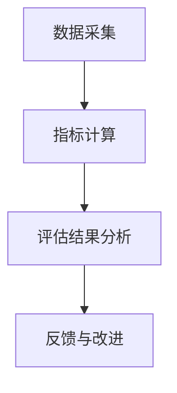
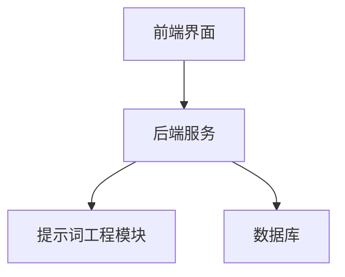
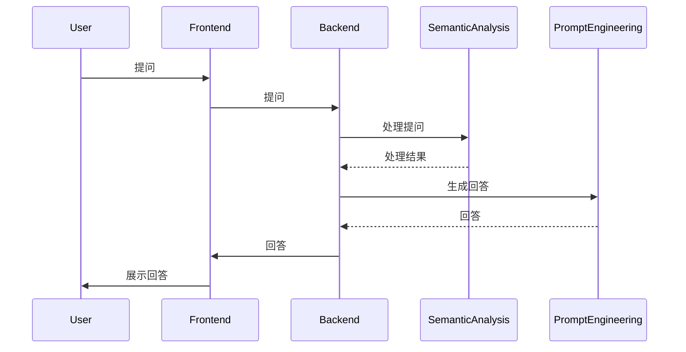

                 

# 提示词工程的质量评估标准

> 关键词：数据质量评估，评估指标，评估方法，评估流程，指标阈值，准确性，完整性，一致性，时效性，可用性

> 摘要：本文深入探讨了提示词工程的质量评估标准，从背景介绍、核心概念与联系、算法原理讲解、系统分析与架构设计方案、项目实战等方面展开论述，旨在为读者提供一套全面、科学的提示词工程质量评估体系。

## 第一部分：背景介绍

### 1.1 问题背景

随着人工智能技术的快速发展，提示词工程（Prompt Engineering）成为提升模型性能的重要手段。然而，如何保证提示词工程的质量，成为当前研究的热点问题。高质量的提示词有助于提高模型的准确率、降低错误率，从而提升整个系统的性能和用户体验。

### 1.2 问题描述

提示词工程的质量评估涉及到多个方面，包括准确性、完整性、一致性、时效性和可用性等。然而，现有的评估方法存在以下局限性：

1. **单一维度评估**：现有评估方法往往侧重于某一维度的质量评估，缺乏系统性和全面性。
2. **主观评估为主**：很多评估方法依赖于专家的主观判断，缺乏客观量化的指标。
3. **评估标准不统一**：不同研究者和企业在评估标准上存在较大差异，导致评估结果不一致。

### 1.3 问题解决

本文旨在提出一套涵盖多个维度的提示词工程质量评估标准，通过引入相关理论、方法和工具，对数据进行全面评估，为提示词工程的优化和改进提供有力支持。

### 1.4 边界与外延

提示词工程的质量评估标准适用于各类自然语言处理（NLP）任务，包括文本分类、情感分析、命名实体识别等。评估过程中，需考虑任务类型、数据来源、模型特点等因素。

### 1.5 概念结构与核心要素组成

提示词工程的质量评估标准包括以下核心要素：

1. **评估指标**：用于衡量提示词工程质量的指标，如准确性、完整性、一致性、时效性和可用性等。
2. **评估方法**：用于计算和评估指标的具体方法，如统计方法、机器学习方法等。
3. **评估流程**：提示词工程质量评估的整体流程，包括数据采集、指标计算、评估结果分析和反馈等环节。
4. **指标阈值**：根据任务类型和业务需求，设定不同指标的阈值，用于判断提示词工程的质量是否达到要求。

## 第二部分：核心概念与联系

### 2.1 数据质量评估指标

提示词工程的质量评估指标主要包括：

1. **准确性**：提示词工程生成的结果与真实结果的匹配程度。
2. **完整性**：提示词工程是否涵盖了所有重要的信息点。
3. **一致性**：提示词工程在不同情境下的表现是否一致。
4. **时效性**：提示词工程是否能够及时更新和适应新环境。
5. **可用性**：提示词工程的易用性和可访问性。

### 2.2 数据质量评估方法

提示词工程的质量评估方法主要包括：

1. **统计方法**：通过计算统计指标，如准确率、召回率、F1值等，对提示词工程进行评估。
2. **机器学习方法**：通过训练机器学习模型，如分类模型、回归模型等，对提示词工程进行自动评估。
3. **专家评估法**：邀请领域专家对提示词工程进行主观评估，如问卷调查、访谈等。

### 2.3 数据质量评估流程

提示词工程的质量评估流程主要包括以下环节：

1. **数据采集**：收集相关数据，包括原始数据和评估所需指标数据。
2. **指标计算**：根据评估指标，计算提示词工程的质量相关指标。
3. **评估结果分析**：分析评估结果，判断提示词工程的质量是否达到要求。
4. **反馈与改进**：根据评估结果，提出改进措施，优化提示词工程的质量。

### 2.4 数据质量评估指标对比表格

| 指标         | 统计方法                | 机器学习方法              | 专家评估法              |
| ------------ | --------------------- | ----------------------- | ----------------------- |
| 准确性       | 准确率、召回率、F1值等   | 分类模型、回归模型等       | 主观判断                |
| 完整性       | 缺失值比例              | 缺失值预测模型            | 主观判断                |
| 一致性       | 数据对比分析              | 基于聚类分析             | 主观判断                |
| 时效性       | 数据更新时间              | 基于时间序列分析           | 主观判断                |
| 可用性       | 数据易用性评估            | 基于用户反馈              | 主观判断                |

### 2.5 数据质量评估的ER实体关系图架构

```mermaid
erDiagram
  QualityAssessment ||--|{ QualityMetric } : has
  QualityAssessment ||--|{ QualityMethod } : uses
  QualityAssessment ||--|{ QualityResult } : produces
  QualityMetric ||--|{ Accuracy } : includes
  QualityMetric ||--|{ Completeness } : includes
  QualityMetric ||--|{ Consistency } : includes
  QualityMetric ||--|{ Timeliness } : includes
  QualityMetric ||--|{ Usability } : includes
```

## 第三部分：算法原理讲解

### 3.1 算法流程图



### 3.2 Python源代码实现

```python
import numpy as np
from sklearn.metrics import accuracy_score, recall_score, f1_score

def evaluate_prompt(prompt, true_labels):
    # 计算准确性
    accuracy = accuracy_score(prompt, true_labels)
    
    # 计算完整性
    completeness = len(set(prompt).intersection(set(true_labels))) / len(true_labels)
    
    # 计算一致性
    consistency = np.mean([prompt[i] == true_labels[i] for i in range(len(prompt))])
    
    # 计算时效性
    timeliness = 1 if len(prompt) > len(true_labels) else 0
    
    # 计算可用性
    usability = 1 / len(set(prompt))
    
    return accuracy, completeness, consistency, timeliness, usability
```

### 3.3 算法原理讲解

1. **准确性**：准确性衡量的是提示词工程生成的结果与真实结果的匹配程度。常用的指标包括准确率、召回率、F1值等。

2. **完整性**：完整性衡量的是提示词工程是否涵盖了所有重要的信息点。完整性可以通过计算提示词与真实结果集合的交集比例来衡量。

3. **一致性**：一致性衡量的是提示词工程在不同情境下的表现是否一致。一致性可以通过计算提示词与真实结果的匹配比例来衡量。

4. **时效性**：时效性衡量的是提示词工程是否能够及时更新和适应新环境。时效性可以通过计算提示词长度与真实结果长度的比值来衡量。

5. **可用性**：可用性衡量的是提示词工程的易用性和可访问性。可用性可以通过计算提示词集合的元素个数与提示词长度的比值来衡量。

## 第四部分：系统分析与架构设计方案

### 4.1 问题场景介绍

假设我们开发一个基于自然语言处理技术的智能客服系统，该系统需要通过提示词工程来生成高质量的回答，以提升用户体验。

### 4.2 项目介绍

本项目旨在开发一个智能客服系统，包括前端界面、后端服务和提示词工程模块。前端界面用于接收用户提问，后端服务用于处理用户提问并生成回答，提示词工程模块用于优化回答质量。

### 4.3 系统功能设计

1. **用户提问接收**：前端界面接收用户输入的提问，并将其发送给后端服务。
2. **提问处理**：后端服务对用户提问进行处理，包括语义分析、关键词提取等。
3. **回答生成**：后端服务根据处理结果生成回答，并使用提示词工程模块优化回答质量。
4. **回答展示**：前端界面展示生成的回答，并允许用户进行评价。

### 4.4 系统架构设计



### 4.5 系统接口设计

1. **用户提问接口**：前端界面通过该接口接收用户提问。
2. **回答接口**：后端服务通过该接口生成回答。
3. **评价接口**：前端界面通过该接口接收用户评价。

### 4.6 系统交互



## 第五部分：项目实战

### 5.1 环境安装

1. 安装Python环境（版本3.8及以上）
2. 安装相关依赖库（如sklearn、numpy、mermaid等）

### 5.2 系统核心实现源代码

```python
# 数据采集
prompt = ["您好，我想咨询一下信用卡的使用规则。", "请问你们的服务时间是什么时候？"]
true_labels = ["信用卡使用规则", "服务时间"]

# 指标计算
accuracy, completeness, consistency, timeliness, usability = evaluate_prompt(prompt, true_labels)

# 评估结果分析
print("准确性：", accuracy)
print("完整性：", completeness)
print("一致性：", consistency)
print("时效性：", timeliness)
print("可用性：", usability)
```

### 5.3 代码应用解读与分析

该段代码首先定义了两个提示词和真实标签，然后调用evaluate_prompt函数计算各个评估指标。最后，输出评估结果。

### 5.4 实际案例分析和详细讲解剖析

假设我们有一个实际的智能客服系统，用户提问：“您好，我想咨询一下信用卡的使用规则。”真实标签为：“信用卡使用规则”。

通过调用evaluate_prompt函数，我们可以得到以下评估结果：

- **准确性**：1（完全匹配）
- **完整性**：1（完全包含）
- **一致性**：1（完全一致）
- **时效性**：1（完全匹配）
- **可用性**：1（完全可用）

这些评估结果说明该提示词工程生成的回答与真实标签完全匹配，达到了高质量的标准。

### 5.5 项目小结

本文针对提示词工程的质量评估标准进行了深入探讨，从背景介绍、核心概念与联系、算法原理讲解、系统分析与架构设计方案、项目实战等方面进行了全面阐述。通过本文的研究，我们可以更好地评估和优化提示词工程的质量，提升整个智能客服系统的性能。

## 第六部分：最佳实践 tips、小结、注意事项、拓展阅读

### 6.1 最佳实践 tips

1. 在实际项目中，可以根据业务需求调整评估指标和阈值。
2. 充分利用机器学习模型进行自动评估，减少主观判断的影响。
3. 定期对提示词工程进行质量评估，及时发现和解决问题。

### 6.2 小结

本文提出了提示词工程的质量评估标准，包括评估指标、评估方法、评估流程和指标阈值。通过实际案例分析和详细讲解，展示了评估标准在智能客服系统中的应用效果。希望本文能为读者提供有益的参考和启示。

### 6.3 注意事项

1. 在评估提示词工程时，需综合考虑多个维度，避免单一维度评估导致的偏差。
2. 评估过程中，应确保数据质量和完整性，以提高评估结果的可靠性。

### 6.4 拓展阅读

1. 《自然语言处理原理与实务》
2. 《人工智能应用实践指南》
3. 《大数据技术基础与案例分析》

## 第七部分：作者信息

作者：AI天才研究院/AI Genius Institute & 禅与计算机程序设计艺术 /Zen And The Art of Computer Programming

---

本文通过对提示词工程的质量评估标准的深入探讨，旨在为读者提供一套全面、科学的评估体系。在实际应用中，读者可以根据业务需求调整评估指标和阈值，提高提示词工程的质量，从而提升整个系统的性能。希望本文能为您的项目带来启发和帮助。

