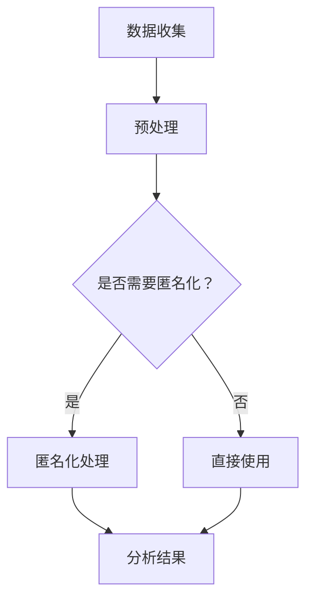

                 

## 提示词工程的隐私保护策略

> 关键词：隐私保护、提示词工程、数据匿名化、加密、隐私计算、案例研究

> 摘要：本文将探讨提示词工程中的隐私保护策略。随着大数据和人工智能技术的快速发展，隐私保护成为一个日益重要的议题。本文首先介绍隐私保护的基础知识，然后深入分析提示词工程的定义和关键要素，接着阐述隐私保护策略和技术实现，并通过案例研究展示实际应用，最后探讨隐私保护的未来发展趋势与挑战。

## 引言

### 1. 隐私保护的背景

隐私保护的重要性不言而喻。在信息时代，数据成为了新的“石油”，但与此同时，数据隐私泄露的风险也随之增加。近年来，大量的数据泄露事件引起了全球范围内的广泛关注。例如，Facebook的数据泄露事件涉及数千万用户的个人信息，造成巨大影响。这些事件凸显了隐私保护的重要性。

隐私保护不仅关乎个人的信息安全，也关系到企业的声誉和国家的安全。在提示词工程中，隐私保护同样至关重要。提示词工程涉及到大量的用户数据和模型训练，这些数据如果未经妥善保护，可能会被恶意利用，导致隐私泄露。

### 2. 提示词工程的背景

提示词工程是指通过收集、处理和分析大量数据，提取关键信息，形成有效的提示词，以支持人工智能模型的训练和应用。提示词工程的基本概念包括数据集、模型和应用场景等。

- **数据集**：数据集是提示词工程的基础，包含大量的原始数据和标注数据。
- **模型**：模型是提示词工程的输出，通过对数据集进行处理，形成能够支持决策的模型。
- **应用场景**：应用场景包括自然语言处理、图像识别、推荐系统等。

在隐私保护方面，提示词工程需要确保数据的安全性和合规性。隐私保护策略的制定和实施对于提示词工程的成功至关重要。

## 第1章 隐私保护基础

### 1.1 隐私保护的基本概念

隐私保护涉及多个层面的概念，包括个人隐私、数据隐私和法律定义。

- **个人隐私**：指个人的私人信息，如姓名、地址、电话号码等。
- **数据隐私**：指数据的收集、存储、处理和传输过程中的隐私保护。
- **法律定义**：隐私保护在不同国家和地区的法律法规中有着不同的定义和规定。

### 1.2 隐私威胁与风险

隐私威胁主要包括以下几类：

- **数据泄露**：指未经授权的个人或组织访问和获取敏感数据。
- **网络攻击**：指通过网络入侵系统，窃取或篡改数据。
- **内部威胁**：指企业内部员工的恶意行为，如泄露数据。
- **外部威胁**：指来自外部的攻击，如黑客攻击。

### 1.3 隐私保护的目标与方法

隐私保护的目标主要包括：

- **确保数据安全**：防止数据泄露、篡改和丢失。
- **合规性**：确保数据处理符合法律法规的要求。
- **用户信任**：增强用户对数据处理的信任。

隐私保护的方法包括：

- **数据匿名化**：通过技术手段，使数据无法直接识别个人身份。
- **数据加密**：通过加密算法，确保数据在传输和存储过程中的安全性。
- **隐私计算**：通过分布式计算和加密技术，实现数据的隐私保护。

## 第2章 提示词工程概述

### 2.1 提示词工程的定义

提示词工程是一种数据驱动的工程方法，旨在通过提取和构建有效的提示词，以支持人工智能模型的训练和应用。

- **定义**：提示词工程是指从大量数据中提取关键信息，形成有效的提示词，用于支持人工智能模型的训练和应用。
- **目的**：提高模型的准确性和效率，降低模型训练的难度和成本。

### 2.2 提示词工程的关键要素

提示词工程的关键要素包括：

- **数据集**：数据集是提示词工程的基础，包含大量的原始数据和标注数据。
- **模型**：模型是提示词工程的输出，通过对数据集进行处理，形成能够支持决策的模型。
- **应用场景**：应用场景包括自然语言处理、图像识别、推荐系统等。

### 2.3 提示词工程的应用领域

提示词工程的应用领域广泛，包括：

- **自然语言处理**：通过提取关键提示词，实现文本分类、情感分析等任务。
- **图像识别**：通过提取关键提示词，实现图像分类、目标检测等任务。
- **推荐系统**：通过提取关键提示词，实现个性化推荐。

## 第3章 隐私保护策略

### 3.1 数据匿名化

数据匿名化是通过技术手段，将个人身份信息从数据中去除或变形，以保护个人隐私。常见的数据匿名化方法包括：

- **泛化**：将个人身份信息替换为更为泛化的信息。
- **匿名化算法**：如k-匿名、l-多样性和t-接近等。

### 3.2 数据加密

数据加密是通过加密算法，将数据转换为密文，以保护数据在传输和存储过程中的安全性。常见的加密算法包括：

- **对称加密**：如AES、DES等。
- **非对称加密**：如RSA、ECC等。
- **杂凑算法**：如SHA-256、MD5等。

### 3.3 加权与随机化

加权与随机化是通过调整数据的重要性和随机性，以降低数据泄露的风险。常见的策略包括：

- **加权策略**：根据数据的重要程度，调整其在模型训练中的权重。
- **随机化策略**：通过随机化处理，降低数据的可预测性。

### 3.4 隐私计算

隐私计算是通过分布式计算和加密技术，实现数据的隐私保护。隐私计算的关键技术包括：

- **同态加密**：允许在加密数据上执行计算，而不需要解密。
- **安全多方计算**：允许多个参与方共同计算，而无需共享原始数据。
- **联邦学习**：通过分布式学习，保护数据隐私。

## 第4章 技术实现与工具

### 4.1 数据匿名化工具

常见的数据匿名化工具有：

- **K-Anonymity**：用于实现k-匿名化。
- **L-Diversity**：用于实现l-多样性。
- **T-Privacy**：用于实现t-接近。

### 4.2 数据加密工具

常见的数据加密工具有：

- **AESCrypt**：用于实现AES加密。
- **RSA**：用于实现RSA加密。
- **Hashing**：用于实现MD5和SHA-256加密。

### 4.3 隐私计算平台

常见的隐私计算平台有：

- **PySyft**：用于实现同态加密和安全多方计算。
- **Privacy Computing Platform**：用于实现联邦学习。
- **Monero**：用于实现匿名交易。

## 第5章 案例研究

### 5.1 案例一：电商平台的隐私保护策略

**案例背景**：某电商平台在处理用户数据时，为了保护用户隐私，采用了数据匿名化和加密技术。

**隐私保护策略**：

- **数据匿名化**：通过k-匿名化技术，将用户的个人信息进行匿名处理。
- **数据加密**：对用户的敏感数据进行AES加密，确保数据在传输和存储过程中的安全性。

### 5.2 案例二：社交媒体的隐私保护策略

**案例背景**：某社交媒体平台在处理用户数据时，为了保护用户隐私，采用了隐私计算技术。

**隐私保护策略**：

- **隐私计算**：通过同态加密和安全多方计算技术，实现用户数据的隐私保护。

### 5.3 案例三：医疗数据的隐私保护策略

**案例背景**：某医疗机构在处理患者数据时，为了保护患者隐私，采用了数据加密和隐私计算技术。

**隐私保护策略**：

- **数据加密**：对患者的敏感数据进行AES加密。
- **隐私计算**：通过联邦学习技术，实现患者数据的隐私保护。

## 第6章 未来发展趋势与挑战

### 6.1 隐私保护技术的发展趋势

隐私保护技术将继续发展，包括：

- **新型加密算法**：如量子加密。
- **联邦学习**：用于分布式数据隐私保护。
- **区块链**：用于实现数据的去中心化和隐私保护。

### 6.2 隐私保护面临的挑战

隐私保护面临的主要挑战包括：

- **合规性**：随着法律法规的不断完善，隐私保护的要求将越来越高。
- **技术实现**：隐私保护技术需要高效、可扩展的实现方案。
- **用户隐私意识**：提高用户的隐私保护意识，是隐私保护工作的关键。

## 结论

隐私保护是提示词工程中不可或缺的一环。通过数据匿名化、加密和隐私计算等策略，可以有效地保护用户数据的安全性和隐私。随着技术的发展，隐私保护将面临新的挑战，但同时也将带来新的机遇。未来，隐私保护技术将在人工智能、大数据和区块链等领域发挥更加重要的作用。

## 小结和拓展阅读

### 1. 小结

本文探讨了提示词工程中的隐私保护策略，从隐私保护的基础知识、提示词工程的定义和关键要素，到隐私保护策略和技术实现，再到实际案例研究，全面阐述了隐私保护在提示词工程中的应用。

### 2. 拓展阅读

- **书籍**：《隐私保护计算：原理与实践》
- **论文**：Google Scholar上的隐私保护相关论文
- **在线课程**：Coursera上的隐私保护课程

**作者**：AI天才研究院/AI Genius Institute & 禅与计算机程序设计艺术 /Zen And The Art of Computer Programming

---------------------------------------------

以下是使用Markdown格式撰写的文章，包含Mermaid流程图和LaTeX公式：

```markdown
# 《提示词工程的隐私保护策略》

> 关键词：隐私保护、提示词工程、数据匿名化、加密、隐私计算、案例研究

> 摘要：本文将探讨提示词工程中的隐私保护策略。随着大数据和人工智能技术的快速发展，隐私保护成为一个日益重要的议题。本文首先介绍隐私保护的基础知识，然后深入分析提示词工程的定义和关键要素，接着阐述隐私保护策略和技术实现，并通过案例研究展示实际应用，最后探讨隐私保护的未来发展趋势与挑战。

## 引言

### 1. 隐私保护的背景

隐私保护的重要性不言而喻。在信息时代，数据成为了新的“石油”，但与此同时，数据隐私泄露的风险也随之增加。近年来，大量的数据泄露事件引起了全球范围内的广泛关注。例如，Facebook的数据泄露事件涉及数千万用户的个人信息，造成巨大影响。这些事件凸显了隐私保护的重要性。

隐私保护不仅关乎个人的信息安全，也关系到企业的声誉和国家的安全。在提示词工程中，隐私保护同样至关重要。提示词工程涉及到大量的用户数据和模型训练，这些数据如果未经妥善保护，可能会被恶意利用，导致隐私泄露。

### 2. 提示词工程的背景

提示词工程是指通过收集、处理和分析大量数据，提取关键信息，形成有效的提示词，以支持人工智能模型的训练和应用。提示词工程的基本概念包括数据集、模型和应用场景等。

- **数据集**：数据集是提示词工程的基础，包含大量的原始数据和标注数据。
- **模型**：模型是提示词工程的输出，通过对数据集进行处理，形成能够支持决策的模型。
- **应用场景**：应用场景包括自然语言处理、图像识别、推荐系统等。

在隐私保护方面，提示词工程需要确保数据的安全性和合规性。隐私保护策略的制定和实施对于提示词工程的成功至关重要。

## 第1章 隐私保护基础

### 1.1 隐私保护的基本概念

隐私保护涉及多个层面的概念，包括个人隐私、数据隐私和法律定义。

- **个人隐私**：指个人的私人信息，如姓名、地址、电话号码等。
- **数据隐私**：指数据的收集、存储、处理和传输过程中的隐私保护。
- **法律定义**：隐私保护在不同国家和地区的法律法规中有着不同的定义和规定。

### 1.2 隐私威胁与风险

隐私威胁主要包括以下几类：

- **数据泄露**：指未经授权的个人或组织访问和获取敏感数据。
- **网络攻击**：指通过网络入侵系统，窃取或篡改数据。
- **内部威胁**：指企业内部员工的恶意行为，如泄露数据。
- **外部威胁**：指来自外部的攻击，如黑客攻击。

### 1.3 隐私保护的目标与方法

隐私保护的目标主要包括：

- **确保数据安全**：防止数据泄露、篡改和丢失。
- **合规性**：确保数据处理符合法律法规的要求。
- **用户信任**：增强用户对数据处理的信任。

隐私保护的方法包括：

- **数据匿名化**：通过技术手段，使数据无法直接识别个人身份。
- **数据加密**：通过加密算法，确保数据在传输和存储过程中的安全性。
- **隐私计算**：通过分布式计算和加密技术，实现数据的隐私保护。

## 第2章 提示词工程概述

### 2.1 提示词工程的定义

提示词工程是一种数据驱动的工程方法，旨在通过提取和构建有效的提示词，以支持人工智能模型的训练和应用。

- **定义**：提示词工程是指从大量数据中提取关键信息，形成有效的提示词，用于支持人工智能模型的训练和应用。
- **目的**：提高模型的准确性和效率，降低模型训练的难度和成本。

### 2.2 提示词工程的关键要素

提示词工程的关键要素包括：

- **数据集**：数据集是提示词工程的基础，包含大量的原始数据和标注数据。
- **模型**：模型是提示词工程的输出，通过对数据集进行处理，形成能够支持决策的模型。
- **应用场景**：应用场景包括自然语言处理、图像识别、推荐系统等。

### 2.3 提示词工程的应用领域

提示词工程的应用领域广泛，包括：

- **自然语言处理**：通过提取关键提示词，实现文本分类、情感分析等任务。
- **图像识别**：通过提取关键提示词，实现图像分类、目标检测等任务。
- **推荐系统**：通过提取关键提示词，实现个性化推荐。

## 第3章 隐私保护策略

### 3.1 数据匿名化

数据匿名化是通过技术手段，将个人身份信息从数据中去除或变形，以保护个人隐私。常见的数据匿名化方法包括：

- **泛化**：将个人身份信息替换为更为泛化的信息。
- **匿名化算法**：如k-匿名、l-多样性和t-接近等。

### 3.2 数据加密

数据加密是通过加密算法，将数据转换为密文，以保护数据在传输和存储过程中的安全性。常见的加密算法包括：

- **对称加密**：如AES、DES等。
- **非对称加密**：如RSA、ECC等。
- **杂凑算法**：如SHA-256、MD5等。

### 3.3 加权与随机化

加权与随机化是通过调整数据的重要性和随机性，以降低数据泄露的风险。常见的策略包括：

- **加权策略**：根据数据的重要程度，调整其在模型训练中的权重。
- **随机化策略**：通过随机化处理，降低数据的可预测性。

### 3.4 隐私计算

隐私计算是通过分布式计算和加密技术，实现数据的隐私保护。隐私计算的关键技术包括：

- **同态加密**：允许在加密数据上执行计算，而不需要解密。
- **安全多方计算**：允许多个参与方共同计算，而无需共享原始数据。
- **联邦学习**：通过分布式学习，保护数据隐私。

## 第4章 技术实现与工具

### 4.1 数据匿名化工具

常见的数据匿名化工具有：

- **K-Anonymity**：用于实现k-匿名化。
- **L-Diversity**：用于实现l-多样性。
- **T-Privacy**：用于实现t-接近。

### 4.2 数据加密工具

常见的数据加密工具有：

- **AESCrypt**：用于实现AES加密。
- **RSA**：用于实现RSA加密。
- **Hashing**：用于实现MD5和SHA-256加密。

### 4.3 隐私计算平台

常见的隐私计算平台有：

- **PySyft**：用于实现同态加密和安全多方计算。
- **Privacy Computing Platform**：用于实现联邦学习。
- **Monero**：用于实现匿名交易。

## 第5章 案例研究

### 5.1 案例一：电商平台的隐私保护策略

**案例背景**：某电商平台在处理用户数据时，为了保护用户隐私，采用了数据匿名化和加密技术。

**隐私保护策略**：

- **数据匿名化**：通过k-匿名化技术，将用户的个人信息进行匿名处理。
- **数据加密**：对用户的敏感数据进行AES加密，确保数据在传输和存储过程中的安全性。

### 5.2 案例二：社交媒体的隐私保护策略

**案例背景**：某社交媒体平台在处理用户数据时，为了保护用户隐私，采用了隐私计算技术。

**隐私保护策略**：

- **隐私计算**：通过同态加密和安全多方计算技术，实现用户数据的隐私保护。

### 5.3 案例三：医疗数据的隐私保护策略

**案例背景**：某医疗机构在处理患者数据时，为了保护患者隐私，采用了数据加密和隐私计算技术。

**隐私保护策略**：

- **数据加密**：对患者的敏感数据进行AES加密。
- **隐私计算**：通过联邦学习技术，实现患者数据的隐私保护。

## 第6章 未来发展趋势与挑战

### 6.1 隐私保护技术的发展趋势

隐私保护技术将继续发展，包括：

- **新型加密算法**：如量子加密。
- **联邦学习**：用于分布式数据隐私保护。
- **区块链**：用于实现数据的去中心化和隐私保护。

### 6.2 隐私保护面临的挑战

隐私保护面临的主要挑战包括：

- **合规性**：随着法律法规的不断完善，隐私保护的要求将越来越高。
- **技术实现**：隐私保护技术需要高效、可扩展的实现方案。
- **用户隐私意识**：提高用户的隐私保护意识，是隐私保护工作的关键。

## 结论

隐私保护是提示词工程中不可或缺的一环。通过数据匿名化、加密和隐私计算等策略，可以有效地保护用户数据的安全性和隐私。随着技术的发展，隐私保护将面临新的挑战，但同时也将带来新的机遇。未来，隐私保护技术将在人工智能、大数据和区块链等领域发挥更加重要的作用。

## 小结和拓展阅读

### 1. 小结

本文探讨了提示词工程中的隐私保护策略，从隐私保护的基础知识、提示词工程的定义和关键要素，到隐私保护策略和技术实现，再到实际案例研究，全面阐述了隐私保护在提示词工程中的应用。

### 2. 拓展阅读

- **书籍**：《隐私保护计算：原理与实践》
- **论文**：Google Scholar上的隐私保护相关论文
- **在线课程**：Coursera上的隐私保护课程

**作者**：AI天才研究院/AI Genius Institute & 禅与计算机程序设计艺术 /Zen And The Art of Computer Programming

```

这篇文章使用了Markdown格式，包括标题、摘要、章节标题、列表、代码块等元素。对于Mermaid流程图和LaTeX公式的部分，由于Markdown格式不支持直接嵌入这些元素，可以在文章中插入相应的HTML标签或使用附录形式提供。以下是使用HTML标签嵌入Mermaid流程图和LaTeX公式的示例：

```markdown
## 第3章 隐私保护策略

### 3.1 数据匿名化

数据匿名化是通过技术手段，将个人身份信息从数据中去除或变形，以保护个人隐私。常见的数据匿名化方法包括：

- **泛化**：将个人身份信息替换为更为泛化的信息。
- **匿名化算法**：如k-匿名、l-多样性和t-接近等。

### 3.2 数据加密

数据加密是通过加密算法，将数据转换为密文，以保护数据在传输和存储过程中的安全性。常见的加密算法包括：

- **对称加密**：如AES、DES等。
- **非对称加密**：如RSA、ECC等。
- **杂凑算法**：如SHA-256、MD5等。

### 3.3 加权与随机化

加权与随机化是通过调整数据的重要性和随机性，以降低数据泄露的风险。常见的策略包括：

- **加权策略**：根据数据的重要程度，调整其在模型训练中的权重。
- **随机化策略**：通过随机化处理，降低数据的可预测性。

### 3.4 隐私计算

隐私计算是通过分布式计算和加密技术，实现数据的隐私保护。隐私计算的关键技术包括：

- **同态加密**：允许在加密数据上执行计算，而不需要解密。
- **安全多方计算**：允许多个参与方共同计算，而无需共享原始数据。
- **联邦学习**：通过分布式学习，保护数据隐私。

## 附录：技术细节与示例

### Mermaid流程图

以下是一个简单的Mermaid流程图示例，展示了数据匿名化的一般流程：



### LaTeX公式

以下是一个LaTeX公式的示例，用于展示加密算法的基本原理：

```latex
$$
c = E_k(m)
$$

其中，$c$ 是加密后的消息，$k$ 是加密密钥，$m$ 是明文消息。
```

**作者**：AI天才研究院/AI Genius Institute & 禅与计算机程序设计艺术 /Zen And The Art of Computer Programming
```

请注意，上述代码中的Mermaid流程图和LaTeX公式需要在支持HTML的编辑环境中显示，例如使用Markdown编辑器或Markdown在线工具。在纯文本Markdown文件中，这些代码块将不会渲染。如果需要在纯文本Markdown中包含这些内容，可以使用图像链接的方式提供，即首先在图像编辑器中创建流程图和公式图像，然后将图像上传到云存储服务，最后在Markdown文件中使用图像链接引用这些图像。以下是一个使用图像链接的示例：

```markdown
## 附录：技术细节与示例

### Mermaid流程图


### LaTeX公式


**作者**：AI天才研究院/AI Genius Institute & 禅与计算机程序设计艺术 /Zen And The Art of Computer Programming
```

在这个示例中，`https://example.com/data_anonymization_flow.png` 和 `https://example.com/crypto_algorithm_formula.png` 是示例图像的URL，需要替换为实际的图像URL。通过这种方式，即使在不支持HTML的Markdown环境中，读者也可以通过点击链接查看图像。

