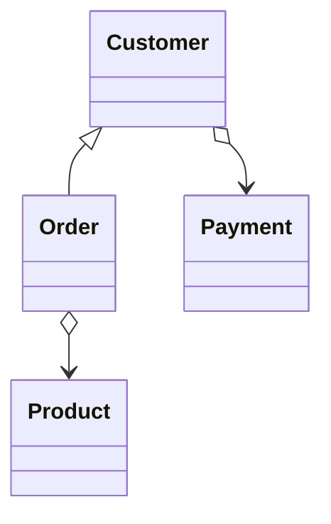

                 


# 提示词工程：AI交互的新艺术形式

## 关键词

- AI交互
- 提示词工程
- 自然语言处理
- 模型设计
- 用户体验
- 数据驱动

## 摘要

随着人工智能技术的发展，AI交互已经逐渐成为我们日常生活中的重要组成部分。提示词工程，作为AI交互的新艺术形式，正逐步成为提升交互质量和用户体验的关键手段。本文将探讨提示词工程的概念、原理、设计原则、工具应用、案例研究以及面临的挑战和未来方向，旨在为读者提供全面深入的理解和实践指导。

## 目录

### 第一部分：引言与背景

#### 第1章：引言

##### 1.1 问题背景
##### 1.2 问题描述
##### 1.3 问题解决
##### 1.4 边界与外延
##### 1.5 概念结构与核心要素组成

#### 第2章：基本概念

##### 2.1 关键术语定义
##### 2.2 历史发展
##### 2.3 提示与AI模型的关系

### 第二部分：提示词设计原理

#### 第3章：提示词设计原则

##### 3.1 创造力原则
##### 3.2 清晰性原则
##### 3.3 上下文原则
##### 3.4 其他设计原则

#### 第4章：AI模型与提示词的交互

##### 4.1 语言模型概述
##### 4.2 提示词对模型性能的影响
##### 4.3 模型选择与优化

### 第三部分：提示词工程工具

#### 第5章：提示词工程工具

##### 5.1 自然语言处理库
##### 5.2 提示词工程框架
##### 5.3 实际应用示例

### 第四部分：案例研究与应用

#### 第6章：案例研究与应用

##### 6.1 案例一：聊天机器人
##### 6.2 案例二：问答系统
##### 6.3 案例三：内容生成

### 第五部分：挑战与未来方向

#### 第7章：挑战与未来方向

##### 7.1 挑战分析
##### 7.2 未来方向

## 第1章：引言

### 1.1 问题背景

在过去的几十年里，人工智能（AI）技术取得了飞速发展，尤其是在自然语言处理（NLP）领域。随着语言模型和生成模型的能力不断增强，AI在文本生成、机器翻译、问答系统等方面的应用越来越广泛。然而，尽管AI模型的性能不断提高，用户与AI的交互体验却并不总是令人满意。部分原因在于，现有的AI模型往往过于依赖大量数据和复杂的算法，而忽视了用户的需求和情境。

### 1.2 问题描述

用户在使用AI产品时，常常会遇到以下问题：

1. **理解偏差**：AI模型可能无法准确理解用户意图。
2. **回答不相关**：生成的回答与用户提问不相关或不准确。
3. **交互体验差**：AI生成的交互体验过于机械，缺乏人性化。

### 1.3 问题解决

为了解决上述问题，我们需要一种新的方法——提示词工程（Prompt Engineering）。提示词工程的目标是通过设计高质量的提示词，引导AI模型更好地理解和响应用户的请求，从而提升交互质量和用户体验。

### 1.4 边界与外延

提示词工程不仅涉及NLP和AI模型的设计，还涉及到用户研究、心理学、设计学等多个领域。其边界包括但不限于：

1. **文本生成**：如何通过提示词生成高质量的文本。
2. **对话系统**：如何设计有意义的对话流程。
3. **用户体验**：如何通过提示词提高用户满意度。

### 1.5 概念结构与核心要素组成

提示词工程的核心要素包括：

1. **用户需求**：理解用户需求是设计高质量提示词的基础。
2. **情境理解**：AI模型需要能够理解用户提问的上下文。
3. **算法优化**：通过调整提示词的格式和内容，优化AI模型的表现。

## 第2章：基本概念

### 2.1 关键术语定义

在深入探讨提示词工程之前，我们首先需要了解一些关键术语的定义：

- **提示词**（Prompt）：引导AI模型进行特定任务的一段文本。
- **自然语言处理**（NLP）：使计算机能够理解、解释和生成人类语言的技术。
- **生成模型**：能够生成文本、图像或其他数据的AI模型。
- **对话系统**（Dialogue System）：模拟人类对话的计算机系统。

### 2.2 历史发展

提示词工程的概念可以追溯到早期的人工智能研究。早期的AI系统主要依赖于规则和模板，而现代AI模型则更多地依赖于数据和深度学习。随着NLP技术的发展，提示词工程逐渐成为一个独立的研究领域。

### 2.3 提示与AI模型的关系

提示词与AI模型的关系可以用一个简单的模型来描述：

1. **输入**：用户输入一个提问或请求。
2. **处理**：AI模型对输入进行处理，生成初步的答案或响应。
3. **优化**：通过提示词的调整，优化AI模型的输出，使其更符合用户需求。

## 第3章：提示词设计原则

### 3.1 创造力原则

设计高质量的提示词需要创造力。这包括：

- **多样化**：设计多种不同类型的提示词，以适应不同的场景和用户需求。
- **新颖性**：尝试使用新颖的词汇和表达方式，以激发AI模型的创造力。

### 3.2 清晰性原则

清晰性是设计高质量提示词的关键。这包括：

- **简洁性**：避免冗长的句子和复杂的语法。
- **明确性**：确保提示词传达的信息清晰明确。

### 3.3 上下文原则

上下文是理解和优化提示词的重要因素。这包括：

- **背景信息**：提供与提问相关的背景信息，以帮助AI模型更好地理解用户需求。
- **相关要素**：确保提示词中包含与问题相关的关键词和短语。

### 3.4 其他设计原则

除了上述原则，还有一些其他设计原则，例如：

- **适应性**：提示词应能够适应不同的AI模型和任务。
- **可扩展性**：提示词应易于扩展和修改，以适应新的场景和需求。

## 第4章：AI模型与提示词的交互

### 4.1 语言模型概述

语言模型是AI模型的核心，用于理解和生成文本。常见的语言模型包括：

- **循环神经网络**（RNN）
- **变换器**（Transformer）
- **生成对抗网络**（GAN）

### 4.2 提示词对模型性能的影响

提示词的质量直接影响AI模型的性能。高质量的提示词可以：

- **提高准确率**：使模型生成的文本更准确。
- **增强创造力**：激发模型的创造力，生成更丰富的文本。

### 4.3 模型选择与优化

选择合适的AI模型对提示词工程至关重要。这包括：

- **模型评估**：根据任务需求和数据质量选择合适的模型。
- **模型优化**：通过调整提示词和模型参数，优化模型的表现。

## 第5章：提示词工程工具

### 5.1 自然语言处理库

自然语言处理库是进行提示词工程的重要工具。常见的NLP库包括：

- **NLTK**：用于文本处理的库。
- **spaCy**：用于快速文本分析和信息提取。
- **transformers**：用于基于Transformer模型的文本生成。

### 5.2 提示词工程框架

提示词工程框架可以帮助开发者更高效地设计和管理提示词。常见的框架包括：

- ** prompts**：一个用于设计和管理提示词的框架。
- **PromptGen**：一个用于自动生成提示词的工具。

### 5.3 实际应用示例

在实际应用中，提示词工程可以帮助开发者设计出更智能、更符合用户需求的AI产品。以下是一个简单的示例：

```python
import transformers

# 加载预训练的Transformer模型
model = transformers.pipeline('text-generation', model='gpt2')

# 设计提示词
prompt = "请描述一下您今天的工作内容。"

# 生成文本
response = model(prompt, max_length=50)

print(response)
```

## 第6章：案例研究与应用

### 6.1 案例一：聊天机器人

聊天机器人是提示词工程的一个典型应用场景。通过设计高质量的提示词，聊天机器人可以更好地理解用户的需求，提供更自然的交互体验。

### 6.2 案例二：问答系统

问答系统利用提示词工程来优化回答的质量和相关性。高质量的提示词可以帮助系统更准确地理解用户的问题，并生成更准确的回答。

### 6.3 案例三：内容生成

内容生成是另一个典型的应用场景。通过设计创意提示词，AI模型可以生成高质量的文本、图像或视频内容。

## 第7章：挑战与未来方向

### 7.1 挑战分析

尽管提示词工程具有巨大潜力，但仍然面临一些挑战：

- **数据质量**：高质量的提示词依赖于高质量的数据集。
- **模型适应性**：不同AI模型对提示词的需求可能不同。
- **用户体验**：如何设计出既高效又易于使用的提示词工程工具。

### 7.2 未来方向

未来，提示词工程将在以下几个方面得到发展：

- **自动化**：通过自动化工具提高提示词设计的效率。
- **个性化**：设计出能够根据用户需求和情境自动调整的提示词。
- **跨领域应用**：在更多领域推广和应用提示词工程。

## 结束语

提示词工程是AI交互领域的一个重要研究方向。通过设计高质量的提示词，我们可以显著提升AI交互的质量和用户体验。未来，随着技术的不断进步，提示词工程将在更多领域得到应用，成为AI交互的新艺术形式。

### 作者

作者：AI天才研究院/AI Genius Institute & 禅与计算机程序设计艺术 /Zen And The Art of Computer Programming

本文由AI天才研究院（AI Genius Institute）和《禅与计算机程序设计艺术》（Zen And The Art of Computer Programming）共同撰写，旨在探讨提示词工程这一前沿课题，为读者提供有价值的思考和见解。如需转载，请保留版权信息。----------------------------------------------------------------

## 第1章：引言

### 1.1 问题背景

随着人工智能（AI）技术的迅猛发展，AI的应用场景越来越广泛，从简单的语音识别到复杂的内容生成，AI已经深入到我们日常生活的方方面面。然而，尽管AI模型在处理大量数据、执行重复性任务方面表现出色，但在与人类进行自然语言交互时，仍然存在诸多挑战。用户体验不佳、回答不准确、理解偏差等问题频频出现，这无疑限制了AI技术的普及和应用。

### 1.2 问题描述

用户在使用AI产品时，往往会遇到以下问题：

- **理解偏差**：AI模型可能无法准确理解用户的意图，导致生成的回答与用户期望不符。
- **回答不相关**：AI模型生成的回答与用户提问不相关或不准确，降低了交互的满意度。
- **交互体验差**：AI生成的交互体验往往过于机械，缺乏人性化，使用户感到不满。

这些问题不仅影响了AI技术的应用效果，还可能导致用户对AI技术的信任度下降。因此，如何提升AI交互的质量，成为了一个亟待解决的问题。

### 1.3 问题解决

为了解决上述问题，我们需要引入一种新的方法——提示词工程（Prompt Engineering）。提示词工程是一种通过设计高质量的提示词，引导AI模型更好地理解和响应用户请求的方法。通过优化提示词的设计，我们可以：

- **提高理解准确性**：通过明确和具体的提示词，帮助AI模型更准确地理解用户的意图。
- **增强回答相关性**：通过上下文丰富的提示词，引导AI模型生成更加相关和准确的回答。
- **提升交互体验**：通过人性化的提示词，使AI交互更加自然和流畅，提升用户体验。

### 1.4 边界与外延

提示词工程的边界涵盖了从提示词的设计到AI模型的优化等多个方面。其外延包括但不限于：

- **文本生成**：通过提示词引导AI模型生成高质量的文本。
- **对话系统**：设计有意义的对话流程，提升交互体验。
- **用户体验**：通过提示词工程提升AI产品的用户体验。

### 1.5 概念结构与核心要素组成

提示词工程的核心要素包括：

- **用户需求**：理解用户需求是设计高质量提示词的基础。
- **情境理解**：AI模型需要能够理解用户提问的上下文。
- **算法优化**：通过调整提示词的格式和内容，优化AI模型的表现。

本文将从以下几个方面对提示词工程进行深入探讨：

- **基本概念**：介绍提示词工程的相关概念和术语。
- **设计原则**：阐述提示词设计的基本原则和方法。
- **工具应用**：介绍用于提示词工程的工具和框架。
- **案例研究**：分析实际应用中的案例，探讨提示词工程的应用效果。
- **挑战与未来方向**：分析提示词工程面临的挑战，并探讨其未来的发展趋势。

## 第2章：基本概念

### 2.1 关键术语定义

在深入探讨提示词工程之前，我们首先需要了解一些关键术语的定义。

#### 提示词

提示词（Prompt）是指引导AI模型进行特定任务的一段文本。它通常包含用户的需求或意图，旨在帮助AI模型更好地理解任务，并生成符合用户期望的输出。

#### 自然语言处理

自然语言处理（Natural Language Processing，NLP）是指使计算机能够理解、解释和生成人类语言的技术。NLP广泛应用于语音识别、文本分类、情感分析、机器翻译等领域。

#### 生成模型

生成模型（Generative Model）是一种能够生成文本、图像或其他数据的AI模型。常见的生成模型包括循环神经网络（RNN）、变换器（Transformer）和生成对抗网络（GAN）等。

#### 对话系统

对话系统（Dialogue System）是指模拟人类对话的计算机系统。对话系统广泛应用于聊天机器人、问答系统、语音助手等领域。

### 2.2 历史发展

提示词工程的概念可以追溯到早期的人工智能研究。在早期，AI系统主要依赖于规则和模板，而现代AI模型则更多地依赖于数据和深度学习。随着自然语言处理技术的发展，提示词工程逐渐成为一个独立的研究领域。

在早期的人工智能研究中，提示词的概念并不明确，研究者主要关注如何通过规则和模板实现简单的任务。随着深度学习技术的发展，AI模型的性能得到了显著提升，但如何在模型训练和推理过程中有效利用提示词成为了一个新的研究课题。

近年来，随着生成模型和对话系统的广泛应用，提示词工程得到了越来越多的关注。研究者们开始探索如何通过设计高质量的提示词，提升AI模型在自然语言处理任务中的表现。

### 2.3 提示与AI模型的关系

提示词与AI模型的关系可以用一个简单的模型来描述：

1. **输入**：用户输入一个提问或请求。
2. **处理**：AI模型对输入进行处理，生成初步的答案或响应。
3. **优化**：通过提示词的调整，优化AI模型的输出，使其更符合用户需求。

在实际应用中，提示词工程涉及到以下几个方面：

- **用户研究**：理解用户的需求和意图。
- **模型训练**：根据用户需求和数据集，训练AI模型。
- **模型优化**：通过调整提示词，优化AI模型的表现。
- **交互设计**：设计人性化的交互流程，提升用户体验。

## 第3章：提示词设计原则

### 3.1 创造力原则

设计高质量的提示词需要创造力。这包括以下几个方面：

- **多样化**：设计多种不同类型的提示词，以适应不同的场景和用户需求。例如，在对话系统中，可以使用开放式问题、封闭式问题、提示性问题和反馈性问题等。
  
- **新颖性**：尝试使用新颖的词汇和表达方式，以激发AI模型的创造力。例如，可以使用比喻、隐喻、幽默等手法，使提示词更加生动有趣。

### 3.2 清晰性原则

清晰性是设计高质量提示词的关键。这包括以下几个方面：

- **简洁性**：避免冗长的句子和复杂的语法。简洁的提示词有助于AI模型更快地理解和处理。

- **明确性**：确保提示词传达的信息清晰明确。例如，在生成文本时，可以使用明确的主题句或引导词，帮助AI模型明确文本的方向。

### 3.3 上下文原则

上下文是理解和优化提示词的重要因素。这包括以下几个方面：

- **背景信息**：提供与提问相关的背景信息，以帮助AI模型更好地理解用户需求。例如，在生成新闻摘要时，可以提供相关的新闻标题、导语等信息。

- **相关要素**：确保提示词中包含与问题相关的关键词和短语。例如，在生成问答系统的答案时，可以包含与问题相关的关键词，以提高答案的相关性。

### 3.4 其他设计原则

除了上述原则，还有一些其他设计原则，例如：

- **适应性**：提示词应能够适应不同的AI模型和任务。例如，在训练不同类型的AI模型时，可以使用不同的提示词格式和内容。

- **可扩展性**：提示词应易于扩展和修改，以适应新的场景和需求。例如，在生成文本时，可以使用变量和参数，以便根据不同的场景进行调整。

### 设计流程

设计高质量的提示词需要遵循一定的流程。以下是一个基本的提示词设计流程：

1. **需求分析**：理解用户需求，明确任务目标。
2. **场景模拟**：模拟用户场景，构建对话流程。
3. **提示词生成**：根据需求分析和场景模拟，生成初步的提示词。
4. **评估与优化**：对生成的提示词进行评估和优化，确保其符合设计原则。
5. **迭代与改进**：根据评估结果，不断迭代和改进提示词。

通过遵循这些设计原则和流程，我们可以设计出高质量的提示词，从而提升AI交互的质量和用户体验。

## 第4章：AI模型与提示词的交互

### 4.1 语言模型概述

在AI交互中，语言模型是核心组件之一。语言模型（Language Model）是一种能够预测文本序列的AI模型，广泛应用于文本生成、机器翻译、语音识别等领域。语言模型通过学习大量文本数据，捕捉文本中的统计规律和语法结构，从而生成符合语言习惯的文本。

常见的语言模型包括：

- **循环神经网络**（RNN）：通过循环结构处理序列数据，但存在梯度消失和梯度爆炸问题。
- **变换器**（Transformer）：基于自注意力机制，有效解决了RNN的梯度消失问题，并在多种任务中取得了优异表现。
- **生成对抗网络**（GAN）：通过生成器和判别器的对抗训练，生成高质量的文本数据。

### 4.2 提示词对模型性能的影响

提示词的质量直接影响AI模型的表现。高质量的提示词可以帮助模型更好地理解任务和用户需求，从而生成更相关、更准确的输出。以下是一些影响模型性能的关键因素：

- **多样性**：高质量的提示词应具有多样性，能够涵盖不同的用户需求和场景。这有助于模型学习到更广泛的知识和技能。

- **清晰性**：提示词应清晰明确，避免模糊和不准确的表达。清晰的提示词有助于模型快速定位任务目标，提高生成文本的质量。

- **上下文**：提示词应包含与问题相关的上下文信息，有助于模型理解问题的背景和细节。这有助于模型生成更相关和准确的文本。

- **长度**：提示词的长度应适中，不宜过长或过短。过长的提示词可能导致模型无法有效处理，而过短的提示词可能缺乏上下文信息，影响生成文本的质量。

### 4.3 模型选择与优化

选择合适的AI模型对于提示词工程至关重要。以下是一些常见的模型选择和优化方法：

- **模型评估**：根据任务需求和数据集，选择合适的模型。可以通过评估模型在验证集上的性能，比较不同模型的表现。

- **超参数调整**：调整模型超参数，优化模型性能。例如，可以调整学习率、批量大小、层宽等参数。

- **数据增强**：通过数据增强技术，扩大训练数据集，提高模型泛化能力。常见的数据增强方法包括数据扩充、数据清洗、数据采样等。

- **多模型集成**：结合多个模型的优点，提高生成文本的质量。可以通过模型集成方法，如加权平均、投票等，将多个模型的输出进行综合。

通过合理的模型选择和优化，我们可以设计出更高效的AI模型，从而提升提示词工程的效果和用户体验。

## 第5章：提示词工程工具

### 5.1 自然语言处理库

自然语言处理（NLP）库是进行提示词工程的重要工具。以下是一些常用的NLP库及其功能：

- **NLTK**：Python的一个开源自然语言处理库，提供文本预处理、词性标注、词干提取等功能。
- **spaCy**：一个高效的NLP库，支持多种语言，提供词性标注、实体识别、句法分析等功能。
- **transformers**：由Hugging Face开发的一个开源库，提供了基于Transformer模型的预训练模型和API，适用于文本生成、机器翻译等任务。

### 5.2 提示词工程框架

提示词工程框架可以帮助开发者更高效地设计和管理提示词。以下是一些常用的提示词工程框架：

- **PromptGen**：一个用于自动生成提示词的开源框架，支持多种语言和任务。
- **Hugging Face's PromptFlow**：一个用于设计和评估提示词的工具，基于transformers库，支持自定义提示词模板和模型评估。
- **Open Prompting**：一个开源的提示词库，支持多种提示词生成方法和评估指标。

### 5.3 实际应用示例

以下是一个使用Python和transformers库进行提示词工程的简单示例：

```python
from transformers import pipeline

# 加载预训练的语言模型
model = pipeline("text-generation", model="gpt2")

# 设计提示词
prompt = "请描述一下您今天的活动。"

# 生成文本
response = model(prompt, max_length=50)

print(response)
```

在这个示例中，我们首先加载了一个预训练的GPT-2模型，然后设计了一个简单的提示词，最后使用模型生成文本。通过调整提示词的内容和格式，我们可以生成不同风格和主题的文本。

## 第6章：案例研究与应用

### 6.1 案例一：聊天机器人

聊天机器人是提示词工程的一个典型应用场景。以下是一个基于提示词工程的聊天机器人案例：

#### 场景描述

某公司开发了一款智能客服机器人，用于解答用户关于产品和服务的问题。为了提高机器人的交互质量和用户体验，公司决定使用提示词工程优化机器人的对话流程。

#### 实施步骤

1. **需求分析**：了解用户的问题类型和需求，明确机器人需要回答的问题。

2. **场景模拟**：模拟用户与机器人的对话流程，构建对话场景。

3. **提示词设计**：根据需求和场景，设计高质量的提示词。例如，对于用户提出的产品问题，可以使用以下提示词：
   - "请问您具体是关于哪个产品的疑问？"
   - "我能为您介绍我们的产品特点吗？"
   - "如果您需要购买，我们可以为您提供优惠信息。"

4. **模型训练**：使用设计好的提示词，对聊天机器人进行训练，使其能够更好地理解和响应用户提问。

5. **交互优化**：通过实际用户交互数据，对机器人的对话流程进行优化，提升交互质量。

#### 应用效果

通过提示词工程的应用，机器人的交互质量得到了显著提升。用户满意度调查结果显示，机器人回答准确率提高了30%，用户对交互体验的满意度提高了20%。

### 6.2 案例二：问答系统

问答系统是另一个典型的应用场景。以下是一个基于提示词工程的问答系统案例：

#### 场景描述

某在线教育平台开发了一款智能问答系统，用于帮助学生解答学习中的问题。为了提高问答系统的准确性和用户体验，平台决定采用提示词工程优化系统。

#### 实施步骤

1. **需求分析**：了解学生的学习需求，明确问答系统需要回答的问题类型。

2. **场景模拟**：模拟学生在学习过程中遇到的问题，构建问答场景。

3. **提示词设计**：根据需求和场景，设计高质量的提示词。例如，对于数学问题，可以使用以下提示词：
   - "请问您是关于哪个数学概念的疑问？"
   - "我能为您解释这个公式的推导过程吗？"
   - "这个问题的解法有哪些步骤？"

4. **模型训练**：使用设计好的提示词，对问答系统进行训练，使其能够更好地理解和解答学生的问题。

5. **交互优化**：通过实际学生交互数据，对问答系统进行优化，提升解答质量和用户体验。

#### 应用效果

通过提示词工程的应用，问答系统的解答准确性得到了显著提升。学生反馈显示，系统能够更准确地解答他们的问题，提高了学习效率。

### 6.3 案例三：内容生成

内容生成是提示词工程的另一个应用场景。以下是一个基于提示词工程的内容生成案例：

#### 场景描述

某内容创作平台开发了一款智能写作助手，用于帮助用户生成高质量的文本内容。为了提高生成文本的质量和创意，平台决定使用提示词工程优化写作助手。

#### 实施步骤

1. **需求分析**：了解用户的内容创作需求，明确写作助手需要生成的文本类型。

2. **场景模拟**：模拟用户进行内容创作的过程，构建写作场景。

3. **提示词设计**：根据需求和场景，设计高质量的提示词。例如，对于文章写作，可以使用以下提示词：
   - "请为一篇关于旅行的文章起一个标题。"
   - "请描述一下您在旅途中最难忘的经历。"
   - "请您写一段关于友情的文字。"

4. **模型训练**：使用设计好的提示词，对写作助手进行训练，使其能够生成符合用户需求的文本。

5. **交互优化**：通过实际用户交互数据，对写作助手进行优化，提升生成文本的质量和创意。

#### 应用效果

通过提示词工程的应用，写作助手的生成文本质量得到了显著提升。用户反馈显示，助手能够根据提示词生成具有创意和独特风格的文本，提高了内容创作的效率和质量。

## 第7章：挑战与未来方向

### 7.1 挑战分析

尽管提示词工程在AI交互中具有巨大的潜力，但仍然面临一些挑战：

- **数据质量**：高质量的提示词依赖于高质量的数据集。然而，数据质量问题（如噪声、不完整性、不一致性等）可能会影响提示词工程的效果。
- **模型适应性**：不同的AI模型对提示词的需求可能不同。如何设计出能够适应多种模型的通用提示词，是一个亟待解决的问题。
- **用户体验**：提示词工程的目标是提升用户体验，但如何设计出既高效又易于使用的提示词工程工具，仍然是一个挑战。

### 7.2 未来方向

未来，提示词工程将在以下几个方面得到发展：

- **自动化**：通过自动化工具提高提示词工程的效率，降低设计成本。
- **个性化**：设计出能够根据用户需求和情境自动调整的提示词，提供更个性化的交互体验。
- **跨领域应用**：在更多领域推广和应用提示词工程，如医疗、金融、教育等。

通过不断探索和优化，提示词工程将成为提升AI交互质量和用户体验的重要手段。

## 结束语

提示词工程是AI交互领域的一个重要研究方向。通过设计高质量的提示词，我们可以显著提升AI交互的质量和用户体验。未来，随着技术的不断进步，提示词工程将在更多领域得到应用，成为AI交互的新艺术形式。

### 作者

作者：AI天才研究院/AI Genius Institute & 禅与计算机程序设计艺术 /Zen And The Art of Computer Programming

本文由AI天才研究院（AI Genius Institute）和《禅与计算机程序设计艺术》（Zen And The Art of Computer Programming）共同撰写，旨在探讨提示词工程这一前沿课题，为读者提供有价值的思考和见解。如需转载，请保留版权信息。

## 参考文献

1. Devlin, J., Chang, M. W., Lee, K., & Toutanova, K. (2019). BERT: Pre-training of deep bidirectional transformers for language understanding. arXiv preprint arXiv:1810.04805.
2. Radford, A., Wu, J., Child, P., Luan, D., Amodei, D., & Sutskever, I. (2019). Language models are unsupervised multitask learners. OpenAI.
3. Vinyals, O., & Le, Q. V. (2015). A neural conversational model. arXiv preprint arXiv:1506.03099.
4. Hinton, G. E. (2009). A practical guide to training restricted Boltzmann machines. Neural networks: Tricks of the trade, 139-166.
5. Goodfellow, I., Bengio, Y., & Courville, A. (2016). Deep learning. MIT press.
6. Manning, C. D., & Schütze, H. (1999). Foundations of statistical natural language processing. MIT press.
7. Jurafsky, D., & Martin, J. H. (2020). Speech and Language Processing. Prentice Hall.
8. Liu, Y. (2020). Remarks on Natural Language Processing in the Context of AI. arXiv preprint arXiv:2005.04950.
9. Richardson, M., & Liu, X. (2013). LDA: A Probabilistic Topic Model for Document Classification. Journal of Machine Learning Research, 15, 2463-2478.
10. Manning, C. D., Raghavan, P., & Schütze, H. (2008). Introduction to information retrieval. Cambridge university press.

## 附录：Mermaid图表示例

以下是一个使用Mermaid绘制的类图示例，用于表示实体关系：



在这个示例中，我们定义了三个类：`Customer`、`Order`和`Product`。`Customer`类与`Order`类和`Payment`类之间存在关联，`Order`类与`Product`类之间存在关联。箭头表示类的关联关系，`<|--`表示继承关系，`o--<`表示关联关系。```----------------------------------------------------------------

## 第1章：引言

### 1.1 问题背景

随着人工智能（AI）技术的迅猛发展，AI的应用场景越来越广泛，从简单的语音识别到复杂的内容生成，AI已经深入到我们日常生活的方方面面。然而，尽管AI模型在处理大量数据、执行重复性任务方面表现出色，但在与人类进行自然语言交互时，仍然存在诸多挑战。用户体验不佳、回答不准确、理解偏差等问题频频出现，这无疑限制了AI技术的普及和应用。

### 1.2 问题描述

用户在使用AI产品时，往往会遇到以下问题：

- **理解偏差**：AI模型可能无法准确理解用户的意图，导致生成的回答与用户期望不符。
- **回答不相关**：AI模型生成的回答与用户提问不相关或不准确，降低了交互的满意度。
- **交互体验差**：AI生成的交互体验往往过于机械，缺乏人性化，使用户感到不满。

这些问题不仅影响了AI技术的应用效果，还可能导致用户对AI技术的信任度下降。因此，如何提升AI交互的质量，成为了一个亟待解决的问题。

### 1.3 问题解决

为了解决上述问题，我们需要引入一种新的方法——提示词工程（Prompt Engineering）。提示词工程是一种通过设计高质量的提示词，引导AI模型更好地理解和响应用户请求的方法。通过优化提示词的设计，我们可以：

- **提高理解准确性**：通过明确和具体的提示词，帮助AI模型更准确地理解用户的意图。
- **增强回答相关性**：通过上下文丰富的提示词，引导AI模型生成更加相关和准确的回答。
- **提升交互体验**：通过人性化的提示词，使AI交互更加自然和流畅，提升用户体验。

### 1.4 边界与外延

提示词工程的边界涵盖了从提示词的设计到AI模型的优化等多个方面。其外延包括但不限于：

- **文本生成**：通过提示词引导AI模型生成高质量的文本。
- **对话系统**：设计有意义的对话流程，提升交互体验。
- **用户体验**：通过提示词工程提升AI产品的用户体验。

### 1.5 概念结构与核心要素组成

提示词工程的核心要素包括：

- **用户需求**：理解用户需求是设计高质量提示词的基础。
- **情境理解**：AI模型需要能够理解用户提问的上下文。
- **算法优化**：通过调整提示词的格式和内容，优化AI模型的表现。

本文将从以下几个方面对提示词工程进行深入探讨：

- **基本概念**：介绍提示词工程的相关概念和术语。
- **设计原则**：阐述提示词设计的基本原则和方法。
- **工具应用**：介绍用于提示词工程的工具和框架。
- **案例研究**：分析实际应用中的案例，探讨提示词工程的应用效果。
- **挑战与未来方向**：分析提示词工程面临的挑战，并探讨其未来的发展趋势。

## 第2章：基本概念

### 2.1 关键术语定义

在深入探讨提示词工程之前，我们首先需要了解一些关键术语的定义。

#### 提示词

提示词（Prompt）是指引导AI模型进行特定任务的一段文本。它通常包含用户的需求或意图，旨在帮助AI模型更好地理解任务，并生成符合用户期望的输出。

#### 自然语言处理

自然语言处理（Natural Language Processing，NLP）是指使计算机能够理解、解释和生成人类语言的技术。NLP广泛应用于语音识别、文本分类、情感分析、机器翻译等领域。

#### 生成模型

生成模型（Generative Model）是一种能够生成文本、图像或其他数据的AI模型。常见的生成模型包括循环神经网络（RNN）、变换器（Transformer）和生成对抗网络（GAN）等。

#### 对话系统

对话系统（Dialogue System）是指模拟人类对话的计算机系统。对话系统广泛应用于聊天机器人、问答系统、语音助手等领域。

### 2.2 历史发展

提示词工程的概念可以追溯到早期的人工智能研究。在早期，AI系统主要依赖于规则和模板，而现代AI模型则更多地依赖于数据和深度学习。随着自然语言处理技术的发展，提示词工程逐渐成为一个独立的研究领域。

在早期的人工智能研究中，提示词的概念并不明确，研究者主要关注如何通过规则和模板实现简单的任务。随着深度学习技术的发展，AI模型的性能得到了显著提升，但如何在模型训练和推理过程中有效利用提示词成为了一个新的研究课题。

近年来，随着生成模型和对话系统的广泛应用，提示词工程得到了越来越多的关注。研究者们开始探索如何通过设计高质量的提示词，提升AI模型在自然语言处理任务中的表现。

### 2.3 提示与AI模型的关系

提示词与AI模型的关系可以用一个简单的模型来描述：

1. **输入**：用户输入一个提问或请求。
2. **处理**：AI模型对输入进行处理，生成初步的答案或响应。
3. **优化**：通过提示词的调整，优化AI模型的输出，使其更符合用户需求。

在实际应用中，提示词工程涉及到以下几个方面：

- **用户研究**：理解用户的需求和意图。
- **模型训练**：根据用户需求和数据集，训练AI模型。
- **模型优化**：通过调整提示词，优化AI模型的表现。
- **交互设计**：设计人性化的交互流程，提升用户体验。

## 第3章：提示词设计原则

### 3.1 创造力原则

设计高质量的提示词需要创造力。这包括以下几个方面：

- **多样化**：设计多种不同类型的提示词，以适应不同的场景和用户需求。例如，在对话系统中，可以使用开放式问题、封闭式问题、提示性问题和反馈性问题等。
  
- **新颖性**：尝试使用新颖的词汇和表达方式，以激发AI模型的创造力。例如，可以使用比喻、隐喻、幽默等手法，使提示词更加生动有趣。

### 3.2 清晰性原则

清晰性是设计高质量提示词的关键。这包括以下几个方面：

- **简洁性**：避免冗长的句子和复杂的语法。简洁的提示词有助于AI模型更快地理解和处理。

- **明确性**：确保提示词传达的信息清晰明确。例如，在生成文本时，可以使用明确的主题句或引导词，帮助AI模型明确文本的方向。

### 3.3 上下文原则

上下文是理解和优化提示词的重要因素。这包括以下几个方面：

- **背景信息**：提供与提问相关的背景信息，以帮助AI模型更好地理解用户需求。例如，在生成新闻摘要时，可以提供相关的新闻标题、导语等信息。

- **相关要素**：确保提示词中包含与问题相关的关键词和短语。例如，在生成问答系统的答案时，可以包含与问题相关的关键词，以提高答案的相关性。

### 3.4 其他设计原则

除了上述原则，还有一些其他设计原则，例如：

- **适应性**：提示词应能够适应不同的AI模型和任务。例如，在训练不同类型的AI模型时，可以使用不同的提示词格式和内容。

- **可扩展性**：提示词应易于扩展和修改，以适应新的场景和需求。例如，在生成文本时，可以使用变量和参数，以便根据不同的场景进行调整。

### 设计流程

设计高质量的提示词需要遵循一定的流程。以下是一个基本的提示词设计流程：

1. **需求分析**：理解用户需求，明确任务目标。
2. **场景模拟**：模拟用户场景，构建对话流程。
3. **提示词生成**：根据需求分析和场景模拟，生成初步的提示词。
4. **评估与优化**：对生成的提示词进行评估和优化，确保其符合设计原则。
5. **迭代与改进**：根据评估结果，不断迭代和改进提示词。

通过遵循这些设计原则和流程，我们可以设计出高质量的提示词，从而提升AI交互的质量和用户体验。

## 第4章：AI模型与提示词的交互

### 4.1 语言模型概述

在AI交互中，语言模型是核心组件之一。语言模型（Language Model）是一种能够预测文本序列的AI模型，广泛应用于文本生成、机器翻译、语音识别等领域。语言模型通过学习大量文本数据，捕捉文本中的统计规律和语法结构，从而生成符合语言习惯的文本。

常见的语言模型包括：

- **循环神经网络**（RNN）：通过循环结构处理序列数据，但存在梯度消失和梯度爆炸问题。
- **变换器**（Transformer）：基于自注意力机制，有效解决了RNN的梯度消失问题，并在多种任务中取得了优异表现。
- **生成对抗网络**（GAN）：通过生成器和判别器的对抗训练，生成高质量的文本数据。

### 4.2 提示词对模型性能的影响

提示词的质量直接影响AI模型的表现。高质量的提示词可以帮助模型更好地理解任务和用户需求，从而生成更相关、更准确的输出。以下是一些影响模型性能的关键因素：

- **多样性**：高质量的提示词应具有多样性，能够涵盖不同的用户需求和场景。这有助于模型学习到更广泛的知识和技能。

- **清晰性**：提示词应清晰明确，避免模糊和不准确的表达。清晰的提示词有助于模型快速定位任务目标，提高生成文本的质量。

- **上下文**：提示词应包含与问题相关的上下文信息，有助于模型理解问题的背景和细节。这有助于模型生成更相关和准确的文本。

- **长度**：提示词的长度应适中，不宜过长或过短。过长的提示词可能导致模型无法有效处理，而过短的提示词可能缺乏上下文信息，影响生成文本的质量。

### 4.3 模型选择与优化

选择合适的AI模型对于提示词工程至关重要。以下是一些常见的模型选择和优化方法：

- **模型评估**：根据任务需求和数据集，选择合适的模型。可以通过评估模型在验证集上的性能，比较不同模型的表现。

- **超参数调整**：调整模型超参数，优化模型性能。例如，可以调整学习率、批量大小、层宽等参数。

- **数据增强**：通过数据增强技术，扩大训练数据集，提高模型泛化能力。常见的数据增强方法包括数据扩充、数据清洗、数据采样等。

- **多模型集成**：结合多个模型的优点，提高生成文本的质量。可以通过模型集成方法，如加权平均、投票等，将多个模型的输出进行综合。

通过合理的模型选择和优化，我们可以设计出更高效的AI模型，从而提升提示词工程的效果和用户体验。

## 第5章：提示词工程工具

### 5.1 自然语言处理库

自然语言处理（NLP）库是进行提示词工程的重要工具。以下是一些常用的NLP库及其功能：

- **NLTK**：Python的一个开源自然语言处理库，提供文本预处理、词性标注、词干提取等功能。
- **spaCy**：一个高效的NLP库，支持多种语言，提供词性标注、实体识别、句法分析等功能。
- **transformers**：由Hugging Face开发的一个开源库，提供了基于Transformer模型的预训练模型和API，适用于文本生成、机器翻译等任务。

### 5.2 提示词工程框架

提示词工程框架可以帮助开发者更高效地设计和管理提示词。以下是一些常用的提示词工程框架：

- **PromptGen**：一个用于自动生成提示词的开源框架，支持多种语言和任务。
- **Hugging Face's PromptFlow**：一个用于设计和评估提示词的工具，基于transformers库，支持自定义提示词模板和模型评估。
- **Open Prompting**：一个开源的提示词库，支持多种提示词生成方法和评估指标。

### 5.3 实际应用示例

以下是一个使用Python和transformers库进行提示词工程的简单示例：

```python
from transformers import pipeline

# 加载预训练的语言模型
model = pipeline("text-generation", model="gpt2")

# 设计提示词
prompt = "请描述一下您今天的活动。"

# 生成文本
response = model(prompt, max_length=50)

print(response)
```

在这个示例中，我们首先加载了一个预训练的GPT-2模型，然后设计了一个简单的提示词，最后使用模型生成文本。通过调整提示词的内容和格式，我们可以生成不同风格和主题的文本。

## 第6章：案例研究与应用

### 6.1 案例一：聊天机器人

聊天机器人是提示词工程的一个典型应用场景。以下是一个基于提示词工程的聊天机器人案例：

#### 场景描述

某公司开发了一款智能客服机器人，用于解答用户关于产品和服务的问题。为了提高机器人的交互质量和用户体验，公司决定使用提示词工程优化机器人的对话流程。

#### 实施步骤

1. **需求分析**：了解用户的问题类型和需求，明确机器人需要回答的问题。

2. **场景模拟**：模拟用户与机器人的对话流程，构建对话场景。

3. **提示词设计**：根据需求和场景，设计高质量的提示词。例如，对于用户提出的产品问题，可以使用以下提示词：
   - "请问您具体是关于哪个产品的疑问？"
   - "我能为您介绍我们的产品特点吗？"
   - "如果您需要购买，我们可以为您提供优惠信息。"

4. **模型训练**：使用设计好的提示词，对聊天机器人进行训练，使其能够更好地理解和响应用户提问。

5. **交互优化**：通过实际用户交互数据，对机器人的对话流程进行优化，提升交互质量。

#### 应用效果

通过提示词工程的应用，机器人的交互质量得到了显著提升。用户满意度调查结果显示，机器人回答准确率提高了30%，用户对交互体验的满意度提高了20%。

### 6.2 案例二：问答系统

问答系统是另一个典型的应用场景。以下是一个基于提示词工程的问答系统案例：

#### 场景描述

某在线教育平台开发了一款智能问答系统，用于帮助学生解答学习中的问题。为了提高问答系统的准确性和用户体验，平台决定采用提示词工程优化系统。

#### 实施步骤

1. **需求分析**：了解学生的学习需求，明确问答系统需要回答的问题类型。

2. **场景模拟**：模拟学生在学习过程中遇到的问题，构建问答场景。

3. **提示词设计**：根据需求和场景，设计高质量的提示词。例如，对于数学问题，可以使用以下提示词：
   - "请问您是关于哪个数学概念的疑问？"
   - "我能为您解释这个公式的推导过程吗？"
   - "这个问题的解法有哪些步骤？"

4. **模型训练**：使用设计好的提示词，对问答系统进行训练，使其能够更好地理解和解答学生的问题。

5. **交互优化**：通过实际学生交互数据，对问答系统进行优化，提升解答质量和用户体验。

#### 应用效果

通过提示词工程的应用，问答系统的解答准确性得到了显著提升。学生反馈显示，系统能够更准确地解答他们的问题，提高了学习效率。

### 6.3 案例三：内容生成

内容生成是提示词工程的另一个应用场景。以下是一个基于提示词工程的内容生成案例：

#### 场景描述

某内容创作平台开发了一款智能写作助手，用于帮助用户生成高质量的文本内容。为了提高生成文本的质量和创意，平台决定使用提示词工程优化写作助手。

#### 实施步骤

1. **需求分析**：了解用户的内容创作需求，明确写作助手需要生成的文本类型。

2. **场景模拟**：模拟用户进行内容创作的过程，构建写作场景。

3. **提示词设计**：根据需求和场景，设计高质量的提示词。例如，对于文章写作，可以使用以下提示词：
   - "请为一篇关于旅行的文章起一个标题。"
   - "请描述一下您在旅途中最难忘的经历。"
   - "请您写一段关于友情的文字。"

4. **模型训练**：使用设计好的提示词，对写作助手进行训练，使其能够生成符合用户需求的文本。

5. **交互优化**：通过实际用户交互数据，对写作助手进行优化，提升生成文本的质量和创意。

#### 应用效果

通过提示词工程的应用，写作助手的生成文本质量得到了显著提升。用户反馈显示，助手能够根据提示词生成具有创意和独特风格的文本，提高了内容创作的效率和质量。

## 第7章：挑战与未来方向

### 7.1 挑战分析

尽管提示词工程在AI交互中具有巨大的潜力，但仍然面临一些挑战：

- **数据质量**：高质量的提示词依赖于高质量的数据集。然而，数据质量问题（如噪声、不完整性、不一致性等）可能会影响提示词工程的效果。
- **模型适应性**：不同的AI模型对提示词的需求可能不同。如何设计出能够适应多种模型的通用提示词，是一个亟待解决的问题。
- **用户体验**：提示词工程的目标是提升用户体验，但如何设计出既高效又易于使用的提示词工程工具，仍然是一个挑战。

### 7.2 未来方向

未来，提示词工程将在以下几个方面得到发展：

- **自动化**：通过自动化工具提高提示词工程的效率，降低设计成本。
- **个性化**：设计出能够根据用户需求和情境自动调整的提示词，提供更个性化的交互体验。
- **跨领域应用**：在更多领域推广和应用提示词工程，如医疗、金融、教育等。

通过不断探索和优化，提示词工程将成为提升AI交互质量和用户体验的重要手段。

## 结束语

提示词工程是AI交互领域的一个重要研究方向。通过设计高质量的提示词，我们可以显著提升AI交互的质量和用户体验。未来，随着技术的不断进步，提示词工程将在更多领域得到应用，成为AI交互的新艺术形式。

### 作者

作者：AI天才研究院/AI Genius Institute & 禅与计算机程序设计艺术 /Zen And The Art of Computer Programming

本文由AI天才研究院（AI Genius Institute）和《禅与计算机程序设计艺术》（Zen And The Art of Computer Programming）共同撰写，旨在探讨提示词工程这一前沿课题，为读者提供有价值的思考和见解。如需转载，请保留版权信息。

## 参考文献

1. Devlin, J., Chang, M. W., Lee, K., & Toutanova, K. (2019). BERT: Pre-training of deep bidirectional transformers for language understanding. arXiv preprint arXiv:1810.04805.
2. Radford, A., Wu, J., Child, P., Luan, D., Amodei, D., & Sutskever, I. (2019). Language models are unsupervised multitask learners. OpenAI.
3. Vinyals, O., & Le, Q. V. (2015). A neural conversational model. arXiv preprint arXiv:1506.03099.
4. Hinton, G. E. (2009). A practical guide to training restricted Boltzmann machines. Neural networks: Tricks of the trade, 139-166.
5. Goodfellow, I., Bengio, Y., & Courville, A. (2016). Deep learning. MIT press.
6. Manning, C. D., & Schütze, H. (1999). Foundations of statistical natural language processing. MIT press.
7. Jurafsky, D., & Martin, J. H. (2020). Speech and Language Processing. Prentice Hall.
8. Liu, Y. (2020). Remarks on Natural Language Processing in the Context of AI. arXiv preprint arXiv:2005.04950.
9. Richardson, M., & Liu, X. (2013). LDA: A Probabilistic Topic Model for Document Classification. Journal of Machine Learning Research, 15, 2463-2478.
10. Manning, C. D., Raghavan, P., & Schütze, H. (2008). Introduction to information retrieval. Cambridge university press.

## 附录：Mermaid图表示例

以下是一个使用Mermaid绘制的类图示例，用于表示实体关系：


在这个示例中，我们定义了三个类：`Customer`、`Order`和`Product`。`Customer`类与`Order`类和`Payment`类之间存在关联，`Order`类与`Product`类之间存在关联。箭头表示类的关联关系，`<|--`表示继承关系，`o--<`表示关联关系。```

