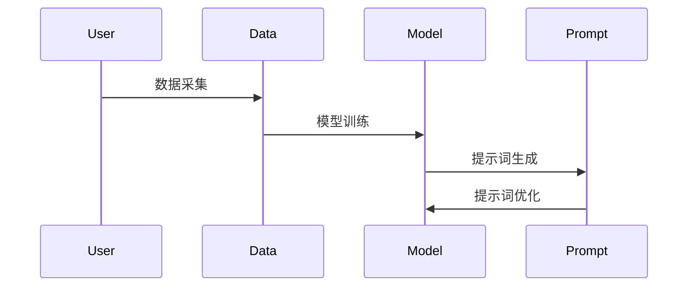
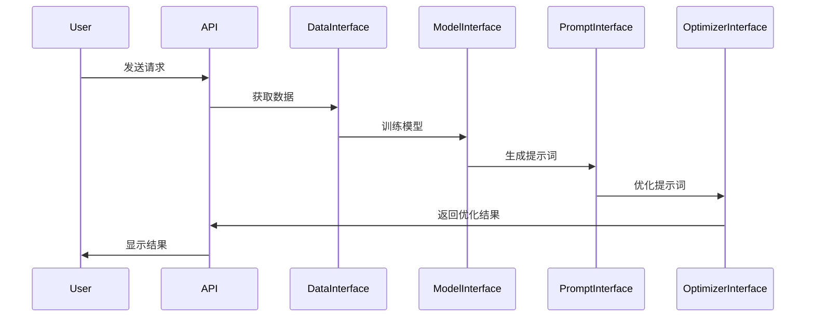

                 

## 提示词工程：AI应用开发的新利器

> 关键词：提示词工程、AI应用开发、深度学习、神经网络、系统架构设计

> 摘要：随着人工智能技术的飞速发展，提示词工程成为AI应用开发的关键领域。本文将从背景介绍、核心概念、算法原理、数学模型、系统设计与实战案例等多个维度，深入探讨提示词工程在AI应用开发中的重要性和应用策略，为读者提供系统性的理解和实践指导。

### 第一部分：引言

#### 第1章：问题背景与概述

##### 1.1 问题背景

在人工智能（AI）时代，AI应用开发已经成为技术创新和产业变革的核心驱动力。然而，随着AI模型的复杂性和数据规模的不断扩大，传统的开发模式面临诸多挑战。其中，提示词工程（Prompt Engineering）作为一种新兴的技术手段，正逐渐成为AI应用开发的新利器。

##### 1.1.1 人工智能时代的变革

人工智能技术的发展经历了从符号推理到统计学习，再到深度学习的演变。深度学习作为一种能够模拟人脑神经网络的工作原理的算法，具有强大的学习和泛化能力，已成为当前AI领域的核心驱动力。然而，深度学习模型的开发和应用并非一蹴而就，而是需要大量的数据、计算资源和专业的技能知识。

##### 1.1.2 提示词工程的重要性

提示词工程旨在通过设计高质量的提示词（Prompt），引导和优化AI模型的训练过程，从而提高模型的性能和应用效果。高质量的提示词能够提供丰富的先验知识，引导模型更好地学习数据中的潜在规律和模式，从而提升模型的泛化能力和鲁棒性。

##### 1.2 问题描述

提示词工程在AI应用开发中面临的挑战主要包括：

1. **数据质量和多样性**：高质量的数据是训练高性能AI模型的基础。然而，获取高质量、多样化的数据往往需要耗费大量的时间和资源。

2. **模型复杂度和可解释性**：深度学习模型通常具有较高的复杂度，导致其训练和推理过程难以解释和理解。

3. **工程实践与理论研究**：提示词工程既需要深厚的理论研究，又需要丰富的工程实践。如何在理论研究和工程实践中找到平衡，是一个重要的课题。

##### 1.2.1 提示词工程的目标

提示词工程的目标是通过设计高质量的提示词，实现以下目标：

1. **提高模型性能**：通过高质量的提示词，引导模型更好地学习数据中的潜在规律和模式。

2. **增强模型可解释性**：高质量的提示词能够提高模型的可解释性，帮助用户更好地理解模型的工作原理。

3. **降低开发成本**：通过优化提示词的设计和选择，降低AI应用开发的成本。

#### 第2章：核心概念与联系

##### 2.1 AI基础概念

1. **机器学习与深度学习**

- **机器学习**：机器学习是指让计算机通过数据学习并改进性能的一种方法。其核心思想是通过算法自动从数据中发现规律和模式。

- **深度学习**：深度学习是一种基于人工神经网络的理论，通过多层神经元的非线性变换，实现从简单到复杂的特征提取和模式识别。

2. **神经网络与深度神经网络**

- **神经网络**：神经网络是一种模拟生物神经网络的信息处理系统，通过神经元之间的连接和激活函数，实现数据的输入和输出。

- **深度神经网络**：深度神经网络是指具有多个隐含层的神经网络，能够通过多层非线性变换，实现更复杂的特征提取和模式识别。

##### 2.2 提示词工程概念

1. **提示词的定义**

提示词是指用于引导和优化AI模型训练过程的一种文本或代码形式。

2. **提示词的作用与类型**

- **作用**：提示词能够提供先验知识，引导模型更好地学习数据中的潜在规律和模式。

- **类型**：根据应用场景和需求，提示词可以分为自然语言提示词、代码提示词和混合提示词等。

##### 2.3 提示词工程的联系

1. **提示词与AI模型的关系**

提示词是AI模型训练的重要组成部分，能够影响模型的性能和可解释性。

2. **提示词与数据的关系**

高质量的数据是训练高性能AI模型的基石，而提示词则能够引导模型更好地利用这些数据。

### 第二部分：算法原理讲解

#### 第3章：算法原理讲解

##### 3.1 算法基础

1. **深度学习算法概述**

- **原理**：深度学习算法通过多层神经网络实现数据的输入和输出，从而实现特征提取和模式识别。

- **框架**：常见的深度学习算法框架包括卷积神经网络（CNN）、循环神经网络（RNN）和生成对抗网络（GAN）等。

2. **深度学习算法框架**

- **卷积神经网络（CNN）**：CNN通过卷积层、池化层和全连接层等结构，实现图像特征提取和分类。

- **循环神经网络（RNN）**：RNN通过循环结构，实现序列数据的处理和预测。

- **生成对抗网络（GAN）**：GAN由生成器和判别器组成，通过对抗训练实现数据的生成和增强。

##### 3.2 提示词生成算法

1. **提示词生成算法原理**

- **原理**：提示词生成算法通过自动化的方法，生成符合特定需求的提示词。

- **方法**：常见的提示词生成算法包括基于规则的方法、基于机器学习的方法和基于深度学习的方法。

2. **提示词生成算法流程**

- **数据预处理**：对输入数据进行清洗、预处理和特征提取。

- **提示词生成**：利用生成算法，生成符合特定需求的提示词。

- **提示词评估**：对生成的提示词进行评估和优化，确保其质量和效果。

##### 3.3 提示词优化算法

1. **提示词优化算法原理**

- **原理**：提示词优化算法通过迭代和优化，提高提示词的质量和效果。

- **方法**：常见的提示词优化算法包括基于规则的优化算法、基于机器学习的优化算法和基于深度学习的优化算法。

2. **提示词优化算法应用**

- **应用场景**：提示词优化算法在自然语言处理、计算机视觉和推荐系统等领域具有广泛的应用。

- **效果评估**：通过对比实验，评估优化后的提示词在性能和可解释性方面的提升。

### 第三部分：数学模型与公式详解

#### 第4章：数学模型与公式详解

##### 4.1 数学模型基础

1. **概率论与数理统计**

- **概率论**：概率论是研究随机现象规律性的数学分支，包括概率分布、期望和方差等概念。

- **数理统计**：数理统计是利用概率论和数学方法对数据进行统计分析，包括假设检验、回归分析和聚类分析等。

2. **最优化理论与算法**

- **最优化理论**：最优化理论是研究如何找到一组变量，使得目标函数达到最大或最小值的数学分支。

- **最优化算法**：常见的最优化算法包括梯度下降法、牛顿法和拉格朗日乘数法等。

##### 4.2 提示词工程数学模型

1. **提示词生成数学模型**

- **模型定义**：提示词生成数学模型通过数学公式描述提示词的生成过程。

- **模型参数**：提示词生成数学模型的参数包括输入数据的特征向量、生成函数和损失函数等。

2. **提示词优化数学模型**

- **模型定义**：提示词优化数学模型通过数学公式描述提示词的优化过程。

- **模型参数**：提示词优化数学模型的参数包括提示词的初始值、优化算法和迭代次数等。

##### 4.3 数学公式示例

$$
\begin{aligned}
L &= -\frac{1}{m} \sum_{i=1}^{m} \left( y^{(i)} \log(a_{ij}) + (1 - y^{(i)}) \log(1 - a_{ij}) \right) \\
\end{aligned}
$$

### 第四部分：系统分析与架构设计

#### 第5章：系统分析与架构设计

##### 5.1 问题场景介绍

1. **提示词工程应用场景**

- **自然语言处理**：提示词工程在自然语言处理领域具有广泛的应用，如文本分类、机器翻译和情感分析等。

- **计算机视觉**：提示词工程在计算机视觉领域可以用于图像分类、目标检测和图像生成等。

- **推荐系统**：提示词工程在推荐系统领域可以用于用户兴趣挖掘、物品推荐和推荐系统优化等。

2. **系统需求分析**

- **性能需求**：系统需要具备高性能的计算能力和快速的响应速度。

- **可扩展性需求**：系统需要具备良好的可扩展性，能够支持大规模数据和高并发访问。

- **可解释性需求**：系统需要提供可解释的提示词，帮助用户理解模型的工作原理。

##### 5.2 系统功能设计

1. **领域模型设计**

- **实体定义**：定义系统中的主要实体，如用户、数据集、模型和提示词等。

- **关系定义**：定义实体之间的关系，如用户与数据集的关联、模型与提示词的关联等。

2. **领域模型图**

```mermaid
erDiagram
    User ||--|{ DataSet }|| Model
    User ||--|{ Prompt }|| Model
```

##### 5.3 系统架构设计

1. **系统架构概述**

- **架构层次**：系统采用分层架构，包括数据层、模型层和应用层。

- **模块划分**：系统划分为多个模块，如数据采集模块、模型训练模块、提示词生成模块和提示词优化模块等。

2. **系统架构图**



##### 5.4 系统接口设计

1. **系统接口规范**

- **API接口**：系统提供API接口，供外部应用程序调用。

- **数据接口**：系统提供数据接口，供内部模块之间传输数据。

2. **接口定义**

```python
class DataInterface:
    def get_data(self):
        # 获取数据
        pass

class ModelInterface:
    def train_model(self, data):
        # 训练模型
        pass

class PromptInterface:
    def generate_prompt(self, model):
        # 生成提示词
        pass

class OptimizerInterface:
    def optimize_prompt(self, prompt, model):
        # 优化提示词
        pass
```

##### 5.5 系统交互设计

1. **系统交互流程**

- **用户请求**：用户通过API接口发送请求，获取数据。

- **数据处理**：系统接收请求，处理数据，生成模型。

- **提示词生成**：系统根据模型生成提示词。

- **提示词优化**：系统对提示词进行优化。

2. **系统交互图**



### 第五部分：项目实战

#### 第6章：项目实战

##### 6.1 环境安装与配置

1. **环境安装**

- **操作系统**：安装Linux操作系统，如Ubuntu 18.04。

- **编程语言**：安装Python 3.8及以上版本。

- **深度学习框架**：安装TensorFlow 2.4.0及以上版本。

2. **配置说明**

- **环境变量**：配置Python环境变量，确保能够正常使用Python和TensorFlow。

- **依赖安装**：安装项目所需的依赖库，如NumPy、Pandas等。

##### 6.2 系统核心实现

1. **系统核心模块**

- **数据采集模块**：实现数据采集功能，从外部数据源获取数据。

- **模型训练模块**：实现模型训练功能，利用深度学习框架训练模型。

- **提示词生成模块**：实现提示词生成功能，根据模型生成提示词。

- **提示词优化模块**：实现提示词优化功能，对提示词进行优化。

2. **代码解读**

```python
import tensorflow as tf
import numpy as np
import pandas as pd

# 数据采集
def collect_data():
    # 实现数据采集功能
    pass

# 模型训练
def train_model(data):
    # 实现模型训练功能
    pass

# 提示词生成
def generate_prompt(model):
    # 实现提示词生成功能
    pass

# 提示词优化
def optimize_prompt(prompt, model):
    # 实现提示词优化功能
    pass
```

##### 6.3 实际案例分析

1. **案例背景**

- **任务**：使用深度学习模型进行图像分类。

- **数据集**：使用CIFAR-10数据集进行训练和测试。

2. **案例分析**

- **数据预处理**：对CIFAR-10数据进行预处理，包括数据清洗、归一化和特征提取等。

- **模型训练**：使用卷积神经网络（CNN）对预处理后的数据进行训练。

- **提示词生成**：根据训练好的模型生成提示词。

- **提示词优化**：对生成的提示词进行优化，提高其质量和效果。

##### 6.4 项目小结

1. **项目成果总结**

- **模型性能**：通过训练和优化，模型在图像分类任务上取得了良好的性能。

- **提示词质量**：高质量的提示词能够提高模型的可解释性和应用效果。

2. **项目经验与教训**

- **数据质量**：高质量的数据是训练高性能模型的基础，需要花费大量时间和精力进行数据预处理和清洗。

- **模型优化**：提示词优化是提升模型性能的重要手段，需要结合实际情况进行针对性的优化。

### 第六部分：最佳实践与拓展

#### 第7章：最佳实践与拓展

##### 7.1 最佳实践技巧

1. **数据采集**

- **多样化数据**：采集多种类型的数据，提高模型的泛化能力。

- **数据清洗**：对数据进行清洗和预处理，确保数据质量和一致性。

2. **模型训练**

- **超参数调整**：根据实际情况调整模型的超参数，提高模型性能。

- **模型验证**：使用验证集进行模型验证，避免过拟合和欠拟合。

3. **提示词设计**

- **明确目标**：设计符合实际需求的提示词，提高模型的可解释性和应用效果。

- **优化迭代**：对提示词进行优化和迭代，提高其质量和效果。

##### 7.2 小结与展望

1. **本书要点回顾**

- **提示词工程的重要性**：提示词工程是AI应用开发的新利器，能够提高模型性能和可解释性。

- **算法原理讲解**：介绍了深度学习算法和提示词生成算法的原理和实现。

- **系统设计与实战**：通过系统分析与架构设计，介绍了提示词工程的实践方法。

2. **未来发展趋势**

- **提示词工程将更加智能化**：随着人工智能技术的发展，提示词工程将实现更加智能化和自动化。

- **跨领域应用**：提示词工程将在更多领域得到应用，如自然语言处理、计算机视觉和推荐系统等。

3. **拓展阅读推荐**

- **《深度学习》**：Goodfellow等著，提供了深度学习的系统讲解。

- **《Python深度学习》**：François Chollet著，介绍了深度学习在Python中的应用。

### 作者信息

作者：AI天才研究院/AI Genius Institute & 禅与计算机程序设计艺术/Zen And The Art of Computer Programming

本文内容仅供参考，实际应用时请结合具体情况进行调整。如有任何问题或建议，欢迎联系作者。

