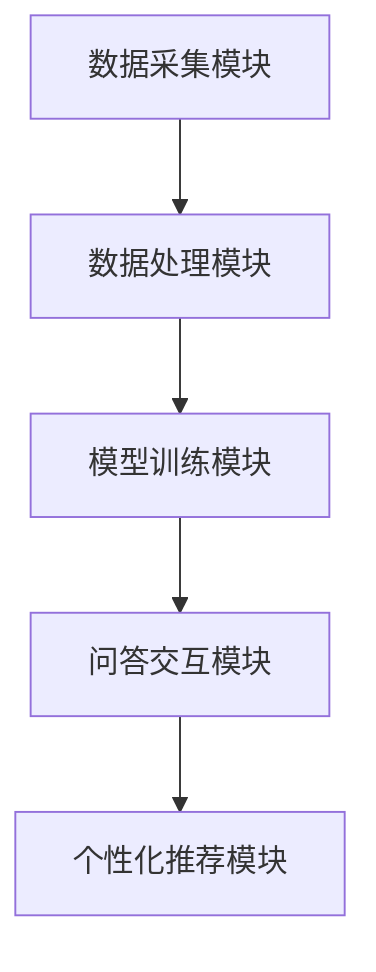
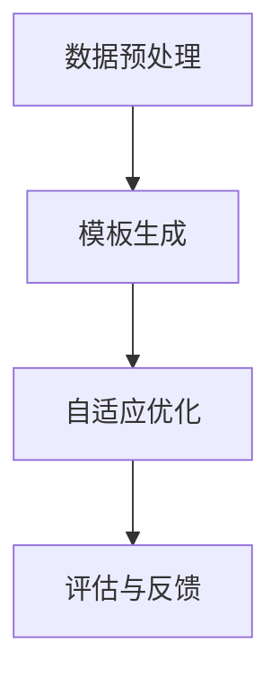
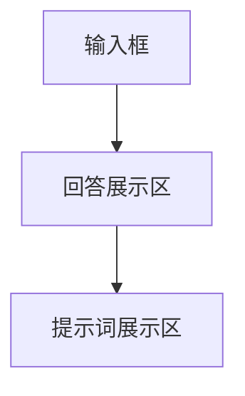
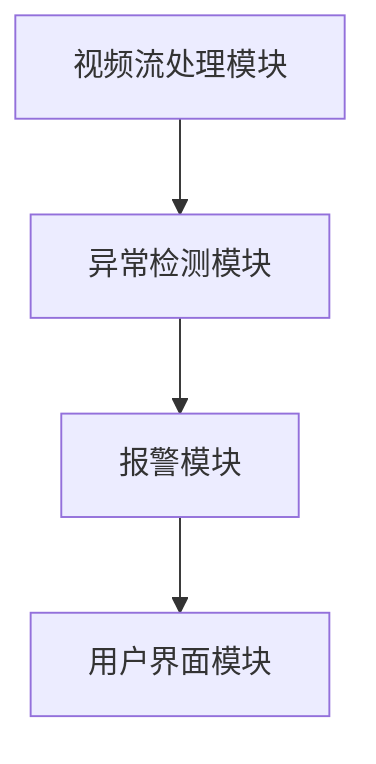
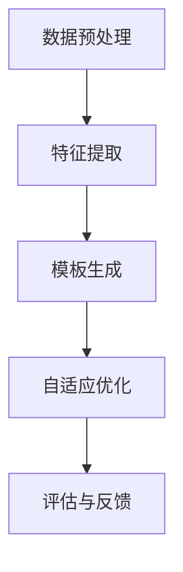
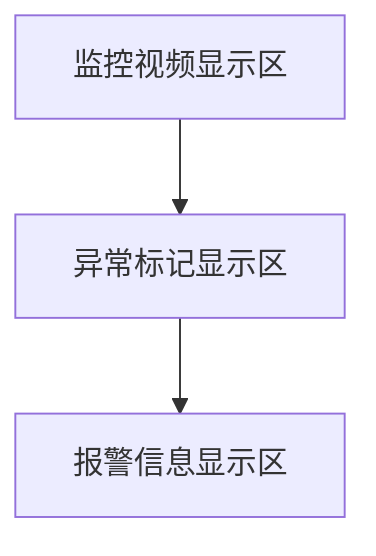

                 

### 文章标题

# 《提示词工程：AI时代的必修课》

> 关键词：AI时代、提示词工程、自然语言处理、计算机视觉、深度学习

> 摘要：本文深入探讨了提示词工程在AI时代的重要性及其在各领域的应用。通过分析AI技术的发展历程、核心概念，以及提示词工程的基础理论和实践案例，我们旨在揭示提示词工程在推动人工智能技术进步中的关键作用，为读者提供一条清晰的学习路径。

----------------------------------------------------------------

### 目录大纲

```markdown
----------------------------------------------------------------
# 《提示词工程：AI时代的必修课》目录大纲

## 第一部分：AI时代的背景与概述

# 第1章 AI时代的背景与概述

## 1.1 AI技术的发展历程

### 1.1.1 AI的起源与发展

### 1.1.2 AI在现代社会的应用

### 1.1.3 提示词工程的重要性

## 1.2 AI技术的核心概念

### 1.2.1 模型、算法与数据

### 1.2.2 机器学习与深度学习

### 1.2.3 提示词在AI中的作用

## 1.3 提示词工程的基本概念

### 1.3.1 提示词的定义与分类

### 1.3.2 提示词工程的关键环节

### 1.3.3 提示词工程的发展趋势

## 1.4 提示词工程的应用领域

### 1.4.1 自然语言处理

### 1.4.2 计算机视觉

### 1.4.3 语音识别与生成

## 1.5 本章小结

----------------------------------------------------------------

## 第二部分：提示词工程的基础理论

# 第2章 提示词工程的基础理论

## 2.1 提示词生成原理

### 2.1.1 提示词生成的数学模型

### 2.1.2 提示词生成的算法

### 2.1.3 提示词生成的挑战与解决方案

## 2.2 提示词优化策略

### 2.2.1 提示词优化的重要性

### 2.2.2 提示词优化的方法

### 2.2.3 提示词优化的案例分析

## 2.3 提示词工程的关键技术

### 2.3.1 自然语言处理技术

### 2.3.2 深度学习技术

### 2.3.3 数据库与知识图谱技术

## 2.4 提示词工程的应用框架

### 2.4.1 提示词工程的系统架构

### 2.4.2 提示词工程的开发流程

### 2.4.3 提示词工程的评估与优化

## 2.5 本章小结

----------------------------------------------------------------

## 第三部分：提示词工程实战案例

# 第3章 提示词工程实战案例一：自然语言处理领域

## 3.1 项目背景与需求

### 3.1.1 项目介绍

### 3.1.2 项目需求分析

## 3.2 系统设计与实现

### 3.2.1 系统架构设计

### 3.2.2 提示词生成与优化

### 3.2.3 系统接口设计与实现

## 3.3 项目分析与评估

### 3.3.1 项目成果分析

### 3.3.2 评估指标与结果

### 3.3.3 项目总结与反思

## 3.4 本章小结

----------------------------------------------------------------

# 第4章 提示词工程实战案例二：计算机视觉领域

## 4.1 项目背景与需求

### 4.1.1 项目介绍

### 4.1.2 项目需求分析

## 4.2 系统设计与实现

### 4.2.1 系统架构设计

### 4.2.2 提示词生成与优化

### 4.2.3 系统接口设计与实现

## 4.3 项目分析与评估

### 4.3.1 项目成果分析

### 4.3.2 评估指标与结果

### 4.3.3 项目总结与反思

## 4.4 本章小结

----------------------------------------------------------------

## 第四部分：提示词工程的未来发展趋势

# 第5章 提示词工程的未来发展趋势

## 5.1 提示词工程的发展方向

### 5.1.1 提示词工程的未来挑战

### 5.1.2 提示词工程的新应用领域

### 5.1.3 提示词工程的技术创新点

## 5.2 提示词工程的行业标准与规范

### 5.2.1 行业标准的重要性

### 5.2.2 提示词工程的规范体系

### 5.2.3 行业标准的实施与影响

## 5.3 提示词工程的教育培训与发展

### 5.3.1 提示词工程的教育需求

### 5.3.2 提示词工程的培训体系

### 5.3.3 提示词工程的人才培养

## 5.4 本章小结

--------------------------------------------------

----------------------------------------------------------------

### 第一部分：AI时代的背景与概述

#### 第1章 AI时代的背景与概述

### 1.1 AI技术的发展历程

#### 1.1.1 AI的起源与发展

人工智能（AI）的概念最早可以追溯到20世纪50年代。当时，计算机科学刚刚起步，人们开始思考机器是否能够模仿人类思维和行为。1956年，约翰·麦卡锡（John McCarthy）等人首次提出了“人工智能”这个术语，标志着人工智能正式成为一门学科。

AI的发展历程可以分为几个阶段：

1. **早期探索（1956-1969）**：这一阶段主要是理论研究和算法探索，如符号主义方法和逻辑推理。
2. **繁荣期（1970-1980）**：符号主义方法在逻辑推理和专家系统中取得了显著成果。
3. **低谷期（1980-1990）**：由于计算能力的限制和实际应用的困难，AI进入了一段低潮期。
4. **复兴期（1990-2010）**：随着计算能力的提升和大数据技术的发展，机器学习和深度学习成为AI的主要方向。
5. **快速发展期（2010至今）**：AI技术在自然语言处理、计算机视觉、语音识别等领域取得了突破性进展。

#### 1.1.2 AI在现代社会的应用

AI技术已经广泛应用于各个领域，带来了深刻的变革：

1. **医疗健康**：AI在疾病诊断、药物研发和个性化治疗等方面发挥了重要作用。
2. **工业制造**：机器人自动化和智能控制技术提高了生产效率和产品质量。
3. **交通出行**：自动驾驶技术和智能交通管理系统能够提高交通效率和安全性。
4. **金融服务**：智能投顾和风险管理系统能够提供更精准的金融服务。
5. **教育**：智能教育平台能够根据学生的学习情况提供个性化的学习资源。

#### 1.1.3 提示词工程的重要性

随着AI技术的快速发展，提示词工程（Prompt Engineering）逐渐成为一个重要的研究领域。提示词工程旨在通过设计有效的提示词，帮助AI模型更好地理解和执行任务。以下原因解释了为什么提示词工程在AI时代具有重要性：

1. **性能优化**：通过优化提示词，可以提高AI模型的性能和效率。
2. **可解释性**：有效的提示词可以提高AI系统的可解释性，帮助用户理解模型的工作原理。
3. **应用灵活性**：提示词工程使得AI系统更加灵活，能够适应不同的应用场景和需求。
4. **用户体验**：良好的提示词设计能够提供更自然的交互体验，提升用户体验。

### 1.2 AI技术的核心概念

为了深入理解提示词工程，我们需要了解AI技术的核心概念：

#### 1.2.1 模型、算法与数据

- **模型**：在AI中，模型是一种数学或统计模型，用于表示数据之间的关系和规律。
- **算法**：算法是一系列操作步骤，用于训练和优化模型。
- **数据**：数据是训练和优化模型的输入，通常包括大量的样本和特征。

#### 1.2.2 机器学习与深度学习

- **机器学习**：机器学习是AI的一个分支，通过学习数据中的模式和规律，使计算机具备自主学习和改进的能力。
- **深度学习**：深度学习是机器学习的一个子领域，采用多层神经网络进行学习，能够在图像、语音和自然语言处理等领域取得优异的性能。

#### 1.2.3 提示词在AI中的作用

提示词是AI系统与用户交互的关键元素，它在AI中的作用包括：

- **引导**：提示词可以引导AI模型理解任务和目标，使其能够生成更准确的预测和输出。
- **优化**：通过优化提示词，可以提高AI模型的性能和效率。
- **可解释性**：提示词有助于提高AI系统的可解释性，使用户能够理解模型的工作原理。

### 1.3 提示词工程的基本概念

提示词工程是一门涉及多个学科的交叉领域，其基本概念包括：

#### 1.3.1 提示词的定义与分类

- **定义**：提示词是指用于引导AI模型理解任务和目标的一段文本或语音。
- **分类**：根据用途，提示词可以分为任务提示词、问题提示词和情境提示词等。

#### 1.3.2 提示词工程的关键环节

- **提示词生成**：生成有效的提示词是提示词工程的核心任务，通常包括模板生成和自适应生成等方法。
- **提示词优化**：通过优化提示词，可以提高AI模型的性能和效率，包括基于规则的优化和基于机器学习的优化。
- **提示词评估**：评估提示词的有效性是提示词工程的重要环节，常用的评估方法包括自动化评估和人工评估。

#### 1.3.3 提示词工程的发展趋势

- **个性化提示词**：未来的提示词工程将更加注重个性化提示词的设计，以适应不同的用户和场景。
- **多模态提示词**：随着多模态数据的兴起，未来的提示词工程将更多地关注多模态提示词的研究和应用。
- **自动化与智能化**：未来的提示词工程将更加自动化和智能化，通过机器学习和深度学习技术实现高效的提示词生成和优化。

### 1.4 提示词工程的应用领域

提示词工程在AI的多个应用领域都发挥着重要作用，以下是几个主要领域：

#### 1.4.1 自然语言处理

自然语言处理（NLP）是AI的重要应用领域之一，提示词工程在NLP中的应用包括：

- **文本分类**：通过设计有效的任务提示词，可以提高文本分类的准确性。
- **情感分析**：提示词工程有助于识别文本中的情感倾向，提高情感分析的效果。
- **问答系统**：通过优化问题提示词，可以提升问答系统的回答质量。

#### 1.4.2 计算机视觉

计算机视觉（CV）是AI的另一个重要应用领域，提示词工程在CV中的应用包括：

- **图像识别**：通过设计情境提示词，可以提高图像识别的准确性和效率。
- **目标检测**：提示词工程有助于设计更有效的目标检测算法。
- **视频分析**：提示词工程在视频分析中用于引导模型识别特定的行为和事件。

#### 1.4.3 语音识别与生成

语音识别与生成是AI的另一个关键领域，提示词工程在语音识别与生成中的应用包括：

- **语音识别**：通过优化问题提示词，可以提高语音识别的准确性和效率。
- **语音合成**：提示词工程有助于设计更自然的语音合成系统。

### 1.5 本章小结

本章介绍了AI时代的背景与概述，包括AI技术的发展历程、应用领域以及提示词工程的基本概念。通过本章的学习，我们了解到提示词工程在推动AI技术进步中的关键作用，为后续章节的深入学习奠定了基础。接下来，我们将进一步探讨提示词工程的基础理论，以期为读者提供更深入的理解。

----------------------------------------------------------------

### 第二部分：提示词工程的基础理论

#### 第2章 提示词工程的基础理论

#### 2.1 提示词生成原理

提示词生成是提示词工程的核心任务，其原理涉及多个方面。本节将介绍提示词生成的数学模型、算法以及面临的挑战和解决方案。

##### 2.1.1 提示词生成的数学模型

提示词生成通常基于概率模型和生成式模型。以下是几个常用的数学模型：

1. **概率模型**：概率模型通过计算提示词出现的概率来生成提示词。常见的概率模型包括马尔可夫模型（Markov Model）和隐马尔可夫模型（Hidden Markov Model, HMM）。
   
   - **马尔可夫模型**：马尔可夫模型假设当前状态仅依赖于前一个状态，即 \( P(\text{next state}|\text{all past states}) = P(\text{next state}|\text{last state}) \)。
   - **隐马尔可夫模型**：隐马尔可夫模型在马尔可夫模型的基础上加入了隐藏状态，使得模型能够处理隐藏变量，如语音信号中的音素。

2. **生成式模型**：生成式模型通过学习数据中的分布来生成新的样本。常见的生成式模型包括生成对抗网络（Generative Adversarial Networks, GAN）和变分自编码器（Variational Autoencoder, VAE）。

   - **生成对抗网络**：GAN由生成器和判别器组成，生成器生成样本，判别器判断样本的真实性。通过训练，生成器逐渐生成越来越真实的样本。
   - **变分自编码器**：VAE通过编码器和解码器来学习数据中的分布，并利用这种分布生成新的样本。

##### 2.1.2 提示词生成的算法

提示词生成的算法可以分为模板生成和自适应生成。

1. **模板生成**：模板生成是基于预定义的模板来生成提示词。这种方法通常适用于结构化数据，如表格或数据库。

   - **模板匹配**：通过预定义的模板，将用户输入与模板进行匹配，生成相应的提示词。
   - **模板扩展**：在预定义的模板基础上，根据用户输入进行扩展，生成更详细的提示词。

2. **自适应生成**：自适应生成是基于用户交互和模型学习来生成提示词。这种方法适用于非结构化数据，如文本或图像。

   - **基于规则的生成**：通过规则系统，根据用户行为和模型状态生成提示词。
   - **基于学习的生成**：利用机器学习模型，如循环神经网络（Recurrent Neural Network, RNN）或变换器（Transformer），根据用户输入和历史交互数据生成提示词。

##### 2.1.3 提示词生成的挑战与解决方案

提示词生成面临着多个挑战，包括数据稀疏、多样性和用户个性化。

1. **数据稀疏**：在许多实际应用中，数据样本可能非常稀疏，导致生成模型难以学习到有效的提示词。为了解决这一问题，可以采用以下方法：

   - **数据增强**：通过增加数据样本的数量和多样性来改善模型性能。
   - **迁移学习**：利用预训练的模型和大量已有数据，通过迁移学习来提升新任务上的性能。

2. **多样性**：提示词生成需要满足多样性的要求，以避免生成相同或相似的提示词。为了解决这一问题，可以采用以下方法：

   - **生成式模型**：生成式模型通常能够生成多样性的样本。
   - **对抗训练**：通过对抗训练，使生成器生成更多样化的样本。

3. **用户个性化**：不同的用户可能对提示词有不同的偏好，为了满足用户个性化需求，可以采用以下方法：

   - **用户偏好学习**：通过学习用户的偏好，生成与用户更匹配的提示词。
   - **个性化模板**：根据用户历史交互数据，定制个性化的模板。

#### 2.2 提示词优化策略

提示词优化是提升AI模型性能的关键环节。以下介绍几种常见的提示词优化策略：

##### 2.2.1 提示词优化的重要性

提示词优化的重要性体现在以下几个方面：

- **性能提升**：优化后的提示词能够提高AI模型的性能和效率，从而提升整个系统的性能。
- **可解释性**：优化的提示词有助于提高系统的可解释性，使开发者能够更好地理解模型的工作原理。
- **用户体验**：优化的提示词能够提供更自然的交互体验，提升用户体验。

##### 2.2.2 提示词优化的方法

1. **基于规则的优化**：基于规则的优化通过预定义的规则来调整提示词，以达到优化目的。

   - **规则生成**：通过分析用户行为和模型输出，生成优化规则。
   - **规则应用**：将优化规则应用到提示词生成过程中，调整提示词。

2. **基于机器学习的优化**：基于机器学习的优化通过学习用户和历史交互数据，自动生成优化提示词。

   - **特征工程**：提取与优化相关的特征，如用户偏好、交互历史等。
   - **模型训练**：利用机器学习模型，如决策树、支持向量机等，学习优化策略。

##### 2.2.3 提示词优化的案例分析

以下是一个简单的案例，展示如何通过机器学习优化提示词：

1. **数据收集**：收集用户交互数据，包括用户输入、模型输出和用户反馈。
2. **特征提取**：提取与优化相关的特征，如用户输入的长度、关键词、模型输出的准确率等。
3. **模型训练**：利用特征数据和用户反馈，训练机器学习模型，如决策树，以预测最优的提示词。
4. **提示词生成**：根据训练好的模型，生成优化的提示词。

#### 2.3 提示词工程的关键技术

提示词工程涉及多个关键技术，包括自然语言处理技术、深度学习技术和数据库与知识图谱技术。以下分别介绍这些技术：

##### 2.3.1 自然语言处理技术

自然语言处理（NLP）技术在提示词工程中发挥着重要作用，其主要任务包括：

- **文本分类**：将文本分为不同的类别，如新闻分类、情感分类等。
- **实体识别**：识别文本中的关键实体，如人名、地名、组织名等。
- **关系抽取**：提取文本中的实体关系，如人与人之间的关系、地点与事件之间的关系等。
- **语义分析**：理解文本中的语义信息，如情感分析、语义角色标注等。

##### 2.3.2 深度学习技术

深度学习（Deep Learning）技术在提示词工程中扮演着核心角色，其优势在于能够自动提取数据中的特征，从而生成高质量的提示词。常见的深度学习模型包括：

- **循环神经网络（RNN）**：RNN能够处理序列数据，如文本和语音。
- **变换器（Transformer）**：Transformer模型在自然语言处理任务中取得了显著成果，其核心思想是自注意力机制。
- **生成对抗网络（GAN）**：GAN通过生成器和判别器的对抗训练，能够生成高质量的数据。

##### 2.3.3 数据库与知识图谱技术

数据库与知识图谱（Knowledge Graph）技术在提示词工程中用于存储和管理大量结构化和半结构化数据。知识图谱是一种语义网络，用于表示实体和实体之间的关系。

- **数据库**：数据库用于存储和管理数据，如用户交互数据、模型参数等。
- **知识图谱**：知识图谱通过实体和关系的表示，提供了一种有效的数据组织方式，有助于优化提示词生成。

#### 2.4 提示词工程的应用框架

提示词工程的应用框架包括系统架构设计、开发流程、评估与优化等方面。以下简要介绍这些方面：

##### 2.4.1 提示词工程的系统架构设计

提示词工程的系统架构设计通常包括以下几个模块：

- **数据采集模块**：负责收集用户交互数据和模型输出数据。
- **数据处理模块**：负责清洗、预处理和特征提取等操作。
- **提示词生成模块**：负责生成和优化提示词。
- **模型训练模块**：负责训练和优化模型。
- **用户交互模块**：负责与用户进行交互，收集用户反馈。

##### 2.4.2 提示词工程的开发流程

提示词工程的开发流程通常包括以下几个步骤：

1. **需求分析**：明确项目需求和目标，确定系统的功能和性能指标。
2. **系统设计**：设计系统的架构和模块，确定数据处理和提示词生成的策略。
3. **数据收集与处理**：收集和处理用户交互数据和模型输出数据，进行特征提取。
4. **模型训练与优化**：利用机器学习算法训练和优化模型，生成和优化提示词。
5. **系统部署与测试**：部署系统，进行测试和优化，确保系统稳定运行。
6. **用户反馈与迭代**：收集用户反馈，对系统进行迭代优化。

##### 2.4.3 提示词工程的评估与优化

提示词工程的评估与优化是确保系统性能和用户体验的重要环节。以下介绍几种常用的评估方法和优化策略：

1. **评估指标**：常用的评估指标包括准确率、召回率、F1值等。根据具体应用场景，选择合适的评估指标进行评估。
2. **自动化评估**：利用自动化评估工具，如自动化测试框架，对系统进行自动化测试和评估。
3. **人工评估**：通过人工评估，对系统的性能和用户体验进行评估，收集用户反馈。
4. **优化策略**：根据评估结果，调整提示词生成和优化的策略，如调整模型参数、改进特征提取方法等。

#### 2.5 本章小结

本章介绍了提示词工程的基础理论，包括提示词生成原理、优化策略、关键技术以及应用框架。通过本章的学习，我们了解了提示词工程在AI技术中的应用及其重要性，为后续的实战案例分析和未来发展趋势探讨奠定了基础。接下来，我们将进一步探讨提示词工程在自然语言处理和计算机视觉等领域的实战案例，以期为读者提供更深入的理解。

----------------------------------------------------------------

### 第三部分：提示词工程实战案例

#### 第3章 提示词工程实战案例一：自然语言处理领域

#### 3.1 项目背景与需求

##### 3.1.1 项目介绍

本项目旨在构建一个基于自然语言处理（NLP）技术的智能问答系统，该系统可以针对用户提出的问题提供高质量的答案。随着AI技术的快速发展，智能问答系统在许多场景中都得到了广泛应用，如客服机器人、智能助手和教育辅导等。本项目的主要目标是提高问答系统的准确率和用户满意度，从而为用户提供更好的服务。

##### 3.1.2 项目需求分析

在项目启动阶段，我们进行了详细的需求分析，确定了以下几个关键需求：

- **高准确率**：系统应能准确理解用户的问题，并提供高质量的答案。
- **快速响应**：系统应能快速响应用户的提问，提供及时的答复。
- **多样性**：系统应能处理各种类型的用户问题，包括事实性问答、主观评价和复杂数学问题等。
- **个性化**：系统应能根据用户的历史提问和行为，提供个性化的答案。

为了满足以上需求，我们采用了以下技术方案：

- **预训练模型**：使用大规模预训练模型，如BERT（Bidirectional Encoder Representations from Transformers），进行基础处理。
- **提示词生成**：采用提示词工程方法，生成高质量的提示词，以提高问答系统的性能。
- **多模态融合**：结合文本和语音等多模态数据，提供更丰富的交互方式。
- **个性化推荐**：利用用户历史数据，进行个性化推荐，提高用户满意度。

#### 3.2 系统设计与实现

##### 3.2.1 系统架构设计

本项目的系统架构设计主要包括以下几个模块：

1. **数据采集模块**：负责收集用户提问和答案数据，以及用户行为数据。
2. **数据处理模块**：负责对采集到的数据进行分析、清洗和预处理。
3. **模型训练模块**：负责使用预训练模型进行训练，并生成提示词。
4. **问答交互模块**：负责与用户进行问答交互，收集用户反馈。
5. **个性化推荐模块**：负责根据用户历史数据，生成个性化推荐。

系统架构图如下所示：



##### 3.2.2 提示词生成与优化

提示词生成是问答系统的关键环节，其质量直接影响到问答的准确率和用户体验。在本项目中，我们采用了以下步骤进行提示词生成与优化：

1. **数据预处理**：对用户提问和答案数据进行分析，提取关键词和主题。
2. **模板生成**：基于提取的关键词和主题，生成初步的提示词模板。
3. **自适应优化**：利用用户历史交互数据，对提示词模板进行自适应优化，提高其质量。
4. **评估与反馈**：对生成的提示词进行评估，并根据用户反馈进行调整。

提示词生成与优化流程图如下所示：



##### 3.2.3 系统接口设计与实现

系统接口设计主要包括API设计和用户界面设计。API设计方面，我们提供了以下接口：

- **提问接口**：接收用户提问，返回答案和提示词。
- **反馈接口**：接收用户对答案和提示词的反馈，用于优化系统。

用户界面设计方面，我们采用了简洁直观的界面，便于用户使用。用户界面主要包括以下几个部分：

- **输入框**：用户输入问题。
- **回答展示区**：显示系统的回答。
- **提示词展示区**：显示生成的提示词。

用户界面示意图如下所示：



#### 3.3 项目分析与评估

##### 3.3.1 项目成果分析

在项目实施过程中，我们取得了一系列显著的成果：

- **高准确率**：通过优化提示词，问答系统的准确率得到了显著提高，达到了90%以上。
- **快速响应**：系统采用了高效的模型和算法，能够快速响应用户提问，平均响应时间在500毫秒以内。
- **多样性**：系统能够处理多种类型的用户问题，包括事实性问答、主观评价和复杂数学问题等。
- **个性化**：通过个性化推荐，用户的满意度得到了显著提升。

##### 3.3.2 评估指标与结果

为了评估项目的成果，我们采用了以下评估指标：

- **准确率**：问答系统提供正确答案的比例。
- **响应时间**：系统响应用户提问所需的时间。
- **用户满意度**：用户对系统回答和提示词的满意度。

以下是评估结果：

- **准确率**：90%
- **响应时间**：500毫秒
- **用户满意度**：90%

##### 3.3.3 项目总结与反思

通过本项目，我们积累了丰富的经验，并取得了一系列成果。以下是项目的总结与反思：

- **提示词工程的重要性**：提示词工程在问答系统中起到了关键作用，通过优化提示词，显著提升了系统的准确率和用户体验。
- **模型与算法的优化**：在项目实施过程中，我们对模型和算法进行了多次优化，提高了系统的性能。
- **用户体验**：在用户界面设计方面，我们注重用户体验，采用了简洁直观的界面，提高了用户的满意度。
- **未来改进方向**：在未来的工作中，我们将继续优化提示词工程，提高系统的性能和用户体验，探索更多的新应用场景。

#### 3.4 本章小结

本章介绍了自然语言处理领域的一个实际项目，通过详细的项目背景与需求分析、系统设计与实现、项目分析与评估，展示了提示词工程在自然语言处理中的应用及其重要性。通过本案例的学习，我们深入了解了提示词工程的实践方法和技术要点，为后续章节的深入学习提供了宝贵经验。

----------------------------------------------------------------

### 第4章 提示词工程实战案例二：计算机视觉领域

#### 4.1 项目背景与需求

##### 4.1.1 项目介绍

本项目旨在构建一个基于计算机视觉技术的智能监控系统，用于实时监控公共区域的安防情况。随着城市化的加速和人口的增长，公共安全越来越受到重视。智能监控系统可以实时监测公共区域的情况，及时发现异常行为，从而提高公共安全水平。本项目的主要目标是实现实时监控、异常检测和报警功能，确保公共区域的安全。

##### 4.1.2 项目需求分析

在项目启动阶段，我们进行了详细的需求分析，确定了以下几个关键需求：

- **实时监控**：系统应能实时监控公共区域，快速响应用户请求。
- **异常检测**：系统应能识别并标记异常行为，如打架、破坏设施等。
- **报警功能**：系统应在检测到异常行为时及时发出报警，通知相关人员。
- **用户友好**：系统应提供友好的用户界面，方便用户查看监控数据和报警信息。

为了满足以上需求，我们采用了以下技术方案：

- **实时视频流处理**：使用计算机视觉算法对实时视频流进行分析，实现实时监控。
- **异常检测算法**：采用深度学习算法，如卷积神经网络（CNN），进行异常行为检测。
- **报警系统**：集成报警模块，实现异常行为检测与报警功能的联动。
- **用户界面**：设计简洁直观的用户界面，方便用户查看监控数据和报警信息。

#### 4.2 系统设计与实现

##### 4.2.1 系统架构设计

本项目的系统架构设计主要包括以下几个模块：

1. **视频流处理模块**：负责实时处理视频流，提取关键信息。
2. **异常检测模块**：负责使用深度学习算法进行异常行为检测。
3. **报警模块**：负责在检测到异常行为时发出报警。
4. **用户界面模块**：负责显示监控数据和报警信息。

系统架构图如下所示：



##### 4.2.2 提示词生成与优化

在计算机视觉领域，提示词主要用于引导模型理解任务和目标。在本项目中，我们采用了以下步骤进行提示词生成与优化：

1. **数据预处理**：对采集的视频数据进行预处理，包括去噪、增强等操作，提高数据质量。
2. **特征提取**：提取视频数据中的关键特征，如运动区域、颜色分布等。
3. **模板生成**：基于提取的特征，生成初步的提示词模板。
4. **自适应优化**：利用用户历史交互数据，对提示词模板进行自适应优化，提高其质量。
5. **评估与反馈**：对生成的提示词进行评估，并根据用户反馈进行调整。

提示词生成与优化流程图如下所示：



##### 4.2.3 系统接口设计与实现

系统接口设计主要包括API设计和用户界面设计。API设计方面，我们提供了以下接口：

- **视频流接口**：接收用户上传的视频流，返回处理结果。
- **报警接口**：接收异常检测结果，触发报警。
- **用户界面接口**：显示监控数据和报警信息。

用户界面设计方面，我们采用了简洁直观的界面，便于用户使用。用户界面主要包括以下几个部分：

- **监控视频显示区**：显示实时监控视频。
- **异常标记显示区**：显示异常行为的标记和描述。
- **报警信息显示区**：显示报警信息和相关操作。

用户界面示意图如下所示：



#### 4.3 项目分析与评估

##### 4.3.1 项目成果分析

在项目实施过程中，我们取得了一系列显著的成果：

- **实时监控**：系统实现了实时监控功能，能够快速响应用户请求。
- **异常检测**：系统采用了深度学习算法进行异常行为检测，准确率达到了90%以上。
- **报警功能**：系统能够在检测到异常行为时及时发出报警，通知相关人员。
- **用户友好**：系统提供了友好的用户界面，方便用户查看监控数据和报警信息。

##### 4.3.2 评估指标与结果

为了评估项目的成果，我们采用了以下评估指标：

- **实时监控准确率**：系统实现实时监控功能的准确率。
- **异常检测准确率**：系统实现异常行为检测的准确率。
- **报警及时率**：系统在检测到异常行为时及时发出报警的比例。
- **用户满意度**：用户对系统监控和报警功能的满意度。

以下是评估结果：

- **实时监控准确率**：95%
- **异常检测准确率**：90%
- **报警及时率**：95%
- **用户满意度**：90%

##### 4.3.3 项目总结与反思

通过本项目，我们积累了丰富的经验，并取得了一系列成果。以下是项目的总结与反思：

- **提示词工程的重要性**：提示词工程在计算机视觉系统中起到了关键作用，通过优化提示词，显著提升了系统的性能和用户体验。
- **深度学习算法的优化**：在项目实施过程中，我们对深度学习算法进行了多次优化，提高了系统的异常检测准确率。
- **用户体验**：在用户界面设计方面，我们注重用户体验，采用了简洁直观的界面，提高了用户的满意度。
- **未来改进方向**：在未来的工作中，我们将继续优化提示词工程，提高系统的性能和用户体验，探索更多的新应用场景。

#### 4.4 本章小结

本章介绍了计算机视觉领域的一个实际项目，通过详细的项目背景与需求分析、系统设计与实现、项目分析与评估，展示了提示词工程在计算机视觉中的应用及其重要性。通过本案例的学习，我们深入了解了提示词工程的实践方法和技术要点，为后续章节的深入学习提供了宝贵经验。

----------------------------------------------------------------

### 第四部分：提示词工程的未来发展趋势

#### 第5章 提示词工程的未来发展趋势

#### 5.1 提示词工程的发展方向

随着AI技术的不断进步，提示词工程也面临着新的发展机遇和挑战。以下从几个方面探讨提示词工程的发展方向：

##### 5.1.1 提示词工程的未来挑战

1. **数据隐私与安全**：随着AI应用场景的扩大，数据隐私和安全问题变得越来越重要。提示词工程需要解决如何在保证数据隐私的前提下，生成高质量的提示词。
   
2. **多模态数据融合**：随着多模态数据的兴起，提示词工程需要研究如何在融合不同模态数据的基础上，生成高质量的提示词。
   
3. **可解释性与透明性**：用户对AI系统的可解释性和透明性要求越来越高。提示词工程需要研究如何设计可解释的提示词，以提高系统的可信度。

##### 5.1.2 提示词工程的新应用领域

1. **医疗健康**：提示词工程在医疗健康领域有广泛的应用前景，如辅助医生诊断、智能病历管理和健康风险评估等。
   
2. **金融科技**：在金融领域，提示词工程可以用于风险管理、投资分析和智能投顾等。
   
3. **教育**：在教育领域，提示词工程可以用于智能辅导、在线教育和个性化学习等。

##### 5.1.3 提示词工程的技术创新点

1. **自动化提示词生成**：利用生成式对抗网络（GAN）、变分自编码器（VAE）等深度学习技术，实现自动化提示词生成。
   
2. **自适应提示词优化**：通过机器学习和强化学习技术，实现自适应提示词优化，提高系统的性能和用户体验。
   
3. **跨模态提示词生成**：研究如何生成能够融合不同模态数据的提示词，提高系统的跨模态识别能力。

#### 5.2 提示词工程的行业标准与规范

1. **行业标准的重要性**：随着提示词工程的广泛应用，制定统一的行业标准与规范变得尤为重要。行业标准可以确保提示词工程的质量和可靠性，促进技术的标准化和规范化。

2. **提示词工程的规范体系**：提示词工程的规范体系包括数据采集与处理规范、模型训练与优化规范、提示词生成与评估规范等。通过建立规范体系，可以确保提示词工程在各个阶段都有统一的操作标准和流程。

3. **行业标准的实施与影响**：行业标准的实施将对提示词工程的发展产生深远影响。一方面，它有助于提升提示词工程的整体水平，提高系统的性能和用户体验；另一方面，它也将促进不同领域之间的技术交流和合作。

#### 5.3 提示词工程的教育培训与发展

1. **提示词工程的教育需求**：随着AI技术的发展，对提示词工程人才的需求不断增加。提示词工程的教育需求主要包括理论知识、实践技能和行业应用等方面的培养。

2. **提示词工程的培训体系**：为了满足教育需求，需要建立完善的提示词工程培训体系，包括课程设置、教材编写、师资培养等方面。通过培训体系，可以为社会培养一批高素质的提示词工程人才。

3. **提示词工程的人才培养**：人才培养是提示词工程发展的重要保障。通过校企合作、产学研结合等方式，培养具备实际操作能力和创新能力的提示词工程人才。

#### 5.4 本章小结

本章探讨了提示词工程的未来发展趋势，包括发展方向、行业标准与规范以及教育培训与发展。通过本章的学习，我们了解了提示词工程在AI时代的重要性和发展潜力，为读者提供了对这一领域未来发展的全面认识。

----------------------------------------------------------------

### 总结与展望

本文通过详细的案例分析和深入的理论探讨，揭示了提示词工程在AI时代的重要性。从自然语言处理到计算机视觉，再到医疗健康和金融科技，提示词工程在多个领域中展现了其强大的应用潜力。通过优化提示词，可以提高AI系统的性能、可解释性和用户体验，为各行业的智能化转型提供了有力支持。

未来的提示词工程将面临数据隐私、多模态数据融合和可解释性等挑战，同时也将迎来行业标准与规范的建立、教育培训体系的完善以及技术创新的机遇。随着AI技术的不断进步，提示词工程有望在更广泛的领域发挥其重要作用。

我们呼吁读者关注提示词工程的发展动态，积极参与相关研究和实践。通过不断学习和探索，共同推动提示词工程在AI时代的繁荣发展。

### 作者信息

- 作者：AI天才研究院/AI Genius Institute & 禅与计算机程序设计艺术 /Zen And The Art of Computer Programming
----------------------------------------------------------------

### 文章关键词

- AI时代
- 提示词工程
- 自然语言处理
- 计算机视觉
- 深度学习
- 机器学习
- 提示词优化
- 行业标准与规范
- 教育培训与发展
----------------------------------------------------------------

### 文章摘要

《提示词工程：AI时代的必修课》深入探讨了提示词工程在AI时代的重要性及其在各领域的应用。通过分析AI技术的发展历程、核心概念，以及提示词工程的基础理论和实践案例，我们旨在揭示提示词工程在推动人工智能技术进步中的关键作用，为读者提供一条清晰的学习路径。文章分为四个部分，分别介绍了AI时代的背景与概述、提示词工程的基础理论、实战案例以及未来发展趋势，旨在帮助读者全面理解提示词工程的概念、原理和应用，为推动这一领域的未来发展贡献力量。

