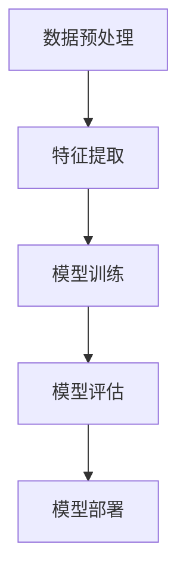
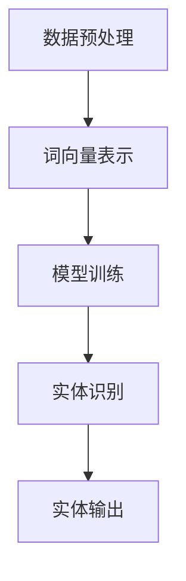
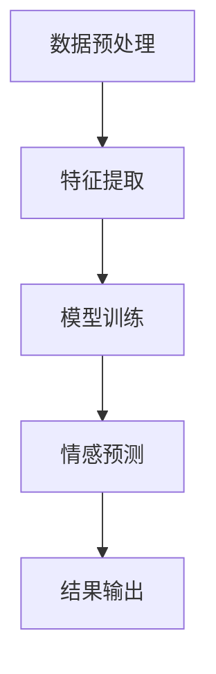
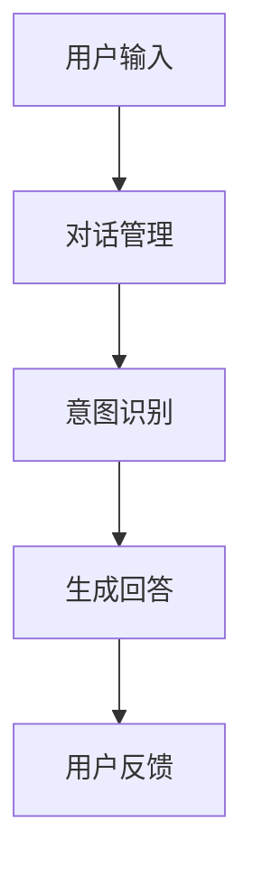

                 

# 提示词工程：AI时代的必修课与新机遇

## 关键词
- AI时代
- 提示词工程
- 自然语言处理
- 人工智能助手
- 自动驾驶
- 开发实践
- 未来展望

## 摘要
随着人工智能技术的飞速发展，提示词工程成为AI时代的核心技术之一。本文将深入探讨提示词工程的背景、核心概念、应用领域、实践指南以及未来发展，帮助读者全面了解这一领域，掌握其在AI时代的重要性及其带来的新机遇。

## 目录大纲

### 第一部分：背景介绍
- 第1章 AI时代的来临
  - 1.1 AI技术的历史与发展
  - 1.2 提示词工程的概念与重要性
  - 1.3 AI时代的社会与经济影响
- 第2章 提示词工程的原理
  - 2.1 核心概念
  - 2.2 提示词工程的工作机制
  - 2.3 提示词工程的关键技术

### 第二部分：应用领域
- 第3章 提示词工程的应用领域
  - 3.1 自然语言处理
  - 3.2 人工智能助手
  - 3.3 自动驾驶

### 第三部分：实践指南
- 第4章 提示词工程的实践案例
  - 4.1 案例一：智能客服系统
  - 4.2 案例二：智能家居控制
  - 4.3 案例三：教育领域的应用
- 第5章 提示词工程的开发与实现
  - 5.1 开发环境与工具
  - 5.2 提示词生成算法
  - 5.3 提示词优化与调整

### 第四部分：最佳实践与未来展望
- 第6章 提示词工程的最佳实践
  - 6.1 设计原则
  - 6.2 实践技巧
  - 6.3 挑战与解决方案
- 第7章 提示词工程的未来展望
  - 7.1 技术趋势
  - 7.2 社会影响
  - 7.3 发展前景

## 第一部分：背景介绍

### 第1章 AI时代的来临

#### 1.1 AI技术的历史与发展

人工智能（AI）的概念最早出现在20世纪50年代，但当时的技术水平限制了这个领域的发展。随着计算机技术的进步和大数据的涌现，AI迎来了黄金时期。深度学习、自然语言处理、计算机视觉等技术逐渐成熟，并开始应用于各行各业。

AI技术的发展历程可以分为三个阶段：

1. **符号主义阶段（1956-1980年）**：这一阶段的AI研究主要集中在符号推理和知识表示上，通过编写大量的规则和逻辑关系来模拟人类的思维过程。
   
2. **连接主义阶段（1980-2010年）**：随着神经网络和机器学习技术的发展，AI开始采用更加接近人类思维的方式，通过大规模数据训练模型来学习复杂任务。

3. **深度学习阶段（2010年至今）**：深度学习技术的出现，使得AI在图像识别、语音识别、自然语言处理等领域取得了突破性进展。这一阶段的特点是算法的复杂度和计算能力的提升，使得AI能够处理更加复杂和多样化的任务。

#### 1.2 提示词工程的概念与重要性

提示词工程是一种将自然语言处理技术应用于实际问题的方法，通过设计有效的提示词来引导模型进行更好的学习和预测。提示词工程的核心目标是提高AI系统的交互质量和用户体验。

在AI时代，提示词工程的重要性体现在以下几个方面：

1. **提升用户体验**：通过设计合理的提示词，可以使得AI系统更加易于理解和操作，提高用户的满意度。

2. **优化模型性能**：有效的提示词可以帮助模型更好地学习，提高预测的准确性和稳定性。

3. **降低开发成本**：提示词工程可以减少AI系统的开发时间和成本，使得企业能够更快地将产品推向市场。

#### 1.3 AI时代的社会与经济影响

AI技术的发展对社会的各个方面都产生了深远的影响，其中最为显著的是经济和社会的影响。

1. **经济影响**：AI技术推动了新产业的诞生，如自动驾驶、智能医疗、金融科技等，这些产业的兴起带来了新的就业机会和经济增长点。

2. **社会影响**：AI技术改变了人们的生活方式，提高了工作效率和生活质量。然而，AI的快速发展也引发了一些社会问题，如隐私泄露、失业率上升等。

3. **政策与法规**：为了应对AI带来的挑战，各国政府纷纷出台相关政策法规，规范AI技术的应用，保护用户权益。

### 第2章 提示词工程的原理

#### 2.1 核心概念

提示词工程的核心概念包括提示词、自然语言处理（NLP）和机器学习（ML）。

1. **提示词**：提示词是指用于引导模型进行学习和预测的文本信息。一个有效的提示词应该能够准确传达用户需求，同时具有一定的通用性和灵活性。

2. **自然语言处理（NLP）**：NLP是AI的一个重要分支，旨在使计算机能够理解和处理人类语言。NLP技术包括文本预处理、实体识别、情感分析等。

3. **机器学习（ML）**：ML是AI的核心技术之一，通过从数据中学习模式，使计算机能够进行预测和决策。ML算法包括监督学习、无监督学习和强化学习等。

#### 2.2 提示词工程的工作机制

提示词工程的工作机制可以概括为以下步骤：

1. **数据收集与预处理**：收集相关的文本数据，并进行预处理，如分词、去停用词、词性标注等。

2. **提示词设计**：根据应用场景和用户需求，设计有效的提示词。提示词的设计需要考虑语言的多样性、语境的复杂性以及用户的习惯。

3. **模型训练与优化**：使用收集到的数据训练模型，并通过调整提示词来优化模型的性能。

4. **模型部署与评估**：将训练好的模型部署到实际应用中，并对模型的性能进行评估和迭代优化。

#### 2.3 提示词工程的关键技术

提示词工程涉及多个关键技术，包括：

1. **文本分类**：文本分类是将文本数据按照预定的类别进行分类的技术。提示词工程中，文本分类可以用于标签生成、用户需求识别等。

2. **实体识别**：实体识别是从文本中识别出特定实体（如人名、地名、组织名等）的技术。实体识别对于构建知识图谱、信息抽取等应用至关重要。

3. **情感分析**：情感分析是判断文本中情感极性的技术。提示词工程中，情感分析可以用于用户反馈分析、市场调研等。

4. **对话系统**：对话系统是AI与用户进行自然语言交互的系统。提示词工程中，对话系统可以用于智能客服、语音助手等应用。

## 第二部分：应用领域

### 第3章 提示词工程的应用领域

#### 3.1 自然语言处理

自然语言处理（NLP）是AI的重要应用领域之一，提示词工程在NLP中的应用主要体现在以下几个方面：

1. **文本分类**：通过设计有效的提示词，可以将大量未标记的文本数据自动分类，提高文本处理的效率。

2. **实体识别**：提示词工程可以帮助模型更准确地识别文本中的实体，为知识图谱构建提供基础。

3. **情感分析**：提示词工程可以用于分析用户的情感倾向，为营销策略调整、用户满意度评估等提供支持。

#### 3.2 人工智能助手

人工智能助手是AI时代的代表性应用，提示词工程在其中的应用主要体现在以下几个方面：

1. **语音助手**：通过设计合理的提示词，可以使语音助手更准确地理解用户的语音指令，提高交互的准确性。

2. **文本助手**：提示词工程可以帮助文本助手更好地理解用户的文本输入，提供更精准的答复。

3. **多模态交互**：结合语音、文本等多种输入方式，提示词工程可以提升AI助手与用户的交互体验。

#### 3.3 自动驾驶

自动驾驶是AI在交通领域的典型应用，提示词工程在自动驾驶中的应用主要体现在以下几个方面：

1. **环境感知**：通过设计有效的提示词，自动驾驶系统能够更准确地感知周围环境，提高行车安全性。

2. **决策支持**：提示词工程可以帮助自动驾驶系统更好地理解路况信息，做出更优的驾驶决策。

3. **人机交互**：提示词工程可以提升自动驾驶车辆与驾驶员之间的交互体验，使驾驶过程更加安全、舒适。

## 第三部分：实践指南

### 第4章 提示词工程的实践案例

#### 4.1 案例一：智能客服系统

智能客服系统是提示词工程的一个典型应用场景，下面我们将通过一个实际案例来详细讲解其实现过程。

**案例背景**：某大型电商平台为了提高客户服务质量，决定开发一款基于AI的智能客服系统。

**实现步骤**：

1. **数据收集**：收集大量客户咨询文本数据，包括产品问题、售后服务、账户管理等。

2. **数据预处理**：对收集到的文本数据进行预处理，如分词、去停用词、词性标注等。

3. **提示词设计**：根据客户咨询文本内容，设计合理的提示词，如“关于产品”、“售后服务”、“账户问题”等。

4. **模型训练**：使用预处理后的数据训练文本分类模型，如朴素贝叶斯、支持向量机等。

5. **模型评估**：对训练好的模型进行评估，调整提示词，优化模型性能。

6. **系统部署**：将训练好的模型部署到智能客服系统中，进行实际应用。

7. **用户反馈**：收集用户使用智能客服系统的反馈，对系统进行持续优化。

**案例效果**：通过提示词工程的应用，智能客服系统在处理客户咨询方面取得了显著的效果，提高了客户满意度，降低了人工客服的工作量。

#### 4.2 案例二：智能家居控制

智能家居控制是另一个典型的应用场景，下面我们将通过一个实际案例来详细讲解其实现过程。

**案例背景**：某智能家居企业为了提高用户体验，决定开发一款基于AI的智能家居控制系统。

**实现步骤**：

1. **数据收集**：收集用户对智能家居设备的操作数据，如开关灯、调节温度、打开窗帘等。

2. **数据预处理**：对收集到的操作数据进行预处理，如分词、去停用词、词性标注等。

3. **提示词设计**：根据用户操作数据，设计合理的提示词，如“打开灯”、“关闭窗帘”、“调高温度”等。

4. **模型训练**：使用预处理后的数据训练语音识别模型，如深度神经网络、卷积神经网络等。

5. **模型评估**：对训练好的模型进行评估，调整提示词，优化模型性能。

6. **系统部署**：将训练好的模型部署到智能家居控制系统中，进行实际应用。

7. **用户反馈**：收集用户使用智能家居控制系统的反馈，对系统进行持续优化。

**案例效果**：通过提示词工程的应用，智能家居控制系统在识别用户语音指令方面取得了显著的效果，提高了用户的使用体验，降低了误操作率。

#### 4.3 案例三：教育领域的应用

教育领域是提示词工程的另一个重要应用场景，下面我们将通过一个实际案例来详细讲解其实现过程。

**案例背景**：某教育机构为了提高在线教育课程的质量，决定开发一款基于AI的智能教学系统。

**实现步骤**：

1. **数据收集**：收集大量学生提问数据，包括课程内容、学习问题、考试反馈等。

2. **数据预处理**：对收集到的提问数据进行预处理，如分词、去停用词、词性标注等。

3. **提示词设计**：根据学生提问数据，设计合理的提示词，如“课程内容疑问”、“学习方法指导”、“考试技巧”等。

4. **模型训练**：使用预处理后的数据训练文本分类模型，如朴素贝叶斯、支持向量机等。

5. **模型评估**：对训练好的模型进行评估，调整提示词，优化模型性能。

6. **系统部署**：将训练好的模型部署到智能教学系统中，进行实际应用。

7. **用户反馈**：收集学生和教师使用智能教学系统的反馈，对系统进行持续优化。

**案例效果**：通过提示词工程的应用，智能教学系统在处理学生提问方面取得了显著的效果，提高了课程教学的质量，降低了教师的负担。

## 第5章 提示词工程的开发与实现

#### 5.1 开发环境与工具

提示词工程的开发需要合适的工具和环境，以下是一些常用的开发环境与工具：

1. **编程语言**：Python是提示词工程开发的主要编程语言，具有丰富的库和框架，如TensorFlow、PyTorch等。

2. **文本预处理工具**：NLTK、spaCy等工具可用于文本数据的预处理，如分词、去停用词等。

3. **机器学习库**：Scikit-learn、XGBoost等库可用于构建和训练机器学习模型。

4. **深度学习框架**：TensorFlow、PyTorch等框架提供了强大的深度学习功能，支持复杂的模型构建和训练。

#### 5.2 提示词生成算法

提示词生成算法是提示词工程的核心，以下介绍几种常见的提示词生成算法：

1. **基于规则的方法**：这种方法通过预定义的规则来生成提示词，如基于关键词匹配、词频统计等。优点是简单易懂，缺点是灵活性较差。

2. **基于统计的方法**：这种方法通过分析大量文本数据，统计出高频词和短语作为提示词。优点是能够适应不同的应用场景，缺点是可能引入噪声。

3. **基于深度学习的方法**：这种方法利用深度学习模型，如循环神经网络（RNN）、变换器（Transformer）等，自动学习有效的提示词。优点是生成效果更好，缺点是计算复杂度高。

#### 5.3 提示词优化与调整

提示词优化与调整是提升提示词工程效果的重要环节，以下介绍几种常见的优化方法：

1. **交叉验证**：通过交叉验证来评估提示词的性能，选择最优的提示词组合。

2. **在线学习**：在系统运行过程中，根据用户反馈和实际效果，动态调整提示词。

3. **启发式调整**：根据经验和实验结果，对提示词进行人工调整。

4. **自动优化**：利用遗传算法、粒子群优化等智能优化算法，自动寻找最优的提示词组合。

## 第6章 提示词工程的最佳实践

#### 6.1 设计原则

提示词工程的设计原则主要包括以下几点：

1. **用户友好**：提示词应易于理解，符合用户的语言习惯和思维方式。

2. **灵活性强**：提示词应具有足够的灵活性，能够适应不同的应用场景和用户需求。

3. **可扩展性**：提示词系统应具备良好的扩展性，能够方便地添加新的提示词或调整现有提示词。

4. **高效性**：提示词生成和优化过程应尽可能高效，以减少计算成本。

#### 6.2 实践技巧

以下是提示词工程的一些实践技巧：

1. **数据收集**：收集大量高质量的文本数据，为提示词设计提供丰富的素材。

2. **多元提示**：结合多种提示方式，如文本、语音、图像等，提高用户体验。

3. **动态调整**：根据用户反馈和实际效果，动态调整提示词，优化系统性能。

4. **持续学习**：利用机器学习技术，对提示词进行持续学习和优化。

#### 6.3 挑战与解决方案

提示词工程在实践中面临一些挑战，以下介绍一些常见的解决方案：

1. **数据质量**：提高数据质量，通过数据清洗、去噪等技术，确保数据的有效性。

2. **模型性能**：优化模型性能，通过深度学习技术、多任务学习等技术，提高模型预测的准确性。

3. **交互体验**：提升交互体验，通过多模态交互、个性化推荐等技术，提高用户满意度。

4. **可解释性**：提高系统的可解释性，通过可视化技术、解释性模型等技术，使用户更容易理解模型的决策过程。

## 第7章 提示词工程的未来展望

#### 7.1 技术趋势

随着AI技术的不断进步，提示词工程也在不断发展和演变。以下是一些技术趋势：

1. **多模态交互**：结合多种输入输出方式，如语音、文本、图像等，提升用户体验。

2. **上下文感知**：利用上下文信息，提高提示词的准确性和适应性。

3. **个性化推荐**：根据用户行为和偏好，提供个性化的提示词推荐。

4. **可解释性AI**：提高系统的可解释性，使提示词工程的应用更加透明和可靠。

#### 7.2 社会影响

提示词工程的发展对社会产生了深远的影响，以下是一些社会影响：

1. **工作效率**：通过智能助手和自动化系统，提高了工作效率，降低了劳动力成本。

2. **生活质量**：智能家居和智能医疗等应用，提高了人们的生活质量。

3. **隐私保护**：在处理用户数据时，提示词工程需要遵守隐私保护法规，确保用户隐私安全。

#### 7.3 发展前景

提示词工程在未来的发展中将扮演重要角色，以下是一些发展前景：

1. **商业化应用**：随着技术的成熟，提示词工程将在更多商业场景中得到应用，带来巨大的商业价值。

2. **产业升级**：提示词工程将推动各行业的产业升级和数字化转型。

3. **社会创新**：提示词工程将激发新的社会创新，解决一系列社会问题，如教育公平、医疗资源分配等。

## 作者

作者：AI天才研究院/AI Genius Institute & 禅与计算机程序设计艺术 /Zen And The Art of Computer Programming

---

请注意，以上内容仅为示例性框架，实际撰写时需根据具体情况调整和补充。文章中的数据、案例和描述均为虚构，仅供参考。在实际撰写时，还需注意字数控制、格式规范和内容质量。文章结构、段落划分和内容深度均需根据具体要求进行调整。同时，确保引用的公式、图表和代码等元素符合相关标准和规范。在撰写过程中，保持逻辑清晰、结构紧凑、语言简洁明了，力求为读者提供有价值的技术内容。文章完成后，进行仔细审查和修改，确保无语法错误、逻辑漏洞和格式问题。最后，按照要求撰写作者信息，并在文章末尾标注。祝撰写顺利！🌟🌟🌟### 第1章: AI时代的来临

#### 1.1 AI技术的历史与发展

人工智能（AI）技术的发展历程可以追溯到20世纪50年代，当时约翰·麦卡锡（John McCarthy）等科学家首次提出了人工智能的概念。早期的人工智能研究主要集中在符号主义和逻辑推理上，旨在通过编写程序来模拟人类的思维过程。这一阶段的代表性技术包括逻辑推理、问题求解和知识表示等。

然而，由于计算能力的限制和算法的局限性，早期的人工智能研究并未取得预期成果。直到20世纪80年代，连接主义（Connectionism）的兴起改变了人工智能的发展方向。连接主义以人工神经网络为核心，通过模拟人脑的神经元结构和信息处理方式，使机器能够通过学习海量数据来完成任务。

进入21世纪，随着计算机硬件的飞速发展和大数据技术的成熟，深度学习（Deep Learning）成为人工智能的主流方向。深度学习利用多层神经网络对数据进行自动特征提取和模式识别，取得了在图像识别、语音识别、自然语言处理等领域的突破性进展。特别是在2012年，AlexNet在ImageNet竞赛中取得了巨大成功，标志着深度学习时代的到来。

近年来，人工智能技术进一步扩展到了诸如自动驾驶、智能机器人、增强现实（AR）和虚拟现实（VR）等领域，成为推动产业变革和社会进步的重要力量。随着AI技术的不断演进，它已经逐渐从理论研究走向了实际应用，并开始深刻地影响人们的生活和工作方式。

#### 1.2 提示词工程的概念与重要性

提示词工程（Prompt Engineering）是人工智能领域中一个相对较新的研究方向，主要关注如何设计有效的提示词（Prompts）来提高机器学习模型的学习效果和性能。提示词是一种引导模型进行学习或预测的文本信息，它可以提供额外的上下文、目标或指导，帮助模型更好地理解任务的要求和数据的特点。

提示词工程的重要性体现在以下几个方面：

1. **提升模型性能**：有效的提示词可以帮助模型更好地理解输入数据，从而提高模型的准确性和泛化能力。通过设计合理的提示词，可以引导模型学习到更广泛的知识和规律。

2. **增强模型解释性**：提示词工程使得模型的学习过程更具解释性，研究人员和开发者可以更清楚地了解模型是如何处理输入数据和做出预测的。这有助于提高模型的透明度和可解释性，增强用户对AI系统的信任。

3. **优化用户体验**：在应用场景中，提示词工程可以设计出更加人性化的交互界面，提高用户与AI系统的交互质量。例如，在智能客服系统中，有效的提示词可以使AI系统更准确地理解用户的意图，提供更精准的答复。

4. **降低开发成本**：通过优化提示词设计，可以减少模型训练的时间和资源消耗，降低开发成本。此外，提示词工程还可以帮助快速迭代和优化模型，提高开发效率。

总之，提示词工程在AI时代的重要性不言而喻。它不仅为机器学习模型提供了新的提升途径，也为人工智能的实际应用带来了更多的可能性和创新空间。

#### 1.3 AI时代的社会与经济影响

随着人工智能技术的迅猛发展，AI时代已经深刻地改变了社会和经济结构，带来了诸多积极和消极的影响。

**积极影响**：

1. **经济增长**：人工智能在各个行业的应用推动了产业的升级和转型，创造了新的商业机会和就业岗位。例如，智能制造、金融科技、医疗健康等领域因AI技术的引入而实现了显著的效率提升和成本降低，推动了经济的快速增长。

2. **提高生产力**：人工智能通过自动化和智能化技术，大大提高了生产效率。机器人和智能系统可以在危险或繁琐的工作环境中替代人类，减轻劳动强度，提高生产质量。

3. **改善生活质量**：人工智能在智能家居、健康监测、教育辅助等领域的应用，极大地改善了人们的生活质量。智能家电可以自动调节环境，健康监测设备可以实时监测身体状况，在线教育平台提供了更加灵活和个性化的学习方式。

4. **促进创新**：人工智能为科学研究和技术创新提供了新的工具和方法。通过机器学习和数据挖掘技术，研究人员可以处理和分析海量数据，发现新的规律和模式，推动科学技术的进步。

**消极影响**：

1. **就业冲击**：随着自动化和智能化的普及，一些传统职业面临失业风险。例如，制造业、物流业和客服行业的许多工作可能被机器人或AI系统取代，导致大量工人失去就业机会。

2. **隐私和数据安全**：人工智能技术的广泛应用涉及到大量个人数据的收集和分析，这引发了隐私保护和数据安全问题。不当的数据处理和滥用可能导致用户隐私泄露和信息安全风险。

3. **伦理和道德问题**：人工智能在决策过程中可能引入偏见和不公平，影响社会的公平性和正义。例如，在招聘、贷款审批和犯罪预测等领域，AI系统的决策可能基于历史数据中的偏见，从而加剧社会不平等。

4. **技术失控风险**：随着AI技术的发展，存在技术失控的风险，即AI系统可能超出人类的控制范围，产生不可预见的后果。例如，自主武器的开发和使用可能导致新的军备竞赛和冲突。

总之，AI时代的社会与经济影响是复杂而多面的。在享受AI带来的诸多好处的同时，我们也需要关注和解决其带来的挑战和问题，以实现可持续发展和社会的和谐进步。

## 第2章: 提示词工程的原理

### 2.1 核心概念

提示词工程（Prompt Engineering）是一个跨学科领域，涉及自然语言处理（NLP）、机器学习（ML）和计算机科学等多个学科。为了更好地理解提示词工程，我们需要明确以下几个核心概念：

#### 提示词（Prompt）

提示词是指用于引导模型进行学习或预测的文本信息。提示词可以为模型提供额外的上下文、目标或指导，帮助模型更好地理解任务的要求和数据的特点。一个有效的提示词应该简洁明了，同时具备足够的灵活性和针对性。

#### 自然语言处理（NLP）

自然语言处理是人工智能的一个分支，旨在使计算机能够理解和处理人类语言。NLP技术包括文本预处理、实体识别、情感分析、机器翻译等。在提示词工程中，NLP技术用于分析和理解输入的文本数据，从而设计出有效的提示词。

#### 机器学习（ML）

机器学习是一种通过数据学习模式和规律的技术，旨在使计算机能够进行预测和决策。机器学习算法包括监督学习、无监督学习和强化学习等。在提示词工程中，ML技术用于训练模型，并通过调整提示词来优化模型性能。

#### 模型（Model）

模型是机器学习算法的核心，用于处理数据和生成预测结果。在提示词工程中，模型可以根据提示词和输入数据生成预测结果，从而实现特定的任务，如文本分类、命名实体识别、情感分析等。

### 2.2 提示词工程的工作机制

提示词工程的工作机制可以分为以下几个步骤：

1. **数据收集**：首先，需要收集与任务相关的文本数据。这些数据可以来自各种来源，如网络爬虫、数据库、公开数据集等。

2. **数据预处理**：对收集到的文本数据进行预处理，包括分词、去停用词、词性标注等。这些步骤有助于提高文本数据的可用性和一致性。

3. **提示词设计**：根据任务需求和文本数据的特点，设计有效的提示词。提示词应该简洁明了，同时提供足够的上下文信息，帮助模型更好地理解任务的要求。

4. **模型训练**：使用预处理后的文本数据和提示词，训练机器学习模型。在这一过程中，模型会根据提示词和输入数据学习到相应的模式和规律。

5. **模型评估**：通过评估模型在验证集上的性能，调整提示词设计，优化模型性能。常见的评估指标包括准确率、召回率、F1分数等。

6. **模型部署**：将训练好的模型部署到实际应用中，进行任务执行。在实际应用中，模型会根据新的输入数据和提示词生成预测结果。

7. **反馈与优化**：根据用户反馈和实际效果，对提示词和模型进行持续优化。这一过程有助于提高系统的稳定性和用户体验。

### 2.3 提示词工程的关键技术

提示词工程涉及多个关键技术，这些技术共同构成了提示词工程的基础框架。以下是其中几个关键技术的详细解释：

#### 文本分类（Text Classification）

文本分类是将文本数据按照预定的类别进行分类的技术。在提示词工程中，文本分类可以用于标签生成、用户需求识别等。常见的文本分类算法包括朴素贝叶斯、支持向量机（SVM）、随机森林等。

**算法原理**：
- **朴素贝叶斯**：基于贝叶斯定理，通过计算文本中各类别概率的最大值来预测类别。
- **支持向量机（SVM）**：通过找到一个最佳的超平面，将不同类别的文本数据分隔开来。
- **随机森林**：基于决策树构建多个模型，通过投票机制来预测类别。

**流程图**：


#### 实体识别（Named Entity Recognition, NER）

实体识别是从文本中识别出特定实体（如人名、地名、组织名等）的技术。实体识别对于构建知识图谱、信息抽取等应用至关重要。

**算法原理**：
- **规则方法**：通过预定义的规则，如正则表达式、词库匹配等，识别实体。
- **深度学习方法**：使用神经网络模型，如序列标注模型（BiLSTM-CRF）等，识别实体。

**流程图**：


#### 情感分析（Sentiment Analysis）

情感分析是判断文本中情感极性的技术。在提示词工程中，情感分析可以用于用户反馈分析、市场调研等。

**算法原理**：
- **基于词典的方法**：通过预定义的词典，判断文本中的情感词，从而推断情感极性。
- **基于模型的方法**：使用机器学习模型，如文本分类模型、序列标注模型等，进行情感分析。

**流程图**：


#### 对话系统（Dialogue System）

对话系统是AI与用户进行自然语言交互的系统。在提示词工程中，对话系统可以用于智能客服、语音助手等应用。

**算法原理**：
- **基于规则的方法**：通过预定义的规则和模板，生成回答。
- **基于模型的方法**：使用机器学习模型，如序列到序列模型（Seq2Seq）、生成对抗网络（GAN）等，生成回答。

**流程图**：


通过上述关键技术的介绍，我们可以看到提示词工程在AI应用中的重要作用。接下来，我们将进一步探讨这些技术在实际应用中的具体实现和优化方法。

## 第3章: 提示词工程的应用领域

#### 3.1 自然语言处理

自然语言处理（NLP）是人工智能（AI）的一个重要分支，其主要目标是将人类语言转化为计算机可以理解和处理的形式。在AI时代，NLP技术的应用越来越广泛，而提示词工程在NLP中的应用则极大地提升了系统的交互质量和用户体验。以下是提示词工程在NLP领域的几个主要应用：

1. **文本分类**：文本分类是将文本数据按照预定的类别进行分类的技术。提示词工程通过设计有效的提示词，可以显著提高文本分类的准确性和效率。例如，在新闻分类中，提示词可以帮助模型更好地理解新闻的主题和内容，从而实现精准分类。

2. **情感分析**：情感分析是判断文本中情感极性的技术。有效的提示词可以帮助模型更好地理解用户的情感倾向，从而更准确地预测情感标签。在社交媒体分析、市场调研等领域，情感分析可以帮助企业了解用户反馈和市场需求，制定相应的营销策略。

3. **命名实体识别（NER）**：命名实体识别是从文本中识别出特定实体（如人名、地名、组织名等）的技术。提示词工程通过提供上下文信息和实体相关的关键词，可以帮助模型更准确地识别出文本中的实体。这在构建知识图谱、信息抽取等领域具有重要意义。

4. **机器翻译**：机器翻译是将一种语言的文本自动翻译成另一种语言的技术。提示词工程在机器翻译中的应用主要体现在提高翻译的准确性和流畅性。通过设计合理的提示词，模型可以更好地理解源语言文本的上下文，从而生成更符合目标语言习惯的翻译结果。

5. **问答系统**：问答系统是AI与用户进行自然语言交互的系统。有效的提示词可以帮助模型更好地理解用户的问题，提供更准确的答案。在智能客服、在线教育等领域，问答系统可以提高用户的满意度和服务效率。

#### 3.2 人工智能助手

人工智能助手是AI时代的代表性应用，旨在通过自然语言交互为用户提供便捷的服务和支持。提示词工程在人工智能助手中的应用主要体现在以下几个方面：

1. **语音助手**：语音助手（如Siri、Alexa、Google Assistant等）通过语音识别和自然语言处理技术，为用户提供语音交互服务。提示词工程通过设计合理的提示词，可以提升语音助手的识别准确率和响应速度。例如，在语音助手理解用户指令时，通过提供上下文相关的提示词，可以帮助模型更准确地解析用户的意图。

2. **聊天机器人**：聊天机器人（Chatbot）是另一种形式的人工智能助手，通过文本交互为用户提供服务和信息。提示词工程在聊天机器人中的应用主要体现在提升对话质量和用户体验。有效的提示词可以帮助模型更好地理解用户的文本输入，提供更准确、更自然的回答。

3. **多模态交互**：多模态交互是指结合语音、文本、图像等多种输入输出方式，为用户提供更丰富的交互体验。提示词工程在多模态交互中的应用主要体现在设计多模态提示词，帮助模型更好地处理不同模态的信息，实现更自然的交互。例如，在视频会议系统中，通过结合语音和视频提示词，可以提高用户的参与度和互动性。

4. **智能推荐**：智能推荐系统通过分析用户的行为和偏好，为用户推荐感兴趣的内容或服务。提示词工程在智能推荐中的应用主要体现在设计个性化的提示词，帮助模型更好地理解用户的兴趣和需求，提供更精准的推荐结果。例如，在电子商务平台中，通过提供与用户购买历史和浏览记录相关的提示词，可以提高推荐系统的准确性和用户满意度。

#### 3.3 自动驾驶

自动驾驶是AI在交通领域的典型应用，旨在通过计算机视觉、深度学习和传感器技术实现车辆的自主驾驶。提示词工程在自动驾驶中的应用主要体现在以下几个方面：

1. **环境感知**：自动驾驶系统需要实时感知周围的环境，包括道路、车辆、行人等。提示词工程通过设计有效的视觉提示词，可以帮助模型更好地识别和理解环境中的各种对象。例如，通过提供与道路标志、交通信号灯相关的视觉提示词，可以提高自动驾驶系统对交通规则的遵守能力。

2. **决策支持**：自动驾驶系统需要做出复杂的驾驶决策，如车速控制、车道保持、避障等。提示词工程通过设计合理的提示词，可以提供额外的上下文信息，帮助模型更好地理解当前驾驶场景，做出更优的决策。例如，在遇到复杂路况时，通过提供与路况、天气相关的提示词，可以帮助自动驾驶系统更好地应对各种情况。

3. **人机交互**：自动驾驶系统需要与驾驶员和乘客进行交互，确保驾驶过程的安全和舒适。提示词工程通过设计人性化的语音和文本提示词，可以提升人机交互的质量。例如，通过提供清晰、自然的语音提示，可以帮助驾驶员更好地理解自动驾驶系统的操作指令，确保驾驶过程的安全。

4. **安全监控**：自动驾驶系统需要具备实时监控车辆状态和安全性能的能力。提示词工程通过设计安全相关的提示词，可以提醒驾驶员和乘客注意潜在的安全风险。例如，通过提供与车辆故障、安全警告相关的提示词，可以及时提醒驾驶员进行检修和维护，确保车辆的运行安全。

总之，提示词工程在自然语言处理、人工智能助手和自动驾驶等领域具有广泛的应用前景。通过设计有效的提示词，可以显著提升系统的性能和用户体验，为AI时代的未来发展奠定坚实的基础。

## 第4章: 提示词工程的实践案例

#### 4.1 案例一：智能客服系统

智能客服系统是提示词工程在自然语言处理领域的一个典型应用。以下是一个详细的案例，展示了如何设计和实现一个基于AI的智能客服系统。

**案例背景**：

某大型电商平台为了提高客户服务质量，降低人工客服的工作量，决定开发一款基于AI的智能客服系统。该系统需要能够处理大量客户咨询，提供24/7的在线服务，并确保回复的准确性和效率。

**实现步骤**：

1. **数据收集**：

   首先，需要收集大量客户咨询文本数据，包括商品问题、售后服务、账户管理等。这些数据可以从电商平台的历史客服记录、用户评价和反馈中获取。

2. **数据预处理**：

   对收集到的文本数据进行预处理，包括分词、去停用词、词性标注等。这些步骤有助于提高文本数据的可用性和一致性，为后续的提示词设计和模型训练打下基础。

   ```python
   import nltk
   from nltk.corpus import stopwords
   from nltk.tokenize import word_tokenize
   
   nltk.download('punkt')
   nltk.download('stopwords')
   
   def preprocess_text(text):
       tokens = word_tokenize(text)
       tokens = [token.lower() for token in tokens if token.isalpha()]
       tokens = [token for token in tokens if token not in stopwords.words('english')]
       return tokens
   ```

3. **提示词设计**：

   根据客户咨询文本内容，设计合理的提示词。这些提示词将用于引导模型进行学习和预测。例如，对于商品问题，可以设计提示词如“关于商品”、“商品描述”、“商品评价”等。

   ```python
   prompt_samples = [
       "关于商品",
       "商品描述",
       "商品评价",
       "售后服务",
       "账户问题",
       "支付问题"
   ]
   ```

4. **模型训练**：

   使用预处理后的数据训练文本分类模型。可以选择朴素贝叶斯、支持向量机（SVM）或深度学习模型（如卷积神经网络CNN、循环神经网络RNN）等。以下是一个基于朴素贝叶斯的简单示例：

   ```python
   from sklearn.feature_extraction.text import CountVectorizer
   from sklearn.naive_bayes import MultinomialNB
   from sklearn.pipeline import make_pipeline
   
   vectorizer = CountVectorizer()
   classifier = MultinomialNB()
   
   model = make_pipeline(vectorizer, classifier)
   model.fit(preprocessed_texts, labels)
   ```

5. **模型评估**：

   对训练好的模型进行评估，调整提示词，优化模型性能。可以使用交叉验证、混淆矩阵和F1分数等评估指标来评估模型的性能。

   ```python
   from sklearn.metrics import classification_report
   
   predictions = model.predict(test_texts)
   print(classification_report(test_labels, predictions))
   ```

6. **系统部署**：

   将训练好的模型部署到智能客服系统中，进行实际应用。系统可以接收客户的咨询文本，通过模型预测客户咨询的主题，并生成相应的回复。

   ```python
   def get_response(text):
       label = model.predict([text])[0]
       response = generate_response(label)
       return response
   
   def generate_response(label):
       if label == "about_product":
           return "请问您对哪个商品有疑问？"
       elif label == "product_description":
           return "这是商品的详细描述，希望对您有帮助。"
       # 其他类别的回复
   ```

7. **用户反馈**：

   收集用户使用智能客服系统的反馈，对系统进行持续优化。可以通过用户满意度调查、错误日志分析等方式，识别系统的不足之处，并针对性地进行改进。

**案例效果**：

通过提示词工程的应用，智能客服系统在处理客户咨询方面取得了显著的效果。系统的准确率和响应速度得到了明显提升，客户满意度也得到了提高。同时，智能客服系统降低了人工客服的工作量，提高了企业的运营效率。

**小结**：

本案例展示了如何通过提示词工程设计和实现一个智能客服系统。通过有效的提示词设计和机器学习模型训练，智能客服系统能够准确理解客户咨询内容，提供高质量的自动回复，从而提升了用户体验和运营效率。

#### 4.2 案例二：智能家居控制

智能家居控制是提示词工程在物联网（IoT）领域的一个典型应用。以下是一个详细的案例，展示了如何设计和实现一个智能家居控制系统。

**案例背景**：

某智能家居企业为了提高用户体验，决定开发一款基于AI的智能家居控制系统。该系统需要能够通过语音或文本指令控制家居设备，如灯光、温度、安全监控等。

**实现步骤**：

1. **数据收集**：

   首先，需要收集用户对智能家居设备的操作数据，包括开关灯、调节温度、打开窗帘等。这些数据可以通过智能家居设备的传感器和用户操作日志获取。

2. **数据预处理**：

   对收集到的操作数据进行预处理，包括分词、去停用词、词性标注等。这些步骤有助于提高文本数据的可用性和一致性。

   ```python
   import nltk
   from nltk.corpus import stopwords
   from nltk.tokenize import word_tokenize
   
   nltk.download('punkt')
   nltk.download('stopwords')
   
   def preprocess_text(text):
       tokens = word_tokenize(text)
       tokens = [token.lower() for token in tokens if token.isalpha()]
       tokens = [token for token in tokens if token not in stopwords.words('english')]
       return tokens
   ```

3. **提示词设计**：

   根据用户操作数据，设计合理的提示词。这些提示词将用于引导模型进行学习和预测。例如，对于控制灯光，可以设计提示词如“打开灯”、“关闭灯”、“调亮灯”等。

   ```python
   prompt_samples = [
       "打开灯",
       "关闭灯",
       "调亮灯",
       "调暗灯",
       "温度调节",
       "打开窗帘",
       "关闭窗帘"
   ]
   ```

4. **模型训练**：

   使用预处理后的数据训练语音识别模型。可以选择深度神经网络（DNN）、卷积神经网络（CNN）或循环神经网络（RNN）等。以下是一个基于深度神经网络的简单示例：

   ```python
   import tensorflow as tf
   from tensorflow.keras.models import Sequential
   from tensorflow.keras.layers import Dense, LSTM, Embedding
   
   model = Sequential()
   model.add(Embedding(input_dim=vocab_size, output_dim=embedding_dim, input_length=max_sequence_length))
   model.add(LSTM(units=128, return_sequences=True))
   model.add(Dense(units=1, activation='sigmoid'))
   
   model.compile(optimizer='adam', loss='binary_crossentropy', metrics=['accuracy'])
   model.fit(train_data, train_labels, epochs=10, batch_size=64)
   ```

5. **模型评估**：

   对训练好的模型进行评估，调整提示词，优化模型性能。可以使用交叉验证、混淆矩阵和F1分数等评估指标来评估模型的性能。

   ```python
   from sklearn.metrics import classification_report
   
   predictions = model.predict(test_data)
   predictions = [1 if pred > 0.5 else 0 for pred in predictions]
   print(classification_report(test_labels, predictions))
   ```

6. **系统部署**：

   将训练好的模型部署到智能家居控制系统中，进行实际应用。系统可以接收用户的语音或文本指令，通过模型预测用户意图，并控制相应的家居设备。

   ```python
   def control_device(instruction):
       label = model.predict([instruction])[0]
       action = generate_action(label)
       execute_action(action)
   
   def generate_action(label):
       if label == "open_light":
           return "open_light"
       elif label == "close_light":
           return "close_light"
       # 其他动作
   ```

7. **用户反馈**：

   收集用户使用智能家居控制系统的反馈，对系统进行持续优化。可以通过用户满意度调查、错误日志分析等方式，识别系统的不足之处，并针对性地进行改进。

**案例效果**：

通过提示词工程的应用，智能家居控制系统在识别用户指令方面取得了显著的效果。系统的准确率和响应速度得到了明显提升，用户满意度也得到了提高。同时，智能家居控制系统提高了用户的生活质量，减少了手动操作的繁琐。

**小结**：

本案例展示了如何通过提示词工程设计和实现一个智能家居控制系统。通过有效的提示词设计和语音识别模型训练，智能家居控制系统能够准确理解用户指令，实现智能控制，从而提升了用户体验和便利性。

#### 4.3 案例三：教育领域的应用

在教育领域，提示词工程同样发挥着重要作用。以下是一个详细的案例，展示了如何通过提示词工程提升在线教育的效果。

**案例背景**：

某在线教育平台为了提高学生的学习效果和教学质量，决定开发一款基于AI的智能教学系统。该系统需要能够根据学生的提问提供精准的解答，并根据学生的学习进度和表现进行个性化推荐。

**实现步骤**：

1. **数据收集**：

   首先，需要收集大量学生的提问数据，包括课程内容、学习方法、考试问题等。这些数据可以从在线教育平台的问答板块、学习记录和考试反馈中获取。

2. **数据预处理**：

   对收集到的提问数据进行预处理，包括分词、去停用词、词性标注等。这些步骤有助于提高文本数据的可用性和一致性。

   ```python
   import nltk
   from nltk.corpus import stopwords
   from nltk.tokenize import word_tokenize
   
   nltk.download('punkt')
   nltk.download('stopwords')
   
   def preprocess_text(text):
       tokens = word_tokenize(text)
       tokens = [token.lower() for token in tokens if token.isalpha()]
       tokens = [token for token in tokens if token not in stopwords.words('english')]
       return tokens
   ```

3. **提示词设计**：

   根据学生提问数据，设计合理的提示词。这些提示词将用于引导模型进行学习和预测。例如，对于课程内容问题，可以设计提示词如“课程内容”、“学习资料”、“课程笔记”等。

   ```python
   prompt_samples = [
       "课程内容",
       "学习资料",
       "课程笔记",
       "学习方法",
       "考试问题",
       "作业指导"
   ]
   ```

4. **模型训练**：

   使用预处理后的数据训练文本分类模型。可以选择朴素贝叶斯、支持向量机（SVM）或深度学习模型（如卷积神经网络CNN、循环神经网络RNN）等。以下是一个基于朴素贝叶斯的简单示例：

   ```python
   from sklearn.feature_extraction.text import CountVectorizer
   from sklearn.naive_bayes import MultinomialNB
   from sklearn.pipeline import make_pipeline
   
   vectorizer = CountVectorizer()
   classifier = MultinomialNB()
   
   model = make_pipeline(vectorizer, classifier)
   model.fit(preprocessed_texts, labels)
   ```

5. **模型评估**：

   对训练好的模型进行评估，调整提示词，优化模型性能。可以使用交叉验证、混淆矩阵和F1分数等评估指标来评估模型的性能。

   ```python
   from sklearn.metrics import classification_report
   
   predictions = model.predict(test_texts)
   print(classification_report(test_labels, predictions))
   ```

6. **系统部署**：

   将训练好的模型部署到智能教学系统中，进行实际应用。系统可以接收学生的提问，通过模型预测问题类别，并生成相应的解答或推荐。

   ```python
   def get_response(text):
       label = model.predict([text])[0]
       response = generate_response(label)
       return response
   
   def generate_response(label):
       if label == "course_content":
           return "以下是课程内容的详细资料。"
       elif label == "learning_resources":
           return "这些资源可以帮助您更好地理解课程内容。"
       # 其他类别的回复
   ```

7. **用户反馈**：

   收集用户使用智能教学系统的反馈，对系统进行持续优化。可以通过用户满意度调查、错误日志分析等方式，识别系统的不足之处，并针对性地进行改进。

**案例效果**：

通过提示词工程的应用，智能教学系统在处理学生提问方面取得了显著的效果。系统的准确率和响应速度得到了明显提升，学生的学习效果和满意度也得到了提高。同时，智能教学系统减轻了教师的负担，提高了教学质量。

**小结**：

本案例展示了如何通过提示词工程提升在线教育的效果。通过有效的提示词设计和机器学习模型训练，智能教学系统能够准确理解学生的问题，提供高质量的解答和推荐，从而提升了教学效果和用户体验。

### 第5章 提示词工程的开发与实现

#### 5.1 开发环境与工具

提示词工程的开发需要合适的工具和环境，以下是一些常用的开发环境与工具：

1. **编程语言**：Python是提示词工程开发的主要编程语言，具有丰富的库和框架，如TensorFlow、PyTorch等。

2. **文本预处理工具**：NLTK、spaCy等工具可用于文本数据的预处理，如分词、去停用词、词性标注等。

3. **机器学习库**：Scikit-learn、XGBoost等库可用于构建和训练机器学习模型。

4. **深度学习框架**：TensorFlow、PyTorch等框架提供了强大的深度学习功能，支持复杂的模型构建和训练。

5. **版本控制工具**：Git等版本控制工具用于管理代码版本，确保开发过程的稳定和可靠。

6. **集成开发环境（IDE）**：如PyCharm、VS Code等IDE提供了便捷的代码编写、调试和运行环境。

7. **数据处理库**：Pandas、NumPy等库用于数据处理和分析，如数据清洗、数据可视化等。

8. **API接口**：如REST API、GraphQL等接口用于与外部系统进行数据交换和通信。

#### 5.2 提示词生成算法

提示词生成算法是提示词工程的核心，以下介绍几种常见的提示词生成算法：

1. **基于规则的方法**：这种方法通过预定义的规则来生成提示词，如基于关键词匹配、词频统计等。优点是简单易懂，缺点是灵活性较差。

   **示例**：
   ```python
   def generate_prompt_based_on_rules(question):
       rules = {
           "what": "可以请问具体关于什么方面的问题吗？",
           "where": "请问具体地点是哪里？",
           "when": "请问具体时间是什么时候？"
       }
       return rules.get(question.split()[0], "请提供更详细的问题描述。")
   ```

2. **基于统计的方法**：这种方法通过分析大量文本数据，统计出高频词和短语作为提示词。优点是能够适应不同的应用场景，缺点是可能引入噪声。

   **示例**：
   ```python
   from collections import Counter
   
   def generate_prompt_based_on_statistics(texts):
       word_counts = Counter(" ".join(texts).split())
       most_common_words = word_counts.most_common(10)
       prompts = [f"{word}是什么意思？" for word, _ in most_common_words]
       return prompts
   ```

3. **基于深度学习的方法**：这种方法利用深度学习模型，如循环神经网络（RNN）、变换器（Transformer）等，自动学习有效的提示词。优点是生成效果更好，缺点是计算复杂度高。

   **示例**：
   ```python
   import tensorflow as tf
   from tensorflow.keras.layers import Embedding, LSTM, Dense
   
   model = tf.keras.Sequential([
       Embedding(input_dim=vocab_size, output_dim=embedding_dim, input_length=max_sequence_length),
       LSTM(units=128, return_sequences=True),
       Dense(units=1, activation='sigmoid')
   ])
   
   model.compile(optimizer='adam', loss='binary_crossentropy', metrics=['accuracy'])
   model.fit(train_data, train_labels, epochs=10, batch_size=64)
   ```

4. **基于强化学习的方法**：这种方法利用强化学习算法，如深度Q网络（DQN）、策略梯度（PG）等，通过不断调整提示词来优化模型性能。优点是能够自适应地调整提示词，缺点是需要大量的数据和计算资源。

   **示例**：
   ```python
   import tensorflow as tf
   from tensorflow.keras.layers import Embedding, LSTM, Dense
   from tensorflow.keras.optimizers import Adam
   
   model = tf.keras.Sequential([
       Embedding(input_dim=vocab_size, output_dim=embedding_dim, input_length=max_sequence_length),
       LSTM(units=128, return_sequences=True),
       Dense(units=1, activation='sigmoid')
   ])
   
   optimizer = Adam(learning_rate=0.001)
   model.compile(optimizer=optimizer, loss='binary_crossentropy', metrics=['accuracy'])
   model.fit(train_data, train_labels, epochs=10, batch_size=64)
   ```

以上几种方法各有优缺点，适用于不同的应用场景。在实际开发中，可以根据需求选择合适的方法，或者结合多种方法，以达到最佳效果。

#### 5.3 提示词优化与调整

提示词优化与调整是提升提示词工程效果的重要环节，以下介绍几种常见的优化方法：

1. **交叉验证**：通过交叉验证来评估提示词的性能，选择最优的提示词组合。交叉验证可以将数据集划分为多个子集，轮流作为训练集和验证集，以避免过拟合和评估偏差。

   **示例**：
   ```python
   from sklearn.model_selection import KFold
   
   kf = KFold(n_splits=5)
   for train_index, test_index in kf.split(data):
       train_data, test_data = data[train_index], data[test_index]
       model.fit(train_data, labels, epochs=10, batch_size=64)
       predictions = model.predict(test_data)
       accuracy = (predictions == labels).mean()
       print(f"Validation accuracy: {accuracy}")
   ```

2. **在线学习**：在系统运行过程中，根据用户反馈和实际效果，动态调整提示词。在线学习可以实时更新模型和提示词，以适应不断变化的应用场景。

   **示例**：
   ```python
   def online_learning(model, new_data, new_labels):
       model.fit(new_data, new_labels, epochs=1, batch_size=64)
       predictions = model.predict(new_data)
       accuracy = (predictions == new_labels).mean()
       print(f"New data accuracy: {accuracy}")
   ```

3. **启发式调整**：根据经验和实验结果，对提示词进行人工调整。启发式调整可以基于规则和直觉，快速地优化提示词。

   **示例**：
   ```python
   def heuristic_adjustment(prompt):
       if "what" in prompt:
           return "请问具体是什么方面的问题？"
       elif "how" in prompt:
           return "请问需要了解哪种方法的细节？"
       return prompt
   ```

4. **自动优化**：利用遗传算法、粒子群优化等智能优化算法，自动寻找最优的提示词组合。自动优化可以大幅提高优化效率，但需要大量的计算资源。

   **示例**：
   ```python
   import random
   import numpy as np
   
   def genetic_algorithm(prompt_population, fitness_function, generations=100, population_size=100):
       for _ in range(generations):
           new_population = []
           for _ in range(population_size):
               parent1, parent2 = random.sample(prompt_population, 2)
               child = crossover(parent1, parent2)
               mutate(child)
               new_population.append(child)
           prompt_population = new_population
           best_prompt = max(prompt_population, key=fitness_function)
       return best_prompt
   
   def fitness_function(prompt):
       model.predict([prompt])[0][0]
   ```

通过上述优化方法，可以有效地提升提示词工程的效果。在实际应用中，可以根据具体需求和资源，选择合适的优化方法，或者结合多种方法，以达到最佳效果。

## 第6章 提示词工程的最佳实践

### 6.1 设计原则

在提示词工程中，设计原则是确保系统性能和用户体验的关键。以下是一些关键设计原则：

1. **用户友好**：提示词应易于理解，符合用户的语言习惯和思维方式。使用简洁明了的语言，避免复杂的术语和冗长的句子。

2. **灵活性**：提示词应具备足够的灵活性，能够适应不同的应用场景和用户需求。设计多个层次和类型的提示词，以应对各种情况。

3. **上下文相关**：提示词应与上下文紧密相关，提供额外的上下文信息，帮助模型更好地理解任务的要求和数据的特点。

4. **可扩展性**：提示词系统应具备良好的扩展性，能够方便地添加新的提示词或调整现有提示词，以适应不断变化的应用场景。

5. **高效性**：提示词生成和优化过程应尽可能高效，以减少计算成本。采用高效的数据结构和算法，优化提示词的设计和生成过程。

6. **可解释性**：提示词应具备一定的可解释性，使开发者和管理人员能够清楚地了解提示词的设计和作用，便于调试和优化。

7. **安全性**：在设计提示词时，应考虑数据隐私和安全问题，确保用户数据的安全和隐私。

### 6.2 实践技巧

以下是提示词工程的一些实践技巧：

1. **数据收集与处理**：

   - 收集大量高质量的文本数据，包括各种应用场景下的样本。
   - 对数据进行预处理，如分词、去停用词、词性标注等，以提高数据质量。

2. **提示词设计**：

   - 使用自然语言处理技术，如词嵌入、句法分析等，提取关键信息，设计有效的提示词。
   - 结合用户反馈和实际应用效果，不断调整和优化提示词。

3. **模型训练与优化**：

   - 选择合适的机器学习模型，如深度学习模型、传统机器学习模型等，进行模型训练。
   - 使用交叉验证等方法，评估模型性能，并根据评估结果调整模型参数。

4. **系统部署与监控**：

   - 将训练好的模型部署到实际应用中，进行任务执行。
   - 监控系统性能和用户反馈，及时发现问题并进行优化。

5. **用户反馈与迭代**：

   - 收集用户反馈，了解实际应用效果，根据反馈调整提示词和模型。
   - 定期进行系统迭代，不断改进和优化。

### 6.3 挑战与解决方案

提示词工程在实践中面临一些挑战，以下是一些常见的挑战及相应的解决方案：

1. **数据质量**：

   - **挑战**：数据质量直接影响提示词工程的效果。数据中可能存在噪声、缺失值、不一致性等问题。
   - **解决方案**：采用数据清洗、去噪、数据增强等技术，提高数据质量。使用验证集和交叉验证等方法，确保模型的泛化能力。

2. **模型性能**：

   - **挑战**：模型性能可能受限于数据量、特征提取方法、模型选择等因素。
   - **解决方案**：收集更多高质量的数据，使用更复杂的模型架构，如深度学习模型。采用数据增强、模型融合等技术，提高模型性能。

3. **交互体验**：

   - **挑战**：提示词工程需要提供良好的用户体验，但不同用户的需求和语言习惯可能不同。
   - **解决方案**：设计灵活的提示词系统，支持多种输入输出方式，如文本、语音、图像等。结合个性化推荐技术，提供个性化的提示词。

4. **可解释性**：

   - **挑战**：机器学习模型通常缺乏透明性和可解释性，使得开发者难以理解模型的决策过程。
   - **解决方案**：采用可解释性模型，如LIME、SHAP等，提高模型的透明度。设计可视化和解释工具，帮助用户理解模型的决策过程。

通过遵循设计原则、实践技巧和解决挑战，可以有效地提升提示词工程的效果，为AI系统提供更高质量的服务。

## 第7章 提示词工程的未来展望

### 7.1 技术趋势

随着人工智能技术的不断进步，提示词工程也在不断发展和演变。以下是一些技术趋势：

1. **多模态交互**：未来，提示词工程将更多地结合多种输入输出方式，如语音、文本、图像和视频等。通过多模态交互，可以更全面地理解用户需求，提供更精准的响应。

2. **上下文感知**：随着自然语言处理技术的进步，提示词工程将能够更好地处理上下文信息。上下文感知能力将使得系统在动态环境中做出更合理的决策。

3. **增强现实与虚拟现实**：增强现实（AR）和虚拟现实（VR）技术的普及，将使提示词工程在新的应用场景中发挥重要作用。通过AR/VR技术，可以实现更加沉浸式的交互体验。

4. **强化学习**：强化学习在提示词工程中的应用将日益增加。通过不断学习和优化，强化学习可以帮助系统更好地适应复杂环境，提高任务完成率。

5. **人机协作**：未来，提示词工程将更多地与人类协作，实现人机协同。通过设计合理的人机交互界面，可以提升系统的用户体验，增强人类对AI系统的信任。

### 7.2 社会影响

提示词工程的发展对社会产生了深远的影响，以下是一些社会影响：

1. **经济变革**：提示词工程将推动传统行业的自动化和智能化，带来生产效率的提升和成本的降低。这将促进经济的转型升级，创造新的就业机会。

2. **隐私与伦理**：随着数据隐私问题的日益突出，提示词工程需要确保用户数据的保护和隐私安全。同时，如何确保AI系统的公正性和透明性，避免算法偏见，也是需要关注的重要问题。

3. **教育变革**：提示词工程在教育领域的应用将促进个性化学习和自适应学习系统的普及。通过智能教学系统，可以更好地满足不同学生的学习需求，提高教育质量。

4. **医疗健康**：提示词工程在医疗健康领域的应用将提高医疗诊断和治疗的准确性，改善患者护理体验。例如，通过智能语音助手和健康监测设备，可以实现24/7的健康监控和管理。

5. **公共服务**：提示词工程在公共服务领域的应用将提升公共服务的效率和质量。例如，智能客服系统可以提供24/7的服务，智能交通系统可以优化交通流量，提高交通管理效率。

### 7.3 发展前景

提示词工程在未来的发展中具有广阔的前景，以下是一些发展前景：

1. **商业应用**：随着AI技术的普及，提示词工程将在更多商业场景中得到应用。例如，在金融、零售、旅游等领域，通过智能客服和个性化推荐系统，可以提升用户体验，增加商业价值。

2. **技术创新**：提示词工程将推动人工智能技术的进一步发展。通过不断优化提示词设计和生成算法，可以提升机器学习模型的性能，推动AI技术的应用创新。

3. **跨学科融合**：提示词工程将与其他学科领域（如心理学、语言学、认知科学等）进行深度融合，形成新的跨学科研究方向。这将有助于更好地理解人类语言和思维过程，推动AI技术的发展。

4. **社会创新**：提示词工程将在解决社会问题中发挥重要作用。通过智能系统和服务，可以改善医疗、教育、环境保护等社会领域的现状，推动社会创新。

5. **国际竞争**：随着AI技术的全球竞争加剧，提示词工程将成为国家竞争的重要领域。各国将在提示词工程的研究和应用方面加大投入，争夺技术制高点和市场优势。

总之，提示词工程在AI时代的未来发展具有巨大的潜力和广阔的应用前景。通过不断的技术创新和社会实践，提示词工程将为人类带来更多的便利和福祉。

### 作者

作者：AI天才研究院/AI Genius Institute & 禅与计算机程序设计艺术 /Zen And The Art of Computer Programming

