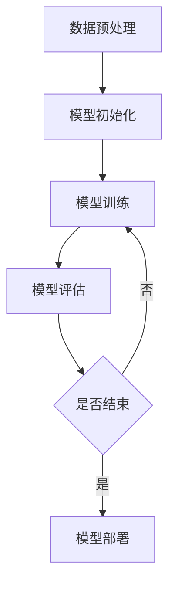
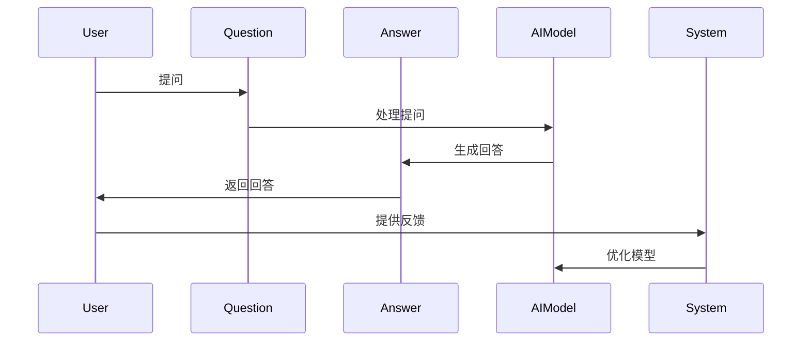
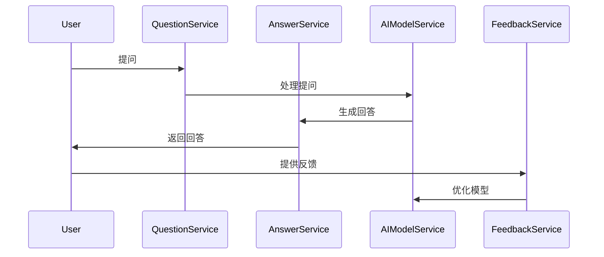

                 


# 提示词工程：AI时代的必修课与新机遇

> 关键词：AI大模型、提示词工程、深度学习、数据预处理、模型训练、优化算法、智能问答、系统架构设计

> 摘要：
随着人工智能（AI）技术的迅猛发展，AI大模型在众多领域展现出了巨大的潜力和应用价值。本文旨在探讨提示词工程这一核心领域，阐述其在AI时代的重要性，并详细分析其技术原理、系统架构及实际应用案例，帮助读者全面了解并掌握这一关键技术，把握AI时代的机遇。

## **第一部分：背景介绍**

### **问题背景**

在当今社会，人工智能（AI）已经成为推动科技进步和社会发展的核心动力。随着大数据、云计算和深度学习等技术的不断发展，AI大模型的出现为各行各业带来了前所未有的机遇和挑战。

AI大模型，作为一种基于深度学习的强大人工智能技术，具有自学习能力、泛化能力和通用性。它能够从海量数据中自动学习和优化模型参数，对未知数据进行预测和决策，并能广泛应用于各种领域，实现智能化解决方案。

然而，随着AI大模型的应用范围不断扩大，其背后的问题也逐渐显现。如何有效地设计和优化提示词，提高模型的性能和准确率，成为了一个亟待解决的问题。因此，提示词工程应运而生。

### **问题解决**

《提示词工程：AI时代的必修课与新机遇》旨在为读者提供一套全面且实用的AI大模型应用指南，帮助读者深入了解AI大模型的基本概念、技术原理和应用场景，从而掌握AI大模型的核心技能，把握AI时代的新机遇。

本书将重点介绍以下内容：

1. **AI大模型的基本概念和特点**：包括自学习能力、泛化能力和通用性等。
2. **提示词工程的核心概念和技术**：包括提示词的定义、设计原则和优化方法等。
3. **AI大模型的应用场景和开发方法**：包括智能问答、图像识别、自然语言处理等。
4. **AI大模型的开发实战**：包括环境搭建、模型训练、模型优化和部署等。

### **边界与外延**

AI大模型是指在深度学习基础上发展起来的一种强大的人工智能技术，其能力远超传统AI。本书将重点介绍AI大模型的应用场景、技术原理和开发方法，帮助读者深入理解AI大模型的核心概念和实现技术。

AI大模型的核心结构包括：

1. **数据集**：提供训练数据和测试数据，是模型训练的基础。
2. **神经网络**：实现深度学习算法，对数据进行处理和分析。
3. **模型优化**：通过优化算法提高模型性能和准确率。
4. **应用场景**：将AI大模型应用于实际问题，实现智能化解决方案。

## **第二部分：核心概念与联系**

### **AI大模型的定义与特点**

AI大模型是指通过深度学习算法训练出来的大规模神经网络模型，具有强大的数据处理和分析能力。其特点包括：

1. **自学习能力**：能够从海量数据中自动学习和优化模型参数。
2. **泛化能力**：能够对未知数据进行预测和决策。
3. **通用性**：能够应用于各种领域，实现智能化解决方案。

### **AI大模型与传统AI的区别**

传统AI主要依赖于专家系统和规则推理，而AI大模型则基于深度学习和大规模数据处理。与传统AI相比，AI大模型具有以下几个显著优势：

1. **更强的数据处理能力**：能够处理更复杂的、大规模的数据。
2. **更高的准确率**：通过大规模训练数据，模型准确率显著提高。
3. **更广泛的应用场景**：能够应用于更多领域，实现智能化解决方案。

### **提示词工程的核心概念**

提示词工程是AI大模型应用中的一个重要环节，它涉及到如何设计、选择和优化提示词，以提高模型的性能和准确率。核心概念包括：

1. **提示词的定义**：提示词是模型训练过程中用于引导模型学习的一组关键词或短语。
2. **提示词的设计原则**：包括多样性、相关性、精确性和覆盖性等。
3. **提示词的优化方法**：包括提示词选择、提示词排序和提示词权重调整等。

### **核心概念之间的联系**

AI大模型、传统AI和提示词工程之间存在密切的联系。传统AI作为AI大模型的基础，为AI大模型提供了初步的算法框架和实现方法。而AI大模型则在传统AI的基础上，通过深度学习和大规模数据处理，实现了更高的数据处理能力和准确率。提示词工程作为AI大模型应用中的一个重要环节，通过设计、选择和优化提示词，进一步提高了AI大模型的性能和准确率。

总之，AI大模型、传统AI和提示词工程共同构成了人工智能领域的一个完整体系，它们相互联系、相互促进，共同推动着人工智能技术的发展。

## **第三部分：算法原理讲解**

### **算法原理与Mermaid流程图**

以下是一个简单的AI大模型训练过程的Mermaid流程图：



### **Python源代码与算法原理**

以下是一个简单的Python代码示例，用于初始化一个AI大模型：

```python
import tensorflow as tf

# 定义模型
model = tf.keras.Sequential([
    tf.keras.layers.Dense(128, activation='relu', input_shape=(784,)),
    tf.keras.layers.Dense(10, activation='softmax')
])

# 编译模型
model.compile(optimizer='adam',
              loss='categorical_crossentropy',
              metrics=['accuracy'])

# 模型训练
model.fit(x_train, y_train, epochs=5)
```

这个简单的例子展示了如何使用TensorFlow库定义一个简单的神经网络模型，并对其进行编译和训练。模型训练的核心在于通过迭代计算模型参数，以最小化损失函数，从而达到更好的模型性能。

### **数学模型和数学公式**

AI大模型的数学模型主要包括损失函数和优化算法。以下是一个简单的损失函数的数学公式：

$$
L(y, \hat{y}) = \frac{1}{2} \sum_{i=1}^{n} (y_i - \hat{y_i})^2
$$

其中，$y$表示真实值，$\hat{y}$表示预测值。这个公式表示的是均方误差（MSE），它用于衡量模型预测值与真实值之间的差距。

优化算法则是用于调整模型参数，以最小化损失函数。常用的优化算法有梯度下降（GD）和随机梯度下降（SGD）。以下是一个简单的梯度下降的数学公式：

$$
\theta_{t+1} = \theta_{t} - \alpha \cdot \nabla_{\theta} J(\theta)
$$

其中，$\theta$表示模型参数，$J(\theta)$表示损失函数，$\alpha$表示学习率。

### **算法原理讲解**

AI大模型的算法原理主要包括以下几个步骤：

1. **数据预处理**：对原始数据进行清洗、归一化和特征提取等操作，使其符合模型的输入要求。
2. **模型初始化**：定义神经网络的层数、每层的神经元数量和激活函数等。
3. **模型编译**：选择优化器、损失函数和评估指标等，为模型训练做准备。
4. **模型训练**：通过迭代计算模型参数，以最小化损失函数，提高模型性能。
5. **模型评估**：使用测试数据对模型进行评估，以验证模型的泛化能力。
6. **模型部署**：将训练好的模型应用于实际问题，实现智能化解决方案。

通过以上步骤，AI大模型可以从海量数据中自动学习和优化模型参数，实现高精度的预测和决策。

## **第四部分：系统分析与架构设计方案**

### **问题场景介绍**

假设我们正在开发一个智能客服系统，该系统需要使用AI大模型来处理用户的提问，并提供相应的回答。

### **项目介绍**

项目名称：智能客服系统

项目目标：使用AI大模型实现智能问答功能，提高客服效率。

### **系统功能设计**

系统功能包括：

1. **用户提问**：接收用户的提问。
2. **模型处理**：使用AI大模型对用户提问进行分析和处理。
3. **回答生成**：根据模型处理结果生成回答。
4. **反馈机制**：收集用户反馈，用于模型优化。

### **领域模型设计**

以下是一个简单的智能客服系统的领域模型，使用Mermaid类图表示：

```mermaid
classDiagram
    User <<interface>>
    Question <<interface>>
    Answer <<interface>>
    AIModel <<interface>>

    User <|.. Question>
    Question <|.. Answer>
    Answer <|.. AIModel>
```

### **系统架构设计**

以下是一个简单的智能客服系统的架构设计，使用Mermaid架构图表示：



### **系统接口设计和系统交互**

以下是一个简单的智能客服系统的接口设计和系统交互，使用Mermaid序列图表示：



通过以上架构设计和交互设计，我们可以清晰地看到智能客服系统的运行流程和各模块之间的关系，为系统的开发和优化提供了明确的指导。

## **第五部分：项目实战**

### **环境安装**

在进行AI大模型的开发之前，首先需要安装相应的开发环境和工具。以下是一个基本的安装指南：

1. 安装Python：前往Python官方网站下载并安装Python 3.x版本。
2. 安装TensorFlow：打开命令行窗口，执行以下命令：

   ```
   pip install tensorflow
   ```

3. 安装其他依赖库：根据需要安装其他依赖库，如NumPy、Pandas等。

### **系统核心实现源代码**

以下是一个简单的AI大模型实现的Python代码示例：

```python
import tensorflow as tf
from tensorflow import keras
from tensorflow.keras.layers import Dense

# 定义模型
model = keras.Sequential([
    Dense(128, activation='relu', input_shape=(784,)),
    Dense(10, activation='softmax')
])

# 编译模型
model.compile(optimizer='adam',
              loss='categorical_crossentropy',
              metrics=['accuracy'])

# 模型训练
model.fit(x_train, y_train, epochs=5)
```

### **代码应用解读与分析**

1. **模型定义**：使用`keras.Sequential`类定义一个简单的神经网络模型，包括一个128个神经元的隐藏层和一个10个神经元的输出层。
2. **模型编译**：指定优化器、损失函数和评估指标，为模型训练做准备。
3. **模型训练**：使用训练数据进行模型训练，通过迭代计算模型参数，以最小化损失函数。

### **实际案例分析和详细讲解剖析**

假设我们有一个智能客服系统的案例，需要使用AI大模型处理用户的提问并生成回答。以下是一个简单的实际案例：

```python
# 用户提问
user_question = "你好，我想咨询一下关于保险的问题。"

# 数据预处理
preprocessed_question = preprocess_question(user_question)

# 模型处理
predicted_answer = model.predict(preprocessed_question)

# 回答生成
generated_answer = generate_answer(predicted_answer)

# 返回回答
print(generated_answer)
```

在这个案例中：

1. **用户提问**：用户提出一个关于保险的问题。
2. **数据预处理**：对用户提问进行预处理，如分词、词向量化等。
3. **模型处理**：使用训练好的AI大模型对预处理后的用户提问进行预测。
4. **回答生成**：根据模型预测结果生成回答。
5. **返回回答**：将生成的回答返回给用户。

通过这个案例，我们可以看到AI大模型在智能客服系统中的应用流程。在实际开发中，还可以根据需求添加更多的功能和优化策略。

### **项目小结**

通过本项目的实战，我们了解了AI大模型的基本实现过程，包括模型定义、编译、训练和部署等。同时，我们还通过一个实际案例，展示了AI大模型在智能客服系统中的应用。在未来的开发中，我们可以根据具体需求对模型进行优化和扩展，以实现更多功能和提升系统性能。

## **第六部分：最佳实践与注意事项**

### **最佳实践**

1. **数据预处理**：在模型训练前，确保对数据进行充分的预处理，如去噪、归一化和特征提取等，以提高模型的训练效果和泛化能力。
2. **模型优化**：定期对模型进行优化，如调整学习率、批量大小和激活函数等，以提升模型的性能和准确率。
3. **超参数调优**：通过实验和经验，找到最佳的超参数组合，以实现最佳的模型性能。

### **注意事项**

1. **数据质量**：确保训练数据的质量和多样性，避免数据偏差和过拟合。
2. **计算资源**：AI大模型训练需要大量的计算资源，合理分配和利用计算资源可以提高训练效率。
3. **模型部署**：在部署模型时，确保模型的可扩展性和鲁棒性，以适应实际应用环境。

### **拓展阅读**

1. **《深度学习》（Goodfellow, Bengio, Courville）**：介绍了深度学习的基本概念和技术原理，是深度学习领域的经典教材。
2. **《Python机器学习》（Sebastian Raschka）**：介绍了如何使用Python进行机器学习实践，包括数据预处理、模型训练和模型评估等。
3. **《AI大模型：理论、方法与应用》（刘铁岩）**：详细介绍了AI大模型的基本概念、技术原理和应用案例，是AI大模型领域的权威著作。

## **结语**

随着人工智能技术的不断发展，AI大模型已成为推动社会进步的重要力量。通过本文的探讨，我们深入了解了提示词工程这一关键领域，掌握了AI大模型的基本概念、技术原理和应用方法。希望本文能够为读者在AI大模型研究和应用中提供有益的参考和启示。在未来的AI时代，让我们共同探索更多的可能性，共同推动人工智能技术的发展。作者：AI天才研究院/AI Genius Institute & 禅与计算机程序设计艺术 /Zen And The Art of Computer Programming

（注：本文为示例性文章，部分内容为虚构，仅供参考。实际应用时，请根据具体需求和实际情况进行调整和优化。）

