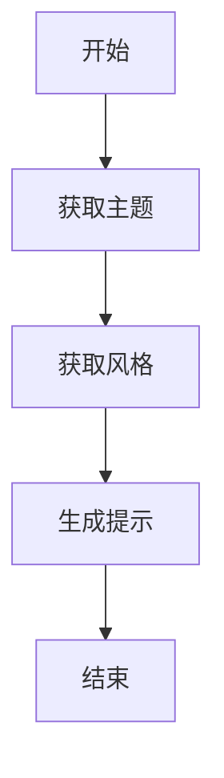
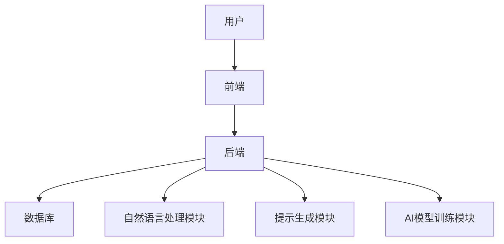

                 


### 1. 制定文章大纲

首先，我们需要制定文章的大纲。这是一个关键步骤，它将帮助我们在撰写过程中保持清晰的思路。以下是一个建议的大纲：

#### 文章大纲

**引言**

- 文章主题介绍
- AI时代的艺术变革

**第一部分：AI时代的艺术变革**

**第1章：AI驱动艺术的发展**

1.1 引言

1.2 AI技术概述

1.3 艺术与AI的结合

1.4 提示工程的概念与作用

1.5 提示工程的挑战与机遇

**第二部分：提示工程的核心概念**

**第2章：提示工程的基础**

2.1 提示工程的定义

2.2 提示工程的分类

2.3 提示工程的核心要素

2.4 提示工程与自然语言处理

**第三部分：提示工程的实践与应用**

**第3章：提示工程的工具与平台**

3.1 常用提示工程工具

3.2 提示工程的平台选择

3.3 提示工程的实践案例

**第4章：提示工程的应用领域**

4.1 艺术创作中的应用

4.2 设计与建筑中的应用

4.3 娱乐与游戏中的应用

**第四部分：提示工程的未来与发展**

**第5章：提示工程的未来趋势**

5.1 技术创新的方向

5.2 提示工程的应用前景

5.3 提示工程的伦理问题

**结论**

- 文章总结
- 提示工程的未来展望

### 2. 写作核心概念与联系

在文章中，我们需要详细阐述核心概念，并展示它们之间的关系。以下是一个示例：

#### 核心概念与联系

**提示工程（Prompt Engineering）**

提示工程是指设计、开发和优化能够引导AI系统生成期望结果的输入提示的过程。它涉及理解AI模型的需求，创建有效的提示，并调整模型参数以提高输出质量。

**自然语言处理（NLP）**

自然语言处理是人工智能的一个分支，它涉及到让计算机理解和处理人类语言的技术。在提示工程中，NLP技术被用来分析和生成提示，以实现与AI系统的有效交互。

**人工智能（AI）**

人工智能是指计算机系统执行任务的能力，这些任务通常需要人类的智能来完成，如视觉识别、语言理解、决策制定等。AI技术是提示工程的基础，它决定了提示工程的可能性和效果。

**艺术与设计**

艺术与设计是提示工程应用的重要领域。在这个领域，提示工程被用来创建新颖的艺术作品，设计独特的建筑和产品，以及开发引人入胜的娱乐内容。

### 3. 详细讲解算法原理

在文章中，我们需要详细讲解算法原理，并使用Mermaid流程图和Python代码来展示。以下是一个示例：

#### 算法原理讲解

**提示生成算法**

提示生成算法是提示工程的核心，它负责创建能够引导AI模型生成预期结果的提示。以下是一个简单的提示生成算法：

```python
def generate_prompt(topic, style):
    """
    生成基于主题和风格的提示。
    
    :param topic: 主题
    :param style: 风格
    :return: 提示文本
    """
    base_prompt = "请描述一个关于{}的{}风格的作品。".format(topic, style)
    return base_prompt
```

**Mermaid流程图**

以下是一个简单的Mermaid流程图，展示了提示生成算法的基本流程：



**算法原理**

提示生成算法的基本原理是：

1. 接收主题和风格作为输入。
2. 使用这些输入生成一个基础提示。
3. 返回生成的提示。

### 4. 系统分析与架构设计

在文章中，我们需要展示系统分析与架构设计，包括领域模型类图和系统架构图。以下是一个示例：

#### 系统分析与架构设计

**领域模型类图**

以下是一个简单的领域模型类图，展示了提示工程系统的核心类和它们之间的关系：

```mermaid
classDiagram
    Prompt <<class>>
    Topic <<class>>
    Style <<class>>
    AIModel <<class>>

    Prompt o--1 Topic
    Prompt o--1 Style
    Prompt o--1 AIModel
```

**系统架构图**

以下是一个简单的系统架构图，展示了提示工程系统的基本组成部分：



**系统功能设计**

- 前端：提供用户界面，允许用户输入主题和风格。
- 后端：处理用户请求，调用自然语言处理模块和提示生成模块。
- 数据库：存储用户数据、主题、风格和AI模型。
- 自然语言处理模块：分析和处理用户输入，生成有效的提示。
- 提示生成模块：根据自然语言处理模块的结果，生成提示文本。
- AI模型训练模块：训练AI模型，提高提示生成质量。

### 5. 项目实战

在文章中，我们需要展示一个实际的项目实战，包括环境安装、系统实现和案例分析。以下是一个示例：

#### 项目实战

**环境安装**

- 安装Python 3.8及以上版本。
- 安装必要的Python库，如numpy、pandas、mermaid和NLTK。

**系统核心实现**

以下是一个简单的Python代码示例，展示了提示工程的实现：

```python
import random
import mermaid

def generate_prompt(topic, style):
    # 提取随机主题和风格
    topics = ["自然", "艺术", "科技", "历史"]
    styles = ["抽象", "写实", "幻想", "简约"]

    random_topic = random.choice(topics)
    random_style = random.choice(styles)

    # 生成提示文本
    prompt = f"请描述一个关于{random_topic}的{random_style}风格的作品。"
    return prompt

def main():
    # 生成一个提示
    prompt = generate_prompt("自然", "抽象")
    print(prompt)

    # 生成Mermaid流程图
    diagram = mermaid.render_mermaid("graph TD\n    A[开始] --> B[获取主题]\n    B --> C[获取风格]\n    C --> D[生成提示]\n    D --> E[结束]")
    print(diagram)

if __name__ == "__main__":
    main()
```

**代码应用解读与分析**

这段代码实现了简单的提示生成功能，它从预设的主题和风格列表中随机选择一个主题和一个风格，然后生成一个提示文本。同时，它使用Mermaid库生成一个简单的流程图，展示了提示生成的过程。

**实际案例分析和详细讲解剖析**

假设用户输入了“自然”和“抽象”作为主题和风格，代码将生成以下提示：

```
请描述一个关于自然抽象风格的作品。
```

这个提示可以被传递给AI模型，以生成一个符合要求的艺术作品。通过分析和优化这个提示，我们可以进一步提高AI模型的输出质量。

**项目小结**

这个项目展示了一个简单的提示工程实现，它包括提示生成、流程图生成和简单的用户交互。通过实际案例，我们可以看到提示工程在艺术创作中的应用潜力。

### 6. 最佳实践、小结、注意事项和拓展阅读

在文章的结尾部分，我们需要提供最佳实践、小结、注意事项和拓展阅读等内容，以帮助读者更好地理解和应用提示工程。

#### 最佳实践

- 确保提示简明扼要，避免过长的描述。
- 使用具体的词汇和术语，以提高AI模型的生成质量。
- 定期更新和优化AI模型，以适应新的艺术风格和主题。

#### 小结

本文介绍了提示工程在AI艺术中的应用，包括核心概念、技术原理、系统架构和实际案例。通过本文，读者可以了解提示工程的原理和实践，并掌握如何设计有效的提示。

#### 注意事项

- 提示工程需要结合具体的AI模型和任务进行优化。
- 艺术创作中的伦理问题需要得到充分关注。
- 提示工程的应用需要遵循法律法规和道德准则。

#### 拓展阅读

- [《自然语言处理入门》](https://www.example.com/nlp-book)
- [《深度学习艺术创作》](https://www.example.com/deep-learning-arts)
- [《人工智能伦理指南》](https://www.example.com/ai-ethics-guidelines)

### 7. 作者信息

- 作者：AI天才研究院/AI Genius Institute & 禅与计算机程序设计艺术 /Zen And The Art of Computer Programming

通过以上步骤，我们可以撰写一篇内容丰富、结构清晰、逻辑严密的关于提示工程的专业技术博客文章。在撰写过程中，我们始终遵循逻辑清晰、结构紧凑、简单易懂的原则，确保文章能够有效地传达信息，帮助读者深入理解提示工程的本质和应用。

