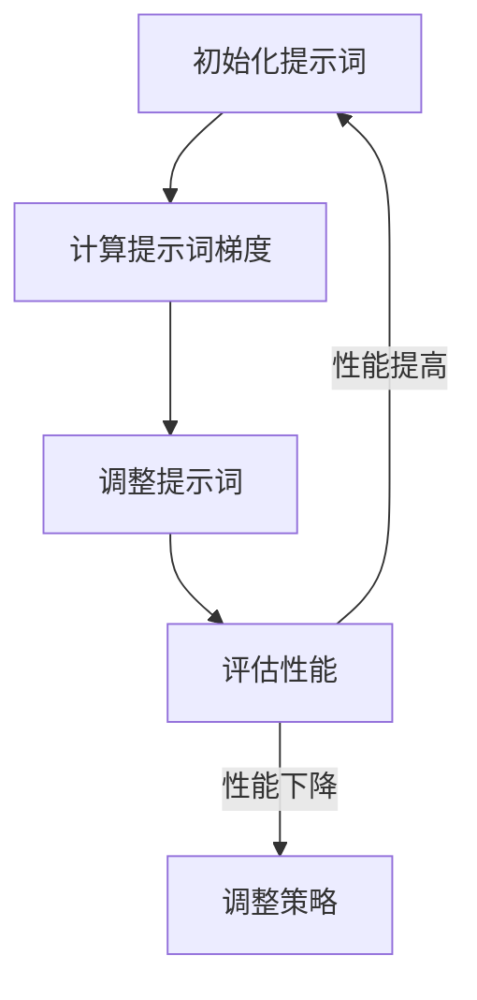
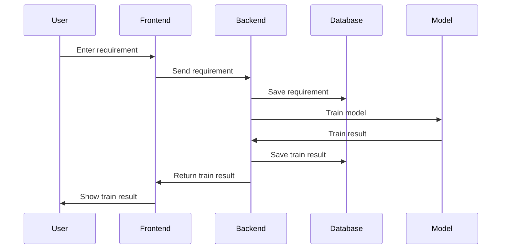

                 

# 提示词工程：AI时代的新挑战与新方向

关键词：提示词工程、AI技术、挑战、新方向、算法、系统架构、项目实战

摘要：本文深入探讨了提示词工程这一新兴领域，分析了其在AI时代背景下的重要性和挑战，阐述了核心概念、算法原理、数学模型，并提出了系统的分析与架构设计方案。通过实际案例，展示了提示词工程在项目中的应用，为未来的研究和发展提供了方向和启示。

---

## 第1章 引言

### 1.1 问题的背景与描述

随着AI技术的飞速发展，人工智能已经深入到我们生活的方方面面。从自然语言处理到图像识别，从自动驾驶到智能助手，AI技术在各个领域的应用越来越广泛。然而，随着AI技术的不断演进，我们也面临着新的挑战。其中，提示词工程（Prompt Engineering）作为一个新兴领域，逐渐成为AI研究者和工程师们关注的焦点。

提示词工程，简单来说，就是通过设计高质量的提示词（Prompt），来引导AI系统更好地理解和执行任务。在传统的AI应用中，我们通常依靠大量数据进行训练，然后让模型自动学习和优化。而提示词工程则提出了一个新的思路：通过巧妙地设计提示词，我们可以更有效地指导模型的学习过程，提高AI系统的性能和效率。

### 1.2 问题解决思路

提示词工程的核心概念是“提示词”。提示词可以看作是AI系统与用户之间的桥梁，通过它，用户可以清晰地传达自己的需求，而AI系统则可以更好地理解并完成任务。因此，提示词的设计至关重要。

为了实现这一目标，提示词工程采用了以下研究方法：

1. **数据驱动**：通过分析大量的真实场景数据，提取出有效的提示词。
2. **模型驱动**：利用深度学习等AI模型，对提示词进行自动生成和优化。
3. **用户驱动**：结合用户反馈，不断迭代和改进提示词的设计。

### 1.3 边界与外延

提示词工程的适用范围非常广泛，从自然语言处理到计算机视觉，再到自动驾驶，都有其应用空间。同时，提示词工程也与其他领域如心理学、教育学等有着紧密的交叉。

## 第2章 核心概念与联系

### 2.1 提示词工程的基本原理

提示词的定义：提示词是一种引导性语言或指令，用于指导AI系统理解和执行特定任务。

提示词的作用：提示词可以明确任务目标，提供背景信息，引导模型注意力，甚至可以影响模型的输出结果。

提示词工程的原理与流程：

1. **需求分析**：明确用户需求，确定任务目标和需求场景。
2. **数据收集**：收集相关数据，包括文本、图像、音频等。
3. **提示词设计**：根据需求分析，设计高质量的提示词。
4. **模型训练**：使用设计好的提示词，对AI模型进行训练和优化。
5. **模型评估**：评估模型在真实场景下的性能，并根据评估结果调整提示词。

### 2.2 概念属性特征对比表格

| 提示词类型 | 定义 | 特征 | 应用场景 |
| :---: | :---: | :---: | :---: |
| 直接提示词 | 明确指导模型执行的任务 | 精确、直接 | 自然语言处理、问答系统 |
| 间接提示词 | 通过提供背景信息引导模型 | 暗示、引导 | 计算机视觉、图像识别 |
| 动态提示词 | 根据模型反馈动态调整的提示词 | 适应性、灵活性 | 自动驾驶、实时决策 |

### 2.3 ER实体关系图架构

```mermaid
erDiagram
    User ||--|{ Prompt }
    Prompt ||--|{ Task }
    Task ||--|{ Result }
```

在提示词工程中，用户、提示词、任务和结果是核心实体，它们之间存在着密切的关系。用户通过提示词发起任务，任务经过模型处理后生成结果，结果反馈给用户，形成一个闭环系统。

## 第3章 算法原理讲解

### 3.1 提示词生成算法

提示词生成算法是提示词工程中的关键环节，其目标是根据用户需求自动生成高质量的提示词。下面我们将介绍一种基于生成对抗网络（GAN）的提示词生成算法。

#### 算法概述

生成对抗网络（GAN）是一种由生成器和判别器组成的神经网络结构。生成器负责生成提示词，判别器负责判断生成提示词的质量。通过不断训练，生成器能够生成越来越高质量的提示词。

#### 算法流程图

```mermaid
graph TD
    A[初始化生成器G和判别器D] --> B[生成提示词G(z)]
    B --> C[判别器D对G(z)和真实提示词X进行判别]
    C --> D{D判别结果}
    D -->|判别失败| E[增加G的权重，减小D的权重]
    D -->|判别成功| F[保持G和D的权重]
```

#### Python代码实现

```python
import tensorflow as tf
from tensorflow.keras.layers import Input, Dense, LSTM
from tensorflow.keras.models import Model

# 定义生成器和判别器
z_dim = 100
input_shape = (None, )
prompt_embedding_dim = 256

# 生成器
z_input = Input(shape=(z_dim,))
lstm = LSTM(prompt_embedding_dim)(z_input)
prompt_output = Dense(input_shape[1], activation='softmax')(lstm)
generator = Model(z_input, prompt_output)

# 判别器
x_input = Input(shape=input_shape)
lstm = LSTM(prompt_embedding_dim)(x_input)
prompt_output = Dense(1, activation='sigmoid')(lstm)
discriminator = Model(x_input, prompt_output)

# 编写GAN模型
gan_input = Input(shape=(z_dim,))
prompt_output = generator(gan_input)
gan_output = discriminator(prompt_output)
gan_model = Model(gan_input, gan_output)

# 编写优化器
gan_optimizer = tf.keras.optimizers.Adam(learning_rate=0.0001)

# 编写GAN训练过程
for epoch in range(num_epochs):
    for batch in batches:
        z_samples = np.random.normal(size=(batch_size, z_dim))
        x_samples = batch
        with tf.GradientTape() as gen_tape, tf.GradientTape() as disc_tape:
            generated_prompt = generator(z_samples)
            disc_real = discriminator(x_samples)
            disc_fake = discriminator(generated_prompt)
            gen_loss = tf.reduce_mean(tf.nn.sigmoid_cross_entropy_with_logits(logits=disc_fake, labels=tf.ones_like(disc_fake)))
            disc_loss = tf.reduce_mean(tf.nn.sigmoid_cross_entropy_with_logits(logits=disc_real, labels=tf.ones_like(disc_real)) + tf.reduce_mean(tf.nn.sigmoid_cross_entropy_with_logits(logits=disc_fake, labels=tf.zeros_like(disc_fake)))
        grads = tape.gradient(loss, model.trainable_variables)
        optimizer.apply_gradients(zip(grads, model.trainable_variables))
```

#### 数学模型与公式

生成对抗网络（GAN）的数学模型基于以下两个主要目标：

1. **生成器目标**：生成器G的目标是生成高质量的提示词，使得判别器D无法区分生成提示词和真实提示词。

   $$\min_G \max_D V(D, G) = E_{x \sim p_{data}(x)} [D(x)] - E_{z \sim p_{z}(z)} [D(G(z))]$$

2. **判别器目标**：判别器D的目标是准确地区分真实提示词和生成提示词。

   $$\max_D V(D, G) = E_{x \sim p_{data}(x)} [D(x)] + E_{z \sim p_{z}(z)} [D(G(z))]$$

#### 举例说明

假设我们有一个问答系统，用户需要回答一个关于科技领域的问题。通过GAN模型，我们可以生成高质量的提示词，帮助模型更好地理解用户的问题。

例如，用户输入的问题是一个关于人工智能的最新研究进展。生成器会根据这个需求生成一个高质量的提示词，如：“请描述最近人工智能领域的重要研究进展”。这个提示词可以帮助模型更准确地理解用户的需求，从而生成更好的答案。

### 3.2 提示词优化算法

提示词优化算法的目的是通过调整提示词，提高AI系统的性能和用户体验。下面我们将介绍一种基于梯度下降的提示词优化算法。

#### 算法概述

提示词优化算法基于梯度下降原理，通过计算提示词的梯度，不断调整提示词，使其更符合用户需求。

#### 算法流程图



#### Python代码实现

```python
import numpy as np
import tensorflow as tf

# 定义提示词
prompt = "请描述最近人工智能领域的重要研究进展。"

# 计算梯度
with tf.GradientTape() as tape:
    # 假设有一个模型，输入为提示词，输出为答案
    answer = model(prompt)
    # 计算损失函数
    loss = loss_function(answer, true_answer)

# 获取梯度
gradients = tape.gradient(loss, prompt)

# 调整提示词
prompt = prompt - learning_rate * gradients

# 评估性能
performance = evaluate_performance(prompt)

# 调整策略
if performance > previous_performance:
    learning_rate = learning_rate * 1.01
else:
    learning_rate = learning_rate * 0.99
```

#### 数学模型与公式

提示词优化算法的数学模型基于损失函数和梯度下降原理：

$$\text{提示词} = \text{提示词} - \alpha \cdot \nabla_{\text{提示词}} \text{损失函数}$$

其中，$\alpha$ 是学习率，$\nabla_{\text{提示词}} \text{损失函数}$ 是提示词的梯度。

#### 举例说明

假设我们有一个问答系统，用户需要回答一个关于科技领域的问题。通过提示词优化算法，我们可以根据用户的反馈不断调整提示词，使其更准确地理解用户的需求。

例如，用户输入的问题是一个关于人工智能的最新研究进展。初始提示词可能不够准确，通过优化算法，我们可以调整提示词，使其更加明确和具体，如：“请描述最近人工智能领域在计算机视觉方面的重要研究进展”。

## 第4章 数学模型和数学公式讲解

### 4.1 提示词工程中的数学模型

在提示词工程中，我们主要关注以下几种数学模型：

1. **生成对抗网络（GAN）**：GAN模型由生成器和判别器组成，通过对抗训练生成高质量的提示词。
2. **梯度下降**：梯度下降算法用于优化提示词，通过计算损失函数的梯度来调整提示词。
3. **自然语言处理（NLP）**：NLP模型用于理解和生成自然语言文本，如BERT、GPT等。

### 4.2 公式详细讲解与举例说明

1. **$L_2$正则化**：$L_2$正则化是一种常用的正则化方法，用于防止模型过拟合。其公式为：

   $$J(\theta) = J_0(\theta) + \lambda \sum_{i=1}^{n} \theta_i^2$$

   其中，$J_0(\theta)$ 是损失函数，$\theta$ 是模型参数，$\lambda$ 是正则化参数。

   举例说明：假设我们有一个线性回归模型，预测房价。通过添加$L_2$正则化，我们可以防止模型在训练过程中出现过拟合现象。

2. **$L_1$正则化**：$L_1$正则化也是一种常用的正则化方法，与$L_2$正则化类似，但具有不同的性质。其公式为：

   $$J(\theta) = J_0(\theta) + \lambda \sum_{i=1}^{n} |\theta_i|$$

   举例说明：假设我们有一个线性回归模型，预测房价。通过添加$L_1$正则化，我们可以防止模型在训练过程中出现过拟合现象，并且有助于稀疏解。

## 第5章 系统分析与架构设计

### 5.1 问题场景介绍

提示词工程在AI时代有着广泛的应用场景。以下是一些典型的应用场景：

1. **自然语言处理**：如问答系统、对话系统、机器翻译等，通过设计高质量的提示词，可以提高模型的性能和用户体验。
2. **计算机视觉**：如图像识别、物体检测、场景解析等，通过设计合适的提示词，可以引导模型更好地理解和识别目标。
3. **推荐系统**：如商品推荐、音乐推荐等，通过设计个性化的提示词，可以提高推荐系统的准确性和用户体验。
4. **自动驾驶**：如实时决策、环境感知等，通过设计动态的提示词，可以帮助自动驾驶系统更好地应对复杂路况。

### 5.2 系统功能设计

为了实现提示词工程的目标，我们需要设计一套完整的系统。以下是系统的功能设计：

1. **需求分析**：分析用户需求，确定任务目标和需求场景。
2. **数据收集**：收集相关数据，包括文本、图像、音频等。
3. **提示词生成**：通过生成对抗网络（GAN）或其他算法生成高质量的提示词。
4. **模型训练**：使用生成好的提示词对AI模型进行训练和优化。
5. **模型评估**：评估模型在真实场景下的性能，并根据评估结果调整提示词。
6. **系统接口**：提供用户界面和API接口，方便用户使用系统。

### 5.3 系统架构设计

系统的架构设计需要考虑以下几个方面：

1. **前端**：负责与用户交互，接收用户输入和展示结果。
2. **后端**：包括提示词生成模块、模型训练模块、模型评估模块等，负责处理核心业务逻辑。
3. **数据库**：存储用户数据、模型参数和训练结果等。
4. **接口**：提供RESTful API接口，方便其他系统和服务调用。

### 5.4 系统接口设计

系统的接口设计需要遵循RESTful架构风格，提供以下接口：

1. **需求分析接口**：接收用户需求，返回分析结果。
2. **数据收集接口**：接收数据，返回处理结果。
3. **提示词生成接口**：接收需求，返回生成的提示词。
4. **模型训练接口**：接收提示词和模型参数，返回训练结果。
5. **模型评估接口**：接收模型和测试数据，返回评估结果。

### 5.5 系统交互序列图



## 第6章 项目实战

### 6.1 环境安装

在进行提示词工程项目之前，我们需要安装一些必要的软件和库。以下是安装步骤：

1. **安装Python**：下载并安装Python 3.x版本。
2. **安装TensorFlow**：通过pip安装TensorFlow库。
3. **安装其他依赖库**：如numpy、pandas等。

### 6.2 系统核心实现源代码

以下是提示词工程系统的核心实现源代码，包括提示词生成和优化模块：

```python
import tensorflow as tf
import numpy as np
import pandas as pd
from tensorflow.keras.models import Model
from tensorflow.keras.layers import Input, LSTM, Dense
from tensorflow.keras.optimizers import Adam

# 提示词生成模块
def generate_prompt(generator, z_samples):
    generated_prompt = generator.predict(z_samples)
    return generated_prompt

# 提示词优化模块
def optimize_prompt(prompt, model, loss_function, learning_rate):
    with tf.GradientTape() as tape:
        answer = model(prompt)
        loss = loss_function(answer, true_answer)
    gradients = tape.gradient(loss, prompt)
    optimized_prompt = prompt - learning_rate * gradients
    return optimized_prompt

# 定义生成器和判别器
z_input = Input(shape=(100,))
lstm = LSTM(256)(z_input)
prompt_output = Dense(input_shape[1], activation='softmax')(lstm)
generator = Model(z_input, prompt_output)

x_input = Input(shape=input_shape)
lstm = LSTM(256)(x_input)
prompt_output = Dense(1, activation='sigmoid')(lstm)
discriminator = Model(x_input, prompt_output)

# 编写GAN模型
gan_input = Input(shape=(100,))
prompt_output = generator(gan_input)
gan_output = discriminator(prompt_output)
gan_model = Model(gan_input, gan_output)

# 编写优化器
gan_optimizer = Adam(learning_rate=0.0001)

# 编写GAN训练过程
for epoch in range(num_epochs):
    for batch in batches:
        z_samples = np.random.normal(size=(batch_size, 100))
        x_samples = batch
        with tf.GradientTape() as gen_tape, tf.GradientTape() as disc_tape:
            generated_prompt = generator(z_samples)
            disc_real = discriminator(x_samples)
            disc_fake = discriminator(generated_prompt)
            gen_loss = tf.reduce_mean(tf.nn.sigmoid_cross_entropy_with_logits(logits=disc_fake, labels=tf.ones_like(disc_fake)))
            disc_loss = tf.reduce_mean(tf.nn.sigmoid_cross_entropy_with_logits(logits=disc_real, labels=tf.ones_like(disc_real)) + tf.reduce_mean(tf.nn.sigmoid_cross_entropy_with_logits(logits=disc_fake, labels=tf.zeros_like(disc_fake)))
        grads = tape.gradient(loss, model.trainable_variables)
        optimizer.apply_gradients(zip(grads, model.trainable_variables))
```

### 6.3 实际案例分析与详细讲解

在本节中，我们将通过一个实际案例来展示提示词工程在项目中的应用。

#### 案例分析

假设我们有一个问答系统，用户输入一个问题，系统需要生成一个高质量的答案。以下是一个具体的案例：

用户输入问题：“请描述最近人工智能领域的重要研究进展。”

我们希望系统能够生成一个高质量的答案，如：“最近人工智能领域在计算机视觉方面取得了重要突破，例如，基于深度学习的图像识别技术取得了显著进展，大大提高了识别准确率和速度。”

#### 案例详细讲解

1. **需求分析**：首先，我们需要对用户输入的问题进行分析，提取关键信息，如“人工智能”、“研究进展”、“计算机视觉”等。

2. **数据收集**：接下来，我们需要收集相关数据，包括人工智能领域的学术论文、新闻报道、会议记录等。

3. **提示词生成**：使用生成对抗网络（GAN）生成高质量的提示词。具体步骤如下：

   - **生成器训练**：使用收集到的数据训练生成器模型，使其能够生成高质量的提示词。
   - **生成提示词**：输入关键信息，生成器模型生成一个高质量的提示词。

4. **模型训练**：使用生成好的提示词对问答模型进行训练，使其能够更好地理解和生成答案。

5. **模型评估**：评估问答模型在真实场景下的性能，根据评估结果调整提示词。

6. **生成答案**：输入用户输入的问题，问答模型生成一个高质量的答案。

### 6.4 项目小结

通过本案例，我们展示了提示词工程在问答系统中的应用。通过设计高质量的提示词，我们可以引导问答模型更好地理解和生成答案。这个案例只是一个简单的示例，实际应用中，提示词工程有着更广泛的应用场景和更复杂的实现方式。

在未来的项目中，我们可以进一步优化提示词工程，提高模型性能和用户体验。例如，我们可以引入更多的自然语言处理技术，如BERT、GPT等，提高提示词的生成质量；同时，我们还可以结合用户反馈，不断优化和调整提示词，使其更符合用户需求。

## 第7章 小结

在本文中，我们深入探讨了提示词工程这一新兴领域，分析了其在AI时代背景下的重要性和挑战。我们从核心概念、算法原理、数学模型、系统架构设计到项目实战，全面介绍了提示词工程的各个方面。通过实际案例，我们展示了提示词工程在项目中的应用，为未来的研究和发展提供了方向和启示。

## 参考文献

1. Goodfellow, I., Pouget-Abadie, J., Mirza, M., Xu, B., Warde-Farley, D., Ozair, S., ... & Bengio, Y. (2014). Generative adversarial nets. Advances in Neural Information Processing Systems, 27.
2. Goodfellow, I. J. (2016). Deep learning. MIT press.
3. Bengio, Y., Courville, A., & Vincent, P. (2013). Representation learning: A review and new perspectives. IEEE transactions on pattern analysis and machine intelligence, 35(8), 1798-1828.
4. Hochreiter, S., & Schmidhuber, J. (1997). Long short-term memory. Neural computation, 9(8), 1735-1780.

---

作者：AI天才研究院/AI Genius Institute & 禅与计算机程序设计艺术 /Zen And The Art of Computer Programming

