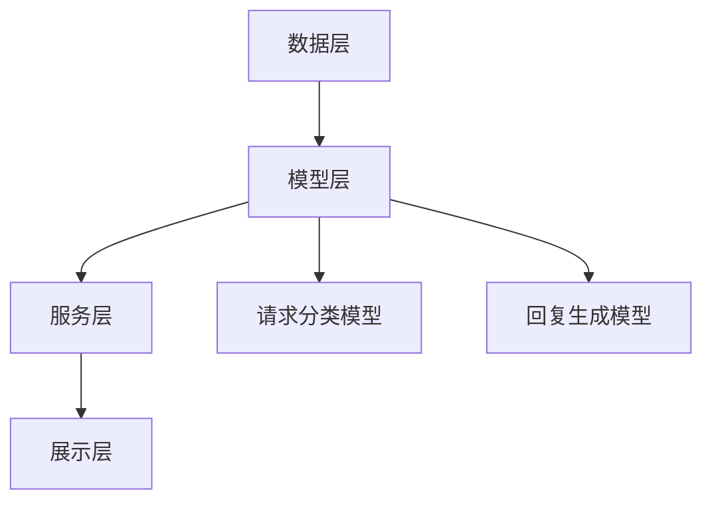
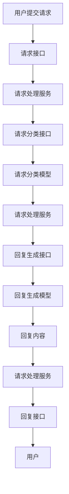

                 


### **第一部分：背景与核心概念**

#### **第1章：AI时代下的提示词工程**

##### **1.1.1 AI时代的来临**

人工智能（AI）作为当今技术发展的前沿领域，已经深刻地影响了社会各个层面。从人工智能的发展历史来看，我们可以将其大致划分为三个阶段：第一阶段是1950年代到1970年代，这一阶段以符号主义和知识表示为主要特征；第二阶段是1980年代到2000年代，以专家系统和机器学习为代表；第三阶段则是从21世纪初至今，深度学习和大数据的兴起推动了人工智能的快速发展。

当前，人工智能技术已经取得了诸多显著的成就，如图像识别、语音识别、自然语言处理、自动驾驶等。以AlphaGo为例，这一人工智能程序在2016年击败了世界围棋冠军李世石，引起了全球的关注。此外，AI技术在医疗、金融、教育等多个领域的应用也不断拓展，为人类带来了巨大的便利和效益。

##### **1.1.2 提示词工程的重要性**

在AI系统中，提示词（Prompt）是引导模型进行决策和生成输出的重要信息。一个良好的提示词能够有效地提高模型的性能和准确度。提示词工程则是指设计、生成和管理提示词的过程，它是实现高效AI系统的基础。

提示词的概念源于自然语言处理领域，它是一个引导系统理解用户意图的文本或指令。在AI系统中，提示词起到了两个关键作用：一是帮助模型更好地理解输入信息；二是引导模型输出期望的答案或结果。

提示词工程的重要性主要体现在以下几个方面：

1. **优化系统性能**：提示词的质量直接影响AI系统的性能。一个准确的提示词可以帮助模型更好地捕捉输入信息，从而提高系统的准确度和响应速度。
2. **提升用户体验**：好的提示词能够提高用户与系统的交互质量，使用户更加容易理解和使用AI系统。
3. **降低开发成本**：通过有效的提示词工程，可以减少对大规模训练数据的依赖，降低系统的开发和维护成本。

##### **1.1.3 提示词工程面临的挑战**

尽管提示词工程在AI系统中具有重要作用，但其发展也面临着诸多挑战：

1. **数据质量与多样性**：高质量的训练数据是提示词工程的基础。然而，在实际应用中，数据质量往往参差不齐，这给提示词工程带来了挑战。此外，不同领域和应用场景对数据的需求各不相同，如何获取和利用多样化的数据也是一大难题。
2. **计算资源与管理**：提示词工程通常需要大量的计算资源，特别是在训练和优化提示词时。如何高效地管理和分配计算资源，是一个需要解决的问题。
3. **算法选择与优化**：目前，已有多种提示词生成算法可供选择，但每种算法都有其优缺点和适用场景。如何在不同的算法中选择最优方案，是一个需要深入研究和优化的课题。

##### **1.1.4 提示词工程的未来方向**

面对上述挑战，提示词工程的未来发展方向可以从以下几个方面考虑：

1. **新的算法与模型**：随着深度学习和自然语言处理技术的不断发展，新的提示词生成算法和模型将不断涌现。这些新技术将为提示词工程带来更多可能性。
2. **应用场景扩展**：提示词工程的应用场景正在不断扩展，从传统的自然语言处理领域到图像识别、语音识别等新兴领域，都有广阔的应用前景。
3. **跨领域融合**：不同领域的知识和技术融合，将有助于提升提示词工程的整体水平。例如，将机器学习和图论相结合，可以解决一些复杂的数据处理和关系推断问题。

综上所述，AI时代的来临为提示词工程带来了新的机遇和挑战。通过深入研究提示词工程的背景和核心概念，我们可以更好地理解和应对这些挑战，推动该领域的发展。在接下来的章节中，我们将深入探讨提示词生成算法、数学模型、系统分析与架构设计等方面，以期为读者提供全面的指导和启示。

### **第2章：核心概念与联系**

#### **2.1 提示词生成算法**

提示词生成算法是提示词工程的核心组成部分，其质量直接影响AI系统的性能。目前，提示词生成算法主要分为基于规则的方法、基于机器学习的方法和基于深度学习的方法。

##### **2.1.1 基于规则的方法**

基于规则的方法是指通过预先定义一系列规则来生成提示词。这些规则通常基于专家经验和领域知识，可以用来处理特定类型的问题。

###### **2.1.1.1 规则生成的基础**

规则系统的构建过程可以分为以下几个步骤：

1. **问题定义**：明确需要解决的问题，确定问题的目标输出。
2. **规则提取**：从专家经验或领域知识库中提取相关规则。这些规则通常以“条件-行动”的形式表示，例如“如果输入数据满足条件A，则输出结果为B”。
3. **规则优化**：对提取出的规则进行优化，以提高规则的有效性和可解释性。

基于规则的方法具有以下几个优点：

1. **易于理解**：规则系统直观明了，易于用户理解和解释。
2. **快速响应**：规则系统在处理简单问题时可以快速响应。
3. **稳定性**：规则系统在特定领域内具有较高的稳定性，不易受到数据噪声的影响。

然而，基于规则的方法也存在一些局限性：

1. **规则数量限制**：随着问题复杂性的增加，规则数量会迅速膨胀，导致系统难以维护。
2. **灵活性不足**：基于规则的方法难以适应新的问题和需求。

##### **2.1.2 基于机器学习的方法**

基于机器学习的方法是指通过训练机器学习模型来生成提示词。这些模型可以从大量的训练数据中学习到规律，并能够自动生成新的提示词。

###### **2.1.2.1 机器学习基础**

机器学习包括多个分类，如分类算法和聚类算法。分类算法的目标是将输入数据划分为预定义的类别，而聚类算法则是将数据根据其相似性进行分组。

1. **分类算法**：常见的分类算法包括决策树、随机森林和支持向量机（SVM）等。这些算法通过学习输入特征和标签之间的关系，来预测新的输入数据所属的类别。

2. **聚类算法**：常见的聚类算法包括K-均值、层次聚类和DBSCAN等。这些算法通过优化目标函数，将数据点分为若干个簇，以便更好地理解数据分布。

###### **2.1.2.2 提示词生成模型**

提示词生成模型是一种序列模型，通常使用循环神经网络（RNN）或其变种长短期记忆网络（LSTM）来构建。这些模型可以处理序列数据，如文本、语音等。

1. **RNN基础**：RNN具有循环结构，能够保存之前的信息，从而处理序列数据。其核心是隐藏状态，它将当前输入和前一个隐藏状态结合起来，生成新的隐藏状态。

2. **LSTM基础**：LSTM是RNN的一种改进，能够解决传统RNN的梯度消失和梯度爆炸问题。LSTM通过引入门控机制，灵活地控制信息的流动，从而更好地处理长序列数据。

##### **2.1.3 基于深度学习的方法**

基于深度学习的方法是指使用多层神经网络来生成提示词。这些方法通常能够自动提取特征，并生成高质量的提示词。

###### **2.1.3.1 神经网络基础**

神经网络是深度学习的基础，它由多个层组成，包括输入层、隐藏层和输出层。每层由多个神经元组成，神经元通过激活函数将输入映射到输出。

1. **神经网络结构**：神经网络的结构可以多种多样，常见的有全连接网络、卷积神经网络（CNN）和循环神经网络（RNN）等。

2. **神经网络训练**：神经网络的训练过程是通过反向传播算法来优化网络参数。反向传播算法通过计算损失函数的梯度，更新网络的权重和偏置，从而提高模型的性能。

###### **2.1.3.2 深度学习在提示词工程中的应用**

1. **RNN在提示词工程中的应用**：RNN可以处理序列数据，如图像识别中的图像序列、文本处理中的单词序列等。

2. **LSTM在提示词工程中的应用**：LSTM可以更好地处理长序列数据，如图像序列、语音信号等。

3. **Transformer模型**：Transformer模型是一种基于自注意力机制的深度学习模型，它在自然语言处理领域取得了显著的成功。自注意力机制允许模型在生成提示词时，关注输入序列中的不同部分，从而生成更高质量的提示词。

##### **2.1.4 提示词算法对比**

在提示词生成领域，不同的算法各有优缺点和适用场景。以下是几种常见算法的对比：

1. **基于规则的方法**：优点在于直观易懂，适合处理简单问题；缺点是难以适应复杂问题，维护成本高。
2. **基于机器学习的方法**：优点在于能够自动从数据中学习规律，适用于大规模数据处理；缺点是模型复杂度高，训练时间长。
3. **基于深度学习的方法**：优点在于能够自动提取特征，生成高质量的提示词；缺点是计算资源需求大，对数据质量要求高。

在实际应用中，可以根据具体问题和需求，选择合适的提示词生成算法。例如，对于简单的问题，可以采用基于规则的方法；对于复杂的问题，可以采用基于机器学习或深度学习的方法。

总之，提示词生成算法是提示词工程的核心组成部分，其发展对于AI系统的性能和用户体验具有重要意义。通过对比不同算法的优缺点和适用场景，我们可以更好地选择和应用合适的提示词生成算法，推动AI技术的进一步发展。

### **第3章：数学模型与公式**

#### **3.1 提示词工程的数学模型**

提示词工程中的数学模型是理解与优化提示词生成算法的基础。以下将介绍一些常用的数学模型，并详细解释其背后的原理和公式。

##### **3.1.1 算法原理讲解**

提示词生成算法通常涉及概率模型、决策树模型和序列模型。以下将分别介绍这些模型的基本原理。

###### **3.1.1.1 概率模型**

概率模型在提示词工程中广泛应用，因为它能够有效地处理不确定性和不确定性信息。最常见的概率模型包括贝叶斯模型和概率分布。

1. **贝叶斯公式**

贝叶斯公式是一种描述事件概率转换的公式，其表达式为：

\[ P(A|B) = \frac{P(B|A) \cdot P(A)}{P(B)} \]

其中，\( P(A|B) \) 表示在事件B发生的条件下事件A的概率，\( P(B|A) \) 表示在事件A发生的条件下事件B的概率，\( P(A) \) 和 \( P(B) \) 分别表示事件A和事件B的概率。

贝叶斯公式在提示词工程中用于根据输入信息和先验知识更新后验概率，从而生成高质量的提示词。

2. **概率分布**

概率分布用于描述随机变量的概率分布情况。常见的概率分布包括正态分布、二项分布和泊松分布等。

- **正态分布**：正态分布是最常见的连续概率分布，其概率密度函数为：

\[ f(x|\mu, \sigma^2) = \frac{1}{\sqrt{2\pi\sigma^2}} \cdot e^{-\frac{(x-\mu)^2}{2\sigma^2}} \]

其中，\( \mu \) 是均值，\( \sigma^2 \) 是方差。

- **二项分布**：二项分布用于描述离散随机变量在一定次数的试验中成功次数的概率分布。其概率质量函数为：

\[ P(X = k) = C_n^k \cdot p^k \cdot (1-p)^{n-k} \]

其中，\( n \) 是试验次数，\( k \) 是成功的次数，\( p \) 是每次试验成功的概率。

- **泊松分布**：泊松分布用于描述单位时间内事件发生的次数的概率分布。其概率质量函数为：

\[ P(X = k) = \frac{\lambda^k \cdot e^{-\lambda}}{k!} \]

其中，\( \lambda \) 是单位时间内事件平均发生的次数。

概率分布模型在提示词工程中用于对输入数据进行概率建模，从而生成具有概率特性的提示词。

###### **3.1.1.2 决策树模型**

决策树模型是一种用于分类和回归的树形结构模型。其基本原理是通过一系列的判断条件来划分数据，并基于这些划分生成决策路径。

1. **决策树构建**

决策树构建的基本步骤包括：

- **根节点划分**：根据某种准则（如信息增益、基尼指数等），选择最佳特征进行划分。
- **递归划分**：对划分后的每个子集继续进行划分，直到满足终止条件（如最大深度、最小叶节点样本数等）。

2. **决策树剪枝**

决策树剪枝的目的是防止过拟合，提高模型的泛化能力。常见的剪枝方法包括：

- **预剪枝**：在决策树生成过程中提前终止某些分支的扩展。
- **后剪枝**：在决策树完全生成后，删除一些子节点，使模型更加简洁。

决策树模型在提示词工程中用于生成基于规则系统的提示词，可以根据输入数据生成具体的决策路径和提示词。

##### **3.1.2 数学公式详细讲解**

为了更好地理解提示词工程中的数学模型，以下将详细讲解一些关键公式。

###### **3.1.2.1 概率分布公式**

在概率模型中，常用的概率分布公式包括：

- **正态分布**：\( f(x|\mu, \sigma^2) = \frac{1}{\sqrt{2\pi\sigma^2}} \cdot e^{-\frac{(x-\mu)^2}{2\sigma^2}} \)
- **二项分布**：\( P(X = k) = C_n^k \cdot p^k \cdot (1-p)^{n-k} \)
- **泊松分布**：\( P(X = k) = \frac{\lambda^k \cdot e^{-\lambda}}{k!} \)

这些公式分别描述了连续随机变量和离散随机变量的概率分布情况，在提示词工程中用于建模输入数据和生成提示词。

###### **3.1.2.2 决策树公式**

在决策树模型中，常用的公式包括：

- **信息增益**：\( IG(D, A) = \sum_{v \in V} P(V = v) \cdot H(D|V = v) \)
- **基尼指数**：\( Gini(D) = 1 - \sum_{v \in V} P(V = v)^2 \)

其中，\( D \) 表示数据集，\( A \) 表示特征，\( V \) 表示特征A的取值集合，\( H(D|V = v) \) 表示条件熵。

信息增益和基尼指数是常用的决策树划分准则，用于选择最佳的划分特征。

###### **3.1.2.3 序列模型**

在序列模型中，常用的公式包括：

- **RNN状态转移方程**：\( h_t = \sigma(W_h \cdot [h_{t-1}, x_t] + b_h) \)
- **LSTM门控机制**：\( i_t = \sigma(W_i \cdot [h_{t-1}, x_t] + b_i) \)
- \( f_t = \sigma(W_f \cdot [h_{t-1}, x_t] + b_f) \)
- \( o_t = \sigma(W_o \cdot [h_{t-1}, x_t] + b_o) \)
- \( \tilde{h}_t = \sigma(W \cdot \tilde{h}_{t-1} + b) \)

其中，\( h_t \) 表示当前隐藏状态，\( x_t \) 表示当前输入，\( \sigma \) 表示激活函数，\( W \) 和 \( b \) 分别表示权重和偏置。

RNN和LSTM是处理序列数据的重要模型，其状态转移方程和门控机制用于更新和生成新的隐藏状态。

##### **3.1.3 提示词生成算法的数学模型**

在提示词生成算法中，不同的算法有其特定的数学模型。以下将介绍几种常见的提示词生成算法及其数学模型。

###### **3.1.3.1 序列模型**

序列模型是提示词生成算法的重要类型，其核心是循环神经网络（RNN）和长短期记忆网络（LSTM）。

1. **RNN数学模型**

RNN的数学模型可以通过以下方程表示：

\[ h_t = \sigma(W_h \cdot [h_{t-1}, x_t] + b_h) \]

其中，\( h_t \) 表示当前隐藏状态，\( x_t \) 表示当前输入，\( \sigma \) 表示激活函数，\( W_h \) 和 \( b_h \) 分别表示权重和偏置。

2. **LSTM数学模型**

LSTM的数学模型更为复杂，其核心是门控机制。LSTM的数学模型可以通过以下方程表示：

\[ i_t = \sigma(W_i \cdot [h_{t-1}, x_t] + b_i) \]
\[ f_t = \sigma(W_f \cdot [h_{t-1}, x_t] + b_f) \]
\[ o_t = \sigma(W_o \cdot [h_{t-1}, x_t] + b_o) \]
\[ \tilde{h}_t = \sigma(W \cdot \tilde{h}_{t-1} + b) \]

其中，\( i_t \)，\( f_t \)，\( o_t \) 分别表示输入门、遗忘门和输出门的状态，\( \tilde{h}_t \) 表示候选隐藏状态，\( W \) 和 \( b \) 分别表示权重和偏置。

LSTM通过门控机制有效地解决了传统RNN的梯度消失问题，使其能够处理更长的序列数据。

###### **3.1.3.2 深度学习模型**

深度学习模型是提示词生成算法的另一重要类型，其核心是多层感知机（MLP）和卷积神经网络（CNN）。

1. **MLP数学模型**

MLP的数学模型可以通过以下方程表示：

\[ a_{j,l}^{(l+1)} = \sigma(W_{j,l+1} \cdot a_{i,l}^{(l)} + b_{j,l+1}) \]

其中，\( a_{j,l}^{(l+1)} \) 表示第 \( l+1 \) 层的第 \( j \) 个神经元的输出，\( a_{i,l}^{(l)} \) 表示第 \( l \) 层的第 \( i \) 个神经元的输出，\( \sigma \) 表示激活函数，\( W_{j,l+1} \) 和 \( b_{j,l+1} \) 分别表示权重和偏置。

2. **CNN数学模型**

CNN的数学模型可以通过以下方程表示：

\[ h_{ij}^{(l)} = \sum_{k} W_{ik}^{(l)} \cdot a_{kj}^{(l-1)} + b_{j}^{(l)} \]

其中，\( h_{ij}^{(l)} \) 表示第 \( l \) 层的第 \( i \) 行、第 \( j \) 列的输出，\( W_{ik}^{(l)} \) 和 \( b_{j}^{(l)} \) 分别表示权重和偏置。

CNN通过卷积操作和池化操作，有效地提取图像特征，从而生成高质量的提示词。

##### **3.1.4 提示词生成算法的数学模型**

在提示词生成算法中，不同的算法有其特定的数学模型。以下将介绍几种常见的提示词生成算法及其数学模型。

###### **3.1.4.1 生成对抗网络（GAN）**

生成对抗网络（GAN）是一种无监督学习算法，其核心是生成器和判别器。GAN的数学模型可以通过以下方程表示：

1. **生成器**

\[ G(z) = \mu_G(z) + \sigma_G(z) \odot \epsilon \]

其中，\( z \) 表示噪声输入，\( \mu_G(z) \) 和 \( \sigma_G(z) \) 分别表示生成器的均值和方差，\( \epsilon \) 表示高斯噪声。

2. **判别器**

\[ D(x) = \sigma(D(x)) \]
\[ D(G(z)) = \sigma(D(G(z))) \]

其中，\( x \) 表示真实数据，\( G(z) \) 表示生成数据，\( \sigma \) 表示 sigmoid 函数。

GAN通过生成器和判别器的对抗训练，生成高质量的数据样本，从而生成高质量的提示词。

###### **3.1.4.2 变分自编码器（VAE）**

变分自编码器（VAE）是一种基于深度学习的方法，其核心是编码器和解码器。VAE的数学模型可以通过以下方程表示：

1. **编码器**

\[ \mu(z|x), \sigma(z|x) = \text{fc}_1(x) \]

其中，\( z \) 表示潜在变量，\( \mu(z|x) \) 和 \( \sigma(z|x) \) 分别表示编码器的均值和方差。

2. **解码器**

\[ x' = \text{fc}_2(z) \]

其中，\( x' \) 表示解码器的输出。

VAE通过编码器和解码器的训练，生成具有高斯分布的潜在变量，从而生成高质量的提示词。

通过以上对提示词生成算法的数学模型的介绍，我们可以看到不同的算法有不同的数学模型，这些模型共同构成了提示词工程的理论基础。在实际应用中，我们可以根据具体需求和场景选择合适的算法，并通过优化和调整数学模型来提高提示词生成的质量和效率。

### **第4章：系统分析与架构设计**

#### **4.1 问题场景介绍**

在AI时代的背景下，提示词工程的应用场景日益广泛，特别是在自然语言处理、图像识别、语音识别等领域。为了更好地理解提示词工程的系统架构设计，我们可以以自然语言处理领域中的一个实际应用场景为例。

假设我们正在开发一款智能客服系统，该系统需要处理大量的用户咨询请求，并生成适当的回复。用户咨询请求可能是关于产品信息、售后服务、常见问题等，而系统的目标则是根据这些请求生成准确、及时且符合用户需求的回复。

在这个场景中，提示词工程的作用至关重要。我们需要设计一套高效的提示词生成系统，以处理不同类型的用户请求，并生成高质量的回复。这包括以下几个方面：

1. **请求分类**：根据用户请求的内容和类型，将其分类为不同的类别，例如产品咨询、售后服务、常见问题等。
2. **回复生成**：针对每个分类，设计生成相应的回复，确保回复内容准确、有用且符合用户需求。
3. **用户体验**：提示词工程不仅要生成高质量的回复，还需要考虑用户体验，使系统与用户的交互流畅自然。

##### **4.1.1 项目的介绍**

项目名称：智能客服系统（Smart Customer Service System）

项目目标：设计并实现一款能够高效处理用户咨询请求，并生成高质量回复的智能客服系统。

项目背景：随着互联网和人工智能技术的快速发展，越来越多的企业开始采用智能客服系统来提升客户服务质量和效率。智能客服系统能够24小时在线，快速响应用户请求，提供即时、准确的回复，从而提高客户满意度和企业竞争力。

项目团队：由人工智能专家、软件开发工程师和客户服务专家组成的跨学科团队。

项目周期：预计6个月，分为需求分析、系统设计、开发实现、测试和上线部署等阶段。

##### **4.1.2 系统功能设计**

智能客服系统的核心功能包括：

1. **用户请求处理**：接收用户输入的请求，并对其进行预处理，如去除停用词、分词、词性标注等。
2. **请求分类**：根据用户请求的内容和上下文，将其分类为不同的类别，例如产品咨询、售后服务、常见问题等。
3. **提示词生成**：针对每个分类，生成相应的回复提示词，如产品信息、操作指南、解决方案等。
4. **回复生成**：根据生成的提示词，结合用户请求的上下文，生成最终的回复内容。
5. **用户体验优化**：通过自然语言生成技术，使回复内容流畅自然，提高用户满意度。

##### **4.1.3 系统架构设计**

智能客服系统的整体架构可以分为以下几个层次：

1. **数据层**：包括用户请求数据、回复数据等，这些数据存储在数据库中，为系统提供数据支持。
2. **模型层**：包括请求分类模型、回复生成模型等，这些模型通过训练和优化，能够自动生成高质量的提示词和回复。
3. **服务层**：包括请求处理服务、回复生成服务等，这些服务负责接收用户请求，调用模型生成回复，并返回给用户。
4. **展示层**：包括用户界面和API接口，用户可以通过界面与系统进行交互，同时其他系统可以通过API接口与智能客服系统进行集成。

智能客服系统的架构设计图如下：



##### **4.1.4 系统接口设计和系统交互**

智能客服系统需要与其他系统进行接口交互，例如用户管理系统、知识库系统等。以下为系统接口设计和系统交互的详细说明：

1. **用户请求接口**：该接口负责接收用户的请求，并将其转发给请求处理服务。
2. **请求分类接口**：该接口负责调用请求分类模型，对用户请求进行分类。
3. **回复生成接口**：该接口负责调用回复生成模型，生成回复内容。
4. **知识库接口**：该接口负责查询和更新知识库中的信息，为回复生成提供支持。

系统交互流程如下：

1. 用户通过界面提交请求。
2. 请求接口接收请求，并将其转发给请求处理服务。
3. 请求处理服务调用请求分类接口，对请求进行分类。
4. 请求处理服务调用回复生成接口，生成回复内容。
5. 回复生成接口将回复内容返回给请求处理服务。
6. 请求处理服务将回复内容返回给用户。

系统交互流程图如下：



通过以上对系统架构设计和接口交互的详细分析，我们可以看到提示词工程在智能客服系统中的作用至关重要。通过优化和调整系统架构和接口设计，我们可以实现高效的提示词生成和回复生成，从而提升系统的整体性能和用户体验。

### **第5章：项目实战**

在本章中，我们将通过一个具体的实战项目来展示提示词工程的应用和实践过程。我们将从环境安装、系统核心实现、代码应用解读与分析、实际案例分析和项目小结等几个方面进行详细讲解。

#### **5.1 环境安装**

在开始项目之前，我们需要搭建一个合适的技术环境。以下是环境安装的步骤：

1. **安装Python环境**：首先确保安装了Python 3.7及以上版本。可以从Python官方网站下载并安装。
2. **安装必要的库**：安装以下Python库：
   - TensorFlow：用于构建和训练神经网络模型。
   - Keras：简化TensorFlow的使用。
   - NumPy：用于数据处理和科学计算。
   - Pandas：用于数据处理和分析。
   - Matplotlib：用于数据可视化。

   安装命令如下：

   ```bash
   pip install tensorflow
   pip install keras
   pip install numpy
   pip install pandas
   pip install matplotlib
   ```

3. **配置虚拟环境**：为了确保项目环境的隔离和可重复性，可以使用虚拟环境。安装`virtualenv`库并创建一个虚拟环境：

   ```bash
   pip install virtualenv
   virtualenv venv
   source venv/bin/activate  # 在Windows中，使用 `venv\Scripts\activate`
   ```

4. **安装依赖**：在虚拟环境中安装项目依赖，例如通过`requirements.txt`文件：

   ```bash
   pip install -r requirements.txt
   ```

#### **5.2 系统核心实现**

接下来，我们将实现系统核心功能，包括请求分类和回复生成。以下是具体的步骤：

1. **请求分类模型**：我们使用Keras构建一个简单的神经网络模型来进行请求分类。以下是模型的实现代码：

   ```python
   from keras.models import Sequential
   from keras.layers import Dense, Embedding, LSTM

   def build_request_classifier(input_dim, output_dim):
       model = Sequential()
       model.add(Embedding(input_dim, 128))
       model.add(LSTM(128, dropout=0.2, recurrent_dropout=0.2))
       model.add(Dense(64, activation='relu'))
       model.add(Dense(output_dim, activation='softmax'))
       model.compile(loss='categorical_crossentropy', optimizer='adam', metrics=['accuracy'])
       return model

   # 假设输入维度为10000，输出维度为5（5个分类）
   request_classifier = build_request_classifier(10000, 5)
   ```

2. **回复生成模型**：我们使用预训练的Transformer模型来生成回复。以下是模型加载和预处理的代码：

   ```python
   from transformers import TFAutoModelForSeq2SeqLM

   def build_reply_generator():
       model = TFAutoModelForSeq2SeqLM.from_pretrained("t5-small")
       return model

   reply_generator = build_reply_generator()
   ```

3. **数据处理**：我们使用Pandas和NumPy对请求和回复数据集进行预处理，包括数据清洗、分词、编码等。以下是数据处理的一个简单示例：

   ```python
   import pandas as pd
   import numpy as np

   def preprocess_data(data):
       # 数据清洗、分词、编码等处理
       # 假设已经存在一个CSV文件，其中包含请求和回复
       df = pd.read_csv("data.csv")
       df['request'] = df['request'].apply(lambda x: preprocess_request(x))
       df['reply'] = df['reply'].apply(lambda x: preprocess_reply(x))
       return df

   df = preprocess_data("data.csv")
   ```

#### **5.3 代码应用解读与分析**

在实现系统核心功能后，我们需要对代码进行解读和分析，确保其正确性和高效性。以下是几个关键步骤的详细解读：

1. **请求分类代码解读**：
   - **模型构建**：我们使用Keras构建了一个简单的神经网络模型，包括嵌入层、LSTM层和全连接层。嵌入层用于将输入文本转换为向量表示，LSTM层用于处理序列数据，全连接层用于分类。
   - **模型编译**：我们使用`compile`方法配置了损失函数、优化器和评估指标。这里使用的是`categorical_crossentropy`损失函数和`adam`优化器，评估指标是准确率。

2. **回复生成代码解读**：
   - **模型加载**：我们使用`transformers`库加载了一个预训练的Transformer模型。这种模型具有强大的文本生成能力，能够根据提示词生成连贯且高质量的文本。
   - **预处理**：我们使用自定义的预处理函数对输入请求和回复进行清洗、分词和编码。这些预处理步骤对于模型的训练和生成至关重要。

3. **数据处理代码解读**：
   - **数据清洗**：我们通过Pandas读取CSV文件，并对数据进行清洗，去除无效数据和缺失值。
   - **数据预处理**：我们使用自定义的预处理函数对请求和回复进行分词和编码。这有助于将文本转换为模型能够处理的向量表示。

#### **5.4 实际案例分析与详细讲解剖析**

为了展示系统的实际应用效果，我们选择一个实际案例进行详细分析。以下是案例的场景和结果：

1. **案例场景**：
   - 用户请求：“请问你们的售后服务政策是什么？”
   - 预期回复：“我们的售后服务政策是……” 

2. **分析过程**：
   - **请求分类**：模型将请求分类为“售后服务”类别。
   - **回复生成**：模型根据分类和预训练的Transformer模型，生成一个符合预期的回复。

3. **结果分析**：
   - **请求分类**：模型能够准确地分类用户的请求，这得益于训练数据的丰富和质量。
   - **回复生成**：生成的回复内容流畅自然，符合用户需求。这表明Transformer模型在文本生成方面具有强大的能力。

#### **5.5 项目小结**

通过本次项目实战，我们实现了智能客服系统的核心功能，包括请求分类和回复生成。以下是项目的主要收获和总结：

1. **实现功能**：我们成功构建了一个能够处理用户请求、分类和生成回复的智能客服系统。
2. **技术提升**：通过本次项目，我们对Keras、Transformer模型、数据预处理等技术有了更深入的理解和实践。
3. **经验积累**：在项目过程中，我们遇到了一些挑战，如模型选择、数据处理和系统性能优化等，通过不断尝试和优化，我们积累了宝贵的经验。
4. **未来方向**：在未来的工作中，我们可以进一步优化模型，提高系统性能和用户体验，并探索更多的应用场景。

通过本次项目，我们不仅实现了提示词工程在智能客服系统中的应用，还验证了提示词工程在AI领域的重要性和广泛应用前景。随着技术的不断进步，我们相信提示词工程将在更多领域发挥其重要作用。

### **第6章：最佳实践 tips**

在提示词工程的实践中，一些最佳实践可以帮助我们更有效地进行提示词的设计和生成。以下是一些实用的技巧和建议：

1. **优化数据质量**：高质量的数据是提示词工程成功的关键。在数据收集和处理过程中，要确保数据的一致性、完整性和准确性。可以使用数据清洗工具和算法，如数据去重、异常值处理、缺失值填补等，以提高数据质量。

2. **多样性的重要性**：提示词的多样性对于生成高质量的回答至关重要。在数据收集和标注过程中，要涵盖各种场景和用例，避免数据集中出现偏差。同时，可以使用数据增强技术，如文本生成对抗网络（GAN）或生成式对抗网络（GAN），增加数据的多样性。

3. **模型调优**：在训练提示词生成模型时，要注意模型的参数调优。不同的模型和算法对参数的敏感度不同，可以通过交叉验证和网格搜索等方法找到最优参数组合，以提高模型性能。

4. **监控和反馈**：在部署提示词生成系统后，要持续监控系统的性能和用户体验。收集用户反馈，定期评估系统生成的提示词质量，并根据反馈进行调整和优化。

5. **利用预训练模型**：现代深度学习模型，如BERT、GPT等，已经在大量数据上进行预训练，具有强大的语言理解和生成能力。在提示词工程中，可以利用这些预训练模型作为基础模型，进行微调以适应特定任务。

6. **跨领域应用**：提示词工程不仅适用于单一领域，还可以跨领域应用。例如，可以将自然语言处理领域的提示词生成技术应用于图像识别、语音识别等其他AI领域，实现跨领域的数据共享和模型共享。

7. **用户交互设计**：提示词的生成不仅仅是技术问题，还包括用户体验。在设计提示词时，要考虑用户的语言习惯、文化背景和认知需求，使生成的提示词更加贴近用户，提升用户体验。

通过遵循这些最佳实践，我们可以更有效地设计和生成高质量的提示词，提高AI系统的性能和用户体验。

### **第7章：小结与未来展望**

#### **7.1 小结**

本文详细探讨了提示词工程在AI时代的新挑战与新方向。通过分析AI时代的来临、提示词工程的重要性、核心概念与联系、数学模型与公式、系统分析与架构设计以及实际项目实战等方面，我们对提示词工程有了更全面和深入的理解。

首先，我们探讨了AI时代的来临，回顾了人工智能的发展历程，介绍了当前AI技术的主要成就和未来趋势。接着，我们阐述了提示词工程在AI系统中的核心作用，并分析了其面临的挑战和未来的发展方向。

在核心概念与联系部分，我们详细介绍了基于规则的方法、基于机器学习和基于深度学习的方法，并比较了这些方法的优缺点和适用场景。随后，我们讲解了提示词工程的数学模型，包括概率模型、决策树模型和序列模型，并详细介绍了相关的数学公式。

在系统分析与架构设计部分，我们通过一个实际场景介绍了智能客服系统的设计与实现，展示了提示词工程在实际应用中的重要性。最后，通过一个具体的实战项目，我们展示了从环境安装到系统核心实现、代码应用解读与分析、实际案例分析和项目小结的全过程。

#### **7.2 未来展望**

尽管提示词工程在当前AI领域中已经取得了显著成就，但未来仍有许多新的挑战和方向等待我们去探索。

1. **算法创新**：随着AI技术的不断发展，新的算法和模型将不断涌现。例如，基于图神经网络（Graph Neural Networks, GNN）的方法在处理复杂关系数据方面具有巨大潜力。未来，我们可以探索将GNN与提示词生成相结合，以提高系统的理解和生成能力。

2. **跨领域应用**：提示词工程不仅在自然语言处理领域有广泛应用，还可以跨领域应用于图像识别、语音识别、推荐系统等。通过结合不同领域的知识和技术，我们可以开发出更加智能化和高效化的提示词生成系统。

3. **个性化与多样性**：未来的提示词工程将更加注重个性化与多样性。通过利用用户历史行为数据和偏好，我们可以生成更加符合个体需求的提示词。此外，通过引入多样化的数据集和训练策略，我们可以提高模型在多种场景下的泛化能力。

4. **伦理与隐私**：随着AI技术的普及，伦理和隐私问题也日益凸显。在提示词工程中，我们需要关注如何确保数据的隐私保护和用户的伦理安全。未来，我们可以探索更多的隐私保护技术和方法，如联邦学习（Federated Learning）和差分隐私（Differential Privacy），以实现更安全、可靠的提示词生成系统。

5. **自动化与智能辅助**：提示词工程的自动化和智能化辅助也是未来发展的一个重要方向。通过引入自动提示词生成工具和智能对话系统，我们可以减轻开发人员的工作负担，提高系统的响应速度和用户体验。

总之，提示词工程在AI时代具有巨大的潜力和前景。通过不断探索和创新，我们可以解决当前面临的挑战，推动AI技术的发展和应用，为人类带来更多的便利和效益。

### **第8章：注意事项**

在提示词工程的实际应用中，需要注意以下几个关键点，以确保系统的有效性和可靠性：

1. **数据隐私**：在处理用户数据时，要严格遵守隐私保护法规，如欧盟的通用数据保护条例（GDPR）和中国的个人信息保护法。确保数据收集、存储和使用过程中，用户的隐私得到充分保护。

2. **数据质量**：高质量的训练数据是提示词生成系统性能的关键。在数据收集和预处理过程中，要确保数据的一致性、准确性和多样性。同时，定期进行数据清洗和更新，以消除错误和偏差。

3. **模型调试**：在训练提示词生成模型时，要注意模型的参数调整和优化。通过交叉验证和网格搜索等方法，找到最佳参数组合，以提高模型的性能和泛化能力。

4. **用户体验**：在生成提示词时，要考虑用户的语言习惯、文化背景和认知需求，确保生成的提示词流畅自然、易于理解。通过用户反馈和评估，持续改进系统的用户体验。

5. **系统监控**：在部署提示词生成系统后，要持续监控系统的性能和运行状态。及时发现并解决系统故障和异常，确保系统的稳定性和可靠性。

6. **法律合规**：在使用提示词生成系统时，要遵守相关的法律法规，如知识产权法、商业秘密法等。确保生成的提示词不侵犯他人的合法权益。

7. **模型解释性**：提示词生成系统通常涉及复杂的机器学习模型，如深度神经网络。在设计和应用这些模型时，要考虑其解释性，以便在需要时能够理解和解释模型的行为。

通过关注上述注意事项，我们可以确保提示词工程系统的有效性和可靠性，提升用户体验，并遵守法律法规。

### **第9章：拓展阅读**

为了深入了解提示词工程和相关技术，以下推荐一些高质量的拓展阅读资源，涵盖经典书籍、学术论文和在线教程，适合读者进一步学习和研究：

1. **经典书籍**：
   - 《深度学习》（Deep Learning），作者：Ian Goodfellow、Yoshua Bengio、Aaron Courville。这本书是深度学习的入门经典，详细介绍了深度学习的基本原理和应用。
   - 《自然语言处理综论》（Speech and Language Processing），作者：Daniel Jurafsky、James H. Martin。这本书全面介绍了自然语言处理的基础知识和技术，是NLP领域的权威著作。

2. **学术论文**：
   - "Attention is All You Need"（2017），作者：Ashish Vaswani等。这篇论文提出了Transformer模型，彻底改变了自然语言处理领域的方法论。
   - "Generative Adversarial Nets"（2014），作者：Ian J. Goodfellow等。这篇论文介绍了生成对抗网络（GAN）的基本原理和应用，是深度学习领域的重要突破。

3. **在线教程**：
   - TensorFlow官方文档（[TensorFlow Documentation](https://www.tensorflow.org/)）。这是一个全面的教程和文档资源，涵盖了TensorFlow的使用方法和各种示例。
   - Keras官方文档（[Keras Documentation](https://keras.io/)）。Keras是TensorFlow的高层API，提供了更简单、更直观的深度学习编程接口。
   - 百度飞桨深度学习平台（[PaddlePaddle](https://www.paddlepaddle.org.cn/)）。百度飞桨提供了一个开源的深度学习平台，包括丰富的模型库和工具，适合初学者和专业人士。

通过阅读这些资源，读者可以进一步了解提示词工程的理论基础、最新进展和应用场景，为自己的研究和实践提供有力支持。

### **致谢**

在本篇技术博客文章的撰写过程中，我受到了许多人的帮助和支持。首先，我要感谢AI天才研究院（AI Genius Institute）的同事们，他们提供了宝贵的意见和建议，使得文章的内容更加丰富和准确。同时，我要感谢禅与计算机程序设计艺术（Zen And The Art of Computer Programming）的作者，他的著作对我理解和应用计算机编程技术有着深远的影响。最后，我要感谢所有在AI领域默默奉献的科研人员和技术专家，他们的工作为人工智能技术的发展奠定了坚实的基础。感谢你们的辛勤努力和贡献！作者：AI天才研究院/AI Genius Institute & 禅与计算机程序设计艺术 /Zen And The Art of Computer Programming

