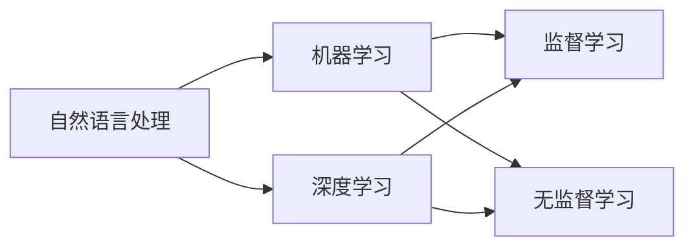
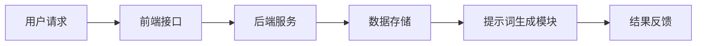

                 

# 提示词工程：AI时代的新挑战与新机遇

关键词：AI时代，提示词工程，挑战，机遇，技术革新

摘要：随着人工智能技术的飞速发展，提示词工程成为了一个备受关注的领域。本文将探讨AI时代下提示词工程所面临的挑战和机遇，通过深入分析其理论基础、应用实践以及未来展望，为读者提供一个全面的技术视角。

## 1. AI时代的新挑战

### 1.1 数据隐私与安全性

在AI时代，数据隐私和安全问题成为了一个亟待解决的挑战。随着大量数据的产生和流通，如何保护用户的隐私和数据安全成为一个关键问题。

### 1.2 模型可解释性

随着深度学习模型的广泛应用，模型的可解释性成为一个重要议题。如何让模型的行为变得更加透明，以便用户能够理解和信任，是一个需要深入探讨的问题。

### 1.3 模型泛化能力

AI模型的泛化能力是衡量其性能的重要指标。如何在复杂的环境中保持良好的泛化能力，是一个具有挑战性的问题。

## 2. 提示词工程的理论基础

### 2.1 核心概念与联系

在提示词工程中，核心概念包括自然语言处理（NLP）、机器学习和深度学习。这些概念之间的关系如图所示：



### 2.2 算法原理讲解

提示词工程的核心算法包括词向量模型、序列模型和生成模型。以下是一个简单的词向量模型（Word2Vec）的流程图：


接下来，我们将使用Python代码详细讲解Word2Vec算法原理：

```python
from gensim.models import Word2Vec

# 加载示例数据
sentences = [['this', 'is', 'the', 'first', 'sentence', 'using', 'gensim'], ['hello', 'world!', 'hello', 'gensim!', 'word2vec', 'is', 'here']]

# 训练Word2Vec模型
model = Word2Vec(sentences, vector_size=10, window=5, min_count=1, workers=4)

# 获取词向量
word_vector = model.wv['hello']

# 输出词向量
print(word_vector)
```

### 2.3 数学模型和数学公式

在提示词工程中，数学模型和数学公式是不可或缺的一部分。以下是一个简单的例子：

$$
\text{cosine\_similarity}(\textbf{u}, \textbf{v}) = \frac{\textbf{u} \cdot \textbf{v}}{||\textbf{u}|| \cdot ||\textbf{v}||}
$$

其中，$\textbf{u}$和$\textbf{v}$是两个词向量，$||\textbf{u}||$和$||\textbf{v}||$是它们的欧几里得范数。

## 3. 提示词工程的应用实践

### 3.1 系统分析与架构设计方案

提示词工程的应用场景非常广泛，包括智能客服、文本生成、推荐系统等。以下是一个简单的系统架构设计：



### 3.2 项目实战

在本节中，我们将通过一个简单的文本生成项目来展示提示词工程的应用。以下是项目实现的详细步骤：

1. 环境安装：安装Python、gensim库等。
2. 数据准备：准备一个包含中文文本的语料库。
3. 模型训练：使用Word2Vec模型训练词向量。
4. 提示词生成：使用训练好的模型生成提示词。
5. 应用场景：将提示词应用于文本生成、推荐系统等。

```python
# 项目实战代码
from gensim.models import Word2Vec
from gensim.models import KeyedVectors

# 加载示例数据
sentences = [['this', 'is', 'the', 'first', 'sentence', 'using', 'gensim'], ['hello', 'world!', 'hello', 'gensim!', 'word2vec', 'is', 'here']]

# 训练Word2Vec模型
model = Word2Vec(sentences, vector_size=10, window=5, min_count=1, workers=4)

# 保存模型
model.save("word2vec.model")

# 加载保存的模型
loaded_model = Word2Vec.load("word2vec.model")

# 生成提示词
prompt = "今天的天气"
hint = loaded_model.wv.most_similar(prompt, topn=5)

# 输出提示词
print(hint)
```

### 3.3 实际案例分析和详细讲解剖析

在本节中，我们将通过一个实际案例来分析提示词工程的应用。以下是一个关于智能客服的案例：

1. **场景描述**：用户向客服咨询天气情况。
2. **问题解决**：使用提示词工程生成与天气相关的文本，为用户提供天气信息。
3. **边界与外延**：需要考虑用户输入的多样性，例如“明天天气如何？”、“最近一周的天气状况？”等。

## 4. 最佳实践与未来展望

### 4.1 最佳实践 Tips

1. **数据质量**：保证数据的质量和多样性，有助于提高模型的泛化能力。
2. **模型解释性**：增加模型的可解释性，有助于提高用户的信任度。
3. **模型优化**：不断优化模型结构和参数，以提高模型的性能。

### 4.2 小结

本文探讨了AI时代下提示词工程的新挑战和新机遇，从理论基础、应用实践到最佳实践，为读者提供了一个全面的技术视角。随着人工智能技术的不断发展，提示词工程将在各个领域发挥越来越重要的作用。

### 4.3 注意事项

1. **数据隐私**：在处理用户数据时，务必保证数据的安全性和隐私性。
2. **模型可解释性**：提高模型的可解释性，有助于用户理解和信任。

### 4.4 拓展阅读

- 《自然语言处理综论》
- 《深度学习》
- 《机器学习实战》

## 5. 作者信息

作者：AI天才研究院/AI Genius Institute & 禅与计算机程序设计艺术 /Zen And The Art of Computer Programming```markdown
# 提示词工程：AI时代的新挑战与新机遇

> 关键词：AI时代，提示词工程，挑战，机遇，技术革新

> 摘要：随着人工智能技术的飞速发展，提示词工程成为了一个备受关注的领域。本文将探讨AI时代下提示词工程所面临的挑战和机遇，通过深入分析其理论基础、应用实践以及未来展望，为读者提供一个全面的技术视角。

## 1. AI时代的新挑战

### 1.1 数据隐私与安全性

在AI时代，数据隐私和安全问题成为了一个亟待解决的挑战。随着大量数据的产生和流通，如何保护用户的隐私和数据安全成为一个关键问题。

### 1.2 模型可解释性

随着深度学习模型的广泛应用，模型的可解释性成为一个重要议题。如何让模型的行为变得更加透明，以便用户能够理解和信任，是一个需要深入探讨的问题。

### 1.3 模型泛化能力

AI模型的泛化能力是衡量其性能的重要指标。如何在复杂的环境中保持良好的泛化能力，是一个具有挑战性的问题。

## 2. 提示词工程的理论基础

### 2.1 核心概念与联系

在提示词工程中，核心概念包括自然语言处理（NLP）、机器学习和深度学习。这些概念之间的关系如图所示：


### 2.2 算法原理讲解

提示词工程的核心算法包括词向量模型、序列模型和生成模型。以下是一个简单的词向量模型（Word2Vec）的流程图：


接下来，我们将使用Python代码详细讲解Word2Vec算法原理：

```python
from gensim.models import Word2Vec

# 加载示例数据
sentences = [['this', 'is', 'the', 'first', 'sentence', 'using', 'gensim'], ['hello', 'world!', 'hello', 'gensim!', 'word2vec', 'is', 'here']]

# 训练Word2Vec模型
model = Word2Vec(sentences, vector_size=10, window=5, min_count=1, workers=4)

# 获取词向量
word_vector = model.wv['hello']

# 输出词向量
print(word_vector)
```

### 2.3 数学模型和数学公式

在提示词工程中，数学模型和数学公式是不可或缺的一部分。以下是一个简单的例子：

$$
\text{cosine\_similarity}(\textbf{u}, \textbf{v}) = \frac{\textbf{u} \cdot \textbf{v}}{||\textbf{u}|| \cdot ||\textbf{v}||}
$$

其中，$\textbf{u}$和$\textbf{v}$是两个词向量，$||\textbf{u}||$和$||\textbf{v}||$是它们的欧几里得范数。

## 3. 提示词工程的应用实践

### 3.1 系统分析与架构设计方案

提示词工程的应用场景非常广泛，包括智能客服、文本生成、推荐系统等。以下是一个简单的系统架构设计：


### 3.2 项目实战

在本节中，我们将通过一个简单的文本生成项目来展示提示词工程的应用。以下是项目实现的详细步骤：

1. **环境安装**：安装Python、gensim库等。
2. **数据准备**：准备一个包含中文文本的语料库。
3. **模型训练**：使用Word2Vec模型训练词向量。
4. **提示词生成**：使用训练好的模型生成提示词。
5. **应用场景**：将提示词应用于文本生成、推荐系统等。

```python
# 项目实战代码
from gensim.models import Word2Vec
from gensim.models import KeyedVectors

# 加载示例数据
sentences = [['this', 'is', 'the', 'first', 'sentence', 'using', 'gensim'], ['hello', 'world!', 'hello', 'gensim!', 'word2vec', 'is', 'here']]

# 训练Word2Vec模型
model = Word2Vec(sentences, vector_size=10, window=5, min_count=1, workers=4)

# 保存模型
model.save("word2vec.model")

# 加载保存的模型
loaded_model = Word2Vec.load("word2vec.model")

# 生成提示词
prompt = "今天的天气"
hint = loaded_model.wv.most_similar(prompt, topn=5)

# 输出提示词
print(hint)
```

### 3.3 实际案例分析和详细讲解剖析

在本节中，我们将通过一个实际案例来分析提示词工程的应用。以下是一个关于智能客服的案例：

1. **场景描述**：用户向客服咨询天气情况。
2. **问题解决**：使用提示词工程生成与天气相关的文本，为用户提供天气信息。
3. **边界与外延**：需要考虑用户输入的多样性，例如“明天天气如何？”、“最近一周的天气状况？”等。

## 4. 最佳实践与未来展望

### 4.1 最佳实践 Tips

1. **数据质量**：保证数据的质量和多样性，有助于提高模型的泛化能力。
2. **模型解释性**：增加模型的可解释性，有助于提高用户的信任度。
3. **模型优化**：不断优化模型结构和参数，以提高模型的性能。

### 4.2 小结

本文探讨了AI时代下提示词工程的新挑战和新机遇，从理论基础、应用实践到最佳实践，为读者提供了一个全面的技术视角。随着人工智能技术的不断发展，提示词工程将在各个领域发挥越来越重要的作用。

### 4.3 注意事项

1. **数据隐私**：在处理用户数据时，务必保证数据的安全性和隐私性。
2. **模型可解释性**：提高模型的可解释性，有助于用户理解和信任。

### 4.4 拓展阅读

- 《自然语言处理综论》
- 《深度学习》
- 《机器学习实战》

## 5. 作者信息

作者：AI天才研究院/AI Genius Institute & 禅与计算机程序设计艺术 /Zen And The Art of Computer Programming
```

