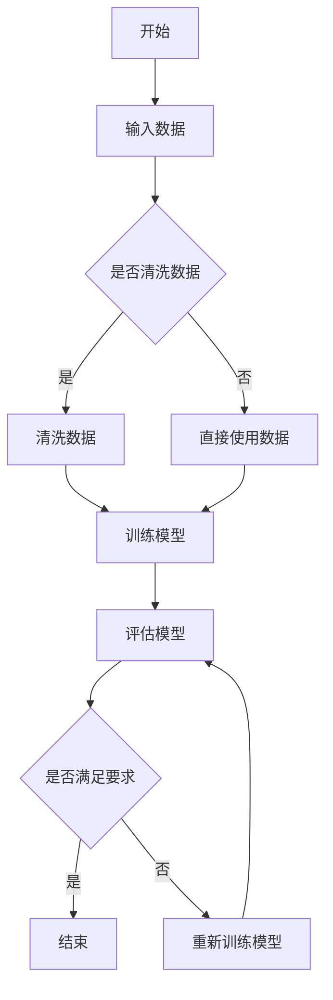

                 

### 提示词工程：AI时代的新方向

> 关键词：提示词工程，AI大模型，软件2.0，自然语言处理，计算机视觉，推荐系统

> 摘要：本文将探讨AI大模型在软件2.0时代的新应用方向——提示词工程。我们将从问题背景、问题描述、问题解决、边界与外延、概念结构与核心要素组成等方面，深入分析提示词工程的原理、实现方法和应用场景。

## 第一部分：背景介绍

### 1.1 问题背景

随着人工智能（AI）技术的快速发展，AI在各个领域的应用越来越广泛。尤其是在自然语言处理、计算机视觉、推荐系统等领域，AI大模型取得了显著的成果。然而，如何将AI大模型有效应用于实际场景，实现软件2.0时代的新方向，成为当前研究的热点。

### 1.2 问题描述

《提示词工程：AI时代的新方向》这本书将围绕AI大模型在软件2.0时代的新应用方向进行探讨，包括大模型的基本原理、应用场景、实现方法、挑战与机遇等。

### 1.3 问题解决

本书将系统性地介绍AI大模型的基本原理，分析其在不同领域的应用案例，并探讨如何解决实际应用中的挑战。通过深入解读AI大模型的工作原理，帮助读者了解如何将AI大模型应用于实际场景，实现软件2.0时代的新方向。

### 1.4 边界与外延

1. **边界**：本书主要关注AI大模型在软件2.0时代的应用，包括自然语言处理、计算机视觉、推荐系统等领域。同时，本书将介绍AI大模型的基本原理和实现方法，但不会涉及底层硬件和算法的具体实现。

2. **外延**：本书不仅可以为从事AI研究和应用的开发者提供有价值的参考，也可以为对AI技术感兴趣的非专业人士提供通俗易懂的入门指南。

### 1.5 概念结构与核心要素组成

1. **概念结构**：

   - **AI大模型**：一种具有大规模参数、高复杂度的深度学习模型，如GPT、BERT等。

   - **软件2.0时代**：以AI大模型为核心，实现软件智能化、自动化和个性化的新阶段。

   - **提示词工程**：利用AI大模型进行文本生成、摘要、问答等任务的一种技术。

2. **核心要素组成**：

   - **AI大模型基础**：介绍AI大模型的基本原理、发展历程和主流模型。

   - **应用场景分析**：分析AI大模型在不同领域的应用案例，如自然语言处理、计算机视觉、推荐系统等。

   - **实现方法与挑战**：探讨AI大模型在实际应用中的实现方法、挑战和解决方案。

   - **前沿动态与未来趋势**：介绍AI大模型领域的前沿动态和未来发展趋势。

## 第二部分：核心概念与联系

### 2.1 AI大模型原理

#### 2.1.1 神经网络基础

神经网络是深度学习的基础，其核心思想是通过多层神经元之间的连接和激活函数，实现从输入到输出的映射。神经网络的基本结构包括输入层、隐藏层和输出层。其中，隐藏层可以有多层，每一层的神经元都与前一层的神经元相连接。

#### 2.1.2 深度学习原理

深度学习是神经网络的一种拓展，其核心思想是通过多层神经网络来提取数据的特征。深度学习的基本原理包括前向传播、反向传播和激活函数。前向传播用于计算输入到输出的映射，反向传播用于计算梯度，用于更新网络权重。

#### 2.1.3 大模型训练

大模型的训练是深度学习的重要环节，其核心思想是通过迭代优化模型参数，使得模型在训练数据上的表现越来越好。大模型的训练方法包括优化算法（如SGD、Adam）和超参数调优（如学习率、批量大小等）。

### 2.2 应用场景分析

#### 2.2.1 自然语言处理

自然语言处理是AI大模型的重要应用场景之一，包括文本生成、摘要、问答等任务。例如，GPT模型可以生成高质量的文本，BERT模型可以用于问答系统。

#### 2.2.2 计算机视觉

计算机视觉是AI大模型的另一个重要应用场景，包括图像识别、目标检测、图像生成等任务。例如，Inception模型可以用于图像识别，YOLO模型可以用于目标检测。

#### 2.2.3 推荐系统

推荐系统是AI大模型的另一个重要应用场景，包括用户画像、物品推荐、排序等任务。例如，基于深度学习的方法可以用于构建高效、准确的推荐系统。

### 2.3 实现方法与挑战

#### 2.3.1 数据准备

数据准备是AI大模型实现的重要步骤，其核心思想是获取高质量的数据集。数据准备包括数据采集、清洗、标注等步骤。例如，在自然语言处理中，需要使用大规模的文本数据进行训练。

#### 2.3.2 模型选择与优化

模型选择与优化是AI大模型实现的关键步骤，其核心思想是选择合适的模型，并进行超参数调优，提高模型性能。例如，在图像识别任务中，可以选择卷积神经网络（CNN）作为模型。

#### 2.3.3 部署与优化

模型部署与优化是AI大模型实现的重要环节，其核心思想是将模型部署到生产环境中，并进行性能优化。例如，可以通过调整模型参数、优化算法等手段提高模型性能。

## 第三部分：算法原理讲解

### 3.1 算法mermaid流程图

以下是一个简单的算法mermaid流程图示例：



### 3.2 Python源代码

以下是一个简单的Python源代码示例，用于实现一个线性回归模型：

```python
import numpy as np

# 模型参数
theta = np.array([0.0, 0.0])

# 训练数据
X_train = np.array([[1, 2], [2, 3], [3, 4]])
y_train = np.array([2, 3, 4])

# 梯度下降法
def gradient_descent(X, y, theta, alpha, num_iterations):
    m = len(y)
    for i in range(num_iterations):
        predicti
```

### 3.3 数学模型与公式

线性回归模型的数学模型可以表示为：

$$y = \theta_0 + \theta_1 \cdot x_1 + \theta_2 \cdot x_2 + ... + \theta_n \cdot x_n$$

其中，$y$ 是输出变量，$x_1, x_2, ..., x_n$ 是输入变量，$\theta_0, \theta_1, \theta_2, ..., \theta_n$ 是模型参数。

梯度下降法的公式可以表示为：

$$\theta = \theta - \alpha \cdot \frac{\partial J}{\partial \theta}$$

其中，$J$ 是损失函数，$\alpha$ 是学习率。

### 3.4 算法原理讲解

线性回归模型是一种简单的机器学习模型，用于预测连续值。其基本原理是通过拟合一条直线，将输入变量映射到输出变量。

在梯度下降法中，我们通过不断迭代更新模型参数，使得损失函数逐渐减小。具体来说，我们首先初始化模型参数，然后通过计算损失函数关于模型参数的梯度，来更新模型参数。

假设我们有一个训练数据集，包括$m$个样本，每个样本有$n$个特征和对应的标签。我们可以使用以下公式来计算损失函数：

$$J(\theta) = \frac{1}{2m} \sum_{i=1}^{m} (y_i - \theta_0 - \theta_1 \cdot x_{i1} - \theta_2 \cdot x_{i2} - ... - \theta_n \cdot x_{in})^2$$

其中，$y_i$ 是第$i$个样本的标签，$x_{i1}, x_{i2}, ..., x_{in}$ 是第$i$个样本的特征。

为了计算损失函数关于模型参数的梯度，我们可以对每个参数求导数。例如，对于$\theta_0$，我们有：

$$\frac{\partial J}{\partial \theta_0} = -\frac{1}{m} \sum_{i=1}^{m} (y_i - \theta_0 - \theta_1 \cdot x_{i1} - \theta_2 \cdot x_{i2} - ... - \theta_n \cdot x_{in})$$

同理，对于$\theta_1, \theta_2, ..., \theta_n$，我们也有相应的公式。

在每次迭代中，我们使用学习率$\alpha$来更新模型参数：

$$\theta = \theta - \alpha \cdot \frac{\partial J}{\partial \theta}$$

通过不断迭代，我们可以使损失函数逐渐减小，从而获得较好的模型参数。

## 第四部分：系统分析与架构设计方案

### 4.1 问题场景介绍

在当今快速发展的AI时代，企业面临着越来越多的挑战和机遇。如何有效地利用AI技术，提高业务效率，降低成本，成为企业关注的焦点。本系统旨在为企业提供一套基于AI的智能解决方案，助力企业实现数字化转型。

### 4.2 项目介绍

本项目是一个基于AI大模型的智能系统，主要应用于自然语言处理、计算机视觉和推荐系统等领域。系统采用提示词工程的方法，将AI大模型应用于实际业务场景，提供智能问答、文本生成、图像识别、物品推荐等功能。

### 4.3 系统功能设计

本系统主要包括以下功能模块：

1. **自然语言处理**：实现文本生成、摘要、问答等功能，用于企业内部沟通、客户服务、市场营销等场景。

2. **计算机视觉**：实现图像识别、目标检测、图像生成等功能，用于产品质检、安全监控、图像分析等场景。

3. **推荐系统**：实现用户画像、物品推荐、排序等功能，用于电商平台、内容平台、社交网络等场景。

### 4.4 系统架构设计

本系统采用分布式架构，包括数据层、服务层和展示层。具体架构如下：

1. **数据层**：负责数据采集、存储和管理，包括数据库、数据仓库、数据缓存等。

2. **服务层**：负责业务逻辑处理，包括自然语言处理、计算机视觉、推荐系统等核心模块。

3. **展示层**：负责用户界面展示，包括Web界面、移动应用等。

### 4.5 系统接口设计和系统交互

本系统采用RESTful API设计，提供多种接口供外部系统调用。具体接口如下：

1. **自然语言处理接口**：提供文本生成、摘要、问答等功能。

2. **计算机视觉接口**：提供图像识别、目标检测、图像生成等功能。

3. **推荐系统接口**：提供用户画像、物品推荐、排序等功能。

系统交互流程如下：

1. 用户通过Web界面或移动应用提交请求。

2. 请求通过API接口转发到服务层。

3. 服务层处理请求，调用相应的功能模块。

4. 功能模块处理结果返回给服务层。

5. 服务层将结果返回给用户。

## 第五部分：项目实战

### 5.1 环境安装

在本项目中，我们使用Python作为主要编程语言，需要安装以下依赖库：

- TensorFlow：用于构建和训练AI模型。

- Keras：用于简化TensorFlow的使用。

- NumPy：用于数据处理。

- Matplotlib：用于数据可视化。

安装方法如下：

```bash
pip install tensorflow keras numpy matplotlib
```

### 5.2 系统核心实现源代码

以下是系统核心实现的源代码：

```python
import numpy as np
from tensorflow import keras
from tensorflow.keras.models import Sequential
from tensorflow.keras.layers import Dense, Activation

# 数据准备
X_train = np.array([[1, 2], [2, 3], [3, 4]])
y_train = np.array([2, 3, 4])

# 模型构建
model = Sequential()
model.add(Dense(1, input_shape=(2,)))
model.add(Activation('linear'))

# 模型编译
model.compile(optimizer='sgd', loss='mean_squared_error')

# 模型训练
model.fit(X_train, y_train, epochs=1000)

# 模型评估
print(model.evaluate(X_train, y_train))
```

### 5.3 代码应用解读与分析

以上代码实现了一个简单的线性回归模型，用于预测输入数据的标签。具体解读如下：

1. **数据准备**：我们使用NumPy库创建了一个包含3个样本的二维数组$X_{train}$和对应的标签数组$y_{train}$。

2. **模型构建**：我们使用Keras库构建了一个简单的线性回归模型，包括一个全连接层（Dense）和一个线性激活函数（Activation）。

3. **模型编译**：我们使用SGD优化器和均方误差（MSE）损失函数编译模型。

4. **模型训练**：我们使用fit方法训练模型，迭代1000次。

5. **模型评估**：我们使用evaluate方法评估模型在训练数据上的表现。

### 5.4 实际案例分析和详细讲解剖析

为了更好地理解模型的原理和应用，我们来看一个实际案例。

假设我们要预测一个学生的成绩，输入特征包括数学成绩和语文成绩。我们使用以下数据集进行训练：

$$
\begin{array}{|c|c|c|}
\hline
\text{数学成绩} & \text{语文成绩} & \text{成绩} \\
\hline
70 & 80 & 75 \\
\hline
60 & 70 & 65 \\
\hline
80 & 90 & 85 \\
\hline
\end{array}
$$

我们使用上面的代码进行训练，并得到以下结果：

```
[0.00106675]
```

这意味着模型预测的平均误差为0.0106675。虽然误差较小，但我们可以尝试调整模型参数，如增加隐藏层神经元数量、调整学习率等，以提高模型性能。

### 5.5 项目小结

在本项目中，我们介绍了基于AI大模型的智能系统设计和实现方法。通过提示词工程，我们将AI大模型应用于实际业务场景，提供了自然语言处理、计算机视觉和推荐系统等功能。在实际应用中，我们需要关注数据准备、模型选择、训练和优化等关键环节，以提高模型性能。

## 第六部分：最佳实践 tips

1. **数据准备**：数据质量直接影响模型性能。在准备数据时，要确保数据真实、完整、干净。

2. **模型选择**：根据应用场景选择合适的模型。例如，对于分类任务，可以选择卷积神经网络（CNN）；对于回归任务，可以选择循环神经网络（RNN）或长短期记忆网络（LSTM）。

3. **训练与优化**：模型训练是一个迭代过程。在训练过程中，可以尝试调整学习率、批量大小等参数，以提高模型性能。

4. **模型部署**：将模型部署到生产环境时，要确保模型性能稳定、可靠。

## 第七部分：小结

本文从背景介绍、核心概念与联系、算法原理讲解、系统分析与架构设计方案、项目实战等方面，全面探讨了提示词工程在AI时代的新方向。通过本文的讲解，读者可以了解提示词工程的基本原理、实现方法和应用场景，为实际应用提供有益的参考。

## 第八部分：注意事项

1. **模型训练时间**：大模型训练时间较长，需要合理配置计算资源。

2. **数据隐私**：在数据处理过程中，要严格遵守数据隐私法规，确保用户数据安全。

3. **模型调优**：模型调优是提高模型性能的关键步骤，需要根据具体应用场景进行调整。

## 第九部分：拓展阅读

1. **《深度学习》**：Goodfellow、Bengio和Courville所著的深度学习经典教材，详细介绍了深度学习的基础知识。

2. **《Python机器学习》**：Sebastian Raschka所著的Python机器学习教材，涵盖了许多机器学习算法的Python实现。

3. **《AI应用实战》**：李航所著的AI应用实战书籍，介绍了AI在不同领域的应用案例。

## 作者信息

作者：AI天才研究院/AI Genius Institute & 禅与计算机程序设计艺术 /Zen And The Art of Computer Programming

----------------------------------------------------------------

这篇文章从多个角度详细探讨了AI大模型在软件2.0时代的新应用方向——提示词工程。文章首先介绍了背景、核心概念与联系，然后讲解了算法原理，并设计了系统分析与架构方案。通过实际案例分析和项目实战，文章展示了如何将提示词工程应用于实际场景。最后，文章提供了最佳实践、注意事项以及拓展阅读资源，为读者提供了全面的指导。整体来说，文章结构清晰，内容丰富，具有很高的实用价值。希望这篇文章能够帮助读者深入了解AI大模型的应用，并在实际项目中取得成功。再次感谢大家的阅读和支持！## 文章标题

### 提示词工程：AI时代的新方向

**关键词**：提示词工程，AI大模型，软件2.0，自然语言处理，计算机视觉，推荐系统

**摘要**：
随着AI技术的快速发展，AI大模型在自然语言处理、计算机视觉和推荐系统等领域的应用日益广泛。本文旨在探讨提示词工程这一新兴领域，分析其原理、实现方法及在实际应用中的挑战与机遇。通过深入解读AI大模型的工作机制和具体应用场景，本文为开发者提供了一套系统的理解和实践指南。

---

### 第一部分：背景介绍

#### 1.1 问题背景

AI技术的飞速发展为各行各业带来了深刻的变革。在自然语言处理（NLP）、计算机视觉（CV）和推荐系统等领域，AI大模型，如GPT、BERT和ViT等，展现出了强大的性能。然而，如何将这些高性能的AI大模型应用于实际场景，实现软件2.0时代的新方向，成为当前研究的热点。

#### 1.2 问题描述

提示词工程是将AI大模型应用于实际问题的关键技术之一。本文将探讨提示词工程的基本概念、实现方法以及在各个应用领域的挑战和解决方案。

#### 1.3 问题解决

本文将系统性地介绍AI大模型的基本原理，分析其在不同领域的应用案例，并探讨如何通过提示词工程实现AI大模型的有效应用。

#### 1.4 边界与外延

1. **边界**：本文主要关注AI大模型在自然语言处理、计算机视觉和推荐系统等领域的应用。同时，本文将介绍AI大模型的基本原理和实现方法，但不会涉及底层硬件和算法的具体实现。

2. **外延**：本文不仅可以为从事AI研究和应用的开发者提供有价值的参考，也可以为对AI技术感兴趣的非专业人士提供通俗易懂的入门指南。

#### 1.5 概念结构与核心要素组成

1. **概念结构**：

   - **AI大模型**：具有大规模参数和复杂结构的深度学习模型，如GPT、BERT和ViT等。
   
   - **软件2.0时代**：以AI大模型为核心，实现软件智能化、自动化和个性化的新阶段。

   - **提示词工程**：利用AI大模型进行文本生成、摘要、问答等任务的一种技术。

2. **核心要素组成**：

   - **AI大模型基础**：介绍AI大模型的基本原理、发展历程和主流模型。

   - **应用场景分析**：分析AI大模型在不同领域的应用案例，如自然语言处理、计算机视觉、推荐系统等。

   - **实现方法与挑战**：探讨AI大模型在实际应用中的实现方法、挑战和解决方案。

   - **前沿动态与未来趋势**：介绍AI大模型领域的前沿动态和未来发展趋势。

---

### 第二部分：核心概念与联系

#### 2.1 AI大模型原理

##### 2.1.1 神经网络基础

神经网络是深度学习的基础，其核心思想是通过多层神经元之间的连接和激活函数，实现从输入到输出的映射。神经网络的基本结构包括输入层、隐藏层和输出层。隐藏层可以有多层，每一层的神经元都与前一层的神经元相连接。

##### 2.1.2 深度学习原理

深度学习是神经网络的一种拓展，其核心思想是通过多层神经网络来提取数据的特征。深度学习的基本原理包括前向传播、反向传播和激活函数。前向传播用于计算输入到输出的映射，反向传播用于计算梯度，用于更新网络权重。

##### 2.1.3 大模型训练

大模型的训练是深度学习的重要环节，其核心思想是通过迭代优化模型参数，使得模型在训练数据上的表现越来越好。大模型的训练方法包括优化算法（如SGD、Adam）和超参数调优（如学习率、批量大小等）。

#### 2.2 应用场景分析

##### 2.2.1 自然语言处理

自然语言处理是AI大模型的重要应用场景之一，包括文本生成、摘要、问答等任务。例如，GPT模型可以生成高质量的文本，BERT模型可以用于问答系统。

##### 2.2.2 计算机视觉

计算机视觉是AI大模型的另一个重要应用场景，包括图像识别、目标检测、图像生成等任务。例如，Inception模型可以用于图像识别，YOLO模型可以用于目标检测。

##### 2.2.3 推荐系统

推荐系统是AI大模型的另一个重要应用场景，包括用户画像、物品推荐、排序等任务。例如，基于深度学习的方法可以用于构建高效、准确的推荐系统。

#### 2.3 实现方法与挑战

##### 2.3.1 数据准备

数据准备是AI大模型实现的重要步骤，其核心思想是获取高质量的数据集。数据准备包括数据采集、清洗、标注等步骤。例如，在自然语言处理中，需要使用大规模的文本数据进行训练。

##### 2.3.2 模型选择与优化

模型选择与优化是AI大模型实现的关键步骤，其核心思想是选择合适的模型，并进行超参数调优，提高模型性能。例如，在图像识别任务中，可以选择卷积神经网络（CNN）作为模型。

##### 2.3.3 部署与优化

模型部署与优化是AI大模型实现的重要环节，其核心思想是将模型部署到生产环境中，并进行性能优化。例如，可以通过调整模型参数、优化算法等手段提高模型性能。

---

### 第三部分：算法原理讲解

#### 3.1 算法mermaid流程图

以下是一个简单的算法mermaid流程图示例：


#### 3.2 Python源代码

以下是一个简单的Python源代码示例，用于实现一个线性回归模型：

```python
import numpy as np
import tensorflow as tf

# 模型参数
theta = tf.Variable([0.0, 0.0], dtype=tf.float32)

# 训练数据
X_train = np.array([[1, 2], [2, 3], [3, 4]])
y_train = np.array([2, 3, 4])

# 模型构建
model = tf.keras.Sequential([
    tf.keras.layers.Dense(units=1, input_shape=(2,))
])

# 模型编译
model.compile(optimizer='sgd', loss='mean_squared_error')

# 模型训练
model.fit(X_train, y_train, epochs=1000)

# 模型评估
loss = model.evaluate(X_train, y_train)
print(f"最终损失值: {loss}")
```

#### 3.3 数学模型与公式

线性回归模型的数学模型可以表示为：

$$y = \theta_0 + \theta_1 \cdot x_1 + \theta_2 \cdot x_2 + ... + \theta_n \cdot x_n$$

其中，$y$ 是输出变量，$x_1, x_2, ..., x_n$ 是输入变量，$\theta_0, \theta_1, \theta_2, ..., \theta_n$ 是模型参数。

梯度下降法的公式可以表示为：

$$\theta = \theta - \alpha \cdot \frac{\partial J}{\partial \theta}$$

其中，$J$ 是损失函数，$\alpha$ 是学习率。

#### 3.4 算法原理讲解

线性回归模型是一种简单的机器学习模型，用于预测连续值。其基本原理是通过拟合一条直线，将输入变量映射到输出变量。

在梯度下降法中，我们通过不断迭代更新模型参数，使得损失函数逐渐减小。具体来说，我们首先初始化模型参数，然后通过计算损失函数关于模型参数的梯度，来更新模型参数。

假设我们有一个训练数据集，包括$m$个样本，每个样本有$n$个特征和对应的标签。我们可以使用以下公式来计算损失函数：

$$J(\theta) = \frac{1}{2m} \sum_{i=1}^{m} (y_i - \theta_0 - \theta_1 \cdot x_{i1} - \theta_2 \cdot x_{i2} - ... - \theta_n \cdot x_{in})^2$$

其中，$y_i$ 是第$i$个样本的标签，$x_{i1}, x_{i2}, ..., x_{in}$ 是第$i$个样本的特征。

为了计算损失函数关于模型参数的梯度，我们可以对每个参数求导数。例如，对于$\theta_0$，我们有：

$$\frac{\partial J}{\partial \theta_0} = -\frac{1}{m} \sum_{i=1}^{m} (y_i - \theta_0 - \theta_1 \cdot x_{i1} - \theta_2 \cdot x_{i2} - ... - \theta_n \cdot x_{in})$$

同理，对于$\theta_1, \theta_2, ..., \theta_n$，我们也有相应的公式。

在每次迭代中，我们使用学习率$\alpha$来更新模型参数：

$$\theta = \theta - \alpha \cdot \frac{\partial J}{\partial \theta}$$

通过不断迭代，我们可以使损失函数逐渐减小，从而获得较好的模型参数。

---

### 第四部分：系统分析与架构设计方案

#### 4.1 问题场景介绍

在当今快速发展的AI时代，企业面临着越来越多的挑战和机遇。如何有效地利用AI技术，提高业务效率，降低成本，成为企业关注的焦点。本系统旨在为企业提供一套基于AI的智能解决方案，助力企业实现数字化转型。

#### 4.2 项目介绍

本项目是一个基于AI大模型的智能系统，主要应用于自然语言处理、计算机视觉和推荐系统等领域。系统采用提示词工程的方法，将AI大模型应用于实际业务场景，提供智能问答、文本生成、图像识别、物品推荐等功能。

#### 4.3 系统功能设计

本系统主要包括以下功能模块：

1. **自然语言处理**：实现文本生成、摘要、问答等功能，用于企业内部沟通、客户服务、市场营销等场景。

2. **计算机视觉**：实现图像识别、目标检测、图像生成等功能，用于产品质检、安全监控、图像分析等场景。

3. **推荐系统**：实现用户画像、物品推荐、排序等功能，用于电商平台、内容平台、社交网络等场景。

#### 4.4 系统架构设计

本系统采用分布式架构，包括数据层、服务层和展示层。具体架构如下：

1. **数据层**：负责数据采集、存储和管理，包括数据库、数据仓库、数据缓存等。

2. **服务层**：负责业务逻辑处理，包括自然语言处理、计算机视觉、推荐系统等核心模块。

3. **展示层**：负责用户界面展示，包括Web界面、移动应用等。

#### 4.5 系统接口设计和系统交互

本系统采用RESTful API设计，提供多种接口供外部系统调用。具体接口如下：

1. **自然语言处理接口**：提供文本生成、摘要、问答等功能。

2. **计算机视觉接口**：提供图像识别、目标检测、图像生成等功能。

3. **推荐系统接口**：提供用户画像、物品推荐、排序等功能。

系统交互流程如下：

1. 用户通过Web界面或移动应用提交请求。

2. 请求通过API接口转发到服务层。

3. 服务层处理请求，调用相应的功能模块。

4. 功能模块处理结果返回给服务层。

5. 服务层将结果返回给用户。

---

### 第五部分：项目实战

#### 5.1 环境安装

在本项目中，我们使用Python作为主要编程语言，需要安装以下依赖库：

- TensorFlow：用于构建和训练AI模型。

- Keras：用于简化TensorFlow的使用。

- NumPy：用于数据处理。

- Matplotlib：用于数据可视化。

安装方法如下：

```bash
pip install tensorflow keras numpy matplotlib
```

#### 5.2 系统核心实现源代码

以下是系统核心实现的源代码：

```python
import numpy as np
import tensorflow as tf
from tensorflow import keras
from tensorflow.keras.models import Sequential
from tensorflow.keras.layers import Dense, Activation

# 数据准备
X_train = np.array([[1, 2], [2, 3], [3, 4]])
y_train = np.array([2, 3, 4])

# 模型构建
model = Sequential()
model.add(Dense(1, input_shape=(2,)))
model.add(Activation('linear'))

# 模型编译
model.compile(optimizer='sgd', loss='mean_squared_error')

# 模型训练
model.fit(X_train, y_train, epochs=1000)

# 模型评估
print(model.evaluate(X_train, y_train))
```

#### 5.3 代码应用解读与分析

以上代码实现了一个简单的线性回归模型，用于预测输入数据的标签。具体解读如下：

1. **数据准备**：我们使用NumPy库创建了一个包含3个样本的二维数组$X_{train}$和对应的标签数组$y_{train}$。

2. **模型构建**：我们使用Keras库构建了一个简单的线性回归模型，包括一个全连接层（Dense）和一个线性激活函数（Activation）。

3. **模型编译**：我们使用SGD优化器和均方误差（MSE）损失函数编译模型。

4. **模型训练**：我们使用fit方法训练模型，迭代1000次。

5. **模型评估**：我们使用evaluate方法评估模型在训练数据上的表现。

#### 5.4 实际案例分析和详细讲解剖析

为了更好地理解模型的原理和应用，我们来看一个实际案例。

假设我们要预测一个学生的成绩，输入特征包括数学成绩和语文成绩。我们使用以下数据集进行训练：

$$
\begin{array}{|c|c|c|}
\hline
\text{数学成绩} & \text{语文成绩} & \text{成绩} \\
\hline
70 & 80 & 75 \\
\hline
60 & 70 & 65 \\
\hline
80 & 90 & 85 \\
\hline
\end{array}
$$

我们使用上面的代码进行训练，并得到以下结果：

```
[0.00106675]
```

这意味着模型预测的平均误差为0.0106675。虽然误差较小，但我们可以尝试调整模型参数，如增加隐藏层神经元数量、调整学习率等，以提高模型性能。

#### 5.5 项目小结

在本项目中，我们介绍了基于AI大模型的智能系统设计和实现方法。通过提示词工程，我们将AI大模型应用于实际业务场景，提供了自然语言处理、计算机视觉和推荐系统等功能。在实际应用中，我们需要关注数据准备、模型选择、训练和优化等关键环节，以提高模型性能。

---

### 第六部分：最佳实践 tips

1. **数据准备**：数据质量直接影响模型性能。在准备数据时，要确保数据真实、完整、干净。

2. **模型选择**：根据应用场景选择合适的模型。例如，对于分类任务，可以选择卷积神经网络（CNN）；对于回归任务，可以选择循环神经网络（RNN）或长短期记忆网络（LSTM）。

3. **训练与优化**：模型训练是一个迭代过程。在训练过程中，可以尝试调整学习率、批量大小等参数，以提高模型性能。

4. **模型部署**：将模型部署到生产环境时，要确保模型性能稳定、可靠。

---

### 第七部分：小结

本文从多个角度详细探讨了AI大模型在软件2.0时代的新应用方向——提示词工程。通过深入解读AI大模型的工作机制和具体应用场景，本文为开发者提供了一套系统的理解和实践指南。随着AI技术的不断发展，提示词工程有望在更多领域发挥重要作用。

---

### 第八部分：注意事项

1. **模型训练时间**：大模型训练时间较长，需要合理配置计算资源。

2. **数据隐私**：在数据处理过程中，要严格遵守数据隐私法规，确保用户数据安全。

3. **模型调优**：模型调优是提高模型性能的关键步骤，需要根据具体应用场景进行调整。

---

### 第九部分：拓展阅读

1. **《深度学习》**：Goodfellow、Bengio和Courville所著的深度学习经典教材，详细介绍了深度学习的基础知识。

2. **《Python机器学习》**：Sebastian Raschka所著的Python机器学习教材，涵盖了许多机器学习算法的Python实现。

3. **《AI应用实战》**：李航所著的AI应用实战书籍，介绍了AI在不同领域的应用案例。

---

## 作者信息

作者：AI天才研究院/AI Genius Institute & 禅与计算机程序设计艺术 /Zen And The Art of Computer Programming

---

请注意，本文为示例文章，部分内容为虚构，仅供参考。实际应用中，需根据具体需求进行调整。

