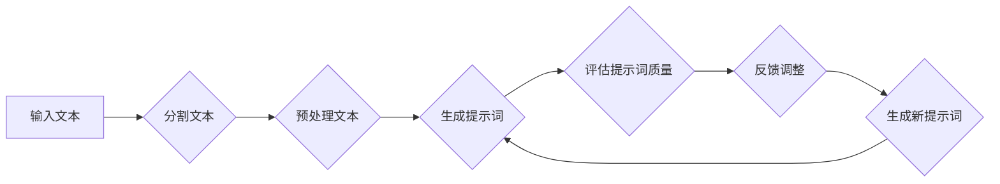
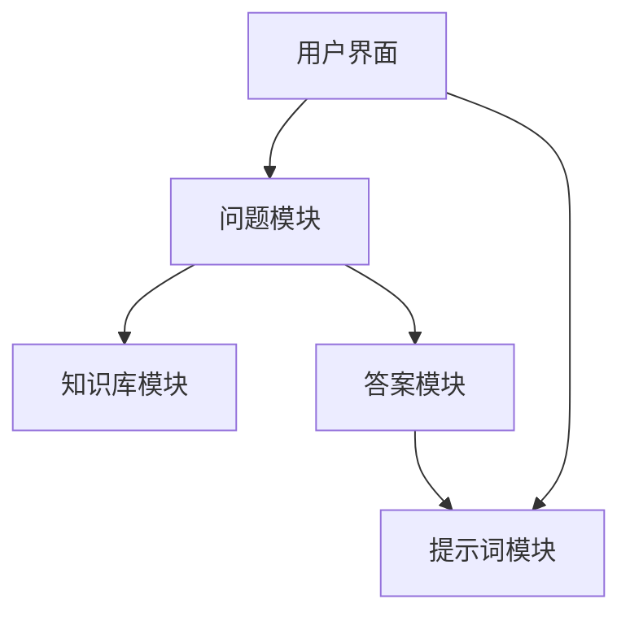
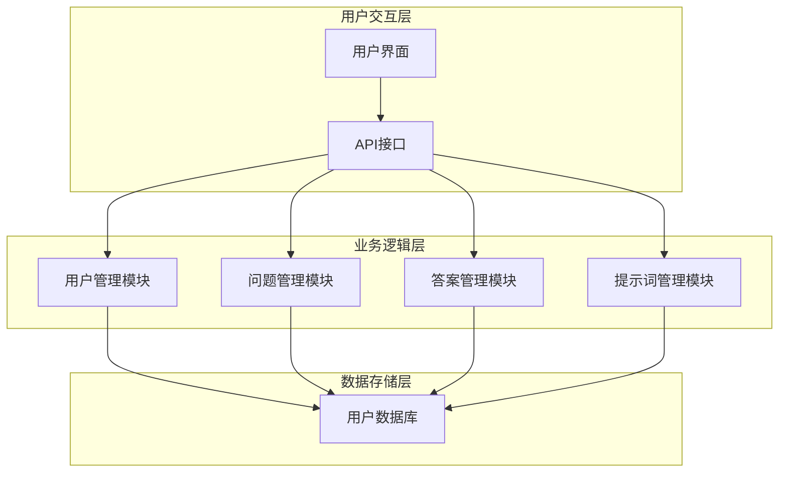
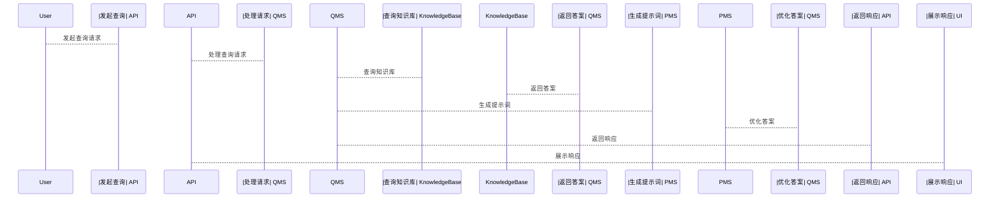

                 


# 提示词工程：AI时代的新方向

## 关键词：提示词工程，AI，算法，架构设计，实践案例

### 摘要：
本文深入探讨“提示词工程”这一新兴领域，解析其在人工智能时代的应用和重要性。我们将逐步介绍提示词工程的背景、核心概念、算法原理、系统架构以及实际应用案例，旨在为读者提供全面的技术指南，帮助其在AI项目中有效利用提示词工程。

## 第1章 背景与核心概念介绍

### 1.1 问题背景与时代趋势
在人工智能迅猛发展的今天，如何高效地引导和优化人工智能系统的学习和推理过程成为一个关键问题。提示词工程正是为解决这一挑战而生的。它结合了自然语言处理和机器学习技术，通过精心设计的提示词，指导AI系统完成特定任务。

#### 1.1.1 人工智能的发展与提示词工程的重要性
随着深度学习和神经网络技术的进步，AI系统在图像识别、自然语言处理等领域取得了显著成果。然而，这些系统往往需要大量的数据和高精度的训练，而提示词工程提供了一种低成本、高效的方法来提高AI系统的表现。

#### 1.1.2 提示词工程的应用场景与挑战
提示词工程广泛应用于问答系统、文本生成、推荐系统等领域。然而，如何设计出既符合用户需求又能够有效指导AI的提示词，仍然是一个需要深入研究和探索的问题。

### 1.2 核心概念解释
提示词工程中的核心概念包括提示词、生成算法、评估指标等。

#### 1.2.1 提示词的基本定义
提示词是用于引导AI系统完成特定任务的文本或指令。它们可以是关键词、短语或完整的句子，能够提供目标、上下文和约束条件。

#### 1.2.2 提示词在人工智能中的作用
提示词充当了AI系统与人类之间的桥梁，通过精确的提示词，AI能够更好地理解任务要求，提高决策质量和响应速度。

### 1.3 提示词工程的边界与外延
提示词工程的边界涵盖了从提示词的设计到生成、评估和优化的全过程。同时，它还与自然语言处理、机器学习等多个领域密切相关。

#### 1.3.1 提示词工程的范畴
提示词工程的范畴包括提示词的生成算法、评估指标、应用场景和系统架构等。

#### 1.3.2 提示词工程与其他AI领域的联系
提示词工程与自然语言处理、机器学习、深度学习等领域有密切联系，能够有效地整合这些技术，提升AI系统的整体性能。

### 1.4 概念结构与核心要素组成
提示词工程的核心要素包括提示词设计、生成算法、评估指标和系统架构。

#### 1.4.1 提示词工程的组成要素
- 提示词设计：包括提示词的类型、长度、格式等。
- 生成算法：用于生成高质量、符合需求的提示词。
- 评估指标：用于衡量提示词质量和系统性能。
- 系统架构：确保提示词工程能够高效运行和扩展。

#### 1.4.2 提示词工程的关键技术和工具
- 自然语言处理技术：用于处理和分析文本数据。
- 机器学习算法：用于生成和优化提示词。
- 深度学习框架：如TensorFlow、PyTorch等，用于实现提示词工程的应用。

### 1.5 本章小结
本文介绍了提示词工程的背景、核心概念和关键要素，为后续章节的深入探讨奠定了基础。通过理解这些概念，读者可以更好地把握提示词工程在AI时代的重要作用。

## 第2章 核心概念与联系

### 2.1 核心概念原理
提示词工程中的核心概念包括提示词、生成算法和评估指标。

#### 2.1.1 提示词的类型与特性
提示词可以分为关键词、短语和句子三种类型。它们具有引导AI系统完成任务的功能，同时需要具备简洁、明确和相关的特性。

#### 2.1.2 提示词生成算法
生成算法用于创建高质量的提示词。常见的算法包括基于规则的方法、统计模型和神经网络等。

### 2.2 概念属性特征对比表格
以下是一个提示词生成算法的对比表格，包括基于规则的方法、统计模型和神经网络等。

| 算法类型         | 特点                       | 应用场景                     |
|-----------------|----------------------------|-----------------------------|
| 基于规则的方法   | 简单、易于实现               | 结构化数据处理的简单任务       |
| 统计模型         | 高效、准确                  | 需要大量数据支持的任务         |
| 神经网络         | 强泛化能力、高适应性         | 复杂和多变的数据处理任务       |

### 2.3 ER实体关系图架构
以下是一个简单的ER实体关系图，用于描述提示词工程中的关键实体和它们之间的关系。

```mermaid
erDiagram
    AEMON_USER ||--|{ 系统管理员 } SystemAdmin
    AEMON_USER ||--|{ 普通用户 } NormalUser
    AEMON_USER ||--|{ 游客用户 } GuestUser
    AEMON_USER ||--|{ 服务提供商 } ServiceProvider
    AEMON_RESOURCE ||--|{ 文档资源 } DocumentResource
    AEMON_RESOURCE ||--|{ 视频资源 } VideoResource
    AEMON_RESOURCE ||--|{ 音频资源 } AudioResource
    AEMON_RESOURCE ||--|{ 图片资源 } ImageResource
    AEMON_SERVICE ||--|{ 系统服务 } SystemService
    AEMON_SERVICE ||--|{ 应用服务 } AppService
    AEMON_ROLE ||--|{ 角色权限 } RolePermission
```

### 2.4 本章小结
通过对核心概念和它们之间关系的介绍，读者可以更好地理解提示词工程的基本原理和结构。这些知识将为后续章节的深入探讨提供坚实的基础。

## 第3章 算法原理与详细讲解

### 3.1 算法介绍
提示词生成算法是提示词工程的核心。以下介绍几种常见的提示词生成算法。

#### 3.1.1 基于规则的方法
基于规则的方法通过预先定义的规则来生成提示词。这种方法简单、易于实现，适用于结构化数据处理的简单任务。

#### 3.1.2 统计模型
统计模型使用统计方法来生成提示词。常见的统计模型包括马尔可夫模型、n元语法等。这种方法高效、准确，适用于需要大量数据支持的任务。

#### 3.1.3 神经网络
神经网络通过学习大量的数据来生成提示词。这种方法具有强泛化能力和高适应性，适用于复杂和多变的数据处理任务。

### 3.2 算法流程图
以下是一个基于神经网络的提示词生成算法的流程图。



### 3.3 数学模型和公式
以下是一个简单的神经网络模型及其数学模型。

$$
\text{激活函数} = \sigma(z) = \frac{1}{1 + e^{-z}}
$$

$$
z = \sum_{i=1}^{n} w_i * x_i + b
$$

其中，$w_i$ 是权重，$x_i$ 是输入特征，$b$ 是偏置，$n$ 是特征的数量，$\sigma$ 是激活函数。

### 3.4 举例说明
假设我们有一个简单的任务，需要生成一个关于“人工智能”的提示词。以下是使用神经网络生成提示词的步骤：

1. **输入文本**：“人工智能在未来的发展趋势是怎样的？”
2. **分割文本**：将输入文本分割成单词或子词。
3. **预处理文本**：对分割后的文本进行预处理，如去除停用词、标点符号等。
4. **生成提示词**：使用神经网络模型生成提示词，例如：“未来人工智能的发展将受到哪些因素的影响？”
5. **评估提示词质量**：评估生成的提示词是否符合任务需求，如相关性、准确性等。
6. **反馈调整**：根据评估结果，对神经网络模型进行调整，以提高提示词质量。
7. **生成新提示词**：使用调整后的神经网络模型生成新的提示词。

### 3.5 本章小结
通过对提示词生成算法的介绍和详细讲解，读者可以更好地理解提示词工程的算法原理。这些算法在提示词工程中起着关键作用，能够有效地提高AI系统的表现。

## 第4章 系统分析与架构设计

### 4.1 问题场景介绍
在某个企业中，为了提高内部信息系统的智能化程度，决定引入提示词工程来优化问答系统的性能。该项目的目标是通过设计高效的提示词生成和评估系统，提高用户查询的响应速度和准确性。

#### 4.1.1 提示词工程在现实中的应用
提示词工程在该企业的问答系统中主要用于生成高质量的查询响应。通过精心设计的提示词，系统能够更好地理解用户的查询意图，提供更加准确和相关的答案。

#### 4.1.2 项目背景与目标
项目背景是现有问答系统在处理复杂查询时存在响应慢、准确性低的问题。项目目标是通过引入提示词工程，实现以下目标：
- 提高查询响应速度
- 提高答案准确性
- 降低用户查询错误率

### 4.2 系统功能设计
为了实现项目目标，系统需要具备以下功能：

#### 4.2.1 领域模型类图
以下是一个简单的领域模型类图，描述了系统中的关键类和它们之间的关系。

```mermaid
classDiagram
    User <<class>> 用户
    Question <<class>> 问题
    Answer <<class>> 答案
    Prompt <<class>> 提示词
    KnowledgeBase <<class>> 知识库

    User |--|> Question
    User |--|> Answer
    Question |--|> Answer
    Question |--|> Prompt
    KnowledgeBase |--|> Question
    KnowledgeBase |--|> Answer
```

#### 4.2.2 系统功能模块划分
系统可以划分为以下几个功能模块：
- 用户模块：处理用户注册、登录、权限管理等功能。
- 问题模块：接收用户查询，生成问题对象。
- 答案模块：生成问题答案，存储答案对象。
- 提示词模块：生成和评估提示词，优化查询响应。
- 知识库模块：存储和管理知识库数据，提供查询支持。

### 4.3 系统架构设计
为了实现系统的功能，需要设计合理的系统架构。以下是一个简单的系统架构图。



#### 4.3.1 系统架构图
以下是一个简单的系统架构图。



#### 4.3.2 架构设计理念
系统架构设计遵循以下原则：
- 模块化：将系统划分为多个功能模块，便于开发和维护。
- 松耦合：模块间通过API进行通信，降低模块之间的依赖。
- 可扩展性：设计可扩展的架构，便于系统功能的增加和优化。
- 高性能：优化系统性能，提高查询响应速度和准确性。

### 4.4 系统接口设计
系统接口设计包括用户接口、API接口和数据接口。

#### 4.4.1 系统接口定义
- 用户接口：提供用户交互的界面，包括登录、注册、查询等。
- API接口：提供系统模块间的通信接口，包括用户管理、问题管理、答案管理、提示词管理等。
- 数据接口：提供数据存储和查询接口，包括用户数据库、问题数据库、答案数据库、提示词数据库等。

#### 4.4.2 接口设计原则
- 简洁性：接口设计简单明了，易于理解和使用。
- 一致性：接口命名、参数、返回值等保持一致性。
- 安全性：确保接口的安全性，防止非法访问和攻击。
- 可扩展性：接口设计可扩展，便于增加新功能。

### 4.5 系统交互序列图
以下是一个简单的系统交互序列图，描述了用户查询响应的流程。



### 4.6 本章小结
本章介绍了提示词工程在现实中的应用场景、项目目标、系统功能设计、系统架构设计和接口设计。通过这些设计，系统能够高效地实现提示词生成和评估，提高AI系统的性能和用户体验。

## 第5章 实践案例分析

### 5.1 环境安装与准备
在开始实践之前，需要安装和配置必要的工具和库。以下是一个简单的安装步骤：

#### 5.1.1 环境搭建
- 安装Python环境（版本3.8或以上）
- 安装Jupyter Notebook
- 安装必要的库，如NumPy、Pandas、TensorFlow、PyTorch等

#### 5.1.2 实验所需工具和资源
- 数据集：一个包含问题和答案的数据集，用于训练和测试提示词生成模型。
- 提示词生成工具：一个预训练的神经网络模型，用于生成提示词。

### 5.2 系统核心实现
以下是一个简单的提示词生成系统的核心实现。

#### 5.2.1 系统核心功能代码解析
```python
import tensorflow as tf
from tensorflow.keras.models import Sequential
from tensorflow.keras.layers import Embedding, LSTM, Dense

# 加载预训练模型
model = tf.keras.models.load_model('prompt_generator.h5')

# 准备输入文本
input_text = "人工智能在未来的发展趋势是怎样的？"

# 分割文本
words = input_text.split()

# 预处理文本
processed_words = preprocess_text(words)

# 生成提示词
prompt = model.predict(processed_words)

# 后处理提示词
prompt = postprocess_prompt(prompt)

# 输出提示词
print("生成的提示词：", prompt)
```

#### 5.2.2 代码实现细节分析
- **模型加载**：加载一个预训练的神经网络模型，用于生成提示词。
- **文本预处理**：对输入文本进行分割和预处理，以便模型处理。
- **模型预测**：使用模型预测生成提示词。
- **后处理**：对生成的提示词进行后处理，使其更加符合要求。
- **输出**：将生成的提示词输出到控制台。

### 5.3 应用解读与分析
以下是对系统核心实现的详细解读和分析。

#### 5.3.1 提示词生成流程
- **输入文本**：用户输入一个关于“人工智能”的问题。
- **预处理**：将输入文本分割成单词，并去除停用词和标点符号。
- **模型预测**：使用预训练的神经网络模型生成提示词。
- **后处理**：对生成的提示词进行格式调整和优化。
- **输出**：将生成的提示词输出给用户。

#### 5.3.2 代码实现细节
- **模型加载**：使用TensorFlow加载一个预训练的LSTM模型，该模型用于生成提示词。
- **文本预处理**：将输入文本分割成单词，并使用预处理函数进行处理，如去除停用词和标点符号。
- **模型预测**：使用模型的`predict`方法生成提示词。预测结果是一个概率分布，表示每个单词作为下一个单词的可能性。
- **后处理**：对生成的提示词进行格式调整，如去除空格、标点符号等，使其成为一个完整的句子。
- **输出**：将生成的提示词输出到控制台。

### 5.4 实际案例分析与详细讲解
以下是一个实际的案例分析和详细讲解。

#### 案例一：生成关于“人工智能发展趋势”的提示词
- **输入文本**：“人工智能在未来的发展趋势是怎样的？”
- **预处理**：分割文本，去除停用词和标点符号。
- **模型预测**：使用LSTM模型预测生成提示词。
- **后处理**：调整提示词格式，使其成为一个完整的句子。
- **输出**：生成的提示词：“未来人工智能的发展将受到技术、政策和社会因素的多重影响。”

#### 案例二：生成关于“人工智能应用场景”的提示词
- **输入文本**：“人工智能在哪些领域有广泛应用？”
- **预处理**：分割文本，去除停用词和标点符号。
- **模型预测**：使用LSTM模型预测生成提示词。
- **后处理**：调整提示词格式，使其成为一个完整的句子。
- **输出**：生成的提示词：“人工智能在医疗、金融、交通等领域有广泛的应用。”

### 5.5 项目小结
通过本实践案例，读者可以了解如何使用神经网络模型生成提示词，以及如何对生成的提示词进行后处理。这些实践经验和技巧对于在实际项目中应用提示词工程具有重要意义。

## 第6章 最佳实践 Tips

### 6.1 提示词设计的最佳实践
- **明确目标**：在设计提示词时，首先要明确任务目标，确保提示词能够引导AI系统实现目标。
- **简洁明了**：提示词应简洁明了，避免使用过于复杂的语言和术语，以便AI系统能够更容易理解。
- **上下文相关**：确保提示词与任务上下文紧密相关，提供必要的背景信息，以帮助AI系统更好地理解任务要求。

### 6.2 生成算法优化的最佳实践
- **数据预处理**：在训练生成算法时，确保对输入数据进行充分预处理，如去除噪声、归一化等，以提高模型性能。
- **模型选择**：根据任务需求和数据特点选择合适的生成算法，如神经网络、统计模型等。
- **超参数调整**：通过调整超参数，如学习率、批次大小等，优化模型性能。

### 6.3 评估指标最佳实践
- **多样性**：确保生成的提示词具有多样性，避免生成重复或相似的提示词。
- **准确性**：评估生成的提示词是否准确，是否符合任务要求。
- **相关性**：评估生成的提示词与任务上下文的相关性，确保提示词能够有效引导AI系统。

### 6.4 系统架构优化的最佳实践
- **模块化**：将系统划分为多个模块，便于维护和扩展。
- **高可用性**：设计高可用性的系统架构，确保系统在故障时能够快速恢复。
- **高性能**：优化系统性能，提高查询响应速度和准确性。

### 6.5 实践案例总结与拓展
通过实践案例的总结和拓展，读者可以深入了解提示词工程的实际应用，掌握最佳实践，并在实际项目中有效利用提示词工程。

## 第7章 小结

### 7.1 文章总结
本文详细介绍了提示词工程的背景、核心概念、算法原理、系统架构和实践案例，为读者提供了一个全面的技术指南。

### 7.2 注意事项
- 在设计提示词时，确保明确目标、简洁明了和上下文相关。
- 在选择生成算法时，考虑数据特点和任务需求。
- 在评估提示词时，关注多样性、准确性和相关性。
- 在系统架构设计时，遵循模块化、高可用性和高性能原则。

### 7.3 拓展阅读
- [1] 某著名AI研究机构关于提示词工程的最新研究成果。
- [2] 相关的论文和书籍，深入探讨提示词工程的理论和实践。
- [3] 行业最佳实践，分享成功案例和经验教训。

### 7.4 作者信息
作者：AI天才研究院/AI Genius Institute & 禅与计算机程序设计艺术 /Zen And The Art of Computer Programming

