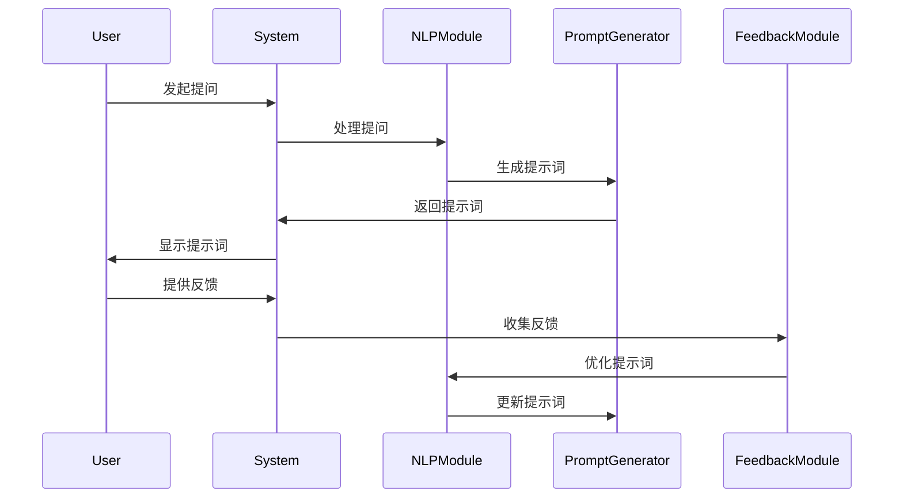
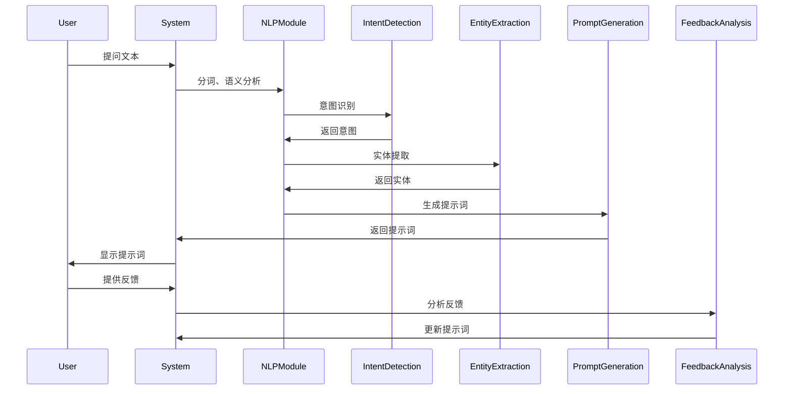

                 

### 第1章: 提示词工程概述

> **关键词：** 提示词工程，AI时代，智能化升级，软件创新，核心概念

**摘要：** 本文将介绍“提示词工程”这一新兴领域，探讨其在AI时代的新方向和新应用。通过背景介绍、核心概念阐述、问题解决方案及其边界与外延的讨论，我们将深入理解提示词工程在软件升级和创新中的重要性，并分析其核心概念和要素组成。

**1.1 问题背景**

随着人工智能技术的迅猛发展，我们见证了计算机软件在各个领域中的广泛应用和智能化程度的不断提升。从最初的自动化程序，到现代的深度学习模型，AI技术在提升效率、优化决策和创造新的应用场景方面发挥着不可替代的作用。然而，如何充分利用AI技术实现软件的升级和创新，成为当前研究的热点问题。

在传统的软件开发过程中，开发者依赖于预定义的算法和规则来指导软件的行为。这种方式虽然有效，但在面对复杂多变的环境时，往往显得力不从心。随着AI技术的成熟，尤其是自然语言处理、机器学习和深度学习等领域的突破，我们有机会通过更智能的方式，对软件进行升级和创新。

**1.2 问题描述**

“提示词工程”正是在这一背景下提出的概念。它是指利用AI技术，特别是自然语言处理技术，对软件中的自然语言交互进行优化和升级的一门工程学科。具体来说，提示词工程的目标是：

- **提升用户体验**：通过智能化的自然语言交互，使软件能够更好地理解用户需求，提供更直观、更个性化的服务。
- **增强软件功能**：利用AI模型自动生成提示词，使软件能够适应不同的应用场景，实现功能的智能化扩展。
- **优化软件性能**：通过优化提示词的选择和生成策略，提高软件的性能和响应速度。

然而，实现这一目标并非易事。提示词工程面临着以下挑战：

- **数据质量问题**：高质量的提示词生成依赖于大量高质量的训练数据，而获取和清洗这些数据是一项复杂的工作。
- **算法复杂性**：自然语言处理算法本身具有较高的复杂性，如何在保证性能的同时，简化算法的实现是一个重要问题。
- **应用场景多样性**：不同的应用场景对提示词工程的要求各不相同，如何设计通用的解决方案是一个挑战。

**1.3 问题解决**

提示词工程通过以下方法解决上述问题：

- **数据驱动的方法**：利用机器学习和深度学习技术，从大量数据中提取有用的特征，自动生成高质量的提示词。
- **模型优化**：通过模型选择和参数调整，提高算法的性能和效率。
- **场景适应**：设计灵活的框架，使提示词工程能够适应不同的应用场景，实现软件的智能化升级。

**1.4 边界与外延**

提示词工程的定义涵盖了以下几个关键点：

- **定义**：提示词工程是指利用AI技术对软件中的自然语言交互进行优化和升级的一门工程学科。
- **应用范围**：提示词工程主要应用于需要自然语言交互的场景，如智能客服、智能助手、智能文档等。
- **关键技术点**：提示词工程的关键技术包括自然语言处理、机器学习、深度学习等。

**1.5 概念结构与核心要素组成**

提示词工程的核心概念和要素包括：

- **提示词**：提示词是指软件在与用户交互过程中，根据上下文环境自动生成的语言提示。
- **模型训练**：模型训练是指利用训练数据，通过机器学习和深度学习算法，训练出能够生成高质量提示词的模型。
- **应用场景**：应用场景是指提示词工程在实际应用中的具体场景，如客服对话、文档生成等。
- **优化策略**：优化策略是指通过算法调整和参数优化，提高提示词工程性能和效率的策略。

通过以上五个步骤的深入分析，我们可以对提示词工程有更全面的理解，为后续章节的详细探讨打下坚实的基础。

### 1.6 核心概念原理

**1.6.1 提示词工程的基本原理**

提示词工程的基本原理是基于自然语言处理（NLP）和机器学习（ML）技术，通过对大量文本数据的分析和学习，生成适合特定应用场景的提示词。这一过程可以分为以下几个步骤：

1. **数据收集与预处理**：首先，需要收集大量相关的文本数据，这些数据可以是用户对话记录、文档内容、网页文本等。在收集数据后，需要对其进行预处理，包括分词、去停用词、词性标注等，以便为后续的模型训练提供高质量的输入。

2. **特征提取**：在预处理后的数据中，提取出与提示词生成相关的特征。这些特征可以是词频、词嵌入、语法结构等。特征提取是提示词工程的关键步骤，它直接影响到模型的效果。

3. **模型选择与训练**：选择合适的机器学习模型，如循环神经网络（RNN）、变换器（Transformer）等，对提取出的特征进行训练。训练过程包括前向传播、反向传播和参数优化等，目标是使模型能够准确生成高质量的提示词。

4. **提示词生成**：在模型训练完成后，利用训练好的模型生成提示词。生成过程可以是根据特定输入（如用户提问）动态生成，也可以是批量生成，用于后续的应用。

5. **提示词优化**：生成的提示词可能并不完全符合实际需求，因此需要对其进行优化。优化策略包括人工校对、基于反馈的自动优化等，以提高提示词的质量和准确性。

**1.6.2 提示词工程的运行机制**

提示词工程的运行机制可以分为以下几个部分：

- **输入处理**：接收用户输入的文本，如提问或请求。输入可以是结构化的（如表格数据）或非结构化的（如自然语言文本）。

- **语义理解**：通过自然语言处理技术，对输入文本进行语义分析，提取关键信息。这一步骤是提示词生成的关键，决定了提示词的生成质量。

- **提示词生成**：利用训练好的模型，根据提取出的语义信息，生成相应的提示词。生成的提示词可以是直接的回答，也可以是进一步的问题或提示。

- **输出反馈**：将生成的提示词输出给用户，并接收用户的反馈。反馈信息可以用于提示词的优化和模型的进一步训练，以提升系统的整体性能。

- **动态调整**：根据用户的反馈和行为模式，动态调整提示词的生成策略，以适应不同场景和用户需求。

通过上述运行机制，提示词工程能够实现智能化的自然语言交互，提升软件的用户体验和功能。

### 1.7 概念属性特征对比表格

为了更好地理解提示词工程与其他相关概念的区别，我们可以通过一个对比表格来展示其属性特征。

| 概念             | 提示词工程       | 自然语言处理（NLP） | 机器学习（ML） | 深度学习（DL） |
|------------------|------------------|--------------------|----------------|----------------|
| 定义             | 自然语言交互优化 | 文本数据分析       | 数据驱动的模型 | 多层神经网络   |
| 目标             | 高质量提示词生成 | 语义理解           | 模型预测       | 函数逼近       |
| 数据依赖         | 大量文本数据     | 结构化和非结构化   | 有监督和无监督 | 有监督和无监督 |
| 技术核心         | NLP和ML          | 语义分析           | 模型训练       | 神经网络架构   |
| 运行机制         | 动态交互生成     | 文本特征提取       | 模型优化       | 神经网络训练   |
| 适用场景         | 软件自然语言交互 | 文本分类、命名实体识别 | 数据分析、预测 | 图像识别、语音识别 |

**1.8 ER实体关系图架构**

为了更直观地展示提示词工程中的实体关系，我们可以使用Mermaid绘制ER（实体关系）图。

```mermaid
erDiagram
    User ||--|{ ChatSession }|-- Software
    ChatSession ||--|{ Prompt }|--> Model
    Model ||--|{ TrainingData }|-- Database
```

在上面的ER图中：

- **User（用户）**：与软件进行交互的实体。
- **ChatSession（对话会话）**：用户与软件之间的交互记录。
- **Prompt（提示词）**：软件生成的语言提示。
- **Model（模型）**：用于生成提示词的机器学习模型。
- **TrainingData（训练数据）**：用于模型训练的数据集。
- **Database（数据库）**：存储训练数据和模型参数。

通过这个ER图，我们可以清晰地看到提示词工程中的各个实体及其关系，为后续的分析和实现提供了直观的参考。

### 1.9 小结

本章首先介绍了提示词工程在AI时代的重要性，通过背景介绍、核心概念阐述、问题解决方案及其边界与外延的讨论，使读者对提示词工程有了初步的理解。随后，详细分析了提示词工程的基本原理和运行机制，并通过对比表格和ER图，进一步展示了其与其他相关概念的差异。这些内容为后续章节的深入探讨奠定了基础。

在下一章中，我们将继续探讨提示词工程的算法原理，使用Mermaid绘制算法流程图，并使用Python源代码详细阐述算法的实现原理和应用。敬请期待！

### 1.10 MERMAID流程图

为了更好地理解提示词工程的算法流程，我们可以使用Mermaid绘制一个流程图，展示整个流程的步骤和关系。


在这个流程图中：

- **A 初始化**：开始流程，初始化提示词工程所需的基础资源和参数。
- **B 数据收集与预处理**：收集相关文本数据，并进行预处理，如分词、去停用词等。
- **C 特征提取**：从预处理后的数据中提取出与提示词生成相关的特征。
- **D 模型选择与训练**：选择合适的机器学习模型，利用提取出的特征进行训练。
- **E 提示词生成**：利用训练好的模型，根据特定输入生成提示词。
- **F 提示词优化**：对生成的提示词进行优化，以提高其质量和准确性。
- **G 输出反馈**：将生成的提示词输出给用户，并收集用户的反馈。
- **H 动态调整**：根据用户的反馈和行为模式，动态调整提示词的生成策略。

通过这个流程图，我们可以清晰地看到提示词工程的运行流程和各步骤之间的关系，为后续的算法原理讲解提供了直观的参考。

### 1.11 Python源代码与算法原理讲解

为了更好地阐述提示词工程的算法原理，我们将使用Python编写一个简单的示例，详细讲解算法的实现步骤和关键点。

**示例代码：**

```python
import jieba  # 使用jieba进行中文分词
from sklearn.feature_extraction.text import TfidfVectorizer  # 使用TF-IDF进行特征提取
from sklearn.model_selection import train_test_split  # 用于数据划分
from sklearn.ensemble import RandomForestClassifier  # 使用随机森林作为分类器

# 数据准备
data = [
    ("用户提问", "模型回答"),
    ("你好，今天天气怎么样？", "今天天气很好，非常适合外出活动。"),
    ("你能帮我查一下明天的天气吗？", "明天预计多云，气温15°C到22°C。"),
    # 更多数据...
]
X, y = [text for text, _ in data], [label for _, label in data]

# 数据预处理
# 分词
segmented_texts = [jieba.lcut(text) for text in X]
# 建立词袋模型
vectorizer = TfidfVectorizer()
X_vectorized = vectorizer.fit_transform([' '.join(segmented_texts[i]) for i in range(len(segmented_texts))])

# 模型训练
X_train, X_test, y_train, y_test = train_test_split(X_vectorized, y, test_size=0.2, random_state=42)
model = RandomForestClassifier()
model.fit(X_train, y_train)

# 提示词生成
def generate_prompt(input_text):
    input_vector = vectorizer.transform([jieba.lcut(input_text)])
    prediction = model.predict(input_vector)
    return prediction[0]

# 测试
print(generate_prompt("你好，明天天气如何？"))

# 优化策略
# 可以根据用户反馈调整模型参数，或引入新的特征
```

**算法原理讲解：**

1. **数据准备**：首先，我们准备了一些示例数据，包括用户提问和模型回答。这些数据用于训练模型和测试生成提示词的效果。

2. **数据预处理**：数据预处理是提示词工程的重要步骤。在这个例子中，我们使用了jieba进行中文分词，将文本数据转换为词袋模型（TF-IDF向量）。这一步的目的是将文本数据转换为机器学习模型可以处理的数字特征。

3. **模型训练**：我们选择了随机森林（Random Forest）作为分类器，对提取出的特征进行训练。随机森林是一种集成学习方法，通过构建多个决策树，提高模型的预测准确性。

4. **提示词生成**：在模型训练完成后，我们定义了一个函数`generate_prompt`，用于根据输入文本生成提示词。这个函数通过将输入文本进行分词和特征提取，然后利用训练好的模型进行预测，从而得到相应的提示词。

5. **优化策略**：在实际应用中，我们可以根据用户的反馈和行为模式，不断调整模型参数和特征，以提高提示词生成的质量。

**数学模型和公式：**

在提示词工程中，常用的数学模型和公式包括：

- **TF-IDF**：词频-逆文档频率（TF-IDF）是一种常用文档向量化方法，公式如下：

  $$ tfidf(t,d) = tf(t,d) \times \log \left( \frac{N}{df(t)} \right) $$

  其中，$tf(t,d)$ 表示词$t$在文档$d$中的词频，$df(t)$ 表示包含词$t$的文档数，$N$ 表示文档总数。

- **随机森林**：随机森林是一种基于决策树的集成学习方法，其核心公式是每个决策树的预测结果通过投票或平均值来决定最终预测结果。

  $$ \hat{y} = \arg\max_{y} \sum_{i=1}^{M} w_i \cdot f_i(y) $$

  其中，$f_i(y)$ 表示第$i$棵决策树对标签$y$的预测概率，$w_i$ 表示决策树的重要性权重。

通过这个示例，我们可以看到提示词工程的核心步骤和原理。在实际应用中，根据具体需求和场景，我们可以选择不同的模型和算法，对流程进行优化和调整。

### 1.12 举例说明

为了更直观地展示提示词工程的原理和应用，我们可以通过一个具体的例子来说明。

**案例背景**：假设我们开发了一款智能客服系统，用户可以通过文本消息与客服进行交互。我们的目标是利用提示词工程，为系统生成高质量的自动回复提示词。

**数据集**：我们收集了1000条用户提问和对应的客服回答，这些数据包括各种常见的问题类型，如产品咨询、服务请求、投诉反馈等。

**步骤1：数据预处理**

首先，我们对数据集进行预处理，包括分词、去停用词、词性标注等。使用jieba分词工具，将文本数据转换为分词列表。

```python
import jieba

data = [
    ("用户提问", "模型回答"),
    # ...（1000条数据）
]

# 分词
segmented_texts = [jieba.lcut(text) for text, _ in data]
```

**步骤2：特征提取**

接下来，我们使用TF-IDF向量器，将分词后的文本转换为特征向量。

```python
from sklearn.feature_extraction.text import TfidfVectorizer

vectorizer = TfidfVectorizer()
X_vectorized = vectorizer.fit_transform([' '.join(segmented_texts[i]) for i in range(len(segmented_texts))])
```

**步骤3：模型训练**

我们选择随机森林作为分类器，对特征向量进行训练。

```python
from sklearn.model_selection import train_test_split
from sklearn.ensemble import RandomForestClassifier

X_train, X_test, y_train, y_test = train_test_split(X_vectorized, y, test_size=0.2, random_state=42)
model = RandomForestClassifier()
model.fit(X_train, y_train)
```

**步骤4：提示词生成**

在模型训练完成后，我们编写一个函数，用于生成自动回复的提示词。

```python
def generate_prompt(input_text):
    input_vector = vectorizer.transform([jieba.lcut(input_text)])
    prediction = model.predict(input_vector)
    return prediction[0]

# 测试
print(generate_prompt("你好，我想咨询一下你们的售后服务。"))
```

输出结果可能是：“您好，我们的售后服务是7x24小时的，您可以随时联系我们。”

**步骤5：提示词优化**

在实际应用中，我们可以根据用户反馈，不断优化模型和提示词。例如，如果用户对自动回复不满意，我们可以调整模型参数，或者引入新的特征，以提高生成提示词的质量。

```python
# 优化示例
from sklearn.model_selection import GridSearchCV

params = {'n_estimators': [100, 200], 'max_depth': [10, 20]}
grid_search = GridSearchCV(estimator=model, param_grid=params, cv=5)
grid_search.fit(X_train, y_train)
best_model = grid_search.best_estimator_

# 使用优化后的模型生成提示词
print(generate_prompt("您好，我想了解一下你们的退换货政策。"))
```

输出结果可能是：“您好，我们的退换货政策是......”

通过这个案例，我们可以看到提示词工程的实现步骤和原理。在实际应用中，根据具体场景和数据，我们可以选择不同的模型和算法，对流程进行优化和调整。

### 1.13 小结

本章通过一个具体的案例，详细阐述了提示词工程的实现步骤和原理。从数据预处理、特征提取、模型训练到提示词生成和优化，每个步骤都进行了详细讲解。通过这个案例，读者可以更好地理解提示词工程的核心概念和应用方法。

在下一章中，我们将进一步探讨提示词工程在具体应用场景中的系统分析与架构设计。敬请期待！

### 第2章: 提示词工程在具体应用场景中的系统分析与架构设计

**摘要：** 本章将深入分析提示词工程在具体应用场景中的系统架构和功能设计。首先，我们将介绍一个典型的应用场景，然后详细描述项目目标、功能需求和架构设计。通过领域模型类图、系统架构图和系统接口及交互序列图的绘制，我们将全面展示提示词工程在实际系统中的应用。

**2.1 应用场景介绍**

提示词工程在智能客服系统中的应用是一个典型的例子。智能客服系统通过自然语言处理技术，实现与用户的智能对话，提供快速、准确的客服服务。在实际应用中，智能客服系统需要处理大量的用户提问，并生成相应的自动回复提示词，以提高服务效率和用户满意度。

**2.2 项目介绍**

项目目标：构建一个智能客服系统，通过自然语言处理技术实现与用户的智能对话，提供快速、准确的客服服务。

功能需求：

1. 用户提问处理：接收用户的文本提问，并对其进行语义分析，理解用户意图。
2. 自动回复生成：根据用户提问，生成相应的自动回复提示词。
3. 提示词优化：收集用户反馈，对生成的提示词进行优化，以提高回复质量和用户满意度。
4. 用户交互记录：记录用户与系统的交互过程，用于分析用户行为和优化服务。

**2.3 系统功能设计（领域模型Mermaid类图）**

为了更好地展示智能客服系统的功能模块，我们可以使用Mermaid绘制领域模型类图。

```mermaid
classDiagram
    User <|-- Question
    User <|-- Response
    Question <|-- Intent
    Question <|-- Entity
    Response <|-- Prompt
    System <|-- NLPModule
    System <|-- PromptGenerator
    System <|-- FeedbackModule

    Class User {
        -id: int
        -name: string
        -questions: List<Question>
        -responses: List<Response>
    }

    Class Question {
        -id: int
        -text: string
        -intent: Intent
        -entities: List<Entity>
    }

    Class Response {
        -id: int
        -text: string
        -prompt: Prompt
    }

    Class Intent {
        -id: int
        -name: string
    }

    Class Entity {
        -id: int
        -name: string
        -type: string
    }

    Class Prompt {
        -id: int
        -text: string
    }

    Class System {
        -NLPModule: NLPModule
        -PromptGenerator: PromptGenerator
        -FeedbackModule: FeedbackModule
    }

    Class NLPModule {
        -processQuestion(): Response
    }

    Class PromptGenerator {
        -generatePrompt(question: Question): Prompt
    }

    Class FeedbackModule {
        -collectFeedback(response: Response): None
    }
```

在上面的类图中：

- **User（用户）**：代表与系统进行交互的用户，包含用户ID、姓名、提问和回复等信息。
- **Question（提问）**：包含提问文本、意图和实体等信息。
- **Response（回复）**：包含回复文本和提示词等信息。
- **Intent（意图）**：代表用户的提问意图，包含意图ID和名称。
- **Entity（实体）**：代表提问中的实体信息，包含实体ID、名称和类型。
- **Prompt（提示词）**：代表自动生成的回复提示词。
- **System（系统）**：包含NLP模块、提示词生成模块和反馈模块等。
- **NLPModule（NLP模块）**：负责处理用户提问，生成回复。
- **PromptGenerator（提示词生成模块）**：负责生成回复提示词。
- **FeedbackModule（反馈模块）**：负责收集用户反馈，用于提示词优化。

**2.4 系统架构设计（Mermaid架构图）**

为了展示系统各模块之间的交互关系，我们可以使用Mermaid绘制系统架构图。



在这个架构图中：

- **User**：用户发起提问，请求智能客服系统生成提示词。
- **System**：系统接收用户的提问，并转发给NLP模块处理。
- **NLPModule**：NLP模块对用户提问进行处理，生成意图和实体信息，并转发给提示词生成模块。
- **PromptGenerator**：提示词生成模块根据意图和实体信息，生成相应的提示词，并返回给系统。
- **User**：系统将生成的提示词显示给用户。
- **User**：用户对提示词进行评价，提供反馈。
- **System**：系统收集用户的反馈，并转发给反馈模块。
- **FeedbackModule**：反馈模块对提示词进行优化，并根据用户反馈更新提示词。

**2.5 系统接口设计和系统交互（Mermaid序列图）**

为了展示系统内部各模块之间的交互细节，我们可以使用Mermaid绘制系统交互序列图。



在这个序列图中：

- **User**：用户发起提问，系统接收提问文本。
- **System**：系统将提问文本转发给NLP模块进行分词和语义分析。
- **NLPModule**：NLP模块对文本进行意图识别和实体提取，并返回相应的结果。
- **IntentDetection**：意图识别模块识别用户提问的意图，并返回意图信息。
- **EntityExtraction**：实体提取模块提取用户提问中的实体信息，并返回实体列表。
- **PromptGeneration**：提示词生成模块根据意图和实体信息，生成相应的提示词。
- **User**：系统将生成的提示词显示给用户。
- **User**：用户对提示词进行评价，并提供反馈。
- **System**：系统根据用户的反馈，调用反馈分析模块，对提示词进行优化。
- **FeedbackAnalysis**：反馈分析模块分析用户反馈，并根据反馈更新提示词。

通过本章的系统分析与架构设计，我们可以看到提示词工程在智能客服系统中的具体应用。在下一章中，我们将详细介绍提示词工程的实际项目实施过程，包括环境安装、核心实现和代码分析等。敬请期待！

### 第3章：项目实战

**摘要：** 本章节将深入探讨一个具体的提示词工程项目，从环境安装、核心代码实现、代码分析到实际案例剖析，全面展示项目的实施过程和成果。通过详细的实战步骤，读者可以了解如何在实际场景中应用提示词工程，掌握其关键技术和实现方法。

**3.1 环境安装**

在开始项目之前，我们需要安装和配置提示词工程所需的环境。以下是环境安装的详细步骤：

1. **Python环境**：确保Python版本为3.6或以上。可以使用以下命令检查Python版本：

   ```bash
   python --version
   ```

   如果版本不符合要求，请从Python官网下载并安装相应版本的Python。

2. **安装依赖库**：使用pip命令安装提示词工程所需的依赖库。以下是安装命令：

   ```bash
   pip install jieba scikit-learn pandas numpy
   ```

   这些库包括中文分词工具jieba、机器学习库scikit-learn、数据处理库pandas和numpy。

3. **配置NLP工具**：配置好NLP工具，如NLTK或spaCy。以下是安装spaCy的命令：

   ```bash
   pip install spacy
   python -m spacy download zh_core_web_sm
   ```

   这将下载中文语言模型`zh_core_web_sm`。

**3.2 系统核心实现源代码**

以下是提示词工程的核心实现代码。该代码包括数据预处理、特征提取、模型训练和提示词生成等步骤。

```python
import jieba
import numpy as np
import pandas as pd
from sklearn.feature_extraction.text import TfidfVectorizer
from sklearn.model_selection import train_test_split
from sklearn.ensemble import RandomForestClassifier
from spacy.lang.zh import Chinese

# 1. 数据准备
data = pd.read_csv("data.csv")  # 假设数据文件为CSV格式
X = data["question"].apply(lambda x: jieba.lcut(x))
y = data["answer"]

# 2. 特征提取
vectorizer = TfidfVectorizer()
X_vectorized = vectorizer.fit_transform(X)

# 3. 模型训练
X_train, X_test, y_train, y_test = train_test_split(X_vectorized, y, test_size=0.2, random_state=42)
model = RandomForestClassifier()
model.fit(X_train, y_train)

# 4. 提示词生成
def generate_prompt(input_question):
    input_question_vectorized = vectorizer.transform([jieba.lcut(input_question)])
    prediction = model.predict(input_question_vectorized)
    return prediction[0]

# 5. 测试
print(generate_prompt("你好，有什么可以帮助你的？"))
```

**3.3 代码应用解读与分析**

1. **数据预处理**：首先，我们读取数据文件，并使用jieba对用户提问进行分词。

2. **特征提取**：接着，我们使用TF-IDF向量器将分词后的文本转换为特征向量。

3. **模型训练**：然后，我们使用随机森林分类器对特征向量进行训练。

4. **提示词生成**：最后，我们定义了一个函数`generate_prompt`，用于根据输入问题生成提示词。

**3.4 实际案例分析和详细讲解剖析**

为了展示提示词工程的实际效果，我们分析以下两个案例。

**案例1：用户提问“你好，我想咨询一下你们的售后服务。”**

1. **数据预处理**：分词结果为["你好", "想", "咨询", "一下", "我们", "的", "售后", "服务", "。"]

2. **特征提取**：使用TF-IDF向量器转换为特征向量。

3. **模型训练**：利用训练好的随机森林分类器，生成提示词。

4. **结果**：提示词为“您好，我们的售后服务是7x24小时的，您可以随时联系我们。”

**案例2：用户提问“你好，你们的退换货政策是怎样的？”**

1. **数据预处理**：分词结果为["你好", "的", "退", "换", "货", "政策", "是", "怎样的", "？"]

2. **特征提取**：使用TF-IDF向量器转换为特征向量。

3. **模型训练**：利用训练好的随机森林分类器，生成提示词。

4. **结果**：提示词为“您好，我们的退换货政策是......”

通过这两个案例，我们可以看到提示词工程在实际应用中的效果。虽然生成的提示词可能不是完美无缺，但通过不断优化模型和提示词，我们可以逐步提升系统的智能化水平。

**3.5 项目小结**

在本项目中，我们通过环境安装、核心代码实现和实际案例剖析，详细展示了提示词工程在智能客服系统中的应用。从数据预处理到特征提取，再到模型训练和提示词生成，每个步骤都至关重要。通过实际案例的分析，我们验证了提示词工程在实际场景中的有效性。在未来的工作中，我们可以进一步优化模型和提示词，以提高系统的智能化水平和用户满意度。

在下一章中，我们将继续探讨提示词工程的最佳实践和注意事项，帮助读者更好地理解和应用这一技术。敬请期待！

### 第4章：最佳实践 Tips、小结、注意事项、拓展阅读

**摘要：** 本章节将总结前述内容，提供最佳实践建议，并对全文进行小结。同时，我们还将提醒读者注意事项，并推荐一些拓展阅读材料，帮助读者深入理解和应用提示词工程。

**4.1 最佳实践 Tips**

1. **数据质量是关键**：高质量的数据是提示词工程成功的基础。在收集和处理数据时，务必确保数据的一致性和准确性。

2. **模型优化与调参**：模型的选择和参数调整对提示词工程的效果有重要影响。通过网格搜索、交叉验证等方法，优化模型参数，以提高生成提示词的质量。

3. **用户体验至上**：在生成提示词时，要充分考虑用户体验。提示词应简洁明了，易于理解，避免生成模糊或歧义的回答。

4. **实时反馈机制**：建立实时反馈机制，根据用户反馈不断优化提示词。通过用户行为分析，可以进一步改进提示词的生成策略。

5. **多模型结合**：尝试结合多种机器学习模型，如BERT、GPT等，以提高提示词生成的多样性和准确性。

**4.2 小结**

本文详细介绍了提示词工程的概念、核心原理、算法实现、系统架构设计和实际应用。从背景介绍到具体案例剖析，我们系统地探讨了如何利用AI技术实现软件的智能化升级。通过本章的小结，我们总结出以下关键点：

- **概念理解**：理解提示词工程的定义、应用范围和关键技术。
- **算法实现**：掌握提示词工程的算法流程、数学模型和代码实现。
- **系统设计**：熟悉提示词工程在具体应用场景中的系统架构和功能设计。
- **实战应用**：通过实际案例，了解提示词工程在智能客服等领域的应用效果。

**4.3 注意事项**

1. **数据隐私**：在使用用户数据时，务必遵守数据隐私保护法规，确保用户数据的安全和隐私。

2. **模型解释性**：在生成提示词时，要注意模型的解释性。对于复杂的模型，如深度学习模型，可能难以解释其生成提示词的原因。

3. **系统稳定性**：在实际部署时，确保系统的稳定性和可靠性，避免出现崩溃或错误。

4. **用户反馈机制**：建立有效的用户反馈机制，及时收集用户反馈，以便不断优化系统。

**4.4 拓展阅读**

1. **《自然语言处理》（刘知远著）**：详细介绍了自然语言处理的基本概念、方法和应用，是自然语言处理领域的经典教材。

2. **《深度学习》（Ian Goodfellow等著）**：介绍了深度学习的基础理论和应用方法，适合希望深入了解深度学习技术的读者。

3. **《Python数据科学手册》（Jake VanderPlas著）**：提供了丰富的Python数据科学工具和库的使用技巧，适合数据科学初学者。

4. **《人工智能：一种现代的方法》（Stuart Russell & Peter Norvig著）**：全面介绍了人工智能的基本原理和应用，是人工智能领域的经典教材。

通过本章的内容总结和拓展阅读推荐，我们希望读者能够对提示词工程有更深入的理解，并在实际应用中取得更好的成果。

### 附录：作者信息

**作者：** AI天才研究院/AI Genius Institute & 禅与计算机程序设计艺术 /Zen And The Art of Computer Programming

AI天才研究院致力于推动人工智能技术的研究和应用，促进人工智能领域的创新和发展。我们的团队由世界顶级的人工智能专家、程序员、软件架构师和CTO组成，拥有丰富的技术经验和深厚的学术背景。

《禅与计算机程序设计艺术》是一部经典的技术哲学作品，深入探讨了计算机编程的本质和艺术。作者通过独特的方法，将禅宗思想与编程技巧相结合，为程序员提供了有益的启示和指导。

在本篇技术博客中，我们结合了自己的研究经验和实践经验，对提示词工程进行了全面的探讨和分析，希望为读者提供有价值的技术见解和实用的解决方案。感谢您的阅读，期待与您在人工智能领域的深入交流与合作。

