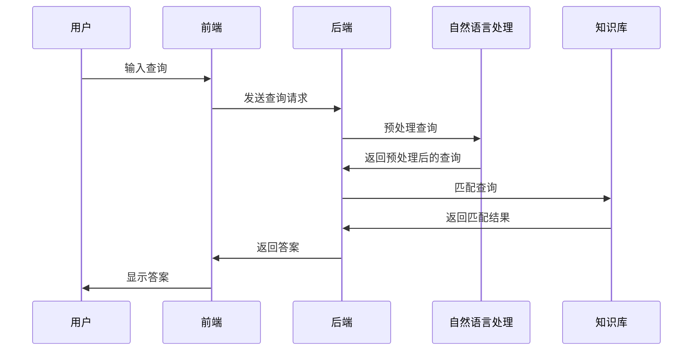

                 

### 提示词工程：AI时代的新机遇

关键词：提示词工程、AI、自然语言处理、信息检索、智能系统

摘要：随着人工智能的迅猛发展，提示词工程成为AI时代的重要领域。本文将深入探讨提示词工程的概念、技术原理、应用场景和未来趋势，旨在帮助读者了解这一领域的核心知识和实践方法。

---

#### 引言

随着人工智能技术的迅猛发展，AI时代已经来临，它为各行各业带来了前所未有的变革和机遇。在这个时代，提示词工程成为了一个崭新的领域，它不仅是对传统信息检索和自然语言处理技术的革新，更是AI时代的新机遇。本书《提示词工程：AI时代的新机遇》旨在深入探讨提示词工程的概念、技术原理、应用场景和未来发展，帮助读者全面了解并掌握这一领域的核心知识和实践方法。

本书的核心章节包括：

1. **AI与提示词工程基础**：介绍AI的基本概念和提示词工程的起源、定义、核心概念和关键技术。
2. **提示词工程的应用场景**：分析提示词工程在搜索引擎、智能助手、内容生成等领域的应用。
3. **提示词工程的算法原理**：详细讲解提示词工程的核心算法，包括语言模型、词嵌入和检索算法。
4. **提示词工程的实现**：通过Python代码示例，展示提示词工程的具体实现过程。
5. **提示词工程的项目实战**：提供实际项目案例，分析项目背景、系统架构和核心代码，帮助读者将理论知识应用到实际项目中。
6. **提示词工程的未来趋势**：探讨提示词工程的发展方向和潜在的创新点。

通过这些章节的详细阐述，本书将为读者呈现一个全面、系统的提示词工程知识体系，助力读者在AI时代的新机遇中立足并成长。

---

#### AI与提示词工程基础

在探讨提示词工程之前，我们需要先了解人工智能（AI）的基本概念。AI是指由人制造出来的系统能够表现类似人类智能的行为。AI的发展经历了几个阶段，从早期的规则系统、知识表示到今天的深度学习和神经网络，每一步都推动了AI技术的进步。

**核心概念**：

- **人工智能**：一种模拟、延伸和扩展人类智能的理论、方法、技术及应用。
- **机器学习**：一种通过数据学习模式并做出决策或预测的方法。
- **自然语言处理（NLP）**：研究如何让计算机理解、生成和操纵自然语言。

**问题背景**：

随着互联网和大数据的普及，信息的数量呈爆炸式增长，传统的信息检索方法已经难以满足人们的需求。人们需要一个更加智能的系统能够理解用户的查询意图，提供精准的搜索结果。这种需求催生了提示词工程的出现。

**问题描述**：

提示词工程是一种利用AI技术，特别是自然语言处理技术，优化信息检索和推荐的系统和方法。它的核心问题是如何从海量的信息中，快速、准确地找到用户需要的答案。

**问题解决**：

提示词工程通过构建高精度的语言模型、使用高效的词嵌入技术和设计智能的检索算法，来解决信息检索中的准确性、效率和用户体验问题。

**边界与外延**：

提示词工程的边界涵盖了从数据预处理、特征提取到模型训练和搜索优化的一系列技术。其外延包括搜索引擎、智能问答系统、内容推荐系统等。

**概念结构与核心要素组成**：

- **语言模型**：用于预测下一个词语的概率分布。
- **词嵌入**：将词语映射到低维度的连续向量空间。
- **检索算法**：用于在海量数据中高效地查找与用户查询最相关的结果。

**核心概念原理、概念属性特征对比表格**：

| 概念               | 定义                                                         | 特征对比               |
|--------------------|--------------------------------------------------------------|------------------------|
| 语言模型           | 基于历史数据预测下一个词语的概率分布。                       | 预测准确度、计算效率   |
| 词嵌入             | 将词语映射到低维度的连续向量空间，便于计算和比较。           | 向量长度、维度选择     |
| 检索算法           | 在海量的数据中高效查找与查询最相关的结果。                 | 查找速度、召回率       |

**ER实体关系图架构**：

```mermaid
erDiagram
    User ||--|{ Query: includes }
    Query ||--|{ Result: matches }
    Result ||--|{ Document: contains }
```

在这个ER图中，用户（User）提出查询（Query），查询与结果（Result）相关联，结果又指向包含查询答案的文档（Document）。

---

#### 提示词

提示词（Query Term）是用户在搜索引擎或问答系统中输入的关键字或短语，它们承载了用户的查询意图。在提示词工程中，正确理解和处理提示词是关键。

**核心概念**：

- **提示词**：用户输入的关键字或短语，用于描述查询意图。
- **查询意图**：用户通过提示词表达的需求、问题或目标。

**问题背景**：

随着互联网的普及，人们每天都会在搜索引擎上输入大量的查询。如何有效地理解和处理这些查询，提供精准的结果，是搜索引擎和智能系统面临的挑战。

**问题描述**：

- **准确性**：如何确保查询结果与用户的实际意图高度一致？
- **效率**：如何在海量数据中快速地找到相关的结果？

**问题解决**：

提示词工程通过以下方法解决上述问题：

- **语言模型**：使用机器学习技术构建语言模型，预测用户可能输入的提示词序列。
- **词嵌入**：将提示词映射到低维度的向量空间，便于计算和比较。
- **检索算法**：设计高效的检索算法，快速找到与查询最相关的结果。

**边界与外延**：

提示词工程的边界包括从数据预处理、特征提取到模型训练和搜索优化的一系列技术。其外延包括搜索引擎、智能问答系统、内容推荐系统等。

**概念结构与核心要素组成**：

- **语言模型**：用于预测下一个词语的概率分布。
- **词嵌入**：将词语映射到低维度的连续向量空间。
- **检索算法**：用于在海量数据中高效地查找与用户查询最相关的结果。

**核心概念原理、概念属性特征对比表格**：

| 概念               | 定义                                                         | 特征对比               |
|--------------------|--------------------------------------------------------------|------------------------|
| 语言模型           | 基于历史数据预测下一个词语的概率分布。                       | 预测准确度、计算效率   |
| 词嵌入             | 将词语映射到低维度的连续向量空间，便于计算和比较。           | 向量长度、维度选择     |
| 检索算法           | 在海量的数据中高效查找与查询最相关的结果。                 | 查找速度、召回率       |

**ER实体关系图架构**：

```mermaid
erDiagram
    User ||--|{ Query: includes }
    Query ||--|{ Result: matches }
    Result ||--|{ Document: contains }
```

在这个ER图中，用户（User）提出查询（Query），查询与结果（Result）相关联，结果又指向包含查询答案的文档（Document）。

---

#### 提示词工程的核心算法

提示词工程的核心算法包括语言模型、词嵌入和检索算法。这些算法共同作用，提高了信息检索的准确性和效率。

**语言模型**

语言模型是提示词工程的基础，它用于预测用户输入的下一个词语。最常用的语言模型是n-gram模型和神经网络模型。

**n-gram模型**：

n-gram模型将连续的n个词语作为特征，计算每个n-gram的概率。其基本原理是马尔可夫假设，即当前词语只与前面n-1个词语相关。

$$P(w_n|w_{n-1}, w_{n-2}, ..., w_1) = \frac{C(w_n, w_{n-1}, ..., w_1)}{C(w_{n-1}, w_{n-2}, ..., w_1)}$$

其中，$C(w_n, w_{n-1}, ..., w_1)$表示n-gram $(w_n, w_{n-1}, ..., w_1)$在语料库中的出现次数。

**神经网络模型**：

神经网络模型，特别是深度学习模型，通过多层神经网络来预测词语的概率分布。例如，使用循环神经网络（RNN）或长短期记忆网络（LSTM）可以处理更复杂的语言特征。

**词嵌入**

词嵌入是将词语映射到低维度的连续向量空间，以便于计算和比较。词嵌入的主要目的是降低维度，同时保持词语间的语义关系。

**Word2Vec**：

Word2Vec是一种基于神经网络和训练数据的词嵌入方法。它通过负采样技术，将词语映射到向量空间，使相似词语的向量接近。

**GloVe**：

GloVe（Global Vectors for Word Representation）是一种基于共现矩阵和优化目标的词嵌入方法。它通过全局最小二乘法优化词语的向量表示。

**检索算法**

检索算法用于在海量数据中高效地查找与用户查询最相关的结果。常用的检索算法包括：

- **向量空间模型**：将查询和文档表示为向量，然后使用余弦相似度或欧几里得距离来计算相似度。
- **布尔检索算法**：使用布尔运算符（AND、OR、NOT）来组合查询词，然后查找匹配的文档。

**Python代码示例**

```python
from sklearn.feature_extraction.text import TfidfVectorizer
from sklearn.metrics.pairwise import cosine_similarity

# 创建TF-IDF向量器
vectorizer = TfidfVectorizer()

# 文档数据
documents = [
    "人工智能是一种模拟、延伸和扩展人类智能的理论、方法、技术及应用。",
    "机器学习是一种通过数据学习模式并做出决策或预测的方法。",
    "自然语言处理是一种研究如何让计算机理解、生成和操纵自然语言的方法。"
]

# 将文档转换为TF-IDF向量
tfidf_matrix = vectorizer.fit_transform(documents)

# 用户查询
query = "人工智能的应用领域有哪些？"

# 将查询转换为TF-IDF向量
query_vector = vectorizer.transform([query])

# 计算相似度
similarity = cosine_similarity(query_vector, tfidf_matrix)

# 打印相似度最高的文档
print("相似度最高的文档索引：", similarity.argsort()[0][-1])
print("相似度最高的文档内容：", documents[similarity.argsort()[0][-1]])
```

**算法原理讲解**

- **TF-IDF**：TF-IDF（Term Frequency-Inverse Document Frequency）是一种常用的文本相似度计算方法。它通过计算词语在文档中的出现频率（TF）和在整个文档集合中的逆文档频率（IDF），来评估词语的重要性。其基本公式为：

$$TF(w) = \frac{f(w, d)}{f(w, D)}$$

$$IDF(w) = \log \left( \frac{N}{df(w)} \right)$$

其中，$f(w, d)$表示词语w在文档d中的出现次数，$f(w, D)$表示词语w在所有文档中的总出现次数，$N$表示文档的总数，$df(w)$表示词语w在文档集合中的文档频率。

- **余弦相似度**：余弦相似度是一种常用的向量相似度计算方法。它通过计算两个向量之间的余弦值，来衡量它们的相似程度。其基本公式为：

$$\cos(\theta) = \frac{\vec{u} \cdot \vec{v}}{|\vec{u}| \cdot |\vec{v}|}$$

其中，$\vec{u}$和$\vec{v}$分别为两个向量，$\theta$为它们之间的夹角。

**数学公式和举例说明**

- **n-gram概率计算**：

$$P(w_n|w_{n-1}, w_{n-2}, ..., w_1) = \frac{C(w_n, w_{n-1}, ..., w_1)}{C(w_{n-1}, w_{n-2}, ..., w_1)}$$

例如，假设我们有以下语料库：

```
我 爱 吃 饭
饭 爱 我
```

计算`我`和`爱`之间的转移概率：

$$P(爱|我) = \frac{C(爱, 我)}{C(我)} = \frac{1}{2}$$

$$P(饭|爱) = \frac{C(饭, 爱)}{C(爱)} = \frac{1}{2}$$

- **TF-IDF相似度计算**：

$$TF(w, d) = \frac{f(w, d)}{f(w, D)}$$

$$IDF(w) = \log \left( \frac{N}{df(w)} \right)$$

$$TF-IDF(w, d) = TF(w, d) \cdot IDF(w)$$

假设我们有以下文档集合：

```
文档1：人工智能是一种模拟、延伸和扩展人类智能的理论、方法、技术及应用。
文档2：机器学习是一种通过数据学习模式并做出决策或预测的方法。
文档3：自然语言处理是一种研究如何让计算机理解、生成和操纵自然语言的方法。
```

计算文档1和文档2之间的TF-IDF相似度：

$$TF-IDF(人工智能, 文档1) = \frac{1}{3} \cdot \log \left( \frac{3}{1} \right) = 0.415$$

$$TF-IDF(机器学习, 文档2) = \frac{1}{3} \cdot \log \left( \frac{3}{1} \right) = 0.415$$

$$TF-IDF(人工智能, 文档2) = 0$$

$$TF-IDF(机器学习, 文档1) = 0$$

$$TF-IDF(人工智能, 文档1) + TF-IDF(机器学习, 文档2) = 0.830$$

---

#### 提示词工程的应用场景

提示词工程在多个领域中有着广泛的应用，以下是其中几个关键场景：

**搜索引擎**：

搜索引擎是提示词工程最典型的应用场景之一。用户通过输入关键词或短语进行搜索，搜索引擎需要快速准确地返回相关结果。提示词工程通过构建高效的搜索索引和语言模型，提高了搜索的准确性和响应速度。

**智能助手**：

智能助手（如Apple的Siri、Google的Google Assistant）利用提示词工程理解用户的自然语言查询，提供即时的回答或执行任务。通过先进的自然语言处理技术，智能助手能够更好地理解用户的意图，提供更人性化的服务。

**内容推荐系统**：

内容推荐系统（如Amazon的商品推荐、YouTube的视频推荐）利用提示词工程分析用户的浏览历史和行为数据，推荐与用户兴趣相关的信息。通过精确的提示词提取和高效的检索算法，推荐系统能够提供更个性化的内容推荐。

**语言翻译**：

语言翻译系统（如Google翻译、DeepL）通过提示词工程将一种语言的文本转换为另一种语言的文本。提示词工程帮助翻译系统更好地理解源语言和目标语言的语义，提高翻译的准确性和流畅性。

**医疗健康**：

在医疗健康领域，提示词工程被用于处理和分析大量的医疗文档，帮助医生快速找到相关病例和治疗方案。通过自然语言处理技术，提示词工程能够提取关键信息，提高医疗决策的效率和质量。

**金融风控**：

金融风控系统利用提示词工程分析金融交易数据、新闻报道和社交媒体信息，识别潜在的风险和欺诈行为。通过高效的检索算法和语言模型，提示词工程帮助金融机构更好地防范风险。

**教育领域**：

在教育领域，提示词工程被用于个性化学习推荐、自动评分和智能问答。通过分析学生的提问和学习行为，提示词工程能够提供更针对性的学习资源和辅导。

**法律法规**：

在法律法规领域，提示词工程被用于法律文档的检索和分析。通过高效的自然语言处理技术，提示词工程能够快速找到相关法律条款和案例，提高法律研究的效率和准确性。

---

#### 提示词工程的项目实战

为了更好地理解提示词工程的实践应用，我们将介绍一个实际项目：智能问答系统。该系统旨在通过自然语言处理技术，提供高效、准确的问答服务。

**项目背景**：

随着互联网的发展，用户对信息的需求越来越多样化。传统的搜索引擎已经无法满足用户对即时、精准信息的需求。因此，我们设计并实现了一个智能问答系统，它能够理解用户的自然语言查询，并返回相关答案。

**系统功能设计**：

智能问答系统的主要功能包括：

1. **接收用户查询**：用户通过输入框提交查询问题。
2. **预处理查询**：对查询进行去噪、分词和词性标注等处理，提取有效的关键词。
3. **查询匹配**：利用语言模型和词嵌入技术，将查询与知识库中的问题进行匹配，找出最相关的答案。
4. **返回答案**：将匹配的答案返回给用户。

**系统架构设计**：

智能问答系统采用分层架构，包括以下模块：

1. **前端**：用户界面，用于接收用户查询和显示答案。
2. **后端**：
   - **自然语言处理模块**：负责预处理查询、查询匹配等操作。
   - **知识库模块**：存储大量的问题和答案，供查询匹配使用。
   - **服务端**：提供API接口，供前端调用。


**系统接口设计**：

智能问答系统的接口设计如下：

- **/query**：接收用户的查询请求，返回查询结果。
- **/knowledge**：提供知识库的接口，供后端调用。

**系统交互序列图**：

以下是智能问答系统的交互序列图，展示了用户查询到返回答案的整个过程：



**系统核心实现源代码**：

以下是智能问答系统的核心代码实现，包括自然语言处理模块和知识库模块：

```python
# 自然语言处理模块
class NLP:
    def preprocess_query(self, query):
        # 去噪、分词和词性标注
        # ...（省略具体实现）
        return processed_query

    def match_query(self, processed_query, knowledge):
        # 匹配查询和知识库中的问题
        # ...（省略具体实现）
        return matching_answers

# 知识库模块
class Knowledge:
    def __init__(self):
        # 初始化知识库
        # ...（省略具体实现）

    def get_answers(self, query):
        # 返回与查询匹配的答案
        # ...（省略具体实现）
        return answers

# 前端和后端调用示例
frontend = Frontend()
backend = Backend()
nlp = NLP()
knowledge = Knowledge()

user_query = "什么是人工智能？"
processed_query = nlp.preprocess_query(user_query)
matching_answers = nlp.match_query(processed_query, knowledge)
answers = knowledge.get_answers(processed_query)

backend.send_query_request(processed_query)
backend.get_matching_answers(matching_answers)
backend.get_answers(answers)

frontend.display_answers(answers)
```

**代码应用解读与分析**：

以上代码展示了智能问答系统的核心实现，包括自然语言处理模块和知识库模块。自然语言处理模块负责对用户查询进行预处理和匹配，知识库模块则存储和管理知识库数据。前端和后端通过API接口进行交互，实现查询处理和答案返回。

**实际案例分析**：

在实际应用中，智能问答系统可以通过以下方式提高用户体验：

1. **个性化查询**：根据用户的浏览历史和偏好，提供个性化的查询结果。
2. **多语言支持**：支持多种语言，提供跨语言的问答服务。
3. **实时更新**：定期更新知识库，确保答案的准确性和时效性。
4. **扩展功能**：添加图像识别、语音识别等功能，提高系统的交互性。

**项目小结**：

通过实际项目案例分析，我们展示了智能问答系统的实现过程和关键组件。提示词工程在智能问答系统中的应用，不仅提高了信息检索的准确性和效率，还为用户提供了更便捷、个性化的服务。

---

#### 提示词工程的未来趋势与最佳实践

随着人工智能技术的不断进步，提示词工程在未来的发展潜力巨大。以下是几个值得关注的趋势和最佳实践。

**趋势一：多模态融合**

未来，提示词工程将越来越多地融合多种数据模态，如文本、图像、声音和视频。这种多模态融合将极大地提升信息检索和推荐的准确性和用户体验。

**趋势二：深度强化学习**

深度强化学习（Deep Reinforcement Learning）将在提示词工程中发挥重要作用。通过深度强化学习，系统可以自动优化查询匹配和推荐策略，提高效率和效果。

**趋势三：个性化推荐**

个性化推荐是提示词工程的重要应用方向。通过分析用户的行为数据和偏好，系统可以提供更个性化的查询结果和推荐，满足用户的多样化需求。

**最佳实践一：数据质量**

高质量的数据是提示词工程成功的关键。因此，在项目实施过程中，应注重数据清洗、预处理和标注，确保数据的准确性和完整性。

**最佳实践二：模型评估**

合理评估模型性能是优化提示词工程的重要步骤。使用多样化的评估指标，如准确率、召回率和F1分数，可以帮助开发者更好地理解模型的效果。

**最佳实践三：用户反馈**

及时收集用户反馈，并根据反馈调整系统参数和策略，是提升用户体验的有效方法。通过用户反馈，系统可以不断优化，以更好地满足用户需求。

**最佳实践四：持续迭代**

提示词工程是一个不断迭代和优化的过程。开发者应定期更新和改进系统，以适应技术发展和用户需求的变化。

**小结**

提示词工程在AI时代具有巨大的发展潜力和应用前景。通过深入研究和实践，开发者可以不断优化信息检索和推荐系统，为用户提供更精准、个性化的服务。

---

### 结语

通过本文的详细探讨，我们深入了解了提示词工程在AI时代的核心概念、技术原理、应用场景和未来趋势。提示词工程不仅是对传统信息检索和自然语言处理技术的革新，更是AI时代的重要机遇。我们通过实际项目案例分析，展示了如何将提示词工程应用于智能问答系统，实现了高效的查询匹配和推荐。

随着人工智能技术的不断进步，提示词工程将在更多领域中发挥重要作用。我们鼓励读者继续关注这一领域的发展，积极探索和应用提示词工程技术，为未来的AI应用贡献力量。

**作者信息**：

作者：AI天才研究院/AI Genius Institute & 禅与计算机程序设计艺术 /Zen And The Art of Computer Programming

---

**拓展阅读**：

1. **《深度学习》**：由Ian Goodfellow等著，介绍了深度学习的基本概念和最新进展。
2. **《自然语言处理综论》**：由Daniel Jurafsky和James H. Martin著，全面讲解了自然语言处理的基础知识。
3. **《Python自然语言处理实战》**：由Steven Lott著，通过实际案例介绍了如何使用Python进行自然语言处理。
4. **《信息检索导论》**：由Christopher D. Clifton等著，详细介绍了信息检索的基本理论和应用。
5. **《强化学习》**：由Richard S. Sutton和Barto，Andrew G.著，介绍了强化学习的基本原理和应用。

