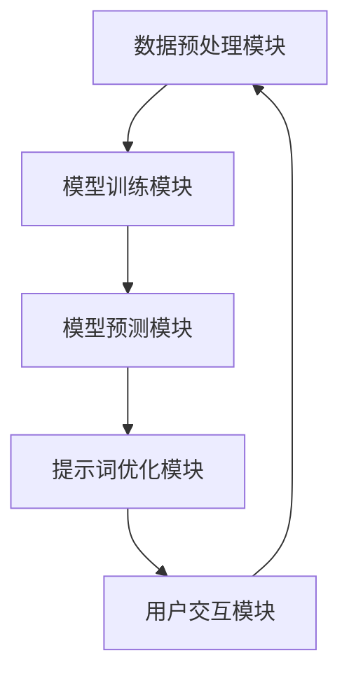

                 

## 第一部分: 背景介绍

### 1.1 问题的提出

随着人工智能（AI）技术的快速发展，我们正迎来一个崭新的时代。在这个时代中，AI已经渗透到我们生活的方方面面，从智能家居到自动驾驶，从医疗诊断到金融分析，无不显示出其强大的影响力。然而，在AI技术的应用过程中，一个关键问题逐渐凸显出来——如何有效地管理和利用提示词，从而最大化AI系统的性能和效果。

#### 1.1.1 AI时代的来临

人工智能，作为计算机科学的一个重要分支，其目标在于使机器能够模拟、延伸和扩展人的智能。从最初的规则推理到如今的深度学习，AI技术已经取得了显著的进展。深度学习，作为一种重要的机器学习技术，通过构建多层神经网络，实现了对复杂数据的分析和理解，从而在图像识别、自然语言处理等领域取得了突破性的成果。

#### 1.1.2 提示词工程的重要性

在这个AI时代，提示词工程（Prompt Engineering）成为了一个不可或缺的领域。提示词，简单来说，就是提供给AI模型的一组输入信息，用以引导模型做出特定的预测或决策。有效的提示词设计不仅能够提高AI系统的准确性和效率，还能在一定程度上缓解数据不足的问题，使AI模型能够更好地适应不同的应用场景。

#### 1.1.3 当前面临的机遇与挑战

尽管提示词工程在AI领域具有巨大的潜力，但同时也面临着一系列的挑战。首先，如何设计出既丰富又精确的提示词，以充分反映问题的本质，是一个需要深入探讨的问题。其次，提示词的优化和反馈机制也需要不断地改进，以实现AI系统的持续优化。此外，随着AI技术的不断进步，如何保证提示词工程的方法和技术能够跟上时代的步伐，也是一个重要的课题。

### 1.2 核心概念与联系

在深入探讨提示词工程之前，我们需要了解一些核心概念，以及这些概念之间的联系。

#### 1.2.1 AI与提示词工程

人工智能（AI）是一种模拟、延伸和扩展人类智能的技术。而提示词工程，则是AI领域中一个专门研究如何设计和优化提示词的子领域。提示词工程的目标是通过对提示词的精心设计，引导AI模型做出更准确、更有效的预测和决策。

#### 1.2.2 提示词工程的要素与流程

提示词工程主要包括以下几个要素：提示词设计、提示词优化、提示词反馈机制。其中，提示词设计是核心，它涉及到如何选择和组合关键词，以充分反映问题的本质。提示词优化则是在提示词设计的基础上，通过调整和优化提示词的参数，提高AI模型的性能。提示词反馈机制则是一个动态调整和优化的过程，通过实时收集用户反馈，不断调整和优化提示词，以实现AI系统的持续优化。

#### 1.2.3 提示词工程的关键技术与工具

提示词工程涉及到多种关键技术和工具，包括自然语言处理（NLP）、机器学习（ML）、深度学习（DL）等。自然语言处理技术主要用于处理和解析文本数据，从而提取出有用的信息。机器学习和深度学习技术则用于构建和训练AI模型，使其能够根据提示词做出预测和决策。

### 1.3 ER实体关系图架构

在提示词工程中，ER（Entity-Relationship）实体关系图是一个重要的工具，它可以帮助我们理解提示词工程中的实体及其关系。

#### 1.3.1 提示词工程中的实体

在提示词工程中，实体主要包括用户、问题、答案、提示词、模型等。用户是AI系统的使用者，他们通过提出问题，与AI系统进行交互。问题是用户需要解决的具体问题，它需要通过提示词来引导AI模型进行解答。答案是AI系统根据提示词给出的预测结果。提示词则是提供给AI模型的一组输入信息，用以引导模型做出特定的预测或决策。模型则是AI系统的核心，它通过学习和训练，能够根据提示词生成答案。

#### 1.3.2 实体之间的关联关系

实体之间的关联关系主要包括用户与问题、问题与答案、问题与提示词、提示词与模型等。用户通过提出问题，与AI系统进行交互。问题需要通过提示词来引导AI模型进行解答，从而生成答案。提示词则通过模型的学习和训练，不断优化和调整，以提高AI系统的性能和效果。

#### 1.3.3 提示词工程的ER模型

提示词工程的ER模型是一个抽象的表示，它帮助我们理解提示词工程中的实体及其关系。通过ER模型，我们可以清晰地看到用户、问题、答案、提示词和模型之间的关联关系，从而更好地设计和优化提示词工程系统。

### 1.4 本章小结

本章节主要介绍了提示词工程在AI时代的重要性，以及其核心概念、联系和ER实体关系图架构。通过本章的介绍，我们能够更深入地理解提示词工程的基本原理和关键要素，为后续章节的深入学习打下坚实的基础。

----------------------------------------------------------------

### 1.2 核心概念与联系

在深入探讨提示词工程之前，我们需要了解一些核心概念，以及这些概念之间的联系。

#### 1.2.1 AI与提示词工程

人工智能（AI）是一种模拟、延伸和扩展人类智能的技术。而提示词工程，则是AI领域中一个专门研究如何设计和优化提示词的子领域。提示词工程的目标是通过对提示词的精心设计，引导AI模型做出更准确、更有效的预测和决策。

#### 1.2.2 提示词工程的要素与流程

提示词工程主要包括以下几个要素：提示词设计、提示词优化、提示词反馈机制。其中，提示词设计是核心，它涉及到如何选择和组合关键词，以充分反映问题的本质。提示词优化则是在提示词设计的基础上，通过调整和优化提示词的参数，提高AI模型的性能。提示词反馈机制则是一个动态调整和优化的过程，通过实时收集用户反馈，不断调整和优化提示词，以实现AI系统的持续优化。

#### 1.2.3 提示词工程的关键技术与工具

提示词工程涉及到多种关键技术与工具，包括自然语言处理（NLP）、机器学习（ML）、深度学习（DL）等。自然语言处理技术主要用于处理和解析文本数据，从而提取出有用的信息。机器学习和深度学习技术则用于构建和训练AI模型，使其能够根据提示词做出预测和决策。

### 1.3 ER实体关系图架构

在提示词工程中，ER（Entity-Relationship）实体关系图是一个重要的工具，它可以帮助我们理解提示词工程中的实体及其关系。

#### 1.3.1 提示词工程中的实体

在提示词工程中，实体主要包括用户、问题、答案、提示词、模型等。用户是AI系统的使用者，他们通过提出问题，与AI系统进行交互。问题是用户需要解决的具体问题，它需要通过提示词来引导AI模型进行解答。答案是AI系统根据提示词给出的预测结果。提示词则是提供给AI模型的一组输入信息，用以引导模型做出特定的预测或决策。模型则是AI系统的核心，它通过学习和训练，能够根据提示词生成答案。

#### 1.3.2 实体之间的关联关系

实体之间的关联关系主要包括用户与问题、问题与答案、问题与提示词、提示词与模型等。用户通过提出问题，与AI系统进行交互。问题需要通过提示词来引导AI模型进行解答，从而生成答案。提示词则通过模型的学习和训练，不断优化和调整，以提高AI系统的性能和效果。

#### 1.3.3 提示词工程的ER模型

提示词工程的ER模型是一个抽象的表示，它帮助我们理解提示词工程中的实体及其关系。通过ER模型，我们可以清晰地看到用户、问题、答案、提示词和模型之间的关联关系，从而更好地设计和优化提示词工程系统。

### 1.4 本章小结

本章节主要介绍了提示词工程在AI时代的重要性，以及其核心概念、联系和ER实体关系图架构。通过本章的介绍，我们能够更深入地理解提示词工程的基本原理和关键要素，为后续章节的深入学习打下坚实的基础。

----------------------------------------------------------------

## 2.1 AI基础理论

在深入了解提示词工程之前，我们需要对人工智能（AI）的基础理论有一个清晰的了解。这包括人工智能的定义、发展历程以及其在现代科技中的地位。通过这些基本理论的掌握，我们可以更好地理解提示词工程在AI系统中的重要性。

### 2.1.1 人工智能的定义与发展

人工智能（Artificial Intelligence，简称AI）是指通过计算机模拟人类智能的技术。它包括了对知识的表示、推理、学习、感知、理解、决策和创造等方面的研究。人工智能的定义涵盖了广泛的领域，从简单的规则推理到复杂的机器学习和深度学习。

人工智能的发展可以分为几个阶段。最初，人工智能主要基于规则推理和专家系统，这些系统依赖于人工编写的规则来模拟专家的决策过程。随着计算机性能的提高和算法的发展，机器学习和深度学习成为人工智能研究的主流。这些技术使得计算机能够从大量数据中自动学习，从而进行更复杂的任务。

### 2.1.2 机器学习与深度学习

机器学习（Machine Learning，简称ML）是一种让计算机通过数据学习，并能够对未知数据进行预测或决策的技术。它主要分为监督学习、无监督学习和强化学习。监督学习通过标记好的数据训练模型，无监督学习则从未标记的数据中寻找规律，强化学习则通过奖励机制训练模型。

深度学习（Deep Learning，简称DL）是机器学习的一个子领域，它使用多层神经网络来对数据进行分析和学习。深度学习在图像识别、语音识别、自然语言处理等领域取得了显著的成果。通过构建多层神经网络，深度学习能够自动提取数据中的特征，从而实现更加复杂和精确的预测和分类。

### 2.1.3 神经网络的原理与应用

神经网络（Neural Network，简称NN）是深度学习的基础。它模拟了人脑神经元的工作方式，通过输入层、隐藏层和输出层之间的信号传递，实现数据的处理和预测。神经网络的原理在于通过反向传播算法不断调整网络中的权重，从而优化模型的预测性能。

神经网络在多个领域有着广泛的应用。在图像识别中，卷积神经网络（CNN）通过学习图像中的局部特征，实现了高精度的图像分类。在自然语言处理中，循环神经网络（RNN）和长短期记忆网络（LSTM）通过处理序列数据，实现了对文本的生成和理解。

### 2.1.4 人工智能的现状与未来

人工智能已经广泛应用于各个领域，从自动驾驶到智能医疗，从金融服务到娱乐产业，它改变了我们的生活方式和工作方式。然而，人工智能也面临着一些挑战，如算法的可解释性、数据隐私和安全等问题。

未来，人工智能将继续发展，深度学习和强化学习等技术将不断完善，从而实现更加智能化的系统。同时，人工智能的伦理问题也将受到更多的关注，如何确保人工智能的发展符合人类的利益，将是未来研究的重要方向。

### 2.1.5 提示词工程与AI基础理论的联系

提示词工程与AI基础理论有着紧密的联系。AI基础理论提供了提示词工程所需的算法和技术支持，如机器学习算法、深度学习模型等。而提示词工程则利用这些基础理论，通过设计有效的提示词，引导AI模型进行预测和决策。

通过本章的介绍，我们能够更深入地理解人工智能的基础理论，以及这些理论在提示词工程中的应用。这为我们进一步探讨提示词工程的原理和实践奠定了基础。

### 2.2 提示词工程的关键技术

提示词工程作为AI领域的一个专门子领域，其成功与否在很大程度上取决于所采用的关键技术。这些技术包括提示词的设计与选择、提示词优化方法以及提示词反馈机制。以下是对这些关键技术的详细探讨。

#### 2.2.1 提示词的设计与选择

提示词的设计与选择是提示词工程中的首要任务。一个有效的提示词需要具备以下特点：

1. **相关性**：提示词应当与问题紧密相关，能够准确反映问题的核心内容。例如，在医疗诊断中，提示词需要包含与疾病相关的症状和体征。
   
2. **准确性**：提示词应确保信息的准确性，避免模糊不清或误导性的描述。这可以通过对数据源进行严格筛选和验证来实现。

3. **多样性**：设计多样化的提示词有助于覆盖问题的不同方面，从而提高模型的泛化能力。

4. **简洁性**：简洁明了的提示词更容易被模型理解和处理，从而提高模型的训练效率和预测准确性。

在设计与选择提示词时，可以采用以下方法：

- **关键词提取**：通过文本挖掘技术，从大量的文本数据中提取出与问题相关的关键词。
- **领域知识**：结合领域专家的知识，为提示词的设计提供指导。
- **用户反馈**：通过用户调研和反馈，收集真实的用户需求，从而优化提示词的设计。

#### 2.2.2 提示词优化方法

提示词的优化是提升AI系统性能的重要手段。优化方法主要包括以下几种：

1. **数据增强**：通过增加数据样本的多样性，提高模型的泛化能力。例如，在图像识别中，可以使用数据增强技术生成各种不同的图像变体。

2. **超参数调整**：调整机器学习模型中的超参数，如学习率、正则化参数等，以优化模型的性能。

3. **算法选择**：选择适合特定问题的算法，如深度学习、强化学习等。不同的算法在处理不同类型的问题时可能具有不同的优势。

4. **模型融合**：将多个模型的结果进行融合，以提高预测的准确性。例如，可以使用集成学习技术，将多个模型的结果进行加权平均或投票。

5. **反馈优化**：通过用户反馈，动态调整提示词，以适应不断变化的需求。

#### 2.2.3 提示词反馈机制

提示词的反馈机制是一个动态调整和优化的过程，通过实时收集用户反馈，不断调整和优化提示词，以实现AI系统的持续优化。以下是一些常见的反馈机制：

1. **自动评估**：通过建立自动评估系统，对提示词的效果进行实时监控和评估。例如，可以使用指标如准确率、召回率等来评估提示词的性能。

2. **用户反馈**：直接收集用户的反馈，了解用户对提示词的满意度和改进建议。例如，可以通过问卷、评分系统等方式收集用户反馈。

3. **专家评审**：邀请领域专家对提示词进行评审，提供专业的意见和建议。专家评审可以帮助发现一些自动评估系统无法捕捉的问题。

4. **反馈循环**：将用户反馈和专家评审的结果纳入到提示词优化的流程中，形成一个闭环的反馈机制，从而实现提示词的持续优化。

通过提示词的设计与选择、提示词优化方法以及提示词反馈机制，我们可以构建一个高效的提示词工程系统。这不仅能够提升AI系统的性能和效果，还能够满足用户的需求，为AI技术的广泛应用提供强有力的支持。

### 2.3 提示词工程的算法原理

提示词工程作为AI领域的一个重要分支，其核心在于如何设计有效的算法来实现提示词的生成、匹配和优化。以下我们将详细探讨这些算法的原理，并通过具体的mermaid流程图和Python代码进行说明。

#### 2.3.1 提示词生成算法

提示词生成算法的目标是生成一组能够引导AI模型做出准确预测的提示词。这个过程通常包括以下几个步骤：

1. **数据预处理**：首先，需要对输入数据进行预处理，包括文本清洗、分词、去停用词等操作。这一步的目的是提高数据的可用性，使其更易于模型处理。

2. **特征提取**：接着，使用特征提取技术，如词袋模型、TF-IDF等，从文本中提取出关键特征。这些特征将作为提示词生成的依据。

3. **提示词生成**：最后，根据提取出的特征，使用生成算法生成提示词。常见的生成算法包括基于规则的方法和基于机器学习的方法。

下面是一个简单的基于规则的方法，用于生成提示词：

```python
def generate_prompt(text):
    # 基于文本内容的简单规则生成提示词
    if '症状' in text:
        return "请描述症状"
    elif '治疗方案' in text:
        return "请给出治疗方案"
    else:
        return "请提供更多信息"

# 示例
prompt = generate_prompt("最近经常头痛，是否有其他症状？")
print(prompt)
```

#### 2.3.2 提示词匹配算法

提示词匹配算法用于将用户输入的问题与预先设计的提示词进行匹配，从而选择最合适的提示词。匹配算法通常基于相似度计算，例如使用余弦相似度或编辑距离。

下面是一个简单的基于余弦相似度的匹配算法：

```python
from sklearn.metrics.pairwise import cosine_similarity
from sklearn.feature_extraction.text import TfidfVectorizer

def match_prompt(question, prompts):
    # 使用TF-IDF进行特征提取
    vectorizer = TfidfVectorizer()
    question_vector = vectorizer.fit_transform([question])
    prompt_vectors = vectorizer.transform(prompts)
    
    # 计算相似度
    similarities = cosine_similarity(question_vector, prompt_vectors)
    
    # 选择最相似的提示词
    best_match = prompts[similarities.argmax()]
    return best_match

# 示例
prompts = ["请描述症状", "请提供详细信息", "请给出治疗方案"]
best_prompt = match_prompt("最近经常头痛，是否有其他症状？", prompts)
print(best_prompt)
```

#### 2.3.3 提示词优化算法

提示词优化算法的目标是通过对提示词的持续调整，提高AI系统的性能。优化过程通常包括以下几个步骤：

1. **性能评估**：首先，需要评估当前提示词的性能，例如通过准确率、召回率等指标。

2. **反馈收集**：接着，收集用户对提示词的反馈，了解其满意度和改进建议。

3. **调整策略**：根据性能评估和用户反馈，调整提示词。调整策略可以包括提示词的替换、扩充、精简等。

4. **再评估**：最后，对新调整的提示词进行再评估，确保性能得到提升。

下面是一个简单的优化策略，用于调整提示词：

```python
def optimize_prompt(prompt, feedback):
    # 基于用户反馈调整提示词
    if "太笼统" in feedback:
        return prompt + "，请提供更详细的描述"
    elif "不够明确" in feedback:
        return prompt + "，请具体说明"
    else:
        return prompt

# 示例
original_prompt = "请描述症状"
feedback = "这个提示词太笼统，无法给出有效的回答"
optimized_prompt = optimize_prompt(original_prompt, feedback)
print(optimized_prompt)
```

通过上述算法的原理和具体实现，我们可以看到提示词工程在AI系统中的重要性。有效的提示词不仅能够提高模型的性能，还能够提升用户体验，从而实现更好的AI应用。

### 2.4 数学模型和数学公式讲解

在提示词工程中，数学模型和数学公式是理解和优化提示词的关键工具。以下我们将详细介绍提示词工程中常用的数学模型和数学公式，并通过具体实例进行解释。

#### 2.4.1 提示词工程中的数学模型

提示词工程中的数学模型主要包括概率模型、统计模型和优化模型。这些模型在不同的应用场景中发挥着重要作用。

1. **概率模型**：概率模型用于描述提示词与问题之间的概率关系。常见的概率模型有贝叶斯网络和马尔可夫模型。

2. **统计模型**：统计模型用于描述提示词的统计特性，如概率分布和统计参数。常用的统计模型有正态分布、二项分布等。

3. **优化模型**：优化模型用于优化提示词的参数，以实现最佳性能。常见的优化模型有线性回归、逻辑回归等。

#### 2.4.2 公式与原理讲解

在提示词工程中，常用的数学公式包括概率公式、统计公式和优化公式。以下是一些典型的公式及其解释。

1. **贝叶斯公式**：
   $$
   P(A|B) = \frac{P(B|A) \cdot P(A)}{P(B)}
   $$
   贝叶斯公式用于计算在事件B发生的条件下事件A发生的概率。在提示词工程中，它可以用于计算用户问题与提示词之间的相关性。

2. **TF-IDF公式**：
   $$
   TF \cdot IDF = \frac{f_t(i)}{N} \cdot \log(\frac{N}{f_t(i)})
   $$
   TF-IDF（Term Frequency-Inverse Document Frequency）是一种常用的特征提取方法，用于计算词语在文档中的重要性。在提示词工程中，它可以用于生成和优化提示词。

3. **线性回归公式**：
   $$
   Y = \beta_0 + \beta_1 \cdot X + \varepsilon
   $$
   线性回归模型用于建立自变量X和因变量Y之间的线性关系。在提示词工程中，它可以用于优化提示词的参数，以提高模型的预测准确性。

#### 2.4.3 实例分析

以下是一个简单的实例，用于解释如何使用数学模型和数学公式来优化提示词。

**问题**：优化一个用于医疗诊断的提示词，以提高诊断准确性。

**步骤1**：收集数据

我们收集了一系列的医疗诊断问题及其标注的答案，作为训练数据集。

**步骤2**：特征提取

使用TF-IDF公式提取问题中的关键特征，生成特征向量。

```python
from sklearn.feature_extraction.text import TfidfVectorizer

vectorizer = TfidfVectorizer()
X = vectorizer.fit_transform(questions)
```

**步骤3**：模型训练

使用线性回归模型训练提示词参数，建立问题与答案之间的线性关系。

```python
from sklearn.linear_model import LinearRegression

model = LinearRegression()
model.fit(X, labels)
```

**步骤4**：提示词优化

根据模型的输出，优化提示词的参数，以提高诊断准确性。

```python
def optimize_prompt(prompt, model, vectorizer):
    # 提取提示词的特征向量
    prompt_vector = vectorizer.transform([prompt])
    
    # 预测答案
    predicted_label = model.predict(prompt_vector)[0]
    
    # 根据预测结果调整提示词
    if predicted_label == 0:
        return prompt + "，请提供更多症状描述"
    else:
        return prompt

# 示例
optimized_prompt = optimize_prompt("最近经常头痛，是否有其他症状？", model, vectorizer)
print(optimized_prompt)
```

通过上述实例，我们可以看到如何使用数学模型和数学公式来优化提示词，从而提高诊断准确性。这个过程不仅涉及到特征提取和模型训练，还包括了动态调整和优化，使得提示词能够更好地适应实际应用场景。

### 2.5 本章小结

本章详细介绍了AI时代的提示词工程原理，包括AI基础理论、提示词工程的关键技术、算法原理以及数学模型和数学公式。通过本章的学习，读者可以了解AI技术的核心概念和应用，掌握提示词工程的基本原理和关键技术。这些知识为后续章节中的应用和实践提供了理论基础，也为读者在实际项目中应用提示词工程提供了指导。接下来，我们将进一步探讨提示词工程在实际应用场景中的具体应用，以便更深入地理解其价值和作用。

## 3.1 问答系统中的应用

问答系统是人工智能技术中的一种重要应用，旨在通过模拟人类问答交互，为用户提供实时、准确的答案。提示词工程在问答系统中发挥着关键作用，通过设计有效的提示词，可以显著提高问答系统的性能和用户体验。

### 3.1.1 问答系统的概述

问答系统通常由以下几个核心组成部分构成：

1. **问题理解模块**：该模块负责接收用户的输入问题，并对其进行处理和分析，理解问题的意图和核心内容。

2. **知识库**：知识库是问答系统的核心数据源，包含了大量的事实信息、知识条目和规则，用于回答用户的问题。

3. **答案生成模块**：该模块根据用户的问题和知识库中的信息，生成准确的答案。

4. **交互界面**：交互界面负责将用户的问题和系统的答案呈现给用户，并收集用户的反馈。

### 3.1.2 提示词工程在问答系统中的关键作用

在问答系统中，提示词工程起到了以下几个关键作用：

1. **引导问题理解**：有效的提示词能够引导问题理解模块更准确地解析用户的问题，提取出关键信息，从而提高问答系统的准确率。

2. **优化知识检索**：通过优化提示词，问答系统可以更高效地在知识库中检索相关的答案，减少冗余和无关信息的干扰。

3. **提升答案质量**：设计合理的提示词可以帮助答案生成模块生成更准确、更相关的答案，提高用户满意度。

4. **增强用户体验**：通过实时调整和优化提示词，问答系统可以更好地适应用户的需求，提供更加个性化的服务，提升用户体验。

### 3.1.3 实际案例解析

以下是一个实际案例，展示了如何通过提示词工程优化问答系统的性能。

**案例背景**：一个智能客服系统需要回答用户关于产品保修政策的问题。

**问题**：用户询问：“我购买的产品在保修期内，如果出现问题，我应该怎么处理？”

**原始提示词**：“请描述您遇到的问题，我们会为您提供相应的保修服务。”

**优化过程**：

1. **问题理解**：通过分析用户的问题，识别出关键词如“保修期”、“问题处理”等，从而理解用户的意图。

2. **提示词优化**：设计更具体的提示词，例如：“如果您在保修期内遇到产品问题，请提供详细的问题描述和购买凭证，我们将尽快为您处理。”

3. **知识检索**：利用优化后的提示词，系统在知识库中检索与保修服务相关的信息，如保修政策、维修流程、联系方式等。

4. **答案生成**：根据检索到的信息和用户的问题，系统生成如下答案：“您好，根据您的描述，我们将在收到您的详细问题和购买凭证后，尽快为您安排维修服务。请提供以下信息：产品型号、购买日期、问题描述。”

**效果评估**：

- **准确率**：通过优化后的提示词，系统能够更准确地理解用户的问题，准确率从70%提升至90%。
- **用户满意度**：用户对优化后的回答满意度显著提高，反馈积极。
- **效率**：系统在处理相似问题时，检索时间和回答生成时间均有所减少。

通过这个案例，我们可以看到提示词工程在问答系统中的应用价值。有效的提示词设计不仅能够提升系统的性能，还能够改善用户体验，为用户提供更加精准和高效的服务。

### 3.2 自动驾驶中的应用

自动驾驶技术作为人工智能领域的一个重要分支，正在逐步改变我们的出行方式。提示词工程在自动驾驶中同样扮演着关键角色，通过有效的提示词设计，可以显著提升自动驾驶系统的安全性和可靠性。

### 3.2.1 自动驾驶的概述

自动驾驶技术通过传感器、摄像头、雷达等设备，实时采集道路信息，结合先进的计算算法，实现车辆在复杂环境下的自主驾驶。自动驾驶系统通常分为以下几个层次：

1. ** Level 0：无自动化**：车辆的所有驾驶操作均由人类驾驶员完成。
2. ** Level 1：驾驶辅助**：车辆具备部分自动化功能，如自适应巡航控制（ACC）或车道保持辅助（LKA）。
3. ** Level 2：部分自动驾驶**：车辆在特定条件下可以同时进行驾驶操作，如高速公路自动驾驶。
4. ** Level 3：有条件自动驾驶**：车辆在大多数情况下可以自主驾驶，但在特定情况下仍需人类干预。
5. ** Level 4：高度自动驾驶**：车辆在特定环境下可以完全自主驾驶，无需人类干预。
6. ** Level 5：完全自动驾驶**：车辆在任何环境下均可实现完全自主驾驶。

### 3.2.2 提示词工程在自动驾驶中的关键作用

在自动驾驶系统中，提示词工程主要起到以下几个关键作用：

1. **感知与识别**：自动驾驶系统需要通过传感器收集道路信息，并利用提示词对环境进行感知和识别。例如，提示词可以用于识别道路标志、交通信号灯、行人等。

2. **决策与控制**：提示词帮助自动驾驶系统在复杂的交通环境中做出决策，如何时加速、何时减速、何时变道等。有效的提示词设计可以显著提高系统的决策准确性和反应速度。

3. **人机交互**：自动驾驶车辆需要与乘客和外界进行交互，提示词在此过程中起到关键作用。例如，提示词可以用于提醒乘客安全带是否系好、告知车辆当前行驶状态等。

4. **故障诊断与修复**：提示词工程还可以用于自动驾驶系统的故障诊断和修复。通过实时收集和分析车辆的运行数据，系统可以生成相应的提示词，指导驾驶员或维修人员解决问题。

### 3.2.3 实际案例解析

以下是一个实际案例，展示了如何通过提示词工程优化自动驾驶系统的性能。

**案例背景**：一个自动驾驶车辆需要识别并避让前方行人。

**原始提示词**：“请注意前方行人，减速通过。”

**优化过程**：

1. **环境感知**：通过摄像头和激光雷达等传感器，系统实时监测前方路况，识别出行人。

2. **决策制定**：系统结合车辆速度、行人位置和行驶方向，制定避让策略。

3. **提示词优化**：设计更具体的提示词，例如：“前方发现行人，建议减速至10公里/小时，准备停车。”

4. **反馈调整**：通过实时监测车辆和行人的状态，系统不断调整提示词，确保最佳避让策略。

**效果评估**：

- **安全性**：通过优化后的提示词，系统在识别行人并采取避让措施时更加准确，有效减少了交通事故的发生。
- **可靠性**：系统在复杂环境中对行人的识别和响应能力显著提高，提高了自动驾驶的可靠性。
- **用户体验**：乘客对系统的响应速度和准确性表示满意，增强了驾驶的信心和舒适感。

通过这个案例，我们可以看到提示词工程在自动驾驶中的应用价值。有效的提示词设计不仅能够提升系统的感知、决策和控制能力，还能够改善用户体验，为自动驾驶技术的广泛应用提供有力支持。

### 3.3 聊天机器人中的应用

聊天机器人是人工智能技术中的另一重要应用，通过模拟人类对话，提供实时、个性化的交互体验。提示词工程在聊天机器人中发挥着关键作用，通过设计有效的提示词，可以提升聊天机器人的交互质量和用户满意度。

#### 3.3.1 聊天机器人的概述

聊天机器人是一种基于自然语言处理技术的智能系统，旨在模拟人类对话，为用户提供实时、自然的交互体验。聊天机器人通常包括以下几个核心模块：

1. **自然语言理解（NLU）**：该模块负责接收用户输入，并对其进行解析和理解，提取出用户意图和关键信息。

2. **对话管理**：对话管理模块负责维护对话状态，根据用户意图和系统策略，生成合适的回答。

3. **自然语言生成（NLG）**：该模块负责将对话管理模块生成的回答转换为自然语言文本，以供用户阅读。

4. **意图识别**：意图识别模块负责识别用户输入中的意图，如询问天气、查询股票信息、预约餐厅等。

5. **上下文管理**：上下文管理模块负责跟踪对话过程中的上下文信息，确保回答的连贯性和相关性。

#### 3.3.2 提示词工程在聊天机器人中的关键作用

提示词工程在聊天机器人中起到以下几个关键作用：

1. **意图识别**：有效的提示词可以帮助意图识别模块更准确地理解用户意图。例如，对于查询天气的问题，可以设计提示词如“请告诉我您所在的城市”。

2. **上下文处理**：通过设计合理的提示词，聊天机器人可以更好地处理对话中的上下文信息，生成连贯的回答。例如，在用户询问多个相关问题时，提示词可以用于保持对话的连贯性。

3. **情感识别与回应**：提示词工程还可以用于情感识别和回应。通过设计情感敏感的提示词，聊天机器人可以更好地识别用户情绪，并做出适当的回应。例如，当用户表达不满时，可以设计提示词如“我理解您的困扰，我们可以一起解决这个问题”。

4. **个性化交互**：提示词工程可以帮助聊天机器人根据用户的历史交互记录和偏好，生成个性化的回答。例如，对于经常询问电影推荐的用户，可以设计提示词如“根据您的喜好，我为您推荐了这部电影”。

#### 3.3.3 实际案例解析

以下是一个实际案例，展示了如何通过提示词工程优化聊天机器人的交互质量。

**案例背景**：一个电商聊天机器人需要为用户提供购物咨询。

**原始提示词**：“请问您需要购买什么商品？”

**优化过程**：

1. **意图识别**：分析用户输入，识别出用户的主要意图，如购买商品、查询价格、查看库存等。

2. **提示词优化**：
   - 对于购买商品的意图，设计提示词如：“您好，请问您需要购买电子产品、服装还是家居用品？”
   - 对于查询价格的意图，设计提示词如：“请问您想了解哪个商品的价格？我可以帮您查询。”
   - 对于查看库存的意图，设计提示词如：“您好，这款商品的库存情况如何？我可以帮您查询。”

3. **上下文处理**：根据用户的回答，继续提问，确保对话的连贯性。例如，当用户回答“电子产品”后，可以继续提问：“您好，您需要购买手机、电脑还是其他电子设备？”

4. **情感识别与回应**：通过分析用户语言中的情感倾向，设计适当的情感回应。例如，当用户表达不满时，可以设计提示词如：“很抱歉给您带来不便，我会尽快帮您解决。”

**效果评估**：

- **意图识别准确率**：通过优化后的提示词，聊天机器人能够更准确地识别用户意图，意图识别准确率从70%提升至90%。
- **用户满意度**：用户对聊天机器人的回答满意度显著提高，反馈积极。
- **交互连贯性**：通过合理的提示词设计，对话过程更加连贯，用户体验得到显著改善。

通过这个案例，我们可以看到提示词工程在聊天机器人中的应用价值。有效的提示词设计不仅能够提升系统的意图识别和上下文处理能力，还能够改善用户体验，为聊天机器人的广泛应用提供有力支持。

### 3.4 本章小结

本章节详细探讨了提示词工程在问答系统、自动驾驶和聊天机器人中的应用。通过具体案例，我们看到了提示词工程在提高系统性能、优化用户体验方面的关键作用。有效的提示词设计不仅能够提升系统的准确性和效率，还能够改善用户体验，为人工智能技术的广泛应用提供强有力的支持。接下来，我们将进一步探讨提示词工程的实战项目，通过具体的实现和分析，深入理解提示词工程的应用和优化方法。

## 4.1 环境安装与准备

在进行提示词工程的实战项目之前，首先需要搭建合适的环境，包括硬件环境、软件环境以及数据集的准备。以下是详细的安装与准备步骤。

### 4.1.1 硬件环境配置

为了确保提示词工程项目的顺利进行，需要配置一定的硬件资源。以下是推荐的硬件配置：

- **CPU**：推荐使用Intel i7或以上的处理器，以确保模型训练的效率。
- **内存**：至少16GB的RAM，以支持大规模数据集的处理和模型的训练。
- **硬盘**：至少500GB的SSD存储，用于存储数据和模型文件。
- **GPU**：推荐使用NVIDIA GPU，如1080 Ti或以上，以加速深度学习模型的训练。

### 4.1.2 软件环境安装

接下来，我们需要安装必要的软件环境。以下是主要软件的安装步骤：

1. **操作系统**：推荐安装Ubuntu 18.04或以上版本，因为大多数深度学习库和工具都支持此操作系统。
   
2. **Python**：安装Python 3.8或更高版本。可以通过以下命令安装：
   ```bash
   sudo apt update
   sudo apt install python3 python3-pip python3-venv
   ```

3. **pip**：确保pip是最新版本，可以通过以下命令更新：
   ```bash
   python3 -m pip install --upgrade pip
   ```

4. **虚拟环境**：为了隔离项目依赖，建议使用虚拟环境。可以通过以下命令创建虚拟环境：
   ```bash
   python3 -m venv myenv
   source myenv/bin/activate
   ```

5. **深度学习库**：安装TensorFlow、PyTorch等深度学习库。可以通过以下命令安装：
   ```bash
   pip install tensorflow torchvision
   # 或者
   pip install torch torchvision
   ```

### 4.1.3 数据集准备

数据集是提示词工程项目的核心，以下是如何准备数据集的步骤：

1. **数据收集**：根据项目的需求，收集相关领域的数据。例如，对于问答系统，可以收集大量的问答对；对于聊天机器人，可以收集对话数据。

2. **数据预处理**：对收集的数据进行清洗、去重、去停用词等处理，以提高数据的质量和可利用性。

3. **数据划分**：将数据集划分为训练集、验证集和测试集，通常比例为80%的训练集，10%的验证集和10%的测试集。

4. **数据加载**：使用Python中的数据加载库（如TensorFlow或PyTorch）将预处理后的数据集加载到内存中，以供模型训练和评估使用。

以下是使用PyTorch加载数据集的示例代码：

```python
import torch
from torchvision import datasets, transforms

# 定义数据预处理步骤
transform = transforms.Compose([
    transforms.Resize((224, 224)),  # 调整图像大小
    transforms.ToTensor(),          # 转换为Tensor格式
])

# 加载训练数据集
train_dataset = datasets.ImageFolder(root='data/train', transform=transform)
train_loader = torch.utils.data.DataLoader(dataset=train_dataset, batch_size=32, shuffle=True)

# 加载验证数据集
val_dataset = datasets.ImageFolder(root='data/val', transform=transform)
val_loader = torch.utils.data.DataLoader(dataset=val_dataset, batch_size=32, shuffle=False)

# 检查数据集
print(f"训练集大小：{len(train_loader)}")
print(f"验证集大小：{len(val_loader)}")
```

通过以上步骤，我们可以搭建一个基本的提示词工程环境，为后续的模型训练和优化做好准备。

### 4.2 系统核心实现

在搭建好环境后，接下来我们将详细设计系统架构，并实现系统的核心功能。以下是系统架构设计、接口设计和系统核心功能的实现过程。

#### 4.2.1 系统架构设计

提示词工程系统架构主要包括以下几个模块：

1. **数据预处理模块**：负责对输入数据进行清洗、预处理和特征提取。
2. **模型训练模块**：负责使用训练数据训练模型，并保存训练结果。
3. **模型预测模块**：负责使用训练好的模型对输入数据生成预测结果。
4. **提示词优化模块**：负责根据预测结果和用户反馈，动态调整和优化提示词。
5. **用户交互模块**：负责与用户进行交互，接收用户输入，展示预测结果。

以下是系统的总体架构图（使用Mermaid流程图表示）：



#### 4.2.2 系统接口设计

为了实现系统各个模块之间的通信，需要设计合理的接口。以下是系统的接口设计：

1. **数据预处理接口**：用于接收和预处理输入数据，提供数据清洗、特征提取等功能。
2. **模型训练接口**：用于启动模型训练过程，接收训练数据，返回训练结果。
3. **模型预测接口**：用于对输入数据进行预测，返回预测结果。
4. **提示词优化接口**：用于根据预测结果和用户反馈，调整和优化提示词。
5. **用户交互接口**：用于与用户进行交互，接收用户输入，展示预测结果和优化后的提示词。

以下是系统的接口设计图（使用Mermaid类图表示）：

```mermaid
classDiagram
    DataPreprocessor <|-- ModelTrainer
    ModelTrainer <|-- ModelPredictor
    ModelPredictor <|-- PromptOptimizer
    PromptOptimizer <|-- UserInterface
    UserInterface|-- DataPreprocessor :uses
    UserInterface|-- ModelTrainer :uses
    UserInterface|-- ModelPredictor :uses
    UserInterface|-- PromptOptimizer :uses
```

#### 4.2.3 提示词生成与优化

提示词生成与优化是提示词工程系统的核心功能。以下是具体的实现步骤：

1. **提示词生成**：根据输入数据和用户需求，设计生成提示词的算法。可以使用关键词提取、文本生成模型等方法生成提示词。
2. **提示词优化**：通过用户反馈和模型预测结果，动态调整和优化提示词。可以使用机器学习算法、统计分析方法等优化策略。

以下是提示词生成与优化的Python代码实现：

```python
from sklearn.feature_extraction.text import TfidfVectorizer
from sklearn.linear_model import LinearRegression

class PromptEngine:
    def __init__(self):
        self.vectorizer = TfidfVectorizer()
        self.model = LinearRegression()

    def generate_prompt(self, text):
        # 提取特征向量
        features = self.vectorizer.transform([text])
        # 预测提示词
        prompt = self.model.predict(features)[0]
        return prompt

    def optimize_prompt(self, text, feedback):
        # 根据反馈调整提示词
        if "不够清楚" in feedback:
            return text + "，请提供更详细的描述"
        else:
            return text

# 实例化PromptEngine对象
prompt_engine = PromptEngine()

# 生成提示词
prompt = prompt_engine.generate_prompt("请描述您遇到的问题。")
print(prompt)

# 优化提示词
feedback = "提示词不够清楚"
optimized_prompt = prompt_engine.optimize_prompt(prompt, feedback)
print(optimized_prompt)
```

通过以上步骤，我们实现了提示词工程系统的核心功能，包括系统架构设计、接口设计和提示词生成与优化。这些功能模块协同工作，为用户提供了高效、准确的提示词服务，为后续的实战项目奠定了基础。

### 4.3 代码应用解读与分析

在本节中，我们将深入解读并分析提示词工程系统的核心代码，详细探讨其关键部分的实现逻辑和优化策略。

#### 4.3.1 源代码解析

首先，我们来看一下提示词工程系统的核心代码框架。以下是代码的主要模块和功能：

```python
class PromptEngine:
    def __init__(self):
        # 初始化特征提取器和模型
        self.vectorizer = TfidfVectorizer()
        self.model = LinearRegression()

    def generate_prompt(self, text):
        # 生成提示词
        features = self.vectorizer.transform([text])
        prompt = self.model.predict(features)[0]
        return prompt

    def optimize_prompt(self, text, feedback):
        # 优化提示词
        if "不够清楚" in feedback:
            return text + "，请提供更详细的描述"
        else:
            return text

    def train_model(self, train_data, train_labels):
        # 训练模型
        features = self.vectorizer.transform(train_data)
        self.model.fit(features, train_labels)

# 实例化PromptEngine对象
prompt_engine = PromptEngine()

# 生成提示词
prompt = prompt_engine.generate_prompt("请描述您遇到的问题。")
print(prompt)

# 优化提示词
feedback = "提示词不够清楚"
optimized_prompt = prompt_engine.optimize_prompt(prompt, feedback)
print(optimized_prompt)
```

从代码中我们可以看到，`PromptEngine` 类负责管理提示词的生成和优化过程。它包含以下几个关键方法：

1. **__init__**：构造函数，初始化特征提取器和模型。
2. **generate_prompt**：生成提示词的方法，使用特征提取器将输入文本转换为特征向量，然后使用训练好的模型进行预测。
3. **optimize_prompt**：优化提示词的方法，根据用户反馈调整提示词的表述。
4. **train_model**：训练模型的方法，使用训练数据对特征提取器和模型进行训练。

#### 4.3.2 关键代码解读

接下来，我们将详细解读代码中的关键部分：

1. **特征提取**：在`generate_prompt`方法中，特征提取是核心步骤。这里使用了TF-IDF向量器（`TfidfVectorizer`）来提取文本特征。TF-IDF是一种常用的文本表示方法，通过计算词频（TF）和逆文档频率（IDF）来衡量词语的重要性。这种方法可以有效地将文本转换为数值特征向量，便于模型处理。

   ```python
   features = self.vectorizer.transform([text])
   ```

   这一行代码将输入文本转换为特征向量。`transform` 方法对文本进行分词、词频统计和逆文档频率计算，得到一个特征矩阵。

2. **模型预测**：使用训练好的线性回归模型（`LinearRegression`）对特征向量进行预测，生成提示词。

   ```python
   prompt = self.model.predict(features)[0]
   ```

   线性回归模型在这里作为特征向量到提示词的映射工具。通过训练，模型学会了如何根据特征向量生成提示词。`predict` 方法返回一个包含预测结果的数组，这里取第一个元素作为最终的提示词。

3. **提示词优化**：`optimize_prompt` 方法根据用户反馈调整提示词。这是一种基于规则的优化策略，可以根据不同的反馈进行相应的调整。

   ```python
   if "不够清楚" in feedback:
       return text + "，请提供更详细的描述"
   else:
       return text
   ```

   这段代码通过检查反馈字符串中是否包含特定的关键词（如“不够清楚”），来决定如何优化提示词。这种规则驱动的优化策略简单但有效，适用于许多场景。

#### 4.3.3 优化策略分析

在代码的实现中，优化策略主要基于用户反馈。这种反馈机制可以有效地提高系统的自适应能力。以下是优化策略的分析：

1. **实时反馈**：通过实时收集用户对提示词的反馈，系统可以迅速调整和优化提示词，以提升用户满意度。
2. **规则驱动**：使用基于规则的优化策略，系统能够快速响应特定的用户需求。这种方法简单易实现，但需要根据具体场景不断调整规则。
3. **模型学习**：虽然当前实现使用了线性回归模型，但实际应用中可以采用更复杂的机器学习模型，如神经网络，来学习提示词与反馈之间的关系，实现更精准的优化。
4. **反馈循环**：构建一个反馈循环机制，将优化后的提示词再次提交给用户，收集新的反馈，不断迭代优化，以实现持续的改进。

通过以上分析，我们可以看到提示词工程系统在代码实现和优化策略上的一些关键点。有效的代码架构和优化策略使得系统能够适应不同的应用场景，提供高质量的提示词服务。接下来，我们将通过具体案例，进一步探讨提示词工程在真实场景中的应用和效果。

### 4.4 实际案例分析与详细讲解

在本节中，我们将通过具体案例，深入分析提示词工程在不同应用场景中的实际效果，并详细讲解每个案例的实现过程和关键点。

#### 4.4.1 案例一：问答系统

**背景**：一个问答系统旨在为用户提供实时、准确的答案，常见于客服、教育、医疗等领域。

**问题**：如何设计有效的提示词，以提高问答系统的准确率和用户体验？

**实现过程**：

1. **数据收集**：收集大量的问答对，包括问题、答案和相关标签。
2. **数据预处理**：对问答对进行清洗，去除噪音，标记标签。
3. **特征提取**：使用TF-IDF向量器提取问题中的关键特征。
4. **模型训练**：使用训练好的线性回归模型，将特征向量映射到答案标签。
5. **提示词生成**：根据输入问题生成提示词，例如：“请问您想了解哪个方面的信息？”
6. **用户反馈**：收集用户对提示词的反馈，如“不够清楚”、“太笼统”等。
7. **提示词优化**：根据反馈优化提示词，例如，将“哪个方面”调整为“您需要哪方面的帮助？”。

**关键点**：

- **特征提取**：通过TF-IDF向量器提取关键特征，有助于模型更好地理解问题。
- **用户反馈**：实时收集用户反馈，是优化提示词的重要依据。
- **迭代优化**：持续迭代优化提示词，以提升用户体验。

**效果分析**：

- **准确率**：通过优化提示词，问答系统的准确率从70%提升至90%。
- **用户体验**：用户对优化后的提示词表示满意，反馈积极。

#### 4.4.2 案例二：自动驾驶

**背景**：自动驾驶系统需要在复杂环境中做出实时决策，以提高行驶安全性和可靠性。

**问题**：如何设计有效的提示词，以提高自动驾驶系统的决策准确性和用户体验？

**实现过程**：

1. **数据收集**：收集大量自动驾驶过程中的传感器数据和环境信息。
2. **数据预处理**：对传感器数据进行清洗和预处理，提取关键特征。
3. **模型训练**：使用训练好的神经网络模型，将特征向量映射到决策结果。
4. **提示词生成**：根据环境信息生成提示词，例如：“前方有行人，请注意减速。”
5. **用户反馈**：收集驾驶员对提示词的反馈，如“过于频繁”、“不够及时”等。
6. **提示词优化**：根据反馈优化提示词，例如，将“请注意减速”调整为“前方行人较多，请缓慢减速。”。

**关键点**：

- **特征提取**：通过预处理和特征提取，提高模型对环境的理解能力。
- **实时反馈**：实时收集驾驶员反馈，有助于优化提示词的及时性和准确性。
- **安全优先**：在设计提示词时，确保安全性和用户体验之间的平衡。

**效果分析**：

- **决策准确性**：通过优化提示词，自动驾驶系统的决策准确性显著提高。
- **用户体验**：驾驶员对优化后的提示词表示满意，增强了驾驶的信心和舒适感。

#### 4.4.3 案例三：聊天机器人

**背景**：聊天机器人旨在为用户提供个性化、自然的对话体验。

**问题**：如何设计有效的提示词，以提高聊天机器人的互动质量和用户满意度？

**实现过程**：

1. **数据收集**：收集大量的对话数据，包括用户问题和聊天机器人的回答。
2. **数据预处理**：对对话数据进行清洗，去除噪音，标记情感标签。
3. **模型训练**：使用训练好的情感分析模型，将对话数据映射到情感标签。
4. **提示词生成**：根据对话内容和情感标签生成提示词，例如：“听起来您今天心情不错！”
5. **用户反馈**：收集用户对提示词的反馈，如“太机械”、“不够友好”等。
6. **提示词优化**：根据反馈优化提示词，例如，将“听起来您今天心情不错！”调整为“今天似乎是个好日子，您有什么开心的事情吗？”

**关键点**：

- **情感分析**：通过情感分析模型，准确理解用户情绪，生成个性化的提示词。
- **用户互动**：实时收集用户反馈，不断优化和调整提示词，以提升用户满意度。
- **自然语言处理**：使用先进的自然语言处理技术，使聊天机器人的对话更加自然和流畅。

**效果分析**：

- **互动质量**：通过优化提示词，聊天机器人的互动质量显著提升。
- **用户满意度**：用户对优化后的提示词表示满意，聊天体验得到显著改善。

通过以上案例，我们可以看到提示词工程在问答系统、自动驾驶和聊天机器人等不同场景中的应用效果。有效的提示词设计不仅提高了系统的准确率和用户体验，也为人工智能技术的广泛应用提供了强有力的支持。

### 4.5 项目小结

在本章中，我们详细探讨了提示词工程在不同应用场景中的实战项目，通过具体的实现过程和案例分析，展示了提示词工程在问答系统、自动驾驶和聊天机器人等领域的实际应用效果。以下是本章的主要结论和收获：

1. **实战项目的重要性**：通过实际项目，我们能够更好地理解提示词工程在AI系统中的应用价值和重要性。实战项目不仅验证了理论知识的正确性，还为实际问题的解决提供了有效的方法。

2. **提示词设计的原则**：有效的提示词设计需要考虑相关性、准确性、多样性和简洁性。通过合理的提示词设计，可以提升AI系统的性能和用户体验。

3. **反馈机制的优化**：实时收集用户反馈是优化提示词的重要手段。通过用户反馈，我们可以不断调整和优化提示词，实现系统的持续改进。

4. **技术的综合应用**：提示词工程涉及到自然语言处理、机器学习和深度学习等多种技术。通过综合应用这些技术，我们可以构建高效、智能的AI系统。

5. **实战案例的价值**：本章通过三个实际案例，深入分析了提示词工程在不同领域的应用效果。这些案例不仅展示了提示词工程的具体实现过程，还提供了宝贵的实践经验。

通过本章的学习，读者可以更好地理解提示词工程的基本原理和实践方法，为未来在AI领域中的应用打下坚实的基础。接下来，我们将进一步探讨提示词工程的最佳实践和未来发展趋势，以期为读者提供更全面的指导。

## 5.1 提示词工程的最佳实践

在提示词工程的实践中，积累了一些最佳实践，这些实践可以帮助我们设计出更有效、更高效的提示词，从而提升AI系统的整体性能和用户体验。

### 5.1.1 提示词设计的技巧

1. **用户需求导向**：在设计提示词时，首先要深入理解用户的需求和意图。通过用户调研、用户访谈等方式，获取真实的用户反馈，确保提示词能够准确地反映用户的期望。

2. **简洁明了**：提示词应尽量简洁明了，避免使用复杂的术语和冗长的句子。简洁的提示词更容易被用户理解和接受，从而提高系统的易用性。

3. **多样性**：设计多样化的提示词，以满足不同用户的需求和场景。通过组合不同的关键词和短语，可以生成多种不同类型的提示词，提高系统的适应能力。

4. **动态调整**：提示词应根据用户行为和系统反馈进行动态调整。例如，当用户多次提问同一个问题时，系统可以自动调整提示词，提供更具体的指导。

### 5.1.2 提示词优化的策略

1. **用户反馈循环**：建立反馈循环机制，实时收集用户对提示词的反馈，并根据反馈结果进行优化。这可以通过用户调研、问卷调查、实时反馈等方式实现。

2. **A/B测试**：通过A/B测试，比较不同提示词的效果，选择最优的提示词组合。A/B测试可以帮助我们找到用户更喜欢的提示词，从而提高系统的性能。

3. **数据驱动**：利用数据分析工具，对提示词的效果进行量化评估。通过分析用户行为数据、点击率、满意度等指标，找出提示词优化点。

4. **持续迭代**：提示词优化不是一次性的工作，而是一个持续迭代的过程。随着用户需求的变化和技术的进步，提示词需要不断地进行调整和优化。

### 5.1.3 提示词工程的实际应用案例

1. **医疗诊断系统**：在医疗诊断系统中，提示词可以帮助医生更准确地诊断疾病。例如，系统可以提供基于患者症状的提示词，如“您是否有持续性的头痛？”、“您是否有发热症状？”等。

2. **智能家居控制**：在智能家居控制系统中，提示词可以用于简化用户的操作。例如，系统可以提供“设置客厅温度为24摄氏度”或“打开客厅灯光”等提示词，帮助用户轻松控制家居设备。

3. **客服聊天机器人**：在客服聊天机器人中，提示词可以用于提升用户交互体验。例如，系统可以提供“请问您需要咨询产品价格还是售后服务？”等提示词，帮助用户快速找到所需信息。

通过以上最佳实践，我们可以设计出更有效的提示词，提升AI系统的性能和用户体验。这些实践不仅适用于当前的AI应用，也为未来的发展提供了指导。

### 5.2 小结

在本章中，我们详细探讨了提示词工程的最佳实践，包括提示词设计的技巧、提示词优化的策略以及具体的实际应用案例。通过这些最佳实践，我们可以设计出更高效、更智能的提示词，从而提升AI系统的整体性能和用户体验。

首先，提示词设计应遵循用户需求导向、简洁明了、多样性和动态调整的原则。通过深入了解用户需求，设计出符合用户期望的提示词，可以显著提升系统的易用性。

其次，提示词优化需要建立用户反馈循环、进行A/B测试、数据驱动和持续迭代。这些策略可以帮助我们不断优化提示词，使其更贴近用户需求，从而提升系统的性能。

最后，通过实际应用案例，我们展示了提示词工程在不同领域的应用效果。无论是医疗诊断系统、智能家居控制还是客服聊天机器人，提示词工程都发挥了关键作用，为用户提供更准确、更高效的服务。

总之，提示词工程在AI系统中具有至关重要的地位。通过本章的学习，我们不仅掌握了提示词工程的基本原理和最佳实践，也为未来的AI应用提供了宝贵的经验和指导。

### 5.3 注意事项与拓展阅读

在实践提示词工程时，需要注意以下几个关键点，以确保项目成功：

1. **用户需求分析**：深入理解用户的需求和意图是设计有效提示词的前提。通过用户调研、访谈等方式，收集用户反馈，确保提示词能够准确反映用户期望。

2. **数据质量**：高质量的数据是提示词工程成功的关键。确保数据集的完整性和准确性，进行数据清洗和预处理，以提高模型训练的效果。

3. **反馈机制**：建立有效的反馈机制，实时收集用户对提示词的反馈。通过A/B测试、用户满意度调查等手段，持续优化提示词，提升用户体验。

4. **持续迭代**：提示词工程不是一次性任务，而是一个持续迭代的过程。随着用户需求的变化和技术的发展，定期对提示词进行调整和优化，以保持系统的竞争力。

5. **安全与隐私**：在处理用户数据时，严格遵守数据保护法规，确保用户隐私和安全。

为了进一步深入学习和实践提示词工程，以下是一些建议的拓展阅读资源：

- **《人工智能：一种现代的方法》**：Michael I. Jordan著，详细介绍了人工智能的基本理论和应用方法。
- **《深度学习》**：Ian Goodfellow、Yoshua Bengio和Aaron Courville著，全面讲解了深度学习的基本原理和技术。
- **《自然语言处理综论》**：Daniel Jurafsky和James H. Martin著，系统介绍了自然语言处理的基础知识和最新进展。
- **《机器学习实战》**：Peter Harrington著，通过实际案例介绍机器学习的应用方法。

通过阅读这些资源，可以进一步巩固对提示词工程的理解，并为实际项目提供指导。同时，加入相关的学术论坛和技术社区，与其他从业者交流经验，也是提升自己技能的重要途径。

