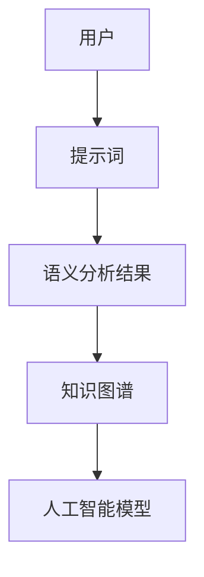
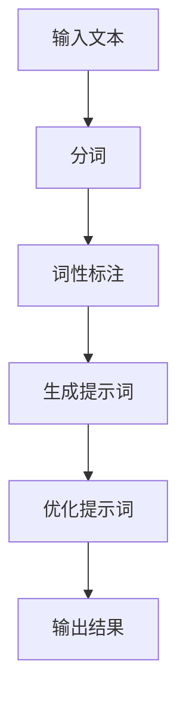

                 

# 提示词工程：AI时代的新机遇与新挑战

关键词：AI时代，提示词工程，新机遇，新挑战，自然语言处理，人工智能模型，算法原理，优化策略

摘要：本文深入探讨了AI时代提示词工程的重要性及其面临的挑战。通过分析提示词工程的定义、原理、算法和应用，本文旨在揭示提示词工程在AI领域的机遇和未来发展方向。

## 第一部分：背景介绍

### 第1章：AI时代的新机遇与新挑战

#### 1.1 问题背景

##### 1.1.1 人工智能的发展历程

自20世纪50年代人工智能（AI）概念提出以来，人工智能经历了多个发展阶段。从早期的符号主义方法，到20世纪80年代专家系统的崛起，再到21世纪初基于数据和统计学习方法的兴起，人工智能技术不断进步，应用领域逐渐扩展。

##### 1.1.2 人工智能在现代社会中的应用

人工智能在现代社会中的应用日益广泛，从自动驾驶、智能家居到医疗诊断、金融分析，人工智能已经成为推动社会进步的重要力量。特别是自然语言处理（NLP）和计算机视觉（CV）等领域，人工智能的发展带来了革命性的变化。

##### 1.1.3 提示词工程的定义与作用

提示词工程是一种结合自然语言处理和人工智能技术的方法，旨在通过设计和优化提示词来提升模型性能和应用效果。提示词工程在AI领域发挥着重要作用，是当前AI研究的一个重要方向。

#### 1.2 问题描述

##### 1.2.1 提示词工程在AI时代的角色

在AI时代，提示词工程扮演着至关重要的角色。通过优化提示词，可以提升模型对未知数据的泛化能力，从而提高模型在实际应用中的性能。

##### 1.2.2 提示词工程面临的主要挑战

提示词工程在实现过程中面临诸多挑战，如提示词生成算法的选择、优化策略的设计以及模型性能的评估等。如何应对这些挑战，是提示词工程领域亟待解决的问题。

##### 1.2.3 提示词工程的实现方式

提示词工程的实现方式主要包括提示词的生成、优化和评估等步骤。通过这些步骤，可以逐步提升模型的性能和应用效果。

#### 1.3 问题解决

##### 1.3.1 提示词工程的解决方案

针对提示词工程面临的问题，本文提出了一系列解决方案，包括提示词生成算法的改进、优化策略的创新以及评估方法的研究等。

##### 1.3.2 提示词工程的实施步骤

提示词工程的实施步骤包括需求分析、方案设计、算法实现和性能评估等。通过这些步骤，可以逐步实现提示词工程的优化和改进。

##### 1.3.3 提示词工程的预期效果

通过实施提示词工程，可以显著提升模型的性能和应用效果，为AI领域的发展带来新的机遇和挑战。

#### 1.4 边界与外延

##### 1.4.1 提示词工程的边界

提示词工程的边界涉及自然语言处理、人工智能模型和优化算法等多个领域。在实施过程中，需要充分考虑这些边界条件，以确保工程的顺利进行。

##### 1.4.2 提示词工程的外延

提示词工程的外延包括提示词的应用场景、跨领域融合以及与大数据、云计算等技术的结合等。这些外延为提示词工程提供了更广阔的发展空间。

##### 1.4.3 提示词工程与其他相关领域的联系

提示词工程与其他相关领域如知识图谱、语义理解和机器学习等有着密切的联系。在实施过程中，需要充分利用这些联系，以实现工程的优化和提升。

#### 1.5 概念结构与核心要素组成

##### 1.5.1 提示词工程的概念结构

提示词工程的概念结构包括自然语言处理、人工智能模型和优化算法等核心组成部分。这些组成部分相互关联，共同构成了提示词工程的整体框架。

##### 1.5.2 提示词工程的核心要素组成

提示词工程的核心要素组成包括提示词的生成、优化和评估等步骤。这些步骤构成了提示词工程的核心流程，是实现工程目标的关键。

##### 1.5.3 提示词工程的关键性能指标

提示词工程的关键性能指标包括模型准确率、响应速度和应用效果等。这些指标是评估提示词工程效果的重要依据。

#### 1.6 本章小结

本章介绍了AI时代的新机遇与新挑战，分析了提示词工程的定义、作用和实现方式。通过本章的介绍，读者可以初步了解提示词工程的基本概念和框架结构。

## 第二部分：核心概念与联系

### 第2章：提示词工程的关键概念与原理

#### 2.1 提示词工程的定义

提示词工程是一种结合自然语言处理和人工智能技术的方法，旨在通过设计和优化提示词来提升模型性能和应用效果。提示词工程的核心任务包括提示词的生成、优化和评估等。

##### 2.1.1 提示词的基本概念

提示词是指用于引导模型进行特定任务的语言片段。提示词可以是对输入数据的概括性描述，也可以是具体的指令性语句。

##### 2.1.2 提示词在自然语言处理中的应用

在自然语言处理领域，提示词广泛应用于文本分类、情感分析、机器翻译等任务。通过设计合适的提示词，可以显著提高模型的性能和应用效果。

##### 2.1.3 提示词工程的概念内涵

提示词工程的概念内涵包括提示词的生成、优化和评估等过程。这些过程相互关联，共同构成了提示词工程的核心内容。

#### 2.2 提示词工程的基本原理

提示词工程的基本原理包括自然语言处理技术基础、提示词生成算法和优化策略等。

##### 2.2.1 自然语言处理技术基础

自然语言处理技术基础包括文本预处理、词性标注、句法分析、语义分析等。这些技术为提示词工程提供了基础支持。

##### 2.2.2 提示词生成算法

提示词生成算法包括基于规则的方法、基于统计的方法和基于深度学习的方法等。这些方法可以根据具体任务需求进行选择和应用。

##### 2.2.3 提示词优化策略

提示词优化策略包括基于搜索的方法、基于优化的方法和基于机器学习的方法等。这些策略可以用于提高提示词的质量和效果。

#### 2.3 提示词工程的核心概念联系

提示词工程的核心概念联系包括提示词与语义理解、提示词与知识图谱和提示词与人工智能模型等。

##### 2.3.1 提示词与语义理解

提示词与语义理解密切相关。通过设计合适的提示词，可以提升模型对语义的理解能力，从而提高模型的应用效果。

##### 2.3.2 提示词与知识图谱

提示词与知识图谱相结合，可以进一步提升模型的知识表示能力。知识图谱为提示词提供了丰富的语义信息，有助于优化提示词的设计和应用。

##### 2.3.3 提示词与人工智能模型

提示词与人工智能模型密切相关。通过优化提示词，可以提升模型对数据的理解和处理能力，从而提高模型的性能和应用效果。

#### 2.4 提示词工程属性特征对比表格

| 特征类别 | 属性1 | 属性2 | 属性3 | 属性4 |
|----------|-------|-------|-------|-------|
| 提示词生成 | 统计方法 | 深度学习方法 | 规则方法 | 数据依赖性 |
| 提示词优化 | 优化算法 | 机器学习方法 | 搜索算法 | 适应能力 |
| 语义理解 | 词汇理解 | 句法分析 | 语义分析 | 知识表示 |

#### 2.5 提示词工程ER实体关系图架构



#### 2.6 本章小结

本章介绍了提示词工程的关键概念和原理，包括定义、基本原理、核心概念联系以及属性特征对比表格和ER实体关系图架构。通过本章的介绍，读者可以深入理解提示词工程的基本概念和框架结构。

## 第三部分：算法原理讲解

### 第3章：提示词工程的算法原理与应用

#### 3.1 提示词生成算法

##### 3.1.1 提示词生成算法概述

提示词生成算法是提示词工程的核心组成部分，旨在根据输入数据生成合适的提示词。生成算法可以分为基于规则的方法、基于统计的方法和基于深度学习的方法等。

##### 3.1.2 提示词生成算法的流程

提示词生成算法的流程主要包括文本预处理、特征提取、提示词生成和优化等步骤。通过这些步骤，可以逐步生成高质量的提示词。

##### 3.1.3 提示词生成算法的实例

以下是一个简单的基于统计方法的提示词生成算法实例：

```python
def generate_prompt(text):
    # 文本预处理
    processed_text = preprocess(text)
    
    # 特征提取
    features = extract_features(processed_text)
    
    # 提示词生成
    prompt = generate_random_prompt(features)
    
    return prompt
```

#### 3.2 提示词优化策略

##### 3.2.1 提示词优化策略概述

提示词优化策略旨在通过调整和优化提示词，提升模型性能和应用效果。优化策略可以分为基于搜索的方法、基于优化的方法和基于机器学习的方法等。

##### 3.2.2 提示词优化策略的流程

提示词优化策略的流程主要包括目标函数定义、优化算法选择、优化过程和性能评估等步骤。通过这些步骤，可以逐步优化提示词。

##### 3.2.3 提示词优化策略的实例

以下是一个简单的基于优化算法的提示词优化策略实例：

```python
import optimize_algorithm

def optimize_prompt(prompt, target_function):
    # 定义目标函数
    objective_function = define_objective_function(target_function)
    
    # 选择优化算法
    optimizer = optimize_algorithm.select_optimizer(algorithm_name)
    
    # 优化过程
    optimized_prompt = optimizer.optimize(prompt, objective_function)
    
    return optimized_prompt
```

#### 3.3 提示词工程与自然语言处理

##### 3.3.1 自然语言处理的基本概念

自然语言处理（NLP）是人工智能的一个重要分支，旨在使计算机能够理解、生成和处理自然语言。NLP的基本概念包括文本预处理、词性标注、句法分析、语义分析等。

##### 3.3.2 提示词工程在自然语言处理中的应用

提示词工程在自然语言处理中具有广泛应用。通过设计合适的提示词，可以提升模型在文本分类、情感分析、机器翻译等任务中的性能。

##### 3.3.3 自然语言处理与提示词工程的关系

自然语言处理和提示词工程密切相关。自然语言处理提供了提示词生成和优化的基础，而提示词工程则利用自然语言处理技术提升模型性能和应用效果。

#### 3.4 提示词工程的数学模型和公式

##### 3.4.1 提示词工程的基础数学模型

提示词工程的基础数学模型主要包括概率模型、神经网络模型和优化模型等。

##### 3.4.2 提示词工程的数学公式

提示词工程的数学公式主要包括损失函数、梯度下降算法和优化目标等。

##### 3.4.3 提示词工程的数学公式举例

以下是一个简单的损失函数示例：

$$
L(y, \hat{y}) = -\sum_{i=1}^{n} y_i \log(\hat{y}_i)
$$

其中，$y$表示真实标签，$\hat{y}$表示模型预测概率。

#### 3.5 算法流程图与Python源代码实现

##### 3.5.1 算法流程图

以下是一个简单的提示词生成和优化算法流程图：



##### 3.5.2 Python源代码实现

以下是一个简单的Python源代码实现示例：

```python
import preprocess
import generate_prompt
import optimize_prompt

def main():
    # 输入文本
    text = "这是一个示例文本。"
    
    # 提示词生成
    prompt = generate_prompt.generate_prompt(text)
    
    # 提示词优化
    optimized_prompt = optimize_prompt.optimize_prompt(prompt, target_function)
    
    # 输出结果
    print("原始提示词：", prompt)
    print("优化后提示词：", optimized_prompt)

if __name__ == "__main__":
    main()
```

#### 3.6 本章小结

本章介绍了提示词工程的算法原理和应用，包括提示词生成算法、提示词优化策略、自然语言处理以及数学模型和Python源代码实现。通过本章的介绍，读者可以了解提示词工程的基本算法原理和实现方法。

