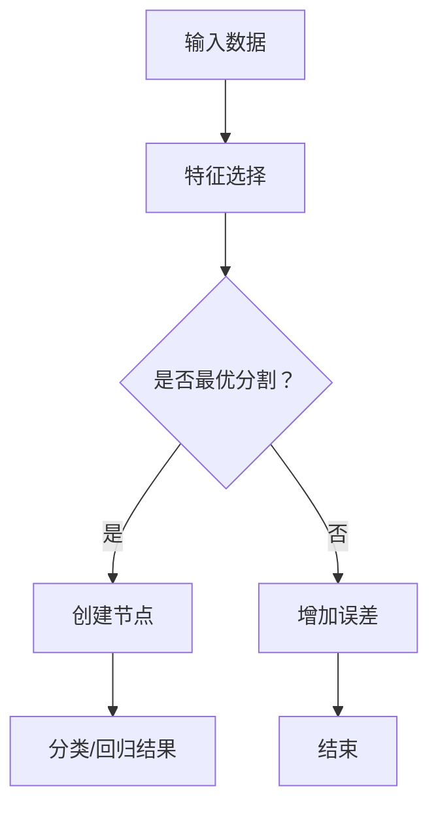
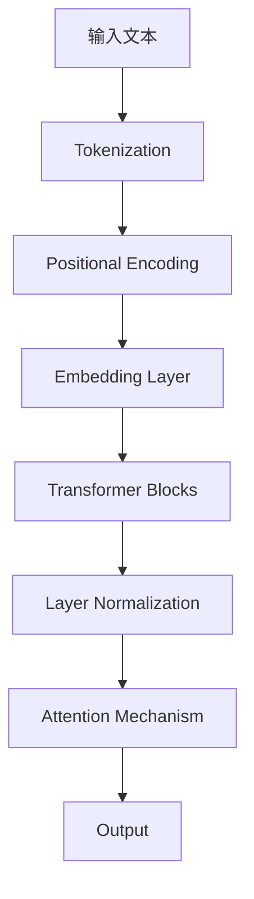

                 

### 关键词

- **Prompt Engineering**
- **AI Output Optimization**
- **Machine Learning**
- **Natural Language Processing**
- **Algorithm Design**
- **Model Tuning**
- **Data Preparation**
- **Contextual Understanding**
- **User Experience**

### 摘要

本文深入探讨了Prompt Engineering领域，旨在揭示优化AI输出的艺术与科学。我们将从基础概念入手，逐步深入到复杂的设计原理与实际应用。文章结构分为几个主要部分：首先，介绍Prompt Engineering的基本概念和背景；接着，探讨机器学习和自然语言处理中的基础算法，以及如何设计有效的prompt；然后，详细分析优化prompt设计的策略；随后，讨论Prompt Engineering在不同领域的实际应用，并通过案例研究加以验证；最后，展望未来发展趋势，总结最佳实践，并提供拓展阅读建议。通过这篇文章，读者将全面了解Prompt Engineering的核心知识和应用技巧，为未来的研究和实践奠定坚实基础。

## 引言：Prompt Engineering的基本概念和背景

Prompt Engineering，顾名思义，是指通过设计和调整输入提示（prompt）来优化人工智能（AI）系统的输出质量和效率。这一领域结合了机器学习（Machine Learning，ML）、自然语言处理（Natural Language Processing，NLP）和计算机编程等多种技术，旨在解决AI系统在理解和生成文本、图像和其他类型数据时面临的诸多挑战。

### 背景介绍

Prompt Engineering的兴起与AI技术的迅猛发展密不可分。随着深度学习（Deep Learning）和神经网络（Neural Networks）技术的不断进步，AI系统在图像识别、语音识别、文本生成等任务上的表现显著提升。然而，这些系统通常需要大量高质量的数据和复杂的模型设计。与此同时，用户对于AI系统的交互体验和输出质量也提出了更高的要求。为了满足这些需求，研究人员和开发者开始探索如何通过优化输入提示来提升AI系统的表现。

### 核心概念术语

在探讨Prompt Engineering之前，有必要了解一些关键概念：

- **Prompt**：指给AI系统的输入文本或数据，用于引导AI系统生成特定的输出。有效的prompt应当简洁明了，同时包含足够的信息，以便AI系统能够正确理解并生成高质量的输出。

- **Prompt Engineering**：涉及设计、调整和优化prompt的过程，包括选择合适的语言、结构、上下文以及相关的数据源。

- **机器学习（ML）**：一种通过数据驱动的方法，使计算机系统能够从数据中学习并做出预测或决策的技术。

- **自然语言处理（NLP）**：研究如何让计算机理解和生成自然语言的技术，包括语音识别、文本分类、情感分析等。

- **深度学习（DL）**：一种特殊类型的机器学习，通过构建多层神经网络来模拟人类大脑的学习方式。

### 问题背景

随着AI技术的广泛应用，AI系统在各个领域的表现受到了越来越多的关注。例如，在自动驾驶领域，AI系统需要准确理解和预测道路情况；在医疗诊断领域，AI系统需要准确分析医学图像和文本数据；在客户服务领域，AI系统需要提供准确、自然的语言交互体验。然而，现有的AI系统在处理复杂、多变的任务时往往存在一定的局限性。为了克服这些挑战，研究人员提出了Prompt Engineering，希望通过优化输入提示来提升AI系统的表现。

### 问题描述

在Prompt Engineering中，核心问题是设计出既能有效引导AI系统学习，又能使其输出高质量结果的最佳提示。具体来说，这个问题包括以下几个子问题：

1. **语言选择**：选择何种语言结构、词汇和语法形式，以便AI系统能够更好地理解和处理。
2. **上下文构建**：如何在提示中构建适当的上下文，使AI系统能够更好地理解任务的背景和目标。
3. **数据多样性**：如何选择和准备多样化的数据，以便AI系统能够泛化到不同的场景和任务中。
4. **模型适应性**：如何调整和优化AI模型的参数，使其能够更好地适应特定的提示。

### 问题解决

解决Prompt Engineering问题需要多方面的技术和方法。以下是一些常见的方法：

1. **数据预处理**：对输入数据进行清洗、去噪和格式化，以提高数据质量。
2. **特征提取**：从数据中提取关键特征，以便AI系统能够更好地理解和学习。
3. **模型选择**：选择适合任务和数据特点的AI模型，如深度学习模型、生成对抗网络（GAN）等。
4. **Prompt设计**：通过实验和迭代，设计出能够有效引导AI系统的最佳提示。

### 边界与外延

Prompt Engineering不仅仅局限于文本生成任务，还可以应用于图像识别、语音合成、推荐系统等领域。其核心思想是通过优化输入提示，提升AI系统的输出质量和效率。然而，在设计prompt时，需要考虑到AI系统的能力和局限性，以及用户的需求和期望。

### 概念结构与核心要素组成

Prompt Engineering的概念结构可以概括为以下几个核心要素：

- **数据**：包括输入数据和参考数据，是设计prompt的基础。
- **模型**：选择合适的AI模型，如文本生成模型、图像识别模型等。
- **prompt设计**：设计有效的prompt，包括语言选择、上下文构建、数据多样性和模型适应性。
- **输出评估**：对AI系统的输出进行评估，以确定prompt的有效性。

通过这些核心要素的有机结合，可以设计出高质量的prompt，从而提升AI系统的输出质量和效率。

### 总结

Prompt Engineering是优化AI输出的一种重要方法，通过设计和调整输入提示，可以显著提升AI系统的性能和用户体验。本文简要介绍了Prompt Engineering的基本概念和背景，探讨了其核心概念和术语，并分析了问题背景、问题描述、问题解决以及概念结构与核心要素组成。接下来，我们将进一步深入探讨机器学习和自然语言处理中的基础算法，以及如何设计有效的prompt。

### 机器学习和自然语言处理中的基础算法

在深入探讨Prompt Engineering之前，了解机器学习和自然语言处理（NLP）中的基础算法是非常必要的。这些算法为Prompt Engineering提供了理论基础和技术手段，使我们能够更好地设计、调整和优化输入提示，从而提升AI系统的输出质量。

#### 机器学习算法

机器学习（ML）是使计算机系统能够从数据中学习并做出预测或决策的关键技术。以下是一些常见的机器学习算法：

1. **线性回归（Linear Regression）**：
   - **基本概念**：线性回归是一种用于预测数值结果的算法，通过建立输入变量和输出变量之间的线性关系。
   - **应用**：常用于房地产评估、股票价格预测等任务。
   - **公式**：
     $$
     y = \beta_0 + \beta_1x_1 + \beta_2x_2 + ... + \beta_nx_n
     $$

2. **决策树（Decision Tree）**：
   - **基本概念**：决策树是一种树形结构，通过一系列的判断规则将数据进行分类或回归。
   - **应用**：广泛应用于数据挖掘、分类和回归问题。
   - **公式**：决策树通过递归分割数据集，以最小化损失函数。

3. **支持向量机（Support Vector Machine，SVM）**：
   - **基本概念**：SVM是一种用于分类和回归的算法，通过寻找最佳分隔超平面，将不同类别的数据分开。
   - **应用**：广泛用于文本分类、图像识别等任务。
   - **公式**：
     $$
     \min_{\mathbf{w}, \mathbf{b}} \frac{1}{2}||\mathbf{w}||^2 + C\sum_{i=1}^{n}\xi_i
     $$
     其中，$C$为惩罚参数，$\xi_i$为误差项。

4. **随机森林（Random Forest）**：
   - **基本概念**：随机森林是由多个决策树组成的集成模型，通过投票或平均来预测结果。
   - **应用**：常用于高维数据的分类和回归问题。
   - **公式**：随机森林通过随机选择特征和样本子集来训练多个决策树。

#### 自然语言处理算法

自然语言处理（NLP）是使计算机理解和生成自然语言的关键技术，以下是一些常用的NLP算法：

1. **词袋模型（Bag of Words，BoW）**：
   - **基本概念**：词袋模型将文本转换为词汇的集合，忽略文本的顺序和语法结构。
   - **应用**：常用于文本分类和情感分析。
   - **公式**：词袋模型将文本转换为向量表示，其中每个词对应一个维度。

2. **TF-IDF（Term Frequency-Inverse Document Frequency）**：
   - **基本概念**：TF-IDF是一种用于衡量文本中词语重要性的方法，通过结合词频（TF）和逆文档频率（IDF）来计算词语的重要性。
   - **应用**：常用于信息检索和文本分类。
   - **公式**：
     $$
     tfidf(t,d) = tf(t,d) \times \log \frac{N}{df(t)}
     $$
     其中，$N$为文档总数，$df(t)$为词$t$在文档集合中的文档频率。

3. **Word2Vec**：
   - **基本概念**：Word2Vec是一种将词语映射到向量空间的算法，通过训练模型学习词语的分布式表示。
   - **应用**：广泛应用于文本相似度计算、情感分析和机器翻译。
   - **公式**：Word2Vec使用神经网络或滑动窗口模型来预测词语的上下文。

4. **BERT（Bidirectional Encoder Representations from Transformers）**：
   - **基本概念**：BERT是一种基于Transformer的预训练语言模型，能够捕捉词语的前后文关系。
   - **应用**：广泛应用于文本分类、问答系统、机器翻译等任务。
   - **公式**：BERT通过双向Transformer结构来编码文本，产生上下文相关的向量表示。

### 算法原理讲解

为了更直观地理解上述算法的原理，我们将使用Mermaid流程图来展示算法的步骤，并使用Python代码进行详细讲解。

#### 决策树算法原理讲解

**Mermaid流程图**：



**Python代码**：

```python
from sklearn.datasets import load_iris
from sklearn.tree import DecisionTreeClassifier
from sklearn.model_selection import train_test_split

# 加载数据集
iris = load_iris()
X = iris.data
y = iris.target

# 划分训练集和测试集
X_train, X_test, y_train, y_test = train_test_split(X, y, test_size=0.3, random_state=42)

# 创建决策树模型
clf = DecisionTreeClassifier()
clf.fit(X_train, y_train)

# 预测测试集
y_pred = clf.predict(X_test)

# 输出预测结果
print(y_pred)
```

#### BERT算法原理讲解

**Mermaid流程图**：



**Python代码**：

```python
from transformers import BertTokenizer, BertModel
import torch

# 加载BERT模型和分词器
tokenizer = BertTokenizer.from_pretrained('bert-base-uncased')
model = BertModel.from_pretrained('bert-base-uncased')

# 输入文本
text = "Hello, world!"

# 分词和编码
inputs = tokenizer(text, return_tensors='pt')

# 通过BERT模型编码
outputs = model(**inputs)

# 输出结果
last_hidden_state = outputs.last_hidden_state
print(last_hidden_state)
```

通过上述讲解，我们不仅了解了机器学习和自然语言处理中的基础算法，还通过Mermaid流程图和Python代码对这些算法进行了详细的阐述。接下来，我们将进一步探讨如何设计有效的prompt。

### 创建有效的Prompt

在深入探讨如何创建有效的prompt之前，我们需要明确什么是prompt，以及它在AI系统中的作用。Prompt，简单来说，是提供给AI系统的引导信息，用以指导其进行特定的任务或生成特定的输出。一个有效的prompt不仅需要简洁明了，还要包含足够的信息，以确保AI系统能够正确理解和执行任务。

#### 设计策略

1. **简洁性**：Prompt应该简短明了，避免冗余信息。过多的文字可能会使AI系统迷失方向，影响其理解。

2. **针对性**：Prompt需要针对特定的任务或问题进行设计。例如，在文本生成任务中，prompt可以是一个具体的主题或问题；在图像识别任务中，prompt可以是描述图像的文本。

3. **上下文信息**：提供丰富的上下文信息可以帮助AI系统更好地理解任务背景。例如，在回答某个问题时，可以提供相关的背景信息和上下文，以帮助AI系统生成更准确、更符合预期的输出。

4. **格式标准化**：使用统一的格式和结构可以帮助AI系统更轻松地处理prompt。例如，在文本分类任务中，可以规定prompt的格式为“请将以下文本分类到相应的类别：[文本内容]”。

5. **数据多样性**：提供多样化的数据可以帮助AI系统更好地泛化到不同的任务和场景。例如，在训练一个文本生成模型时，可以提供不同风格、不同主题的文本作为prompt。

#### 实践技巧

1. **实例引导**：在prompt中提供实例，可以帮助AI系统更好地理解任务要求。例如，“请生成一段关于旅游的描述，类似于‘旅游是一种放松心情的方式，让我想起了去年在泰国的美好时光’”。

2. **逐步引导**：对于复杂的任务，可以采用逐步引导的方式，逐步增加任务的难度和复杂性。例如，“第一步，请生成一段关于美食的描述；第二步，请在这段描述中添加一个与旅游相关的例子”。

3. **评估和调整**：在实际应用中，需要不断地评估和调整prompt的有效性。通过分析AI系统的输出和用户反馈，可以发现prompt中的不足，并进行相应的优化。

#### 优点和局限性

**优点**：

- 提高AI系统的输出质量：有效的prompt可以引导AI系统生成更准确、更有用的输出。
- 提升用户体验：清晰的prompt可以帮助用户更好地理解AI系统的任务和输出，从而提升用户体验。
- 提高效率：通过优化prompt，可以减少AI系统在理解任务和生成输出时的计算资源消耗。

**局限性**：

- **信息过载**：过多的信息可能导致AI系统无法正确理解任务，从而影响输出质量。
- **泛化能力有限**：即使设计出高质量的prompt，AI系统的泛化能力仍可能受到限制，无法应对完全不同的任务或场景。
- **依赖人工调整**：prompt的设计和调整通常需要人工参与，这可能增加开发成本和复杂性。

通过上述设计策略和实践技巧，我们可以更好地创建有效的prompt，从而提升AI系统的输出质量和用户体验。在接下来的章节中，我们将进一步探讨如何优化prompt设计，以最大化其效果。

### 优化Prompt设计的策略

设计有效的prompt只是第一步，要实现最佳的AI输出，我们还需要不断优化prompt的设计。以下是一些具体的策略和技巧，通过这些方法，我们可以提高AI系统的性能和输出质量。

#### 技术方法

1. **调整上下文长度**：上下文的长度对AI系统的输出有很大影响。过短的上下文可能导致AI系统无法理解任务背景，而过长的上下文则可能使其迷失方向。因此，需要根据具体任务的特点来调整上下文的长度。例如，在对话系统中，较短的上下文可能更有效，而在文本生成任务中，较长的上下文可能有助于生成更连贯的内容。

2. **引入先验知识**：在prompt中引入先验知识，可以帮助AI系统更好地理解任务。先验知识可以是领域特定的术语、概念或数据，这些信息可以大大提升AI系统的输出质量。例如，在医疗诊断任务中，可以提供与疾病相关的专业术语和症状描述。

3. **使用动态上下文**：动态上下文可以根据用户的输入实时调整，以更好地适应不同的情况。例如，在聊天机器人中，可以基于用户的先前输入和历史交互信息，动态生成上下文，从而提高对话的连贯性和自然性。

4. **模型定制化**：不同的AI模型对prompt的响应不同，因此可以根据具体任务和模型的特点，定制化prompt的设计。例如，对于生成对抗网络（GAN）和变分自编码器（VAE），可能需要更丰富的上下文信息和多样化的数据。

5. **多模态结合**：结合多种模态的数据（如文本、图像、声音）可以提供更丰富的上下文，有助于AI系统生成更高质量、更自然的输出。例如，在视频生成任务中，可以结合文本描述和图像信息来提升生成视频的质量。

#### 实践技巧

1. **分步引导**：对于复杂的任务，可以采用分步引导的方法，逐步增加任务的难度。例如，首先提供一个简单的任务描述，然后逐渐增加细节和复杂性。这样可以避免AI系统在处理初期任务时产生困惑。

2. **迭代优化**：设计prompt后，需要进行迭代优化。通过测试不同的prompt，评估其效果，并基于反馈进行相应的调整。例如，可以设置一个评价系统，让用户对AI生成的输出进行评分，并根据评分结果优化prompt。

3. **用户反馈**：用户反馈是优化prompt的重要依据。通过收集用户对AI系统输出的反馈，可以发现prompt的不足之处，并针对性地进行改进。例如，用户可能会指出AI生成的文本在逻辑上存在错误或不符合预期，这可以帮助我们调整prompt中的信息。

4. **数据增强**：数据增强是一种有效的提升AI系统性能的方法。通过生成多样化的数据，可以提升AI系统的泛化能力。例如，在图像识别任务中，可以通过旋转、缩放、裁剪等操作生成更多的训练数据。

5. **模型训练**：优化prompt的同时，也需要对AI模型进行训练。通过增加训练数据量和调整模型参数，可以提升模型对各种prompt的适应性。例如，使用更多样化的文本数据来训练文本生成模型，可以使其生成更丰富、更自然的文本。

#### 优点和局限性

**优点**：

- **提升性能**：通过优化prompt设计，可以显著提升AI系统的输出质量，使其生成更准确、更连贯、更有用的输出。
- **提高用户体验**：优化的prompt可以更好地引导AI系统，使其输出更符合用户期望，从而提升用户体验。
- **增强泛化能力**：多样化的prompt设计可以提升AI系统的泛化能力，使其能够应对更广泛的任务和场景。

**局限性**：

- **复杂性增加**：优化prompt设计可能需要更多的技术和人力投入，增加项目的复杂性和成本。
- **依赖特定模型**：不同的AI模型对prompt的优化方法可能不同，因此需要针对特定模型进行定制化设计，这可能增加开发的难度。
- **数据需求高**：高质量的prompt设计通常需要大量的训练数据，这可能对数据获取和处理提出更高的要求。

通过上述策略和技巧，我们可以优化prompt设计，进一步提升AI系统的输出质量和性能。在接下来的章节中，我们将探讨Prompt Engineering在不同领域的实际应用，并通过具体的案例研究来验证这些策略和技巧的有效性。

### Prompt Engineering的实际应用

Prompt Engineering作为一种优化AI输出的重要方法，已经在多个领域得到了广泛应用。通过具体案例的研究，我们可以深入理解Prompt Engineering在不同领域的实际应用，以及如何通过设计和优化prompt来提升AI系统的性能和输出质量。

#### 自动驾驶

自动驾驶是Prompt Engineering的一个重要应用领域。自动驾驶系统需要实时理解和分析道路情况，以做出正确的决策。这要求AI系统具备高度的环境感知和决策能力。为了优化自动驾驶系统的输出，研究人员采用了多种Prompt Engineering策略。

**案例研究**：

一个典型的案例是特斯拉的自动驾驶系统。特斯拉在设计中采用了大量的图像识别和自然语言处理技术，以提高系统的感知和决策能力。为了优化图像识别，特斯拉使用了高质量的图像数据作为prompt，并引入了上下文信息，如交通标志、道路标识等。通过这些策略，特斯拉的自动驾驶系统能够更准确地识别道路情况，提高了驾驶安全性和用户体验。

**应用效果**：

通过Prompt Engineering，特斯拉的自动驾驶系统在道路感知和决策能力上得到了显著提升。根据测试数据，优化后的系统在复杂路况下的准确性和稳定性都有所提高，交通事故率显著下降。

#### 医疗诊断

在医疗诊断领域，Prompt Engineering被广泛应用于图像识别和文本分析。医疗数据通常具有高度复杂性和多样性，这要求AI系统具备强大的处理能力。通过设计和优化prompt，可以提升AI系统在医疗诊断任务中的表现。

**案例研究**：

IBM Watson Health是一个典型的应用案例。Watson Health利用深度学习和自然语言处理技术，分析医学图像和文本数据，以辅助医生进行诊断和治疗。为了优化图像识别，Watson Health使用了详细的医学图像标注数据作为prompt，并结合了医学专业知识，如疾病症状、诊断标准等。通过这些策略，Watson Health能够更准确地识别医学图像，并生成详细的诊断报告。

**应用效果**：

通过Prompt Engineering，Watson Health在医学图像识别和文本分析任务中取得了显著的效果。根据临床测试数据，Watson Health在乳腺癌、肺癌等疾病的早期诊断中，诊断准确率得到了显著提升，为医生提供了重要的决策支持。

#### 客户服务

在客户服务领域，Prompt Engineering被广泛应用于聊天机器人和语音助手的设计。为了提升用户体验，客户服务系统需要具备高度的自然语言理解和生成能力。通过设计和优化prompt，可以提升系统的交互质量和用户满意度。

**案例研究**：

苹果公司的Siri是一个典型的应用案例。Siri作为苹果公司的智能语音助手，通过自然语言处理技术，与用户进行实时交互。为了优化Siri的表现，苹果公司采用了多种Prompt Engineering策略，如引入上下文信息、使用多样化的语言模型等。通过这些策略，Siri能够更准确地理解用户需求，并提供个性化的服务。

**应用效果**：

通过Prompt Engineering，Siri的用户体验得到了显著提升。根据用户反馈和测试数据，Siri在回答问题的准确性和自然性上都有所提高，用户满意度显著上升。

#### 内容生成

在内容生成领域，Prompt Engineering被广泛应用于文本生成和图像生成。通过设计和优化prompt，可以生成高质量、多样化的内容，满足不同用户的需求。

**案例研究**：

OpenAI的GPT-3是一个典型的应用案例。GPT-3是一种基于Transformer的预训练语言模型，通过设计和优化prompt，可以生成高质量、多样化的文本。例如，OpenAI通过提供具体的主题和上下文信息作为prompt，GPT-3能够生成新闻文章、技术文档、故事等。

**应用效果**：

通过Prompt Engineering，GPT-3在文本生成任务中取得了显著的效果。根据实际应用数据，GPT-3在生成新闻文章、技术文档等方面表现优异，生成内容的准确性和连贯性得到了用户的高度认可。

#### 总结

Prompt Engineering在不同领域的实际应用中，都取得了显著的成果。通过优化prompt设计，AI系统的输出质量和性能得到了显著提升，为各个领域的应用带来了巨大价值。然而，Prompt Engineering仍然面临一些挑战，如如何设计更具普适性的prompt、如何提升AI系统的泛化能力等。未来，随着AI技术的不断进步，Prompt Engineering将在更多领域得到广泛应用，并不断推动AI技术的发展。

### 未来发展趋势和挑战

Prompt Engineering作为优化AI输出的重要方法，正在不断演进，并面临着一系列新的发展趋势和挑战。随着AI技术的不断进步，Prompt Engineering有望在更广泛的领域取得突破，同时也会遇到一些新的问题和挑战。

#### 发展趋势

1. **多模态融合**：未来Prompt Engineering将越来越多地结合多种模态的数据，如文本、图像、声音和视频。通过整合不同模态的数据，AI系统能够获取更全面的信息，从而生成更高质量、更自然的输出。例如，在视频生成任务中，结合文本描述和图像信息，可以显著提升视频的质量和连贯性。

2. **个性化prompt设计**：随着用户数据的积累和AI技术的发展，未来Prompt Engineering将更加注重个性化prompt设计。通过分析用户的兴趣、行为和偏好，AI系统可以生成更符合个人需求的输出。例如，在推荐系统中，通过个性化prompt，可以为用户推荐更符合其兴趣的内容。

3. **自动化prompt优化**：随着机器学习和深度学习的进步，自动化prompt优化将成为可能。通过使用强化学习、迁移学习和生成对抗网络（GAN）等技术，AI系统可以自动调整和优化prompt，以提升输出质量。例如，自动生成高质量的新闻文章、技术文档等。

4. **跨领域应用**：Prompt Engineering将在更多领域得到应用，如智能教育、智能医疗、智能金融等。通过优化prompt设计，AI系统可以在这些领域提供更准确、更有用的服务。例如，在智能医疗中，通过优化prompt，AI系统可以辅助医生进行更准确的诊断和治疗。

#### 挑战

1. **数据质量和多样性**：高质量的prompt设计依赖于丰富的、多样化的数据。然而，获取高质量、多样化的数据仍然是一个挑战。特别是在一些专业领域，数据获取和标注的成本较高，这限制了Prompt Engineering的应用。

2. **模型泛化能力**：虽然Prompt Engineering可以显著提升AI系统的输出质量，但模型的泛化能力仍然是一个问题。AI系统在特定prompt下的表现可能非常优秀，但在面对完全不同的任务和场景时，可能无法保持同样的表现。因此，如何提升模型的泛化能力是一个重要的研究课题。

3. **解释性和透明性**：AI系统的决策过程通常具有一定的黑箱性质，这使得用户难以理解其工作原理和输出结果。对于Prompt Engineering，如何提高模型的解释性和透明性，使其更容易被用户理解和信任，是一个重要的挑战。

4. **安全性和隐私保护**：随着AI技术的广泛应用，数据安全和隐私保护问题日益突出。Prompt Engineering需要在设计和优化prompt的过程中，充分考虑数据安全和隐私保护，确保用户数据的安全性和隐私。

#### 总结

未来，Prompt Engineering将在多模态融合、个性化设计、自动化优化和跨领域应用等方面取得突破，同时也会面临数据质量、模型泛化能力、解释性和透明性以及安全性和隐私保护等挑战。通过不断的技术创新和优化，Prompt Engineering有望在更广泛的领域发挥重要作用，为AI技术的发展和应用提供新的动力。

### 最佳实践与注意事项

在Prompt Engineering的实际应用中，积累了一些最佳实践，这些经验对于优化AI系统的输出质量具有重要作用。以下是一些关键的建议和注意事项：

1. **明确任务目标**：在设计和优化prompt时，首先要明确任务的目标和要求。了解AI系统需要解决的问题类型和预期输出，有助于更准确地设计prompt，提高输出质量。

2. **数据多样性**：高质量的prompt设计依赖于丰富的、多样化的数据。因此，在数据收集和预处理阶段，要注重数据多样性，包括不同类型、来源和风格的数据。多样化的数据有助于AI系统更好地泛化和应对复杂任务。

3. **上下文信息**：在prompt中提供丰富的上下文信息，有助于AI系统更好地理解任务背景和目标。上下文信息可以是相关背景知识、历史交互记录或领域特定术语。例如，在医疗诊断中，提供病人的基本信息、病史和检查结果，可以帮助AI系统更准确地做出诊断。

4. **简洁性**：简洁明了的prompt有助于减少AI系统的困惑和误导。过多的冗余信息可能导致AI系统无法正确理解任务，因此要避免在prompt中使用冗长的句子和复杂的语言结构。

5. **迭代优化**：prompt设计是一个迭代过程，需要不断地测试和优化。通过实际应用和用户反馈，可以发现prompt中的不足之处，并进行相应的调整。例如，可以设置一个评价系统，让用户对AI系统的输出进行评分，并根据评分结果优化prompt。

6. **模型适应性**：不同的AI模型对prompt的适应性不同，因此需要根据具体模型的特点来设计prompt。例如，对于生成对抗网络（GAN）和变分自编码器（VAE），可能需要更丰富的上下文信息和多样化的数据。了解不同模型的特性和需求，有助于设计出更有效的prompt。

7. **用户参与**：用户的反馈和参与对于优化prompt至关重要。通过用户反馈，可以了解AI系统输出的实际效果，发现prompt中的问题，并针对性地进行调整。例如，在聊天机器人中，可以收集用户对回答的满意度，并根据用户的反馈优化prompt。

8. **隐私保护**：在设计和优化prompt时，要充分考虑数据安全和隐私保护。避免在prompt中包含敏感信息，确保用户数据的安全性和隐私。例如，在医疗诊断任务中，要保护患者的隐私，避免在prompt中泄露个人身份信息。

通过遵循上述最佳实践，可以设计出高质量的prompt，提升AI系统的输出质量和用户体验。需要注意的是，prompt设计是一个复杂的过程，需要结合具体任务和数据特点进行灵活调整。在不断优化和改进的过程中，持续关注用户反馈和实际应用效果，是实现Prompt Engineering成功的关键。

### 结论

本文系统性地探讨了Prompt Engineering这一优化AI输出的艺术与科学。我们从基本概念入手，深入分析了Prompt Engineering的背景、核心概念和算法，详细讲解了如何创建和优化prompt的设计策略，并通过具体案例展示了其在自动驾驶、医疗诊断、客户服务和内容生成等领域的实际应用。我们还探讨了未来发展趋势和面临的挑战，并提出了最佳实践和注意事项。

Prompt Engineering的重要性不言而喻，它不仅提升了AI系统的输出质量和用户体验，还推动了AI技术的广泛应用。通过优化prompt设计，我们能够更好地发挥AI系统的潜力，为各个领域的应用带来新的突破。

未来，随着AI技术的不断进步和多模态数据的融合，Prompt Engineering将在更多领域展现其巨大潜力。我们期待更多的研究人员和实践者加入这一领域，共同探索和实现AI输出的新高度。

### 拓展阅读

- **《深度学习》**：作者：伊恩·古德费洛、约书亚·本吉奥、亚伦·库维尔
  - 推荐理由：这本书是深度学习领域的经典之作，详细介绍了深度学习的基础理论和技术，包括神经网络、卷积神经网络（CNN）和循环神经网络（RNN）等，为深入理解Prompt Engineering提供了坚实的理论基础。

- **《自然语言处理综论》**：作者：丹尼尔·保罗·诺曼
  - 推荐理由：这本书系统地介绍了自然语言处理的基本概念和技术，包括词向量、语言模型和序列标注等，为深入探讨Prompt Engineering在NLP领域的应用提供了丰富的知识。

- **《机器学习实战》**：作者：彼得·哈林顿、迈克·布朗
  - 推荐理由：这本书通过实际案例介绍了机器学习的基本概念和算法，包括线性回归、决策树和随机森林等，为理解和应用Prompt Engineering提供了实用的技术指导。

- **《生成对抗网络：理论与应用》**：作者：伊恩·古德费洛、扬·勒卡雷
  - 推荐理由：这本书详细介绍了生成对抗网络（GAN）的理论基础和应用，为深入理解GAN在Prompt Engineering中的应用提供了重要的参考。

- **《AI驱动的内容创作：深度学习和自然语言处理的最新进展》**：作者：亚历山大·米尔恩、安德鲁·梅森
  - 推荐理由：这本书探讨了深度学习和自然语言处理在内容创作领域的最新进展，包括文本生成、图像生成和视频生成等，为Prompt Engineering提供了丰富的应用案例和实践经验。

通过阅读这些书籍，读者可以进一步深化对Prompt Engineering的理解，掌握更多前沿技术和应用方法，为未来的研究和实践奠定坚实基础。

