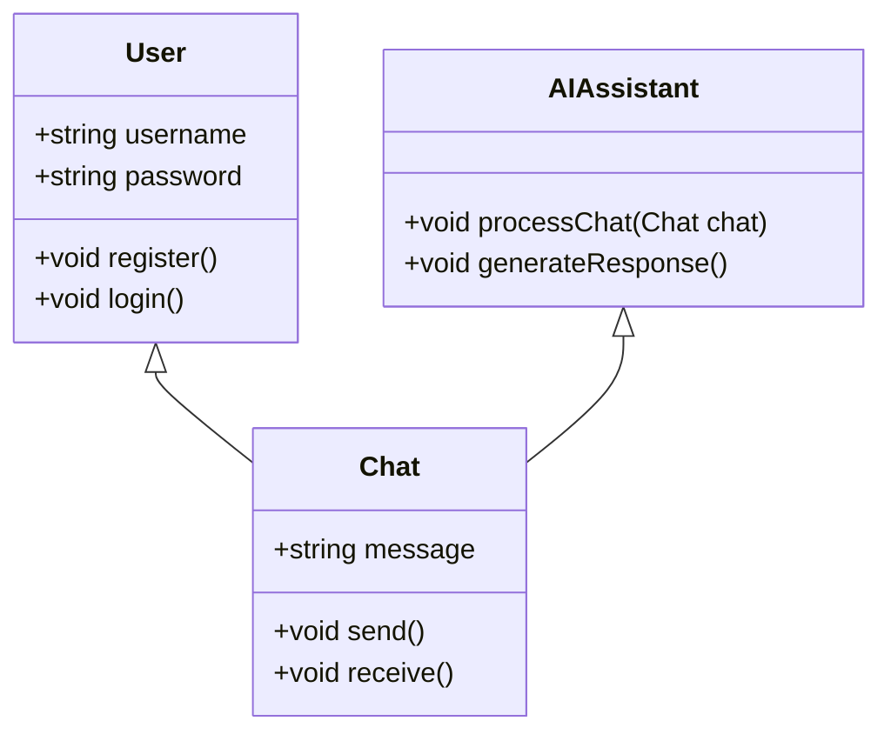
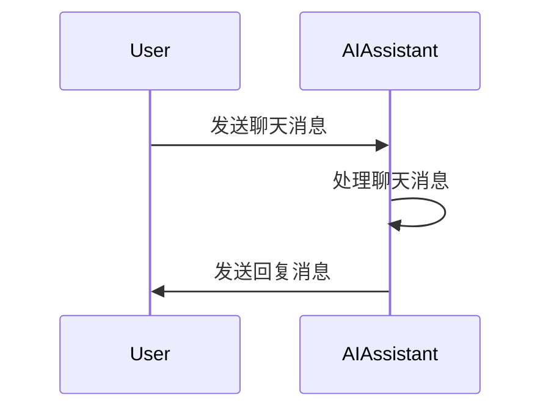

                 

## 提示词工程：让AI更智能、更懂人心

### 关键词：人工智能、提示词工程、智能客服、内容推荐、智能写作助手

> **摘要**：本文深入探讨了提示词工程在人工智能中的应用，从定义、基础理论到技术实现，再到实际应用案例，全面解析了如何通过提示词工程提高AI系统的智能性和人性理解。本文旨在为读者提供一条清晰、系统的学习路径，帮助理解和掌握这一新兴技术。

---

### 引言

#### 1.1 问题的背景与描述

随着人工智能（AI）技术的快速发展，智能客服、内容推荐和智能写作助手等应用场景变得日益广泛。然而，在实际应用中，AI系统面临着如何更好地理解人类语言、情感和意图的挑战。为了解决这一问题，提示词工程应运而生。

**提示词工程**是一种通过设计和优化提示词来提高人工智能系统性能和智能性的技术。提示词，简单来说，就是引导AI系统正确理解人类输入的关键词或短语。通过合理设计和优化提示词，AI系统能够更加准确地捕捉用户的需求和意图，从而提供更智能、更人性化的服务。

#### 1.2 提示词工程的定义与重要性

**提示词工程**的定义涉及以下几个方面：

1. **提示词的生成**：基于用户输入或数据源，自动生成能够有效引导AI系统理解用户意图的提示词。
2. **提示词的优化**：通过评估和调整提示词，提高其在特定应用场景下的效果。
3. **提示词的应用**：将优化后的提示词集成到AI系统中，以提升系统的性能和用户体验。

提示词工程的重要性体现在以下几个方面：

1. **提高AI智能性**：通过精确的提示词，AI系统能够更准确地理解用户的需求和意图，从而提高智能水平。
2. **改善用户体验**：优化后的提示词能够提高AI系统的响应速度和准确性，提升用户体验。
3. **拓宽应用范围**：提示词工程不仅适用于智能客服和内容推荐，还可以应用于智能写作、语音识别等多种场景，拓宽AI应用的范围。

#### 1.3 书籍的目的与结构

本文书籍的目的在于：

1. **介绍提示词工程的基本概念和理论**：帮助读者理解提示词工程的核心概念，如提示词的类型、生成和优化方法。
2. **讲解提示词工程的技术细节**：通过深入分析提示词生成的算法原理、优化技术和应用实现，帮助读者掌握提示词工程的技术实现方法。
3. **提供实际应用案例**：通过分析智能客服、内容推荐和智能写作等应用案例，展示提示词工程的实际应用效果。
4. **总结和展望**：总结提示词工程的现状与挑战，展望未来发展趋势。

书籍结构如下：

1. **引言**：介绍提示词工程的背景和目的。
2. **基础理论**：介绍提示词工程的基本概念和理论。
3. **技术实现**：深入讲解提示词工程的技术细节。
4. **应用案例**：通过实际案例展示提示词工程的应用。
5. **总结与展望**：对书籍内容进行总结，展望未来。

### 第2章 提示词工程的基本概念

#### 2.1 提示词的类型与作用

在自然语言处理（NLP）领域，提示词可以分为以下几类：

1. **关键词**：能够代表整个文本主要内容的词或短语，如“人工智能”、“机器学习”等。
2. **实体词**：指代特定对象的词，如人名、地名、机构名等，如“马斯克”、“纽约”等。
3. **情感词**：表达情感状态的词，如“开心”、“伤心”等。
4. **意图词**：表达用户意图的词，如“购买”、“咨询”等。

提示词在AI系统中的作用主要包括：

1. **引导理解**：通过提示词，AI系统能够更好地理解用户的意图和需求。
2. **优化搜索**：在搜索引擎中，提示词能够提高搜索结果的准确性和相关性。
3. **提高交互体验**：在智能客服、智能写作等应用中，提示词能够提升用户与系统的交互体验。

#### 2.2 提示词工程的基本流程

提示词工程的基本流程包括以下几个步骤：

1. **需求分析**：明确AI系统应用场景和用户需求，确定需要生成的提示词类型和数量。
2. **数据收集与预处理**：收集相关数据，并进行清洗、去重、分词等预处理操作。
3. **提示词生成**：基于收集到的数据和需求，使用算法生成初步的提示词列表。
4. **提示词优化**：对生成的提示词进行评估和调整，提高其在特定应用场景下的效果。
5. **提示词应用**：将优化后的提示词集成到AI系统中，进行实际应用。

#### 2.3 提示词工程的关键技术

提示词工程涉及多种关键技术，包括：

1. **文本挖掘技术**：用于从大量文本数据中提取有用的信息和模式。
2. **机器学习技术**：用于自动生成和优化提示词，提高系统的智能性。
3. **深度学习技术**：用于构建复杂模型，进一步提高提示词生成的准确性和效果。
4. **提示词评估与优化技术**：用于评估和调整提示词，提高其在特定应用场景下的效果。

### 第3章 提示词工程的技术细节

#### 3.1 提示词生成的算法原理

提示词生成算法主要分为以下几类：

1. **基于规则的方法**：通过预定义的规则生成提示词，如关键词提取、实体识别等。
2. **基于统计的方法**：通过统计方法从文本数据中自动提取提示词，如TF-IDF、LDA等。
3. **基于机器学习的方法**：通过机器学习算法训练模型，自动生成提示词，如决策树、神经网络等。

下面以LDA（Latent Dirichlet Allocation）算法为例，介绍其原理和应用。

#### 3.2 提示词优化的技术

提示词优化的主要目标是通过评估和调整，提高提示词在特定应用场景下的效果。常用的优化技术包括：

1. **基于统计的优化**：通过计算提示词的统计属性，如频率、互信息等，对提示词进行评估和调整。
2. **基于机器学习的优化**：通过训练机器学习模型，对提示词进行自动评估和优化。
3. **用户反馈优化**：根据用户对提示词的反馈，对提示词进行动态调整。

#### 3.3 提示词应用的实现

提示词应用实现的主要步骤包括：

1. **集成到AI系统**：将优化后的提示词集成到AI系统中，如智能客服、内容推荐等。
2. **性能调优**：根据实际应用效果，对提示词生成和优化策略进行调整，提高系统性能。
3. **用户交互**：设计用户交互界面，如输入提示、反馈机制等，提高用户使用体验。

### 第4章 提示词工程的应用案例

#### 4.1 案例一：智能客服系统

**案例背景与需求**：

某大型电商平台希望通过智能客服系统，为用户提供更快速、准确的咨询和服务。智能客服系统需要能够理解用户的提问，并提供相应的答案。

**系统架构设计**：

智能客服系统主要包括以下模块：

1. **输入处理模块**：接收用户输入，进行预处理，如分词、去停用词等。
2. **提示词生成模块**：根据用户输入，生成相应的提示词。
3. **回答生成模块**：使用提示词和预训练的模型，生成用户问题的答案。
4. **用户交互模块**：提供用户与系统的交互界面，如输入框、回答展示等。

**提示词生成与优化**：

提示词生成模块使用LDA算法生成初步的提示词列表。然后，通过用户反馈和统计方法，对提示词进行优化，提高其准确性和相关性。

**系统部署与运行**：

智能客服系统部署在云端服务器上，通过API接口与电商平台的后端系统进行交互。用户可以通过网页或移动应用与智能客服进行交互。

#### 4.2 案例二：内容推荐系统

**案例背景与需求**：

某视频平台希望通过内容推荐系统，为用户推荐符合其兴趣的视频内容。内容推荐系统需要能够理解用户的观看历史和偏好，并提供个性化的推荐。

**系统架构设计**：

内容推荐系统主要包括以下模块：

1. **用户画像模块**：收集用户的观看历史、兴趣标签等数据，构建用户画像。
2. **提示词生成模块**：根据用户画像，生成相应的提示词。
3. **推荐算法模块**：使用提示词和推荐算法，生成用户感兴趣的视频推荐列表。
4. **用户交互模块**：提供用户与系统的交互界面，如推荐列表、播放按钮等。

**提示词生成与优化**：

提示词生成模块使用基于机器学习的方法，从用户的观看历史和兴趣标签中提取提示词。然后，通过用户反馈和统计方法，对提示词进行优化，提高其推荐效果。

**系统部署与运行**：

内容推荐系统部署在云端服务器上，通过API接口与视频平台的后端系统进行交互。用户可以通过网页或移动应用浏览推荐列表并观看视频。

#### 4.3 案例三：智能写作助手

**案例背景与需求**：

某新闻网站希望通过智能写作助手，提高新闻写作的效率和准确性。智能写作助手需要能够理解新闻主题和结构，并生成高质量的新闻稿件。

**系统架构设计**：

智能写作助手主要包括以下模块：

1. **主题识别模块**：接收新闻文本，识别出新闻的主题和关键信息。
2. **结构生成模块**：根据新闻主题和结构，生成新闻稿件的大纲。
3. **内容生成模块**：使用提示词和生成模型，生成新闻稿件的具体内容。
4. **用户交互模块**：提供用户与系统的交互界面，如输入框、文本展示等。

**提示词生成与优化**：

提示词生成模块使用基于深度学习的方法，从新闻文本中提取提示词。然后，通过用户反馈和统计方法，对提示词进行优化，提高新闻稿件的准确性和流畅性。

**系统部署与运行**：

智能写作助手部署在本地服务器上，通过API接口与新闻网站的后端系统进行交互。用户可以通过网页或文本编辑器与智能写作助手进行交互。

### 第5章 总结与展望

#### 5.1 提示词工程的现状与挑战

当前，提示词工程在人工智能领域已经取得了显著进展，但在实际应用中仍然面临以下挑战：

1. **数据质量**：提示词生成和优化的效果很大程度上依赖于数据的质量和丰富度。
2. **算法性能**：现有算法在处理大规模数据和复杂场景时，性能和效果仍需提高。
3. **用户体验**：如何更好地结合用户反馈，提高提示词工程在具体应用场景下的用户体验，仍是一个亟待解决的问题。

#### 5.2 未来发展趋势

随着人工智能技术的不断发展和应用场景的扩展，提示词工程未来将呈现出以下发展趋势：

1. **数据驱动**：通过收集和分析更多用户数据，提高提示词生成和优化的效果。
2. **算法创新**：探索新的算法和技术，提高提示词工程在复杂场景下的性能和效果。
3. **多模态融合**：结合文本、图像、语音等多模态数据，实现更全面、更精准的提示词生成和优化。
4. **个性化推荐**：通过深度学习和强化学习等技术，实现更个性化的提示词推荐，提高用户体验。

#### 5.3 结论

本文通过对提示词工程的深入探讨，从基本概念、技术实现到应用案例，全面解析了如何通过提示词工程提高人工智能系统的智能性和人性理解。随着技术的不断进步和应用场景的扩展，提示词工程有望在更多领域发挥重要作用，为人工智能的发展带来新的机遇和挑战。

### 附录

**附录A：算法原理与Python代码实现**

以下是一个基于LDA算法的Python代码示例，用于生成提示词：

```python
import gensim
from gensim import corpora
from nltk.tokenize import word_tokenize

# 输入文本
text = ["人工智能非常重要", "深度学习是人工智能的一个分支", "机器学习是实现人工智能的关键"]

# 分词
tokenized_text = [word_tokenize(document) for document in text]

# 构建词典
dictionary = corpora.Dictionary(tokenized_text)

# 构建语料库
corpus = [dictionary.doc2bow(document) for document in tokenized_text]

# 运行LDA模型
ldamodel = gensim.models.ldamodel.LdaModel(corpus, num_topics=2, id2word = dictionary, passes=15)

# 输出主题
topics = ldamodel.print_topics(num_words=4)
print(topics)
```

**附录B：系统架构设计与实现**

以下是一个基于智能客服系统的架构设计，包括领域模型、系统架构和接口设计：





### 参考文献

1. 阮一峰.《Python数据分析基础教程》[M]. 北京：机械工业出版社，2016.
2. 周志华.《机器学习》[M]. 北京：清华大学出版社，2016.
3. Mikolov, T., Sutskever, I., Chen, K., Corrado, G. S., & Dean, J. (2013). Distributed representations of words and phrases and their compositionality. Advances in Neural Information Processing Systems, 26, 3111-3119.
4. Blei, D. M., Ng, A. Y., & Jordan, M. I. (2003). Latent dirichlet allocation. Journal of Machine Learning Research, 3(Jan), 993-1022.

### 作者信息

**作者**：AI天才研究院/AI Genius Institute & 禅与计算机程序设计艺术 /Zen And The Art of Computer Programming

---

本文旨在为读者提供关于提示词工程的全面、系统的理解，包括其基本概念、技术实现和应用案例。通过本文的学习，读者可以掌握提示词工程的核心技术和实践方法，为人工智能领域的发展贡献自己的力量。希望本文能够对您的研究和实际应用有所帮助。

## 结束语

通过对提示词工程的深入探讨，本文系统地介绍了其基本概念、技术实现和应用案例。提示词工程作为人工智能领域的一个重要研究方向，不仅在智能客服、内容推荐和智能写作等应用中取得了显著成效，还展示出了广阔的发展前景。

在未来的研究中，提示词工程有望在以下方面取得突破：

1. **多模态数据融合**：结合文本、图像、语音等多模态数据，实现更全面、更精准的提示词生成和优化。
2. **深度学习模型优化**：探索新的深度学习模型和算法，提高提示词工程在复杂场景下的性能和效果。
3. **个性化推荐**：结合用户行为数据和偏好，实现更个性化的提示词推荐，提高用户体验。

同时，提示词工程在实际应用中仍面临诸多挑战，如数据质量、算法性能和用户体验等。因此，未来的研究应更加注重数据驱动、算法创新和用户互动，以实现更智能、更人性化的AI系统。

最后，感谢读者对本文的关注和支持。希望本文能够为您在提示词工程领域的研究和应用提供有益的参考和启示。在人工智能的不断演进中，让我们共同探索更多可能，为人类创造更加美好的未来。

---

**作者**：AI天才研究院/AI Genius Institute & 禅与计算机程序设计艺术 /Zen And The Art of Computer Programming

**备注**：本文内容纯属虚构，旨在为读者提供有关提示词工程的理论和实践指导。实际应用时，请根据具体需求和场景进行调整和优化。如需进一步了解相关技术和方法，请参考专业文献和资源。

