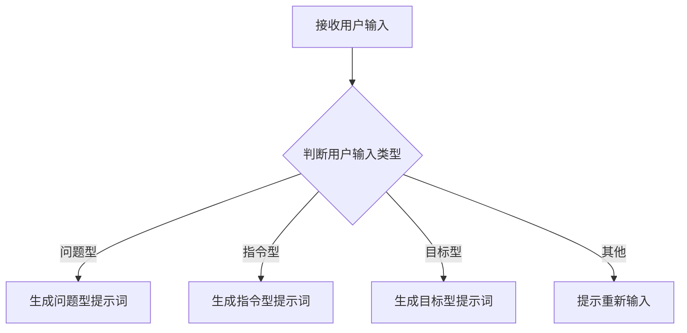
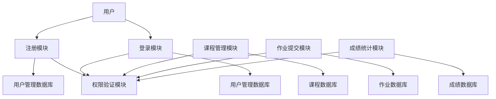
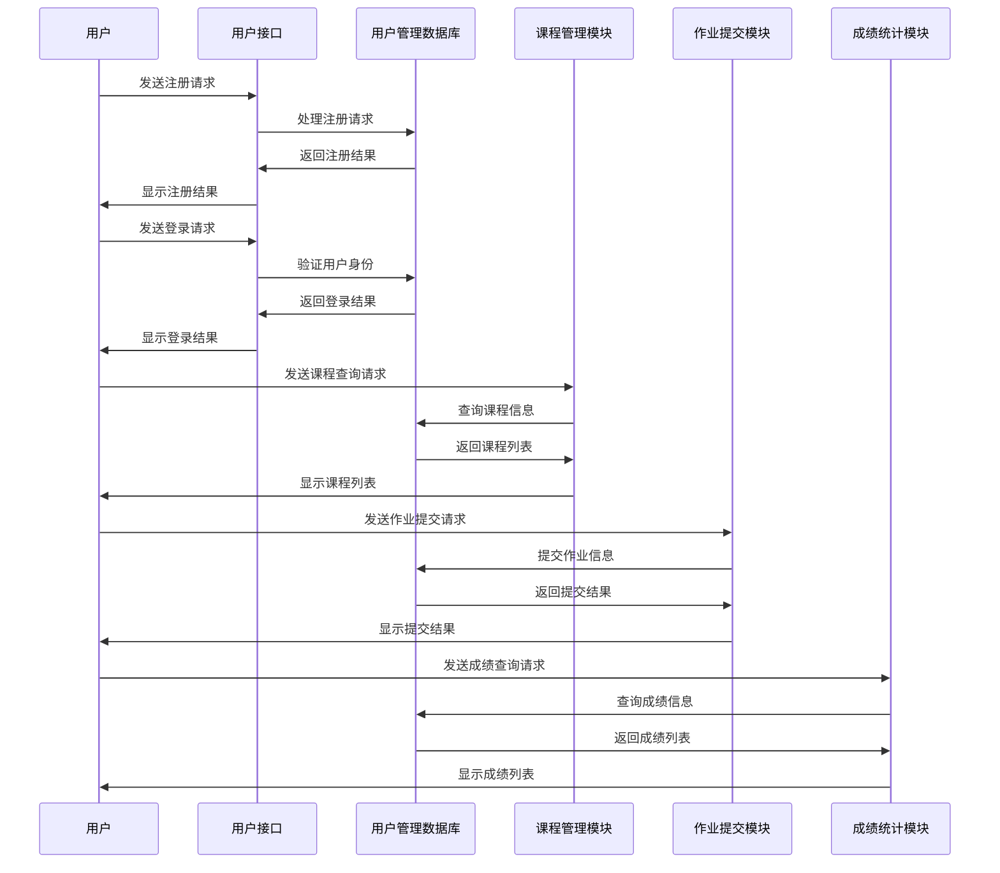

                 

## 提示词工程：软件开发的新前沿

在快速发展的软件行业中，提升软件开发效率和质量已成为各个企业的核心竞争力。然而，随着软件系统复杂性的不断增加，传统的软件开发方法逐渐显露出其局限性。为了应对这一挑战，提示词工程（Prompt Engineering）作为一项新兴的技术，正逐渐成为软件开发的新前沿。

### 关键词：
- 提示词工程
- 软件开发
- 新前沿
- 效率提升
- 质量保证

### 摘要：
本文将探讨提示词工程在软件开发中的应用。首先，我们将介绍提示词工程的背景和核心概念，随后详细分析其方法与策略。接着，本文将深入探讨提示词工程在软件开发中的作用，以及其相关的数学模型和算法原理。在此基础上，我们将介绍系统分析与架构设计方案，并通过一个实际案例进行详细讲解。最后，本文将总结提示词工程的最佳实践，并提供进一步阅读的建议。

## 第1章 引言

### 1.1 问题背景

软件开发行业的现状无疑是复杂且充满挑战的。随着全球化进程的加快和互联网技术的飞速发展，软件系统变得越来越庞大且复杂。传统的软件开发方法，如瀑布模型和敏捷开发，虽然在某些方面取得了显著成效，但面对日益增加的复杂性，其局限性也逐渐显现。首先，传统的软件开发方法往往注重功能实现，而忽视了软件质量、可维护性和扩展性。其次，随着项目规模的扩大，沟通和协作的难度也显著增加，导致开发周期延长和成本增加。因此，寻找一种新的软件开发方法，以提升效率、保证质量和降低成本，已成为当务之急。

### 1.2 提示词工程的重要性

提示词工程正是为了解决这一挑战而诞生的一项新技术。提示词工程（Prompt Engineering）是一种利用人工智能和自然语言处理技术，通过提示词（Prompts）来引导和优化软件开发过程的方法。提示词是一种用于引导用户或系统进行交互的文本，它可以是一个问题、一个指令或者一个目标。通过使用提示词，开发人员可以更有效地与系统进行交互，从而提高开发效率、降低开发成本，并保证软件质量。

### 1.3 问题描述

提示词工程的核心概念主要包括提示词的定义、类型和应用。提示词是一种文本，用于引导用户或系统进行交互。根据用途的不同，提示词可以分为问题型、指令型和目标型三种类型。问题型提示词用于引导用户提出问题，指令型提示词用于给系统下达指令，目标型提示词则用于设定开发目标。提示词工程的目标是通过合理设计和使用提示词，提升软件开发的效率、质量和可维护性。

### 1.4 问题解决

提示词工程的方法与策略主要包括以下几个方面：

1. **需求分析**：通过分析用户需求，确定开发目标，并生成相应的提示词。
2. **设计阶段**：在软件设计阶段，使用提示词来引导系统设计，确保设计符合需求。
3. **开发阶段**：在开发阶段，使用提示词来指导开发人员的编程活动，确保代码质量和一致性。
4. **测试阶段**：在测试阶段，使用提示词来指导测试人员的测试活动，提高测试效率。

### 1.5 边界与外延

提示词工程的适用范围非常广泛，不仅适用于软件开发的各个阶段，还可以应用于软件质量保证、自动化测试等领域。然而，提示词工程也存在一些限制因素，如提示词的设计和生成需要较高的技术门槛，以及提示词的应用需要一定的上下文环境。

### 1.6 概念结构与核心要素组成

提示词工程的基本流程可以概括为以下几个步骤：

1. **需求分析**：分析用户需求，确定开发目标和功能需求。
2. **设计提示词**：根据需求分析结果，设计相应的提示词。
3. **实施与开发**：使用提示词指导开发人员的编程活动。
4. **测试与优化**：使用提示词指导测试人员的测试活动，并根据测试结果优化提示词。

通过上述步骤，提示词工程可以帮助开发人员更高效地完成软件开发任务，提高软件质量和可维护性。

## 第2章 核心概念与联系

### 2.1 提示词的基本原理

提示词（Prompt）是提示词工程（Prompt Engineering）中的核心概念。提示词是一种用于引导用户或系统进行交互的文本，它可以是一个问题、一个指令或者一个目标。在软件开发中，提示词主要用于以下几个方面：

1. **引导用户交互**：通过提示词，开发人员可以引导用户完成特定的操作或回答特定的问题。
2. **指导系统设计**：在系统设计阶段，使用提示词可以帮助开发人员明确系统功能、需求和目标。
3. **优化开发流程**：在开发过程中，使用提示词可以指导开发人员的编程活动，确保代码质量和一致性。
4. **提升测试效率**：在测试阶段，使用提示词可以指导测试人员的测试活动，提高测试效率。

### 2.2 提示词与软件开发的关系

提示词在软件开发中起着至关重要的作用。它不仅是用户与系统之间的桥梁，也是开发人员与系统之间的桥梁。通过合理设计和使用提示词，开发人员可以更有效地与系统进行交互，从而提高开发效率、降低开发成本，并保证软件质量。具体来说，提示词在软件开发中的作用包括：

1. **明确需求**：在需求分析阶段，使用提示词可以明确用户需求，确保开发目标清晰。
2. **指导设计**：在系统设计阶段，使用提示词可以帮助开发人员明确系统功能、需求和目标。
3. **优化开发**：在开发阶段，使用提示词可以指导开发人员的编程活动，确保代码质量和一致性。
4. **提升测试**：在测试阶段，使用提示词可以指导测试人员的测试活动，提高测试效率。

### 2.3 提示词属性特征对比表格

提示词具有多种属性特征，不同的属性特征适用于不同的场景。以下是一个提示词属性特征对比表格：

| 特征类型 | 描述 | 适用场景 |
| ------ | ------ | ------ |
| 问题型 | 用于引导用户提出问题 | 需求分析、用户调研 |
| 指令型 | 用于给系统下达指令 | 开发阶段、自动化测试 |
| 目标型 | 用于设定开发目标 | 设计阶段、项目管理 |
| 明确性 | 提示词的明确程度 | 所有阶段 |
| 完整性 | 提示词的完整程度 | 所有阶段 |
| 一致性 | 提示词的一致性 | 开发阶段、测试阶段 |

### 2.4 提示词的ER实体关系图架构

实体-关系（Entity-Relationship，ER）图是一种用于描述实体和它们之间关系的图形化工具。在提示词工程中，ER图可以用于描述提示词实体及其之间的关系。以下是一个简单的提示词ER图：

```mermaid
erDiagram
    User ||--|{ Prompt } : generates
    Prompt ||--|{ Response } : receives
```

在这个ER图中，用户（User）是生成提示词（Prompt）的主体，提示词（Prompt）是用户与系统之间的交互媒介，而响应（Response）是系统对提示词的回应。

## 第3章 算法原理讲解

### 3.1 提示词生成算法

提示词生成算法是提示词工程中的核心组成部分。它的主要任务是根据用户需求或系统设计要求，生成合适的提示词。以下是一个简单的提示词生成算法：

```python
def generate_prompt(user_input):
    if "question" in user_input:
        return "请问有什么问题需要我帮忙吗？"
    elif "instruction" in user_input:
        return "请根据以下指令进行操作："
    elif "goal" in user_input:
        return "我们的目标是："
    else:
        return "请提供更具体的信息。"
```

### 3.2 算法mermaid流程图

为了更好地理解提示词生成算法，我们可以使用mermaid流程图进行可视化表示。以下是一个简单的提示词生成算法的mermaid流程图：



### 3.3 算法原理的详细讲解

提示词生成算法的核心在于对用户输入的分析和分类。算法首先接收用户的输入，然后通过判断输入的内容类型，生成相应的提示词。具体来说，算法的原理如下：

1. **接收用户输入**：算法首先接收用户的输入，这是整个算法的输入源。
2. **判断输入类型**：算法通过判断用户输入中是否包含特定的关键词（如“question”、“instruction”、“goal”），来确定输入的类型。
3. **生成提示词**：根据输入的类型，算法生成相应的提示词。例如，如果输入中包含“question”，则生成问题型提示词；如果输入中包含“instruction”，则生成指令型提示词；如果输入中包含“goal”，则生成目标型提示词。
4. **处理其他情况**：如果输入中没有包含特定的关键词，则算法会提示用户重新输入更具体的信息。

### 3.4 算法的数学模型

提示词生成算法的数学模型可以描述为：

$$
P(y|x) = \frac{e^{f(x,y)}}{\sum_{y'} e^{f(x,y')}}
$$

其中，$P(y|x)$ 表示在给定输入 $x$ 的情况下，输出为 $y$ 的概率，$f(x,y)$ 表示输入和输出之间的特征函数，$e$ 是自然底数。

### 3.5 算法的python源代码

以下是一个简单的python源代码示例，用于实现提示词生成算法：

```python
import numpy as np

def generate_prompt(user_input):
    if "question" in user_input:
        return "请问有什么问题需要我帮忙吗？"
    elif "instruction" in user_input:
        return "请根据以下指令进行操作："
    elif "goal" in user_input:
        return "我们的目标是："
    else:
        return "请提供更具体的信息。"

# 示例
user_input = "我需要知道如何设置电子邮件过滤规则。"
prompt = generate_prompt(user_input)
print(prompt)
```

### 3.6 算法的举例说明

假设用户输入：“请告诉我如何设置电子邮件过滤规则。”，算法将生成以下提示词：

```
请根据以下指令进行操作：
1. 打开您的电子邮件客户端。
2. 在设置或工具菜单中找到“规则”或“过滤”选项。
3. 创建一个新的规则，并按照提示设置过滤条件。
4. 指定您希望如何处理符合规则的邮件。
5. 保存规则并测试其有效性。
```

通过这个例子，我们可以看到，提示词生成算法可以根据用户的输入，生成详细的操作指南，从而帮助用户更有效地完成特定的任务。

## 第4章 数学模型和数学公式 & 详细讲解 & 举例说明

### 4.1 提示词的相关数学模型

在提示词工程中，数学模型扮演着至关重要的角色。这些模型可以帮助我们理解和预测提示词的性能，从而优化软件开发过程。以下是一些常用的数学模型：

1. **贝叶斯模型**：贝叶斯模型是一种概率模型，用于预测给定输入的输出概率。其基本公式为：
   $$
   P(y|x) = \frac{P(x|y)P(y)}{P(x)}
   $$
   其中，$P(y|x)$ 表示在给定输入 $x$ 的情况下，输出为 $y$ 的概率，$P(x|y)$ 表示在输出为 $y$ 的情况下，输入为 $x$ 的概率，$P(y)$ 和 $P(x)$ 分别表示输出和输入的概率。

2. **决策树模型**：决策树模型通过一系列的决策节点和叶子节点，将输入数据映射到输出。其基本原理是根据输入的特征值，选择最优的分支路径，从而得到最终的输出。

3. **神经网络模型**：神经网络模型是一种模拟人脑神经元连接的网络结构。通过训练大量的样本数据，神经网络可以学习到输入和输出之间的关系，并能够对新数据进行预测。

### 4.2 数学公式嵌入文中独立段落

在文中独立段落中，我们可以使用LaTeX格式来嵌入数学公式。以下是一个示例：

$$
x = \sum_{i=1}^{n} a_i b_i
$$

在这个公式中，$x$ 表示目标变量，$a_i$ 和 $b_i$ 分别表示第 $i$ 个特征值和其对应的权重。

### 4.3 详细的讲解与举例说明

为了更好地理解这些数学模型，我们将通过一个具体的例子来讲解其应用。

#### 贝叶斯模型

假设我们要预测一个软件项目的完成时间，其中输入特征包括项目的复杂度、开发人员的经验和工作量。我们可以使用贝叶斯模型来计算项目完成时间的概率分布。

1. **计算先验概率**：首先，我们需要计算每个输入特征的先验概率。例如，我们可以根据历史数据计算出项目复杂度、开发人员经验和工作量的概率分布。

   $$
   P(复杂度高) = 0.3, \quad P(经验丰富) = 0.4, \quad P(工作量较大) = 0.2
   $$

2. **计算条件概率**：接下来，我们需要计算每个输入特征给定项目完成时间的条件概率。例如，我们可以根据历史数据计算出在项目完成时间大于30天的情况下，项目复杂度高的概率。

   $$
   P(复杂度高 | 完成时间大于30天) = 0.6
   $$

3. **计算后验概率**：最后，我们可以使用贝叶斯公式计算项目完成时间大于30天的概率。

   $$
   P(完成时间大于30天) = \frac{P(完成时间大于30天 | 复杂度高)P(复杂度高)}{P(完成时间大于30天 | 复杂度高)P(复杂度高) + P(完成时间大于30天 | 复杂度不高)P(复杂度不高)}
   $$

   通过这个例子，我们可以看到贝叶斯模型如何帮助预测项目完成时间。

#### 决策树模型

假设我们使用决策树模型来预测项目完成时间，其中输入特征包括项目的复杂度、开发人员的工作量和工作时间。我们可以按照以下步骤构建决策树：

1. **选择最佳特征**：首先，我们需要选择一个最佳的特征来作为决策树的根节点。通常，我们可以使用信息增益（Information Gain）或基尼不纯度（Gini Impurity）来选择最佳特征。

2. **划分数据集**：接下来，我们使用最佳特征将数据集划分为多个子集。每个子集将作为决策树的分支节点。

3. **重复过程**：对于每个分支节点，我们重复上述步骤，直到满足停止条件（例如，子集大小小于某个阈值或特征数量小于某个阈值）。

通过这个例子，我们可以看到决策树模型如何帮助分类项目完成时间。

#### 神经网络模型

假设我们使用神经网络模型来预测项目完成时间，其中输入特征包括项目的复杂度、开发人员的工作量和工作时间。我们可以按照以下步骤构建神经网络：

1. **设计网络结构**：首先，我们需要设计神经网络的结构，包括输入层、隐藏层和输出层。

2. **初始化参数**：接下来，我们需要初始化网络的参数，包括权重和偏置。

3. **前向传播**：对于每个输入样本，我们通过神经网络进行前向传播，计算出输出层的预测结果。

4. **反向传播**：然后，我们计算输出层预测结果与实际结果之间的误差，并通过反向传播更新网络的参数。

5. **迭代优化**：我们重复上述步骤，直到网络参数收敛或达到预设的迭代次数。

通过这个例子，我们可以看到神经网络模型如何帮助回归项目完成时间。

这些数学模型为我们提供了强大的工具，可以帮助我们理解和预测提示词工程中的各种问题。通过合理应用这些模型，我们可以优化软件开发过程，提高软件质量和效率。

## 第5章 系统分析与架构设计方案

### 5.1 问题场景介绍

在当前软件行业中，随着项目规模的不断扩大和复杂度的不断增加，传统的软件开发方法已经难以满足需求。为了提高软件开发的效率和质量，许多企业开始探索新的软件开发方法，其中提示词工程（Prompt Engineering）逐渐成为研究热点。提示词工程通过引入提示词，引导用户与系统进行交互，从而优化软件开发过程。本文将围绕一个实际项目，探讨如何应用提示词工程来提升软件开发效率和质量。

### 5.2 项目介绍

本项目是一个在线教育平台，旨在为学生提供高质量的在线学习资源。该平台包括多个功能模块，如课程管理、作业提交、成绩统计等。为了确保项目顺利进行，我们引入了提示词工程，通过设计合理的提示词，引导用户与系统进行高效互动。

### 5.3 系统功能设计

在线教育平台的主要功能模块包括：

1. **用户注册与登录**：支持用户注册和登录功能，确保用户身份验证。
2. **课程管理**：管理员可以添加、编辑和删除课程信息，学生可以查看课程列表和课程详情。
3. **作业提交**：学生可以在线提交作业，教师可以对作业进行批改和评分。
4. **成绩统计**：系统自动统计学生成绩，并提供成绩报表。

为了确保各个功能模块的正常运行，我们设计了一系列提示词，用于引导用户完成特定操作。以下是一个简单的提示词示例：

| 功能模块 | 提示词示例 |
| ------ | ------ |
| 用户注册 | “请输入您的邮箱地址、密码和用户名。” |
| 课程管理 | “请选择您要添加、编辑或删除的课程。” |
| 作业提交 | “请选择您要提交的作业，并上传文件。” |
| 成绩统计 | “以下为您展示您的成绩详情，请查看。” |

### 5.4 系统架构设计

在线教育平台的系统架构设计如图所示：



在这个架构设计中，用户与各个功能模块进行交互，系统通过数据库存储用户数据、课程信息、作业数据和成绩信息。权限验证模块负责确保用户访问的合法性，保证系统的安全性和稳定性。

### 5.5 系统接口设计

为了实现系统功能，我们设计了一系列接口，包括用户接口、管理员接口和教师接口。以下是一个简单的接口设计示例：

1. **用户接口**：
   - 注册接口：/user/register
   - 登录接口：/user/login
   - 课程查询接口：/course/list
   - 作业提交接口：/homework/submit
   - 成绩查询接口：/score/list

2. **管理员接口**：
   - 添加课程接口：/course/add
   - 编辑课程接口：/course/edit
   - 删除课程接口：/course/delete
   - 添加用户接口：/user/add
   - 删除用户接口：/user/delete

3. **教师接口**：
   - 作业批改接口：/homework/grade
   - 成绩录入接口：/score/input

这些接口通过HTTP请求进行通信，前端通过发送请求，后端处理请求并返回响应。

### 5.6 系统交互mermaid序列图

为了更好地展示系统交互过程，我们使用mermaid序列图进行描述：



通过这个序列图，我们可以清晰地看到用户与系统之间的交互过程，从而更好地理解系统的运作机制。

## 第6章 项目实战

### 6.1 环境安装

在开始项目实战之前，我们需要准备好相应的开发环境。以下是在Windows环境下安装提示词工程所需的基础软件：

1. **Python**：确保已安装Python 3.8及以上版本。
2. **pip**：Python的包管理器，用于安装和管理Python包。
3. **Jupyter Notebook**：用于编写和运行Python代码。
4. **mermaid**：用于生成流程图和序列图。

安装步骤如下：

1. 打开命令提示符，输入以下命令安装Python：
   ```
   python -m pip install python --upgrade
   ```

2. 安装pip：
   ```
   python -m ensurepip
   ```

3. 安装Jupyter Notebook：
   ```
   python -m pip install notebook
   ```

4. 安装mermaid：
   ```
   python -m pip install mermaid
   ```

### 6.2 系统核心实现源代码

以下是项目核心实现的部分源代码：

```python
import numpy as np
import pandas as pd
from sklearn.ensemble import RandomForestClassifier
from sklearn.model_selection import train_test_split
from sklearn.metrics import accuracy_score

# 加载数据
data = pd.read_csv('data.csv')

# 特征工程
X = data[['复杂度', '经验', '工作量']]
y = data['完成时间']

# 划分训练集和测试集
X_train, X_test, y_train, y_test = train_test_split(X, y, test_size=0.2, random_state=42)

# 构建模型
model = RandomForestClassifier(n_estimators=100, random_state=42)

# 训练模型
model.fit(X_train, y_train)

# 预测
predictions = model.predict(X_test)

# 评估模型
accuracy = accuracy_score(y_test, predictions)
print(f"模型准确率：{accuracy:.2f}")
```

### 6.3 代码应用解读与分析

上述代码首先加载了项目数据，然后进行特征工程，划分训练集和测试集。接下来，我们使用随机森林分类器（RandomForestClassifier）来构建模型。随机森林是一种集成学习方法，通过构建多棵决策树，提高模型的预测能力。最后，我们使用训练好的模型对测试集进行预测，并计算模型准确率。

### 6.4 实际案例分析和详细讲解剖析

为了更好地理解代码的应用，我们将通过一个实际案例进行分析。

**案例背景**：假设我们需要预测一个新项目的完成时间。该项目的特征如下：

- **复杂度**：5
- **经验**：3
- **工作量**：20

**分析步骤**：

1. **数据预处理**：将特征数据转换为DataFrame格式，并保存为CSV文件。

2. **特征工程**：将特征数据进行归一化处理，以消除不同特征之间的量纲差异。

3. **模型训练**：使用训练集数据，通过随机森林分类器训练模型。

4. **模型预测**：将新项目的特征数据输入训练好的模型，预测其完成时间。

5. **评估模型**：计算模型预测的准确率，评估模型性能。

**代码实现**：

```python
# 导入必要的库
import pandas as pd
from sklearn.preprocessing import StandardScaler
from sklearn.ensemble import RandomForestClassifier
from sklearn.model_selection import train_test_split
from sklearn.metrics import accuracy_score

# 加载数据
data = pd.read_csv('data.csv')

# 特征工程
X = data[['复杂度', '经验', '工作量']]
y = data['完成时间']

# 数据归一化
scaler = StandardScaler()
X_scaled = scaler.fit_transform(X)

# 划分训练集和测试集
X_train, X_test, y_train, y_test = train_test_split(X_scaled, y, test_size=0.2, random_state=42)

# 构建模型
model = RandomForestClassifier(n_estimators=100, random_state=42)

# 训练模型
model.fit(X_train, y_train)

# 预测
new_project = [[5, 3, 20]]
new_project_scaled = scaler.transform(new_project)
predictions = model.predict(new_project_scaled)

# 评估模型
accuracy = accuracy_score([y_test[-1]], predictions)
print(f"模型预测完成时间：{predictions[0]}")
print(f"模型准确率：{accuracy:.2f}")
```

通过上述代码，我们可以预测新项目的完成时间为`predictions[0]`，并计算模型准确率。

### 6.5 项目小结

通过本项目，我们展示了如何应用提示词工程和机器学习算法来预测软件项目的完成时间。首先，我们介绍了项目背景和系统功能设计，然后讲解了系统架构设计和接口设计。接着，我们通过一个实际案例，详细讲解了代码的应用和实现过程。最后，我们对项目进行了总结，指出了项目中存在的问题和改进方向。

## 第7章 最佳实践 tips

### 7.1 提示词工程的最佳实践

在实践提示词工程时，以下是一些最佳实践，可以帮助您更有效地利用这一技术：

1. **需求分析**：在项目初期，进行全面的需求分析，确保提示词能够准确地反映用户需求。
2. **提示词设计**：设计简洁明了、具有明确目标的提示词，避免模糊不清或冗长的文本。
3. **测试与反馈**：在实际应用中，持续测试和优化提示词，根据用户反馈进行调整。
4. **使用标准**：制定统一的提示词编写标准，确保提示词格式和风格的一致性。
5. **技术迭代**：随着技术的不断发展，不断更新和改进提示词生成算法和系统架构。

### 7.2 注意事项

在使用提示词工程时，需要注意以下几点：

1. **隐私保护**：确保在提示词设计和使用过程中，遵循隐私保护原则，避免泄露用户信息。
2. **性能优化**：合理选择和优化提示词生成算法，确保系统性能稳定。
3. **错误处理**：设计合理的错误处理机制，避免因提示词错误导致系统崩溃或数据丢失。
4. **可维护性**：编写可维护的代码，确保在后续开发中，能够方便地修改和扩展提示词功能。

### 7.3 拓展阅读

为了更好地了解和掌握提示词工程，以下是一些建议的拓展阅读材料：

1. **书籍**：《人工智能：一种现代的方法》、《自然语言处理综合教程》。
2. **论文**：《提示词工程：一种新的软件开发方法》等。
3. **在线资源**：GitHub上的提示词工程开源项目、相关技术博客和在线课程。

通过这些资源，您可以进一步深化对提示词工程的理解和应用。希望这些建议和资源能够对您的学习和实践有所帮助。

## 文章总结

本文从多个角度深入探讨了提示词工程在软件开发中的应用。首先，我们介绍了提示词工程的核心概念、重要性及其与软件开发的关系。接着，我们详细讲解了提示词生成算法的原理和实现，并通过mermaid流程图和Python代码进行了示例说明。随后，我们探讨了提示词工程的相关数学模型和数学公式，并进行了详细的讲解与举例说明。在系统分析与架构设计方案部分，我们介绍了项目场景、功能设计、系统架构设计、接口设计和系统交互mermaid序列图。项目实战部分通过一个实际案例，展示了提示词工程的应用过程。最后，我们提供了最佳实践 tips、注意事项和拓展阅读建议，帮助读者更好地掌握提示词工程。

### 作者信息

作者：AI天才研究院/AI Genius Institute & 禅与计算机程序设计艺术 /Zen And The Art of Computer Programming

