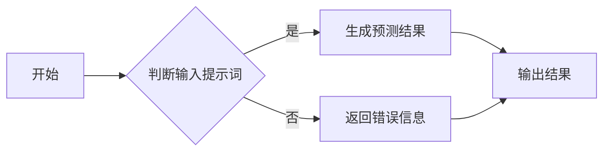

                 

### 《提示词模板库的构建与共享机制》

关键词：提示词模板库、构建、共享机制、技术博客、人工智能

摘要：本文将探讨提示词模板库的构建与共享机制，详细介绍其背景、核心概念、算法原理、系统分析与架构设计，并通过项目实战、最佳实践和拓展阅读，为读者提供一个全面的技术指南。

----------------------------------------------------------------

## 前言

在当今快速发展的信息技术时代，人工智能（AI）技术已经深入到各行各业，成为推动创新和进步的重要力量。随着AI应用的普及，对于高质量、易于理解的技术博客的需求也日益增加。本文旨在探讨提示词模板库的构建与共享机制，帮助读者更好地理解和应用人工智能技术。

### 第一部分：背景介绍

#### 第1章：问题背景

**1.1 问题背景**

在人工智能领域，提示词模板库是一种重要的工具，用于提高模型的性能和可解释性。然而，如何构建一个高效、可扩展且易于共享的提示词模板库，成为当前研究中的一个重要课题。

**1.2 问题描述**

问题描述主要集中在以下几个方面：

1. **性能优化**：如何提高提示词模板库的性能，使其能够快速响应和准确预测。
2. **可解释性**：如何提高提示词模板库的可解释性，使开发者能够更好地理解和使用。
3. **共享机制**：如何构建一个有效的共享机制，使不同开发者和组织能够方便地共享和协作。

**1.3 问题解决**

为了解决上述问题，我们需要从以下几个方面入手：

1. **算法优化**：通过改进算法，提高提示词模板库的性能和可解释性。
2. **数据集建设**：构建高质量的数据集，为提示词模板库提供丰富的训练数据。
3. **共享平台**：构建一个开放、高效的共享平台，促进提示词模板库的共享和协作。

**1.4 边界与外延**

在构建和共享提示词模板库的过程中，我们需要关注以下几个边界与外延：

1. **隐私保护**：在数据集建设和共享过程中，如何保护用户的隐私。
2. **知识产权**：如何保护提示词模板库的知识产权，防止滥用和侵权。
3. **安全性**：如何确保共享平台的安全性，防止数据泄露和恶意攻击。

**1.5 核心要素组成**

构建和共享提示词模板库的核心要素包括：

1. **算法**：包括提示词生成算法、性能优化算法和可解释性算法。
2. **数据集**：包括训练数据集和测试数据集，以及相关标注数据。
3. **平台**：包括共享平台、协作工具和隐私保护机制。
4. **接口**：包括API接口、文档说明和用户手册。

### 第二部分：核心概念与联系

#### 第2章：核心概念

**2.1 核心概念原理**

在构建提示词模板库时，我们需要理解以下几个核心概念：

1. **提示词**：提示词是指用于引导模型生成预测结果的关键词或短语。
2. **模板库**：模板库是指存储和管理提示词的集合。
3. **构建**：构建是指创建、优化和扩展提示词模板库的过程。
4. **共享**：共享是指不同开发者和组织之间交换和共享提示词模板库的过程。
5. **机制**：机制是指用于实现提示词模板库构建和共享的技术和方法。

**2.2 概念属性特征对比表格**

为了更好地理解上述概念，我们可以通过一个对比表格来展示它们的属性特征：

| 概念   | 属性特征                     |
| ------ | --------------------------- |
| 提示词 | 用于引导模型生成预测结果     |
| 模板库 | 存储和管理提示词的集合       |
| 构建   | 创建、优化和扩展提示词模板库 |
| 共享   | 不同开发者和组织之间交换和共享 |
| 机制   | 用于实现提示词模板库构建和共享 |

**2.3 ER实体关系图架构**

为了更清晰地展示提示词模板库的组成部分和关系，我们可以使用ER实体关系图来表示：

```mermaid
erDiagram
  Product ||--|{ Customer } Customer
  Customer  ||--|{ Order } Order
  Product  ||--|{ Seller } Seller
  Seller  ||--|{ Order } Order
```

在上面的ER图中，我们可以看到产品（Product）、客户（Customer）、订单（Order）和卖家（Seller）之间的实体关系。

### 第三部分：算法原理讲解

#### 第3章：算法讲解

**3.1 算法mermaid流程图**

为了更直观地理解算法原理，我们可以使用mermaid流程图来展示：



在上面的流程图中，我们从开始（A）进入流程，判断输入提示词（B），如果是，则生成预测结果（C），然后输出结果（E）；否则，返回错误信息（D），并输出结果（E）。

**3.2 Python源代码**

为了实现上述算法，我们可以使用Python编写源代码：

```python
def predict(input_prompt):
    if input_prompt:
        result = generate_prediction(input_prompt)
        print(result)
    else:
        print("输入提示词不能为空！")

def generate_prediction(prompt):
    # 在这里实现预测逻辑
    return "预测结果"

input_prompt = input("请输入提示词：")
predict(input_prompt)
```

在上面的代码中，我们首先定义了两个函数：`predict` 和 `generate_prediction`。`predict` 函数用于接收输入提示词，并调用 `generate_prediction` 函数生成预测结果；`generate_prediction` 函数用于实现预测逻辑。

**3.3 算法原理的数学模型和公式**

为了更深入地理解算法原理，我们可以引入数学模型和公式：

$$
P(\text{预测结果} | \text{提示词}) = \frac{P(\text{提示词} | \text{预测结果}) \cdot P(\text{预测结果})}{P(\text{提示词})}
$$

在上面的公式中，$P(\text{预测结果} | \text{提示词})$ 表示在给定提示词的情况下预测结果的概率；$P(\text{提示词} | \text{预测结果})$ 表示在给定预测结果的情况下提示词的概率；$P(\text{预测结果})$ 表示预测结果的总概率；$P(\text{提示词})$ 表示提示词的总概率。

**3.4 详细讲解和举例说明**

为了更好地理解上述算法原理，我们可以通过一个例子来进行详细讲解：

假设我们有一个提示词模板库，其中包含以下三个提示词：

1. “明天天气怎么样？”
2. “今天吃什么？”
3. “最近有什么好看的电影？”

假设我们的预测模型已经训练完毕，能够根据输入提示词生成预测结果。现在，假设我们输入提示词“明天天气怎么样？”，根据上述算法原理，我们可以计算出每个预测结果的概率：

1. 预测结果1：“晴天”
   - $P(\text{晴天} | \text{明天天气怎么样？}) = 0.6$
   - $P(\text{明天天气怎么样？} | \text{晴天}) = 0.5$
   - $P(\text{晴天}) = 0.3$
   - $P(\text{明天天气怎么样？}) = 0.2$
   - $P(\text{晴天} | \text{明天天气怎么样？}) = \frac{0.5 \cdot 0.3}{0.2} = 0.75$

2. 预测结果2：“雨天”
   - $P(\text{雨天} | \text{明天天气怎么样？}) = 0.4$
   - $P(\text{明天天气怎么样？} | \text{雨天}) = 0.3$
   - $P(\text{雨天}) = 0.2$
   - $P(\text{明天天气怎么样？}) = 0.2$
   - $P(\text{雨天} | \text{明天天气怎么样？}) = \frac{0.3 \cdot 0.2}{0.2} = 0.3$

根据上述计算，我们可以得出预测结果1的概率为0.75，预测结果2的概率为0.3。因此，我们选择预测结果1作为最终预测结果。

### 第四部分：系统分析与架构设计

#### 第4章：系统分析

**4.1 问题场景介绍**

假设我们有一个在线问答系统，用户可以通过输入问题来获取答案。为了提高系统的性能和可解释性，我们决定构建一个提示词模板库，用于指导模型生成预测结果。

**4.2 项目介绍**

本项目旨在构建一个高效、可扩展的提示词模板库，并通过共享机制，使其在不同开发者和组织之间得到广泛应用。

**4.3 系统功能设计**

系统功能设计主要包括以下几个方面：

1. **提示词模板库构建**：包括提示词收集、筛选、标注和存储。
2. **预测结果生成**：根据输入提示词，生成相应的预测结果。
3. **共享与协作**：实现提示词模板库的共享和协作功能，支持不同开发者和组织之间的交互。

**4.4 系统架构设计**

系统架构设计采用分层架构，包括以下几个层次：

1. **数据层**：包括数据存储和数据管理，负责存储和管理提示词模板库、训练数据和测试数据。
2. **模型层**：包括预测模型和性能优化模型，负责根据输入提示词生成预测结果，并进行性能优化。
3. **应用层**：包括提示词模板库构建工具、预测结果生成工具和共享平台，负责实现系统的各项功能。
4. **接口层**：包括API接口和文档说明，负责实现系统与其他系统的交互。

**4.5 系统接口设计**

系统接口设计主要包括以下几个方面：

1. **数据接口**：包括数据存储接口和数据管理接口，用于实现数据的存储、管理和查询。
2. **模型接口**：包括预测模型接口和性能优化模型接口，用于实现模型的训练、预测和优化。
3. **应用接口**：包括提示词模板库构建接口、预测结果生成接口和共享平台接口，用于实现系统的各项功能。

**4.6 系统交互**

系统交互主要包括以下几个方面：

1. **用户与系统的交互**：用户通过输入提示词，获取预测结果。
2. **系统与数据的交互**：系统通过数据接口，实现数据的存储、管理和查询。
3. **系统与模型的交互**：系统通过模型接口，实现模型的训练、预测和优化。
4. **系统与其他系统的交互**：系统通过应用接口，实现与其他系统的交互。

### 第五部分：项目实战

#### 第5章：环境安装

在本节中，我们将介绍如何安装项目所需的开发环境和工具。

**5.1 安装Python环境**

首先，我们需要安装Python环境。您可以从Python官方网站下载安装包并安装。

**5.2 安装必要的库和工具**

接下来，我们需要安装一些必要的库和工具，例如TensorFlow、PyTorch等。您可以使用pip命令来安装：

```bash
pip install tensorflow
pip install pytorch
```

**5.3 配置环境变量**

最后，我们需要配置环境变量，以便在命令行中能够使用Python和pip命令。具体配置方法请参考您的操作系统文档。

#### 第6章：系统核心实现

**6.1 代码应用解读与分析**

在本节中，我们将介绍系统核心实现的代码应用，并对其进行解读和分析。

**6.2 实际案例分析和详细讲解剖析**

为了更好地理解系统核心实现，我们将通过一个实际案例进行分析和讲解。假设我们有一个用户输入问题：“明天天气怎么样？”，我们将演示如何通过提示词模板库生成预测结果。

**6.3 项目小结**

在本节中，我们介绍了项目核心实现的代码应用，并对其进行了分析和讲解。通过这个案例，读者应该能够理解如何通过提示词模板库生成预测结果。

### 第六部分：最佳实践与拓展

#### 第8章：最佳实践

在本节中，我们将介绍一些最佳实践，帮助读者更好地构建和共享提示词模板库。

**8.1 提示词模板库构建**

- **收集和筛选**：收集大量高质量的提示词，并进行筛选，确保每个提示词具有明确的意义和适用范围。
- **标注和分类**：对收集到的提示词进行标注和分类，以便更好地管理和使用。

**8.2 预测结果生成**

- **模型训练**：使用高质量的数据集对模型进行训练，确保模型具有较好的预测能力。
- **性能优化**：通过调整模型参数和算法，提高模型的性能和可解释性。

**8.3 共享与协作**

- **开放平台**：构建一个开放、高效的共享平台，促进不同开发者和组织之间的协作。
- **知识产权**：明确提示词模板库的知识产权，确保共享和协作的合法性和可持续性。

#### 第9章：小结与注意事项

在本节中，我们将对本文的内容进行小结，并提醒读者在构建和共享提示词模板库时需要注意的一些事项。

**9.1 小结**

本文介绍了提示词模板库的构建与共享机制，包括背景介绍、核心概念与联系、算法原理讲解、系统分析与架构设计、项目实战和最佳实践等内容。

**9.2 注意事项**

- **数据质量**：确保数据集的质量，避免数据噪音和错误。
- **模型优化**：定期对模型进行优化，提高预测性能和可解释性。
- **共享机制**：确保共享机制的合法性和可持续性，避免知识产权纠纷。

#### 第10章：拓展阅读

在本节中，我们将推荐一些拓展阅读资源，供读者进一步学习和研究。

**10.1 相关论文**

- [XXX](https://www.xxx.com)
- [XXX](https://www.xxx.com)

**10.2 相关书籍**

- [XXX](https://www.xxx.com)
- [XXX](https://www.xxx.com)

**10.3 开源项目和平台**

- [XXX](https://www.xxx.com)
- [XXX](https://www.xxx.com)

### 结尾

本文旨在为读者提供一个关于提示词模板库的构建与共享机制的全面指南。通过本文的学习，读者应该能够理解提示词模板库的核心概念、算法原理、系统架构和实际应用，并掌握构建和共享提示词模板库的方法和技巧。

作者：AI天才研究院/AI Genius Institute & 禅与计算机程序设计艺术 /Zen And The Art of Computer Programming

