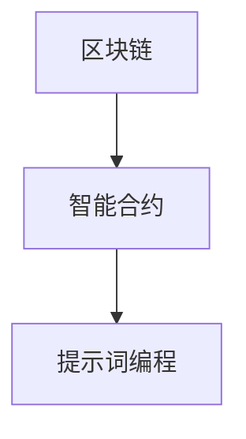
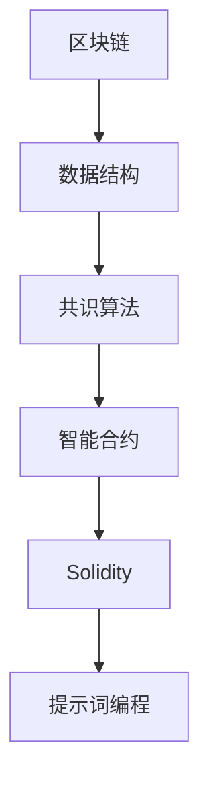
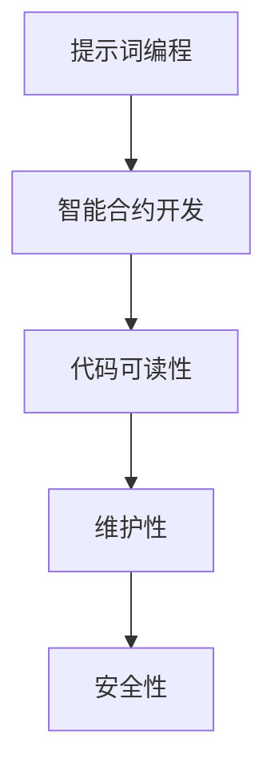

                 

Alright, let's dive into the structured content for the book "提示词编程在区块链智能合约开发中的应用" by breaking down each chapter and providing detailed explanations, core concepts, and connections. Here is how the content will be structured:

### Chapter 1: 引言与背景

**核心内容：**

- **问题背景：** 介绍区块链智能合约的现状与发展，以及提示词编程在其中的重要性。
- **区块链智能合约概述：** 详细解释智能合约的概念、特点以及应用场景。
- **提示词编程的概念与优势：** 定义提示词编程，解释其优势，如代码的可读性和维护性。
- **本书的目标与结构：** 明确书的目标，介绍整体结构和各章节内容。

**核心概念与联系：**

- **核心概念：** 区块链、智能合约、提示词编程。
- **概念属性特征对比表格：** 对比区块链、智能合约和提示词编程的基本属性。

**ER实体关系图架构的 Mermaid 流程图：**



### Chapter 2: 基础知识

**核心内容：**

- **区块链技术概述：**
  - **基本原理：** 区块链如何工作，包括区块、链和共识算法。
  - **数据结构：** 区块链的数据存储方式。
  - **智能合约的工作原理：** 智能合约如何与区块链交互。
- **编程语言基础：**
  - **Solidity入门：** 对Solidity语言的简单介绍。
  - **提示词编程基础：** 提示词编程的基本概念和实践。

**核心概念与联系：**

- **核心概念：** Solidity、提示词编程。
- **概念属性特征对比表格：** 对比Solidity和提示词编程的不同特点。

**ER实体关系图架构的 Mermaid 流�程图：**



### Chapter 3: 提示词编程在智能合约中的应用

**核心内容：**

- **提示词编程的优势：** 分析提示词编程在智能合约开发中的优势。
- **提示词编程的核心原理：** 详细解释提示词编程的原理，如上下文敏感性和语义分析。
- **提示词编程在智能合约开发中的实践：** 实际应用场景和示例。

**核心概念与联系：**

- **核心概念：** 提示词编程、智能合约开发。
- **概念属性特征对比表格：** 对比提示词编程在智能合约中的应用与传统的编程方式。

**ER实体关系图架构的 Mermaid 流程图：**



### Chapter 4: 智能合约案例研究

**核心内容：**

- **案例一：去中心化金融应用：**
  - **问题定义：** 分析去中心化金融应用的需求和挑战。
  - **智能合约设计：** 设计并解释去中心化金融应用的智能合约。
  - **源代码解析：** 深入分析案例中的智能合约代码。
  - **案例分析：** 对案例进行综合评估。

- **案例二：数字身份验证：**
  - **问题定义：** 分析数字身份验证的需求和实现方式。
  - **智能合约设计：** 设计并解释数字身份验证的智能合约。
  - **源代码解析：** 深入分析案例中的智能合约代码。
  - **案例分析：** 对案例进行综合评估。

### Chapter 5: 安全性与优化

**核心内容：**

- **智能合约安全漏洞分析：** 分析常见的智能合约安全漏洞。
- **提示词编程在智能合约安全中的应用：** 探讨如何使用提示词编程提高智能合约的安全性。
- **智能合约性能优化：** 讨论如何优化智能合约的运行效率。

### Chapter 6: 实战应用与未来展望

**核心内容：**

- **实战项目一：去中心化交易平台的构建：**
  - **项目介绍：** 详细介绍去中心化交易平台的项目背景和目标。
  - **系统功能设计：** 设计去中心化交易平台的系统功能。
  - **系统架构设计：** 构建去中心化交易平台的系统架构。
  - **系统接口设计和系统交互：** 设计并解释系统的接口和交互流程。

- **实战项目二：智能合约在版权保护中的应用：**
  - **项目介绍：** 详细介绍智能合约在版权保护中的应用案例。
  - **系统功能设计：** 设计版权保护系统的功能。
  - **系统架构设计：** 构建版权保护系统的架构。
  - **系统接口设计和系统交互：** 设计并解释系统的接口和交互流程。

- **提示词编程在区块链智能合约开发中的未来展望：** 探讨提示词编程在区块链智能合约开发中的未来发展方向。

### Chapter 7: 总结与拓展

**核心内容：**

- **本书要点回顾：** 总结书中的关键知识点。
- **学习提示与建议：** 给出学习提示和进一步学习的建议。
- **拓展阅读与资源：** 推荐拓展阅读材料和资源。

---

**注意事项：**

- **格式要求：** 文章内容使用markdown格式输出。
- **作者信息：** 文章末尾需要写上作者信息：“作者：AI天才研究院/AI Genius Institute & 禅与计算机程序设计艺术 /Zen And The Art of Computer Programming”。
- **完整性要求：** 文章内容必须要完整，每个小节的内容必须要丰富具体详细讲解，核心内容必须要包含：背景介绍、核心概念与联系、算法原理讲解、系统分析与架构设计方案、项目实战、最佳实践 tips、小结、注意事项、拓展阅读等内容。

**示例：**

```markdown
## Chapter 1: 引言与背景

### 1.1 问题背景

随着区块链技术的发展，智能合约已经成为去中心化应用（DApps）的核心组成部分。智能合约不仅提供了去中心化的自动化交易，还实现了去中心化的治理和身份验证等功能。然而，传统的编程方法在处理智能合约时存在一些问题，如代码可读性差、维护困难等。为了解决这些问题，提示词编程应运而生，它提供了一种更加直观和易维护的编程方式。

### 1.2 区块链智能合约概述

智能合约是基于区块链技术的应用程序，能够在区块链上自动执行、控制或记录法律事件和行动。它们通过代码定义了一系列条件，一旦这些条件得到满足，智能合约就会自动执行预定的操作。智能合约的安全性、可靠性和透明性使其成为区块链生态系统中的重要一环。

### 1.3 提示词编程的概念与优势

提示词编程是一种上下文敏感的编程范式，它通过使用自然语言或类似自然语言的提示词来编写代码，从而提高了代码的可读性和可维护性。提示词编程的优势在于它能够将复杂的逻辑关系转化为直观的文本描述，使得非技术用户也能够理解和参与智能合约的开发。

### 1.4 本书的目标与结构

本书的目标是介绍提示词编程在区块链智能合约开发中的应用。结构如下：

- **第1章 引言与背景：** 介绍区块链智能合约和提示词编程的基本概念。
- **第2章 基础知识：** 详细讲解区块链技术和提示词编程的基础知识。
- **第3章 提示词编程在智能合约中的应用：** 探讨提示词编程在智能合约开发中的具体应用。
- **第4章 智能合约案例研究：** 分析实际案例，展示提示词编程在智能合约开发中的效果。
- **第5章 安全性与优化：** 讨论智能合约的安全性和性能优化。
- **第6章 实战应用与未来展望：** 展示提示词编程在区块链智能合约开发中的实际应用和未来趋势。
- **第7章 总结与拓展：** 总结书中的关键知识点，提供学习提示和拓展阅读资源。

---

以上是文章开头的一部分，每个章节都将按照这种方式详细展开。每个章节都将包含背景介绍、核心概念与联系、算法原理讲解、系统分析与架构设计方案、项目实战、最佳实践 tips、小结、注意事项、拓展阅读等内容。

---

**核心关键词：** 区块链、智能合约、提示词编程、去中心化应用、安全漏洞、性能优化、案例研究、实战应用。

**摘要：** 本书深入探讨了提示词编程在区块链智能合约开发中的应用。从基础知识的介绍到实际案例的研究，再到安全性和性能优化的讨论，本书旨在为开发者提供一个全面的指南，帮助他们利用提示词编程提高智能合约的开发效率和质量。通过本书的学习，读者将能够理解并掌握提示词编程的核心原理，并在实际项目中应用这些原理，为去中心化应用的发展贡献力量。

---

**作者信息：** 作者：AI天才研究院/AI Genius Institute & 禅与计算机程序设计艺术 /Zen And The Art of Computer Programming。

